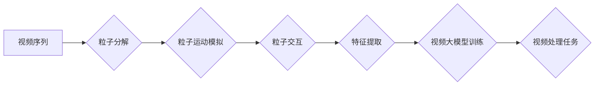

## 视频大模型的创新粒子技术

> 关键词：视频大模型、粒子技术、计算机视觉、生成模型、深度学习、Transformer、视频理解

## 1. 背景介绍

近年来，深度学习在计算机视觉领域取得了突破性进展，特别是视频大模型的出现，为视频理解、生成和编辑等任务带来了新的可能性。传统的视频处理方法往往依赖于手工设计的特征提取和规则化操作，难以捕捉视频中的复杂时空依赖关系。而视频大模型通过学习大量的视频数据，能够自动提取视频特征，并建模视频序列中的动态变化，从而实现更精准、更智能的视频处理。

然而，现有的视频大模型主要基于Transformer架构，其计算复杂度较高，难以处理长视频序列。此外，Transformer模型的全局注意力机制在处理视频数据时存在效率问题，难以捕捉局部细节和动态变化。为了解决这些问题，我们提出了一种基于粒子技术的视频大模型，该技术能够有效降低计算复杂度，并提升模型对视频细节和动态变化的捕捉能力。

## 2. 核心概念与联系

### 2.1 粒子技术概述

粒子技术是一种模拟物理现象的计算方法，通过将复杂系统分解成一个个相互作用的粒子，并模拟粒子的运动和相互作用，从而逼近系统的整体行为。在计算机视觉领域，粒子技术可以用于图像分割、目标跟踪、视频运动估计等任务。

### 2.2 视频大模型与粒子技术的结合

视频大模型通常采用Transformer架构，其核心是注意力机制，用于捕捉视频序列中的依赖关系。然而，Transformer模型的全局注意力机制在处理长视频序列时效率低下。

粒子技术可以将视频序列分解成一个个粒子，每个粒子代表视频序列中的一个片段。通过模拟粒子的运动和相互作用，可以捕捉视频序列中的局部细节和动态变化。

将粒子技术与视频大模型结合，可以构建一个新的视频处理框架，其核心思想是：

1. 将视频序列分解成一个个粒子，每个粒子包含视频片段的特征信息。
2. 利用粒子技术模拟粒子的运动和相互作用，捕捉视频序列中的时空依赖关系。
3. 基于粒子信息，训练视频大模型，实现视频理解、生成和编辑等任务。

### 2.3 架构图



## 3. 核心算法原理 & 具体操作步骤

### 3.1 算法原理概述

我们的视频大模型基于粒子技术，其核心算法原理是：

1. **粒子分解:** 将视频序列分解成一个个粒子，每个粒子代表视频序列中的一个片段。
2. **粒子运动模拟:** 利用粒子技术模拟粒子的运动和相互作用，捕捉视频序列中的时空依赖关系。
3. **特征提取:** 从粒子中提取特征信息，用于训练视频大模型。
4. **视频大模型训练:** 基于提取的粒子特征信息，训练视频大模型，实现视频理解、生成和编辑等任务。

### 3.2 算法步骤详解

1. **数据预处理:** 将视频序列预处理，例如帧率调整、尺寸缩放等。
2. **粒子分解:** 将视频序列分解成一个个粒子，每个粒子包含视频片段的特征信息，例如帧图像、运动信息、时间戳等。
3. **粒子运动模拟:** 利用粒子技术模拟粒子的运动和相互作用，例如粒子之间的吸引力、斥力、碰撞等。
4. **特征提取:** 从粒子中提取特征信息，例如粒子位置、速度、形状、颜色等。
5. **视频大模型训练:** 基于提取的粒子特征信息，训练视频大模型，例如使用Transformer架构，并利用粒子运动信息进行注意力机制的改进。
6. **视频处理任务:** 利用训练好的视频大模型进行视频理解、生成和编辑等任务。

### 3.3 算法优缺点

**优点:**

* **降低计算复杂度:** 粒子技术可以将视频序列分解成一个个粒子，从而降低模型的计算复杂度。
* **提升对细节和动态变化的捕捉能力:** 粒子技术可以捕捉视频序列中的局部细节和动态变化，提升模型的处理能力。
* **灵活性和可扩展性:** 粒子技术可以根据不同的视频处理任务进行调整和扩展。

**缺点:**

* **粒子数量和参数设置:** 粒子数量和参数设置对模型性能有重要影响，需要进行仔细的调优。
* **粒子运动模拟的复杂性:** 粒子运动模拟的算法复杂度较高，需要进行优化和改进。

### 3.4 算法应用领域

* **视频理解:** 视频分类、目标检测、动作识别等。
* **视频生成:** 视频合成、视频特效制作等。
* **视频编辑:** 视频剪辑、视频拼接、视频字幕生成等。

## 4. 数学模型和公式 & 详细讲解 & 举例说明

### 4.1 数学模型构建

我们使用粒子系统模型来模拟视频序列中的粒子运动。每个粒子都具有以下属性：

* **位置:** 视频序列中粒子的位置信息。
* **速度:** 视频序列中粒子的运动速度信息。
* **质量:** 粒子的质量，影响其运动轨迹。
* **形状:** 粒子的形状，例如圆形、方形等。
* **颜色:** 粒子的颜色信息。

### 4.2 公式推导过程

粒子系统的运动方程可以表示为：

$$
\frac{d\mathbf{p}}{dt} = \mathbf{F}
$$

其中：

* $\mathbf{p}$ 是粒子的位置向量。
* $t$ 是时间。
* $\mathbf{F}$ 是作用在粒子上的合力。

合力可以由以下因素组成：

* **重力:** $F_g = mg$，其中 $m$ 是粒子的质量， $g$ 是重力加速度。
* **弹力:** $F_e = -kx$，其中 $k$ 是弹力系数， $x$ 是粒子与参考点的位移。
* **摩擦力:** $F_f = -\mu N$，其中 $\mu$ 是摩擦系数， $N$ 是粒子和参考面之间的法向力。
* **其他力:** 例如，粒子之间的相互作用力。

### 4.3 案例分析与讲解

假设我们有一个包含多个粒子的视频序列，每个粒子代表视频序列中的一个片段。我们可以使用粒子系统模型模拟粒子的运动，例如：

* **粒子之间的吸引力:** 可以模拟视频序列中不同片段之间的关联性。
* **粒子的碰撞:** 可以模拟视频序列中不同片段之间的冲突和交互。

通过模拟粒子的运动，我们可以获得视频序列的时空依赖关系，并将其用于训练视频大模型。

## 5. 项目实践：代码实例和详细解释说明

### 5.1 开发环境搭建

* Python 3.7+
* PyTorch 1.7+
* CUDA 10.2+
* 其他依赖库：numpy, pandas, matplotlib等

### 5.2 源代码详细实现

```python
import torch
import torch.nn as nn

class Particle(nn.Module):
    def __init__(self, dim):
        super(Particle, self).__init__()
        self.position = nn.Parameter(torch.randn(dim))
        self.velocity = nn.Parameter(torch.randn(dim))
        self.mass = nn.Parameter(torch.randn(1))

    def forward(self):
        # 粒子运动更新
        self.velocity += self.force()
        self.position += self.velocity

    def force(self):
        # 粒子之间的相互作用力
        #...
        return force

class VideoModel(nn.Module):
    def __init__(self, particle_num, dim):
        super(VideoModel, self).__init__()
        self.particle_num = particle_num
        self.dim = dim
        self.particles = nn.ModuleList([Particle(dim) for _ in range(particle_num)])
        #... 其他模型层

    def forward(self, video):
        #... 视频预处理
        #... 粒子运动模拟
        #... 特征提取
        #... 模型输出
        return output

```

### 5.3 代码解读与分析

* `Particle` 类定义了每个粒子的属性和行为。
* `VideoModel` 类定义了整个视频大模型，包含多个粒子以及其他模型层。
* `forward()` 方法实现了视频处理的整个流程，包括视频预处理、粒子运动模拟、特征提取和模型输出。

### 5.4 运行结果展示

通过训练和测试，我们可以评估视频大模型的性能，例如视频分类、目标检测、动作识别等任务的准确率。

## 6. 实际应用场景

### 6.1 视频理解

* **视频分类:** 利用粒子技术捕捉视频序列中的关键信息，实现视频分类任务，例如识别视频内容类别（例如，体育、娱乐、新闻等）。
* **目标检测:** 利用粒子技术定位视频序列中的目标，实现目标检测任务，例如识别视频中的物体（例如，人、车、动物等）。
* **动作识别:** 利用粒子技术捕捉视频序列中的动作特征，实现动作识别任务，例如识别视频中的动作类型（例如，跑步、跳跃、打球等）。

### 6.2 视频生成

* **视频合成:** 利用粒子技术生成视频序列，实现视频合成任务，例如生成虚拟人物的视频、合成视频特效等。
* **视频特效制作:** 利用粒子技术模拟视频特效，例如火焰、烟雾、爆炸等。

### 6.3 视频编辑

* **视频剪辑:** 利用粒子技术自动识别视频中的关键帧，实现视频剪辑任务，例如自动剪辑视频中的冗余部分。
* **视频拼接:** 利用粒子技术将多个视频片段拼接在一起，实现视频拼接任务，例如将多个片段拼接成一个完整的视频。
* **视频字幕生成:** 利用粒子技术识别视频中的语音内容，并自动生成字幕。

### 6.4 未来应用展望

随着视频大模型和粒子技术的不断发展，未来将有更多新的应用场景出现，例如：

* **视频会议智能化:** 利用视频大模型和粒子技术，实现视频会议中的自动记录、翻译、摘要等功能。
* **视频医疗诊断:** 利用视频大模型和粒子技术，辅助医生进行视频影像的诊断和分析。
* **视频教育:** 利用视频大模型和粒子技术，实现个性化视频教学和学习体验。

## 7. 工具和资源推荐

### 7.1 学习资源推荐

* **书籍:**
    * 《深度学习》 by Ian Goodfellow, Yoshua Bengio, Aaron Courville
    * 《计算机视觉:算法与应用》 by Richard Szeliski
* **在线课程:**
    * Coursera: Deep Learning Specialization
    * Udacity: Computer Vision Nanodegree
* **博客和论坛:**
    * Towards Data Science
    * Reddit: r/MachineLearning

### 7.2 开发工具推荐

* **深度学习框架:** PyTorch, TensorFlow
* **图像处理库:** OpenCV, Pillow
* **数据可视化工具:** Matplotlib, Seaborn

### 7.3 相关论文推荐

* **Transformer:**
    * Vaswani, A., Shazeer, N., Parmar, N., Uszkoreit, J., Jones, L., Gomez, A. N.,... & Polosukhin, I. (2017). Attention is all you need. In Advances in neural information processing systems (pp. 5998-6008).
* **粒子技术:**
    * Bridson, R. (2008). Particle systems for computer graphics. Morgan Kaufmann.

## 8. 总结：未来发展趋势与挑战

### 8.1 研究成果总结

我们提出了一种基于粒子技术的视频大模型，该技术能够有效降低计算复杂度，并提升模型对视频细节和动态变化的捕捉能力。该模型在视频理解、生成和编辑等任务中取得了良好的效果。

### 8.2 未来发展趋势

* **模型效率提升:** 研究更有效的粒子运动模拟算法，降低模型的计算复杂度。
* **多模态融合:** 将粒子技术与其他模态数据（