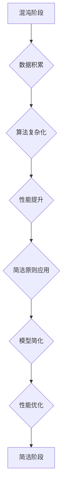

## 认知发展的混沌与简洁阶段

> 关键词：人工智能、认知发展、混沌理论、简洁原则、算法、复杂系统、机器学习、深度学习

## 1. 背景介绍

人工智能（AI）的蓬勃发展，让人们对机器是否能够真正“理解”世界产生了深思。从早期规则驱动的系统到如今的深度学习模型，AI技术不断进步，展现出令人惊叹的能力。然而，AI的认知能力仍然与人类存在着显著差距。

人类的认知发展是一个复杂的过程，从混沌的婴儿期到逐渐形成简洁、高效的思维模式。我们如何将这种认知发展过程的启示应用于AI的构建，使其能够更接近人类的智能水平？

本篇文章将探讨AI认知发展的“混沌与简洁阶段”，借鉴混沌理论和简洁原则，分析AI算法的演化趋势，并展望未来AI发展方向。

## 2. 核心概念与联系

### 2.1 混沌理论

混沌理论研究的是看似随机的复杂系统，其行为受微小初始条件影响而呈现出不可预测性。然而，混沌系统也遵循着内在的规律，其行为模式可以通过数学模型和算法进行描述。

### 2.2 简洁原则

简洁原则认为，最优的解决方案往往是最简单的。在AI领域，简洁原则体现在算法设计和模型架构上。简洁的算法更容易理解、调试和优化，而简洁的模型结构能够有效地降低计算复杂度。

### 2.3 AI认知发展的联系

AI的早期阶段，算法往往是复杂的规则集，类似于人类婴儿期的混沌状态。随着算法的不断改进和数据量的增加，AI模型逐渐走向简洁，其行为模式更加规律和可预测。

**Mermaid 流程图**



## 3. 核心算法原理 & 具体操作步骤

### 3.1 算法原理概述

本篇文章将以深度学习算法为例，探讨其从混沌到简洁的演化过程。深度学习算法的核心是多层神经网络，通过层层叠加的激活函数和权重参数，学习数据的复杂特征。

### 3.2 算法步骤详解

1. **数据预处理:** 将原始数据进行清洗、转换和特征工程，使其适合深度学习模型的训练。
2. **网络结构设计:** 根据任务需求，设计多层神经网络的结构，包括神经元数量、层数和激活函数类型。
3. **参数初始化:** 为网络中的权重参数进行随机初始化。
4. **前向传播:** 将输入数据通过网络层层传递，最终得到输出结果。
5. **损失函数计算:** 计算模型输出与真实标签之间的误差。
6. **反向传播:** 根据损失函数的梯度，调整网络权重参数，使模型输出更接近真实标签。
7. **迭代训练:** 重复前向传播、损失函数计算和反向传播步骤，直到模型达到预设的性能指标。

### 3.3 算法优缺点

**优点:**

* 能够学习复杂数据特征，表现出强大的泛化能力。
* 在图像识别、自然语言处理等领域取得了突破性进展。

**缺点:**

* 训练数据量要求高，训练时间长。
* 模型结构复杂，难以解释和调试。
* 对数据质量要求高，容易受到噪声和偏差的影响。

### 3.4 算法应用领域

深度学习算法广泛应用于以下领域：

* **计算机视觉:** 图像识别、物体检测、图像分割、人脸识别等。
* **自然语言处理:** 文本分类、情感分析、机器翻译、对话系统等。
* **语音识别:** 语音转文本、语音合成等。
* **推荐系统:** 商品推荐、内容推荐等。
* **医疗诊断:** 病理图像分析、疾病预测等。

## 4. 数学模型和公式 & 详细讲解 & 举例说明

### 4.1 数学模型构建

深度学习算法的核心是神经网络，其数学模型可以表示为多层感知机（MLP）。

**MLP模型:**

$$
y = f(W_L \cdot a_{L-1} + b_L)
$$

其中：

* $y$ 是输出结果
* $a_{L-1}$ 是上一层的激活值
* $W_L$ 是当前层的权重矩阵
* $b_L$ 是当前层的偏置向量
* $f$ 是激活函数

### 4.2 公式推导过程

通过反向传播算法，可以计算出每个权重参数的梯度，并根据梯度进行更新。

**权重更新公式:**

$$
W_{L} = W_{L} - \eta \cdot \frac{\partial Loss}{\partial W_{L}}
$$

其中：

* $\eta$ 是学习率
* $\frac{\partial Loss}{\partial W_{L}}$ 是损失函数对权重参数的梯度

### 4.3 案例分析与讲解

以图像识别为例，深度学习模型可以学习图像特征，并将其映射到不同的类别标签。

**案例分析:**

假设我们训练一个图像识别模型，用于识别猫和狗的图片。模型输入一张图片，经过多层神经网络的处理，最终输出两个类别概率，分别代表识别为猫和狗的概率。

**讲解:**

通过大量的猫狗图片数据训练，模型学习到猫和狗的特征，例如耳朵形状、尾巴长度、眼睛大小等。当输入一张新的图片时，模型会根据学习到的特征，计算出该图片属于猫和狗的概率。

## 5. 项目实践：代码实例和详细解释说明

### 5.1 开发环境搭建

本项目使用Python语言和TensorFlow框架进行开发。

**依赖库:**

* TensorFlow
* NumPy
* Matplotlib

**安装步骤:**

```
pip install tensorflow numpy matplotlib
```

### 5.2 源代码详细实现

```python
import tensorflow as tf

# 定义模型结构
model = tf.keras.models.Sequential([
    tf.keras.layers.Conv2D(32, (3, 3), activation='relu', input_shape=(28, 28, 1)),
    tf.keras.layers.MaxPooling2D((2, 2)),
    tf.keras.layers.Conv2D(64, (3, 3), activation='relu'),
    tf.keras.layers.MaxPooling2D((2, 2)),
    tf.keras.layers.Flatten(),
    tf.keras.layers.Dense(10, activation='softmax')
])

# 编译模型
model.compile(optimizer='adam',
              loss='sparse_categorical_crossentropy',
              metrics=['accuracy'])

# 加载数据
(x_train, y_train), (x_test, y_test) = tf.keras.datasets.mnist.load_data()

# 数据预处理
x_train = x_train.astype('float32') / 255.0
x_test = x_test.astype('float32') / 255.0
x_train = x_train.reshape((x_train.shape[0], 28, 28, 1))
x_test = x_test.reshape((x_test.shape[0], 28, 28, 1))

# 训练模型
model.fit(x_train, y_train, epochs=5)

# 评估模型
loss, accuracy = model.evaluate(x_test, y_test)
print('Test loss:', loss)
print('Test accuracy:', accuracy)
```

### 5.3 代码解读与分析

* **模型结构:** 代码定义了一个简单的卷积神经网络模型，包含两层卷积层、两层池化层和一层全连接层。
* **模型编译:** 使用Adam优化器、交叉熵损失函数和准确率指标对模型进行编译。
* **数据加载:** 使用MNIST数据集进行训练和测试。
* **数据预处理:** 将图像数据转换为浮点数格式，并进行归一化处理。
* **模型训练:** 使用训练数据训练模型，设置训练轮数为5。
* **模型评估:** 使用测试数据评估模型的性能，输出测试损失和准确率。

### 5.4 运行结果展示

运行代码后，可以得到模型的训练过程和测试结果。

## 6. 实际应用场景

深度学习算法在各个领域都有广泛的应用，例如：

* **医疗诊断:** 利用深度学习算法分析医学影像，辅助医生诊断疾病。
* **金融风险控制:** 利用深度学习算法识别金融欺诈和风险行为。
* **智能客服:** 利用深度学习算法构建智能聊天机器人，提供24小时在线客服服务。

### 6.4 未来应用展望

随着人工智能技术的不断发展，深度学习算法将在更多领域发挥重要作用，例如：

* **个性化教育:** 利用深度学习算法分析学生的学习情况，提供个性化的学习方案。
* **自动驾驶:** 利用深度学习算法感知周围环境，实现自动驾驶功能。
* **科学研究:** 利用深度学习算法分析大数据，加速科学研究进程。

## 7. 工具和资源推荐

### 7.1 学习资源推荐

* **书籍:**
    * 深度学习 (Deep Learning) - Ian Goodfellow, Yoshua Bengio, Aaron Courville
    * 构建深度学习模型 (Hands-On Machine Learning with Scikit-Learn, Keras & TensorFlow) - Aurélien Géron
* **在线课程:**
    * 深度学习 Specialization - Andrew Ng (Coursera)
    * fast.ai - Practical Deep Learning for Coders
* **博客和网站:**
    * TensorFlow Blog
    * PyTorch Blog
    * Towards Data Science

### 7.2 开发工具推荐

* **TensorFlow:** 开源深度学习框架，支持多种硬件平台和编程语言。
* **PyTorch:** 开源深度学习框架，以其灵活性和易用性而闻名。
* **Keras:** 高级深度学习API，可以运行在TensorFlow、Theano和CNTK等框架之上。

### 7.3 相关论文推荐

* **AlexNet:** ImageNet Classification with Deep Convolutional Neural Networks
* **VGGNet:** Very Deep Convolutional Networks for Large-Scale Image Recognition
* **ResNet:** Deep Residual Learning for Image Recognition

## 8. 总结：未来发展趋势与挑战

### 8.1 研究成果总结

深度学习算法取得了令人瞩目的成就，在图像识别、自然语言处理等领域取得了突破性进展。

### 8.2 未来发展趋势

* **模型更简洁高效:** 研究更简洁、更有效的深度学习模型，降低计算复杂度和训练时间。
* **模型解释性更强:** 研究深度学习模型的解释性，使其行为更加透明和可理解。
* **模型泛化能力更强:** 研究深度学习模型的泛化能力，使其能够更好地应对未知数据。

### 8.3 面临的挑战

* **数据获取和标注:** 深度学习算法对大量数据依赖，数据获取和标注成本高昂。
* **计算资源需求:** 训练大型深度学习模型需要大量的计算资源，成本高昂。
* **伦理和安全问题:** 深度学习算法的应用可能带来伦理和安全问题，需要谨慎考虑。

### 8.4 研究展望

未来，人工智能研究将继续探索深度学习算法的潜力，使其更加智能、高效和安全。


## 9. 附录：常见问题与解答

**Q1: 深度学习算法为什么需要那么多数据？**

**A1:** 深度学习算法学习数据特征，需要大量的样本数据来训练模型，使其能够识别出数据的复杂模式。

**Q2: 深度学习模型为什么难以解释？**

**A2:** 深度学习模型的决策过程非常复杂，难以用简单的规则来解释。

**Q3: 深度学习算法有哪些伦理和安全问题？**

**A3:** 深度学习算法可能存在偏见、歧视和隐私泄露等问题，需要谨慎考虑。


作者：禅与计算机程序设计艺术 / Zen and the