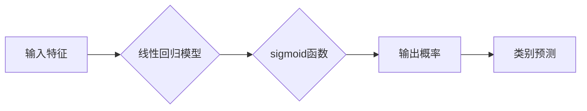

## 逻辑回归(Logistic Regression) - 原理与代码实例讲解

> 关键词：逻辑回归、线性回归、sigmoid函数、分类模型、机器学习、概率模型、Python、scikit-learn

## 1. 背景介绍

在机器学习领域，分类问题占据着重要地位。分类问题旨在将数据点划分为预定义的类别。例如，判断电子邮件是否为垃圾邮件、识别图像中的物体、预测客户是否会购买商品等。线性回归虽然在回归问题上表现出色，但它无法直接解决分类问题，因为其输出值可以是任意实数，而分类问题需要的是离散的类别标签。

为了解决这一问题，逻辑回归应运而生。逻辑回归是一种广义线性模型，它将线性回归模型的输出映射到0到1之间的概率区间，从而实现对分类问题的预测。由于其简单易懂、易于实现和解释，逻辑回归在许多实际应用中都取得了成功。

## 2. 核心概念与联系

逻辑回归的核心概念是将线性回归模型的输出通过sigmoid函数进行非线性变换，从而将输出值映射到0到1之间的概率区间。

**Mermaid 流程图:**



**核心概念解释:**

* **输入特征:**  逻辑回归模型接受一系列特征作为输入，这些特征可以是连续的或离散的。
* **线性回归模型:**  逻辑回归模型的核心是线性回归模型，它计算输入特征的线性组合。
* **sigmoid函数:**  sigmoid函数将线性回归模型的输出值映射到0到1之间的概率区间。
* **输出概率:**  sigmoid函数的输出值代表了数据点属于特定类别的概率。
* **类别预测:**  根据输出概率，逻辑回归模型预测数据点所属的类别。

## 3. 核心算法原理 & 具体操作步骤

### 3.1  算法原理概述

逻辑回归模型的核心思想是利用sigmoid函数将线性回归模型的输出映射到概率区间，从而实现对分类问题的预测。

**sigmoid函数:**

$$
\sigma(z) = \frac{1}{1 + e^{-z}}
$$

其中，z是线性回归模型的输出值。sigmoid函数的输出值在0到1之间，可以解释为数据点属于特定类别的概率。

**损失函数:**

逻辑回归模型通常使用交叉熵损失函数来衡量模型预测结果与真实标签之间的差异。

$$
L = -\frac{1}{N} \sum_{i=1}^{N} y_i \log(\hat{y}_i) + (1-y_i) \log(1-\hat{y}_i)
$$

其中，N是样本数量，$y_i$是真实标签，$\hat{y}_i$是模型预测的概率。

**优化算法:**

逻辑回归模型的训练过程通常使用梯度下降算法来最小化损失函数。

### 3.2  算法步骤详解

1. **数据预处理:**  对输入数据进行清洗、转换和特征工程，例如处理缺失值、编码类别特征等。
2. **模型初始化:**  随机初始化模型参数，例如权重和偏置。
3. **前向传播:**  将输入特征输入到模型中，计算线性回归模型的输出值，然后通过sigmoid函数将其映射到概率区间。
4. **损失函数计算:**  使用交叉熵损失函数计算模型预测结果与真实标签之间的差异。
5. **反向传播:**  计算损失函数对模型参数的梯度。
6. **参数更新:**  使用梯度下降算法更新模型参数，以最小化损失函数。
7. **迭代训练:**  重复步骤3到6，直到模型收敛或达到预设的训练轮数。
8. **模型评估:**  使用测试集评估模型的性能，例如计算准确率、召回率、F1-score等。

### 3.3  算法优缺点

**优点:**

* **简单易懂:**  逻辑回归模型的原理和实现都比较简单，易于理解和解释。
* **易于实现:**  逻辑回归模型可以使用现有的机器学习库轻松实现。
* **高效训练:**  逻辑回归模型的训练速度相对较快。
* **可解释性强:**  逻辑回归模型的权重可以解释为特征对分类的影响程度。

**缺点:**

* **假设线性关系:**  逻辑回归模型假设特征与类别之间存在线性关系，这在实际应用中可能不总是成立。
* **容易过拟合:**  当训练数据量较小时，逻辑回归模型容易过拟合。
* **处理高维特征困难:**  当特征数量过多时，逻辑回归模型的性能可能会下降。

### 3.4  算法应用领域

逻辑回归模型广泛应用于以下领域:

* **文本分类:**  例如垃圾邮件过滤、情感分析、主题分类等。
* **图像识别:**  例如物体检测、图像分割等。
* **金融领域:**  例如信用风险评估、欺诈检测等。
* **医疗领域:**  例如疾病诊断、患者风险预测等。

## 4. 数学模型和公式 & 详细讲解 & 举例说明

### 4.1  数学模型构建

逻辑回归模型的数学模型可以表示为:

$$
\hat{y} = \sigma(z) = \sigma(w^T x + b)
$$

其中:

* $\hat{y}$ 是模型预测的概率。
* $z$ 是线性回归模型的输出值。
* $w$ 是模型参数，即权重向量。
* $x$ 是输入特征向量。
* $b$ 是模型参数，即偏置项。

### 4.2  公式推导过程

逻辑回归模型的目标是最大化似然函数，即找到最优的模型参数，使得模型预测结果与真实标签之间的差异最小。

似然函数可以表示为:

$$
L(w, b) = \prod_{i=1}^{N} \hat{y}_i^{y_i} (1-\hat{y}_i)^{(1-y_i)}
$$

其中:

* $N$ 是样本数量。
* $y_i$ 是真实标签。
* $\hat{y}_i$ 是模型预测的概率。

为了方便计算，通常使用对数似然函数:

$$
l(w, b) = \log L(w, b) = \sum_{i=1}^{N} y_i \log(\hat{y}_i) + (1-y_i) \log(1-\hat{y}_i)
$$

通过梯度下降算法，可以迭代更新模型参数，以最大化对数似然函数。

### 4.3  案例分析与讲解

假设我们有一个二分类问题，需要判断邮件是否为垃圾邮件。我们收集了1000封邮件的训练数据，其中500封是垃圾邮件，500封不是垃圾邮件。

我们使用逻辑回归模型训练这个分类器。训练完成后，我们可以使用测试集来评估模型的性能。假设测试集中有100封邮件，模型预测了90封邮件的类别正确。

那么，模型的准确率为90%。

## 5. 项目实践：代码实例和详细解释说明

### 5.1  开发环境搭建

* Python 3.6+
* scikit-learn

### 5.2  源代码详细实现

```python
import pandas as pd
from sklearn.model_selection import train_test_split
from sklearn.linear_model import LogisticRegression
from sklearn.metrics import accuracy_score

# 加载数据
data = pd.read_csv('spam.csv')

# 数据预处理
data = data.drop(['Unnamed: 2', 'Unnamed: 3', 'Unnamed: 4'], axis=1)
data['spam'] = data['spam'].map({'ham': 0,'spam': 1})

# 划分训练集和测试集
X = data.drop('spam', axis=1)
y = data['spam']
X_train, X_test, y_train, y_test = train_test_split(X, y, test_size=0.2, random_state=42)

# 创建逻辑回归模型
model = LogisticRegression()

# 训练模型
model.fit(X_train, y_train)

# 预测测试集
y_pred = model.predict(X_test)

# 计算准确率
accuracy = accuracy_score(y_test, y_pred)
print(f'准确率: {accuracy}')
```

### 5.3  代码解读与分析

* **数据加载和预处理:**  代码首先加载数据，然后进行数据预处理，例如删除不需要的列、编码类别特征等。
* **数据划分:**  代码将数据划分为训练集和测试集，用于训练和评估模型。
* **模型创建:**  代码创建了一个逻辑回归模型实例。
* **模型训练:**  代码使用训练集训练模型。
* **模型预测:**  代码使用测试集预测模型的输出结果。
* **模型评估:**  代码计算模型的准确率，以评估模型的性能。

### 5.4  运行结果展示

运行上述代码后，会输出模型的准确率。

## 6. 实际应用场景

逻辑回归模型在许多实际应用场景中都取得了成功，例如:

* **垃圾邮件过滤:**  逻辑回归模型可以根据邮件内容的特征，判断邮件是否为垃圾邮件。
* **客户流失预测:**  逻辑回归模型可以根据客户的行为特征，预测客户是否会流失。
* **疾病诊断:**  逻辑回归模型可以根据患者的症状特征，预测患者是否患有某种疾病。

### 6.4  未来应用展望

随着机器学习技术的不断发展，逻辑回归模型的应用场景将会更加广泛。例如:

* **个性化推荐:**  逻辑回归模型可以根据用户的行为特征，推荐个性化的商品或服务。
* **欺诈检测:**  逻辑回归模型可以根据交易行为的特征，检测欺诈交易。
* **自然语言处理:**  逻辑回归模型可以用于文本分类、情感分析等自然语言处理任务。

## 7. 工具和资源推荐

### 7.1  学习资源推荐

* **书籍:**
    * 《Introduction to Machine Learning》 by Ethem Alpaydin
    * 《The Elements of Statistical Learning》 by Trevor Hastie, Robert Tibshirani, and Jerome Friedman
* **在线课程:**
    * Coursera: Machine Learning by Andrew Ng
    * edX: Introduction to Machine Learning by Columbia University

### 7.2  开发工具推荐

* **Python:**  Python 是机器学习领域最常用的编程语言。
* **scikit-learn:**  scikit-learn 是一个强大的机器学习库，提供了各种算法的实现，包括逻辑回归。
* **TensorFlow:**  TensorFlow 是一个开源的机器学习框架，可以用于构建和训练复杂的深度学习模型。

### 7.3  相关论文推荐

* **Logistic Regression: A Review** by David Hand
* **A Gentle Introduction to Logistic Regression** by  Christopher Bishop

## 8. 总结：未来发展趋势与挑战

### 8.1  研究成果总结

逻辑回归模型是一种简单易懂、易于实现和解释的分类模型，在许多实际应用场景中都取得了成功。

### 8.2  未来发展趋势

* **结合深度学习:**  将逻辑回归模型与深度学习模型结合，可以提高模型的性能。
* **处理高维特征:**  研究新的方法来处理高维特征，提高逻辑回归模型在高维数据上的性能。
* **在线学习:**  研究在线学习算法，使逻辑回归模型能够在数据不断更新的情况下进行动态调整。

### 8.3  面临的挑战

* **假设线性关系:**  逻辑回归模型假设特征与类别之间存在线性关系，这在实际应用中可能不总是成立。
* **容易过拟合:**  当训练数据量