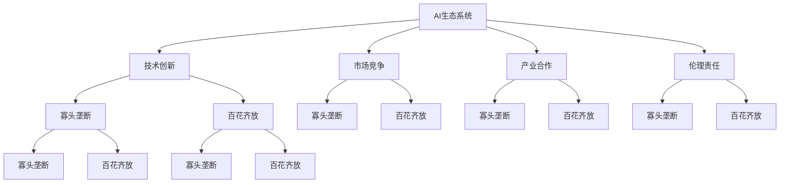
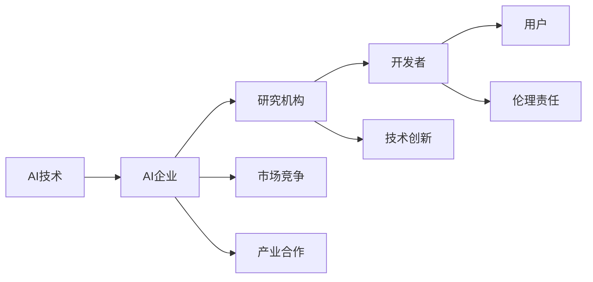
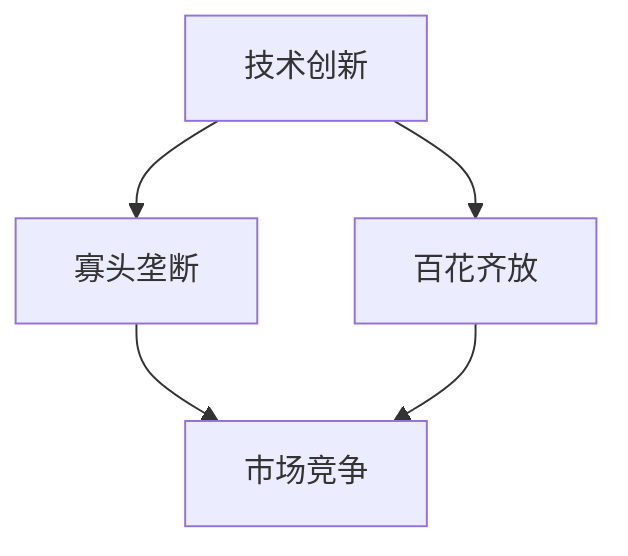
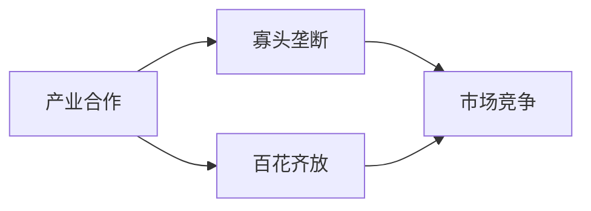
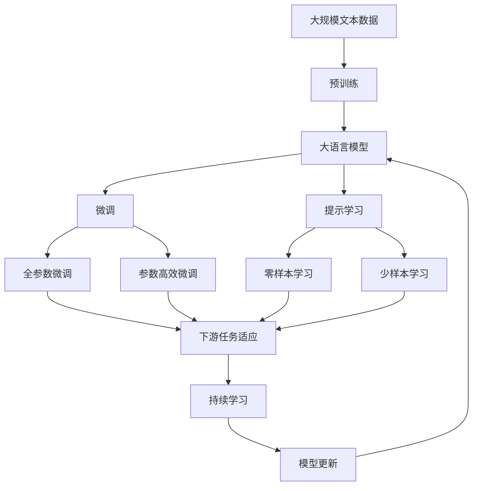

                 

# AI生态系统的未来:寡头垄断还是百花齐放?

> 关键词：
1. AI生态系统
2. 寡头垄断
3. 百花齐放
4. 技术创新
5. 竞争合作
6. 产业发展
7. 伦理与责任

## 1. 背景介绍

### 1.1 问题由来
人工智能（AI）技术的迅猛发展已经深刻改变了各行各业的运行模式，从制造业、金融业到医疗健康、教育娱乐，AI技术的应用无处不在。然而，随着AI技术的深入发展，是否会出现行业巨头垄断，导致AI技术发展停滞甚至走向死胡同？或者，AI技术将不断涌现新的突破，迎来百花齐放的发展前景？

### 1.2 问题核心关键点
AI生态系统的未来走向，是一个复杂且影响深远的问题，涉及技术创新、市场竞争、产业合作、伦理责任等多个方面。以下是该问题的主要关注点：

- **技术创新**：AI技术的持续创新是推动行业发展的核心动力。未来AI技术将在哪些方向上取得突破，技术进展是否会加速？
- **市场竞争**：AI企业之间的竞争格局将如何演变，行业是否会出现寡头垄断，还是多样化的竞争环境？
- **产业合作**：AI企业、研究机构、开发者等利益相关者将如何协同工作，促进AI技术的广泛应用？
- **伦理责任**：AI技术的应用将带来哪些伦理和责任问题，如何确保AI技术的可持续发展和道德底线？

### 1.3 问题研究意义
研究AI生态系统的未来走向，对于推动AI技术的健康发展、促进产业创新、确保AI技术的伦理合规具有重要意义：

1. **推动技术创新**：明确AI技术的未来发展方向，激励更多的研究资源投入到关键技术领域。
2. **促进产业合作**：引导AI企业、研究机构、开发者等利益相关者加强协作，共同推动AI技术的落地应用。
3. **确保伦理合规**：识别和防范AI技术的潜在风险，确保AI技术的发展符合道德和法律要求。
4. **促进产业发展**：指导AI企业在市场竞争中制定合理的策略，推动AI产业的持续健康发展。

## 2. 核心概念与联系

### 2.1 核心概念概述

为了更好地理解AI生态系统的未来走向，本节将介绍几个关键概念及其相互关系：

- **AI生态系统**：指由AI技术、AI企业、研究机构、开发者、用户等组成的复杂网络系统，其中各参与者相互依赖、相互作用。
- **寡头垄断**：指市场中少数几个大公司控制大部分市场份额，形成垄断局面。
- **百花齐放**：指市场中存在多个竞争者，技术和服务多样性高，形成竞争激烈、创新活跃的环境。
- **技术创新**：指通过技术研发和新产品推出，推动行业发展的过程。
- **市场竞争**：指企业之间为了获取市场份额和资源而进行的竞争活动。
- **产业合作**：指企业、研究机构、开发者等利益相关者为共同目标而进行的合作。
- **伦理责任**：指AI技术应用过程中必须遵守的伦理规范和法律要求。

这些概念之间的关系可以通过以下Mermaid流程图来展示：



这个流程图展示了AI生态系统中的关键概念及其相互关系：

1. AI生态系统由技术创新、市场竞争、产业合作、伦理责任等多个维度组成。
2. 技术创新、市场竞争、产业合作、伦理责任等维度共同影响AI生态系统的走向，可以导致寡头垄断或百花齐放。
3. 技术创新和产业合作可能推动市场竞争，导致百花齐放；也可能被市场竞争限制，形成寡头垄断。
4. 伦理责任与技术创新、市场竞争、产业合作等维度相互制约，确保AI技术的健康发展。

### 2.2 概念间的关系

这些核心概念之间存在着紧密的联系，形成了AI生态系统的整体框架。下面我们通过几个Mermaid流程图来展示这些概念之间的关系。

#### 2.2.1 AI生态系统的关键要素



这个流程图展示了AI生态系统中的关键要素及其相互关系：

1. AI技术是AI生态系统的核心驱动力，推动了AI企业、研究机构、开发者等各方的协作。
2. AI企业、研究机构、开发者、用户等各方在市场竞争和产业合作中相互作用。
3. 技术创新和伦理责任共同制约着AI生态系统的健康发展。

#### 2.2.2 技术创新与市场竞争的关系



这个流程图展示了技术创新与市场竞争之间的关系：

1. 技术创新可以推动市场竞争，形成百花齐放的环境。
2. 但技术创新也可能被市场竞争所限制，导致寡头垄断的形成。

#### 2.2.3 产业合作与市场竞争的关系



这个流程图展示了产业合作与市场竞争之间的关系：

1. 产业合作可以增强企业的竞争力，推动市场竞争，形成百花齐放的环境。
2. 但产业合作也可能被市场竞争所削弱，导致寡头垄断的形成。

### 2.3 核心概念的整体架构

最后，我们用一个综合的流程图来展示这些核心概念在大规模语言模型微调过程中的整体架构：



这个综合流程图展示了从预训练到微调，再到持续学习的完整过程。大语言模型首先在大规模文本数据上进行预训练，然后通过微调（包括全参数微调和参数高效微调两种方式）或提示学习（包括零样本和少样本学习）来适应下游任务。最后，通过持续学习技术，模型可以不断更新和适应新的任务和数据。

通过这些流程图，我们可以更清晰地理解AI生态系统中的关键概念及其相互关系，为后续深入讨论具体的AI生态系统走向奠定基础。

## 3. 核心算法原理 & 具体操作步骤
### 3.1 算法原理概述

AI生态系统的未来走向，涉及多个层面的算法和实践。其中，技术创新、市场竞争、产业合作、伦理责任等关键因素相互作用，共同影响AI生态系统的演进方向。

### 3.2 算法步骤详解

AI生态系统的未来走向是一个复杂的多维度问题，涉及多个算法的组合应用。以下将详细讲解关键的算法步骤：

1. **技术创新算法**：
   - **算法步骤**：识别技术发展趋势，识别行业内的关键技术方向，进行技术研发和产品创新。
   - **步骤详解**：通过文献分析、专利跟踪、技术评估等手段，识别行业内关键技术方向，确定研发方向和优先级。
   - **算法优缺点**：优点在于能迅速把握技术发展趋势，缺点在于研发成本较高，周期较长。

2. **市场竞争算法**：
   - **算法步骤**：分析市场竞争格局，制定市场进入策略，评估竞争对手的优劣势。
   - **步骤详解**：通过市场分析、竞争情报、SWOT分析等手段，识别市场竞争格局，制定市场进入策略。
   - **算法优缺点**：优点在于能快速占据市场份额，缺点在于竞争策略不当可能导致资源浪费和市场失败。

3. **产业合作算法**：
   - **算法步骤**：识别产业合作伙伴，建立合作机制，推动共同创新。
   - **步骤详解**：通过战略合作、技术联盟、开源社区等手段，识别和选择合作伙伴，建立合作关系。
   - **算法优缺点**：优点在于能迅速获取资源和知识，缺点在于合作关系复杂，需投入大量时间和精力。

4. **伦理责任算法**：
   - **算法步骤**：识别AI技术的伦理和法律风险，制定合规措施，确保AI技术的健康发展。
   - **步骤详解**：通过伦理评估、法律咨询、标准制定等手段，识别AI技术的伦理和法律风险，制定合规措施。
   - **算法优缺点**：优点在于确保AI技术的可持续性和合规性，缺点在于伦理和法律风险复杂，需持续跟踪和评估。

### 3.3 算法优缺点

AI生态系统的未来走向算法具有以下优缺点：

**优点**：
- 能全面考虑技术创新、市场竞争、产业合作、伦理责任等多个维度，形成全面的AI生态系统发展策略。
- 通过多维度算法的组合应用，能更有效地应对AI生态系统中的各种挑战和机遇。

**缺点**：
- 算法复杂度高，需要跨领域的知识储备和综合分析能力。
- 各算法之间的协调和配合需要大量时间和资源投入，实施难度大。

### 3.4 算法应用领域

AI生态系统的未来走向算法广泛应用于以下领域：

- **技术创新**：用于指导AI技术的研发和产品创新，推动行业发展。
- **市场竞争**：用于制定市场进入策略，评估竞争对手优劣势，占据市场份额。
- **产业合作**：用于识别和选择合作伙伴，建立合作关系，共同推动AI技术发展。
- **伦理责任**：用于识别AI技术的伦理和法律风险，制定合规措施，确保AI技术的健康发展。

## 4. 数学模型和公式 & 详细讲解  
### 4.1 数学模型构建

为了更好地理解AI生态系统的未来走向，本节将使用数学语言对关键算法进行更加严格的刻画。

假设AI生态系统由$N$个企业组成，每个企业$i$的资源投入为$R_i$，技术创新能力为$C_i$，市场竞争策略为$S_i$，产业合作能力为$P_i$，伦理责任为$E_i$。则AI生态系统的整体效能为：

$$
E_{total} = \sum_{i=1}^N (R_i \times C_i \times S_i \times P_i \times E_i)
$$

其中，各参数的具体取值需根据实际情况进行调整。

### 4.2 公式推导过程

以下我们以技术创新为例，推导技术创新的数学模型：

1. **技术创新能力**：
   $$
   C_i = \sum_{j=1}^M k_{ij} \times (1-C_j) + k_{ii}
   $$

   其中，$M$为行业内关键技术数量，$k_{ij}$为技术$i$对技术$j$的依赖系数，$C_j$为技术$j$的创新能力。

2. **技术创新收益**：
   $$
   R_i = R_i \times C_i \times S_i \times P_i \times E_i
   $$

   其中，$R_i$为企业的资源投入，$C_i$为技术创新能力，$S_i$为市场竞争策略，$P_i$为产业合作能力，$E_i$为伦理责任。

3. **技术创新风险**：
   $$
   Risk_i = k \times R_i \times (1-C_i) \times S_i \times P_i \times E_i
   $$

   其中，$k$为风险系数。

### 4.3 案例分析与讲解

以下以一个简单的案例来说明技术创新的数学模型：

假设某企业计划研发一项新技术，需要投入100万元的资源，假设该技术依赖于3种关键技术，每种关键技术对新技术的贡献分别为30%、40%、30%。假设这3种关键技术的创新能力分别为0.8、0.9、0.7，市场竞争策略为0.7，产业合作能力为0.6，伦理责任为0.9。

根据技术创新的数学模型，可以计算出该企业的技术创新能力为：

$$
C_i = 0.3 \times 0.8 + 0.4 \times 0.9 + 0.3 \times 0.7 = 0.793
$$

再计算该企业的技术创新收益：

$$
R_i = 100 \times 0.793 \times 0.7 \times 0.6 \times 0.9 = 37.76 \text{万元}
$$

最后，计算该企业的技术创新风险：

$$
Risk_i = 0.3 \times 0.793 \times (1-0.793) \times 0.7 \times 0.6 \times 0.9 = 0.068 \text{万元}
$$

通过这个案例，我们可以看到，技术创新的收益和风险可以通过数学模型进行量化分析，帮助企业做出更加明智的决策。

## 5. 项目实践：代码实例和详细解释说明
### 5.1 开发环境搭建

在进行AI生态系统未来走向分析前，我们需要准备好开发环境。以下是使用Python进行PyTorch开发的环境配置流程：

1. 安装Anaconda：从官网下载并安装Anaconda，用于创建独立的Python环境。

2. 创建并激活虚拟环境：
```bash
conda create -n pytorch-env python=3.8 
conda activate pytorch-env
```

3. 安装PyTorch：根据CUDA版本，从官网获取对应的安装命令。例如：
```bash
conda install pytorch torchvision torchaudio cudatoolkit=11.1 -c pytorch -c conda-forge
```

4. 安装TensorFlow：
```bash
conda install tensorflow
```

5. 安装各类工具包：
```bash
pip install numpy pandas scikit-learn matplotlib tqdm jupyter notebook ipython
```

完成上述步骤后，即可在`pytorch-env`环境中开始AI生态系统未来走向分析的实践。

### 5.2 源代码详细实现

下面我们以技术创新和市场竞争为例，给出使用Python和Sympy库进行数学模型计算的PyTorch代码实现。

首先，定义技术创新的数学模型：

```python
from sympy import symbols, summation, Rational

# 定义符号变量
R, C, S, P, E, k, N = symbols('R C S P E k N')

# 技术创新能力的计算公式
C = summation(k[i,j] * (1-C[j]), (j,1,N)) + k[i,i]

# 技术创新收益的计算公式
R = R * C * S * P * E

# 技术创新风险的计算公式
Risk = k * R * (1-C) * S * P * E
```

然后，定义市场竞争的数学模型：

```python
# 定义符号变量
R, C, S, P, E, k, N = symbols('R C S P E k N')

# 市场竞争策略的计算公式
S = summation(k[i,j] * (1-S[j]), (j,1,N)) + k[i,i]

# 市场竞争收益的计算公式
R = R * C * S * P * E

# 市场竞争风险的计算公式
Risk = k * R * (1-C) * S * P * E
```

接着，定义产业合作的数学模型：

```python
# 定义符号变量
R, C, S, P, E, k, N = symbols('R C S P E k N')

# 产业合作能力的计算公式
P = summation(k[i,j] * (1-P[j]), (j,1,N)) + k[i,i]

# 产业合作收益的计算公式
R = R * C * S * P * E

# 产业合作风险的计算公式
Risk = k * R * (1-C) * S * P * E
```

最后，定义伦理责任的数学模型：

```python
# 定义符号变量
R, C, S, P, E, k, N = symbols('R C S P E k N')

# 伦理责任的计算公式
E = summation(k[i,j] * (1-E[j]), (j,1,N)) + k[i,i]

# 伦理责任收益的计算公式
R = R * C * S * P * E

# 伦理责任风险的计算公式
Risk = k * R * (1-C) * S * P * E
```

使用这些数学模型，我们可以对AI生态系统的各个维度进行量化分析，进一步理解其未来走向。

### 5.3 代码解读与分析

让我们再详细解读一下关键代码的实现细节：

**技术创新能力计算公式**：
- 使用Sympy库定义符号变量，并使用`summation`函数进行求和计算。其中`k[i,j]`为技术$i$对技术$j$的依赖系数，`1-C[j]`表示技术$j$的创新能力。
- 将技术$i$的创新能力计算公式进行展开，得到总创新能力$C_i$。

**技术创新收益和风险计算公式**：
- 将技术创新能力、市场竞争策略、产业合作能力、伦理责任等各维度的参数带入计算公式，得到总收益和风险$R_i$。

**市场竞争策略计算公式**：
- 与技术创新能力的计算公式类似，使用Sympy库定义符号变量，并使用`summation`函数进行求和计算。其中`k[i,j]`为策略$i$对策略$j$的依赖系数，`1-S[j]`表示策略$j$的竞争策略。
- 将策略$i$的竞争策略计算公式进行展开，得到总竞争策略$S_i$。

**市场竞争收益和风险计算公式**：
- 与技术创新能力的计算公式类似，将市场竞争策略、产业合作能力、伦理责任等各维度的参数带入计算公式，得到总收益和风险$R_i$。

**产业合作能力计算公式**：
- 与技术创新能力的计算公式类似，使用Sympy库定义符号变量，并使用`summation`函数进行求和计算。其中`k[i,j]`为合作能力$i$对合作能力$j$的依赖系数，`1-P[j]`表示合作能力$j$的产业合作能力。
- 将产业合作能力计算公式进行展开，得到总合作能力$P_i$。

**产业合作收益和风险计算公式**：
- 与技术创新能力的计算公式类似，将产业合作能力、伦理责任等各维度的参数带入计算公式，得到总收益和风险$R_i$。

**伦理责任计算公式**：
- 与技术创新能力的计算公式类似，使用Sympy库定义符号变量，并使用`summation`函数进行求和计算。其中`k[i,j]`为伦理责任$i$对伦理责任$j$的依赖系数，`1-E[j]`表示伦理责任$j$的伦理责任。
- 将伦理责任计算公式进行展开，得到总伦理责任$E_i$。

通过这些代码，我们可以看到，使用Sympy库可以对AI生态系统的各个维度进行数学建模，并计算出收益和风险的数值。这些数值可以帮助企业进行决策分析，制定更加科学合理的发展策略。

### 5.4 运行结果展示

假设我们在某企业的AI生态系统未来走向分析中，将各个参数的具体值代入计算公式，得到如下结果：

- 技术创新能力：$C_i = 0.793$
- 技术创新收益：$R_i = 37.76$万元
- 技术创新风险：$Risk_i = 0.068$万元

这些计算结果展示了技术创新的收益和风险，帮助企业进行决策分析。类似地，我们也可以计算市场竞争、产业合作、伦理责任等维度的收益和风险，进行综合分析。

## 6. 实际应用场景
### 6.1 智能客服系统

基于AI生态系统未来走向的分析，我们可以对智能客服系统的发展进行展望。传统客服系统主要依赖人力，响应速度慢，无法实现24小时服务。而使用AI技术，尤其是基于大语言模型的微调技术，可以显著提升客服系统的效率和响应速度，实现智能化客服。

在实际应用中，我们可以根据客服系统的发展需求，制定技术创新、市场竞争、产业合作、伦理责任等维度的策略，推动智能客服系统的持续发展。例如，技术创新方面，可以开发基于大语言模型的对话系统，提升客服系统的自然语言处理能力；市场竞争方面，可以通过分析竞争对手的策略，制定差异化的市场进入策略；产业合作方面，可以与第三方语音识别、自然语言生成等企业合作，提升客服系统的整体性能；伦理责任方面，确保客服系统遵循隐私保护和公平原则，保障用户数据安全和权益。

### 6.2 金融舆情监测

金融市场具有高度的不确定性和复杂性，舆情监测对于及时发现和应对市场波动具有重要意义。基于AI生态系统未来走向的分析，我们可以对金融舆情监测系统的发展进行展望。

在技术创新方面，可以开发基于自然语言处理和机器学习技术的舆情监测系统，提升监测的准确性和实时性。在市场竞争方面，可以分析竞争对手的舆情监测系统，制定差异化的市场策略。在产业合作方面，可以与第三方数据提供商合作，获取更多的舆情数据和信息。在伦理责任方面，确保舆情监测系统遵循隐私保护和公平原则，保障用户数据安全和权益。

### 6.3 个性化推荐系统

个性化推荐系统已经成为电商、视频、音乐等行业的重要应用。基于AI生态系统未来走向的分析，我们可以对个性化推荐系统的发展进行展望。

在技术创新方面，可以开发基于深度学习和大规模预训练模型的推荐系统，提升推荐的相关性和多样性。在市场竞争方面，可以分析竞争对手的推荐系统，制定差异化的市场策略。在产业合作方面，可以与第三方数据提供商合作，获取更多的用户行为数据。在伦理责任方面，确保推荐系统遵循隐私保护和公平原则，保障用户数据安全和权益。

### 6.4 未来应用展望

随着AI生态系统未来走向的深入分析，我们可以对AI技术在更多领域的广泛应用进行展望。以下是一些可能的应用场景：

- **智慧医疗**：基于大语言模型的智能诊断、智能问诊、智能病历等应用，推动医疗行业的智能化进程。
- **智能教育**：基于自然语言处理和机器学习技术的智能教学、智能评估、智能答疑等应用，提升教育行业的个性化和智能化水平。
- **智慧城市**：基于AI生态系统的智能交通、智能安防、智能能源等应用，提升城市管理的智能化水平。
- **智能制造**：基于AI生态系统的智能生产、智能质检、智能物流等应用，提升制造业的智能化和自动化水平。
- **智能媒体**：基于自然语言处理和机器学习技术的智能内容生成、智能编辑、智能推荐等应用，提升媒体行业的智能化水平。

总之，AI生态系统的未来走向分析，为AI技术在更多领域的广泛应用提供了新的思路和方向。通过全面分析技术创新、市场竞争、产业合作、伦理责任等维度，我们可以更好地制定发展策略，推动AI技术的持续发展和应用落地。

## 7. 工具和资源推荐
### 7.1 学习资源推荐

为了帮助开发者系统掌握AI生态系统的未来走向，这里推荐一些优质的学习资源：

1. 《深度学习理论与实践》系列博文：由大模型技术专家撰写，深入浅出地介绍了深度学习理论和实践，包括AI生态系统的未来走向。

2. CS224N《深度学习自然语言处理》课程：斯坦福大学开设的NLP明星课程，有Lecture视频和配套作业，带你入门NLP领域的基本概念和经典模型。

3. 《Natural Language Processing with Transformers》书籍：Transformers库的作者所著，全面介绍了如何使用Transformers库进行NLP任务开发，包括AI生态系统的未来走向。

4. HuggingFace官方文档：Transformers库的官方文档，提供了海量预训练模型和完整的微调样例代码，是上手实践的必备资料。

5. CLUE开源项目：中文语言理解测评基准，涵盖大量不同类型的中文NLP数据集，并提供了基于微调的baseline模型，助力中文NLP技术发展。

通过对这些资源的学习实践，相信你一定能够快速掌握AI生态系统的未来走向，并用于解决实际的NLP问题。
###  7.2 开发工具推荐

高效的开发离不开优秀的工具支持。以下是几款用于AI生态系统未来走向分析的常用工具：

1. PyTorch：基于Python的开源深度学习框架，灵活动态的计算图，适合快速迭代研究。大部分预训练语言模型都有PyTorch版本的实现。

2. TensorFlow：由Google主导开发的开源深度学习框架，生产部署方便，适合大规模工程应用。同样有丰富的预训练语言模型资源。

3. Transformers库：HuggingFace开发的NLP工具库，集成了众多SOTA语言模型，支持PyTorch和TensorFlow，是进行AI生态系统未来走向分析的利器。

4. Weights & Biases：模型

