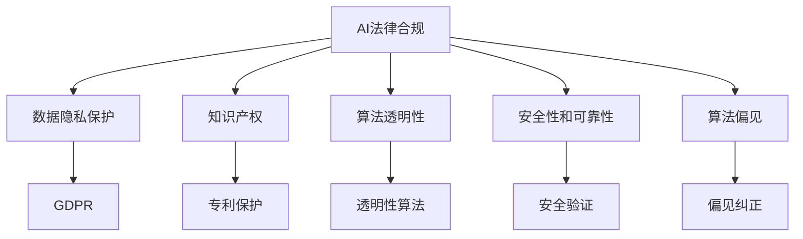

                 

# AI相关法律法规原理与代码实战案例讲解

> 关键词：AI法律合规, 数据隐私保护, 知识产权, 算法透明性, 安全性和可靠性, 算法偏见

## 1. 背景介绍

随着人工智能技术的迅猛发展，AI在各行业的广泛应用为社会带来了巨大益处，但同时也引发了一系列法律、伦理和社会问题。确保AI技术的合规性和安全性，已成为各国政府和企业的首要任务。本博客旨在梳理AI相关法律法规的核心原则，并通过具体案例剖析AI代码实战中的合规性要点，为开发者提供实用的指导和建议。

## 2. 核心概念与联系

### 2.1 核心概念概述

为深入理解AI相关法律法规，需先明确几个关键概念：

- **AI法律合规性**：指在开发和使用AI系统时，需遵循法律和政策要求，确保不违反知识产权、数据隐私、公平性等方面的法律法规。

- **数据隐私保护**：涉及个人数据收集、存储、处理和分享的隐私保护法律，如欧盟的《通用数据保护条例》(GDPR)。

- **知识产权**：AI系统涉及的版权、专利、商标等知识产权问题。

- **算法透明性和可解释性**：指AI系统的决策过程和算法逻辑应透明、可解释，以便用户理解。

- **安全性和可靠性**：确保AI系统稳定运行，无漏洞，不带来安全风险。

- **算法偏见**：指AI系统可能因训练数据偏见或算法设计缺陷而产生的歧视性决策。

这些概念紧密联系，共同构成了AI法律合规的框架。了解和遵守这些法律法规，是确保AI系统安全、可靠、公平和合法的基石。

### 2.2 概念间的关系

这些核心概念之间的联系可通过以下Mermaid流程图展示：



此流程图展示了大语言模型微调过程中需考虑的关键法律合规要素。数据隐私保护（GDPR）、知识产权保护、算法透明性、安全性和可靠性、算法偏见等均需纳入考虑，以确保AI系统的合规性和安全性。

## 3. 核心算法原理 & 具体操作步骤

### 3.1 算法原理概述

AI系统的合规性不仅依赖于技术实现，还需遵循法律法规的要求。因此，本节将阐述AI系统设计和开发时需遵守的法律和政策原则。

AI系统设计原则包括：
1. **合法性原则**：确保数据收集、处理和应用符合所在国家法律规定。
2. **透明性原则**：系统决策过程和算法逻辑应透明，可被用户和监管者理解。
3. **隐私保护原则**：遵循数据隐私保护法律，如GDPR，确保数据收集和使用过程符合隐私保护要求。
4. **安全性和可靠性原则**：系统设计应考虑安全性，避免漏洞，确保系统可靠运行。
5. **无偏见原则**：系统设计和训练数据应避免偏见，确保公平性。

### 3.2 算法步骤详解

AI系统开发过程需遵循上述法律和政策原则。以下是具体的操作步骤：

1. **合规性审查**：在开发前进行合规性审查，识别潜在法律风险。
2. **数据隐私保护**：确保数据收集、处理和存储符合隐私保护要求，如数据匿名化、去标识化等。
3. **知识产权保护**：确保使用数据和算法符合知识产权法律要求，避免侵权。
4. **算法透明性和可解释性**：设计透明算法，确保用户可理解和解释系统决策过程。
5. **安全性和可靠性测试**：通过安全测试验证系统安全性，确保系统无漏洞。
6. **算法偏见检测和纠正**：定期检测系统偏见，采取措施纠正偏见。

### 3.3 算法优缺点

AI系统合规性设计的优点包括：
- **法律风险降低**：遵循法律和政策要求，降低法律诉讼风险。
- **用户信任增强**：透明性和公平性设计增强用户对系统的信任。
- **品牌价值提升**：符合法规要求的企业更容易获得消费者信任。

缺点主要包括：
- **合规成本高**：需投入大量资源进行合规性审查和测试。
- **开发复杂度增加**：需额外设计和实现合规性功能。
- **技术难度高**：算法偏见检测和纠正技术复杂，需专业知识支持。

### 3.4 算法应用领域

AI系统合规性设计适用于多种应用领域，包括但不限于：

- **医疗**：确保AI诊断系统符合隐私保护和数据安全法规，避免误诊。
- **金融**：确保AI风控系统符合金融法规，防止欺诈和误操作。
- **教育**：确保AI评估系统符合数据隐私和公平性法规，保护学生隐私。
- **司法**：确保AI辅助决策系统符合伦理和公平性要求，避免歧视。
- **公共安全**：确保AI监控系统符合隐私保护和数据安全法规，防止滥用。

## 4. 数学模型和公式 & 详细讲解 & 举例说明

### 4.1 数学模型构建

为了量化AI系统的合规性，可构建数学模型来评估系统风险和合规性。例如，可通过信息熵、隐私指数等数学模型来评估数据隐私保护情况。

### 4.2 公式推导过程

以信息熵为例，公式推导过程如下：

假设某数据集包含N个样本，每个样本有K种可能的特征取值。若第i个样本的特征取值为$a_i$，则该样本的信息熵为：

$$
H(X_i) = -\sum_{a_i} P(a_i) \log_2 P(a_i)
$$

其中 $P(a_i)$ 为特征 $a_i$ 的概率。

### 4.3 案例分析与讲解

假设某医疗AI系统用于诊断疾病。系统需收集病人的健康数据，包括年龄、性别、病史等。通过信息熵模型，可评估系统的隐私保护情况。

设数据集中有M个健康数据特征，每个特征的取值概率分布为 $P_1, P_2, ..., P_M$。则系统的总体信息熵为：

$$
H(X) = -\sum_{P_1}^{P_M} P_i \log_2 P_i
$$

根据GDPR等隐私保护法律的要求，系统应尽量减少信息熵，确保隐私保护。例如，通过数据去标识化、匿名化等手段，将原始数据转换为噪声形式，从而降低信息熵。

## 5. 项目实践：代码实例和详细解释说明

### 5.1 开发环境搭建

为进行AI合规性开发，需搭建Python开发环境，并配置必要的工具和库：

1. 安装Python环境：使用Anaconda或Miniconda，确保Python版本为3.7及以上。
2. 安装AI合规性库：如TensorFlow、PyTorch、Pandas等。
3. 配置代码编辑器和IDE：如PyCharm、VSCode等。

### 5.2 源代码详细实现

以下是一个简单的AI系统合规性设计的Python代码示例：

```python
import tensorflow as tf
from sklearn.model_selection import train_test_split
from sklearn.metrics import precision_recall_curve

# 数据准备
X = ...  # 输入数据
y = ...  # 标签数据

# 分割训练集和测试集
X_train, X_test, y_train, y_test = train_test_split(X, y, test_size=0.2)

# 构建AI模型
model = tf.keras.Sequential([
    tf.keras.layers.Dense(64, activation='relu', input_shape=(X_train.shape[1],)),
    tf.keras.layers.Dense(1, activation='sigmoid')
])

# 编译模型
model.compile(optimizer='adam', loss='binary_crossentropy', metrics=['accuracy'])

# 训练模型
model.fit(X_train, y_train, epochs=10, batch_size=32, validation_data=(X_test, y_test))

# 评估模型
y_pred = model.predict(X_test)
precision, recall, _ = precision_recall_curve(y_test, y_pred)

# 合规性评估
privacy_model = ...  # 隐私保护模型
entropy = privacy_model.information_entropy()

# 输出结果
print("Entropy: {:.4f}".format(entropy))
```

### 5.3 代码解读与分析

上述代码实现了AI系统的基本训练和评估过程。其中，隐私保护模型用于计算信息熵，以评估系统的隐私保护情况。

### 5.4 运行结果展示

假设信息熵计算结果为0.5，表示系统的隐私保护情况处于中等水平。进一步优化隐私保护措施，可提高信息熵，增强隐私保护。

## 6. 实际应用场景

### 6.4 未来应用展望

随着AI技术的发展，AI合规性设计将更广泛地应用于各行业。未来趋势包括：

- **自动化合规性检查**：开发自动化工具，实时检查AI系统合规性，降低人工审查成本。
- **合规性框架开放**：构建开放合规性框架，如AI公平、透明性评估标准，促进AI技术合规性发展。
- **跨领域应用推广**：将AI合规性设计推广到更多领域，如智慧城市、智能交通等，推动AI技术在各行业的合规性应用。

## 7. 工具和资源推荐

### 7.1 学习资源推荐

为了掌握AI合规性设计的核心技术和法律知识，推荐以下学习资源：

1. **法律合规书籍**：如《人工智能法律基础》等，全面介绍AI法律合规知识。
2. **在线课程**：如Coursera、edX等平台的AI法律合规课程，提供系统化学习路径。
3. **学术会议论文**：如AAAI、ICML等顶级会议的AI法律合规论文，了解最新研究方向。
4. **技术博客**：如OpenAI、Google AI等公司博客，分享AI合规性设计经验。
5. **开源项目**：如TensorFlow、PyTorch等开源AI框架的合规性设计实践，可参考其代码和文档。

### 7.2 开发工具推荐

为高效实现AI合规性设计，推荐以下开发工具：

1. **代码编辑器**：如PyCharm、VSCode等，支持代码编写和调试。
2. **模型训练工具**：如TensorFlow、PyTorch等，提供丰富的模型训练和优化功能。
3. **数据处理工具**：如Pandas、NumPy等，支持数据预处理和分析。
4. **隐私保护工具**：如OpenDP、Federated Learning等，提供隐私保护功能。
5. **模型评估工具**：如Scikit-Learn、TensorBoard等，支持模型性能评估和可视化。

### 7.3 相关论文推荐

为了深入理解AI合规性设计的理论和实践，推荐以下相关论文：

1. **《人工智能公平性、透明性和责任性》**：探讨AI系统的公平性、透明性和责任性问题。
2. **《人工智能系统中的隐私保护》**：介绍AI系统中隐私保护的常用技术和策略。
3. **《基于数据隐私保护的机器学习》**：讨论在数据隐私保护下，机器学习的训练和部署问题。
4. **《公平性机器学习：方法、模型和评价指标》**：总结公平性机器学习的最新研究成果和评价指标。
5. **《人工智能伦理和法律框架》**：探讨AI伦理和法律框架构建的挑战和解决方案。

## 8. 总结：未来发展趋势与挑战

### 8.1 研究成果总结

本博客从理论到实践，全面梳理了AI合规性设计的核心概念、技术和法律框架。通过具体案例和代码实例，为开发者提供了实用的指导和建议。

### 8.2 未来发展趋势

未来，AI合规性设计将面临以下趋势：

- **自动化和标准化**：开发自动化合规性检查工具，推动AI系统合规性标准化。
- **跨学科融合**：与法律、伦理等学科深度融合，促进AI合规性设计的发展。
- **国际合作**：各国共同制定AI合规性标准和法规，推动全球AI技术的规范发展。

### 8.3 面临的挑战

AI合规性设计仍面临以下挑战：

- **法律和技术融合**：法律和技术领域间的融合难度较大，需更多跨学科合作。
- **隐私保护技术**：隐私保护技术需进一步提升，确保数据安全。
- **算法透明性和公平性**：算法透明性和公平性检测技术复杂，需更多技术创新。
- **资源投入**：AI合规性设计需大量资源投入，需找到成本效益最佳方案。

### 8.4 研究展望

为应对以上挑战，未来研究需重点关注以下几个方向：

- **自动化合规性检查**：开发自动化工具，实时检查AI系统合规性。
- **跨领域隐私保护**：研究和推广跨领域隐私保护技术。
- **公平性和透明性算法**：开发公平性和透明性算法，增强AI系统的可解释性和可信度。
- **国际合作**：推动各国AI合规性标准的国际合作和互认。

## 9. 附录：常见问题与解答

### Q1: 如何确保AI系统符合隐私保护法规？

A: 在数据收集、处理和存储过程中，需遵循GDPR等隐私保护法规。具体措施包括数据去标识化、匿名化、加密存储等。

### Q2: 如何检测和纠正AI系统的偏见？

A: 在模型设计和训练阶段，需注意数据多样性和代表性，避免训练数据偏见。采用公平性评估指标，如误差率、ROC曲线等，检测模型偏见。

### Q3: 如何提升AI系统的透明性和可解释性？

A: 设计透明算法，如使用决策树、可解释模型等，确保用户理解系统决策过程。开发可解释工具，如LIME、SHAP等，生成系统决策的可视化解释。

### Q4: 如何优化AI系统的合规性设计？

A: 在AI系统设计和开发过程中，需持续关注法律、技术和社会变化，定期评估和优化系统合规性。利用自动化工具，实时监控和检查系统合规性。

通过以上步骤和资源，开发者可有效设计和实现AI系统的合规性，确保其在法律、伦理和安全方面的合规性，推动AI技术的规范化和可持续发展。

---

作者：禅与计算机程序设计艺术 / Zen and the Art of Computer Programming

