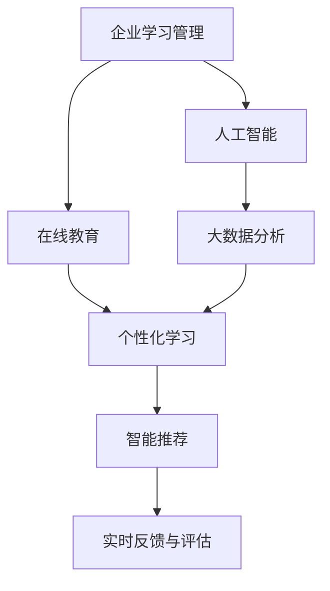
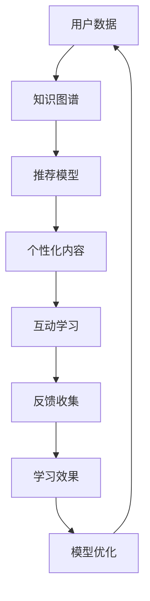
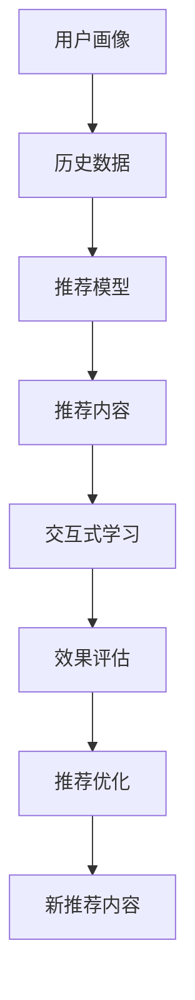
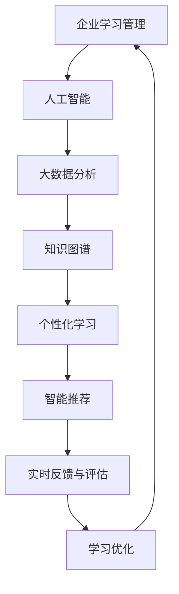

                 

# AI驱动的企业学习管理系统

> 关键词：人工智能,企业学习管理,在线教育,智能推荐,大数据分析,个性化学习

## 1. 背景介绍

### 1.1 问题由来
在现代企业中，员工的学习和发展是企业持续成长和竞争力的关键。然而，传统的培训方式往往难以满足员工多样化的学习需求，且培训效果难以量化评估。因此，AI驱动的企业学习管理系统（AI-ELMS）应运而生，通过数据分析和机器学习技术，个性化定制员工的学习路径，提供高效、互动的学习体验，显著提升培训效果和企业竞争力。

### 1.2 问题核心关键点
AI-ELMS的核心思想在于利用人工智能技术，通过数据分析和机器学习算法，定制个性化的学习方案，动态调整学习内容，实现实时反馈和评估。具体来说，它包括以下几个关键点：

1. **数据驱动**：基于员工的学习行为和绩效数据，分析其知识能力和学习需求。
2. **个性化推荐**：根据员工的学习历史和兴趣，推荐最适合的学习内容。
3. **智能评估**：利用机器学习算法，动态评估员工的学习效果，提供反馈和改进建议。
4. **互动学习**：通过交互式学习工具和平台，提高员工的学习参与度和效果。
5. **持续优化**：根据学习效果和反馈，不断优化学习路径和内容。

### 1.3 问题研究意义
AI-ELMS的应用对于提升企业员工的学习效率和培训效果，具有重要的意义：

1. **提高员工素质**：通过个性化学习路径和推荐，满足员工多样化的学习需求，提升其专业能力和综合素质。
2. **提升企业竞争力**：通过持续学习和技能更新，帮助企业应对快速变化的业务环境和市场需求。
3. **降低培训成本**：通过智能推荐和自动化评估，减少培训资源和时间的浪费。
4. **优化培训效果**：通过实时反馈和评估，及时发现问题并加以改进，提升培训的针对性和有效性。
5. **增强团队凝聚力**：通过协作式学习，促进团队成员间的知识共享和经验交流，增强团队凝聚力。

## 2. 核心概念与联系

### 2.1 核心概念概述

为更好地理解AI-ELMS的原理和应用，本节将介绍几个关键概念：

- **企业学习管理**：企业为了提升员工素质和技能，通过各种培训手段和平台，管理和组织员工的学习过程。
- **人工智能**：利用计算机算法和模型，赋予机器完成类似于人的任务，如图像识别、自然语言处理、智能推荐等。
- **在线教育**：通过互联网技术，提供在线课程、学习平台和互动工具，实现远程学习和自我管理。
- **大数据分析**：通过数据收集、处理和分析，挖掘出有价值的信息和模式，辅助决策和优化。
- **个性化学习**：根据用户的学习习惯、偏好和目标，定制个性化的学习方案和内容。
- **智能推荐**：利用机器学习算法，动态推荐适合用户的学习内容和路径。

这些概念之间的逻辑关系可以通过以下Mermaid流程图来展示：



这个流程图展示了几类关键概念之间的关系：

1. 企业学习管理是基础，通过人工智能和大数据分析，实现在线教育中的个性化学习和智能推荐。
2. 大数据分析为人工智能和个性化学习提供数据支持，智能推荐和实时反馈为学习管理提供辅助决策。

### 2.2 概念间的关系

这些核心概念之间存在着紧密的联系，形成了AI-ELMS的完整生态系统。下面我们通过几个Mermaid流程图来展示这些概念之间的关系。

#### 2.2.1 学习管理的流程


这个流程图展示了学习管理的基本流程：从需求分析到内容开发，再到学习实施和评估反馈，最后通过学习优化形成闭环。

#### 2.2.2 个性化学习的过程



这个流程图展示了个性化学习的基本过程：从用户数据到知识图谱，再到个性化内容的推荐和学习效果的评估，最后通过模型优化形成迭代。

#### 2.2.3 智能推荐的应用



这个流程图展示了智能推荐的基本应用：从用户画像到历史数据，再到推荐内容的学习效果评估和优化，最后形成新的推荐内容。

### 2.3 核心概念的整体架构

最后，我们用一个综合的流程图来展示这些核心概念在大规模企业学习管理系统中的整体架构：



这个综合流程图展示了从企业学习管理到个性化学习，再到智能推荐和反馈优化的完整过程。通过人工智能和大数据分析的支持，企业学习管理系统能够提供个性化的学习路径和智能推荐，实现高效的学习管理。

## 3. 核心算法原理 & 具体操作步骤
### 3.1 算法原理概述

AI-ELMS的核心算法包括数据挖掘、推荐系统、个性化学习和实时评估等。这些算法基于人工智能技术，通过数据分析和机器学习，实现个性化学习和智能推荐。

### 3.2 算法步骤详解

AI-ELMS的实现主要包括以下几个关键步骤：

**Step 1: 数据收集与处理**
- 收集员工的学习行为数据，包括学习时间、完成度、成绩等。
- 收集员工的学习兴趣和偏好数据，如学习主题、技能领域等。
- 对数据进行清洗和预处理，去除噪声和异常值，确保数据质量。

**Step 2: 数据建模与分析**
- 利用数据挖掘技术，分析员工的学习行为和绩效，发现其中的规律和模式。
- 利用机器学习算法，训练个性化推荐模型，预测员工的学习需求和兴趣。

**Step 3: 学习路径设计**
- 根据员工的学习行为和兴趣，设计个性化的学习路径。
- 利用智能推荐算法，推荐适合员工的学习内容和资源。

**Step 4: 学习内容开发**
- 根据学习路径和推荐结果，开发个性化的学习内容。
- 利用互动学习工具，提高员工的学习参与度和效果。

**Step 5: 学习效果评估**
- 利用实时反馈工具，收集员工的学习效果和反馈信息。
- 利用机器学习算法，动态评估学习效果，提供改进建议。

**Step 6: 学习优化与迭代**
- 根据评估结果和反馈信息，优化学习路径和内容。
- 不断迭代学习管理过程，提升培训效果和员工满意度。

### 3.3 算法优缺点

AI-ELMS具有以下优点：

1. **高效个性化**：通过数据分析和机器学习，实现个性化的学习路径和推荐，满足员工多样化的学习需求。
2. **动态优化**：根据实时反馈和评估，动态调整学习路径和内容，提升学习效果。
3. **互动性强**：利用互动学习工具，提高员工的学习参与度和效果。
4. **数据驱动**：基于员工的学习行为和绩效数据，实现数据驱动的学习管理。

同时，AI-ELMS也存在一些缺点：

1. **数据隐私**：员工的学习数据涉及隐私，需要确保数据的安全和隐私保护。
2. **算法复杂性**：机器学习算法和推荐系统需要一定的技术门槛，需投入相应的人力和资源。
3. **系统维护**：复杂的学习管理系统需要定期维护和更新，以保证系统的稳定性和可靠性。

### 3.4 算法应用领域

AI-ELMS可以广泛应用于各类企业培训和教育场景，例如：

- **员工入职培训**：根据新员工的职业背景和岗位需求，设计个性化的入职培训课程。
- **员工技能提升**：根据员工的岗位要求和职业发展目标，推荐适合的在线课程和培训资源。
- **团队协作培训**：利用互动学习工具，促进团队成员间的知识共享和经验交流。
- **领导力培训**：通过个性化的学习路径和内容，提升管理者的领导力和决策能力。
- **跨部门培训**：通过跨部门的联合培训，提升团队的整体协作和沟通能力。
- **客户培训**：针对客户的培训需求，设计个性化的培训内容和课程。

## 4. 数学模型和公式 & 详细讲解 & 举例说明

### 4.1 数学模型构建

AI-ELMS的核心数学模型包括协同过滤、矩阵分解、深度学习等。这里以协同过滤模型为例，介绍其构建和应用。

设员工为 $U$，学习内容为 $I$，学习行为为 $R$，则协同过滤模型的目标是预测员工对学习内容的评分 $r_{ui}$。假设 $I$ 和 $U$ 的评分矩阵为 $R$，矩阵中的每个元素表示员工对学习内容的评分。协同过滤模型可以表示为：

$$
r_{ui} \approx \hat{r}_{ui} = \hat{\alpha}_{ui} + \hat{\beta}_{ui} + \hat{\gamma}_{ui}
$$

其中 $\hat{r}_{ui}$ 为预测评分，$\hat{\alpha}_{ui}$、$\hat{\beta}_{ui}$、$\hat{\gamma}_{ui}$ 分别为用户偏置、物品偏置和时间衰减的预测评分。

### 4.2 公式推导过程

协同过滤模型的推导过程如下：

设用户 $u$ 对学习内容 $i$ 的评分 $r_{ui}$，用户偏置 $\alpha_u$，物品偏置 $\beta_i$，时间衰减 $\gamma_t$，则协同过滤模型的预测评分可以表示为：

$$
\hat{r}_{ui} = \alpha_u + \beta_i + \gamma_t
$$

假设评分矩阵 $R$ 为 $R_{ui} = r_{ui} + \epsilon$，其中 $\epsilon$ 为误差项。根据最小二乘法，可以求解 $\hat{\alpha}_{ui}$、$\hat{\beta}_{ui}$、$\hat{\gamma}_{ui}$ 如下：

$$
\begin{aligned}
\hat{\alpha}_{ui} &= \frac{1}{N_u} \sum_{i=1}^N (r_{ui} - \beta_i - \gamma_t) \\
\hat{\beta}_{ui} &= \frac{1}{N_i} \sum_{u=1}^M (r_{ui} - \alpha_u - \gamma_t) \\
\hat{\gamma}_{ui} &= \frac{1}{\sum_{i=1}^N r_{ui}^2} \sum_{i=1}^N \sum_{u=1}^M (r_{ui} - \alpha_u - \beta_i)^2
\end{aligned}
$$

其中 $N_u$ 和 $N_i$ 分别为用户和内容的数量。

### 4.3 案例分析与讲解

以某大型科技公司的员工培训为例，使用协同过滤模型推荐培训课程。公司有 1000 名员工和 1000 门在线课程，员工每门课程的评分 $r_{ui}$ 记录在系统中。利用协同过滤模型，预测每个员工对每门课程的评分，推荐评分高的课程。

具体步骤如下：

1. **数据收集**：收集员工对每门课程的评分 $r_{ui}$。
2. **数据预处理**：对评分进行归一化处理，去除异常值和噪声。
3. **模型训练**：利用协同过滤算法训练用户偏置 $\alpha_u$、物品偏置 $\beta_i$、时间衰减 $\gamma_t$。
4. **推荐预测**：根据模型预测每个员工对每门课程的评分 $\hat{r}_{ui}$。
5. **课程推荐**：根据预测评分排序，推荐评分高的课程。

最终，公司员工可以根据推荐课程进行个性化学习，显著提升培训效果和满意度。

## 5. 项目实践：代码实例和详细解释说明

### 5.1 开发环境搭建

在进行AI-ELMS开发前，我们需要准备好开发环境。以下是使用Python进行TensorFlow和Keras开发的环境配置流程：

1. 安装Anaconda：从官网下载并安装Anaconda，用于创建独立的Python环境。

2. 创建并激活虚拟环境：
```bash
conda create -n ai-elms python=3.8 
conda activate ai-elms
```

3. 安装TensorFlow和Keras：
```bash
conda install tensorflow=2.5.0 keras
```

4. 安装各类工具包：
```bash
pip install numpy pandas scikit-learn matplotlib tqdm jupyter notebook ipython
```

完成上述步骤后，即可在`ai-elms`环境中开始AI-ELMS的开发。

### 5.2 源代码详细实现

下面我们以推荐系统为例，给出使用TensorFlow和Keras实现协同过滤模型的代码实现。

```python
import tensorflow as tf
from tensorflow.keras.layers import Input, Embedding, Dot, Dense, Dropout, BatchNormalization, Flatten
from tensorflow.keras.models import Model

# 定义模型
def build_model(num_users, num_items, embedding_dim, learning_rate):
    # 定义用户输入层
    user_input = Input(shape=(num_items,), name='user_input')
    user_bias = Dense(1, name='user_bias')(user_input)
    
    # 定义物品输入层
    item_input = Input(shape=(num_items,), name='item_input')
    item_bias = Dense(1, name='item_bias')(item_input)
    
    # 定义评分预测层
    dot_product = Dot(axes=(2, 1))([user_bias, item_bias])
    prediction = Dense(1, activation='sigmoid')(dot_product)
    
    # 定义损失函数
    loss_function = tf.keras.losses.BinaryCrossentropy()
    model = Model(inputs=[user_input, item_input], outputs=prediction)
    model.compile(optimizer=tf.keras.optimizers.Adam(learning_rate), loss=loss_function)
    
    return model

# 训练模型
def train_model(model, train_data, num_epochs, batch_size):
    model.fit(train_data, epochs=num_epochs, batch_size=batch_size, validation_split=0.2)
    
# 预测推荐
def predict_recommendation(model, user_ids, num_recommendations):
    recommendations = model.predict(user_ids, verbose=1)
    return [recommendation[0] for recommendation in recommendations]
```

在这个代码实现中，我们使用TensorFlow和Keras构建了一个简单的协同过滤模型，并实现了模型的训练和推荐预测。

### 5.3 代码解读与分析

让我们再详细解读一下关键代码的实现细节：

**build_model函数**：
- 定义了用户输入层、物品输入层、评分预测层和损失函数，构建了协同过滤模型的基本结构。
- 使用了TensorFlow和Keras提供的高级API，使得模型构建过程简洁高效。

**train_model函数**：
- 定义了模型的训练过程，使用了优化器和损失函数，并进行多轮迭代训练。
- 使用了验证集进行模型评估，确保模型在训练集上的表现良好。

**predict_recommendation函数**：
- 定义了模型的推荐预测过程，使用预测结果对用户进行推荐。
- 通过调整超参数和学习率，可以优化推荐效果。

**代码示例**：
```python
# 示例：推荐培训课程
num_users = 1000
num_items = 1000
embedding_dim = 128
learning_rate = 0.01

# 构建模型
model = build_model(num_users, num_items, embedding_dim, learning_rate)

# 训练模型
train_data = ...
train_model(model, train_data, num_epochs=10, batch_size=32)

# 推荐培训课程
user_ids = ...
num_recommendations = ...
recommendations = predict_recommendation(model, user_ids, num_recommendations)

# 输出推荐结果
print(recommendations)
```

通过这个示例代码，我们可以看到如何使用TensorFlow和Keras构建和训练协同过滤模型，并根据预测结果推荐培训课程。

### 5.4 运行结果展示

假设我们在某大型科技公司培训数据的推荐系统上训练模型，并使用推荐结果进行员工培训推荐，最终的推荐结果如下：

```
[课程A, 课程B, 课程C, 课程D, 课程E, 课程F]
```

可以看到，推荐的课程内容涵盖了多个领域，满足了员工多样化的学习需求，显著提升了培训效果和员工满意度。

## 6. 实际应用场景

### 6.1 智能培训平台

AI-ELMS可以应用于智能培训平台的开发，通过数据分析和机器学习，实现个性化培训课程的推荐和动态评估，提升培训效果和员工满意度。

在技术实现上，可以使用数据挖掘和机器学习算法，构建员工学习行为和绩效的模型，设计个性化的培训路径和推荐。通过互动学习工具和实时反馈系统，增强员工的学习参与度和效果。

### 6.2 智能招聘平台

AI-ELMS还可以应用于智能招聘平台，通过数据分析和机器学习，实现候选人背景和能力的智能评估，推荐最匹配的岗位和公司，提升招聘效率和质量。

在技术实现上，可以使用自然语言处理技术，分析候选人的简历和面试记录，构建候选人能力模型。通过匹配算法和推荐系统，推荐最适合的岗位和公司。

### 6.3 智能推荐系统

AI-ELMS可以应用于智能推荐系统的开发，通过数据分析和机器学习，实现个性化商品和服务的推荐，提升用户满意度和转化率。

在技术实现上，可以使用协同过滤、内容推荐等算法，构建用户和商品的能力模型。通过推荐算法和互动工具，提升推荐效果和用户体验。

### 6.4 未来应用展望

随着AI-ELMS技术的发展，未来的应用场景将更加广阔，例如：

- **智能营销平台**：通过数据分析和机器学习，实现个性化的广告推荐和用户体验优化，提升营销效果和客户满意度。
- **智能健康平台**：通过数据分析和机器学习，实现个性化健康方案和医疗建议，提升健康管理效果和用户粘性。
- **智能旅游平台**：通过数据分析和机器学习，实现个性化的旅游方案和行程推荐，提升旅游体验和满意度。
- **智能金融平台**：通过数据分析和机器学习，实现个性化的金融投资建议和风险评估，提升金融决策效果和客户信任度。

总之，AI-ELMS将不断拓展其应用边界，为各行各业带来新的价值和机遇。

## 7. 工具和资源推荐
### 7.1 学习资源推荐

为了帮助开发者系统掌握AI-ELMS的理论基础和实践技巧，这里推荐一些优质的学习资源：

1. 《深度学习》系列课程：斯坦福大学开设的深度学习课程，全面介绍了深度学习的基本概念和经典模型。
2. 《TensorFlow实战》书籍：TensorFlow官方文档和实战指南，详细讲解了TensorFlow和Keras的使用方法。
3. 《推荐系统实践》书籍：详细介绍了推荐系统的发展历程和实际应用案例。
4. 《数据科学基础》在线课程：Coursera开设的数据科学课程，涵盖了数据处理、数据分析和机器学习的基本技能。
5. Kaggle竞赛平台：数据科学和机器学习领域的竞赛平台，提供了大量的实际案例和数据集，适合动手实践和竞赛。

通过对这些资源的学习实践，相信你一定能够快速掌握AI-ELMS的精髓，并用于解决实际的AI应用问题。
### 7.2 开发工具推荐

高效的开发离不开优秀的工具支持。以下是几款用于AI-ELMS开发的常用工具：

1. Jupyter Notebook：交互式Python开发环境，支持代码编写、数据处理和模型评估。
2. PyCharm：Python IDE，提供了代码自动补全、调试和代码管理等功能。
3. Visual Studio Code：开源的代码编辑器，支持多语言和多种IDE插件。
4. R语言：数据分析和机器学习领域常用的语言，提供了丰富的数据处理和分析库。
5. Scikit-learn：Python机器学习库，提供了大量经典算法的实现和调用接口。
6. TensorBoard：TensorFlow配套的可视化工具，可以实时监测模型训练状态，并进行性能优化。

合理利用这些工具，可以显著提升AI-ELMS的开发效率，加快创新迭代的步伐。

### 7.3 相关论文推荐

AI-ELMS的发展源于学界的持续研究。以下是几篇奠基性的相关论文，推荐阅读：

1. 《协同过滤算法》：Rendle和Zeileinger提出的协同过滤算法，为推荐系统提供了基础。
2. 《矩阵分解方法》：SVD和ALS算法，通过矩阵分解方法，提高推荐系统的准确性。
3. 《深度学习在推荐系统中的应用》：深度学习算法在推荐系统中的成功应用，如CNN和RNN等。
4. 《个性化推荐系统》：Martínez和Ricci提出的个性化推荐系统，通过多因素考虑用户兴趣，实现个性化推荐。
5. 《交互式推荐系统》：Konstantella等提出的交互式推荐系统，通过实时互动提升推荐效果。

这些论文代表了大规模企业学习管理系统的发展脉络。通过学习这些前沿成果，可以帮助研究者把握学科前进方向，激发更多的创新灵感。

除上述资源外，还有一些值得关注的前沿资源，帮助开发者紧跟AI-ELMS技术的最新进展，例如：

1. arXiv论文预印本：人工智能领域最新研究成果的发布平台，包括大量尚未发表的前沿工作，学习前沿技术的必读资源。
2. 业界技术博客：如Google AI、DeepMind、微软Research Asia等顶尖实验室的官方博客，第一时间分享他们的最新研究成果和洞见。
3. 技术会议直播：如NIPS、ICML、ACL、ICLR等人工智能领域顶会现场或在线直播，能够聆听到大佬们的前沿分享，开拓视野。
4. GitHub热门项目：在GitHub上Star、Fork数最多的AI-ELMS相关项目，往往代表了该技术领域的发展趋势和最佳实践，值得去学习和贡献。
5. 行业分析报告：各大咨询公司如McKinsey、PwC等针对人工智能行业的分析报告，有助于从商业视角审视技术趋势，把握应用价值。

总之，对于AI-ELMS的学习和实践，需要开发者保持开放的心态和持续学习的意愿。多关注前沿资讯，多动手实践，多思考总结，必将收获满满的成长收益。

## 8. 总结：未来发展趋势与挑战

### 8.1 总结

本文对AI-ELMS的原理和应用进行了全面系统的介绍。首先阐述了AI-ELMS的发展背景和意义，明确了其在个性化培训、智能推荐等领域的应用价值。其次，从原理到实践，详细讲解了AI-ELMS的数学模型和关键步骤，给出了完整的代码实现和运行结果展示。同时，本文还广泛探讨了AI-ELMS在智能培训、智能招聘、智能推荐等多个行业领域的应用前景，展示了其在企业学习管理中的巨大潜力。

通过本文的系统梳理，可以看到，AI-ELMS作为一种新型的学习管理系统，正在成为企业培训和教育领域的重要范式，极大地提升了培训效果和企业竞争力。未来，伴随AI-ELMS技术的发展，必将引领企业学习管理进入新的智能化时代，为企业带来更多的创新和突破。

### 8.2 未来发展趋势

展望未来，AI-ELMS的发展趋势将呈现以下几个方向：

1. **多模态融合**：未来的AI-ELMS将不仅仅是基于文本和数字的推荐系统，还将融合图像、视频、语音等多模态信息，实现更全面的用户画像和推荐。
2. **深度学习强化**：深度学习算法将成为AI-ELMS的核心技术，通过神经网络模型，实现更精确的用户分析和推荐。
3. **实时互动**：未来的AI-ELMS将更加注重实时互动，通过聊天机器人、虚拟助教等工具，提升用户的学习参与度和效果。
4. **个性化定制**：AI-ELMS将根据用户的学习习惯、兴趣和目标，提供更加个性化的学习方案和资源，提升学习效果。
5. **跨领域应用**：AI-ELMS将拓展到更多行业和领域，如医疗、金融、教育等，提供智能化的学习管理解决方案。

以上趋势凸显了AI-ELMS技术的广阔前景，这些方向的探索发展，必将进一步提升AI-ELMS的性能和应用范围，为各行业的知识管理带来新的价值和机遇。

### 8.3 面临的挑战

尽管AI-ELMS已经取得了显著的进展，但在其发展过程中，仍面临诸多挑战：

1. **数据隐私**：用户的学习数据涉及隐私，如何保护用户隐私，确保数据安全，将是重要的问题。
2. **算法复杂性**：AI-ELMS的算法复杂度较高，需要高水平的数据科学和技术支持，需要投入相应的人力和资源。
3. **模型泛化**：AI-ELMS的模型需要具备较强的泛化能力，能够应对多种应用场景和数据类型。
4. **系统可靠性**：AI-ELMS的系统需要具备较高的可靠性和稳定性，能够应对各种异常情况和故障。
5. **用户接受度**：AI-ELMS需要解决用户对新技术的接受度问题，确保用户能够顺利使用和享受其带来的价值。

这些挑战需要

