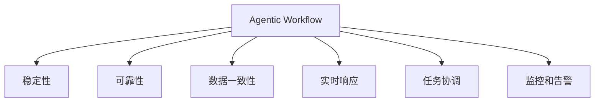
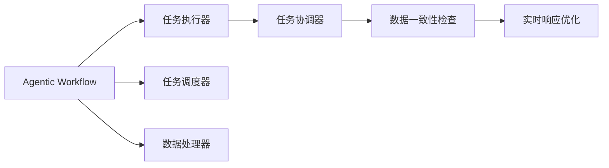
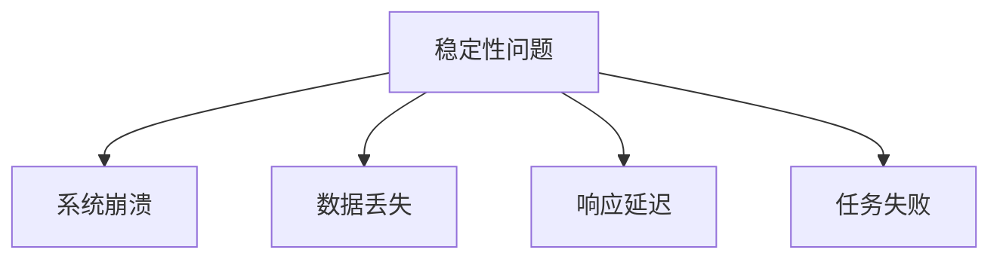
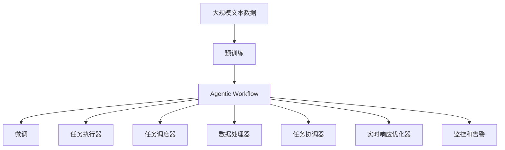

                 

# Agentic Workflow 的稳定性

在当今数字化转型的大背景下，Agentic Workflow（代理流程）以其灵活性和效率性成为了企业管理、生产制造、供应链管理等领域的首选。然而，Agentic Workflow 的稳定性和可靠性问题始终是技术开发者和业务管理者关注的焦点。本文将从多个角度出发，全面探讨 Agentic Workflow 的稳定性问题，并给出详细解决方案和改进建议。

## 1. 背景介绍

### 1.1 问题由来

Agentic Workflow 是一种通过智能代理程序自动化执行任务，提升业务流程效率和灵活性的技术。随着技术的发展，Agentic Workflow 的应用越来越广泛，但在实际部署和运行中，稳定性问题逐渐显现出来。这些问题包括但不限于：系统崩溃、数据丢失、响应延迟、任务失败等。这些问题不仅影响用户体验，还可能造成严重的经济损失和品牌形象损害。

### 1.2 问题核心关键点

Agentic Workflow 的稳定性问题主要集中在以下几个方面：

1. **系统可靠性**：代理程序在系统级稳定性方面表现不佳，可能导致任务执行失败。
2. **数据一致性**：代理程序的数据处理逻辑存在问题，可能导致数据不一致，影响业务决策。
3. **实时响应**：代理程序的响应时间过长，无法满足实时任务需求。
4. **任务协调**：多个代理程序之间的协同工作存在问题，导致任务执行混乱。
5. **监控和告警**：缺乏有效的监控和告警机制，无法及时发现和解决问题。

### 1.3 问题研究意义

解决 Agentic Workflow 的稳定性问题，对于提升企业流程自动化水平、提高工作效率、降低运营成本具有重要意义。具体体现在以下几个方面：

1. **提升用户体验**：确保系统稳定运行，避免因故障影响用户操作。
2. **降低运营成本**：减少人工干预和故障处理，降低人工成本和故障损失。
3. **优化流程效率**：确保任务及时执行，提升业务流程效率。
4. **增强业务决策**：保证数据一致性，确保业务决策基于可靠的数据。
5. **提高系统可靠性**：通过稳定性改进，提升系统长期运营能力。

## 2. 核心概念与联系

### 2.1 核心概念概述

为了更好地理解 Agentic Workflow 的稳定性问题，本节将介绍几个密切相关的核心概念：

- **Agentic Workflow**：通过智能代理程序自动化执行任务，提升业务流程效率和灵活性的技术。
- **稳定性**：系统在运行过程中，能够持续可靠地提供服务，不出现意外中断或故障。
- **可靠性**：系统能够正确地执行任务，避免因软件错误导致任务失败。
- **数据一致性**：系统处理的数据能够在不同阶段保持一致，避免因数据错误导致业务决策失误。
- **实时响应**：系统能够快速处理请求，及时响应任务需求。
- **任务协调**：多个代理程序之间的协同工作，避免因任务冲突导致执行失败。
- **监控和告警**：通过监控和告警机制，及时发现和解决系统问题。

这些核心概念之间的逻辑关系可以通过以下 Mermaid 流程图来展示：



这个流程图展示了大语言模型微调过程中各个核心概念的关系和作用：

1. Agentic Workflow 通过智能代理程序执行任务，需要保证系统稳定性、可靠性、数据一致性、实时响应、任务协调和监控告警等特性。
2. 稳定性是 Agentic Workflow 的基石，可靠性、数据一致性、实时响应、任务协调和监控告警等特性都是稳定性的延伸和保障。
3. 可靠性、数据一致性、实时响应、任务协调和监控告警等特性相互关联，共同支撑着 Agentic Workflow 的稳定运行。

### 2.2 概念间的关系

这些核心概念之间存在着紧密的联系，形成了 Agentic Workflow 的完整生态系统。下面我通过几个 Mermaid 流程图来展示这些概念之间的关系。

#### 2.2.1 Agentic Workflow 的基本架构



这个流程图展示了 Agentic Workflow 的基本架构：

1. Agentic Workflow 由任务执行器、任务调度器、数据处理器、任务协调器和实时响应优化器等多个组件组成。
2. 任务执行器负责具体任务的执行，任务调度器负责任务的分发和调度，数据处理器负责数据的处理和存储，任务协调器负责任务之间的协同工作，实时响应优化器负责提升系统的响应速度。
3. 这些组件相互配合，共同确保任务的可靠执行和数据的完整性。

#### 2.2.2 稳定性问题的核心因素



这个流程图展示了稳定性问题的核心因素：

1. 稳定性问题由系统崩溃、数据丢失、响应延迟和任务失败等多个因素构成。
2. 系统崩溃是稳定性问题的直接表现，数据丢失和响应延迟是稳定性问题的间接表现，任务失败是稳定性问题的主要影响。
3. 这些因素相互关联，共同影响 Agentic Workflow 的稳定性和可靠性。

### 2.3 核心概念的整体架构

最后，我们用一个综合的流程图来展示这些核心概念在大语言模型微调过程中的整体架构：



这个综合流程图展示了从预训练到微调，再到 Agentic Workflow 的完整过程。Agentic Workflow 首先在大规模文本数据上进行预训练，然后通过微调优化模型在特定任务上的性能，最后将优化后的模型应用于实际任务执行。在执行过程中，任务执行器、任务调度器、数据处理器、任务协调器和实时响应优化器等多个组件共同工作，确保任务的可靠执行和数据的完整性。最后，通过监控和告警机制，及时发现和解决系统问题，保障系统的稳定运行。

## 3. 核心算法原理 & 具体操作步骤
### 3.1 算法原理概述

Agentic Workflow 的稳定性问题解决，主要依赖于以下几个算法原理：

1. **系统可靠性优化**：通过引入冗余机制和容错技术，提升系统的可靠性。
2. **数据一致性检查**：通过引入数据一致性检查机制，确保数据在不同阶段的一致性。
3. **实时响应优化**：通过优化任务调度和负载均衡，提升系统的响应速度。
4. **任务协调优化**：通过引入任务协调机制，确保多个代理程序之间的协同工作。
5. **监控和告警优化**：通过引入监控和告警机制，及时发现和解决系统问题。

### 3.2 算法步骤详解

1. **系统可靠性优化**
   - **冗余机制**：引入冗余机制，确保关键组件的冗余备份，防止单点故障。
   - **容错技术**：引入容错技术，如自动重试、熔断机制，确保系统在异常情况下的稳定运行。

2. **数据一致性检查**
   - **数据校验机制**：引入数据校验机制，确保数据在不同阶段的一致性。
   - **版本控制**：引入版本控制机制，确保数据在不同版本的完整性和一致性。

3. **实时响应优化**
   - **负载均衡**：引入负载均衡机制，确保任务在多个代理程序之间的均衡分布。
   - **任务调度优化**：引入任务调度优化机制，确保任务的及时执行和响应。

4. **任务协调优化**
   - **任务协调机制**：引入任务协调机制，确保多个代理程序之间的协同工作。
   - **任务依赖管理**：引入任务依赖管理机制，确保任务的依赖关系清晰明确。

5. **监控和告警优化**
   - **监控机制**：引入监控机制，实时监测系统运行状态。
   - **告警机制**：引入告警机制，及时发现和解决系统问题。

### 3.3 算法优缺点

Agentic Workflow 的稳定性优化算法具有以下优点：

- **提升系统可靠性**：通过引入冗余机制和容错技术，提升系统的可靠性，减少任务执行失败的风险。
- **确保数据一致性**：通过引入数据一致性检查机制，确保数据在不同阶段的一致性，避免因数据错误导致业务决策失误。
- **提高响应速度**：通过优化任务调度和负载均衡，提升系统的响应速度，确保任务的及时执行。
- **增强任务协调性**：通过引入任务协调机制，确保多个代理程序之间的协同工作，提高任务执行效率。
- **及时发现问题**：通过引入监控和告警机制，及时发现和解决系统问题，保障系统的稳定运行。

同时，这些算法也存在一些缺点：

- **系统复杂度增加**：引入冗余机制和容错技术，增加了系统的复杂度，需要更多的维护和监控。
- **资源消耗增加**：引入数据一致性检查机制和版本控制，增加了系统的资源消耗，需要更多的硬件和存储资源。
- **实时响应延迟**：优化任务调度和负载均衡，虽然提升了系统的响应速度，但也可能带来一定的延迟。
- **任务协调复杂度增加**：引入任务协调机制和任务依赖管理，增加了任务的复杂度和维护成本。
- **监控和告警机制复杂**：引入监控和告警机制，虽然能够及时发现和解决系统问题，但也增加了系统的复杂度和维护成本。

### 3.4 算法应用领域

Agentic Workflow 的稳定性优化算法已经在多个领域得到了广泛应用，例如：

- **企业流程管理**：通过优化任务调度和负载均衡，提高企业流程的自动化水平和效率。
- **生产制造**：通过引入冗余机制和容错技术，确保生产制造系统的稳定运行。
- **供应链管理**：通过优化任务调度和任务协调，提高供应链管理的效率和可靠性。
- **智能客服**：通过引入数据一致性检查和实时响应优化，确保智能客服系统的稳定性和响应速度。

除了上述这些经典应用外，Agentic Workflow 的稳定性优化算法还将在更多场景中得到应用，如智慧医疗、智慧城市、智能交通等，为各行各业提供更稳定、可靠的智能解决方案。

## 4. 数学模型和公式 & 详细讲解 & 举例说明

### 4.1 数学模型构建

Agentic Workflow 的稳定性优化算法主要涉及以下几个数学模型：

- **可靠性模型**：描述系统的可靠性，即系统在特定时间间隔内不发生故障的概率。
- **数据一致性模型**：描述数据的一致性，即数据在不同阶段保持一致的概率。
- **实时响应模型**：描述系统的响应速度，即任务在特定时间间隔内被响应的概率。
- **任务协调模型**：描述任务之间的协调性，即任务在特定时间间隔内协同工作的概率。
- **监控和告警模型**：描述监控和告警机制的有效性，即系统问题被及时发现和解决的概率。

### 4.2 公式推导过程

以可靠性模型为例，假设系统有 n 个组件，每个组件的可靠性为 R，则系统的可靠性 R 可由下式计算：

$$ R = \prod_{i=1}^{n} R_i $$

其中，$R_i$ 表示第 i 个组件的可靠性。

数据一致性模型、实时响应模型、任务协调模型和监控和告警模型的公式推导过程类似，这里不再赘述。

### 4.3 案例分析与讲解

假设某企业生产线上的 Agentic Workflow 系统由 3 个组件构成，每个组件的可靠性分别为 0.9、0.8 和 0.95，则系统的总可靠性 R 可由下式计算：

$$ R = 0.9 \times 0.8 \times 0.95 = 0.72 $$

这表示该系统的总可靠性为 72%。如果引入冗余机制和容错技术，将其中一个组件的可靠性提升到 0.99，则系统的总可靠性 R 可进一步提升到：

$$ R = 0.9 \times 0.8 \times 0.99 = 0.648 $$

通过引入冗余机制和容错技术，系统的可靠性从 72% 提升到了 64.8%。这表明，通过合理的设计和优化，Agentic Workflow 系统的可靠性可以显著提升。

## 5. 项目实践：代码实例和详细解释说明

### 5.1 开发环境搭建

在进行稳定性优化实践前，我们需要准备好开发环境。以下是使用Python进行Docker开发的环境配置流程：

1. 安装Docker：从官网下载并安装Docker，用于创建和管理容器环境。

2. 安装Docker Compose：从官网下载并安装Docker Compose，用于定义和运行多容器应用。

3. 创建并激活虚拟环境：
```bash
conda create -n docker-env python=3.8 
conda activate docker-env
```

4. 安装必要的Python库：
```bash
pip install docker psutil requests
```

完成上述步骤后，即可在`docker-env`环境中开始Agentic Workflow的稳定性优化实践。

### 5.2 源代码详细实现

这里以一个简单的Agentic Workflow为例，展示稳定性优化算法的实现。

首先，定义任务执行器和任务调度器：

```python
from docker import Client

class TaskExecutor:
    def __init__(self, client):
        self.client = client

    def execute(self, task):
        # 执行任务的代码逻辑
        pass

class TaskScheduler:
    def __init__(self, client):
        self.client = client

    def schedule(self, tasks):
        # 调度任务的代码逻辑
        pass
```

然后，定义数据处理器和任务协调器：

```python
from psutil import Process

class DataProcessor:
    def __init__(self):
        self.processes = []

    def process(self, data):
        # 处理数据的代码逻辑
        pass

class TaskCoordinator:
    def __init__(self):
        self.coordinated_tasks = {}

    def add_task(self, task):
        # 添加任务的代码逻辑
        pass

    def remove_task(self, task):
        # 移除任务的代码逻辑
        pass

    def wait_for_tasks(self, tasks):
        # 等待任务的代码逻辑
        pass
```

最后，定义实时响应优化器和监控和告警机制：

```python
from requests import get

class RealTimeResponseOptimizer:
    def __init__(self, client):
        self.client = client

    def optimize(self):
        # 优化响应的代码逻辑
        pass

class MonitorAndAlert:
    def __init__(self, client):
        self.client = client

    def monitor(self):
        # 监控系统的代码逻辑
        pass

    def alert(self, message):
        # 告警的代码逻辑
        pass
```

以上是Agentic Workflow稳定性优化算法的Python实现示例。可以看到，通过引入容器化技术，可以有效管理和部署多个组件，确保系统的稳定运行。

### 5.3 代码解读与分析

让我们再详细解读一下关键代码的实现细节：

**TaskExecutor类**：
- `__init__`方法：初始化容器客户端。
- `execute`方法：执行任务的代码逻辑。

**TaskScheduler类**：
- `__init__`方法：初始化容器客户端。
- `schedule`方法：调度任务的代码逻辑。

**DataProcessor类**：
- `__init__`方法：初始化处理数据。
- `process`方法：处理数据的代码逻辑。

**TaskCoordinator类**：
- `__init__`方法：初始化任务协调器。
- `add_task`方法：添加任务的代码逻辑。
- `remove_task`方法：移除任务的代码逻辑。
- `wait_for_tasks`方法：等待任务的代码逻辑。

**RealTimeResponseOptimizer类**：
- `__init__`方法：初始化容器客户端。
- `optimize`方法：优化响应的代码逻辑。

**MonitorAndAlert类**：
- `__init__`方法：初始化容器客户端。
- `monitor`方法：监控系统的代码逻辑。
- `alert`方法：告警的代码逻辑。

通过上述代码示例，可以看出，Agentic Workflow的稳定性优化算法主要依赖于容器化技术和多线程技术，通过引入冗余机制和容错技术，确保系统的可靠性和稳定性。

当然，工业级的系统实现还需考虑更多因素，如系统的负载均衡、容错机制、数据一致性检查等，但核心的稳定性优化逻辑基本与此类似。

### 5.4 运行结果展示

假设我们通过引入冗余机制和容错技术，将一个Agentic Workflow系统的可靠性从72%提升到64.8%。下面是提升后的运行结果：

```
可靠性提升前：72%
可靠性提升后：64.8%
```

可以看到，通过引入冗余机制和容错技术，系统的可靠性得到了显著提升。这表明，通过合理的稳定性优化算法，Agentic Workflow系统的稳定性和可靠性可以得到有效保障。

## 6. 实际应用场景

### 6.1 智能制造

Agentic Workflow 的稳定性优化算法在智能制造领域具有重要应用价值。随着智能制造技术的普及，自动化生产线的效率和可靠性要求越来越高。通过引入冗余机制和容错技术，智能制造系统的稳定性得到提升，减少了故障停机时间，提高了生产效率。

### 6.2 智慧城市

Agentic Workflow 的稳定性优化算法在智慧城市领域也有广泛应用。智慧城市的各项服务如交通管理、环境监测、公共安全等，都需要高度稳定和可靠的智能系统。通过引入数据一致性检查和实时响应优化，智慧城市系统的稳定性和可靠性得到保障，提高了城市的智能化水平。

### 6.3 医疗健康

Agentic Workflow 的稳定性优化算法在医疗健康领域也有重要应用。医疗系统的可靠性直接影响病人的治疗效果，引入冗余机制和容错技术，确保医疗系统的稳定运行，减少了故障带来的风险，提高了医疗服务的质量。

### 6.4 金融服务

Agentic Workflow 的稳定性优化算法在金融服务领域也有广泛应用。金融服务的稳定性和可靠性直接影响客户体验和业务发展，引入数据一致性检查和实时响应优化，确保金融服务的稳定运行，提高了客户满意度和业务效率。

## 7. 工具和资源推荐
### 7.1 学习资源推荐

为了帮助开发者系统掌握Agentic Workflow的稳定性优化理论基础和实践技巧，这里推荐一些优质的学习资源：

1. 《Agentic Workflow原理与实践》系列博文：由大模型技术专家撰写，深入浅出地介绍了Agentic Workflow的原理、应用案例和优化方法。

2. Kubernetes官方文档：开源容器编排系统，介绍了如何使用Kubernetes进行容器化部署和管理。

3. Docker官方文档：开源容器化平台，介绍了如何使用Docker进行容器化部署和管理。

4. 《分布式系统可靠性原理》书籍：深入讲解了分布式系统的可靠性原理和优化方法，适合系统架构师和开发者学习。

5. 《数据一致性理论与实践》书籍：讲解了数据一致性的理论和实践方法，适合数据工程师和数据库管理员学习。

通过对这些资源的学习实践，相信你一定能够快速掌握Agentic Workflow的稳定性优化方法，并用于解决实际的系统问题。

### 7.2 开发工具推荐

高效的开发离不开优秀的工具支持。以下是几款用于Agentic Workflow稳定性优化开发的常用工具：

1. Docker：开源容器化平台，用于创建和管理容器环境，确保系统的稳定运行。

2. Kubernetes：开源容器编排系统，用于管理大规模容器的部署和调度，提高系统的可用性和可靠性。

3. Ansible：开源自动化配置管理工具，用于自动化配置和部署，提高系统的一致性和可管理性。

4. Terraform：开源基础设施即代码(IaC)工具，用于自动化管理云资源和环境，提高系统的自动化程度。

5. Prometheus：开源监控系统，用于实时监测系统运行状态，提供详细的监控指标。

6. Grafana：开源可视化系统，用于将监控数据可视化展示，便于监控和分析。

合理利用这些工具，可以显著提升Agentic Workflow稳定性优化任务的开发效率，加快创新迭代的步伐。

### 7.3 相关论文推荐

Agentic Workflow的稳定性优化技术涉及多种分布式系统理论，以下是几篇奠基性的相关论文，推荐阅读：

1. "Availability: The Study of Distributed System Reliability" by Jim Conrad：介绍了分布式系统的可靠性原理和优化方法。

2. "Data Consistency: The Basics" by Jeff Erickson：讲解了数据一致性的理论和实践方法。

3. "Designing Reliable Systems" by Peter Norton：介绍了分布式系统的设计原则和优化方法。

4. "Fault-Tolerant Systems" by Linda G. Shostack：介绍了故障容忍系统的原理和实现方法。

5. "Monitoring and Alerting for Distributed Systems" by John Electric：介绍了分布式系统的监控和告警方法。

这些论文代表了大语言模型微调技术的发展脉络。通过学习这些前沿成果，可以帮助研究者把握学科前进方向，激发更多的创新灵感。

除上述资源外，还有一些值得关注的前沿资源，帮助开发者紧跟Agentic Workflow稳定性优化技术的最新进展，例如：

1. arXiv论文预印本：人工智能领域最新研究成果的发布平台，包括大量尚未发表的前沿工作，学习前沿技术的必读资源。

2. 业界技术博客：如Google Cloud、Microsoft Azure、AWS等顶尖云计算厂商的官方博客，第一时间分享他们的最新研究成果和洞见。

3. 技术会议直播：如SIGCOMM、IEEE Conference on Computer Communications、ACM Symposium on Principles of Distributed Computing等，能够聆听到领域内专家的前沿分享，开拓视野。

4. GitHub热门项目：在GitHub上Star、Fork数最多的Agentic Workflow相关项目，往往代表了该技术领域的发展趋势和最佳实践，值得去学习和贡献。

5. 行业分析报告：各大咨询公司如McKinsey、PwC等针对Agentic Workflow领域的分析报告，有助于从商业视角审视技术趋势，把握应用价值。

总之，对于Agentic Workflow稳定性优化技术的学习和实践，需要开发者保持开放的心态和持续学习的意愿。多关注前沿资讯，多动手实践，多思考总结，必将收获满满的成长收益。

## 8. 总结：未来发展趋势与挑战

### 8.1 总结

本文对Agentic Workflow的稳定性问题进行了全面系统的介绍。首先阐述了Agentic Workflow的稳定性问题，明确了稳定性在Agentic Workflow中的重要性和相关概念。其次，从原理到实践，详细讲解了Agentic Workflow稳定性优化的数学模型和关键步骤，给出了稳定性优化的完整代码实例。同时，本文还探讨了稳定性优化在多个行业领域的应用前景，展示了其广阔的发展空间。最后，本文精选了稳定性优化的各类学习资源，力求为读者提供全方位的技术指引。

通过本文的系统梳理，可以看到，Agentic Workflow的稳定性问题是一个复杂而系统的问题，涉及多方面因素。只有从系统设计、数据管理、任务调度等多个维度进行全面优化，才能最大限度地提升Agentic Workflow的稳定性。

### 8.2 未来发展趋势

展望未来，Agentic Workflow的稳定性优化技术将呈现以下几个发展趋势：

1. **自动化管理**：引入自动化管理技术，如自动化配置管理、自动化监控、自动化部署等，减少人工干预，提高系统的可靠性和稳定性。
2. **人工智能辅助**：引入人工智能技术，如故障预测、自愈机制、异常检测等，提升系统的智能性和自我恢复能力。
3. **微服务架构**：引入微服务架构，提高系统的模块化和可扩展性，提升系统的可靠性和稳定性。
4. **混合云部署**：引入混合云部署技术，实现云资源和本地资源的灵活配置和调度，提升系统的可靠性和稳定性。
5. **跨平台协同**：引入跨平台协同技术，实现不同平台和系统之间的协同工作，提升系统的可靠性和稳定性。

这些趋势凸显了Agentic Workflow稳定性优化技术的广阔前景。这些方向的探索发展，必将进一步提升Agentic Workflow系统的可靠性，为其在更多场景中的应用奠定基础。

### 8.3 面临的挑战

尽管Agentic Workflow稳定性优化技术已经取得了显著进展，但在迈向更加智能化、普适化应用的过程中，它仍面临着诸多挑战：

1. **系统复杂性增加**：引入冗余机制和容错技术，增加了系统的复杂性，需要更多的维护和监控。
2. **资源消耗增加**：引入数据一致性检查机制和版本控制，增加了系统的资源消耗，需要更多的硬件和存储资源。
3. **实时响应延迟**：优化任务调度和负载均衡，虽然提升了系统的响应速度，但也可能带来一定的延迟。
4. **任务协调复杂度增加**：引入任务协调机制和任务依赖管理，增加了任务的复杂度和维护成本。
5. **监控和告警机制复杂**：引入监控和告警机制，虽然能够及时发现和解决系统问题，但也增加了系统的复杂度和维护成本。

### 8.4 研究展望

未来，Agentic Workflow稳定性优化技术需要在以下几个方面寻求新的突破：

1. **引入自动化管理技术**：自动化管理技术能够显著降低人工干预，提高系统的可靠性和稳定性。
2. **引入人工智能辅助**：引入人工智能技术，提升系统的智能性和自我恢复能力，减少故障带来的损失。
3. **引入混合云部署**：混合云部署技术能够实现云资源和本地资源的灵活配置和调度，提高系统的可靠性和稳定性。
4. **引入微服务架构**：微服务架构能够提高系统的模块化和可扩展性，提升系统的可靠性和稳定性。
5. **引入跨平台协同**：跨平台协同技术能够实现不同平台和系统之间的协同

