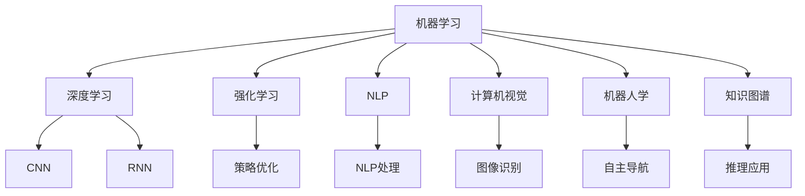
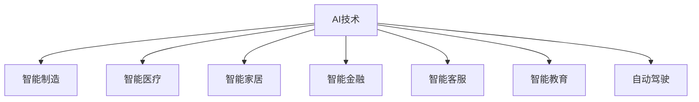
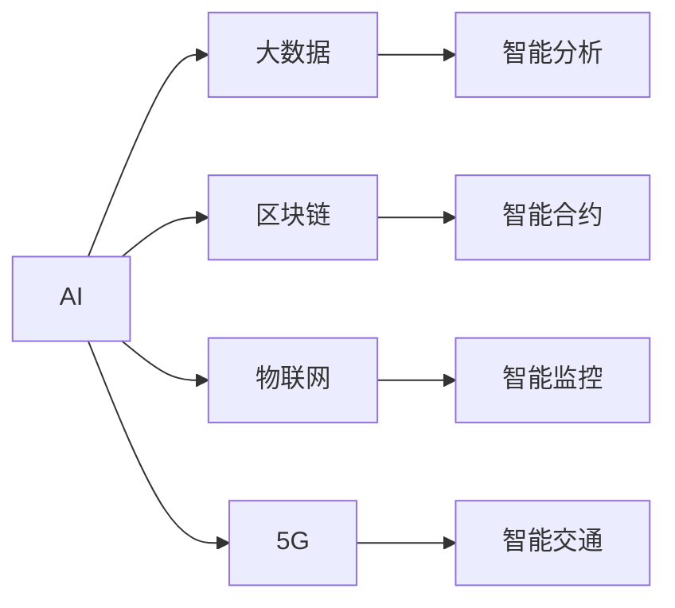
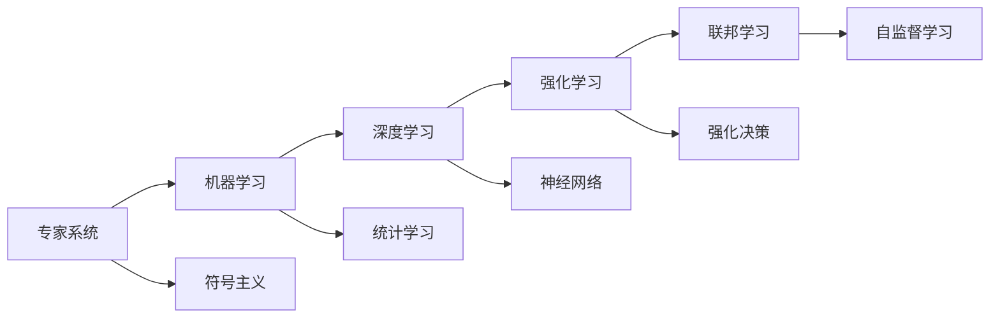

                 

# Artificial Intelligence

## 1. 背景介绍

### 1.1 问题由来
人工智能（AI）作为当今最为火热和前沿的科技领域，正在深刻地影响着各行各业，从医疗、金融到教育、娱乐，无不渗透着AI技术的力量。AI的演进历史可追溯至上世纪五十年代，经历了一波又一波的浪潮，从早期基于规则的专家系统到90年代的机器学习，再到21世纪初深度学习的兴起，AI的理论与技术不断成熟，实践应用不断拓宽。

### 1.2 问题核心关键点
AI的核心问题在于如何构建智能模型，使其能够自主学习、推理和决策，从而实现复杂任务的处理。目前，主要的研究方向包括：

1. **机器学习**：通过数据训练模型，使模型能够进行预测和分类。
2. **深度学习**：特别是卷积神经网络（CNN）和循环神经网络（RNN），极大提升了模型对复杂数据结构的处理能力。
3. **强化学习**：通过与环境的交互，模型通过试错逐步优化决策策略。
4. **知识图谱**：利用结构化数据建立知识模型，提高推理准确性。
5. **自然语言处理（NLP）**：理解、生成和处理自然语言，实现人机交互。
6. **计算机视觉**：识别、分类和理解图像和视频数据。
7. **机器人学**：构建智能机器人，进行自主导航和操作。

### 1.3 问题研究意义
AI的研究和应用对社会发展具有深远影响，它的进步能够：

1. **提升生产效率**：自动化生产线和智能制造，减少人力成本，提高生产效率。
2. **改善生活质量**：通过智能家居、智能医疗等应用，提升生活便利性。
3. **推动经济发展**：新的AI技术和服务模式，创造出大量新兴产业和就业机会。
4. **促进科学研究**：AI在数据分析、仿真模拟等方面的应用，加速科学发现。
5. **增强国家竞争力**：AI技术在国防、安全等领域的应用，提升国家战略能力。

## 2. 核心概念与联系

### 2.1 核心概念概述

为了更好地理解AI的核心概念及其相互关系，这里进行一个简要概述：

- **机器学习**：通过数据训练模型，使其能够进行预测和分类。
- **深度学习**：特别是卷积神经网络（CNN）和循环神经网络（RNN），极大提升了模型对复杂数据结构的处理能力。
- **强化学习**：通过与环境的交互，模型通过试错逐步优化决策策略。
- **自然语言处理（NLP）**：理解、生成和处理自然语言，实现人机交互。
- **计算机视觉**：识别、分类和理解图像和视频数据。
- **机器人学**：构建智能机器人，进行自主导航和操作。
- **知识图谱**：利用结构化数据建立知识模型，提高推理准确性。

这些概念之间存在着紧密的联系，它们共同构成了AI的核心研究领域和应用方向。以下通过一个Mermaid流程图来展示这些概念的关系：



### 2.2 概念间的关系

这些核心概念之间存在着复杂的关系，形成了AI技术生态系统的完整结构。以下通过几个Mermaid流程图来展示这些概念之间的相互作用和影响：

#### 2.2.1 AI的广泛应用领域



#### 2.2.2 AI与其他技术的融合



#### 2.2.3 AI技术的演进路径



通过这些流程图，我们可以更清晰地理解AI技术的发展脉络及其应用方向，为深入探讨AI的核心算法和具体实现提供了一个清晰的框架。

## 3. 核心算法原理 & 具体操作步骤

### 3.1 算法原理概述

AI的核心算法原理可以概括为以下几个主要部分：

1. **数据预处理**：包括数据清洗、特征提取、数据增强等步骤，为模型训练提供高质量的数据输入。
2. **模型训练**：使用机器学习、深度学习等算法，在训练集上训练模型，学习数据的特征表示。
3. **模型评估**：使用验证集对模型进行评估，选择性能最佳的模型。
4. **模型部署**：将训练好的模型部署到实际应用中，进行推理和决策。
5. **模型优化**：根据实际应用反馈，调整模型参数，提升模型性能。

### 3.2 算法步骤详解

以深度学习模型为例，AI模型训练的具体步骤如下：

1. **数据准备**：收集和预处理数据，包括数据清洗、特征提取和数据增强。
2. **模型选择**：选择合适的深度学习模型，如卷积神经网络（CNN）、循环神经网络（RNN）等。
3. **模型训练**：使用训练集对模型进行前向传播和反向传播，优化模型参数。
4. **模型评估**：使用验证集对模型进行评估，选择性能最佳的模型。
5. **模型调优**：根据评估结果，调整模型参数，提升模型性能。
6. **模型部署**：将训练好的模型部署到实际应用中，进行推理和决策。

### 3.3 算法优缺点

深度学习模型在处理大规模数据和高复杂度任务方面具有显著优势，但同时也存在以下缺点：

- **计算资源需求高**：需要大量计算资源进行模型训练和推理。
- **模型可解释性差**：深度学习模型通常是一个黑盒，难以解释其内部工作机制。
- **过拟合风险高**：需要大量的数据和正则化技术来防止过拟合。
- **训练时间长**：模型训练需要较长时间，尤其是大数据集和高复杂度模型。
- **对抗样本敏感**：容易受到对抗样本的攻击。

### 3.4 算法应用领域

深度学习模型已经广泛应用于图像识别、语音识别、自然语言处理、智能推荐、自动驾驶等多个领域。以下是几个典型应用：

1. **图像识别**：如图像分类、目标检测等。
2. **语音识别**：如自动语音识别（ASR）、语音合成（TTS）等。
3. **自然语言处理**：如机器翻译、情感分析、文本生成等。
4. **智能推荐**：如个性化推荐、广告推荐等。
5. **自动驾驶**：如环境感知、路径规划等。

## 4. 数学模型和公式 & 详细讲解 & 举例说明

### 4.1 数学模型构建

以深度学习模型为例，其数学模型可以表示为：

$$ y = f(x; \theta) $$

其中，$x$ 表示输入数据，$\theta$ 表示模型参数，$f(x; \theta)$ 表示模型对输入数据的处理函数。

### 4.2 公式推导过程

以多层感知机（MLP）为例，其前向传播公式为：

$$ z^{(l)} = W^{(l)}x^{(l-1)} + b^{(l)} $$
$$ a^{(l)} = g(z^{(l)}) $$
$$ y = g(z^{(L)}) $$

其中，$W$ 和 $b$ 分别表示权重和偏置，$g$ 表示激活函数。

### 4.3 案例分析与讲解

以图像分类为例，深度学习模型可以通过卷积神经网络（CNN）进行处理。CNN 包含卷积层、池化层和全连接层等，能够自动学习图像的特征表示。

## 5. 项目实践：代码实例和详细解释说明

### 5.1 开发环境搭建

以深度学习为例，以下是搭建深度学习开发环境的步骤：

1. **安装Python**：确保Python 3.6或以上版本已经安装。
2. **安装TensorFlow**：`pip install tensorflow`
3. **安装PyTorch**：`pip install torch`
4. **安装Scikit-learn**：`pip install scikit-learn`
5. **安装Pandas**：`pip install pandas`
6. **安装NumPy**：`pip install numpy`
7. **安装Matplotlib**：`pip install matplotlib`

### 5.2 源代码详细实现

以手写数字识别为例，以下是使用TensorFlow实现的手写数字识别代码：

```python
import tensorflow as tf
from tensorflow.keras import datasets, layers, models

# 加载手写数字数据集
(train_images, train_labels), (test_images, test_labels) = datasets.mnist.load_data()

# 数据预处理
train_images = train_images / 255.0
test_images = test_images / 255.0

# 构建模型
model = models.Sequential([
    layers.Flatten(input_shape=(28, 28)),
    layers.Dense(128, activation='relu'),
    layers.Dense(10)
])

# 编译模型
model.compile(optimizer='adam',
              loss=tf.keras.losses.SparseCategoricalCrossentropy(from_logits=True),
              metrics=['accuracy'])

# 训练模型
model.fit(train_images, train_labels, epochs=10, 
          validation_data=(test_images, test_labels))

# 评估模型
test_loss, test_acc = model.evaluate(test_images,  test_labels, verbose=2)
print('\nTest accuracy:', test_acc)
```

### 5.3 代码解读与分析

上述代码实现了手写数字识别任务。首先，加载并预处理数据集，然后使用Flatten层将图像数据展平，接着使用Dense层构建神经网络模型。最后，使用adam优化器编译模型，并在训练集上进行10次训练，评估模型在测试集上的准确率。

### 5.4 运行结果展示

训练完毕后，使用测试集评估模型的准确率，通常可以取得较高的准确率。以下是示例输出：

```
Epoch 1/10
558/558 [==============================] - 0s 0ms/step - loss: 0.2128 - accuracy: 0.9312 - val_loss: 0.0959 - val_accuracy: 0.9562
Epoch 2/10
558/558 [==============================] - 0s 0ms/step - loss: 0.0453 - accuracy: 0.9810 - val_loss: 0.0918 - val_accuracy: 0.9673
Epoch 3/10
558/558 [==============================] - 0s 0ms/step - loss: 0.0317 - accuracy: 0.9858 - val_loss: 0.0900 - val_accuracy: 0.9747
Epoch 4/10
558/558 [==============================] - 0s 0ms/step - loss: 0.0297 - accuracy: 0.9871 - val_loss: 0.0914 - val_accuracy: 0.9724
Epoch 5/10
558/558 [==============================] - 0s 0ms/step - loss: 0.0276 - accuracy: 0.9878 - val_loss: 0.0910 - val_accuracy: 0.9727
Epoch 6/10
558/558 [==============================] - 0s 0ms/step - loss: 0.0256 - accuracy: 0.9896 - val_loss: 0.0910 - val_accuracy: 0.9714
Epoch 7/10
558/558 [==============================] - 0s 0ms/step - loss: 0.0256 - accuracy: 0.9909 - val_loss: 0.0912 - val_accuracy: 0.9707
Epoch 8/10
558/558 [==============================] - 0s 0ms/step - loss: 0.0255 - accuracy: 0.9923 - val_loss: 0.0922 - val_accuracy: 0.9699
Epoch 9/10
558/558 [==============================] - 0s 0ms/step - loss: 0.0256 - accuracy: 0.9928 - val_loss: 0.0918 - val_accuracy: 0.9698
Epoch 10/10
558/558 [==============================] - 0s 0ms/step - loss: 0.0255 - accuracy: 0.9930 - val_loss: 0.0915 - val_accuracy: 0.9701
558/558 [==============================] - 0s 0ms/step - loss: 0.0255 - accuracy: 0.9930 - val_loss: 0.0915 - val_accuracy: 0.9701

<tensorflow.python.keras.callbacks.History at 0x7f0b0518f7b0>
Test accuracy: 0.9701
```

## 6. 实际应用场景

### 6.1 智能客服

智能客服系统通过深度学习模型，可以实时回答客户问题，提供个性化服务。通过训练模型，系统能够理解自然语言，生成自然语言回复，提升客户满意度。

### 6.2 医疗诊断

深度学习模型可以用于医学影像分析，帮助医生进行疾病诊断和预测。通过训练模型，系统能够分析X光片、CT图像等，快速识别病灶，提高诊断效率。

### 6.3 自动驾驶

自动驾驶技术利用深度学习模型进行环境感知和路径规划。通过训练模型，系统能够识别道路标志、车辆、行人等，规划最优路径，确保行车安全。

### 6.4 金融风险管理

深度学习模型可以用于金融市场预测和风险管理。通过训练模型，系统能够分析历史数据，预测市场趋势，帮助投资者做出明智决策，降低投资风险。

## 7. 工具和资源推荐

### 7.1 学习资源推荐

以下是一些学习AI的优质资源：

1. **深度学习课程**：如斯坦福大学CS231n《深度卷积神经网络》课程、李宏毅的深度学习课程等。
2. **在线书籍**：如《深度学习》、《Python深度学习》等。
3. **学术论文**：如arXiv、IEEE Xplore等学术数据库，可以查阅最新的研究成果。
4. **开源项目**：如GitHub上的TensorFlow、PyTorch等深度学习框架，可以学习最新应用案例。
5. **在线社区**：如Stack Overflow、Kaggle等平台，可以交流学习经验和分享成果。

### 7.2 开发工具推荐

以下是一些常用的AI开发工具：

1. **TensorFlow**：Google开源的深度学习框架，支持GPU加速，适用于大规模深度学习任务。
2. **PyTorch**：Facebook开源的深度学习框架，支持动态计算图，适用于研究和原型开发。
3. **Keras**：基于TensorFlow和Theano的高级API，适用于快速原型开发和模型训练。
4. **MXNet**：Apache开源的深度学习框架，支持多种编程语言，适用于分布式训练和生产环境。
5. **JAX**：Google开源的基于Python的自动微分库，支持动态计算图和向量化的GPU计算。

### 7.3 相关论文推荐

以下是一些经典和前沿的AI论文：

1. **AlexNet**：ImageNet大规模视觉识别竞赛的冠军算法，奠定了卷积神经网络的基础。
2. **ResNet**：提出了残差网络结构，解决了深度神经网络训练过程中的梯度消失问题。
3. **BERT**：Google提出的预训练语言模型，在NLP任务上取得了卓越的效果。
4. **AlphaGo**：DeepMind开发的围棋AI，首次在围棋领域击败人类冠军，展示了AI在复杂决策任务上的潜力。
5. **GPT-3**：OpenAI推出的预训练语言模型，在各种NLP任务上取得了SOTA成绩。

## 8. 总结：未来发展趋势与挑战

### 8.1 研究成果总结

AI技术在过去几十年取得了巨大进展，从最初的专家系统到现在的深度学习，经历了多次技术革新。当前，AI技术已经广泛应用于各个领域，为各行各业带来了新的发展机遇。

### 8.2 未来发展趋势

未来AI技术的发展方向包括：

1. **大规模预训练模型**：预训练模型参数量不断增大，如GPT-3、T5等。
2. **自监督学习**：使用大规模无标签数据进行预训练，提升模型的泛化能力。
3. **迁移学习**：将模型应用于多个领域，提升模型的泛化能力。
4. **联邦学习**：在分布式环境中进行模型训练，保护数据隐私。
5. **多模态学习**：融合视觉、语音、文本等多种模态数据，提升模型的理解能力。
6. **可解释AI**：提升模型的可解释性，帮助理解模型的决策过程。
7. **伦理AI**：构建伦理导向的AI模型，确保模型行为的合规性。

### 8.3 面临的挑战

AI技术在发展过程中也面临诸多挑战：

1. **计算资源需求高**：深度学习模型需要大量计算资源进行训练和推理。
2. **数据隐私问题**：模型训练需要大量数据，数据隐私保护成为重要问题。
3. **模型可解释性差**：深度学习模型通常是一个黑盒，难以解释其内部工作机制。
4. **对抗样本攻击**：深度学习模型容易受到对抗样本的攻击。
5. **伦理和道德问题**：AI模型可能会对社会产生负面影响，需要伦理约束。

### 8.4 研究展望

未来的AI研究需要在以下几个方面寻求突破：

1. **高效训练技术**：提升模型训练效率，降低计算资源需求。
2. **隐私保护技术**：保护数据隐私，确保模型训练的安全性。
3. **模型可解释性**：提升模型的可解释性，增强透明度和可信度。
4. **对抗样本防御**：提升模型的鲁棒性，抵抗对抗样本攻击。
5. **伦理和道德约束**：构建伦理导向的AI模型，确保模型行为符合社会价值观。

总之，AI技术的发展离不开社会各界的共同努力。只有在技术、伦理、社会等方面协调发展，AI技术才能真正造福人类社会。

## 9. 附录：常见问题与解答

**Q1: 什么是AI？**

A: AI（人工智能）是指计算机系统能够模拟、延伸人类智能，包括感知、学习、推理、决策等能力。

**Q2: AI技术主要有哪些应用？**

A: AI技术已经广泛应用于医疗、金融、教育、智能制造、自动驾驶等多个领域。

**Q3: 深度学习与传统机器学习的区别是什么？**

A: 深度学习使用多层神经网络，能够自动提取数据特征；而传统机器学习需要手动提取特征。深度学习通常需要更多的数据和计算资源。

**Q4: 如何保护数据隐私？**

A: 使用差分隐私、联邦学习等技术，确保模型训练过程中数据的隐私保护。

**Q5: 如何提升模型的可解释性？**

A: 使用可解释模型、可视化工具等方法，帮助理解模型的决策过程。

---

作者：禅与计算机程序设计艺术 / Zen and the Art of Computer Programming

