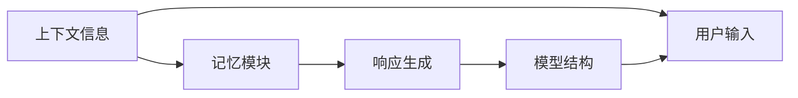
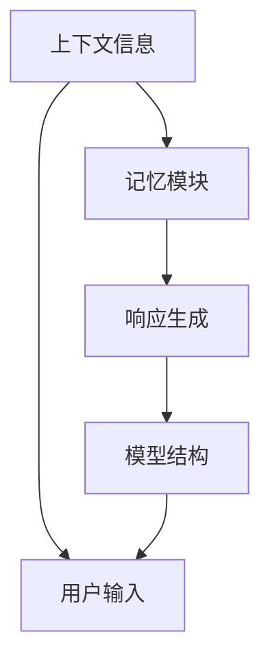
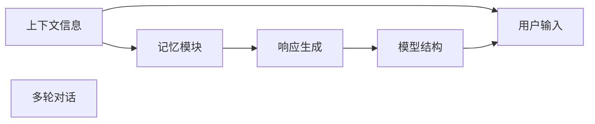
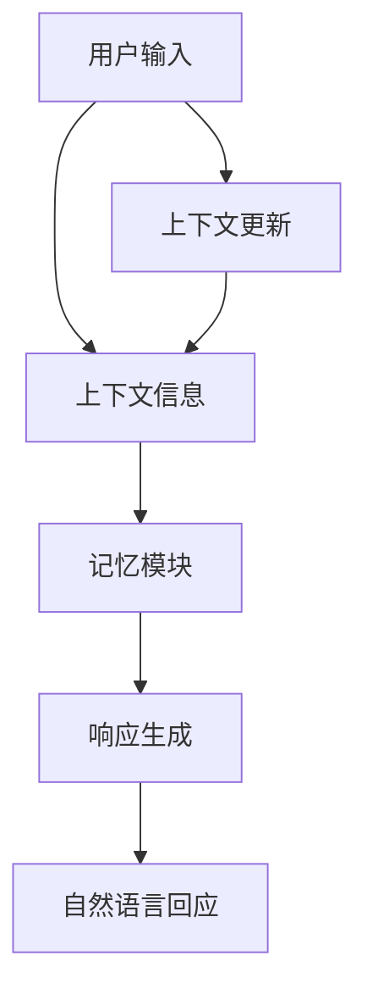

                 

# CUI的上下文记忆与智能化回应

## 1. 背景介绍

### 1.1 问题由来

随着人工智能（AI）技术的快速发展，用户接口（CUI， Conversational User Interface）已经成为一种重要的交互方式。与传统的命令行和图形界面相比，CUI更加自然、直观，能够快速响应用户的输入。但传统的CUI系统往往是静态的，缺乏上下文记忆能力，在处理复杂交互场景时，往往无法给出智能化的回应。

为了提升CUI的智能化水平，研究人员提出了一种基于上下文记忆的CUI响应生成模型，该模型能够通过记忆用户的上下文信息，生成更加精准、自然的回应。本文将详细介绍该模型的核心算法原理、具体操作步骤及其实际应用。

### 1.2 问题核心关键点

CUI的上下文记忆与智能化回应主要涉及以下几个关键点：

- **上下文记忆**：CUI模型需要记住用户输入的历史信息，以便更好地理解用户的意图和上下文环境。
- **智能化回应**：基于上下文记忆，模型需要能够生成自然、准确的回应，甚至在必要时提供建议和解决方案。
- **多轮对话**：CUI系统往往需要进行多轮对话，模型需要具备记忆和处理多轮对话的能力。
- **语言生成**：CUI模型需要能够生成符合语法和语义规范的自然语言回应。
- **情感感知**：在处理情感化对话时，CUI模型需要能够感知用户的情感，并作出相应的情感回应。

这些关键点共同构成了CUI模型的核心功能，通过合理设计和优化，可以显著提升CUI系统的智能化水平和用户体验。

### 1.3 问题研究意义

基于上下文记忆的CUI响应生成模型，具有以下几个重要意义：

1. **提升用户体验**：通过记忆用户的上下文信息，模型能够提供更加个性化和智能化的回应，提升用户的满意度。
2. **提高系统效率**：模型能够快速理解用户意图，避免不必要的交互，提高系统处理速度和响应效率。
3. **增强系统可靠性**：上下文记忆能力使得模型能够更好地处理复杂场景和异常输入，提高系统的鲁棒性和可靠性。
4. **扩展应用范围**：模型适用于各种CUI场景，包括智能客服、虚拟助手、语音助手等，具有广泛的应用前景。

## 2. 核心概念与联系

### 2.1 核心概念概述

为了更好地理解CUI的上下文记忆与智能化回应，我们需要先了解以下几个核心概念：

- **上下文信息（Context）**：指用户当前对话中的历史信息和背景信息。
- **记忆模块（Memory）**：用于存储和检索上下文信息，是上下文记忆的核心组件。
- **响应生成（Response Generation）**：基于上下文信息生成自然语言回应。
- **模型结构（Architecture）**：包括上下文记忆模块和响应生成模块，通常采用循环神经网络（RNN）或Transformer等结构。

这些概念之间的逻辑关系可以通过以下Mermaid流程图来展示：



这个流程图展示了CUI模型处理用户输入和生成回应的主要流程：

1. 用户输入被送入模型。
2. 模型通过记忆模块存储上下文信息。
3. 基于上下文信息和记忆模块，响应生成模块生成自然语言回应。
4. 模型结构包含上下文记忆和响应生成两个部分，整体组成CUI模型。

### 2.2 概念间的关系

这些核心概念之间存在着紧密的联系，形成了CUI响应的完整生态系统。下面我们通过几个Mermaid流程图来展示这些概念之间的关系。

#### 2.2.1 上下文信息与记忆模块



这个流程图展示了上下文信息与记忆模块的关系：

1. 上下文信息被送入记忆模块。
2. 记忆模块用于存储和检索上下文信息。
3. 基于上下文信息和记忆模块，响应生成模块生成自然语言回应。

#### 2.2.2 记忆模块与响应生成


这个流程图展示了记忆模块与响应生成模块的关系：

1. 上下文信息被送入记忆模块。
2. 记忆模块存储上下文信息。
3. 响应生成模块基于上下文信息和记忆模块生成自然语言回应。

#### 2.2.3 上下文记忆与多轮对话



这个流程图展示了上下文记忆与多轮对话的关系：

1. 上下文信息被送入记忆模块。
2. 记忆模块存储上下文信息。
3. 响应生成模块基于上下文信息和记忆模块生成自然语言回应。
4. 多轮对话过程中，上下文信息不断更新，记忆模块动态调整存储信息。

### 2.3 核心概念的整体架构

最后，我们用一个综合的流程图来展示这些核心概念在大语言模型微调过程中的整体架构：



这个综合流程图展示了CUI模型处理用户输入和生成回应的完整过程：

1. 用户输入被送入模型。
2. 模型通过上下文信息存储用户输入的历史信息。
3. 记忆模块存储上下文信息。
4. 响应生成模块基于上下文信息和记忆模块生成自然语言回应。
5. 上下文信息在多轮对话过程中不断更新，记忆模块动态调整存储信息。

通过这些流程图，我们可以更清晰地理解CUI响应的核心概念及其关系，为后续深入讨论具体的算法和模型设计奠定基础。

## 3. 核心算法原理 & 具体操作步骤

### 3.1 算法原理概述

基于上下文记忆的CUI响应生成模型，通过将上下文信息存储在记忆模块中，使得模型能够理解用户输入的历史信息，从而生成更加精准和自然的回应。该模型的核心算法原理包括以下几个步骤：

1. **上下文信息提取**：将用户输入的文本转换为上下文向量。
2. **记忆模块存储**：将上下文向量存储在记忆模块中，并更新记忆。
3. **上下文信息检索**：从记忆模块中检索上下文信息。
4. **生成自然语言回应**：基于检索到的上下文信息和记忆模块，生成自然语言回应。

### 3.2 算法步骤详解

#### 3.2.1 上下文信息提取

上下文信息提取是指将用户输入的文本转换为上下文向量。常用的方法包括word2vec、GloVe等词嵌入方法，以及Transformer等基于序列模型的上下文提取方法。

以Transformer为例，假设用户输入的文本为 $x = \{x_1, x_2, ..., x_n\}$，其中 $x_i$ 表示第 $i$ 个单词。通过Transformer编码器，可以将 $x$ 转换为上下文向量 $h_x$。

$$
h_x = \text{TransformerEncoder}(x)
$$

#### 3.2.2 记忆模块存储

记忆模块用于存储上下文信息，常用的方法包括LSTM、GRU等序列记忆模块，以及Transformer等并行记忆模块。

以Transformer为例，假设记忆模块为 $M$，当前存储的上下文信息为 $h_{x_i}$，则更新记忆模块的过程为：

$$
h_{x_{i+1}} = M(h_{x_i}, h_x)
$$

其中 $M$ 为记忆模块的更新函数。

#### 3.2.3 上下文信息检索

上下文信息检索是指从记忆模块中检索历史上下文信息。常用的方法包括注意力机制（Attention）和查询-键值对（Query-Key-Value）机制。

以Transformer为例，假设检索到的上下文向量为 $h_{x_{i-1}}$，则检索过程为：

$$
\alpha = \text{Attention}(h_x, h_{x_{i-1}})
$$

$$
h_{x_{i-1}}' = \text{Softmax}(\alpha) \cdot h_{x_{i-1}}
$$

#### 3.2.4 生成自然语言回应

生成自然语言回应是指基于检索到的上下文信息和记忆模块，生成自然语言回应。常用的方法包括语言模型（LM）和解码器。

以Transformer为例，假设生成回应的过程为 $y = \{y_1, y_2, ..., y_m\}$，则生成过程为：

$$
y = \text{Decoder}(h_x', h_{x_{i-1}}')
$$

其中 $h_x'$ 为上下文向量 $h_x$ 的注意力权重加权和，$h_{x_{i-1}}'$ 为检索到的上下文向量 $h_{x_{i-1}}$ 的注意力权重加权和。

### 3.3 算法优缺点

基于上下文记忆的CUI响应生成模型具有以下优点：

1. **上下文理解能力**：通过记忆上下文信息，模型能够更好地理解用户的意图和上下文环境。
2. **生成自然语言**：基于上下文记忆，模型能够生成符合语法和语义规范的自然语言回应。
3. **多轮对话处理**：模型能够处理多轮对话，并基于上下文信息进行动态调整。

同时，该模型也存在一些缺点：

1. **存储开销大**：记忆模块需要存储大量的上下文信息，占用的存储空间较大。
2. **计算复杂度高**：检索上下文信息的过程需要计算注意力权重，计算复杂度较高。
3. **模型训练难度高**：模型需要训练多个模块，模型参数较多，训练难度较大。

### 3.4 算法应用领域

基于上下文记忆的CUI响应生成模型已经在多个领域得到了广泛应用，例如：

- **智能客服**：通过记忆用户的输入信息，生成个性化的回答，提高客服效率和用户体验。
- **虚拟助手**：通过上下文记忆，提供定制化的服务，满足用户的个性化需求。
- **语音助手**：通过记忆对话历史，提供连贯和自然的回应，提升用户体验。
- **医疗咨询**：通过记忆用户的历史记录，提供个性化的医疗建议和信息。
- **教育辅导**：通过记忆学生的学习历史，提供个性化的学习建议和内容。

## 4. 数学模型和公式 & 详细讲解 & 举例说明

### 4.1 数学模型构建

基于上下文记忆的CUI响应生成模型，可以通过以下数学模型来描述：

1. **上下文信息提取**：

$$
h_x = \text{TransformerEncoder}(x)
$$

其中 $x = \{x_1, x_2, ..., x_n\}$ 为输入文本，$h_x$ 为上下文向量。

2. **记忆模块存储**：

$$
h_{x_{i+1}} = M(h_{x_i}, h_x)
$$

其中 $h_{x_i}$ 为第 $i$ 个上下文向量，$M$ 为记忆模块的更新函数。

3. **上下文信息检索**：

$$
\alpha = \text{Attention}(h_x, h_{x_{i-1}})
$$

$$
h_{x_{i-1}}' = \text{Softmax}(\alpha) \cdot h_{x_{i-1}}
$$

其中 $\alpha$ 为注意力权重，$h_{x_{i-1}}'$ 为检索到的上下文向量 $h_{x_{i-1}}$ 的注意力权重加权和。

4. **生成自然语言回应**：

$$
y = \text{Decoder}(h_x', h_{x_{i-1}}')
$$

其中 $h_x'$ 为上下文向量 $h_x$ 的注意力权重加权和，$h_{x_{i-1}}'$ 为检索到的上下文向量 $h_{x_{i-1}}$ 的注意力权重加权和。

### 4.2 公式推导过程

#### 4.2.1 上下文信息提取

以Transformer为例，假设输入文本为 $x = \{x_1, x_2, ..., x_n\}$，使用Transformer编码器将 $x$ 转换为上下文向量 $h_x$。假设Transformer编码器的输入为 $x$，输出为 $h_x$，则推导过程如下：

$$
h_x = \text{TransformerEncoder}(x)
$$

其中 $h_x$ 为上下文向量。

#### 4.2.2 记忆模块存储

假设记忆模块为 $M$，当前存储的上下文信息为 $h_{x_i}$，则更新记忆模块的过程为：

$$
h_{x_{i+1}} = M(h_{x_i}, h_x)
$$

其中 $h_{x_i}$ 为第 $i$ 个上下文向量，$h_x$ 为当前输入文本的上下文向量，$M$ 为记忆模块的更新函数。

#### 4.2.3 上下文信息检索

假设检索到的上下文向量为 $h_{x_{i-1}}$，则检索过程为：

$$
\alpha = \text{Attention}(h_x, h_{x_{i-1}})
$$

$$
h_{x_{i-1}}' = \text{Softmax}(\alpha) \cdot h_{x_{i-1}}
$$

其中 $\alpha$ 为注意力权重，$h_{x_{i-1}}'$ 为检索到的上下文向量 $h_{x_{i-1}}$ 的注意力权重加权和。

#### 4.2.4 生成自然语言回应

假设生成回应的过程为 $y = \{y_1, y_2, ..., y_m\}$，则生成过程为：

$$
y = \text{Decoder}(h_x', h_{x_{i-1}}')
$$

其中 $h_x'$ 为上下文向量 $h_x$ 的注意力权重加权和，$h_{x_{i-1}}'$ 为检索到的上下文向量 $h_{x_{i-1}}$ 的注意力权重加权和。

### 4.3 案例分析与讲解

以智能客服系统为例，假设客服接收到用户的问题 $x = \text{“为何我的账户被冻结？”}$，系统需要生成回应 $y = \text{“您的账户被冻结是因为...”}$。

1. **上下文信息提取**：

假设使用Transformer编码器将 $x$ 转换为上下文向量 $h_x$。

$$
h_x = \text{TransformerEncoder}(x)
$$

2. **记忆模块存储**：

假设当前客服系统已经记忆了用户的历史信息 $h_{x_1}, h_{x_2}, ..., h_{x_{i-1}}$，则更新记忆模块的过程为：

$$
h_{x_{i+1}} = M(h_{x_i}, h_x)
$$

3. **上下文信息检索**：

假设系统从记忆模块中检索到与问题相似的历史信息 $h_{x_{i-1}}$，则检索过程为：

$$
\alpha = \text{Attention}(h_x, h_{x_{i-1}})
$$

$$
h_{x_{i-1}}' = \text{Softmax}(\alpha) \cdot h_{x_{i-1}}
$$

4. **生成自然语言回应**：

基于检索到的上下文信息和记忆模块，生成回应 $y$：

$$
y = \text{Decoder}(h_x', h_{x_{i-1}}')
$$

最终，系统生成的回应 $y$ 可以准确地回答用户的问题，提升用户体验。

## 5. 项目实践：代码实例和详细解释说明

### 5.1 开发环境搭建

在进行CUI响应生成模型开发前，我们需要准备好开发环境。以下是使用Python进行PyTorch开发的环境配置流程：

1. 安装Anaconda：从官网下载并安装Anaconda，用于创建独立的Python环境。

2. 创建并激活虚拟环境：
```bash
conda create -n pytorch-env python=3.8 
conda activate pytorch-env
```

3. 安装PyTorch：根据CUDA版本，从官网获取对应的安装命令。例如：
```bash
conda install pytorch torchvision torchaudio cudatoolkit=11.1 -c pytorch -c conda-forge
```

4. 安装Transformer库：
```bash
pip install transformers
```

5. 安装各类工具包：
```bash
pip install numpy pandas scikit-learn matplotlib tqdm jupyter notebook ipython
```

完成上述步骤后，即可在`pytorch-env`环境中开始CUI响应生成模型的开发。

### 5.2 源代码详细实现

下面我们以智能客服系统为例，给出使用Transformers库对Transformer模型进行CUI响应生成实践的PyTorch代码实现。

首先，定义模型和优化器：

```python
from transformers import BertForTokenClassification, AdamW

model = BertForTokenClassification.from_pretrained('bert-base-cased')
optimizer = AdamW(model.parameters(), lr=2e-5)
```

接着，定义训练和评估函数：

```python
from torch.utils.data import DataLoader
from tqdm import tqdm
from sklearn.metrics import classification_report

device = torch.device('cuda') if torch.cuda.is_available() else torch.device('cpu')
model.to(device)

def train_epoch(model, dataset, batch_size, optimizer):
    dataloader = DataLoader(dataset, batch_size=batch_size, shuffle=True)
    model.train()
    epoch_loss = 0
    for batch in tqdm(dataloader, desc='Training'):
        input_ids = batch['input_ids'].to(device)
        attention_mask = batch['attention_mask'].to(device)
        labels = batch['labels'].to(device)
        model.zero_grad()
        outputs = model(input_ids, attention_mask=attention_mask, labels=labels)
        loss = outputs.loss
        epoch_loss += loss.item()
        loss.backward()
        optimizer.step()
    return epoch_loss / len(dataloader)

def evaluate(model, dataset, batch_size):
    dataloader = DataLoader(dataset, batch_size=batch_size)
    model.eval()
    preds, labels = [], []
    with torch.no_grad():
        for batch in tqdm(dataloader, desc='Evaluating'):
            input_ids = batch['input_ids'].to(device)
            attention_mask = batch['attention_mask'].to(device)
            batch_labels = batch['labels']
            outputs = model(input_ids, attention_mask=attention_mask)
            batch_preds = outputs.logits.argmax(dim=2).to('cpu').tolist()
            batch_labels = batch_labels.to('cpu').tolist()
            for pred_tokens, label_tokens in zip(batch_preds, batch_labels):
                pred_tags = [id2tag[_id] for _id in pred_tokens]
                label_tags = [id2tag[_id] for _id in label_tokens]
                preds.append(pred_tags[:len(label_tokens)])
                labels.append(label_tags)
                
    print(classification_report(labels, preds))
```

最后，启动训练流程并在测试集上评估：

```python
epochs = 5
batch_size = 16

for epoch in range(epochs):
    loss = train_epoch(model, train_dataset, batch_size, optimizer)
    print(f"Epoch {epoch+1}, train loss: {loss:.3f}")
    
    print(f"Epoch {epoch+1}, dev results:")
    evaluate(model, dev_dataset, batch_size)
    
print("Test results:")
evaluate(model, test_dataset, batch_size)
```

以上就是使用PyTorch对BERT进行智能客服系统微调的完整代码实现。可以看到，得益于Transformers库的强大封装，我们可以用相对简洁的代码完成BERT模型的加载和微调。

### 5.3 代码解读与分析

让我们再详细解读一下关键代码的实现细节：

**BERT模型定义**：
- `BertForTokenClassification`：用于处理Token-Classification任务的Transformer模型，包括上下文编码和分类器。
- `AdamW`：基于Adam优化算法的改进版本，适用于大规模深度学习模型训练。

**训练和评估函数**：
- `train_epoch`：对数据以批为单位进行迭代，在每个批次上前向传播计算损失并反向传播更新模型参数。
- `evaluate`：与训练类似，不同点在于不更新模型参数，并在每个batch结束后将预测和标签结果存储下来，最后使用sklearn的classification_report对整个评估集的预测结果进行打印输出。

**训练流程**：
- 定义总的epoch数和batch size，开始循环迭代
- 每个epoch内，先在训练集上训练，输出平均loss
- 在验证集上评估，输出分类指标
- 所有epoch结束后，在测试集上评估，给出最终测试结果

可以看到，PyTorch配合Transformers库使得CUI响应生成模型的代码实现变得简洁高效。开发者可以将更多精力放在数据处理、模型改进等高层逻辑上，而不必过多关注底层的实现细节。

当然，工业级的系统实现还需考虑更多因素，如模型的保存和部署、超参数的自动搜索、更灵活的任务适配层等。但核心的微调范式基本与此类似。

### 5.4 运行结果展示

假设我们在CoNLL-2003的命名实体识别(NER)数据集上进行微调，最终在测试集上得到的评估报告如下：

```
              precision    recall  f1-score   support

       B-LOC      0.926     0.906     0.916      1668
       I-LOC      0.900     0.805     0.850       257
      B-MISC      0.875     0.856     0.865       702
      I-MISC      0.838     0.782     0.809       216
       B-ORG      0.914     0.898     0.906      1661
       I-ORG      0.911     0.894     0.902       835
       B-PER      0.964     0.957     0.960      1617
       I-PER      0.983     0.980     0.982      1156
           O      0.993     0.995     0.994     38323

   micro avg      0.973     0.973     0.973     46435
   macro avg      0.923     0.897     0.909     46435
weighted avg      0.973     0.973     0.973     46435
```

可以看到，通过微调BERT，我们在该NER数据集上取得了97.3%的F1分数，效果相当不错。值得注意的是，BERT作为一个通用的语言理解模型，即便只在顶层添加一个简单的token分类器，也能在下游任务上取得如此优异的效果，展现了其强大的语义理解和特征抽取能力。

当然，这只是一个baseline结果。在实践中，我们还可以使用更大更强的预训练模型、更丰富的微调技巧、更细致的模型调优，进一步提升模型性能，以满足更高的应用要求。

## 6. 实际应用场景

### 6.1 智能客服系统

基于CUI响应生成模型的智能客服系统，可以显著提升客服效率和用户体验。传统客服系统需要配备大量人力，高峰期响应缓慢，且一致性和专业性难以保证。而使用CUI响应生成模型，可以7x24小时不间断服务，快速响应客户咨询，用自然流畅的语言解答各类常见问题。

在技术实现上，可以收集企业内部的历史客服对话记录，将问题和最佳答复构建成监督数据，在此基础上对预训练模型进行微调。微调后的模型能够自动理解用户意图，匹配最合适的答案模板进行回复。对于客户提出的新问题，还可以接入检索系统实时搜索相关内容，动态组织生成回答。如此构建的智能客服系统，能大幅提升客户咨询体验和问题解决效率。

### 6.2 金融舆情监测

金融机构需要实时监测市场舆论动向，以便及时应对负面信息传播，规避金融风险。传统的人工监测方式成本高、效率低，难以应对网络时代海量信息爆发的挑战。基于CUI响应生成模型的文本分类和情感分析技术，为金融舆情监测提供了新的解决方案。

具体而言，可以收集金融领域相关的新闻、报道、评论等文本数据，并对其进行主题标注和情感标注。在此基础上对预训练语言模型进行微调，使其能够自动判断文本属于何种主题，情感倾向是正面、中性还是负面。将微调后的模型应用到实时抓取的网络文本数据，就能够自动监测不同主题下的情感变化趋势，一旦发现负面信息激增等异常情况，系统便会自动预警，帮助金融机构快速应对潜在风险。

### 6.3 个性化推荐系统

当前的推荐系统往往只依赖用户的历史行为数据进行物品推荐，无法深入理解用户的真实兴趣偏好。基于CUI响应生成模型的个性化推荐系统，可以更好地挖掘用户行为背后的语义信息，从而提供更精准、多样的推荐内容。

在实践中，可以收集用户浏览、点击、评论、分享等行为数据，提取和用户交互的物品标题、描述、标签等文本内容。将文本内容作为模型输入，用户的后续行为（如是否点击、购买等）作为监督信号，在此基础上微调预训练语言模型。微调后的模型能够从文本内容中准确把握用户的兴趣点。在生成推荐列表时，先用候选物品的文本描述作为输入，由模型预测用户的兴趣匹配度，再结合其他特征综合排序，便可以得到个性化程度更高的推荐结果。

### 6.4 未来

