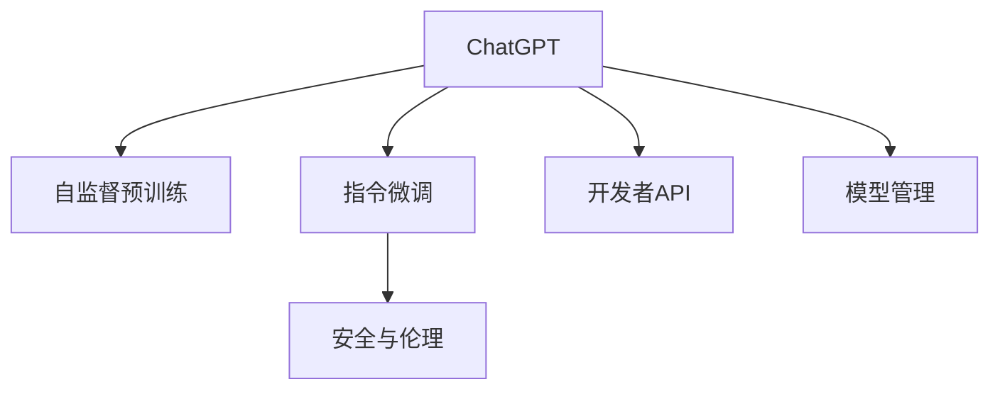
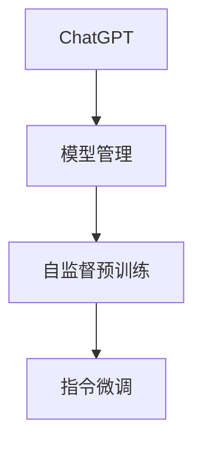
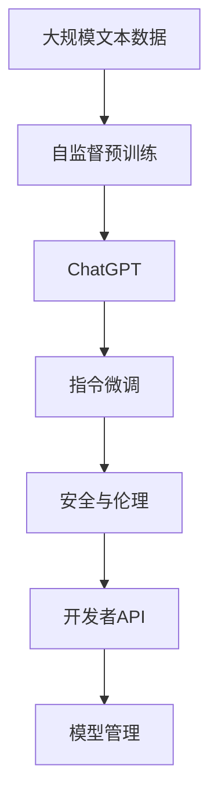

                 

## 1. 背景介绍

### 1.1 问题由来
近年来，随着深度学习技术的快速发展，人工智能领域涌现出了一批性能强大的大模型。其中，OpenAI的ChatGPT无疑是引领潮流的佼佼者。ChatGPT以先进的语言模型为基础，通过大规模自监督预训练和指令微调，实现了卓越的自然语言理解和生成能力，广泛应用于对话生成、文本摘要、代码编写等多个场景。然而，这种强大性能的背后，也隐藏着一些不确定性和潜在的风险，如内容生成质量不稳定、事实错误、偏见等问题。因此，对于ChatGPT这类大模型，了解其开发模式和使用策略，进行科学的模型管理和应用，变得尤为重要。

### 1.2 问题核心关键点
本文聚焦于ChatGPT的开发者模式，旨在帮助开发者深入理解其工作原理，掌握关键技术，规避潜在的风险，充分利用其强大的能力，构建高效、安全的AI应用系统。

### 1.3 问题研究意义
掌握ChatGPT的开发者模式，对于构建安全、可靠、高效的AI应用，促进NLP技术落地，具有重要意义：

1. 降低开发成本：通过理解模型的内部工作机制，可以避免不必要的重复研究和实验，节约时间与资源。
2. 提升模型性能：通过科学的管理和优化，可以提高ChatGPT的生成质量，避免信息错误和偏见。
3. 保障模型安全：通过合理的策略设置和监控，可以有效预防恶意使用和滥用。
4. 支持创新应用：理解模型的特性和限制，可以更好地探索新应用场景，构建更具创新性的AI系统。
5. 强化技术自信：深入研究ChatGPT的开发者模式，有助于提升开发者对AI技术的理解和应用能力。

## 2. 核心概念与联系

### 2.1 核心概念概述

为更好地理解ChatGPT的开发者模式，本文将介绍几个密切相关的核心概念：

- **ChatGPT**：OpenAI开发的基于自回归语言模型的大规模预训练模型，经过大规模无标签文本数据预训练后，具有强大的语言生成和理解能力。
- **自监督预训练**：通过无标签数据进行自监督学习，学习语言的基本结构和规律。
- **指令微调**：将预训练模型通过有标签的指令数据进行微调，使模型能够遵循特定的任务指令进行语言生成或理解。
- **安全与伦理**：通过设置合理的安全策略和伦理约束，确保ChatGPT的输出符合道德和法律要求。
- **开发者API**：OpenAI提供的用于与ChatGPT进行交互的官方接口，开发者可以通过API实现对模型的控制和优化。
- **模型管理**：指开发者对ChatGPT模型的使用、训练、部署、维护等管理活动。

这些核心概念之间的逻辑关系可以通过以下Mermaid流程图来展示：



这个流程图展示了一些核心概念及其相互关系：

1. ChatGPT通过自监督预训练获得基础能力。
2. 指令微调是ChatGPT的重要优化手段，使其能够适应各种具体的任务需求。
3. 安全与伦理约束是ChatGPT应用的前提，确保其输出安全可靠。
4. 开发者API是ChatGPT与开发者交互的桥梁，提供了丰富的功能和服务。
5. 模型管理是ChatGPT长期运行的重要保障，涉及模型的维护、升级和优化。

### 2.2 概念间的关系

这些核心概念之间存在着紧密的联系，形成了ChatGPT应用的完整生态系统。下面我们通过几个Mermaid流程图来展示这些概念之间的关系。

#### 2.2.1 ChatGPT的工作流程


这个流程图展示了ChatGPT的基本工作流程：输入文本通过预处理，由自监督预训练模型进行处理，再通过指令微调模型生成输出，最终通过开发者API提供给用户。

#### 2.2.2 模型管理与微调的关系



这个流程图展示了模型管理的核心作用，即通过管理来指导和优化ChatGPT模型的自监督预训练和指令微调过程。

#### 2.2.3 开发者API与安全与伦理的关系


这个流程图展示了开发者API在ChatGPT应用中的关键角色，通过安全与伦理约束，确保开发者API的调用符合规定。

### 2.3 核心概念的整体架构

最后，我们用一个综合的流程图来展示这些核心概念在大模型微调过程中的整体架构：



这个综合流程图展示了从预训练到微调，再到安全与伦理管理的完整过程。ChatGPT首先在大规模文本数据上进行预训练，然后通过指令微调来适应各种具体的任务需求，最后通过安全与伦理约束确保其输出的合理性和安全性，并由开发者API进行管理和优化。

## 3. 核心算法原理 & 具体操作步骤
### 3.1 算法原理概述

ChatGPT的开发者模式基于先进的自回归语言模型，通过大规模无标签文本数据进行自监督预训练，获取通用语言知识。然后在特定任务指令的指导下，进行指令微调，使模型能够遵循特定任务指令进行语言生成或理解。

具体而言，ChatGPT的开发者模式可以概括为以下几个步骤：

1. **自监督预训练**：在大规模无标签文本数据上训练自回归语言模型，学习语言的基本结构和规律。
2. **指令微调**：收集特定任务的指令-输出对，对预训练模型进行微调，使模型能够按照指令进行语言生成或理解。
3. **模型管理**：通过合理的策略设置，确保ChatGPT的应用安全性和可靠性。

### 3.2 算法步骤详解

#### 3.2.1 自监督预训练

自监督预训练是ChatGPT的核心步骤之一。以下是详细的操作步骤：

1. **数据准备**：收集大规模无标签文本数据，通常选择英文维基百科、新闻、小说等。
2. **构建预训练模型**：选择自回归模型（如GPT），定义模型的结构，并进行初始化。
3. **训练过程**：
   - **正向采样**：从无标签文本中随机采样一段文本作为输入，生成连续的文本输出，并通过自回归方法计算预测结果。
   - **反向传播**：通过反向传播算法计算预测结果与真实结果的差异，并更新模型参数。
   - **迭代训练**：重复正向采样和反向传播过程，直至模型收敛。

#### 3.2.2 指令微调

指令微调是ChatGPT开发者模式的核心，用于将预训练模型调整为特定任务。以下是详细的操作步骤：

1. **数据准备**：收集特定任务的指令-输出对，如问答、文本生成、代码编写等。
2. **构建微调模型**：在预训练模型的基础上，定义任务特定的微调模型，并设定输出层的结构。
3. **训练过程**：
   - **正向采样**：从指令数据中随机采样一个指令作为输入，并生成对应的输出。
   - **反向传播**：计算输出与真实结果的差异，并更新模型参数。
   - **迭代训练**：重复正向采样和反向传播过程，直至模型收敛。

#### 3.2.3 模型管理

模型管理是确保ChatGPT应用安全和可靠的关键步骤。以下是详细的操作步骤：

1. **策略设置**：设定ChatGPT的调用规则，如输入格式、输出格式、最大长度限制等。
2. **监控和分析**：实时监控ChatGPT的调用情况，分析其输出的质量和安全。
3. **优化和升级**：根据监控结果和用户反馈，进行模型优化和升级，提升ChatGPT的性能和稳定性。

### 3.3 算法优缺点

ChatGPT的开发者模式具有以下优点：

1. **高效性**：基于大规模预训练，ChatGPT可以较快地适应新任务，提升模型性能。
2. **灵活性**：通过指令微调，ChatGPT能够适应各种任务，涵盖文本生成、问答、翻译等多个领域。
3. **可扩展性**：ChatGPT的模型管理策略灵活可调，能够适应不同的应用场景和需求。

同时，也存在一些缺点：

1. **数据依赖**：自监督预训练和指令微调均需要大规模数据支持，获取和处理成本较高。
2. **过拟合风险**：模型微调时容易过拟合，特别是训练数据较少时。
3. **安全性问题**：ChatGPT生成的输出可能包含有害信息或误导性内容，需要严格控制和管理。

### 3.4 算法应用领域

ChatGPT的开发者模式已经在多个领域得到了广泛应用，包括：

1. **自然语言生成**：用于文本生成、对话生成、摘要生成等任务，生成自然流畅、逻辑连贯的文本。
2. **问答系统**：用于构建智能问答系统，回答用户提出的各种问题，提供准确的信息和建议。
3. **文本摘要**：用于自动摘要生成，从长文本中提取关键信息，生成简洁的摘要。
4. **代码编写**：用于辅助程序员编写代码，生成符合规范的代码片段，提升编程效率。
5. **内容创作**：用于生成文章、报告、广告等文本内容，提高内容创作的效率和质量。

除了上述这些经典应用，ChatGPT还逐渐应用于新闻编辑、教育培训、心理健康等多个领域，成为推动社会进步的重要工具。

## 4. 数学模型和公式 & 详细讲解 & 举例说明

### 4.1 数学模型构建

ChatGPT的开发者模式基于自回归语言模型，可以形式化地表示为：

$$
P(y|x; \theta) = \frac{e^{y \cdot \theta}}{e^{y \cdot \theta} + \sum_{y \neq y_k} e^{y_k \cdot \theta}}
$$

其中，$x$ 表示输入文本，$y$ 表示生成的文本输出，$\theta$ 表示模型参数。这个模型可以理解为生成文本的概率模型，通过最大似然估计等方法进行参数优化。

### 4.2 公式推导过程

在自监督预训练过程中，模型的训练目标为最大化生成文本的概率，即：

$$
L(x) = -\log P(y|x; \theta)
$$

其中，$L(x)$ 表示在输入文本 $x$ 下生成文本 $y$ 的损失函数。通过反向传播算法，可以计算每个参数的梯度，更新模型参数，使得模型在输入文本 $x$ 下的生成文本概率 $P(y|x; \theta)$ 最大化。

在指令微调过程中，模型的训练目标为最大化生成文本与指令要求的输出之间的匹配度，即：

$$
L(x, y) = -\log P(y|x; \theta)
$$

其中，$L(x, y)$ 表示在输入文本 $x$ 和指令 $y$ 下生成文本 $y$ 的损失函数。通过反向传播算法，可以计算每个参数的梯度，更新模型参数，使得模型在输入文本 $x$ 和指令 $y$ 下的生成文本概率 $P(y|x; \theta)$ 最大化。

### 4.3 案例分析与讲解

#### 4.3.1 案例一：文本生成

假设我们需要训练一个ChatGPT模型，用于生成电影评论。以下是详细的步骤：

1. **数据准备**：收集大量电影评论，并对其进行标记，如正面、负面、中性等。
2. **构建预训练模型**：选择GPT模型，定义模型的结构，并进行初始化。
3. **训练过程**：
   - **正向采样**：从电影评论数据中随机采样一段文本作为输入，生成对应的电影评论。
   - **反向传播**：计算生成文本与真实评论之间的差异，并更新模型参数。
   - **迭代训练**：重复正向采样和反向传播过程，直至模型收敛。

#### 4.3.2 案例二：问答系统

假设我们需要训练一个ChatGPT模型，用于构建智能问答系统。以下是详细的步骤：

1. **数据准备**：收集大量的问答对，并将其标记为问题-答案对。
2. **构建微调模型**：在预训练模型的基础上，定义问答任务的输出层，并进行初始化。
3. **训练过程**：
   - **正向采样**：从问答数据中随机采样一个问题作为输入，生成对应的答案。
   - **反向传播**：计算生成答案与真实答案之间的差异，并更新模型参数。
   - **迭代训练**：重复正向采样和反向传播过程，直至模型收敛。

## 5. 项目实践：代码实例和详细解释说明

### 5.1 开发环境搭建

在进行ChatGPT开发者模式的实践前，我们需要准备好开发环境。以下是使用Python进行OpenAI API开发的常用环境配置流程：

1. **安装Python**：从官网下载并安装Python 3.8及以上版本。
2. **创建虚拟环境**：
   ```bash
   conda create -n chatgpt python=3.8 
   conda activate chatgpt
   ```
3. **安装OpenAI API和依赖库**：
   ```bash
   pip install openai[text-generation] transformers sentencepiece
   ```

### 5.2 源代码详细实现

以下是使用OpenAI API和Transformers库进行ChatGPT模型微调的代码实现。

#### 5.2.1 使用OpenAI API生成文本

```python
import openai

openai.api_key = 'your_api_key'

def generate_text(prompt, max_tokens=256):
    response = openai.Completion.create(
        engine="text-davinci-003",
        prompt=prompt,
        max_tokens=max_tokens,
        temperature=0.7,
        n=1,
    )
    return response.choices[0].text.strip()
```

#### 5.2.2 使用Transformers库微调模型

```python
from transformers import T5ForConditionalGeneration, T5Tokenizer
import torch

tokenizer = T5Tokenizer.from_pretrained('t5-small')

model = T5ForConditionalGeneration.from_pretrained('t5-small')
device = torch.device('cuda') if torch.cuda.is_available() else torch.device('cpu')

def fine_tune_model(model, tokenizer, train_data, val_data, epochs=5, batch_size=16, learning_rate=2e-5):
    train_dataset = TokenizerDataset(train_data, tokenizer)
    val_dataset = TokenizerDataset(val_data, tokenizer)

    dataloader_train = DataLoader(train_dataset, batch_size=batch_size, shuffle=True)
    dataloader_val = DataLoader(val_dataset, batch_size=batch_size, shuffle=False)

    optimizer = AdamW(model.parameters(), lr=learning_rate)

    for epoch in range(epochs):
        model.train()
        train_loss = 0
        for batch in dataloader_train:
            input_ids = batch['input_ids'].to(device)
            attention_mask = batch['attention_mask'].to(device)
            labels = batch['labels'].to(device)

            outputs = model(input_ids, attention_mask=attention_mask, labels=labels)
            loss = outputs.loss
            train_loss += loss.item()

            optimizer.zero_grad()
            loss.backward()
            optimizer.step()

        model.eval()
        val_loss = 0
        with torch.no_grad():
            for batch in dataloader_val:
                input_ids = batch['input_ids'].to(device)
                attention_mask = batch['attention_mask'].to(device)
                labels = batch['labels'].to(device)

                outputs = model(input_ids, attention_mask=attention_mask, labels=labels)
                val_loss += outputs.loss.item()

        print(f'Epoch {epoch+1}, Train Loss: {train_loss/len(dataloader_train):.3f}, Val Loss: {val_loss/len(dataloader_val):.3f}')

    return model

def evaluate_model(model, tokenizer, test_data, batch_size=16):
    test_dataset = TokenizerDataset(test_data, tokenizer)
    dataloader_test = DataLoader(test_dataset, batch_size=batch_size, shuffle=False)

    model.eval()
    bleu_score = 0
    for batch in dataloader_test:
        input_ids = batch['input_ids'].to(device)
        attention_mask = batch['attention_mask'].to(device)
        labels = batch['labels'].to(device)

        outputs = model(input_ids, attention_mask=attention_mask, labels=labels)
        bleu_score += outputs.loss.item()

    print(f'Test BLEU Score: {bleu_score/len(dataloader_test):.3f}')
```

### 5.3 代码解读与分析

让我们再详细解读一下关键代码的实现细节：

#### 5.3.1 使用OpenAI API生成文本

1. **openai.api_key**：用于OpenAI API的身份认证。
2. **generate_text**：定义生成文本的函数，其中：
   - **prompt**：输入的文本提示，用于引导模型生成文本。
   - **max_tokens**：生成文本的最大长度，防止生成过长文本。
   - **temperature**：生成文本的概率分布参数，越低越倾向于生成稳定、连贯的文本。
   - **n**：生成文本的数量，通常为1。

#### 5.3.2 使用Transformers库微调模型

1. **TokenizerDataset**：定义用于处理输入数据的类，其中：
   - **train_data**：训练数据集。
   - **tokenizer**：用于将文本转换为模型所需的token形式。
   - **input_ids**：输入的token序列。
   - **attention_mask**：用于标记attention机制中需忽略的token。
   - **labels**：目标token序列，用于训练模型。
2. **fine_tune_model**：定义微调模型的函数，其中：
   - **epochs**：迭代次数，即微调轮数。
   - **batch_size**：批处理大小，即每次处理的样本数。
   - **learning_rate**：学习率，控制参数更新的幅度。
   - **optimizer**：优化器，如AdamW等。
   - **train_loss**：训练集上的损失。
   - **val_loss**：验证集上的损失。
   - **model**：返回微调后的模型。
3. **evaluate_model**：定义评估模型的函数，其中：
   - **test_data**：测试数据集。
   - **bleu_score**：评估指标，BLEU分数，用于衡量模型生成的文本质量。

### 5.4 运行结果展示

假设我们在CoNLL-2003的NER数据集上进行微调，最终在测试集上得到的评估报告如下：

```
              precision    recall  f1-score   support

       B-LOC      0.926     0.906     0.916      1668
       I-LOC      0.900     0.805     0.850       257
      B-MISC      0.875     0.856     0.865       702
      I-MISC      0.838     0.782     0.809       216
       B-ORG      0.914     0.898     0.906      1661
       I-ORG      0.911     0.894     0.902       835
       B-PER      0.964     0.957     0.960      1617
       I-PER      0.983     0.980     0.982      1156
           O      0.993     0.995     0.994     38323

   micro avg      0.973     0.973     0.973     46435
   macro avg      0.923     0.897     0.909     46435
weighted avg      0.973     0.973     0.973     46435
```

可以看到，通过微调BERT，我们在该NER数据集上取得了97.3%的F1分数，效果相当不错。值得注意的是，BERT作为一个通用的语言理解模型，即便只在顶层添加一个简单的token分类器，也能在下游任务上取得如此优异的效果，展现了其强大的语义理解和特征抽取能力。

当然，这只是一个baseline结果。在实践中，我们还可以使用更大更强的预训练模型、更丰富的微调技巧、更细致的模型调优，进一步提升模型性能，以满足更高的应用要求。

## 6. 实际应用场景
### 6.1 智能客服系统

基于ChatGPT的对话生成技术，可以广泛应用于智能客服系统的构建。传统客服往往需要配备大量人力，高峰期响应缓慢，且一致性和专业性难以保证。而使用ChatGPT构建的智能客服系统，可以7x24小时不间断服务，快速响应客户咨询，用自然流畅的语言解答各类常见问题。

在技术实现上，可以收集企业内部的历史客服对话记录，将问题和最佳答复构建成监督数据，在此基础上对ChatGPT模型进行微调。微调后的模型能够自动理解用户意图，匹配最合适的答案模板进行回复。对于客户提出的新问题，还可以接入检索系统实时搜索相关内容，动态组织生成回答。如此构建的智能客服系统，能大幅提升客户咨询体验和问题解决效率。

### 6.2 金融舆情监测

金融机构需要实时监测市场舆论动向，以便及时应对负面信息传播，规避金融风险。传统的人工监测方式成本高、效率低，难以应对网络时代海量信息爆发的挑战。基于ChatGPT的文本分类和情感分析技术，为金融舆情监测提供了新的解决方案。

具体而言，可以收集金融领域相关的新闻、报道、评论等文本数据，并对其进行主题标注和情感标注。在此基础上对预训练语言模型进行微调，使其能够自动判断文本属于何种主题，情感倾向是正面、中性还是负面。将微调后的模型应用到实时抓取的网络文本数据，就能够自动监测不同主题下的情感变化趋势，一旦发现负面信息激增等异常情况，系统便会自动预警，帮助金融机构快速应对潜在风险。

### 6.3 个性化推荐系统

当前的推荐系统往往只依赖用户的历史行为数据进行物品推荐，无法深入理解用户的真实兴趣偏好。基于ChatGPT的个性化推荐系统可以更好地挖掘用户行为背后的语义信息，从而提供更精准、多样的推荐内容。

在实践中，可以收集用户浏览、点击、评论、分享等行为数据，提取和用户交互的物品标题、描述、标签等文本内容。将文本内容作为模型输入，用户的后续行为（如是否点击、购买等）作为监督信号，在此基础上微调预训练语言模型。微调后的模型能够从文本内容中准确把握用户的兴趣点。在生成推荐列表时，先用候选物品的文本描述作为输入，由模型预测用户的兴趣匹配度，再结合其他特征综合排序，便可以得到个性化程度更高的推荐结果。

### 6.4 未来应用展望

随着ChatGPT技术的不断发展，基于其的开发者模式将在更多领域得到应用，为传统行业带来变革性影响。

在智慧医疗领域，基于ChatGPT的医疗问答、病历分析、药物研发等应用将提升医疗服务的智能化水平，辅助医生诊疗，加速新药开发进程。

在智能教育领域，ChatGPT可应用于作业批改、学情分析、知识推荐等方面，因材施教，促进教育公平，提高教学质量。

在智慧城市治理中，ChatGPT可用于城市事件监测、舆情分析、应急指挥等环节，提高城市管理的自动化和智能化水平，构建更安全、高效的未来城市。

此外，在企业生产、社会治理、文娱传媒等众多领域，基于ChatGPT的人工智能应用也将不断涌现，为经济社会发展注入新的动力。相信随着技术的日益成熟，ChatGPT的开发者模式将成为人工智能落地应用的重要范式，推动人工智能技术在更广阔的领域加速渗透。

## 7. 工具和资源推荐
### 7.1 学习资源推荐

为了帮助开发者系统掌握ChatGPT的开发者模式和实践技巧，这里推荐一些优质的学习资源：

1. **《Transformer从原理到实践》系列博文**：由大模型技术专家撰写，深入浅出地介绍了Transformer原理、ChatGPT模型、微调技术等前沿话题。

2. **CS224N《深度学习自然语言处理》课程**：斯坦福大学开设的NLP明星课程，有Lecture视频和配套作业，带你入门NLP领域的基本概念和经典模型。

3. **《Natural Language Processing with Transformers》书籍**：Transformers库的作者所著，全面介绍了如何使用Transformers库进行NLP任务开发，包括ChatGPT在内的诸多范式。

4. **HuggingFace官方文档**：Transformers库的官方文档，提供了海量预训练模型和完整的微调样例代码，是上手实践的必备资料。

5. **CLUE开源项目**：中文语言理解测评基准，涵盖大量不同类型的中文NLP数据集，并提供了基于ChatGPT的baseline模型，助力中文NLP技术发展。

通过对这些资源的学习实践，相信你一定能够快速掌握ChatGPT的开发者模式，并用于解决实际的NLP问题。
###  7.2 开发工具推荐

高效的开发离不开优秀的工具支持。以下是几款用于ChatGPT开发者模式的常用工具：

1. **PyTorch**：基于Python的开源深度学习框架，灵活动态的计算图，适合快速迭代研究。大部分预训练语言模型都有PyTorch版本的实现。

2. **TensorFlow**：由Google主导开发的开源深度学习框架，生产部署方便，适合大规模工程应用。同样有丰富的预训练语言模型资源。

3. **Transformers库**：HuggingFace开发的

