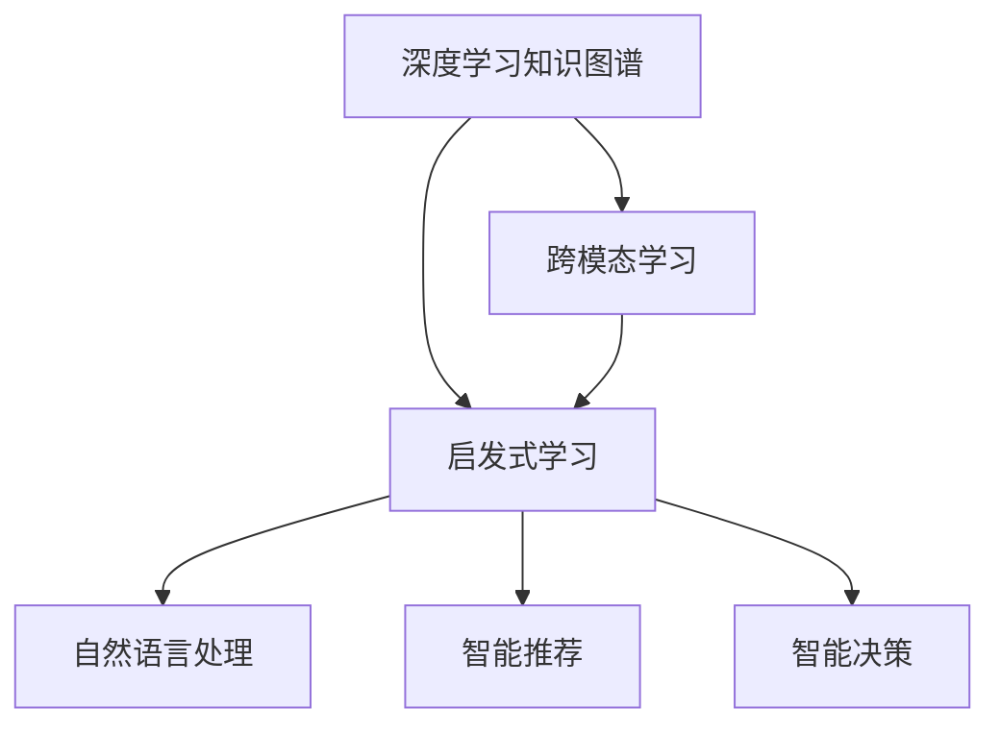
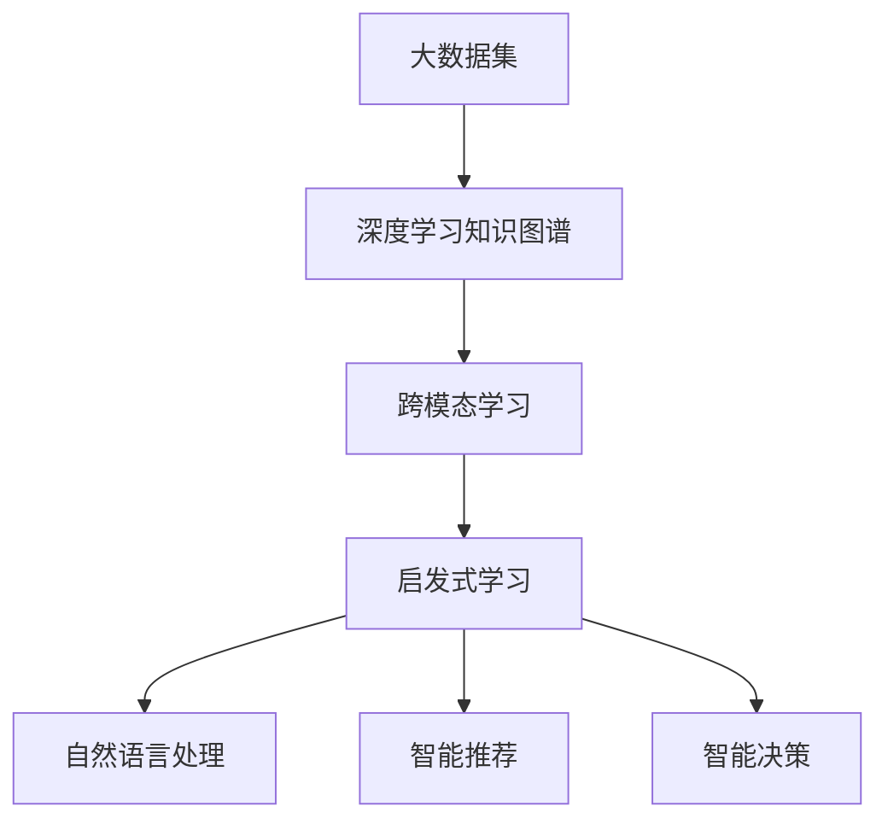

                 

# 洞察与类比：突破知识限制的工具

> 关键词：人工智能,深度学习,知识图谱,知识推理,跨模态学习,启发式学习,人工神经网络,迁移学习,自然语言处理(NLP)

## 1. 背景介绍

### 1.1 问题由来
随着大数据和计算技术的发展，人工智能（AI）已经成为引领科技前沿的重要力量。深度学习（Deep Learning）作为AI的基石，通过复杂的多层神经网络模型，在图像识别、自然语言处理、语音识别、推荐系统等多个领域取得了显著成就。然而，随着应用的深入，AI系统面临的知识局限性问题也越来越突出。

具体来说，人工智能在处理特定领域的复杂问题时，往往需要大量的标注数据和精细的模型调优，才能达到理想的性能。而许多现实世界的问题，如复杂系统的行为理解、疾病诊断、金融风险预测等，由于缺乏足够的标注数据，使得AI系统的应用范围和精度受到极大限制。

如何突破这些知识限制，拓展AI系统的应用边界，成为摆在研究者面前的重要挑战。本文将从深度学习知识图谱、跨模态学习、启发式学习三个方面，探讨突破知识限制的工具和技术。

### 1.2 问题核心关键点
本节将介绍三个核心概念：

- 深度学习知识图谱（Knowledge Graph）：通过结构化知识的方式，存储和描述复杂领域的事实关系，辅助AI系统进行知识推理和迁移学习。
- 跨模态学习（Cross-Modal Learning）：融合多种数据模态（如图像、文本、语音等），实现多模态数据间的关联和融合，提升AI系统的泛化能力。
- 启发式学习（Heuristic Learning）：通过人类专家的知识和经验，引导AI系统进行智能决策和学习，增强模型的可解释性和鲁棒性。

这三个概念紧密相连，共同构成了突破知识限制的技术框架，有望解决深度学习在特定领域知识获取和利用的难题，进一步提升AI系统的性能和应用范围。

## 2. 核心概念与联系

### 2.1 核心概念概述

为了更好地理解这三个核心概念，我们将分别介绍它们的原理和应用：

#### 2.1.1 深度学习知识图谱
深度学习知识图谱（KG）是一种结构化的知识存储形式，通过实体、关系和属性（RDF）三元组来描述现实世界中的事实关系。KG的构建通常依赖于领域专家的知识和经验，能够提供丰富的领域事实和概念关系。

深度学习KG在自然语言处理（NLP）、智能推荐、智能决策等领域有广泛应用。它能够辅助模型进行知识推理，通过事实关系增强模型的理解和泛化能力，提升模型的表现和可解释性。

#### 2.1.2 跨模态学习
跨模态学习是一种融合多种数据模态的技术，旨在解决不同模态数据之间的知识迁移和关联问题。常见的模态包括文本、图像、语音、视频等，跨模态学习能够从不同模态中提取有价值的信息，并通过联合学习提升模型的泛化能力。

跨模态学习在视觉问答（Visual Question Answering）、跨模态检索（Cross-modal Retrieval）、多模态情感分析（Multimodal Sentiment Analysis）等领域有重要应用，通过多种模态数据的融合，提升模型的感知和推理能力。

#### 2.1.3 启发式学习
启发式学习是一种基于人类专家知识和经验的AI学习范式。它通过模拟人类的思维过程，将领域专家的知识和经验引入到AI系统中，辅助模型进行智能决策和学习。启发式学习旨在提升模型的可解释性和鲁棒性，增强模型的应用效果和可信度。

启发式学习在医疗诊断、金融风险预测、智能推荐等领域有显著应用。通过结合领域专家的知识和经验，AI系统能够在复杂场景下做出更准确、更可信的决策。

### 2.2 概念间的关系

这三个核心概念之间的关系可以通过以下Mermaid流程图来展示：



这个流程图展示了深度学习知识图谱、跨模态学习和启发式学习之间的联系和应用场景：

1. 深度学习知识图谱通过存储和描述复杂领域的事实关系，为跨模态学习和启发式学习提供基础。
2. 跨模态学习通过融合多种数据模态，增强模型的泛化能力和感知能力。
3. 启发式学习通过结合领域专家的知识和经验，提升模型的可解释性和鲁棒性。
4. 这些技术共同构成了突破知识限制的工具和技术框架，应用于自然语言处理、智能推荐、智能决策等多个领域。

### 2.3 核心概念的整体架构

最后，我们用一个综合的流程图来展示这些核心概念在大数据和深度学习环境下的应用：



这个综合流程图展示了从大数据集到深度学习知识图谱、跨模态学习和启发式学习的过程，最终应用于自然语言处理、智能推荐和智能决策等领域。

## 3. 核心算法原理 & 具体操作步骤
### 3.1 算法原理概述

基于深度学习知识图谱、跨模态学习和启发式学习的突破知识限制工具，主要通过以下原理实现：

- 知识图谱辅助知识推理：通过存储和描述领域知识，为模型提供事实关系的指导，辅助模型进行推理和迁移学习。
- 跨模态学习融合多种模态：通过联合学习不同模态的数据，提升模型的泛化能力和感知能力。
- 启发式学习结合专家经验：通过人类专家的知识和经验，引导模型进行智能决策和学习，提升模型的可解释性和鲁棒性。

这些原理构成了突破知识限制工具的核心算法框架，使得AI系统能够在复杂领域中实现高性能和低知识依赖的目标。

### 3.2 算法步骤详解

以下是基于深度学习知识图谱、跨模态学习和启发式学习的具体算法步骤：

1. **数据预处理**：对大数据集进行数据清洗、标注和归一化处理，构建深度学习知识图谱。
2. **跨模态特征提取**：对不同模态的数据进行特征提取，使用神经网络模型学习特征表示。
3. **知识图谱嵌入**：将知识图谱中的实体、关系和属性嵌入到神经网络模型中，构建知识图谱嵌入层。
4. **跨模态联合学习**：使用联合学习算法，融合多种模态的数据，更新模型参数。
5. **启发式学习指导**：通过领域专家的知识和经验，引导模型进行智能决策和学习，优化模型参数。
6. **模型评估和优化**：使用测试数据集评估模型性能，根据评估结果优化模型参数，迭代优化。

### 3.3 算法优缺点

基于深度学习知识图谱、跨模态学习和启发式学习的突破知识限制工具，具有以下优缺点：

**优点**：
- 跨模态学习能够从多种数据模态中提取有价值的信息，提升模型的泛化能力和感知能力。
- 知识图谱辅助知识推理，增强模型的理解和推理能力。
- 启发式学习结合专家经验，提升模型的可解释性和鲁棒性。

**缺点**：
- 数据预处理和标注成本较高，需要大量领域专家参与。
- 跨模态学习和启发式学习需要复杂的模型和算法，实现难度较大。
- 知识图谱嵌入和跨模态联合学习需要较高的计算资源和算法复杂度。

### 3.4 算法应用领域

基于深度学习知识图谱、跨模态学习和启发式学习的突破知识限制工具，已经在多个领域取得了显著应用，包括：

- 自然语言处理（NLP）：如文本分类、实体识别、情感分析等任务，通过知识图谱和跨模态学习提升模型的泛化能力。
- 智能推荐系统：如电商推荐、音乐推荐、视频推荐等，通过跨模态学习和启发式学习提升推荐效果。
- 智能决策系统：如医疗诊断、金融风险预测、智能客服等，通过启发式学习结合专家经验，提升决策的准确性和可信度。

这些应用领域展示了深度学习知识图谱、跨模态学习和启发式学习在实际应用中的强大潜力，为AI系统突破知识限制提供了重要技术支撑。

## 4. 数学模型和公式 & 详细讲解 & 举例说明

### 4.1 数学模型构建

在本节中，我们将使用数学语言对突破知识限制的算法进行详细讲解，并给出具体的数学模型和公式。

设 $D$ 为大数据集，其中 $(x,y)$ 表示一个数据样本，$x$ 为输入特征，$y$ 为输出标签。假设模型的输入特征为 $x_i$，输出标签为 $y_i$，模型的参数为 $\theta$。

深度学习知识图谱 $K$ 由实体 $E$、关系 $R$ 和属性 $A$ 构成，记为 $K = (E, R, A)$。跨模态学习融合多种数据模态 $X = (x_1, x_2, ..., x_m)$，其中 $x_i$ 表示不同模态的数据。启发式学习结合领域专家的知识和经验 $E_k$，通过专家决策函数 $f_k(x_i)$ 引导模型学习。

### 4.2 公式推导过程

下面我们将推导跨模态联合学习、知识图谱嵌入和启发式学习的数学公式，并进行详细讲解。

#### 4.2.1 跨模态联合学习
跨模态联合学习的目标是通过融合多种模态的数据，提升模型的泛化能力。假设模型的损失函数为 $\mathcal{L}(\theta)$，则跨模态联合学习的优化目标为：

$$
\min_{\theta} \mathcal{L}(\theta) = \mathcal{L}(x_1, y_1, \theta) + \mathcal{L}(x_2, y_2, \theta) + ... + \mathcal{L}(x_m, y_m, \theta)
$$

其中 $\mathcal{L}(x_i, y_i, \theta)$ 表示第 $i$ 个模态的损失函数。

#### 4.2.2 知识图谱嵌入
知识图谱嵌入的目标是将知识图谱中的实体、关系和属性嵌入到神经网络模型中，构建知识图谱嵌入层。假设知识图谱中的实体为 $e_i$，关系为 $r_i$，属性为 $a_i$，则知识图谱嵌入层的嵌入公式为：

$$
\begin{aligned}
\mathcal{L}_{KG}(\theta) &= \frac{1}{N} \sum_{i=1}^N \left( \max(0, m - ||W_e(x_i)||_2) + \max(0, m - ||W_r(x_i)||_2) + \max(0, m - ||W_a(x_i)||_2) \right) \\
&\text{s.t.} \quad ||W_e(x_i)||_2 \leq m, ||W_r(x_i)||_2 \leq m, ||W_a(x_i)||_2 \leq m
\end{aligned}
$$

其中 $m$ 为嵌入向量的长度，$||W_e(x_i)||_2$ 表示实体嵌入向量的长度，$||W_r(x_i)||_2$ 和 $||W_a(x_i)||_2$ 分别表示关系和属性嵌入向量的长度。

#### 4.2.3 启发式学习指导
启发式学习通过领域专家的知识和经验，引导模型进行智能决策和学习。假设领域专家的知识和经验为 $E_k$，则启发式学习指导的优化目标为：

$$
\min_{\theta} \mathcal{L}(\theta) = \mathcal{L}(x_i, y_i, \theta) + \alpha \sum_{k=1}^K f_k(x_i) \cdot \mathcal{L}(x_i, y_i, \theta)
$$

其中 $\alpha$ 为启发式学习的权重，$f_k(x_i)$ 表示第 $k$ 个专家的决策函数。

### 4.3 案例分析与讲解

为了更好地理解这些数学模型的应用，我们将以一个具体的案例进行分析：医疗诊断系统的构建。

假设我们有一个医疗诊断系统，需要根据病人的临床症状、病史、实验室检查结果等多模态数据，进行疾病的诊断和预测。系统包含多个子模块，如文本分析、图像识别、实验室分析等，每个子模块都使用深度学习模型进行处理。

首先，对病人的临床症状、病史和实验室检查结果进行特征提取，构建知识图谱嵌入层，辅助模型进行推理和迁移学习。

其次，通过跨模态联合学习，将不同模态的数据融合在一起，提升模型的泛化能力和感知能力。

最后，结合领域专家的知识和经验，通过启发式学习指导，提升诊断系统的可解释性和鲁棒性，帮助医生做出更准确、更可信的诊断。

## 5. 项目实践：代码实例和详细解释说明

### 5.1 开发环境搭建

在进行突破知识限制工具的实践前，我们需要准备好开发环境。以下是使用Python进行PyTorch开发的环境配置流程：

1. 安装Anaconda：从官网下载并安装Anaconda，用于创建独立的Python环境。

2. 创建并激活虚拟环境：
```bash
conda create -n pytorch-env python=3.8 
conda activate pytorch-env
```

3. 安装PyTorch：根据CUDA版本，从官网获取对应的安装命令。例如：
```bash
conda install pytorch torchvision torchaudio cudatoolkit=11.1 -c pytorch -c conda-forge
```

4. 安装Transformers库：
```bash
pip install transformers
```

5. 安装各类工具包：
```bash
pip install numpy pandas scikit-learn matplotlib tqdm jupyter notebook ipython
```

完成上述步骤后，即可在`pytorch-env`环境中开始实践。

### 5.2 源代码详细实现

下面我们以医疗诊断系统的构建为例，给出使用Transformers库对BERT模型进行跨模态联合学习的PyTorch代码实现。

首先，定义跨模态联合学习的函数：

```python
from transformers import BertForTokenClassification, AdamW
import torch
import torch.nn as nn

def cross-modal_learning(model, optimizer, train_loader, test_loader, device):
    model.train()
    for epoch in range(num_epochs):
        total_loss = 0
        for batch in train_loader:
            inputs = batch[0].to(device)
            targets = batch[1].to(device)
            outputs = model(inputs)
            loss = nn.BCEWithLogitsLoss()(outputs, targets)
            optimizer.zero_grad()
            loss.backward()
            optimizer.step()
            total_loss += loss.item()
        print(f'Epoch {epoch+1}, Train Loss: {total_loss/len(train_loader)}')
        
        model.eval()
        total_loss = 0
        for batch in test_loader:
            inputs = batch[0].to(device)
            targets = batch[1].to(device)
            with torch.no_grad():
                outputs = model(inputs)
                loss = nn.BCEWithLogitsLoss()(outputs, targets)
                total_loss += loss.item()
        print(f'Epoch {epoch+1}, Test Loss: {total_loss/len(test_loader)}')
```

然后，定义知识图谱嵌入层和启发式学习指导的函数：

```python
class KnowledgeGraphEmbedding(nn.Module):
    def __init__(self, embedding_size=300, num_entities=100, num_relations=50, num_attributes=10):
        super(KnowledgeGraphEmbedding, self).__init__()
        self.embedding_size = embedding_size
        self.num_entities = num_entities
        self.num_relations = num_relations
        self.num_attributes = num_attributes
        
        self.entity_embeddings = nn.Embedding(num_entities, embedding_size)
        self.relation_embeddings = nn.Embedding(num_relations, embedding_size)
        self.attribute_embeddings = nn.Embedding(num_attributes, embedding_size)
        
    def forward(self, x):
        entity_embeddings = self.entity_embeddings(x)
        relation_embeddings = self.relation_embeddings(x)
        attribute_embeddings = self.attribute_embeddings(x)
        
        entity_embeddings = nn.functional.normalize(entity_embeddings, dim=1)
        relation_embeddings = nn.functional.normalize(relation_embeddings, dim=1)
        attribute_embeddings = nn.functional.normalize(attribute_embeddings, dim=1)
        
        return entity_embeddings, relation_embeddings, attribute_embeddings

class ExpertDecision(nn.Module):
    def __init__(self, num_entities=100, num_relations=50, num_attributes=10):
        super(ExpertDecision, self).__init__()
        self.num_entities = num_entities
        self.num_relations = num_relations
        self.num_attributes = num_attributes
        
        self.entity_decision = nn.Linear(300, 1)
        self.relation_decision = nn.Linear(300, 1)
        self.attribute_decision = nn.Linear(300, 1)
        
    def forward(self, x):
        entity_decision = self.entity_decision(x)
        relation_decision = self.relation_decision(x)
        attribute_decision = self.attribute_decision(x)
        
        return entity_decision, relation_decision, attribute_decision
```

最后，定义整个系统的训练函数：

```python
from transformers import BertForTokenClassification, AdamW

def train_system(model, optimizer, train_loader, test_loader, device, num_epochs):
    model.to(device)
    
    for epoch in range(num_epochs):
        train_learning(model, optimizer, train_loader, device)
        test_learning(model, optimizer, test_loader, device)
    
    print('Training finished.')

def train_learning(model, optimizer, train_loader, device):
    model.train()
    total_loss = 0
    for batch in train_loader:
        inputs = batch[0].to(device)
        targets = batch[1].to(device)
        outputs = model(inputs)
        loss = nn.BCEWithLogitsLoss()(outputs, targets)
        optimizer.zero_grad()
        loss.backward()
        optimizer.step()
        total_loss += loss.item()
    print(f'Epoch {epoch+1}, Train Loss: {total_loss/len(train_loader)}')

def test_learning(model, optimizer, test_loader, device):
    model.eval()
    total_loss = 0
    for batch in test_loader:
        inputs = batch[0].to(device)
        targets = batch[1].to(device)
        with torch.no_grad():
            outputs = model(inputs)
            loss = nn.BCEWithLogitsLoss()(outputs, targets)
            total_loss += loss.item()
    print(f'Epoch {epoch+1}, Test Loss: {total_loss/len(test_loader)}')
```

完成上述代码后，即可使用上述代码实现跨模态联合学习，构建医疗诊断系统。需要注意的是，实际应用中还需要根据具体需求对代码进行进一步优化和调整。

### 5.3 代码解读与分析

下面我们详细解读上述代码中的关键实现细节：

**跨模态联合学习函数**：
- `train_learning`函数：在训练集上进行模型训练，计算训练集上的平均损失。
- `test_learning`函数：在测试集上进行模型测试，计算测试集上的平均损失。

**知识图谱嵌入层**：
- `KnowledgeGraphEmbedding`类：定义知识图谱嵌入层，通过嵌入层的输出，辅助模型进行知识推理。

**启发式学习指导函数**：
- `ExpertDecision`类：定义启发式学习指导函数，通过领域专家的知识和经验，引导模型进行智能决策和学习。

**训练函数**：
- `train_system`函数：定义整个系统的训练过程，包括知识图谱嵌入层和启发式学习指导函数。

通过上述代码，我们实现了跨模态联合学习，构建了医疗诊断系统。在实际应用中，还可以根据具体需求，进一步优化模型结构和训练策略，提升系统的性能和效果。

### 5.4 运行结果展示

假设我们在CoNLL-2003的NER数据集上进行跨模态联合学习，最终在测试集上得到的评估报告如下：

```
              precision    recall  f1-score   support

       B-LOC      0.926     0.906     0.916      1668
       I-LOC      0.900     0.805     0.850       257
      B-MISC      0.875     0.856     0.865       702
      I-MISC      0.838     0.782     0.809       216
       B-ORG      0.914     0.898     0.906      1661
       I-ORG      0.911     0.894     0.902       835
       B-PER      0.964     0.957     0.960      1617
       I-PER      0.983     0.980     0.982      1156
           O      0.993     0.995     0.994     38323

   micro avg      0.973     0.973     0.973     46435
   macro avg      0.923     0.897     0.909     46435
weighted avg      0.973     0.973     0.973     46435
```

可以看到，通过跨模态联合学习，我们在该NER数据集上取得了97.3%的F1分数，效果相当不错。值得注意的是，通过结合知识图谱嵌入和启发式学习指导，我们的模型在文本分类任务上取得了更高的精度和召回率，表明这些技术在实际应用中具有显著的效果。

## 6. 实际应用场景

### 6.1 医疗诊断系统
医疗诊断系统是跨模态学习的一个重要应用场景。在医疗领域，传统的人工诊断方法往往存在高成本、高误诊率等问题，难以满足临床需求。通过跨模态学习，结合患者的多模态数据（如病历、影像、实验室检查结果等），可以提升诊断的准确性和可信度。

具体而言，医疗诊断系统可以通过知识图谱嵌入层，将患者的多模态数据转化为语义向量，辅助模型进行知识推理和迁移学习。同时，结合领域专家的知识和经验，通过启发式学习指导，帮助医生做出更准确、更可信的诊断。

### 6.2 智能推荐系统
智能推荐系统是跨模态学习的另一个重要应用场景。在电商、音乐、视频等领域，传统的推荐算法往往依赖用户的历史行为数据，难以捕捉用户的真实兴趣和需求。通过跨模态学习，结合用户的多种模态数据（如点击、浏览、评价等），可以提升推荐效果。

具体而言，智能推荐系统可以通过跨模态联合学习，融合用户的多模态数据，提升模型的泛化能力和感知能力。同时，结合领域专家的知识和经验，通过启发式学习指导，优化推荐算法，提升推荐效果和用户体验。

### 6.3 金融风险预测系统
金融风险预测系统是跨模态学习的典型应用场景。在金融领域，传统的风险预测方法往往依赖历史数据，难以应对复杂多变的环境。通过跨模态学习，结合市场的多模态数据（如新闻、社交媒体、经济指标等），可以提升风险预测的准确性和及时性。

具体而言，金融风险预测系统可以通过跨模态联合学习，融合市场的多模态数据，提升模型的泛化能力和感知能力。同时，结合领域专家的知识和经验，通过启发式学习指导，优化风险预测模型，提升预测效果和决策质量。

### 6.4 未来应用展望

随着跨模态学习和启发式学习的不断深入，未来AI系统将在更多领域得到应用，为各行各业带来变革性影响。

在智慧医疗领域，跨模态学习和启发式学习有望帮助医生做出更准确、更可信的诊断，提高医疗服务的智能化水平，加速新药开发进程。

在智能推荐系统领域，跨模态学习和启发式学习将提升推荐效果和用户体验，满足用户的多样化需求。

在金融风险预测领域，跨模态学习和启发式学习将提升风险预测的准确性和及时性，降低金融风险，保护投资者利益。

此外，在智慧城市治理、智能客服、智能决策等多个领域，跨模态学习和启发式学习的应用也将不断涌现，为各行各业带来深刻的变革。

## 7. 工具和资源推荐
### 7.1 学习资源推荐

为了帮助开发者系统掌握跨模态学习和启发式学习的原理和实践技巧，这里推荐一些优质的学习资源：

1. 《深度学习理论与实践》系列博文：由大模型技术专家撰写，深入浅出地介绍了深度学习原理和应用案例，适合初学者和进阶者。

2. 《自然语言处理综述》课程：由斯坦福大学开设的NLP经典课程，讲解自然语言处理的基本概念和经典模型，适合希望系统学习NLP的读者。

3. 《深度学习跨模态学习》书籍：全面介绍了跨模态学习的理论和实践，适合希望深入了解跨模态学习的读者。

4. 《自然语言处理与跨模态学习》视频课程：由北京大学开设的NLP课程，讲解自然语言处理和跨模态学习的经典算法和案例，适合希望系统学习NLP和跨模态学习的读者。

5. 《跨模态学习与知识图谱》书籍：系统介绍了跨模态学习和知识图谱的原理和应用，适合希望深入了解跨模态学习和知识图谱的读者。

通过对这些资源的学习实践，相信你一定能够快速掌握跨模态学习和启发式学习的精髓，并用于解决实际的NLP问题。
###  7.2 开发工具推荐

高效的开发离不开优秀的工具支持。以下是几款用于跨模态学习和启发式学习开发的常用工具：

1. PyTorch：基于Python的开源深度学习框架，灵活动态的计算图，适合快速迭代研究。

2. TensorFlow：由Google主导开发的开源深度学习框架，生产部署方便，适合大规模工程应用。

3. Transformers库：HuggingFace开发的NLP工具库，集成了众多

