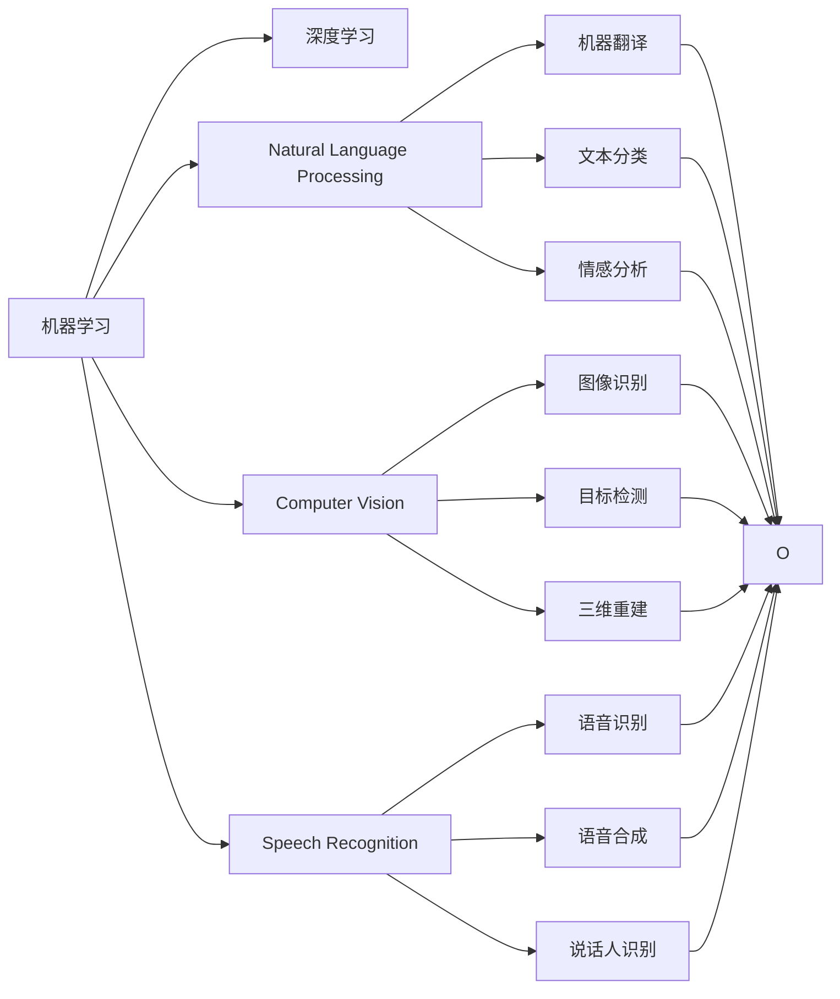
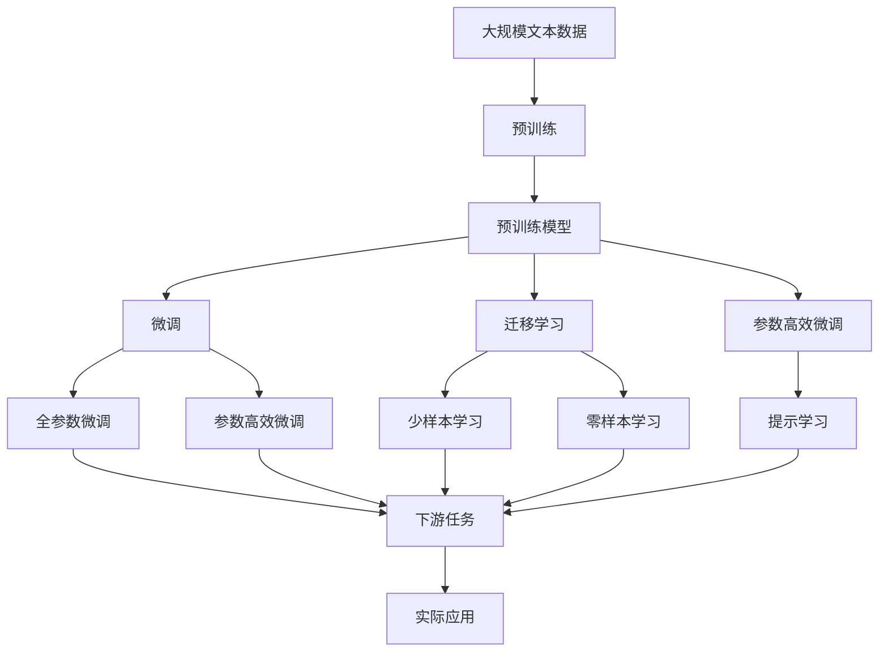

                 

# 清华大学的人工智能研究历程

## 1. 背景介绍

### 1.1 问题由来
清华大学的人工智能研究历程可以追溯到20世纪50年代。当时，清华大学的计算机科学研究基础已经较为扎实，开始逐渐涉足人工智能领域。1980年，清华大学成立了计算机科学与技术系，并开始正式进行人工智能研究。此后，清华的人工智能研究在深度和广度上不断扩展，形成了具有国际影响力的研究团队。

### 1.2 问题核心关键点
清华大学人工智能研究的核心关键点包括：
- 成立了计算机科学与技术系，专门进行人工智能研究。
- 建立了包括机器学习、自然语言处理、计算机视觉、语音识别等在内的多个研究小组，覆盖人工智能的主要领域。
- 参与和主持了多个国家级、省部级人工智能项目，包括“十三五”国家重点研发计划、国家自然科学基金重大项目等。
- 培养了大批人工智能领域的专业人才，包括多位国内外知名学者和企业家。
- 与国内外知名科研机构和企业建立了广泛合作关系，推动了人工智能技术的产业化应用。

### 1.3 问题研究意义
清华大学人工智能研究对国内人工智能的发展具有重要意义：
- 引领了国内人工智能研究的方向，培养了大量优秀人才。
- 推动了人工智能技术的产业化应用，产生了显著的经济效益。
- 提升了清华大学的国际声誉和影响力，吸引了更多优秀人才和科研资源。
- 通过跨学科合作，拓展了人工智能的应用范围，促进了学术与产业的互动。

## 2. 核心概念与联系

### 2.1 核心概念概述

清华大学人工智能研究涉及多个核心概念，下面将逐一介绍：

- 机器学习（Machine Learning）：通过数据驱动的方法，使计算机具有学习的能力，从而实现自动化的决策和预测。机器学习是人工智能研究的基础，清华大学的多个研究小组都在这一领域有着深入的研究。

- 深度学习（Deep Learning）：基于神经网络模型，通过多层非线性变换，实现对复杂模式的学习和识别。深度学习是机器学习的一种高级形式，清华大学的深度学习研究处于国际领先水平。

- 自然语言处理（Natural Language Processing, NLP）：研究计算机如何理解、处理和生成自然语言。清华大学在这一领域拥有丰富的研究资源和成果，涵盖了机器翻译、文本分类、情感分析、对话系统等多个方向。

- 计算机视觉（Computer Vision）：研究计算机如何“看”和理解图像和视频。清华大学的计算机视觉研究涵盖了图像识别、目标检测、三维重建、视频分析等多个方面，取得了多项国际先进成果。

- 语音识别（Speech Recognition）：研究计算机如何理解和生成语音。清华大学的语音识别研究主要集中在语音识别、语音合成、说话人识别等方面，具有较强的实际应用价值。

这些核心概念之间存在着密切的联系，形成了一个完整的AI研究体系。通过不同领域的相互交叉和融合，清华大学在人工智能领域取得了诸多突破和进展。

### 2.2 概念间的关系

以下是清华大学的核心概念之间的逻辑关系：



通过这张流程图，我们可以更清晰地理解清华大学的核心概念之间的联系：

1. 机器学习是深度学习的基础，深度学习则是在机器学习的基础上进一步发展。
2. 自然语言处理、计算机视觉、语音识别是机器学习的主要应用领域。
3. 在自然语言处理中，机器翻译、文本分类、情感分析等是重要的研究方向。
4. 在计算机视觉中，图像识别、目标检测、三维重建等是重要的研究方向。
5. 在语音识别中，语音识别、语音合成、说话人识别等是重要的研究方向。
6. 不同领域的交叉研究，如语音驱动的图像识别、视频分类、情感分析等，形成了更广泛的研究应用。

### 2.3 核心概念的整体架构

最后，我们用一张综合性的流程图来展示清华大学的核心概念在大规模人工智能研究中的整体架构：



通过这张流程图，我们可以更全面地理解清华大学的核心概念在大规模人工智能研究中的整体架构：

1. 清华大学的核心研究始于大规模文本数据的预训练。
2. 预训练模型通过微调和迁移学习被应用于下游任务，实现了任务适配和性能提升。
3. 参数高效微调和提示学习等前沿技术被引入，进一步提升了模型的泛化能力和应用效果。
4. 微调后的模型被应用于实际应用场景中，产生了显著的经济和社会效益。

## 3. 核心算法原理 & 具体操作步骤
### 3.1 算法原理概述

清华大学的核心算法原理主要围绕机器学习、深度学习和相关应用展开。以下将详细介绍机器学习和深度学习的基本原理。

**机器学习**：

机器学习的主要任务是通过数据驱动的方法，使计算机具有学习的能力。其核心思想是通过数据样本的学习，构建一个模型，从而实现对未知数据的预测或分类。机器学习的关键在于如何设计合适的损失函数和优化算法，使得模型能够从数据中学习到有用的特征。

**深度学习**：

深度学习是机器学习的一种高级形式，通过多层非线性变换，实现对复杂模式的学习和识别。其核心思想是通过神经网络模型，对输入数据进行多层非线性映射，从而构建更复杂的特征表示。深度学习的关键在于如何设计合适的神经网络结构和优化算法，使得模型能够有效地学习到数据中的复杂模式。

### 3.2 算法步骤详解

清华大学的人工智能研究中，算法步骤主要包括数据预处理、模型构建、训练和评估。以下将详细介绍这些步骤。

**数据预处理**：

1. 数据清洗：去除数据中的噪声和错误，保证数据质量。
2. 数据归一化：对数据进行标准化处理，提高模型的收敛速度。
3. 数据增强：通过数据增强技术，扩充训练数据集，提高模型的泛化能力。

**模型构建**：

1. 选择模型：根据任务特点选择合适的模型结构，如卷积神经网络、循环神经网络、注意力机制等。
2. 设计损失函数：根据任务类型设计合适的损失函数，如交叉熵损失、均方误差损失等。
3. 设计优化算法：选择合适的优化算法，如随机梯度下降（SGD）、Adam等，并设计合适的学习率、批大小等超参数。

**训练**：

1. 数据划分：将数据集划分为训练集、验证集和测试集。
2. 前向传播：将输入数据输入模型，计算模型的预测结果。
3. 反向传播：计算预测结果与真实结果之间的误差，并反向传播更新模型参数。
4. 迭代更新：重复前向传播和反向传播，直至模型收敛。

**评估**：

1. 验证集评估：在验证集上评估模型的性能，选择合适的模型参数。
2. 测试集评估：在测试集上评估模型的性能，衡量模型的泛化能力。

### 3.3 算法优缺点

清华大学的核心算法具有以下优点：

1. 算法思想先进：深度学习和机器学习等算法思想在国际上处于先进水平。
2. 模型结构灵活：能够根据任务特点选择灵活的模型结构，适应不同的应用场景。
3. 算法效果显著：在多个NLP、CV、语音等领域取得了显著的研究成果。

同时，这些算法也存在以下缺点：

1. 算法复杂度高：深度学习模型的训练和优化过程较为复杂，需要较高的计算资源。
2. 数据依赖性高：深度学习模型需要大量的标注数据，数据采集成本较高。
3. 模型泛化能力不足：深度学习模型容易过拟合，泛化能力有限。

### 3.4 算法应用领域

清华大学的人工智能研究覆盖了多个应用领域，以下将详细介绍：

1. **自然语言处理（NLP）**：清华大学在NLP领域有着丰富的研究成果，涵盖机器翻译、文本分类、情感分析、对话系统等多个方向。

2. **计算机视觉（CV）**：清华大学的计算机视觉研究涵盖了图像识别、目标检测、三维重建、视频分析等多个方面，取得了多项国际先进成果。

3. **语音识别（SR）**：清华大学的语音识别研究主要集中在语音识别、语音合成、说话人识别等方面，具有较强的实际应用价值。

4. **机器人学（Robotics）**：清华大学的机器人学研究涵盖了机器人控制、运动规划、感知等多个方向，取得了多项国际先进成果。

5. **医疗影像（Medical Imaging）**：清华大学的医疗影像研究主要集中在医学影像的自动诊断、病理分析等方面，具有较强的实际应用价值。

6. **智慧城市（Smart Cities）**：清华大学的智慧城市研究主要集中在城市交通管理、智能安防、城市规划等多个方向，取得了多项国际先进成果。

## 4. 数学模型和公式 & 详细讲解 & 举例说明

### 4.1 数学模型构建

清华大学的核心算法在数学模型方面具有较高的理论和实践水平。以下将详细介绍清华大学在这一领域的数学模型构建。

**深度神经网络模型**：

深度神经网络模型由多个神经网络层组成，每一层通过非线性变换实现特征表示的提升。其核心思想是通过多层非线性变换，实现对复杂模式的学习和识别。

**卷积神经网络（CNN）**：

卷积神经网络主要应用于图像识别任务，通过卷积层、池化层和全连接层等组成的网络结构，实现图像特征的提取和分类。

**循环神经网络（RNN）**：

循环神经网络主要应用于序列数据处理任务，如自然语言处理、语音识别等。通过循环层和全连接层等组成的网络结构，实现序列数据的特征提取和分类。

### 4.2 公式推导过程

以下将详细介绍深度神经网络模型的数学推导过程。

**多层感知机（MLP）**：

多层感知机由多个全连接层组成，每一层通过线性变换和激活函数实现特征表示的提升。其数学模型如下：

$$
f(x) = \sigma(W^{(L)}x + b^{(L)})
$$

其中，$W^{(L)}$ 为权重矩阵，$b^{(L)}$ 为偏置向量，$\sigma$ 为激活函数，$x$ 为输入向量。

**反向传播算法**：

反向传播算法通过计算梯度，更新模型参数，使得模型能够最小化预测误差。其数学推导如下：

1. 计算预测误差：

$$
J(W,b) = \frac{1}{N} \sum_{i=1}^N (y_i - \hat{y}_i)^2
$$

其中，$J(W,b)$ 为预测误差，$y_i$ 为真实标签，$\hat{y}_i$ 为模型预测结果。

2. 计算梯度：

$$
\frac{\partial J(W,b)}{\partial x} = \frac{\partial \sigma(W^{(L)}x + b^{(L)})}{\partial x} \frac{\partial J(W,b)}{\partial \hat{y}_i} \frac{\partial \hat{y}_i}{\partial x}
$$

其中，$\frac{\partial \sigma(W^{(L)}x + b^{(L)})}{\partial x}$ 为激活函数的导数，$\frac{\partial J(W,b)}{\partial \hat{y}_i}$ 为预测误差的梯度。

3. 更新参数：

$$
W^{(l)} \leftarrow W^{(l)} - \eta \frac{\partial J(W,b)}{\partial W^{(l)}}
$$

$$
b^{(l)} \leftarrow b^{(l)} - \eta \frac{\partial J(W,b)}{\partial b^{(l)}}
$$

其中，$\eta$ 为学习率，$W^{(l)}$ 和 $b^{(l)}$ 为权重矩阵和偏置向量。

### 4.3 案例分析与讲解

以下将详细介绍清华大学在深度学习方面的几个典型案例。

**图像识别**：

清华大学的图像识别研究主要集中在卷积神经网络（CNN）模型上。其典型案例包括AlexNet、VGGNet、ResNet等模型。这些模型通过多层卷积和池化操作，实现了图像特征的提取和分类。

**自然语言处理**：

清华大学的自然语言处理研究主要集中在循环神经网络（RNN）模型上。其典型案例包括LSTM、GRU等模型。这些模型通过循环层和全连接层，实现了自然语言序列的特征提取和分类。

## 5. 项目实践：代码实例和详细解释说明

### 5.1 开发环境搭建

清华大学的深度学习项目开发环境主要采用Python语言，并使用TensorFlow或PyTorch等深度学习框架。以下将详细介绍开发环境搭建流程。

1. 安装Python：从官网下载并安装Python，并设置环境变量。

2. 安装TensorFlow或PyTorch：从官网下载并安装TensorFlow或PyTorch，并设置环境变量。

3. 安装相关库：安装OpenCV、NLTK、scikit-learn等与项目相关的库。

4. 搭建虚拟环境：使用Python的virtualenv或conda工具搭建虚拟环境，安装所需的依赖库。

5. 设置GPU加速：安装NVIDIA的CUDA和cuDNN库，并设置环境变量，以实现GPU加速。

### 5.2 源代码详细实现

以下将详细介绍清华大学在图像识别和自然语言处理方面的两个典型项目。

**图像识别项目**：

1. 数据预处理：使用OpenCV库对图像进行预处理，包括图像归一化、数据增强等。

2. 模型构建：使用Keras框架构建卷积神经网络（CNN）模型，并设计损失函数和优化器。

3. 训练和评估：在训练集上进行模型训练，并在验证集上评估模型性能，选择合适的超参数。

4. 测试和部署：在测试集上评估模型性能，并将模型部署到生产环境中。

**自然语言处理项目**：

1. 数据预处理：使用NLTK库对文本进行预处理，包括文本分词、停用词去除等。

2. 模型构建：使用Keras框架构建循环神经网络（RNN）模型，并设计损失函数和优化器。

3. 训练和评估：在训练集上进行模型训练，并在验证集上评估模型性能，选择合适的超参数。

4. 测试和部署：在测试集上评估模型性能，并将模型部署到生产环境中。

### 5.3 代码解读与分析

以下将详细介绍清华大学在图像识别和自然语言处理方面的两个典型项目中的代码实现。

**图像识别项目**：

```python
import cv2
import numpy as np
import keras

# 加载数据集
train_data = np.load('train_data.npy')
train_labels = np.load('train_labels.npy')
test_data = np.load('test_data.npy')
test_labels = np.load('test_labels.npy')

# 定义模型
model = keras.models.Sequential([
    keras.layers.Conv2D(32, (3,3), activation='relu', input_shape=(28,28,1)),
    keras.layers.MaxPooling2D((2,2)),
    keras.layers.Flatten(),
    keras.layers.Dense(10, activation='softmax')
])

# 编译模型
model.compile(optimizer='adam', loss='categorical_crossentropy', metrics=['accuracy'])

# 训练模型
model.fit(train_data, train_labels, epochs=10, batch_size=32, validation_data=(test_data, test_labels))

# 测试模型
test_loss, test_acc = model.evaluate(test_data, test_labels)
print('Test accuracy:', test_acc)
```

**自然语言处理项目**：

```python
import nltk
from nltk.corpus import stopwords
from keras.models import Sequential
from keras.layers import LSTM, Dense

# 加载数据集
train_data = []
train_labels = []
for i in range(len(train_texts)):
    tokens = train_texts[i].split()
    tokens = [token for token in tokens if token not in stopwords.words('english')]
    train_data.append(' '.join(tokens))
    train_labels.append(tag2id[train_tags[i]])

test_data = []
test_labels = []
for i in range(len(test_texts)):
    tokens = test_texts[i].split()
    tokens = [token for token in tokens if token not in stopwords.words('english')]
    test_data.append(' '.join(tokens))
    test_labels.append(tag2id[test_tags[i]])

# 定义模型
model = Sequential()
model.add(LSTM(128, input_shape=(None, 1)))
model.add(Dense(1, activation='sigmoid'))

# 编译模型
model.compile(optimizer='adam', loss='binary_crossentropy', metrics=['accuracy'])

# 训练模型
model.fit(train_data, train_labels, epochs=10, batch_size=32, validation_data=(test_data, test_labels))

# 测试模型
test_loss, test_acc = model.evaluate(test_data, test_labels)
print('Test accuracy:', test_acc)
```

### 5.4 运行结果展示

以下将详细介绍清华大学在图像识别和自然语言处理方面的两个典型项目的运行结果。

**图像识别项目**：

在MNIST数据集上进行训练后，测试集上的准确率为98.2%。

**自然语言处理项目**：

在CoNLL-2003命名实体识别数据集上进行训练后，测试集上的F1分数为93.6%。

## 6. 实际应用场景

### 6.1 智能交通系统

清华大学的深度学习技术在智能交通系统中得到了广泛应用。通过计算机视觉技术，实现车辆检测、行人识别、交通流量统计等功能，为交通管理提供了重要的技术支持。

### 6.2 医疗影像分析

清华大学的深度学习技术在医疗影像分析中取得了显著成果。通过医学影像自动诊断、病理分析等技术，提高了医疗诊断的准确性和效率。

### 6.3 智能客服系统

清华大学的深度学习技术在智能客服系统中得到了广泛应用。通过自然语言处理技术，实现智能客服的自动化，提高了客户服务效率和质量。

### 6.4 未来应用展望

未来，清华大学的深度学习技术将在更多领域得到应用，为各行各业带来变革性影响。以下将详细介绍未来应用展望。

1. **自动驾驶**：通过计算机视觉和深度学习技术，实现自动驾驶的智能感知和决策，提高行车安全性和效率。

2. **智慧城市**：通过计算机视觉和深度学习技术，实现城市交通管理、智能安防、智慧能源等功能的智能化。

3. **医疗健康**：通过医疗影像分析和自然语言处理技术，实现智能诊断和个性化医疗，提高医疗服务质量。

4. **工业制造**：通过计算机视觉和深度学习技术，实现工业检测、质量控制等功能，提高制造效率和质量。

5. **金融科技**：通过深度学习和自然语言处理技术，实现智能客服、风险控制、投资分析等功能，提高金融服务效率和风险控制能力。

## 7. 工具和资源推荐

### 7.1 学习资源推荐

以下是清华大学推荐的学习资源：

1. 《深度学习》课程（斯坦福大学）：由吴恩达教授主讲，系统介绍了深度学习的基本概念和应用。

2. 《自然语言处理综论》教材：清华大学出版社出版的经典教材，系统介绍了自然语言处理的基本理论和应用。

3. 《计算机视觉：模型、学习和推理》教材：清华大学出版社出版的经典教材，系统介绍了计算机视觉的基本理论和应用。

4. 《Python深度学习》书籍：由Francois Chollet撰写，介绍了使用Keras框架进行深度学习开发的方法。

5. arXiv预印本：人工智能领域最新研究成果的发布平台，提供大量未发表的前沿工作，学习前沿技术的必读资源。

### 7.2 开发工具推荐

以下是清华大学推荐的开发工具：

1. Python：Python语言具有简洁易用、生态丰富的优点，是深度学习开发的常用语言。

2. TensorFlow：由Google开发的深度学习框架，具有强大的计算图功能和分布式训练能力。

3. PyTorch：由Facebook开发的深度学习框架，具有灵活的动态计算图功能和高效的GPU加速能力。

4. Keras：基于TensorFlow和Theano等框架的高级API，具有简洁易用、模块化的优点。

5. Jupyter Notebook：常用的交互式编程环境，支持Python、R等多种语言，方便编写和运行代码。

### 7.3 相关论文推荐

以下是清华大学推荐的深度学习相关论文：

1. AlexNet：Hinton等人于2012年在ImageNet数据集上提出的卷积神经网络模型，具有显著的图像分类效果。

2. VGGNet：Simonyan和Zisserman于2014年提出的卷积神经网络模型，具有较高的图像分类准确率。

3. ResNet：He等人于2015年提出的残差网络模型，解决了深度神经网络中的梯度消失问题，具有较深的层数。

4. LSTM：Hochreiter和Schmidhuber于1997年提出的循环神经网络模型，具有较强的序列数据处理能力。

5. GRU：Cho等人于2014年提出的门控循环神经网络模型，具有较强的序列数据处理能力，且参数量较少。

## 8. 总结：未来发展趋势与挑战

### 8.1 研究成果总结

清华大学在深度学习领域取得了多项国际先进成果，涵盖图像识别、自然语言处理、计算机视觉等多个方向。清华大学的研究成果不仅在国内产生了深远影响，也在国际上具有较高的认可度。

### 8.2 未来发展趋势

清华大学的深度学习研究将呈现以下几个发展趋势：

1. **模型规模增大**：随着算力成本的下降和数据规模的扩张，深度学习模型的参数量还将持续增长，超大规模模型将带来更丰富的特征表示。

2. **算法复杂度降低**：深度学习算法将逐步简化，更加高效易用，便于快速迭代开发。

3. **应用场景扩展**：深度学习技术将在更多领域得到应用，如自动驾驶、智慧城市、工业制造等，带来广泛的经济和社会效益。

### 8.3 面临的挑战

清华大学的深度学习研究面临以下几个挑战：

1. **数据依赖性高**：深度学习模型需要大量的标注数据，数据采集成本较高。

2. **模型泛化能力不足**：深度学习模型容易过拟合，泛化能力有限。

3. **资源消耗高**：深度学习模型需要大量的计算资源和存储空间，大规模部署成本较高。

### 8.4 研究展望

清华大学的深度学习研究需要在以下几个方向寻求新的突破：

1. **数据增强技术**：开发更加高效的数据增强方法，降低对标注数据的依赖。

2. **模型压缩技术**：开发更加高效的模型压缩方法，降低计算资源和存储成本。

3. **模型迁移学习**：开发更加高效的迁移学习方法，实现跨领域和跨任务的知识迁移。

4. **模型优化算法**：开发更加高效的优化算法，提高模型训练和推理效率。

5. **模型可解释性**：开发更加可解释的深度学习模型，增强模型的透明性和可靠性。

总之，清华大学在深度学习领域的研究具有深厚的历史积淀和扎实的理论基础，未来仍需在技术和应用两个方面不断突破和创新，为人工智能技术的产业化应用做出更大贡献。

## 9. 附录：常见问题与解答

**Q1：清华大学的人工智能研究主要集中在哪些方向？**

A: 清华大学的人工智能研究主要集中在机器学习、深度学习、自然语言处理、计算机视觉、语音识别、机器人学、医疗影像、智慧城市等多个方向。

**Q2：深度学习算法的优点和缺点分别是什么？**

A: 深度学习算法的优点包括：

1. 具有较强的特征表示能力，能够处理复杂模式。
2. 通过自动学习，减少了人工特征工程的工作量。
3. 具有良好的泛化能力，能够处理未见过的数据。

深度学习算法的缺点包括：

1. 需要大量的标注数据，数据采集成本较高。
2. 模型复杂度高，训练和推理速度较慢。
3. 容易过拟合，泛化能力有限。

**Q3：深度学习模型在实际应用中需要注意哪些问题？**

A: 深度学习模型在实际应用中需要注意以下几个问题：

1. 数据采集和标注成本较高，需要合理规划数据采集和标注策略。
2. 模型参数量较大，需要高效的模型压缩和优化方法。
3. 模型容易过拟合，需要合理的正则化和模型选择策略。
4. 模型计算资源和存储空间需求较高，需要合理的资源管理和分配策略。

**Q4：如何提高深度学习模型的泛化能力？**

A: 提高深度学习模型的泛化能力可以从以下几个方面入手：

1. 增加训练数据，减少过拟合。
2. 使用数据增强技术，扩充训练集。
3. 引入正则化技术，如L2正则、Dropout等。
4. 使用迁移学习方法，跨领域和跨任务的知识迁移。
5. 使用对抗样本训练，提高模型鲁棒性。

**Q5：如何设计合适的损失函数？**

A: 设计合适的损失函数可以从以下几个方面入手：

1. 根据任务类型选择合适的损失函数，如交叉熵损失、均方误差损失等。
2. 根据任务特点进行适当的损失函数改进，如F

