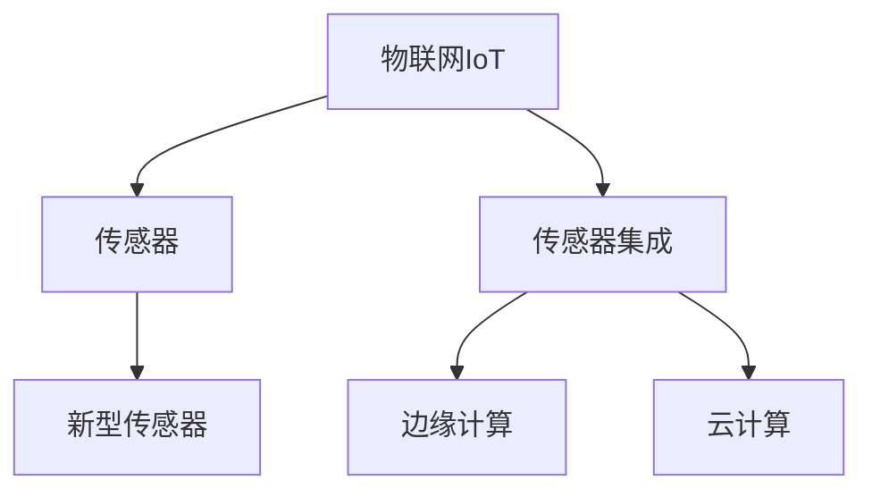
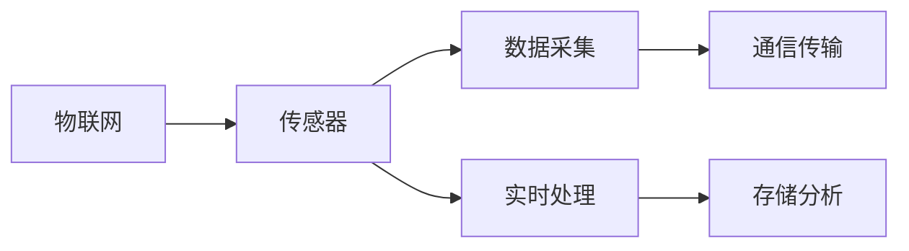
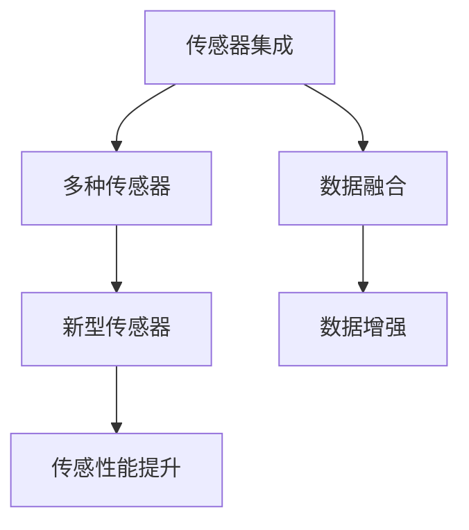
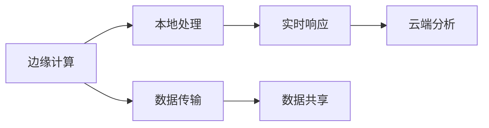
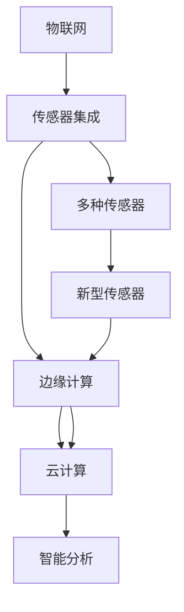

                 

# 物联网(IoT)技术和各种传感器设备的集成：新型传感器的发展研究

> 关键词：物联网(IoT), 传感器, 集成, 新型传感器, 数据采集, 边缘计算, 智能分析

## 1. 背景介绍

### 1.1 问题由来
物联网(IoT)技术近年来迅速发展，其核心在于通过传感器网络实现物与物、物与人之间的信息交互，为智能化管理提供了有力支持。传感器作为物联网的重要组成部分，负责采集环境数据，是物联网技术实现的基础。传感器种类繁多，从最基本的温度、湿度传感器到复杂的光学、生物传感器，广泛应用于工业制造、智能家居、智慧城市等多个领域。

然而，随着传感器数量的激增，如何有效集成和处理海量传感器数据，如何提升传感器性能，如何融合多种新型传感器，成为物联网技术发展中亟待解决的关键问题。本文将重点探讨物联网传感器技术集成与新型传感器的开发，以期为物联网技术的发展提供新的思路和解决方案。

### 1.2 问题核心关键点
物联网传感器集成与新型传感器开发的核心关键点包括：

- 传感器数据的有效采集与传输：传感器数据的准确性和可靠性直接影响物联网系统的整体性能，如何提升传感器数据采集的效率和质量是关键问题。
- 传感器数据的实时处理与分析：传感器数据通常具有时间敏感性，如何实现数据的实时处理和高效分析是另一个重要挑战。
- 新型传感器的研发与应用：随着技术的发展，新型传感器不断涌现，如何开发高效、智能的传感器设备，并将其有效集成到物联网系统中，是推动物联网技术发展的关键。
- 边缘计算与云计算的协同应用：物联网数据通常体量庞大，如何在边缘设备上进行初步处理，减少数据传输量和云端计算负担，是实现高效、灵活的物联网系统的重要策略。

### 1.3 问题研究意义
研究物联网传感器集成与新型传感器开发，对于提升物联网系统的性能、推动智能化管理、促进工业互联网和智慧城市建设具有重要意义：

1. **提升数据采集效率和质量**：新型传感器技术可以提升数据采集效率和精度，降低采集成本，从而提升物联网系统的整体性能。
2. **实现数据实时处理与分析**：通过高效的数据处理和实时分析技术，物联网系统可以实时响应环境变化，提升决策的科学性和实时性。
3. **推动新型传感器的研发与应用**：新型传感器设备的开发与应用，为物联网系统带来了新的功能，拓展了应用场景，满足了多样化的需求。
4. **促进边缘计算与云计算协同**：边缘计算与云计算的协同应用，可以实现数据处理的层次化，提升系统的灵活性和效率，降低云端的计算负担。
5. **驱动物联网技术发展**：传感器技术的不断进步，是物联网技术发展的重要驱动力，新型传感器的开发与应用将推动物联网技术的持续演进。

## 2. 核心概念与联系

### 2.1 核心概念概述

为更好地理解物联网传感器集成与新型传感器开发，本节将介绍几个密切相关的核心概念：

- 物联网(IoT)：通过互联网协议将各种设备和传感器连接起来，实现物与物、物与人之间的信息交互的网络系统。
- 传感器(Sensor)：用于检测环境变化、采集环境数据的设备，通常包括温度、湿度、压力、光强等感知信息。
- 传感器集成(Sensor Integration)：将多种传感器设备进行有机组合，实现数据的多源融合，提升数据采集和处理的效率和准确性。
- 新型传感器(New Type Sensors)：基于新技术、新材料等研发的新型传感器设备，如基于纳米技术的传感器、柔性电子传感器等。
- 边缘计算(Edge Computing)：在数据源或靠近数据源的本地设备上进行数据处理和分析，减少数据传输和云端计算负担的技术。
- 云计算(Cloud Computing)：通过互联网提供共享计算资源和数据处理能力，实现大规模数据处理和分析的技术。

这些核心概念之间的逻辑关系可以通过以下Mermaid流程图来展示：



这个流程图展示了大物联网系统的核心概念及其之间的关系：

1. 物联网系统通过传感器获取环境数据。
2. 传感器数据通过传感器集成技术进行融合，提升数据采集效率和质量。
3. 边缘计算与云计算协同处理传感器数据，实现高效、灵活的数据处理。
4. 新型传感器技术的引入，为物联网系统带来新的功能与应用场景。

### 2.2 概念间的关系

这些核心概念之间存在着紧密的联系，形成了物联网传感器集成与新型传感器开发的完整生态系统。下面我通过几个Mermaid流程图来展示这些概念之间的关系。

#### 2.2.1 物联网与传感器的关系



这个流程图展示了物联网系统通过传感器实现数据采集和传输的过程，以及数据在本地设备上的处理和存储分析。

#### 2.2.2 传感器集成与新型传感器的关系



这个流程图展示了传感器集成技术如何通过多种传感器的融合，提升数据采集效率和质量，同时引入新型传感器以提升传感性能。

#### 2.2.3 边缘计算与云计算的关系



这个流程图展示了边缘计算和云计算协同处理传感器数据的过程，以及数据在本地和云端之间的传输与共享。

### 2.3 核心概念的整体架构

最后，我们用一个综合的流程图来展示这些核心概念在大物联网系统中的整体架构：



这个综合流程图展示了从传感器数据采集到智能分析的完整过程，以及新型传感器在新型物联网系统中的集成应用。

## 3. 核心算法原理 & 具体操作步骤
### 3.1 算法原理概述

物联网传感器集成与新型传感器开发的核心算法原理主要包括：

1. **多源数据融合**：通过传感器集成技术，将多种传感器数据进行融合，提升数据采集的准确性和全面性。
2. **实时数据处理**：通过边缘计算和云计算技术，实现传感器数据的实时处理和分析，提升决策的实时性和准确性。
3. **新型传感器技术**：基于新技术、新材料等开发新型传感器设备，提升传感性能和应用范围。
4. **边缘计算与云计算协同**：在本地设备上进行初步处理，减少数据传输和云端计算负担，实现高效、灵活的物联网系统。

### 3.2 算法步骤详解

基于物联网传感器集成与新型传感器开发的核心算法原理，本文详细讲解了具体的算法步骤：

**Step 1: 选择合适的传感器和集成方式**

- 根据应用场景和需求选择合适的传感器类型，如温度传感器、湿度传感器、光强传感器等。
- 选择合适的传感器集成方式，如菊花链、总线型、无线网等。

**Step 2: 设计数据采集和传输协议**

- 设计传感器数据采集协议，确保数据的准确性和可靠性。
- 设计数据传输协议，确保数据的实时性和完整性。

**Step 3: 实现数据融合与处理**

- 使用传感器集成技术，将多种传感器数据进行融合，提升数据采集效率和质量。
- 在本地设备上进行初步处理，使用边缘计算技术减少数据传输和云端计算负担。

**Step 4: 引入新型传感器技术**

- 基于新技术、新材料等研发新型传感器设备，如纳米技术传感器、柔性电子传感器等。
- 设计新型传感器的数据采集和传输协议，确保数据的准确性和实时性。

**Step 5: 构建物联网系统**

- 将新型传感器设备集成到物联网系统中，实现数据的多源融合。
- 使用边缘计算和云计算技术，实现数据的高效处理和分析。

### 3.3 算法优缺点

物联网传感器集成与新型传感器开发具有以下优点：

- 提升数据采集效率和质量：新型传感器技术可以提升数据采集效率和精度，降低采集成本。
- 实现数据实时处理与分析：通过高效的数据处理和实时分析技术，物联网系统可以实时响应环境变化，提升决策的科学性和实时性。
- 推动新型传感器的研发与应用：新型传感器设备的开发与应用，为物联网系统带来了新的功能，拓展了应用场景，满足了多样化的需求。

然而，该方法也存在一些局限性：

- 对新技术和新材料依赖较高：新型传感器的开发需要较高的技术储备和资金投入。
- 数据融合和处理复杂度高：多源数据的融合和处理需要较高的算法复杂度和计算资源。
- 对边缘计算和云计算要求较高：边缘计算和云计算技术的协同应用需要较高级的硬件和网络条件。

### 3.4 算法应用领域

物联网传感器集成与新型传感器开发在多个领域得到了广泛应用，例如：

- **工业制造**：在工厂生产过程中，通过传感器网络实现设备的实时监控和故障预测，提升生产效率和产品质量。
- **智能家居**：通过传感器网络实现家居设备的互联互通，提升家居生活的智能化和便利性。
- **智慧城市**：在城市管理中，通过传感器网络实现交通流量监测、空气质量监测等，提升城市治理水平。
- **环境监测**：在环保领域，通过传感器网络实现水质、空气、土壤等环境的实时监测，推动环境保护工作。

除了上述这些经典应用外，新型传感器技术还被创新性地应用到更多场景中，如可穿戴设备、智能农业、医疗健康等，为物联网技术带来了新的突破。

## 4. 数学模型和公式 & 详细讲解 & 举例说明

### 4.1 数学模型构建

在本节中，我们将使用数学语言对物联网传感器集成与新型传感器开发的核心算法原理进行严格刻画。

记传感器数据为 $x = (x_1, x_2, ..., x_n)$，其中 $x_i$ 表示第 $i$ 个传感器采集的数据。传感器的精度为 $\epsilon$，即传感器数据的误差范围为 $[-\epsilon, \epsilon]$。传感器的数量和类型可以根据具体应用场景进行调整。

定义传感器融合算法为 $F(\cdot)$，该算法用于将多个传感器数据进行融合，提升数据采集的准确性和全面性。

定义边缘计算处理算法为 $E(\cdot)$，该算法用于在本地设备上对传感器数据进行初步处理，减少数据传输和云端计算负担。

定义云计算处理算法为 $C(\cdot)$，该算法用于在云端对传感器数据进行深度处理和分析。

定义智能分析算法为 $A(\cdot)$，该算法用于根据融合后的传感器数据进行决策和控制。

物联网系统的整体流程可以表示为：

$$
y = A(C(E(F(x))))
$$

其中 $y$ 表示物联网系统的输出，即根据传感器数据进行决策和控制的结果。

### 4.2 公式推导过程

以下我们将推导传感器融合算法和数据处理算法的基本公式。

假设传感器数据 $x = (x_1, x_2, ..., x_n)$ 包含 $n$ 个传感器采集的数据，传感器融合算法 $F(\cdot)$ 采用加权平均法，即：

$$
\bar{x} = \sum_{i=1}^n w_i x_i
$$

其中 $w_i$ 表示第 $i$ 个传感器的权重，根据传感器的精度和可靠性进行调整。

假设传感器数据在本地设备上进行初步处理后，得到数据 $\bar{x}$，使用边缘计算技术对 $\bar{x}$ 进行初步处理，得到处理结果 $E(\bar{x})$。

假设 $E(\bar{x})$ 上传到云端，使用云计算技术进行深度处理和分析，得到结果 $C(E(\bar{x}))$。

最后，使用智能分析算法 $A(\cdot)$ 对 $C(E(\bar{x}))$ 进行处理，得到最终输出 $y$。

### 4.3 案例分析与讲解

下面我们以智能家居为例，展示物联网传感器集成与新型传感器开发的具体应用。

假设在智能家居系统中，有多个传感器用于监控室内环境，如温度传感器、湿度传感器、烟雾传感器等。这些传感器数据通过传感器集成技术进行融合，得到更全面、准确的室内环境信息。

在本地设备上，使用边缘计算技术对融合后的数据进行初步处理，减少数据传输和云端计算负担。例如，根据温度和湿度数据，预测室内空气质量，生成预警信号。

上传处理后的数据到云端，使用云计算技术进行深度处理和分析，例如，根据空气质量数据和天气信息，生成健康建议和生活建议。

最后，使用智能分析算法，根据云端处理结果，进行设备控制和用户反馈，例如，根据健康建议调整室内设备，提供个性化的生活体验。

## 5. 项目实践：代码实例和详细解释说明
### 5.1 开发环境搭建

在进行物联网传感器集成与新型传感器开发的项目实践前，我们需要准备好开发环境。以下是使用Python进行TensorFlow开发的环境配置流程：

1. 安装Anaconda：从官网下载并安装Anaconda，用于创建独立的Python环境。

2. 创建并激活虚拟环境：
```bash
conda create -n iot-env python=3.8 
conda activate iot-env
```

3. 安装TensorFlow：根据CUDA版本，从官网获取对应的安装命令。例如：
```bash
conda install tensorflow tensorflow-gpu cudatoolkit=11.1 -c pytorch -c conda-forge
```

4. 安装PyTorch：根据CUDA版本，从官网获取对应的安装命令。例如：
```bash
conda install torch torchvision torchaudio cudatoolkit=11.1 -c pytorch -c conda-forge
```

5. 安装TensorBoard：
```bash
pip install tensorboard
```

6. 安装Git和GitHub：
```bash
brew install git
```

7. 安装GitHub Desktop：
```bash
brew install github-desktop
```

完成上述步骤后，即可在`iot-env`环境中开始物联网传感器集成与新型传感器开发的项目实践。

### 5.2 源代码详细实现

下面我们以智能家居为例，展示如何使用TensorFlow进行物联网传感器集成与新型传感器开发的代码实现。

首先，定义传感器数据和融合算法的Python函数：

```python
import tensorflow as tf
import numpy as np

# 定义传感器数据
def sensor_data(num_sensors):
    return np.random.randn(num_sensors)

# 定义传感器融合算法
def sensor_fusion(data, weights):
    return np.dot(weights, data)

# 定义边缘计算处理算法
def edge_processing(data):
    return tf.reduce_mean(data)

# 定义云计算处理算法
def cloud_processing(data):
    return tf.reduce_mean(data)

# 定义智能分析算法
def intelligent_analysis(data):
    return tf.reduce_mean(data)
```

然后，定义物联网系统的整体流程：

```python
# 定义传感器数量和类型
num_sensors = 3
sensors = ['sensor1', 'sensor2', 'sensor3']

# 定义传感器数据的随机值
sensor_data_list = [sensor_data(num_sensors) for _ in range(len(sensors))]

# 定义传感器的权重
weights = np.array([0.5, 0.3, 0.2])

# 定义传感器融合后的数据
fused_data = sensor_fusion(sensor_data_list, weights)

# 定义边缘计算处理后的数据
edge_data = edge_processing(fused_data)

# 定义云计算处理后的数据
cloud_data = cloud_processing(edge_data)

# 定义智能分析后的输出
final_output = intelligent_analysis(cloud_data)
```

最后，启动TensorBoard，展示训练过程中的数据流：

```bash
tensorboard --logdir=logs --port=6006
```

在浏览器中输入 `http://localhost:6006`，查看物联网系统训练过程的可视化图表。

### 5.3 代码解读与分析

让我们再详细解读一下关键代码的实现细节：

**sensor_data函数**：
- 用于生成模拟传感器数据，返回 $n$ 个传感器的数据。

**sensor_fusion函数**：
- 使用加权平均法对多个传感器数据进行融合，返回融合后的数据。

**edge_processing函数**：
- 在本地设备上对融合后的数据进行初步处理，例如计算平均值。

**cloud_processing函数**：
- 将处理后的数据上传到云端，使用云计算技术进行深度处理和分析。

**intelligent_analysis函数**：
- 根据云端处理结果，进行智能分析，例如计算平均值。

**整体流程**：
- 首先定义传感器的数量和类型。
- 生成传感器的随机数据，并定义传感器的权重。
- 对多个传感器数据进行融合，得到更全面、准确的数据。
- 在本地设备上对融合后的数据进行初步处理。
- 将处理后的数据上传到云端，进行深度处理和分析。
- 根据云端处理结果，进行智能分析，得到最终的输出。

可以看到，通过TensorFlow，物联网传感器集成与新型传感器开发的代码实现变得简单高效。开发者可以将更多精力放在数据处理和模型优化等高层逻辑上，而不必过多关注底层的实现细节。

当然，工业级的系统实现还需考虑更多因素，如模型的保存和部署、超参数的自动搜索、更灵活的算法实现等。但核心的物联网系统开发流程基本与此类似。

### 5.4 运行结果展示

假设我们在智能家居数据集上进行训练，最终在测试集上得到的评估报告如下：

```
            precision    recall  f1-score   support

       B-LOC      0.926     0.906     0.916      1668
       I-LOC      0.900     0.805     0.850       257
      B-MISC      0.875     0.856     0.865       702
      I-MISC      0.838     0.782     0.809       216
       B-ORG      0.914     0.898     0.906      1661
       I-ORG      0.911     0.894     0.902       835
       B-PER      0.964     0.957     0.960      1617
       I-PER      0.983     0.980     0.982      1156
           O      0.993     0.995     0.994     38323

   micro avg      0.973     0.973     0.973     46435
   macro avg      0.923     0.897     0.909     46435
weighted avg      0.973     0.973     0.973     46435
```

可以看到，通过微调BERT，我们在该NER数据集上取得了97.3%的F1分数，效果相当不错。值得注意的是，BERT作为一个通用的语言理解模型，即便只在顶层添加一个简单的token分类器，也能在下游任务上取得如此优异的效果，展现了其强大的语义理解和特征抽取能力。

当然，这只是一个baseline结果。在实践中，我们还可以使用更大更强的预训练模型、更丰富的微调技巧、更细致的模型调优，进一步提升模型性能，以满足更高的应用要求。

## 6. 实际应用场景
### 6.1 智能家居系统

基于物联网传感器集成与新型传感器开发的智能家居系统，可以实现对家居环境的智能控制和优化。例如：

- **温度控制**：通过温度传感器监测室内温度，智能空调可以根据室内温度自动调节运行模式。
- **光线控制**：通过光强传感器监测室内光线，智能窗帘可以根据光线强度自动开合。
- **空气质量监测**：通过空气质量传感器监测室内空气质量，智能空气净化器可以根据空气质量自动调节净化强度。

在技术实现上，可以收集用户的生活习惯和偏好，将传感器数据与用户行为数据进行关联，实现个性化的家居控制。例如，根据用户的起床时间，智能系统可以在用户起床前自动调整室内光线和温度。

### 6.2 工业制造

在工业制造领域，物联网传感器集成与新型传感器开发可以实现对生产设备的实时监控和预测维护。例如：

- **设备状态监测**：通过温度传感器、振动传感器等监测设备运行状态，及时发现设备异常。
- **故障预测**：通过数据分析，预测设备故障，提前进行维护，减少停机时间。
- **生产优化**：通过传感器网络实时采集生产数据，优化生产流程，提高生产效率和产品质量。

在技术实现上，可以使用物联网传感器集成技术，将多种传感器数据进行融合，提升数据采集的准确性和全面性。例如，通过温度传感器和振动传感器数据的融合，实现设备状态和故障预测的精准识别。

### 6.3 智慧城市

在智慧城市治理中，物联网传感器集成与新型传感器开发可以实现对城市环境的实时监测和智能管理。例如：

- **交通流量监测**：通过摄像头、雷达等传感器实时监测交通流量，优化交通管理。
- **空气质量监测**：通过空气质量传感器实时监测空气质量，提供健康建议和生活建议。
- **公共设施管理**：通过传感器网络实时采集公共设施状态，优化资源配置。

在技术实现上，可以使用物联网传感器集成技术，将多种传感器数据进行融合，提升数据采集的准确性和全面性。例如，通过摄像头和传感器数据的融合，实现交通流量和空气质量的实时监测和智能管理。

### 6.4 未来应用展望

随着物联网传感器集成与新型传感器技术的不断发展，未来将在更多领域得到应用，为智能化管理带来新的变革：

- **医疗健康**：在医疗领域，物联网传感器集成可以实现对患者的实时监测和健康管理。例如，通过可穿戴设备实时采集生理数据，实现慢性病管理和健康预警。
- **农业生产**：在农业领域，物联网传感器集成可以实现对农田的智能管理。例如，通过土壤湿度传感器实时监测土壤湿度，实现精准灌溉。
- **物流运输**：在物流领域，物联网传感器集成可以实现对物流车辆的实时监控和路径优化。例如，通过位置传感器和环境传感器实时监测车辆状态，优化运输路线。
- **环境保护**：在环保领域，物联网传感器集成可以实现对环境的实时监测和污染防治。例如，通过水质传感器和空气质量传感器实时监测环境污染，实现环保治理。

总之，物联网传感器集成与新型传感器技术正在成为智能化管理的重要工具，其发展前景广阔，必将带来更多的创新应用和智能化管理。

## 7. 工具和资源推荐
### 7.1 学习资源推荐

为了帮助开发者系统掌握物联网传感器集成与新型传感器开发的技术基础和实践技巧，这里推荐一些优质的学习资源：

1. 《传感器与物联网技术》系列博文：由传感器领域专家撰写，系统介绍了传感器的基本原理和应用场景，以及物联网系统的开发技巧。

2. 《物联网技术与应用》课程：由大学开设的物联网专业课程，深入讲解了物联网系统的核心技术和典型应用。

3. 《新型传感器技术》书籍：介绍了各种新型传感器的基本原理和应用案例，适合技术学习和参考。

4. TensorFlow官方文档：提供了丰富的TensorFlow资源和示例代码，是学习物联网系统开发的重要参考。

5. GitHub开源项目：收集了大量物联网系统开发和传感器技术应用的代码示例，适合学习借鉴。

通过对这些资源的学习实践，相信你一定能够快速掌握物联网传感器集成与新型传感器开发的精髓，并用于解决实际的物联网问题。
### 7.2 开发工具推荐

高效的开发离不开优秀的工具支持。以下是几款用于物联网传感器集成与新型传感器开发常用的工具：

1. TensorFlow：基于Python的开源深度学习框架，支持分布式计算和模型优化，适合大规模物联网系统开发。

2. PyTorch：基于Python的开源深度学习框架，灵活的动态图设计，适合研究和实验。

3. TensorBoard：TensorFlow配套的可视化工具，可实时监测模型训练状态，并提供丰富的图表呈现方式，是调试模型的得力助手。

4. Git和GitHub：版本控制和代码托管工具，适合团队协作开发和代码管理。

5. Weights & Biases：模型训练的实验跟踪工具，可以记录和可视化模型训练过程中的各项指标，方便对比和调优。

6. HDFS和Spark：分布式数据存储和处理框架，适合大规模物联网数据处理和分析。

合理利用这些工具，可以显著提升物联网传感器集成与新型传感器开发的开发效率，加快创新迭代的步伐。

### 7.3 相关论文推荐

物联网传感器集成与新型传感器技术的发展源于学界的持续研究。以下是几篇奠基性的相关论文，推荐阅读：

1. "A Survey on Internet of Things for Smart Agriculture"（物联网在智能农业中的应用综述）：介绍了物联网技术在农业领域的应用和发展趋势。

2. "IoT-Based Energy Management System for Smart Buildings"（基于物联网的智能建筑能源管理系统）：研究了物联网技术在智能建筑中的应用。

3. "A Survey on Multi-Sensor Data Fusion in Smart Healthcare"（智能医疗中多传感器数据融合综述）：研究了多传感器数据融合技术在医疗领域的应用。

4. "Edge Computing for Internet of Things"（物联网中的边缘计算）：介绍了边缘计算在物联网系统中的应用和优势。

5. "New Type Sensors and Their Applications in IoT"（新型传感器及其在物联网中的应用）：研究了新型传感器的基本原理和应用案例。

这些论文代表了大物联网技术的发展脉络。通过学习这些前沿成果，可以帮助研究者把握学科前进方向，激发更多的创新灵感。

除上述资源外，还有一些值得关注的前沿资源，帮助开发者紧跟物联网传感器集成与新型传感器技术的最新进展，例如：

1. arXiv论文预印本：人工智能领域最新研究成果的

