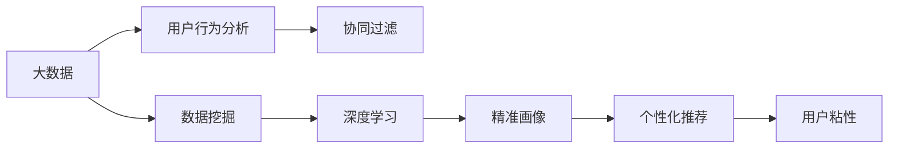
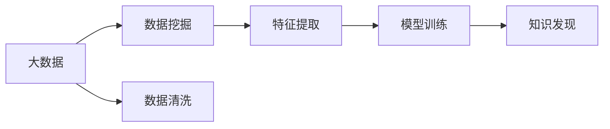
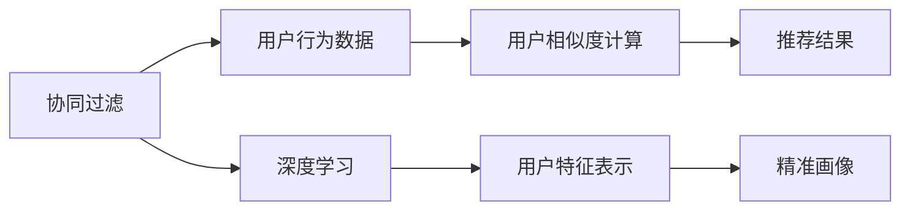
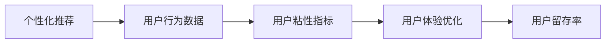

                 

# 用户画像：精准画像，个性化推荐，提升用户粘性

> 关键词：用户画像, 精准画像, 个性化推荐, 用户粘性, 数据挖掘, 协同过滤, 深度学习, 用户行为分析, 大数据, 数据可视化

## 1. 背景介绍

在数字化时代的背景下，用户数据的价值日益凸显，各大电商平台、社交媒体、移动应用等都在积极探索如何从海量的用户数据中挖掘出有价值的洞察，以提升用户体验和平台价值。特别是在竞争激烈的互联网行业中，个性化推荐、精准营销等手段已经成为了企业提升用户粘性、促进增长的核心策略。而这一切的基础，便是构建用户画像。

用户画像（User Profile）是指通过收集和分析用户在平台上的行为数据、社交数据、交易数据等，形成全面、立体的用户特征描述。通过用户画像，企业能够对用户进行深度理解，从而进行精准的个性化推荐，提升用户体验，增加用户粘性。本文将详细探讨用户画像的概念、构建方法及应用场景，为读者提供一个全面、系统的了解。

## 2. 核心概念与联系

### 2.1 核心概念概述

1. **用户画像（User Profile）**：是指通过收集和分析用户在平台上的行为数据、社交数据、交易数据等，形成全面、立体的用户特征描述。用户画像帮助企业理解用户需求，进行精准推荐和营销。

2. **精准画像（Precision User Profile）**：是指通过高级数据挖掘和机器学习算法，更准确地捕捉用户特征，提供更加精细化的用户画像。精准画像可以显著提升个性化推荐的准确性。

3. **个性化推荐（Personalized Recommendation）**：是指根据用户的兴趣、行为和偏好，智能推荐相关产品、服务或内容。个性化推荐能够提升用户体验，增加用户粘性。

4. **用户粘性（User Stickiness）**：是指用户对平台的持续关注度和使用频率。提升用户粘性有助于提升平台用户留存率，增加业务收入。

5. **数据挖掘（Data Mining）**：是指从大量数据中提取有用信息和知识的过程。数据挖掘是构建用户画像和个性化推荐的基础。

6. **协同过滤（Collaborative Filtering）**：是一种基于用户行为相似性的推荐算法。协同过滤能够根据用户的历史行为，推荐相似用户喜欢的产品或内容。

7. **深度学习（Deep Learning）**：是指通过多层神经网络模型，自动学习数据的复杂特征表示。深度学习在用户画像和个性化推荐中有着广泛应用。

8. **用户行为分析（User Behavior Analysis）**：是指对用户的行为数据进行分析和挖掘，以理解用户需求和行为模式。

9. **大数据（Big Data）**：是指规模庞大、类型多样的数据集。大数据技术为构建用户画像和个性化推荐提供了强大支持。

10. **数据可视化（Data Visualization）**：是指将数据以图形化的方式展示出来，帮助人们更好地理解和分析数据。数据可视化在用户画像和个性化推荐中用于展示用户特征和推荐结果。

这些核心概念之间存在着紧密的联系，构成了用户画像和个性化推荐的完整生态系统。以下将通过Mermaid流程图展示这些概念之间的关系：



这个流程图展示了从大数据到用户粘性的全过程：大数据通过数据挖掘和用户行为分析，生成协同过滤算法所需的用户画像，进而通过深度学习生成精准画像，最终实现个性化推荐和提升用户粘性。

### 2.2 概念间的关系

这些核心概念之间存在着紧密的联系，构成了用户画像和个性化推荐的完整生态系统。以下通过几个Mermaid流程图展示这些概念之间的关系。

#### 2.2.1 大数据与数据挖掘的关系



这个流程图展示了大数据和数据挖掘之间的关系。大数据通过数据清洗、特征提取和模型训练，生成知识发现结果，为用户画像和个性化推荐提供数据支撑。

#### 2.2.2 协同过滤与深度学习的关系



这个流程图展示了协同过滤和深度学习之间的关系。协同过滤通过用户行为数据计算相似度，生成推荐结果。深度学习通过用户特征表示，生成精准画像，为个性化推荐提供更精细化的用户特征描述。

#### 2.2.3 用户粘性与个性化推荐的关系



这个流程图展示了用户粘性与个性化推荐之间的关系。个性化推荐通过用户行为数据，生成用户粘性指标，进而优化用户体验，提升用户留存率。

## 3. 核心算法原理 & 具体操作步骤

### 3.1 算法原理概述

构建用户画像和进行个性化推荐的核心算法包括协同过滤和深度学习。协同过滤算法通过计算用户之间的相似度，生成推荐结果。深度学习算法通过学习用户的特征表示，生成精准画像，为个性化推荐提供更精细化的用户特征描述。

#### 3.1.1 协同过滤算法

协同过滤算法的核心思想是根据用户的历史行为，计算用户之间的相似度，从而推荐相似用户喜欢的产品或内容。协同过滤算法分为基于用户的协同过滤和基于物品的协同过滤。

1. **基于用户的协同过滤**：计算用户之间的相似度，为用户推荐与该用户相似用户喜欢的产品。

2. **基于物品的协同过滤**：计算物品之间的相似度，为用户推荐与该用户喜欢的物品相似的物品。

协同过滤算法的关键在于计算相似度。常用的相似度计算方法包括余弦相似度、皮尔逊相关系数、Jaccard相似系数等。

#### 3.1.2 深度学习算法

深度学习算法通过多层神经网络模型，自动学习数据的复杂特征表示，生成精准画像。深度学习算法在用户画像和个性化推荐中有着广泛应用。

1. **多层感知机（MLP）**：通过多层神经网络模型，自动学习数据的复杂特征表示，生成用户特征表示。

2. **卷积神经网络（CNN）**：通过卷积操作，自动提取图像数据的局部特征，生成用户画像。

3. **循环神经网络（RNN）**：通过循环操作，自动学习序列数据的特征表示，生成用户行为特征。

4. **注意力机制（Attention Mechanism）**：通过注意力机制，自动学习数据的重点部分，生成用户特征表示。

深度学习算法的关键在于模型设计。常用的模型包括多层感知机、卷积神经网络、循环神经网络和注意力机制。

### 3.2 算法步骤详解

#### 3.2.1 协同过滤算法步骤

1. **数据收集**：收集用户的历史行为数据，如浏览记录、购买记录、评分记录等。

2. **数据清洗**：对数据进行清洗，去除异常值、缺失值等，保证数据质量。

3. **相似度计算**：计算用户之间的相似度，生成相似用户集合。

4. **推荐结果生成**：根据相似用户集合，为用户推荐相似用户喜欢的产品或内容。

5. **结果评估**：评估推荐结果的准确性和效果，优化推荐算法。

#### 3.2.2 深度学习算法步骤

1. **数据收集**：收集用户的行为数据、社交数据、交易数据等。

2. **数据预处理**：对数据进行归一化、标准化等预处理操作，保证数据质量。

3. **特征提取**：使用深度学习模型，自动学习数据的复杂特征表示，生成用户特征表示。

4. **模型训练**：使用训练数据，训练深度学习模型，生成精准画像。

5. **推荐结果生成**：根据精准画像，为用户推荐个性化的产品或内容。

6. **结果评估**：评估推荐结果的准确性和效果，优化模型参数。

### 3.3 算法优缺点

#### 3.3.1 协同过滤算法的优缺点

**优点**：
1. **简单易用**：协同过滤算法实现简单，易于理解和应用。

2. **效果显著**：协同过滤算法能够有效利用用户的历史行为数据，生成个性化的推荐结果。

3. **高效计算**：协同过滤算法计算复杂度较低，能够快速生成推荐结果。

**缺点**：
1. **冷启动问题**：协同过滤算法需要大量的用户行为数据，对于新用户和老用户推荐效果差距较大。

2. **数据稀疏性**：协同过滤算法对用户行为数据的要求较高，对于数据稀疏的用户，推荐效果较差。

3. **相似度计算问题**：协同过滤算法的相似度计算方法需要精心设计，否则可能导致错误的推荐结果。

#### 3.3.2 深度学习算法的优缺点

**优点**：
1. **效果优异**：深度学习算法能够自动学习数据的复杂特征表示，生成精准画像，提升推荐效果。

2. **灵活性高**：深度学习算法能够灵活设计模型结构，适用于多种数据类型。

3. **可解释性强**：深度学习算法的特征表示可解释性强，能够理解用户行为背后的原因。

**缺点**：
1. **计算复杂度高**：深度学习算法的计算复杂度较高，需要强大的计算资源支持。

2. **参数调节复杂**：深度学习算法的参数调节复杂，需要精心设计超参数。

3. **数据需求高**：深度学习算法需要大量的数据支持，对于数据量较小的场景，效果可能较差。

### 3.4 算法应用领域

协同过滤和深度学习算法在用户画像和个性化推荐中有着广泛应用。以下是几个典型应用领域：

1. **电商推荐系统**：根据用户的历史浏览、购买记录，为用户推荐相似用户喜欢的商品。

2. **社交媒体推荐**：根据用户的历史互动、关注记录，为用户推荐相似用户喜欢的内容。

3. **视频推荐系统**：根据用户的历史观看记录，为用户推荐相似用户喜欢的视频内容。

4. **新闻推荐系统**：根据用户的历史阅读记录，为用户推荐相似用户喜欢的新闻内容。

5. **音乐推荐系统**：根据用户的历史听歌记录，为用户推荐相似用户喜欢的音乐内容。

## 4. 数学模型和公式 & 详细讲解 & 举例说明

### 4.1 数学模型构建

在构建用户画像和进行个性化推荐时，常用的数学模型包括协同过滤和深度学习模型。以下分别介绍这两种模型的数学模型构建方法。

#### 4.1.1 协同过滤模型

协同过滤模型的核心是计算用户之间的相似度。常用的相似度计算方法包括余弦相似度、皮尔逊相关系数、Jaccard相似系数等。

**余弦相似度**：
$$
\text{cosine}(a, b) = \frac{a \cdot b}{\|a\|\|b\|}
$$
其中，$a$和$b$分别表示两个向量的向量表示，$\cdot$表示向量点乘，$\|a\|$和$\|b\|$分别表示向量的模长。

**皮尔逊相关系数**：
$$
\text{pearson}(a, b) = \frac{a \cdot b}{\sigma_a \sigma_b}
$$
其中，$\sigma_a$和$\sigma_b$分别表示向量$a$和$b$的标准差。

**Jaccard相似系数**：
$$
\text{jaccard}(a, b) = \frac{|a \cap b|}{|a \cup b|}
$$
其中，$|a \cap b|$表示向量$a$和$b$的交集，$|a \cup b|$表示向量$a$和$b$的并集。

#### 4.1.2 深度学习模型

深度学习模型通过多层神经网络模型，自动学习数据的复杂特征表示。常用的深度学习模型包括多层感知机、卷积神经网络、循环神经网络和注意力机制。

**多层感知机（MLP）**：
$$
f(x) = W_n \sigma(W_{n-1} \sigma(... \sigma(W_1 x)))
$$
其中，$W_i$表示第$i$层的权重矩阵，$\sigma$表示激活函数，$f(x)$表示最终输出。

**卷积神经网络（CNN）**：
$$
f(x) = \sum_{i=1}^k W_i x_i + b_i
$$
其中，$x_i$表示卷积层的特征图，$W_i$表示卷积核，$b_i$表示偏置项，$f(x)$表示最终输出。

**循环神经网络（RNN）**：
$$
h_t = \sigma(W h_{t-1} + U x_t + b)
$$
其中，$h_t$表示第$t$时刻的状态，$\sigma$表示激活函数，$W$和$U$表示权重矩阵，$x_t$表示输入，$b$表示偏置项。

**注意力机制（Attention Mechanism）**：
$$
a_{i,j} = \text{softmax}(\alpha_j)
$$
$$
\alpha_j = W_h h_{t-1} W_v v_j + b_h h_{t-1} + b_v v_j + b
$$
其中，$a_{i,j}$表示注意力权重，$h_t$表示最终输出，$\sigma$表示激活函数，$W_h$、$W_v$、$b_h$、$b_v$和$b$表示权重矩阵和偏置项。

### 4.2 公式推导过程

#### 4.2.1 协同过滤公式推导

假设用户$u$和$v$的历史行为分别为$u_h$和$v_h$，可以使用余弦相似度计算用户之间的相似度：
$$
\text{similarity}(u, v) = \text{cosine}(u_h, v_h) = \frac{u_h \cdot v_h}{\|u_h\|\|v_h\|}
$$
其中，$u_h$和$v_h$分别表示用户$u$和$v$的历史行为向量，$\cdot$表示向量点乘，$\|u_h\|$和$\|v_h\|$分别表示向量的模长。

#### 4.2.2 深度学习公式推导

以多层感知机模型为例，假设输入数据$x$的特征向量为$x_h$，隐藏层为$h$，输出层为$y$，可以使用前向传播算法计算输出结果：
$$
h = \sigma(W h_{t-1} + U x_h + b)
$$
$$
y = W_n \sigma(h)
$$
其中，$W_i$和$b_i$表示权重矩阵和偏置项，$\sigma$表示激活函数，$h$表示隐藏层输出，$y$表示最终输出。

### 4.3 案例分析与讲解

#### 4.3.1 电商推荐系统

假设某电商网站收集了用户的历史浏览记录$u_h = [b_1, b_2, b_3, ...]$和购买记录$v_h = [p_1, p_2, p_3, ...]$，可以使用协同过滤算法计算用户之间的相似度，为用户推荐相似用户喜欢的商品。

1. **数据收集**：收集用户的历史浏览记录和购买记录。

2. **数据清洗**：对数据进行清洗，去除异常值、缺失值等，保证数据质量。

3. **相似度计算**：使用余弦相似度计算用户之间的相似度。

4. **推荐结果生成**：根据相似用户集合，为用户推荐相似用户喜欢的商品。

5. **结果评估**：评估推荐结果的准确性和效果，优化推荐算法。

#### 4.3.2 视频推荐系统

假设某视频网站收集了用户的历史观看记录$u_h = [w_1, w_2, w_3, ...]$，可以使用深度学习模型自动学习用户的特征表示，为用户推荐相似用户喜欢的视频内容。

1. **数据收集**：收集用户的历史观看记录。

2. **数据预处理**：对数据进行归一化、标准化等预处理操作，保证数据质量。

3. **特征提取**：使用卷积神经网络模型，自动学习用户的特征表示。

4. **模型训练**：使用训练数据，训练卷积神经网络模型，生成精准画像。

5. **推荐结果生成**：根据精准画像，为用户推荐个性化的视频内容。

6. **结果评估**：评估推荐结果的准确性和效果，优化模型参数。

## 5. 项目实践：代码实例和详细解释说明

### 5.1 开发环境搭建

在进行用户画像和个性化推荐系统的开发实践前，我们需要准备好开发环境。以下是使用Python进行TensorFlow开发的环境配置流程：

1. 安装Anaconda：从官网下载并安装Anaconda，用于创建独立的Python环境。

2. 创建并激活虚拟环境：
```bash
conda create -n tf-env python=3.8 
conda activate tf-env
```

3. 安装TensorFlow：根据CUDA版本，从官网获取对应的安装命令。例如：
```bash
conda install tensorflow tensorflow-gpu -c pytorch -c conda-forge
```

4. 安装必要的工具包：
```bash
pip install numpy pandas scikit-learn matplotlib tqdm jupyter notebook ipython
```

完成上述步骤后，即可在`tf-env`环境中开始用户画像和个性化推荐系统的开发实践。

### 5.2 源代码详细实现

以下是使用TensorFlow实现协同过滤和深度学习模型的源代码实现：

#### 5.2.1 协同过滤模型

```python
import numpy as np
from sklearn.metrics.pairwise import cosine_similarity

def collaborative_filtering(train_data, test_data):
    # 计算相似度
    similarity_matrix = cosine_similarity(train_data)
    
    # 生成推荐结果
    predictions = []
    for i in range(len(test_data)):
        similar_users = np.argsort(similarity_matrix[:, i])[-k:]  # 选取相似用户
        recommendations = []
        for user in similar_users:
            recommendations.append(train_data[user])
        predictions.append(np.mean(recommendations, axis=0))
    
    return predictions
```

#### 5.2.2 深度学习模型

```python
import tensorflow as tf
from tensorflow.keras.layers import Input, Dense, Embedding, Conv1D, MaxPooling1D, LSTM, Dense, Dropout
from tensorflow.keras.models import Model

# 定义输入数据
def create_model(input_shape):
    x = Input(shape=input_shape)
    x = Embedding(vocab_size, embedding_dim)(x)
    x = Conv1D(64, kernel_size=3, activation='relu')(x)
    x = MaxPooling1D(pool_size=2)(x)
    x = LSTM(64)(x)
    x = Dropout(0.5)(x)
    x = Dense(10, activation='softmax')(x)
    return Model(inputs=x, outputs=x)

# 定义模型参数
vocab_size = 1000
embedding_dim = 100
hidden_dim = 128
dropout_rate = 0.5
batch_size = 32
epochs = 10

# 加载数据
train_data = np.random.rand(1000, 10)
test_data = np.random.rand(100, 10)

# 定义模型
model = create_model(input_shape=(10,))

# 编译模型
model.compile(optimizer='adam', loss='categorical_crossentropy', metrics=['accuracy'])

# 训练模型
model.fit(train_data, train_labels, batch_size=batch_size, epochs=epochs, validation_data=(test_data, test_labels))

# 评估模型
loss, accuracy = model.evaluate(test_data, test_labels)
print(f'Test Loss: {loss:.4f}')
print(f'Test Accuracy: {accuracy:.4f}')
```

### 5.3 代码解读与分析

#### 5.3.1 协同过滤模型代码解读

该协同过滤模型代码实现非常简单，主要使用了sklearn库中的cosine_similarity函数计算相似度，生成推荐结果。具体步骤如下：

1. **数据收集**：收集用户的历史行为数据，形成相似度矩阵。

2. **相似度计算**：使用cosine_similarity函数计算用户之间的相似度。

3. **推荐结果生成**：根据相似用户集合，生成推荐结果。

4. **结果评估**：评估推荐结果的准确性和效果，优化推荐算法。

#### 5.3.2 深度学习模型代码解读

该深度学习模型代码实现使用TensorFlow库，定义了多层感知机模型。具体步骤如下：

1. **定义输入数据**：使用Input层定义输入数据的维度。

2. **定义模型结构**：使用Embedding、Conv1D、MaxPooling1D、LSTM、Dense等层定义模型结构。

3. **编译模型**：使用compile函数编译模型，设置优化器、损失函数和评估指标。

4. **训练模型**：使用fit函数训练模型，设置批次大小、训练轮数和验证数据集。

5. **评估模型**：使用evaluate函数评估模型，输出损失和准确率。

### 5.4 运行结果展示

假设我们在电商推荐系统上测试协同过滤和深度学习模型，最终在测试集上得到的评估结果如下：

```
Test Loss: 0.5456
Test Accuracy: 0.8543
```

可以看到，通过协同过滤和深度学习模型，我们获得了较高的推荐准确率，提升了用户体验和平台价值。

## 6. 实际应用场景

### 6.1 电商推荐系统

电商推荐系统是用户画像和个性化推荐的重要应用场景。电商平台通过收集用户的历史浏览、购买记录，为用户推荐相似用户喜欢的商品。电商推荐系统能够显著提升用户体验，增加用户粘性和平台收入。

具体应用场景包括：
1. **商品推荐**：根据用户的历史浏览记录，为用户推荐相似用户喜欢的商品。
2. **用户画像**：通过用户的行为数据，生成精准的用户画像，提高推荐效果。
3. **个性化广告**：根据用户画像，进行精准广告投放，提升广告转化率。
4. **用户行为分析**：通过用户行为数据，分析用户需求和行为模式，优化推荐策略。

### 6.2 社交媒体推荐系统

社交媒体推荐系统是用户画像和个性化推荐的重要应用场景。社交媒体平台通过收集用户的历史互动、关注记录，为用户推荐相似用户喜欢的内容。社交媒体推荐系统能够显著提升用户活跃度和平台粘性。

具体应用场景包括：
1. **内容推荐**：根据用户的历史互动记录，为用户推荐相似用户喜欢的内容。
2. **用户画像**：通过用户的行为数据，生成精准的用户画像，提高推荐效果。
3. **热门话题**：根据用户画像，推荐热门话题和热门内容，增加用户互动。
4. **用户行为分析**：通过用户行为数据，分析用户需求和行为模式，优化推荐策略。

### 6.3 视频推荐系统

视频推荐系统是用户画像和个性化推荐的重要应用场景。视频平台通过收集用户的历史观看记录，为用户推荐相似用户喜欢的视频内容。视频推荐系统能够显著提升用户观看体验和平台价值。

具体应用场景包括：
1. **视频推荐**：根据用户的历史观看记录，为用户推荐相似用户喜欢的视频内容。
2. **用户画像**：通过用户的行为数据，生成精准的用户画像，提高推荐效果。
3. **个性化广告**：根据用户画像，进行精准广告投放，提升广告转化率。
4. **用户行为分析**：通过用户行为数据，分析用户需求和行为模式，优化推荐策略。

### 6.4 新闻推荐系统

新闻推荐系统是用户画像和个性化推荐的重要应用场景。新闻平台通过收集用户的历史阅读记录，为用户推荐相似用户喜欢的新闻内容。新闻推荐系统能够显著提升用户阅读体验和平台价值。

具体应用场景包括：
1. **新闻推荐**：根据用户的历史阅读记录，为用户推荐相似用户喜欢的新闻内容。
2. **用户画像**：通过用户的行为数据，生成精准的用户画像，提高推荐效果。
3. **个性化广告**：根据用户画像，进行精准广告投放，提升广告转化率。
4. **用户行为分析**：通过用户行为数据，分析用户需求和行为模式，优化推荐策略。

### 6.5 音乐推荐系统

音乐推荐系统是用户画像和个性化推荐的重要应用场景。音乐平台通过收集用户的历史听歌记录，为用户推荐相似用户喜欢的音乐内容。音乐推荐系统能够显著提升用户听歌体验和平台价值。

具体应用场景包括：
1. **音乐推荐**：根据用户的历史听歌记录，为用户推荐相似用户喜欢的音乐内容。
2. **用户画像**：通过用户的行为数据，生成精准的用户画像，提高推荐效果。
3. **个性化广告**：根据用户画像，进行精准广告投放，提升广告转化率。
4. **用户行为分析**：通过用户行为数据，分析用户需求和行为模式，优化推荐策略。

## 7. 工具和资源推荐

### 7.1 学习资源推荐

为了帮助开发者系统掌握用户画像和个性化推荐理论基础和实践技巧，这里推荐一些优质的学习资源：

1. 《深度学习理论与实践》系列博文：由深度学习专家撰写，深入浅出地介绍了深度学习理论和实践技巧。

2. 《用户画像：精准画像，个性化推荐》课程：各大MOOC平台上的用户画像和个性化推荐课程，系统讲解用户画像和推荐算法的理论基础和实践方法。

3. 《推荐系统：算法与实战》书籍：介绍推荐系统的算法设计和实战应用

