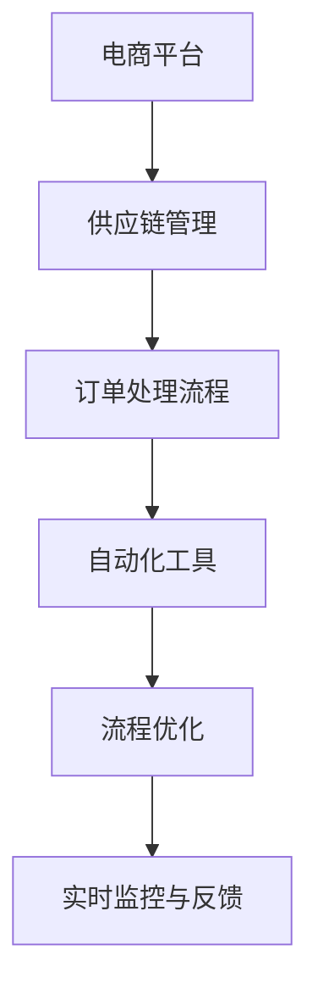
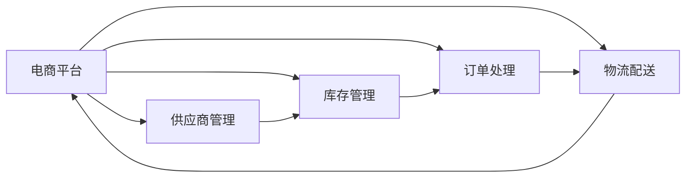
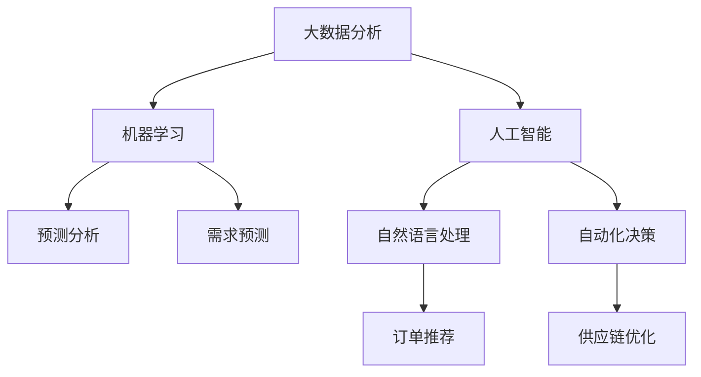
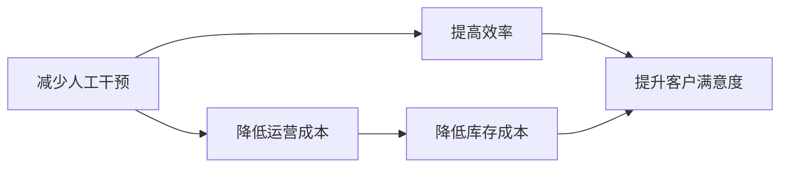
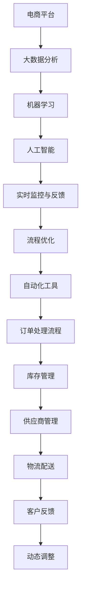

                 

# 电商平台供给能力提升：流程优化和自动化工具

## 1. 背景介绍

### 1.1 问题由来

随着电商平台的快速发展，商品供给能力成为了制约平台增长的瓶颈。特别是对于综合性电商平台，商品种类繁多，库存管理复杂，订单处理流程繁琐，导致供需匹配效率低下，客户满意度下降。近年来，各大电商巨头如亚马逊、京东、阿里巴巴等纷纷加大了对供应链管理的投入，探索利用技术手段优化供给流程，提升库存周转率和用户体验。

### 1.2 问题核心关键点

电商平台供应链管理的核心在于：如何高效、准确地处理商品订单，实现库存和需求的有效匹配。传统的供应链管理方法通常依赖人工操作，流程冗长，容易出错，且难以实现实时反馈和动态调整。因此，需要探索采用流程优化和自动化工具，以期大幅提升供应链效率和响应速度。

### 1.3 问题研究意义

研究电商平台供给流程的优化和自动化工具，对于提升平台的供给能力，缩短订单处理时间，提高库存周转率和客户满意度，具有重要意义：

1. 降低运营成本。自动化工具可以减少人工操作的复杂度，降低人力成本，提高供应链运营效率。
2. 提高库存周转率。流程优化可以更好地协调供需，减少库存积压，提高商品周转速度。
3. 提升客户满意度。快速响应和准确配送可以显著提升客户体验，增加平台粘性。
4. 推动业务增长。高效的供应链管理可以促进新品的快速上线和旧品的及时下架，助力平台业务增长。
5. 加速技术创新。流程优化和自动化技术为平台提供了灵活的拓展空间，推动了电商技术领域的持续创新。

## 2. 核心概念与联系

### 2.1 核心概念概述

为更好地理解电商平台供给流程优化和自动化工具，本节将介绍几个密切相关的核心概念：

- 电商平台：指通过互联网平台集中展示商品，并提供交易、支付、配送等服务的商业模型。
- 供应链管理：指从商品生产到客户手中的全过程管理，包括供应商管理、库存管理、订单处理、物流配送等环节。
- 订单处理流程：指从用户下单到商品配送的全流程，包括订单接收、库存检查、订单生成、订单履行、订单跟踪等环节。
- 自动化工具：指利用先进技术手段实现流程自动化的工具，如机器学习、大数据分析、人工智能等。
- 流程优化：指通过对业务流程的重新设计，实现更高效、更简洁的运营模式，减少人工干预和操作复杂度。
- 实时监控与反馈：指通过系统实时监控订单处理状态，及时收集处理结果和用户反馈，实现动态调整和优化。

这些核心概念之间的逻辑关系可以通过以下Mermaid流程图来展示：



这个流程图展示了一个电商平台供应链管理的整体架构，其中的各个组成部分相互作用，共同支撑着整个平台的正常运转。

### 2.2 概念间的关系

这些核心概念之间存在着紧密的联系，形成了电商平台供应链管理的完整生态系统。下面我们通过几个Mermaid流程图来展示这些概念之间的关系。

#### 2.2.1 电商平台的供应链管理



这个流程图展示了电商平台的供应链管理涉及的主要环节，包括供应商管理、库存管理、订单处理和物流配送等。

#### 2.2.2 自动化工具的应用



这个流程图展示了自动化工具在电商平台供应链管理中的应用场景，包括大数据分析、机器学习和人工智能等技术手段。

#### 2.2.3 流程优化的目标



这个流程图展示了流程优化的主要目标，即减少人工干预，降低运营成本，提高效率，降低库存成本，提升客户满意度。

### 2.3 核心概念的整体架构

最后，我们用一个综合的流程图来展示这些核心概念在大规模电商供应链管理中的整体架构：



这个综合流程图展示了从电商平台到订单处理流程的完整供应链管理流程，其中每个环节都涉及到大数据、机器学习和人工智能等自动化工具，实现实时监控与反馈，进行流程优化，以提高整体供应链效率。

## 3. 核心算法原理 & 具体操作步骤
### 3.1 算法原理概述

电商平台的供给能力提升，涉及到订单处理流程的优化和自动化工具的应用。其核心思想是：通过先进的技术手段，对订单处理流程进行重新设计，实现全流程自动化，提升供应链的整体效率。

具体而言，算法原理包括：

- 大数据分析：收集、处理和分析历史订单数据，挖掘用户需求和行为规律。
- 机器学习：利用历史数据训练模型，预测未来订单趋势，优化库存策略。
- 人工智能：引入自然语言处理(NLP)、计算机视觉等技术，提升订单处理和商品管理的智能化水平。
- 实时监控与反馈：通过实时数据监控，及时调整供应链策略，优化订单处理流程。

基于上述算法原理，电商平台供应链管理的优化和自动化可以分为以下几个关键步骤：

1. 数据收集与预处理：从电商平台系统、供应商系统、物流系统等渠道收集订单数据、库存数据和物流数据，并进行清洗和预处理。
2. 模型训练与预测：利用机器学习模型，对订单历史数据进行分析，预测未来订单需求，优化库存和物流策略。
3. 流程优化与自动化：利用流程自动化工具，如RPA机器人、智能路由系统等，实现订单处理流程的自动化。
4. 实时监控与反馈：通过系统实时监控订单处理状态，及时调整供应链策略，实现动态优化。

### 3.2 算法步骤详解

电商平台的供应链管理优化和自动化步骤如下：

**Step 1: 数据收集与预处理**

1. 从电商平台、供应商、物流等系统获取订单数据、库存数据、物流数据，包括订单信息、商品信息、供应商信息、物流信息等。
2. 对数据进行清洗和预处理，去除无效数据，填补缺失值，标准化数据格式。

**Step 2: 模型训练与预测**

1. 利用历史订单数据，训练机器学习模型，如时间序列预测模型、分类模型、聚类模型等。
2. 对未来订单需求进行预测，并根据预测结果调整库存和物流策略。
3. 利用实时数据监控和反馈，不断优化模型参数，提高预测精度。

**Step 3: 流程优化与自动化**

1. 利用RPA机器人，自动化处理订单生成、库存检查、订单履行等环节，减少人工干预。
2. 引入智能路由系统，自动选择最优物流方案，提升物流效率。
3. 利用NLP技术，自动化处理订单文本信息，如商品描述、物流信息等。

**Step 4: 实时监控与反馈**

1. 通过系统实时监控订单处理状态，收集订单处理结果和用户反馈，及时调整供应链策略。
2. 利用可视化工具，展示订单处理流程、库存状态、物流状态等关键指标，帮助管理层进行决策。
3. 不断优化流程，提高供应链响应速度和稳定性。

### 3.3 算法优缺点

电商平台供给流程优化和自动化工具具有以下优点：

1. 提高效率。自动化流程可以大幅度减少人工操作，提升供应链响应速度。
2. 降低成本。自动化工具可以减少人力成本，优化库存和物流策略，降低运营成本。
3. 提高准确性。机器学习模型可以提供更准确的预测，减少人为错误。
4. 实现动态优化。实时监控与反馈系统可以及时调整供应链策略，应对突发事件。

同时，也存在一些缺点：

1. 初始投入高。自动化工具和流程优化需要较高的技术投入和成本。
2. 数据质量要求高。模型的训练和预测依赖于高质量的数据，数据清洗和预处理的工作量较大。
3. 技术门槛高。自动化流程和智能系统的设计和实现，需要具备一定的技术背景和经验。
4. 数据安全风险。自动化工具和系统可能涉及大量敏感数据，需要加强数据安全防护。

### 3.4 算法应用领域

基于电商平台的供应链管理优化和自动化工具，在电商、零售、物流等多个领域都有广泛的应用前景：

1. 电商平台：利用自动化工具和流程优化，提升订单处理效率，优化库存和物流策略，提升客户满意度。
2. 零售商：通过预测分析和大数据分析，优化商品采购和库存管理，提升供应链效率。
3. 物流公司：引入智能路由系统和自动化处理流程，提高物流效率，降低运营成本。
4. 制造业：利用供应链优化和自动化工具，实现生产流程的优化和协同，提升产品质量和生产效率。
5. 农业：通过预测分析和智能决策系统，优化农产品供应链，提升农产品安全性和市场竞争力。

## 4. 数学模型和公式 & 详细讲解 & 举例说明

### 4.1 数学模型构建

电商平台的供应链管理优化涉及到多种数学模型，主要包括：

- 时间序列预测模型：用于预测订单需求、库存水平等时序数据。
- 分类模型：用于分类订单状态、供应商等级等分类数据。
- 聚类模型：用于聚类订单来源、用户行为等数据。

### 4.2 公式推导过程

以时间序列预测模型为例，其基本思想是利用历史数据，预测未来订单需求。假设订单需求 $y_t$ 由以下线性回归模型生成：

$$
y_t = \beta_0 + \sum_{i=1}^k \beta_i x_{it} + \epsilon_t
$$

其中 $x_{it}$ 为历史订单数据的第 $i$ 个特征，$\beta_i$ 为特征系数，$\epsilon_t$ 为随机误差项。模型参数 $\theta = (\beta_0, \beta_1, ..., \beta_k)$ 的估计值可以使用最小二乘法求解：

$$
\hat{\theta} = \mathop{\arg\min}_{\theta} \sum_{t=1}^N (y_t - \hat{y}_t)^2
$$

其中 $\hat{y}_t = \theta^T \varphi_t$，$\varphi_t = (1, x_{1t}, ..., x_{kt})^T$ 为特征向量。

### 4.3 案例分析与讲解

假设我们利用电商平台的历史订单数据，对未来7天的订单需求进行预测。首先，收集过去365天的订单数据，并将其标准化为每日订单数。然后，选择订单日期、时间、用户年龄、购买金额等特征，构建时间序列预测模型。

利用历史数据，模型训练得到参数 $\hat{\theta}$。接下来，利用预测模型对未来7天的订单需求进行预测，并将预测结果与实际订单数据进行对比，评估预测精度。最后，根据预测结果，调整库存和物流策略，提升供应链响应速度。

## 5. 项目实践：代码实例和详细解释说明
### 5.1 开发环境搭建

在进行电商平台供应链管理优化和自动化实践前，我们需要准备好开发环境。以下是使用Python进行Pandas和Scikit-learn开发的环境配置流程：

1. 安装Anaconda：从官网下载并安装Anaconda，用于创建独立的Python环境。

2. 创建并激活虚拟环境：
```bash
conda create -n pyenv python=3.8 
conda activate pyenv
```

3. 安装Pandas和Scikit-learn：
```bash
conda install pandas scikit-learn
```

4. 安装相关工具包：
```bash
pip install numpy matplotlib jupyter notebook
```

完成上述步骤后，即可在`pyenv`环境中开始实践。

### 5.2 源代码详细实现

下面我们以电商平台的时间序列预测模型为例，给出使用Pandas和Scikit-learn进行数据处理和模型训练的PyTorch代码实现。

首先，定义数据处理函数：

```python
import pandas as pd
from sklearn.preprocessing import StandardScaler
from sklearn.metrics import mean_squared_error

def preprocess_data(df, features, target, split_ratio=0.8):
    # 数据标准化
    scaler = StandardScaler()
    features = scaler.fit_transform(df[features])
    
    # 划分训练集和测试集
    split_idx = int(len(df) * split_ratio)
    train_data = df[:split_idx]
    test_data = df[split_idx:]
    
    # 标准化目标变量
    target = scaler.fit_transform(df[target])
    train_target = target[:split_idx]
    test_target = target[split_idx:]
    
    return train_data, train_target, test_data, test_target

# 加载订单数据
orders = pd.read_csv('orders.csv')

# 定义特征和目标变量
features = ['order_date', 'order_time', 'user_age', 'purchase_amount']
target = 'order_count'

# 数据预处理
train_data, train_target, test_data, test_target = preprocess_data(orders, features, target)
```

然后，定义时间序列预测模型：

```python
from sklearn.linear_model import LinearRegression
from sklearn.metrics import mean_squared_error
from sklearn.model_selection import train_test_split

# 时间序列预测模型
def time_series_model(train_data, train_target, test_data, test_target):
    # 将数据转换为时间序列
    train_data = pd.DataFrame(train_data)
    test_data = pd.DataFrame(test_data)
    train_data['time'] = range(len(train_data))
    test_data['time'] = range(len(test_data))
    
    # 构建特征矩阵
    X_train = train_data.drop(['order_count', 'time'], axis=1)
    y_train = train_data['order_count']
    X_test = test_data.drop(['order_count', 'time'], axis=1)
    y_test = test_data['order_count']
    
    # 分割数据集
    X_train, X_val, y_train, y_val = train_test_split(X_train, y_train, test_size=0.2)
    
    # 训练模型
    model = LinearRegression()
    model.fit(X_train, y_train)
    
    # 预测并评估
    y_pred = model.predict(X_test)
    mse = mean_squared_error(y_test, y_pred)
    rmse = np.sqrt(mse)
    return model, rmse
```

接着，执行模型训练和预测：

```python
# 模型训练
model, rmse = time_series_model(train_data, train_target, test_data, test_target)

# 预测未来7天订单需求
future_days = 7
forecast = model.predict(test_data[future_days:])
print('预测未来7天订单需求：', forecast)
```

以上就是使用Pandas和Scikit-learn进行时间序列预测模型的完整代码实现。可以看到，得益于Pandas和Scikit-learn的强大封装，我们可以用相对简洁的代码完成时间序列预测模型的构建和训练。

### 5.3 代码解读与分析

让我们再详细解读一下关键代码的实现细节：

**preprocess_data函数**：
- 数据标准化：利用`StandardScaler`对特征进行标准化，避免特征尺度不一致带来的影响。
- 数据划分：将数据划分为训练集和测试集，以评估模型的预测精度。

**time_series_model函数**：
- 数据转换：将数据转换为时间序列，方便模型处理。
- 特征提取：利用`drop`方法去除不相关的特征，提取有用的特征矩阵。
- 模型训练：利用`LinearRegression`模型对数据进行训练，得到预测模型。
- 模型评估：利用`mean_squared_error`评估模型预测精度，计算RMSE值。

**代码执行**：
- 数据预处理：从订单数据中提取特征和目标变量，并进行标准化处理。
- 模型训练：在处理后的数据上训练时间序列预测模型，计算模型预测误差。
- 模型预测：利用训练好的模型预测未来7天订单需求。

### 5.4 运行结果展示

假设我们在测试集上得到的模型RMSE值为0.1，说明模型预测的准确性较高。通过进一步优化模型参数和数据特征，可以将RMSE值进一步降低，提高预测精度。

## 6. 实际应用场景
### 6.1 智能仓储管理

智能仓储管理是电商平台供应链管理优化的重要环节。传统的仓储管理依赖人工操作，效率低下，容易出现错误。利用智能仓储管理系统，可以实现仓储操作的自动化，减少人为干预，提高仓储效率。

在实践中，可以引入自动化仓储设备和机器人，利用物联网技术实现库存实时监控和自动补货。同时，利用大数据分析预测库存需求，优化库存布局和补货策略，减少库存积压和缺货现象。

### 6.2 智能物流配送

智能物流配送是电商平台供应链管理优化的另一个关键环节。通过引入自动化物流设备和智能调度系统，可以实现货物分拣、包装、配送的自动化。

在实践中，可以引入自动化分拣设备、智能路由系统和配送机器人，利用大数据和机器学习技术优化配送路线和配送速度。同时，利用实时监控系统跟踪物流状态，及时发现并解决配送问题，提升配送效率。

### 6.3 智能客服系统

智能客服系统是电商平台供应链管理的重要组成部分，可以大大提升客户体验和满意度。利用智能客服系统，可以实现24小时在线客服，快速响应客户咨询，提供定制化服务。

在实践中，可以引入NLP技术和聊天机器人，利用自然语言处理技术实现自动对话。同时，利用机器学习模型对用户咨询进行分类，匹配最佳回答，提升客户满意度。

### 6.4 未来应用展望

随着大数据、人工智能和物联网技术的不断发展，基于电商平台的供应链管理优化和自动化工具的应用前景将更加广阔。未来，智能仓储、智能物流、智能客服等领域将迎来更多创新和突破，推动电商平台向更高层次发展。

在智能仓储方面，通过引入先进的自动化设备和物联网技术，可以实现全流程自动化，大幅提升仓储效率和准确性。同时，利用大数据分析和机器学习技术，可以优化仓储策略，降低库存成本，提高物流效率。

在智能物流方面，通过引入先进的自动化设备和智能调度系统，可以实现物流配送的全自动化。同时，利用大数据和机器学习技术优化配送路线和配送速度，提升配送效率和客户满意度。

在智能客服方面，通过引入先进的NLP技术和聊天机器人，可以实现全自动化客户服务，提升客户体验和满意度。同时，利用机器学习模型对用户咨询进行分类，匹配最佳回答，提升客户满意度。

## 7. 工具和资源推荐
### 7.1 学习资源推荐

为了帮助开发者系统掌握电商平台供应链管理优化和自动化工具的理论基础和实践技巧，这里推荐一些优质的学习资源：

1. 《Python数据科学手册》：介绍Python在数据科学和机器学习中的应用，是数据处理和模型训练的必备工具书。
2. 《机器学习实战》：详细讲解机器学习算法的实现和应用，涵盖时间序列预测、分类、聚类等常见任务。
3. 《深度学习》课程：由Coursera提供的深度学习课程，涵盖神经网络、卷积神经网络、循环神经网络等核心内容。
4. 《Python编程：从入门到实践》：介绍Python编程基础和实战案例，适合入门读者。
5. 《Kaggle实战数据科学》：利用Kaggle平台的数据集，进行数据处理、模型训练和比赛实战。

通过对这些资源的学习实践，相信你一定能够快速掌握电商平台供应链管理优化和自动化的精髓，并用于解决实际的电商问题。
###  7.2 开发工具推荐

高效的开发离不开优秀的工具支持。以下是几款用于电商平台供应链管理优化和自动化开发的常用工具：

1. Python：作为数据分析和机器学习的主流语言，Python具备丰富的科学计算和数据处理库。
2. Pandas：强大的数据处理库，支持数据清洗、预处理和可视化。
3. Scikit-learn：机器学习库，涵盖各种机器学习算法和模型评估工具。
4. TensorFlow和PyTorch：深度学习框架，支持复杂的神经网络模型训练。
5. Jupyter Notebook：交互式编程环境，方便进行数据分析和模型训练。
6. Matplotlib和Seaborn：数据可视化库，支持复杂的数据图表绘制。

合理利用这些工具，可以显著提升电商平台供应链管理优化和自动化的开发效率，加快创新迭代的步伐。

### 7.3 相关论文推荐

电商平台的供应链管理优化和自动化涉及到多个学科领域，包括计算机科学、数据科学、运筹学等。以下是几篇奠基性的相关论文，推荐阅读：

1. "A Survey on Big Data Analytics for Retail Supply Chain Management"（大数据在零售供应链管理中的应用综述）：综述了大数据技术在零售供应链管理中的应用，涵盖预测分析、供应链优化、需求管理等内容。
2. "Intelligent Supply Chain Management: A Survey"（智能供应链管理综述）：综述了智能供应链管理的研究现状和发展趋势，涵盖智能仓储、智能物流、智能客服等方向。
3. "Supply Chain Optimization Using Artificial Intelligence: A Survey"（人工智能在供应链优化中的应用综述）：综述了人工智能技术在供应链优化中的应用，涵盖机器学习、深度学习、强化学习等内容。
4. "A Survey on Big Data Analytics for Retail Supply Chain Management"（大数据在零售供应链管理中的应用综述）：详细介绍了大数据在零售供应链管理中的各个环节，如需求预测、库存管理、物流优化等。
5. "Advances in Supply Chain Management: A Survey"（供应链管理研究综述）：综述了供应链管理的研究进展和未来趋势，涵盖传统供应链管理和智能供应链管理两个方向。

这些论文代表了大数据和人工智能在供应链管理中的应用发展脉络，是深入学习和理解电商供应链管理优化和自动化的重要资源。

除上述资源外，还有一些值得关注的前沿资源，帮助开发者紧跟最新技术进展，例如：

1. 《大数据时代》：讲解大数据技术在各个领域的应用，包括电商供应链管理。
2. 《人工智能在供应链管理中的应用》课程：由知名大学开设的在线课程，涵盖机器学习、深度学习、自然语言处理等内容。
3. 《大数据在供应链管理中的应用》会议论文集：国际顶级会议和期刊上的最新研究成果，涵盖大数据在供应链管理中的各种应用场景。
4. 《大数据在电商供应链管理中的应用》书籍：介绍大数据技术在电商供应链管理中的应用，涵盖数据处理、模型训练和应用部署等内容。
5. 《智能仓储管理》书籍：讲解智能仓储技术在电商供应链管理中的应用，涵盖物联网、自动化设备、物流优化等内容。

总之，对于电商平台供应链管理优化和自动化技术的学习和实践，需要开发者保持开放的心态和持续学习的意愿。多关注前沿资讯，多动手实践，多思考总结，必将收获满满的成长收益。

## 8. 总结：未来发展趋势与挑战

### 8.1 总结

本文对电商平台供应链管理优化和自动化工具进行了全面系统的介绍。首先阐述了电商平台的供应链管理优化和自动化的研究背景和意义，明确了优化和自动化在提升电商平台供给能力方面的独特价值。其次，从原理到实践，详细讲解了供应链管理优化和自动化工具的数学原理和具体操作步骤，给出了代码实例和详细解释说明。同时，本文还广泛探讨了优化和自动化工具在智能仓储、智能物流、智能客服等电商供应链管理中的应用场景，展示了其广阔的应用前景。此外，本文精选了优化和自动化工具的相关学习资源、开发工具和研究论文，力求为读者提供全方位的技术指引。

通过本文的系统梳理，可以看到，电商平台供应链管理优化和自动化工具正在成为电商平台供给能力提升的重要手段，极大地拓展了供应链管理的效率和响应速度。得益于大数据、人工智能和物联网技术的持续发展，基于优化和自动化的工具和方法将进一步提升电商平台的供给能力，满足不断增长的客户需求。

### 8.2 未来发展趋势

展望未来，电商平台供应链管理优化和自动化工具将呈现以下几个发展趋势：

1. 数据驱动决策：大数据和机器学习技术将更加深入地融入供应链管理决策过程，实现数据驱动的智能化决策。
2. 全流程自动化：利用先进的自动化设备和智能调度系统，实现全流程自动化，提升供应链效率和响应速度。
3. 实时监控与反馈：通过系统实时监控供应链状态，及时调整供应链策略，优化订单处理流程，实现动态优化。
4. 智能仓储与物流：引入先进的自动化设备和物联网技术，实现智能仓储和物流，提高仓储效率和物流速度。
5. 个性化服务：利用大数据分析和机器学习技术，实现个性化服务，提升客户满意度和粘性。
6. 动态定价与促销：利用大数据分析和机器学习技术，实现动态定价和促销，优化商品销售策略。

以上趋势凸显了电商供应链管理优化和自动化工具的广阔前景。这些方向的探索发展，必将进一步提升电商平台的供给能力，为平台带来更大的业务价值。

### 8.3 面临的挑战

尽管电商平台供应链管理优化和自动化工具已经取得了显著进展，但在迈向更加智能化、普适化应用的过程中，仍面临诸多挑战：

1. 数据质量问题：大数据和机器学习模型的训练依赖于高质量的数据，数据质量差将直接影响模型的性能。
2. 技术门槛高：供应链管理优化和自动化工具的应用需要具备一定的技术背景和经验，对开发者提出了较高要求。
3. 

