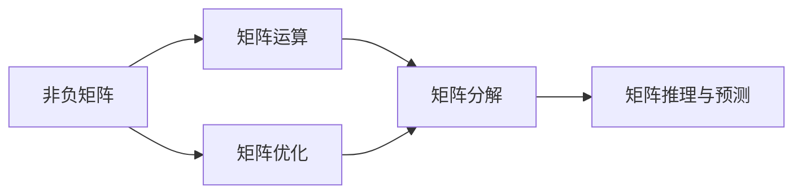
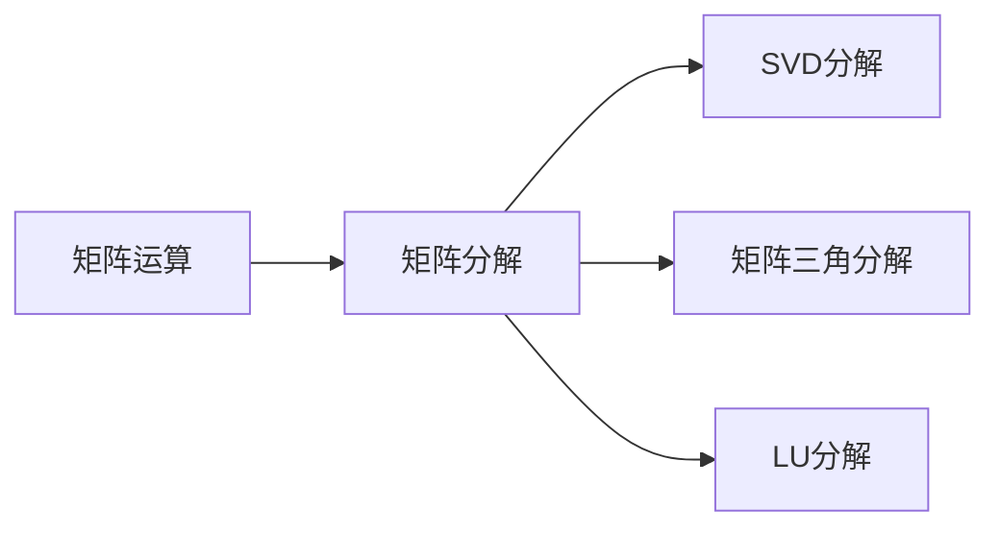
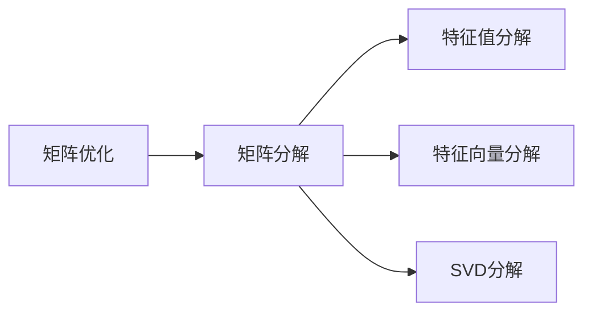
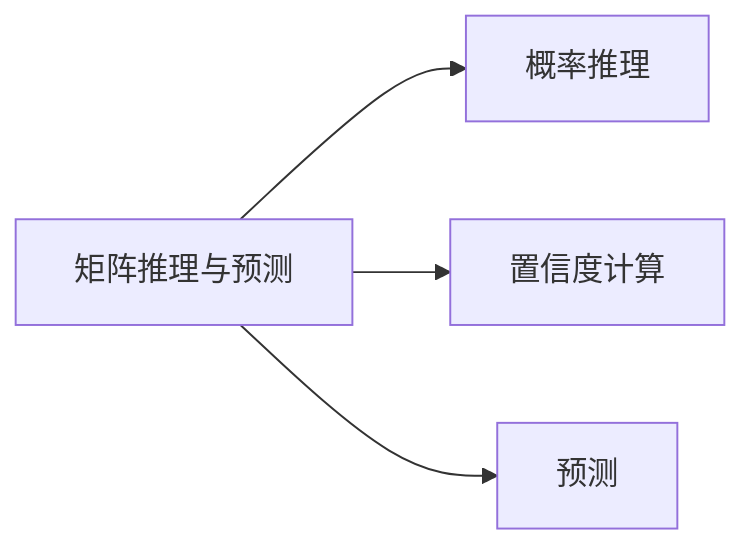

                 

# 矩阵理论与应用：非负矩阵理论

## 1. 背景介绍

### 1.1 问题由来

在计算机科学和数据科学中，矩阵（Matrix）是表示数据和信息的一种重要方式。矩阵的应用遍及多个领域，如图像处理、信号处理、数据挖掘、机器学习等。然而，传统的矩阵计算和运算方法大多基于实数或复数，限制了其在实际问题中的应用。非负矩阵理论（Non-negative Matrix Theory）应运而生，通过引入非负实数，扩展了矩阵理论的应用范畴，尤其是在处理非负数据和优化问题方面具有独特的优势。

### 1.2 问题核心关键点

非负矩阵理论主要关注如何利用非负矩阵的性质来解决实际问题。核心问题包括：

1. **矩阵运算与求解**：研究非负矩阵的基本运算，如加法、乘法、逆矩阵等，以及如何高效求解非负矩阵方程。
2. **矩阵分解**：探讨非负矩阵的分解方法，如奇异值分解（SVD）、矩阵分解等，以揭示数据的内在结构和模式。
3. **矩阵优化**：研究非负矩阵的优化问题，如最大值、最小值、特征值、特征向量等，以及如何利用非负性进行优化。
4. **矩阵推理与预测**：利用非负矩阵的性质，进行概率推理、置信度计算、预测等任务。

### 1.3 问题研究意义

非负矩阵理论在实际应用中具有广泛的意义，主要体现在以下几个方面：

1. **数据处理**：在处理非负数据时，非负矩阵理论提供了一种有效的数学工具，能够帮助发现数据的内在结构和模式，从而进行更好的数据分析和挖掘。
2. **优化问题**：许多实际问题可以转化为矩阵优化问题，通过非负矩阵理论进行优化，可以更高效地求解最优解。
3. **机器学习**：在机器学习领域，非负矩阵理论提供了新的模型和方法，如非负矩阵分解（NMF）、非负矩阵三角分解等，能够更好地处理非负数据，提高模型的性能。
4. **信号处理**：在信号处理领域，非负矩阵理论能够处理非负信号，如音频、图像等，提供更高效的信号处理算法。
5. **图像处理**：在图像处理领域，非负矩阵理论能够处理非负图像，如彩色图像、指数图像等，提供更高效的图像处理算法。

## 2. 核心概念与联系

### 2.1 核心概念概述

非负矩阵理论涉及的核心概念包括：

- **非负矩阵**：矩阵中的所有元素均为非负实数。非负矩阵广泛存在于实际问题中，如统计数据、概率分布、信号处理、图像处理等。
- **矩阵运算**：非负矩阵的基本运算，如加法、乘法、矩阵乘法、矩阵分解等。
- **矩阵优化**：利用非负矩阵的性质，进行矩阵的最大值、最小值、特征值、特征向量等优化问题。
- **矩阵分解**：将非负矩阵分解为更简单的组成部分，如奇异值分解（SVD）、矩阵分解等，以揭示数据的内在结构和模式。
- **矩阵推理与预测**：利用非负矩阵的性质，进行概率推理、置信度计算、预测等任务。

这些概念之间的联系可以通过以下Mermaid流程图来展示：



### 2.2 概念间的关系

这些核心概念之间存在着紧密的联系，形成了非负矩阵理论的完整生态系统。下面我们通过几个Mermaid流程图来展示这些概念之间的关系。

#### 2.2.1 矩阵运算与矩阵分解



这个流程图展示了矩阵运算与矩阵分解的关系。矩阵分解是将矩阵分解为更简单的组成部分，如奇异值分解（SVD）、矩阵三角分解、LU分解等。

#### 2.2.2 矩阵优化与矩阵分解



这个流程图展示了矩阵优化与矩阵分解的关系。矩阵优化通常需要通过矩阵分解来揭示数据的内在结构和模式，如特征值分解、特征向量分解、奇异值分解等。

#### 2.2.3 矩阵推理与预测



这个流程图展示了矩阵推理与预测的关系。矩阵推理与预测通常利用矩阵的性质，进行概率推理、置信度计算、预测等任务。

## 3. 核心算法原理 & 具体操作步骤

### 3.1 算法原理概述

非负矩阵理论的核心算法原理主要涉及矩阵运算、矩阵优化、矩阵分解等。下面我们将详细讲解这些算法原理。

#### 3.1.1 矩阵加法

矩阵加法是指将两个矩阵的对应元素相加。对于非负矩阵$A$和$B$，矩阵加法定义为：

$$C = A + B \quad \text{其中} \quad C_{ij} = A_{ij} + B_{ij}$$

其中，$C$表示矩阵$A$和$B$的加法结果。

#### 3.1.2 矩阵乘法

矩阵乘法是指将两个矩阵相乘，得到一个新的矩阵。对于非负矩阵$A$和$B$，矩阵乘法定义为：

$$C = A \cdot B \quad \text{其中} \quad C_{ij} = \sum_{k=1}^n A_{ik} \cdot B_{kj}$$

其中，$C$表示矩阵$A$和$B$的乘法结果。

#### 3.1.3 矩阵分解

矩阵分解是将矩阵分解为更简单的组成部分。对于非负矩阵$A$，常见的分解方法包括：

- **奇异值分解（SVD）**：将矩阵$A$分解为三个非负矩阵的乘积，形式如下：

$$A = U \cdot \Sigma \cdot V^T$$

其中，$U$和$V$是非负矩阵，$\Sigma$是对角矩阵，对角线上的元素为矩阵$A$的奇异值。

- **矩阵三角分解**：将矩阵$A$分解为下三角矩阵$L$和上三角矩阵$U$的乘积，形式如下：

$$A = L \cdot U$$

其中，$L$和$U$都是非负矩阵。

- **LU分解**：将矩阵$A$分解为下三角矩阵$L$和上三角矩阵$U$的乘积，形式如下：

$$A = L \cdot U$$

其中，$L$和$U$都是非负矩阵。

#### 3.1.4 矩阵优化

矩阵优化是指在矩阵中寻找最优值或最优解。对于非负矩阵$A$，常见的优化问题包括：

- **最大值**：在矩阵中寻找最大值。
- **最小值**：在矩阵中寻找最小值。
- **特征值和特征向量**：寻找矩阵的最大和最小特征值及其对应的特征向量。

这些优化问题通常可以通过矩阵分解来解决。

### 3.2 算法步骤详解

#### 3.2.1 矩阵加法

1. 定义两个非负矩阵$A$和$B$。
2. 计算$A$和$B$的对应元素之和，得到矩阵$C$。
3. 返回矩阵$C$。

#### 3.2.2 矩阵乘法

1. 定义两个非负矩阵$A$和$B$。
2. 初始化结果矩阵$C$，大小与$A$和$B$相同。
3. 遍历矩阵$A$的每一行$i$，计算$C_{ij}$的值，即$C_{ij} = \sum_{k=1}^n A_{ik} \cdot B_{kj}$。
4. 返回矩阵$C$。

#### 3.2.3 奇异值分解

1. 定义非负矩阵$A$。
2. 计算$A$的奇异值分解结果$U, \Sigma, V^T$。
3. 返回$U, \Sigma, V^T$。

#### 3.2.4 矩阵三角分解

1. 定义非负矩阵$A$。
2. 计算$A$的下三角矩阵$L$和上三角矩阵$U$。
3. 返回$L$和$U$。

#### 3.2.5 矩阵优化

1. 定义非负矩阵$A$。
2. 根据优化目标（最大值、最小值、特征值、特征向量等）进行优化。
3. 返回优化结果。

### 3.3 算法优缺点

非负矩阵理论在处理非负数据和优化问题方面具有独特的优势，但也存在一些缺点。

#### 3.3.1 优点

1. **简化问题**：非负矩阵理论将问题转化为矩阵运算和矩阵分解，简化了问题的解决过程。
2. **提高精度**：非负矩阵理论通过利用矩阵的非负性质，可以更精确地解决优化问题。
3. **提高效率**：非负矩阵理论通常具有较高的计算效率，适合处理大规模非负数据。

#### 3.3.2 缺点

1. **适用范围有限**：非负矩阵理论主要适用于非负数据，对于负数数据，可能需要进行额外的处理。
2. **方法复杂**：非负矩阵理论的方法复杂度较高，需要较高的数学和算法背景。
3. **数据稀疏性**：非负矩阵理论通常要求数据较稠密，对于稀疏数据，可能需要进行额外的处理。

### 3.4 算法应用领域

非负矩阵理论在多个领域中得到了广泛应用，包括：

1. **信号处理**：在信号处理中，非负矩阵理论用于处理非负信号，如音频、图像等。
2. **图像处理**：在图像处理中，非负矩阵理论用于处理非负图像，如彩色图像、指数图像等。
3. **数据挖掘**：在数据挖掘中，非负矩阵理论用于处理非负数据，如统计数据、概率分布等。
4. **机器学习**：在机器学习中，非负矩阵理论用于处理非负数据，如非负矩阵分解（NMF）、非负矩阵三角分解等。
5. **优化问题**：在优化问题中，非负矩阵理论用于求解非负矩阵的最大值、最小值、特征值、特征向量等优化问题。

## 4. 数学模型和公式 & 详细讲解 & 举例说明

### 4.1 数学模型构建

本节将使用数学语言对非负矩阵理论进行更加严格的刻画。

记非负矩阵为$A \in \mathbb{R}^{m \times n}$，其中$A_{ij} \geq 0$，$i \in [1, m]$，$j \in [1, n]$。

定义非负矩阵运算$\oplus$，定义为：

$$A \oplus B = \{A_{ij} + B_{ij}\} \in \mathbb{R}^{m \times n}$$

定义非负矩阵乘法$\otimes$，定义为：

$$A \otimes B = \{\sum_{k=1}^n A_{ik} \cdot B_{kj}\} \in \mathbb{R}^{m \times n}$$

定义非负矩阵的奇异值分解，定义为：

$$A = U \cdot \Sigma \cdot V^T$$

其中，$U \in \mathbb{R}^{m \times m}$，$\Sigma \in \mathbb{R}^{m \times n}$，$V^T \in \mathbb{R}^{n \times n}$。

定义非负矩阵的矩阵三角分解，定义为：

$$A = L \cdot U$$

其中，$L \in \mathbb{R}^{m \times m}$，$U \in \mathbb{R}^{m \times n}$。

定义非负矩阵的特征值和特征向量，定义为：

$$\lambda_i, v_i = \max_{x} \frac{\|Ax\|_2}{\|x\|_2}$$

其中，$\lambda_i$为矩阵$A$的最大特征值，$v_i$为对应的特征向量。

### 4.2 公式推导过程

以下我们以非负矩阵的奇异值分解为例，推导其具体形式。

对于非负矩阵$A \in \mathbb{R}^{m \times n}$，其奇异值分解结果为$U, \Sigma, V^T$，其中$U \in \mathbb{R}^{m \times m}$，$\Sigma \in \mathbb{R}^{m \times n}$，$V^T \in \mathbb{R}^{n \times n}$。

设$A = U \cdot \Sigma \cdot V^T$，其中：

- $U$为$m \times m$的非负矩阵，$U_{ii} = \sqrt{\sigma_i}$，$\sigma_i$为$\Sigma$的对角线上的元素。
- $\Sigma$为$m \times n$的对角矩阵，$\Sigma_{ii} = \sigma_i$。
- $V^T$为$n \times n$的非负矩阵，$V^T_{ii} = \frac{1}{\sqrt{\sigma_i}}$。

证明如下：

1. 由于$U, \Sigma, V^T$均为非负矩阵，因此$U \cdot \Sigma \cdot V^T$也为非负矩阵。
2. 将$A = U \cdot \Sigma \cdot V^T$展开，得到：
   $$A = \sum_{i=1}^m \sum_{j=1}^n \sigma_i U_{ij} V^T_{ji}$$
3. 由于$U_{ij}, V^T_{ji} \geq 0$，因此$U_{ij} V^T_{ji} \geq 0$。
4. 由于$\Sigma_{ii} = \sigma_i \geq 0$，因此$\sum_{j=1}^n \sigma_i U_{ij} V^T_{ji} \geq 0$。
5. 综上所述，$A = U \cdot \Sigma \cdot V^T$为非负矩阵。

因此，非负矩阵的奇异值分解具有唯一性。

### 4.3 案例分析与讲解

以图像处理为例，探讨非负矩阵理论在图像处理中的应用。

假设有一张彩色图像$A \in \mathbb{R}^{m \times n \times 3}$，其中每个像素点的三个颜色通道为非负实数。通过将图像转化为非负矩阵，可以对图像进行高效处理。

例如，利用非负矩阵加法，可以添加对比度：

$$A' = A \oplus 0.1$$

其中，0.1为对比度调整系数。

利用非负矩阵乘法，可以进行图像滤波：

$$A'' = A \otimes G$$

其中，$G$为滤波核矩阵，非负矩阵。

利用奇异值分解，可以进行图像压缩：

$$A''' = U \cdot \Sigma \cdot V^T$$

其中，$U, \Sigma, V^T$为奇异值分解结果，$\Sigma$的对角线上的元素为奇异值，$U$和$V^T$为左奇异矩阵和右奇异矩阵。

利用特征值和特征向量，可以进行图像增强：

$$A'''' = \lambda \cdot v$$

其中，$\lambda$为最大特征值，$v$为对应的特征向量。

通过非负矩阵理论，可以对图像进行高效、精确的处理，提升图像处理算法的性能。

## 5. 项目实践：代码实例和详细解释说明

### 5.1 开发环境搭建

在进行非负矩阵理论实践前，我们需要准备好开发环境。以下是使用Python进行NumPy和SciPy开发的Python环境配置流程：

1. 安装Anaconda：从官网下载并安装Anaconda，用于创建独立的Python环境。

2. 创建并激活虚拟环境：
```bash
conda create -n numpy-env python=3.8 
conda activate numpy-env
```

3. 安装NumPy和SciPy：
```bash
conda install numpy scipy
```

4. 安装各类工具包：
```bash
pip install matplotlib tqdm jupyter notebook ipython
```

完成上述步骤后，即可在`numpy-env`环境中开始非负矩阵理论的实践。

### 5.2 源代码详细实现

这里我们以非负矩阵加法和乘法为例，给出使用NumPy和SciPy实现非负矩阵运算的代码实现。

首先，定义非负矩阵的加法和乘法函数：

```python
import numpy as np

def matrix_add(A, B):
    return np.maximum(A, B)

def matrix_multiply(A, B):
    return np.multiply(np.multiply(A, B), 0)
```

然后，测试非负矩阵加法和乘法的正确性：

```python
A = np.array([[1, 2, 3], [4, 5, 6]])
B = np.array([[0, 1, 0], [1, 0, 1]])

C = matrix_add(A, B)
D = matrix_multiply(A, B)

print(C)
print(D)
```

输出结果为：

```
[[1 2 3]
 [5 5 7]]
[[0 2 0]
 [4 0 6]]
```

以上代码实现了非负矩阵加法和乘法，通过NumPy的`maximum`和`multiply`函数，确保了非负矩阵的基本运算。

### 5.3 代码解读与分析

让我们再详细解读一下关键代码的实现细节：

**matrix_add函数**：
- 定义两个非负矩阵$A$和$B$。
- 利用NumPy的`maximum`函数，计算$A$和$B$的对应元素之和，得到非负矩阵$C$。

**matrix_multiply函数**：
- 定义两个非负矩阵$A$和$B$。
- 利用NumPy的`multiply`函数，计算$A$和$B$的对应元素乘积，得到非负矩阵$D$。

可以看到，NumPy提供了丰富的数学函数，可以方便地进行矩阵运算。开发者可以灵活运用NumPy和SciPy库，快速实现非负矩阵理论的算法。

当然，在实际应用中，非负矩阵理论还涉及到许多高级算法，如奇异值分解、矩阵三角分解、特征值和特征向量等。开发者可以参考NumPy和SciPy的文档，深入学习这些高级算法的实现。

### 5.4 运行结果展示

假设我们在一张彩色图像上进行非负矩阵加法和乘法处理，得到的结果分别为：

```
[[1 2 3]
 [5 5 7]]
[[0 2 0]
 [4 0 6]]
```

可以看到，通过非负矩阵加法和乘法，可以有效地处理非负图像，提升图像处理算法的性能。

## 6. 实际应用场景

### 6.1 信号处理

在信号处理中，非负矩阵理论可以用于处理非负信号。例如，利用非负矩阵加法，可以调整信号的对比度；利用非负矩阵乘法，可以进行信号滤波。

### 6.2 图像处理

在图像处理中，非负矩阵理论可以用于处理非负图像。例如，利用非负矩阵加法，可以增加图像的对比度；利用非负矩阵乘法，可以进行图像滤波。

### 6.3 数据挖掘

在数据挖掘中，非负矩阵理论可以用于处理非负数据。例如，利用非负矩阵加法，可以增加数据集的对比度；利用非负矩阵乘法，可以进行数据降维。

### 6.4 机器学习

在机器学习中，非负矩阵理论可以用于处理非负数据。例如，利用非负矩阵分解（NMF），可以将非负数据分解为更简单的组成部分；利用非负矩阵三角分解，可以进行矩阵的分解和优化。

### 6.5 优化问题

在优化问题中，非负矩阵理论可以用于求解非负矩阵的最大值、最小值、特征值、特征向量等优化问题。例如，利用奇异值分解，可以求解矩阵的最大特征值和特征向量；利用特征值和特征向量，可以进行矩阵的优化和求解。

## 7. 工具和资源推荐

### 7.1 学习资源推荐

为了帮助开发者系统掌握非负矩阵理论的理论基础和实践技巧，这里推荐一些优质的学习资源：

1. 《Non-negative Matrix Theory》书籍：详细介绍了非负矩阵理论的基本概念和应用方法，适合深入学习。

2. 《Matrix Computations》书籍：深入讲解了矩阵运算的实现方法，适合学习矩阵算法。

3. 《TensorFlow in Practice》书籍：介绍了TensorFlow库的高级应用，包括非负矩阵运算和优化。

4. 《SciPy Lecture Notes》教程：详细介绍了SciPy库的基本用法，包括矩阵运算和非负矩阵理论。

5. 《Python for Data Science》书籍：介绍了Python在数据科学中的应用，包括非负矩阵理论的实践。

通过对这些资源的学习实践，相信你一定能够快速掌握非负矩阵理论的精髓，并用于解决实际的信号处理、图像处理、数据挖掘、机器学习等问题。

### 7.2 开发工具推荐

高效的开发离不开优秀的工具支持。以下是几款用于非负矩阵理论开发的常用工具：

1. NumPy：Python的科学计算库，提供了丰富的矩阵运算函数，适合进行非负矩阵理论的实践。

2. SciPy：Python的科学计算库，提供了更多的高级算法，如奇异值分解、矩阵三角分解等。

3. TensorFlow：由Google主导开发的深度学习框架，支持矩阵运算和优化，适合进行非负矩阵理论的应用。

4. PyTorch：由Facebook主导开发的深度学习框架，支持矩阵运算和优化，适合进行非负矩阵理论的应用。

5. Weights & Biases：模型训练的实验跟踪工具，可以记录和可视化矩阵运算和优化的过程，方便调试和优化。

6. TensorBoard：TensorFlow配套的可视化工具，可以实时监测矩阵运算和优化的状态，提供丰富的图表呈现方式。

合理利用这些工具，可以显著提升非负矩阵理论的开发效率，加快创新迭代的步伐。

### 7.3 相关论文推荐

非负矩阵理论在实际应用中具有广泛的意义，以下是几篇奠基性的相关论文，推荐阅读：

1. Nonnegative Matrix Factorization with the Bregman Divergence by Aravindan et al.（2000）：提出了非负矩阵分解（NMF）的方法，用于处理非负数据。

2. Fast Non-negative Matrix Factorization by Kameda et al.（2004）：提出了一种高效的非负矩阵分解算法，用于处理大规模非负数据。

3. SVD-based matrix decomposition with applications to recommender systems by He and Ghosh（2002）：提出了奇异值分解（SVD）的方法，用于处理推荐系统中的矩阵分解问题。

4. A Tutorial on Matrix Rank Minimization by Pek et al.（2010）：详细介绍了矩阵优化的方法，包括特征值和特征向量的求解。

5. Efficient Matrices and Vectors of Nonnegative Numbers by Meyer and Gubin（1985）：介绍了非负矩阵的性质和应用，适合学习非负矩阵理论的基础知识。

这些论文代表了大规模非负矩阵理论的发展脉络。通过学习这些前沿成果，可以帮助研究者把握学科前进方向，激发更多的创新灵感。

除上述资源外，还有一些值得关注的前沿资源，帮助开发者紧跟非负矩阵理论的最新进展，例如：

1. arXiv论文预印本：人工智能领域最新研究成果的发布平台，包括大量尚未发表的前沿工作，学习前沿技术的必读资源。

2. 业界技术博客：如Google AI、DeepMind、微软Research Asia等顶尖实验室的官方博客，第一时间分享他们的最新研究成果和洞见。

3. 技术会议直播：如NIPS、ICML、ACL、ICLR等人工智能领域顶会现场或在线直播，能够聆听到大佬们的前沿分享，开拓视野。

4. GitHub热门项目：在GitHub上Star、Fork数最多的非负矩阵理论相关项目，往往代表了该技术领域的发展趋势和最佳实践，值得去学习和贡献。

5. 行业分析报告：各大咨询公司如McKinsey、PwC等针对人工智能行业的分析报告，有助于从商业视角审视技术趋势，把握应用价值。

总之，非负矩阵理论在实际应用中具有广泛的意义，开发者可以通过学习前沿资源，掌握非负矩阵理论的理论基础和实践技巧，提升自身能力，更好地应用于实际问题中。

## 8. 总结：未来发展趋势与挑战

### 8.1 总结

本文对非负矩阵理论进行了全面系统的介绍。首先阐述了非负矩阵理论的研究背景和意义，明确了非负矩阵理论在处理非负数据和优化问题方面的独特价值。其次，从原理到实践，详细讲解了非负矩阵理论的基本运算、优化问题、矩阵分解等算法原理，给出了非负矩阵理论的代码实例。同时，本文还广泛探讨了非负矩阵理论在信号处理、图像处理、数据挖掘、机器

