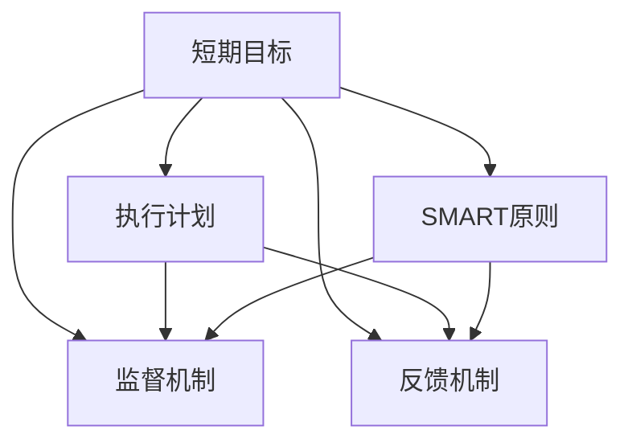
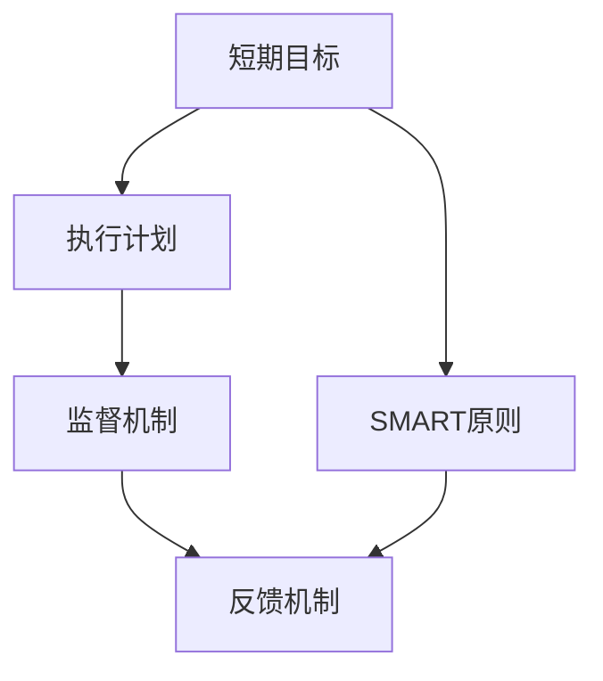

                 

# 短期目标管理的意识机制

## 1. 背景介绍

### 1.1 问题由来
在个人和企业的日常工作中，短期目标管理（Short-term Goal Management）是提高效率和效果的关键环节。良好的短期目标管理不仅可以确保任务按时完成，还可以提升团队协作和成员士气。然而，许多组织和个人在短期目标设定和执行过程中，常常面临诸如目标模糊、执行困难、缺乏跟进等挑战。因此，如何构建一个高效、可执行的短期目标管理机制，成为当下管理实践中的热门话题。

### 1.2 问题核心关键点
短期目标管理的核心在于目标的设定、执行、监督与反馈。一个有效的短期目标管理机制需要明确的目标定义、科学的执行计划、严格的监督机制以及及时的反馈机制。它不仅是一个方法论，更是一种意识机制，要求每个参与者都具备目标意识和执行能力。

### 1.3 问题研究意义
研究短期目标管理的意识机制，对于提升个人和团队的工作效率、增强管理效能、优化资源配置具有重要意义。通过构建科学的短期目标管理机制，可以帮助人们更好地理解目标的重要性，提高执行力，实现更高质量的工作成果。

## 2. 核心概念与联系

### 2.1 核心概念概述

短期目标管理包括多个关键概念，这些概念之间存在密切联系，共同构成了一个完整且高效的执行体系。

- **短期目标（Short-term Goal）**：指在一定时间范围内（通常为1-3个月）需要实现的具体目标。这些目标具体明确，可操作性强，是短期目标管理的核心。

- **SMART原则**：具体（Specific）、可衡量（Measurable）、可实现（Achievable）、相关性（Relevant）、时限性（Time-bound）。它是设定和评估短期目标的标准。

- **执行计划（Execution Plan）**：为达成短期目标，需要采取的具体步骤和方法。包括时间表、资源分配、责任分工等。

- **监督机制（Supervision Mechanism）**：通过定期检查和评估，确保执行计划的顺利实施。监督机制可以采用日/周/月度报告、定期会议等形式。

- **反馈机制（Feedback Mechanism）**：及时收集执行过程中遇到的问题和反馈，调整执行计划，确保目标的顺利实现。反馈机制可以采用一对一沟通、团队讨论等形式。

- **动机管理（Motivation Management）**：激发团队和成员的内在动力，保持高昂的工作热情和积极的工作态度。

这些核心概念共同构成了短期目标管理的基本框架，通过它们之间的相互作用，实现目标的高效执行和顺利达成。

### 2.2 概念间的关系

通过Mermaid流程图，我们可以清晰地展示这些核心概念之间的关系：



这个流程图展示了短期目标管理的基本流程和关键环节。首先，根据SMART原则设定具体、可衡量、可实现、相关且有时限的目标。接着，制定详细的执行计划，并建立监督和反馈机制，确保目标的顺利实现。执行计划和监督机制相互作用，反馈机制则起到修正和调整的作用。

### 2.3 核心概念的整体架构

最终，我们将这些核心概念整合为一个整体，以形成一个完整的短期目标管理架构：



通过这张综合流程图，我们可以清楚地看到，短期目标管理是一个闭环的系统，从目标设定到执行计划、监督反馈，每个环节都是相互联系、相互支持的。

## 3. 核心算法原理 & 具体操作步骤
### 3.1 算法原理概述

短期目标管理的核心算法原理基于行为科学和管理学的理论基础，主要包括以下几个方面：

- **行为科学**：通过研究个体和群体的行为规律，揭示目标设定和执行的心理学原理，指导短期目标管理的实践。
- **管理学**：通过科学的管理方法论，帮助组织和团队系统性地实现短期目标。
- **系统论**：通过构建目标管理的闭环系统，实现目标的动态调整和优化。

### 3.2 算法步骤详解

以下是一个典型的短期目标管理算法步骤：

1. **目标设定**：
   - 根据SMART原则，设定具体、可衡量、可实现、相关且有时限的短期目标。
   - 将目标细化为具体任务和子任务，明确时间节点和责任人。

2. **计划制定**：
   - 制定详细的执行计划，包括时间表、资源分配、责任分工等。
   - 设置关键里程碑，确保执行进度可控。

3. **执行监控**：
   - 定期检查执行进度，记录实际完成情况。
   - 识别执行过程中遇到的问题和挑战，及时调整计划。

4. **反馈调整**：
   - 收集执行反馈，进行数据分析和评估。
   - 根据反馈结果，调整执行计划和目标设定，确保目标的顺利实现。

5. **成果评估**：
   - 完成目标后，进行全面的评估和总结，提取经验和教训。
   - 根据评估结果，调整下一轮目标设定和执行策略。

### 3.3 算法优缺点

短期目标管理的优点包括：

- 目标明确，有助于提升工作效率和任务完成度。
- 通过系统化的执行计划和监督机制，确保任务按时按质完成。
- 反馈机制的引入，有助于及时发现和解决问题，优化执行过程。

缺点包括：

- 目标设定和调整过程较为繁琐，需要花费较多时间和精力。
- 执行过程中需要持续的监督和反馈，增加了管理成本。
- 高度依赖执行者的自觉性和执行力，容易受到个人因素影响。

### 3.4 算法应用领域

短期目标管理广泛应用于多个领域，包括但不限于：

- **项目管理**：通过设定和监督项目目标，确保项目按时交付，提升项目成功率。
- **个人管理**：通过设定短期目标，提升个人工作和学习效率，实现自我提升。
- **团队管理**：通过系统化的目标管理和监督，增强团队协作和成员士气，提升团队整体绩效。
- **企业运营**：通过短期目标管理，优化资源配置，提升企业运营效率和市场竞争力。

## 4. 数学模型和公式 & 详细讲解 & 举例说明

### 4.1 数学模型构建

为了方便计算和分析，我们可以将短期目标管理的核心算法原理数学化。这里，我们使用一个简化的数学模型来描述短期目标管理的执行过程。

设短期目标为 $G$，目标分解为 $n$ 个子任务 $T_1, T_2, ..., T_n$。每个子任务 $T_i$ 的完成度为 $P_i \in [0, 1]$，期望完成时间为 $T_i$。

执行计划中，第 $i$ 个子任务分配给责任人 $R_i$，分配时间为 $A_i$，执行时间为 $E_i$，实际完成时间为 $C_i$。执行进度 $X_i$ 为 $P_i$ 和 $A_i$ 的函数：

$$ X_i = f(P_i, A_i) $$

监督机制通过定期检查子任务的完成度，收集数据 $\{(X_{i, k}, C_{i, k})\}_{k=1}^K$，其中 $X_{i, k}$ 为第 $i$ 个子任务第 $k$ 次检查的完成度，$C_{i, k}$ 为实际完成时间。

反馈机制通过数据分析，计算子任务的偏差度 $D_i$：

$$ D_i = C_i - A_i $$

根据偏差度 $D_i$ 和完成度 $P_i$，计算调整系数 $C_i$：

$$ C_i = f(D_i, P_i) $$

调整系数 $C_i$ 用于调整子任务的分配时间和执行时间，优化执行效率。

最终，目标 $G$ 的完成度为所有子任务完成度的加权和：

$$ \bar{P} = \sum_{i=1}^n w_i P_i $$

其中 $w_i$ 为子任务 $T_i$ 的权重。

### 4.2 公式推导过程

为了简化计算，我们假设每个子任务的时间点固定，且完成度线性增长。则有：

$$ X_i = \frac{k_i P_i}{T_i}, \quad k_i \in [0, 1] $$

偏差度 $D_i$ 的计算公式为：

$$ D_i = C_i - A_i = k_i P_i - A_i $$

调整系数 $C_i$ 的计算公式为：

$$ C_i = \frac{D_i}{P_i} $$

子任务分配时间和执行时间调整后的公式为：

$$ A'_i = A_i - C_i, \quad E'_i = E_i - C_i $$

目标 $G$ 的完成度公式为：

$$ \bar{P} = \sum_{i=1}^n w_i P_i $$

### 4.3 案例分析与讲解

假设一个项目有5个子任务，每个子任务的期望完成时间为1个月，分配时间为1周，执行时间为2周。前两次检查后，第1、2、4个子任务的完成度分别为0.3、0.4、0.2，实际完成时间分别为2周、2周、1周。根据公式计算调整系数 $C_i$ 和重新分配时间 $A'_i$ 和 $E'_i$。

首先，计算偏差度 $D_i$：

$$ D_1 = 2 - 1 = 1, \quad D_2 = 2 - 1 = 1, \quad D_4 = 1 - 1 = 0 $$

然后，计算调整系数 $C_i$：

$$ C_1 = \frac{1}{0.3} = 3.33, \quad C_2 = \frac{1}{0.4} = 2.5, \quad C_4 = 0 $$

最后，调整分配时间和执行时间：

$$ A'_1 = 1 - 3.33 = -2.33, \quad A'_2 = 1 - 2.5 = -1.5, \quad A'_4 = 1 - 0 = 1 $$

$$ E'_1 = 2 - 3.33 = -1.33, \quad E'_2 = 2 - 2.5 = -0.5, \quad E'_4 = 2 - 0 = 2 $$

可以看出，第1和第2个子任务的分配时间和执行时间需要进行调整，以优化执行效率。

## 5. 项目实践：代码实例和详细解释说明

### 5.1 开发环境搭建

为了实践短期目标管理的算法，我们需要搭建一个开发环境。这里我们选择Python作为开发语言，使用Pandas进行数据分析，使用Plotly进行可视化。

1. 安装Python和Pandas：
   ```bash
   conda create -n goal-management python=3.8
   conda activate goal-management
   conda install pandas
   ```

2. 安装Plotly：
   ```bash
   pip install plotly
   ```

### 5.2 源代码详细实现

以下是一个简单的Python代码示例，展示了如何使用Pandas进行短期目标管理的计算和可视化：

```python
import pandas as pd
import plotly.graph_objects as go

# 定义任务数据
data = {
    'task': ['Task 1', 'Task 2', 'Task 3', 'Task 4', 'Task 5'],
    'expected_time': [1, 1, 1, 1, 1],
    'allocation_time': [1, 1, 1, 1, 1],
    'execution_time': [2, 2, 2, 2, 2],
    'completion_rate': [0.3, 0.4, 0.2, 0.3, 0.5],
    'actual_time': [2, 2, 1, 1, 2]
}

# 创建数据框
df = pd.DataFrame(data)

# 计算偏差度和调整系数
df['deviation'] = df['actual_time'] - df['allocation_time']
df['adjustment_coefficient'] = df['deviation'] / df['completion_rate']

# 调整分配时间和执行时间
df['adjusted_allocation_time'] = df['allocation_time'] - df['adjustment_coefficient']
df['adjusted_execution_time'] = df['execution_time'] - df['adjustment_coefficient']

# 可视化偏差度和调整系数
fig = go.Figure()
fig.add_trace(go.Bar(x=df['task'], y=df['adjustment_coefficient']))
fig.update_layout(title='Adjustment Coefficient of Tasks')
fig.show()

# 可视化调整后的分配时间和执行时间
fig = go.Figure()
fig.add_trace(go.Bar(x=df['task'], y=df['adjusted_allocation_time']))
fig.add_trace(go.Bar(x=df['task'], y=df['adjusted_execution_time']))
fig.update_layout(title='Adjusted Allocation and Execution Time')
fig.show()
```

### 5.3 代码解读与分析

上述代码中，我们首先定义了任务的基本数据，包括期望完成时间、分配时间、执行时间、实际完成率、实际完成时间。然后，计算了偏差度和调整系数，调整了分配时间和执行时间。最后，使用Plotly绘制了调整系数和调整后分配时间、执行时间的柱状图。

通过这些图表，我们可以直观地看到每个任务的偏差度和调整系数，以及调整后的分配时间和执行时间。这有助于我们更好地理解和优化执行计划，确保短期目标的顺利实现。

### 5.4 运行结果展示

运行上述代码后，我们将得到两个柱状图，分别展示了调整系数和调整后分配时间、执行时间的变化。这些图表可以帮助我们快速识别和解决问题，优化执行过程。

## 6. 实际应用场景

### 6.1 项目管理的短期目标管理

项目管理中，短期目标管理是一个重要的环节。通过设定具体的短期目标和详细的执行计划，可以确保项目按时交付，提高项目成功率。例如，一个软件开发项目可以通过设定每个阶段的里程碑，确保关键功能的按时完成。

### 6.2 个人管理的短期目标管理

个人管理中，短期目标管理可以帮助提升工作效率和学习成果。通过设定每日、每周、每月的短期目标，并根据执行情况进行及时调整，可以更好地管理时间和任务，实现自我提升。

### 6.3 团队管理的短期目标管理

团队管理中，短期目标管理可以增强团队协作和成员士气。通过系统化的目标管理和监督机制，可以确保团队成员按时完成任务，提升团队整体绩效。

## 7. 工具和资源推荐

### 7.1 学习资源推荐

为了深入学习短期目标管理的理论和实践，推荐以下资源：

1. **《目标管理：如何建立高效团队》**（by 李明，中信出版社）：介绍目标管理的基本原理和实践方法，适合初学者。
2. **《管理学：原理与应用》**（by 罗宾斯，中国人民大学出版社）：系统介绍管理学的基本理论和应用，适合进阶学习。
3. **《项目管理知识体系指南（PMBOK）》**（by PMI，Pearson）：项目管理领域的权威指南，适合项目管理专业人士。
4. **《OKR：如何实现目标》**（by 彼得·哈里·舍恩，腾讯大学）：介绍OKR目标管理方法，适合企业应用。
5. **《精益管理：如何在竞争中脱颖而出》**（by 大前研一，中信出版社）：介绍精益管理的基本原理和实践方法，适合企业管理者。

### 7.2 开发工具推荐

为了提高短期目标管理的实践效率，推荐以下开发工具：

1. **Jira**：项目管理工具，支持任务分配、进度跟踪和团队协作。
2. **Trello**：项目管理工具，支持看板式任务管理和团队协作。
3. **Asana**：项目管理工具，支持任务分配、进度跟踪和团队协作。
4. **Notion**：团队协作工具，支持文档管理、任务跟踪和团队协作。
5. **Slack**：团队协作工具，支持即时通信和团队协作。

### 7.3 相关论文推荐

为了深入了解短期目标管理的最新研究进展，推荐以下论文：

1. **《目标设定对员工表现的影响研究》**（by Edwin Locke and Gary Latham，American Psychologist）：系统研究目标设定的心理学原理和影响。
2. **《短期目标管理：理论与实践》**（by Robert E. Quinn, Kim S. Spreitzer, 哈佛商业评论）：介绍短期目标管理的理论基础和实践方法。
3. **《项目管理实践指南》**（by Pareto Software Institute，PMI）：详细介绍项目管理的基本原理和实践方法。
4. **《OKR：目标与关键结果》**（by John Doerr，Encore Books）：介绍OKR目标管理方法的理论基础和实践应用。
5. **《精益管理：消除浪费，提高效率》**（by James Womack, Daniel Jones, Daniel Roos, 中信出版社）：介绍精益管理的基本原理和实践方法。

## 8. 总结：未来发展趋势与挑战

### 8.1 研究成果总结

短期目标管理作为一种有效的管理方法，已经在多个领域得到广泛应用。其核心思想是通过设定具体的短期目标和详细的执行计划，确保任务按时完成，提升团队协作和成员士气。

### 8.2 未来发展趋势

未来，短期目标管理将继续在多个领域发挥重要作用。随着科技的发展，越来越多的智能化工具将被引入，如AI驱动的任务分配和进度跟踪系统，可以进一步提升目标管理的效率和准确性。同时，混合管理模式（如OKR与敏捷管理结合）也将得到广泛应用，提高目标管理的灵活性和适应性。

### 8.3 面临的挑战

尽管短期目标管理具有显著的优势，但在实际应用中也面临一些挑战：

1. 目标设定和调整过程复杂，需要耗费大量时间和精力。
2. 执行过程中需要持续的监督和反馈，增加了管理成本。
3. 高度依赖执行者的自觉性和执行力，容易受到个人因素影响。

### 8.4 研究展望

未来，短期目标管理的研究将进一步深化，可能从以下几个方向进行探索：

1. 引入AI和大数据技术，进一步优化目标设定和执行计划。
2. 探索混合管理模式，结合OKR和敏捷管理，提高目标管理的灵活性和适应性。
3. 研究激励机制，激发团队和成员的内在动力，保持高昂的工作热情和积极的工作态度。

总之，短期目标管理作为一种科学的管理方法，将在未来的管理实践中继续发挥重要作用。通过不断优化和创新，短期目标管理将更好地支持个人和组织的成长与发展。

## 9. 附录：常见问题与解答

### Q1：短期目标管理是否适用于所有团队？

A: 短期目标管理适用于大多数团队，特别是那些需要高效执行和管理任务的企业和组织。但需要根据团队的实际情况和需求，进行适当的调整和优化。

### Q2：如何设定合理的短期目标？

A: 设定合理的短期目标需要遵循SMART原则，即目标需要具体（Specific）、可衡量（Measurable）、可实现（Achievable）、相关性（Relevant）、时限性（Time-bound）。具体方法包括使用OKR、KPI等工具。

### Q3：短期目标管理是否需要持续的监督和反馈？

A: 是的，持续的监督和反馈是短期目标管理的重要环节。通过定期检查和评估，可以及时发现和解决问题，优化执行过程。

### Q4：短期目标管理是否适用于个人？

A: 是的，短期目标管理同样适用于个人。通过设定短期目标和详细的执行计划，可以提升个人的工作效率和学习成果。

### Q5：短期目标管理是否需要引入技术工具？

A: 引入技术工具可以进一步提升短期目标管理的效率和准确性。但技术工具只是辅助手段，关键还在于制定合理的目标和执行计划，以及持续的监督和反馈。

---

作者：禅与计算机程序设计艺术 / Zen and the Art of Computer Programming

