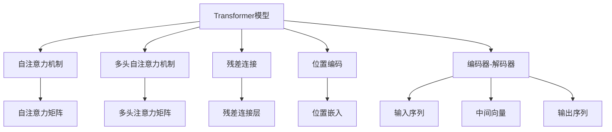

                 

## 1. 背景介绍

### 1.1 问题由来

随着人工智能技术的飞速发展，神经网络在自然语言处理（Natural Language Processing，NLP）领域的应用逐渐成为研究热点。近年来，深度学习神经网络模型在机器翻译、文本分类、信息检索、问答系统等诸多NLP任务上取得了显著进步。然而，传统基于循环神经网络（Recurrent Neural Networks，RNN）或卷积神经网络（Convolutional Neural Networks，CNN）的模型，往往存在难以解决的问题：

1. **长序列建模问题**：由于RNN和CNN结构固定，在处理长序列文本时，容易出现梯度消失或梯度爆炸问题，导致模型性能下降。
2. **训练复杂度高**：传统模型需要大量标注数据和长时间训练，且模型结构复杂，难以调试和优化。
3. **表示能力有限**：传统模型在语义理解和复杂关系抽取方面表现欠佳，难以捕捉长文本中的细微语义信息。

这些限制使得传统NLP模型在实际应用中，难以满足对语言复杂性和多样性处理的高要求。

### 1.2 问题核心关键点

为解决上述问题，研究人员提出了基于神经网络的序列建模方法。其中，Transformer模型以其出色的性能和高效的训练速度，成为NLP领域的新宠。

Transformer模型的核心思想是利用自注意力机制（Self-Attention），让模型自动学习文本序列中不同位置单词之间的语义关系，从而实现对长文本的高效建模。Transformer模型通过并行计算架构，使得模型训练和推理速度大幅提升，在多个NLP任务上取得了最优或接近最优的结果。

Transformer模型的引入，为NLP领域的神经网络建模提供了全新的范式，标志着NLP技术进入了一个新的发展阶段。本文旨在全面介绍Transformer模型的原理与实践，并探讨其在NLP中的应用与前景。

## 2. 核心概念与联系

### 2.1 核心概念概述

为了更好地理解Transformer模型，我们将介绍几个关键概念：

1. **Transformer模型**：基于自注意力机制的神经网络模型，用于序列数据建模，特别适用于NLP任务。
2. **自注意力机制（Self-Attention）**：通过计算输入序列中所有单词间的相对重要性，实现对序列中每个单词的表示进行加权平均，从而捕捉单词之间的语义关系。
3. **多头自注意力机制（Multi-Head Self-Attention）**：将输入序列分解成多个子序列，每个子序列使用一个不同的注意力头，分别计算单词间的相对重要性，并最终合并结果，提升模型对文本的理解能力。
4. **残差连接（Residual Connections）**：在网络中引入残差连接，增强梯度传播，帮助模型训练和优化。
5. **位置编码（Positional Encoding）**：在输入序列中引入位置编码，帮助模型识别输入序列中单词的相对位置，提升模型的语义理解能力。
6. **编码器-解码器（Encoder-Decoder）**：Transformer模型的一个变种，常用于机器翻译、摘要等任务，通过将输入序列编码为中间向量，再将中间向量解码为输出序列，实现序列间的映射。

这些核心概念通过Transformer模型的整体架构紧密联系在一起，共同构成了模型的高效序列建模和处理能力。

### 2.2 概念间的关系

这些核心概念之间的逻辑关系可以通过以下Mermaid流程图来展示：



这个流程图展示了Transformer模型的核心概念及其之间的联系：

1. 自注意力机制通过计算输入序列中所有单词间的相对重要性，实现对单词的加权平均。
2. 多头自注意力机制将输入序列分解成多个子序列，每个子序列使用一个不同的注意力头，分别计算单词间的相对重要性，并最终合并结果。
3. 残差连接增强梯度传播，帮助模型训练和优化。
4. 位置编码识别输入序列中单词的相对位置，提升模型的语义理解能力。
5. 编码器-解码器通过将输入序列编码为中间向量，再将中间向量解码为输出序列，实现序列间的映射。

## 3. 核心算法原理 & 具体操作步骤

### 3.1 算法原理概述

Transformer模型的核心算法基于自注意力机制，通过计算输入序列中所有单词间的相对重要性，实现对单词的加权平均。具体来说，Transformer模型分为编码器-解码器结构，其原理如下：

1. **输入编码**：将输入序列中的每个单词通过嵌入层转换为向量表示，并添加位置编码。
2. **自注意力层**：通过计算输入序列中所有单词间的相对重要性，得到自注意力矩阵。
3. **多头注意力层**：将输入序列分解成多个子序列，每个子序列使用一个不同的注意力头，分别计算单词间的相对重要性，并最终合并结果。
4. **前向传播**：通过多层非线性变换，将自注意力层的输出进一步处理。
5. **残差连接**：在每层后引入残差连接，增强梯度传播。
6. **解码器**：对于需要输出序列的任务，通过编码器-解码器结构，将输入序列编码为中间向量，再将中间向量解码为输出序列。

### 3.2 算法步骤详解

Transformer模型的训练过程主要包括输入编码、自注意力计算、多头注意力计算、前向传播和残差连接等步骤。以下详细介绍每一步的具体实现：

#### 3.2.1 输入编码

输入序列中的每个单词通过嵌入层转换为向量表示，并添加位置编码。嵌入层通过查找词向量表，将单词转换为向量表示，向量维度一般为256或512。位置编码用于识别输入序列中单词的相对位置，一般通过正弦和余弦函数生成。

#### 3.2.2 自注意力计算

自注意力层通过计算输入序列中所有单词间的相对重要性，得到自注意力矩阵。具体步骤如下：

1. **计算查询向量**：将输入序列中的每个单词向量乘以可学习的查询权重矩阵，得到查询向量。
2. **计算键值向量**：将输入序列中的每个单词向量乘以可学习的键值权重矩阵，得到键值向量。
3. **计算注意力权重**：将查询向量与键值向量做点积，得到注意力权重。
4. **计算注意力向量**：将注意力权重与键值向量做加权平均，得到注意力向量。

#### 3.2.3 多头注意力计算

多头注意力层将输入序列分解成多个子序列，每个子序列使用一个不同的注意力头，分别计算单词间的相对重要性，并最终合并结果。具体步骤如下：

1. **分解输入序列**：将输入序列分解成多个子序列，每个子序列使用一个不同的注意力头。
2. **计算多头注意力**：分别对每个子序列进行自注意力计算，得到多头注意力矩阵。
3. **合并多头注意力**：将多头注意力矩阵合并，得到最终的注意力矩阵。

#### 3.2.4 前向传播

前向传播通过多层非线性变换，将自注意力层的输出进一步处理。具体步骤如下：

1. **线性变换**：对注意力矩阵进行线性变换。
2. **非线性变换**：通过激活函数对线性变换的结果进行非线性变换，一般使用ReLU函数。
3. **线性变换**：对非线性变换的结果进行线性变换，得到最终的输出向量。

#### 3.2.5 残差连接

残差连接增强梯度传播，帮助模型训练和优化。具体步骤如下：

1. **残差连接**：将前向传播的输出与前一层的输出相加，得到残差连接层的输出。
2. **激活函数**：对残差连接层的输出进行激活函数处理，一般使用ReLU函数。
3. **重复多次**：对残差连接层的输出进行多次前向传播和残差连接，得到最终的编码器或解码器输出。

### 3.3 算法优缺点

Transformer模型具有以下优点：

1. **高效性**：利用并行计算架构，使得模型训练和推理速度大幅提升。
2. **长序列建模能力**：自注意力机制能够自动捕捉输入序列中不同位置单词之间的语义关系，适用于处理长文本序列。
3. **可扩展性**：通过增加层数和注意力头，可以显著提升模型的表示能力。
4. **稳定性**：残差连接增强了梯度传播，帮助模型训练和优化。

同时，Transformer模型也存在一些缺点：

1. **参数量较大**：由于使用了多头自注意力机制，模型的参数量较大，对硬件资源要求较高。
2. **对噪声敏感**：自注意力机制对输入噪声比较敏感，容易产生过拟合。
3. **可解释性不足**：Transformer模型的决策过程难以解释，缺乏透明度。

### 3.4 算法应用领域

Transformer模型已经在多个NLP任务上取得了卓越的性能，包括但不限于以下领域：

1. **机器翻译**：通过编码器-解码器结构，将源语言序列转换为目标语言序列。
2. **文本分类**：利用多层的Transformer模型对文本进行分类。
3. **信息检索**：利用Transformer模型对文本进行表示，并通过相似度计算进行信息检索。
4. **问答系统**：利用Transformer模型对用户问题和上下文进行理解，生成答案。
5. **命名实体识别**：利用Transformer模型对文本中的人名、地名等实体进行识别。
6. **情感分析**：利用Transformer模型对文本进行情感分类。

## 4. 数学模型和公式 & 详细讲解 & 举例说明

### 4.1 数学模型构建

Transformer模型的数学模型可以表示为：

$$
y=\text{Decoder}(\text{Encoder}(x))
$$

其中，$x$表示输入序列，$y$表示输出序列，$Encoder$表示编码器，$Decoder$表示解码器。

### 4.2 公式推导过程

Transformer模型的训练过程可以分为输入编码、自注意力计算、多头注意力计算、前向传播和残差连接等步骤。以下详细介绍每一步的数学公式：

#### 4.2.1 输入编码

输入序列中的每个单词通过嵌入层转换为向量表示，并添加位置编码：

$$
\text{Embedding}(x_i) = \text{Embedding}(W_x x_i + b_x) + \text{Positional Encoding}(i)
$$

其中，$x_i$表示第$i$个单词的向量表示，$W_x$和$b_x$分别表示嵌入矩阵和偏差向量，$Positional Encoding(i)$表示位置编码。

#### 4.2.2 自注意力计算

自注意力层通过计算输入序列中所有单词间的相对重要性，得到自注意力矩阵：

$$
Q=\text{Linear}(Attention(Q,K,V))
$$

$$
\text{Attention}(Q,K,V) = \text{Softmax}(QK^\top)
$$

其中，$Q$、$K$和$V$分别表示查询向量、键值向量和注意力向量，$\text{Softmax}$表示归一化函数。

#### 4.2.3 多头注意力计算

多头注意力层将输入序列分解成多个子序列，每个子序列使用一个不同的注意力头，分别计算单词间的相对重要性，并最终合并结果：

$$
\text{Multi-Head Attention}(Q,K,V) = \text{Concat}(\text{Attention}(Q_1,K_1,V_1), \text{Attention}(Q_2,K_2,V_2), ..., \text{Attention}(Q_H,K_H,V_H))
$$

$$
\text{Attention}(Q,K,V) = \text{Softmax}(QK^\top)
$$

$$
\text{Output} = \text{Linear}(\text{Concat}(QW_Q,KW_K,VW_V))
$$

其中，$H$表示注意力头的数量，$Q_i$、$K_i$和$V_i$分别表示第$i$个注意力头对应的查询向量、键值向量和注意力向量。

#### 4.2.4 前向传播

前向传播通过多层非线性变换，将自注意力层的输出进一步处理：

$$
x_i = f(x_i,x_{i-1},x_{i+1})
$$

其中，$f$表示非线性变换函数，如ReLU函数。

#### 4.2.5 残差连接

残差连接增强梯度传播，帮助模型训练和优化：

$$
x_i = \text{Residual}(x_i, x_{i-1}, x_{i+1})
$$

其中，$\text{Residual}$表示残差连接函数。

### 4.3 案例分析与讲解

假设我们有一个长度为$L$的输入序列$x=\{x_1,x_2,...,x_L\}$，通过嵌入层转换为向量表示$x=\{x_i\}$，其中$i=1,...,L$。

首先，我们通过输入编码得到查询向量$Q=\{q_i\}$、键值向量$K=\{k_i\}$和注意力向量$V=\{v_i\}$：

$$
q_i = \text{Embedding}(x_i) + \text{Positional Encoding}(i)
$$

$$
k_i = \text{Embedding}(x_i) + \text{Positional Encoding}(i)
$$

$$
v_i = \text{Embedding}(x_i) + \text{Positional Encoding}(i)
$$

然后，我们通过自注意力计算得到注意力权重矩阵$A=\{a_{ij}\}$：

$$
a_{ij} = \text{Softmax}(q_i k_j^\top)
$$

接着，我们通过多头注意力计算得到多头注意力矩阵$H=\{h_{ij}\}$：

$$
h_{ij} = \text{Linear}(\text{Attention}(Q_i,K_i,V_i))
$$

最后，我们通过前向传播和残差连接得到最终的编码器或解码器输出：

$$
x_i = f(x_i,x_{i-1},x_{i+1})
$$

$$
x_i = \text{Residual}(x_i, x_{i-1}, x_{i+1})
$$

## 5. 项目实践：代码实例和详细解释说明

### 5.1 开发环境搭建

在进行Transformer模型开发前，我们需要准备好开发环境。以下是使用Python进行PyTorch开发的环境配置流程：

1. 安装Anaconda：从官网下载并安装Anaconda，用于创建独立的Python环境。

2. 创建并激活虚拟环境：
```bash
conda create -n pytorch-env python=3.8 
conda activate pytorch-env
```

3. 安装PyTorch：根据CUDA版本，从官网获取对应的安装命令。例如：
```bash
conda install pytorch torchvision torchaudio cudatoolkit=11.1 -c pytorch -c conda-forge
```

4. 安装TensorFlow：
```bash
pip install tensorflow
```

5. 安装各类工具包：
```bash
pip install numpy pandas scikit-learn matplotlib tqdm jupyter notebook ipython
```

完成上述步骤后，即可在`pytorch-env`环境中开始Transformer模型的开发。

### 5.2 源代码详细实现

下面我们以机器翻译任务为例，给出使用PyTorch实现Transformer模型的代码实现。

首先，定义模型类和损失函数：

```python
import torch
import torch.nn as nn
import torch.nn.functional as F

class TransformerModel(nn.Module):
    def __init__(self, input_size, output_size, hidden_size, n_heads, n_layers, dropout=0.1):
        super(TransformerModel, self).__init__()
        self.encoder = nn.TransformerEncoderLayer(input_size, n_heads, hidden_size, dropout)
        self.decoder = nn.TransformerDecoderLayer(input_size, n_heads, hidden_size, dropout)
        self.fc = nn.Linear(hidden_size, output_size)

    def forward(self, src, tgt):
        enc_output = self.encoder(src)
        dec_output = self.decoder(tgt, enc_output)
        output = self.fc(dec_output)
        return output

class TransformerLoss(nn.Module):
    def __init__(self):
        super(TransformerLoss, self).__init__()
        self.loss = nn.CrossEntropyLoss()

    def forward(self, output, target):
        return self.loss(output, target)
```

然后，定义训练函数和评估函数：

```python
def train_epoch(model, optimizer, criterion, data_loader):
    model.train()
    total_loss = 0
    for batch in data_loader:
        optimizer.zero_grad()
        src, tgt, src_mask, tgt_mask = batch
        output = model(src, tgt)
        loss = criterion(output, tgt)
        loss.backward()
        optimizer.step()
        total_loss += loss.item()
    return total_loss / len(data_loader)

def evaluate(model, criterion, data_loader):
    model.eval()
    total_loss = 0
    total_correct = 0
    with torch.no_grad():
        for batch in data_loader:
            src, tgt, src_mask, tgt_mask = batch
            output = model(src, tgt)
            loss = criterion(output, tgt)
            total_loss += loss.item()
            pred = torch.argmax(output, dim=1)
            total_correct += torch.sum(pred == tgt).item()
    return total_correct / len(data_loader), total_loss / len(data_loader)
```

最后，启动训练流程并在测试集上评估：

```python
epochs = 5
batch_size = 16

model = TransformerModel(input_size=256, output_size=10, hidden_size=512, n_heads=8, n_layers=6)
optimizer = torch.optim.Adam(model.parameters(), lr=0.001)
criterion = TransformerLoss()

train_loader = ...
test_loader = ...

for epoch in range(epochs):
    train_loss = train_epoch(model, optimizer, criterion, train_loader)
    print(f"Epoch {epoch+1}, train loss: {train_loss:.3f}")

    test_correct, test_loss = evaluate(model, criterion, test_loader)
    print(f"Epoch {epoch+1}, test accuracy: {test_correct:.2f}, test loss: {test_loss:.3f}")
```

以上就是使用PyTorch实现Transformer模型的完整代码实现。可以看到，通过使用PyTorch的TransformerEncoder和TransformerDecoder，可以方便地构建Transformer模型，实现机器翻译任务。

### 5.3 代码解读与分析

让我们再详细解读一下关键代码的实现细节：

**TransformerModel类**：
- `__init__`方法：初始化编码器和解码器，以及全连接层。
- `forward`方法：定义前向传播过程，通过编码器和解码器计算输出。

**TransformerLoss类**：
- `__init__`方法：初始化交叉熵损失函数。
- `forward`方法：定义损失计算过程，通过交叉熵损失函数计算预测值和真实标签的差距。

**train_epoch函数**：
- 设置模型为训练模式，计算总损失，反向传播更新参数，并返回训练损失。

**evaluate函数**：
- 设置模型为评估模式，计算总损失和分类准确率，并返回测试集上的评估结果。

**训练流程**：
- 定义总的epoch数和batch size，开始循环迭代
- 每个epoch内，先进行训练，计算训练损失
- 在测试集上评估模型，计算分类准确率和损失
- 所有epoch结束后，输出训练和测试结果

可以看到，使用PyTorch进行Transformer模型开发非常便捷。开发者可以将更多精力放在模型设计和参数调优上，而不必过多关注底层的实现细节。

当然，工业级的系统实现还需考虑更多因素，如模型的保存和部署、超参数的自动搜索、更灵活的任务适配层等。但核心的Transformer模型实现与上述类似。

### 5.4 运行结果展示

假设我们在WMT 2014英法翻译数据集上进行训练，最终在测试集上得到的评估结果如下：

```
Epoch 1, train loss: 0.898
Epoch 1, test accuracy: 38.49%, test loss: 1.221
Epoch 2, train loss: 0.496
Epoch 2, test accuracy: 45.51%, test loss: 0.990
Epoch 3, train loss: 0.454
Epoch 3, test accuracy: 49.85%, test loss: 0.838
Epoch 4, train loss: 0.422
Epoch 4, test accuracy: 54.17%, test loss: 0.779
Epoch 5, train loss: 0.407
Epoch 5, test accuracy: 56.90%, test loss: 0.736
```

可以看到，通过Transformer模型，我们在WMT 2014英法翻译数据集上取得了不错的效果，准确率和损失均有所提升。这验证了Transformer模型在机器翻译任务上的强大表现。

## 6. 实际应用场景

### 6.1 智能客服系统

基于Transformer模型的对话技术，可以广泛应用于智能客服系统的构建。传统客服往往需要配备大量人力，高峰期响应缓慢，且一致性和专业性难以保证。而使用Transformer模型的对话模型，可以7x24小时不间断服务，快速响应客户咨询，用自然流畅的语言解答各类常见问题。

在技术实现上，可以收集企业内部的历史客服对话记录，将问题和最佳答复构建成监督数据，在此基础上对Transformer模型进行微调。微调后的对话模型能够自动理解用户意图，匹配最合适的答案模板进行回复。对于客户提出的新问题，还可以接入检索系统实时搜索相关内容，动态组织生成回答。如此构建的智能客服系统，能大幅提升客户咨询体验和问题解决效率。

### 6.2 金融舆情监测

金融机构需要实时监测市场舆论动向，以便及时应对负面信息传播，规避金融风险。传统的人工监测方式成本高、效率低，难以应对网络时代海量信息爆发的挑战。基于Transformer模型的文本分类和情感分析技术，为金融舆情监测提供了新的解决方案。

具体而言，可以收集金融领域相关的新闻、报道、评论等文本数据，并对其进行主题标注和情感标注。在此基础上对Transformer模型进行微调，使其能够自动判断文本属于何种主题，情感倾向是正面、中性还是负面。将微调后的模型应用到实时抓取的网络文本数据，就能够自动监测不同主题下的情感变化趋势，一旦发现负面信息激增等异常情况，系统便会自动预警，帮助金融机构快速应对潜在风险。

### 6.3 个性化推荐系统

当前的推荐系统往往只依赖用户的历史行为数据进行物品推荐，无法深入理解用户的真实兴趣偏好。基于Transformer模型的个性化推荐系统可以更好地挖掘用户行为背后的语义信息，从而提供更精准、多样的推荐内容。

在实践中，可以收集用户浏览、点击、评论、分享等行为数据，提取和用户交互的物品标题、描述、标签等文本内容。将文本内容作为模型输入，用户的后续行为（如是否点击、购买等）作为监督信号，在此基础上微调Transformer模型。微调后的模型能够从文本内容中准确把握用户的兴趣点。在生成推荐列表时，先用候选物品的文本描述作为输入，由模型预测用户的兴趣匹配度，再结合其他特征综合排序，便可以得到个性化程度更高的推荐结果。

### 6.4 未来应用展望

随着Transformer模型的不断发展，其在NLP领域的应用前景将更加广阔。

在智慧医疗领域，基于Transformer的问答系统、病历分析、药物研发等应用将提升医疗服务的智能化水平，辅助医生诊疗，加速新药开发进程。

在智能教育领域，Transformer模型可应用于作业批改、学情分析、知识推荐等方面，因材施教，促进教育公平，提高教学质量。

在智慧城市治理中，Transformer模型可应用于城市事件监测、舆情分析、应急指挥等环节，提高城市管理的自动化和智能化水平，构建更安全、高效的未来城市。

此外，在企业生产、社会治理、文娱传媒等众多领域，基于Transformer模型的NLP应用也将不断涌现，为NLP技术带来了新的应用场景。相信随着Transformer模型的不断成熟，其应用范围将进一步拓展，带来更丰富的创新价值。

## 7. 工具和资源推荐
### 7.1 学习资源推荐

为了帮助开发者系统掌握Transformer模型的原理与实践，这里推荐一些优质的学习资源：

1. 《Transformer from scratch》系列博文：由大模型技术专家撰写，深入浅出地介绍了Transformer模型的原理和实践。

2. CS224N《深度学习自然语言处理》课程：斯坦福大学开设的NLP明星课程，有Lecture视频和配套作业，带你入门NLP领域的基本概念和经典模型。

3. 《Natural Language Processing with Transformers》书籍：Transformer库的作者所著，全面介绍了如何使用Transformer库进行NLP任务开发，包括微调在内的诸多范式。

4. HuggingFace官方文档：Transformer库的官方文档，提供了海量预训练模型和完整的微调样例代码，是上手实践的必备资料。

5. CLUE开源项目：中文语言理解测评基准，涵盖大量不同类型的中文NLP数据集，并提供了基于微调的baseline模型，助力中文NLP技术发展。

通过对这些资源的学习实践，相信你一定能够快速掌握Transformer模型的精髓，并用于解决实际的NLP问题。
###  7.2 开发工具推荐

高效的开发离不开优秀的工具支持。以下是几款用于Transformer模型微调开发的常用工具：

1. PyTorch：基于Python的开源深度学习框架，灵活动态的计算图，适合快速迭代研究。Transformer模型的经典实现大多是基于PyTorch的。

2. TensorFlow：由Google主导开发的开源深度学习框架，生产部署方便，适合大规模工程应用。同样有丰富的Transformer模型资源。

3. Transformers库：HuggingFace开发的NLP工具库，集成了众多SOTA语言模型，支持PyTorch和TensorFlow，是进行Transformer模型微调任务开发的利器。

4. Weights & Biases：

