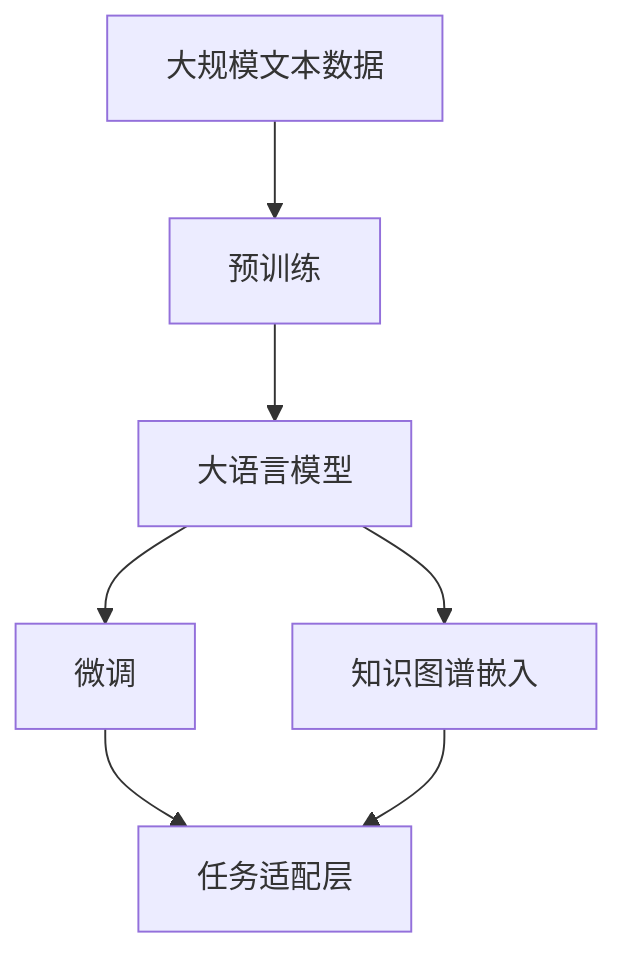
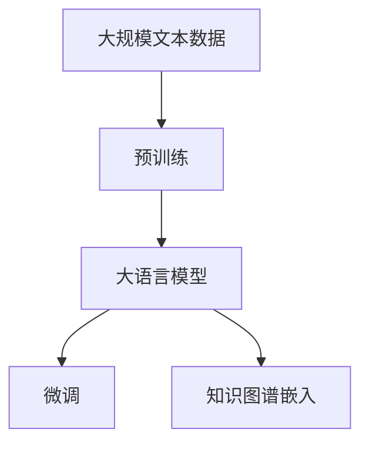
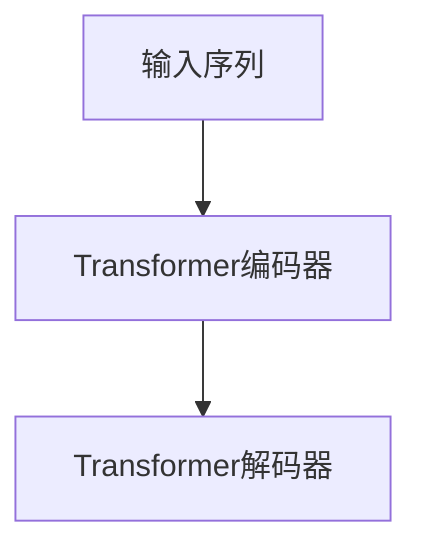

                 

# 大模型问答机器人的知识表示方式

> 关键词：大模型,知识表示,自然语言处理,NLP,问答机器人,Transformer,预训练,微调,Fine-Tuning

## 1. 背景介绍

### 1.1 问题由来

近年来，人工智能技术的迅猛发展使得语音、视觉、文本等领域的深度学习模型取得了显著进展。特别是基于深度学习的大语言模型（Large Language Model, LLMs），如BERT、GPT等，在自然语言处理（Natural Language Processing, NLP）领域展现出了强大的能力。然而，现有的大语言模型大多缺乏明确的领域知识和实体识别能力，难以在特定领域或场景中进行深度理解与推理。

针对这一问题，研究者们开始探索如何在大语言模型的基础上，结合领域知识构建出更加精准、高效的问答机器人系统。这不仅需要大模型具有足够的语言理解能力，还需要其能够通过知识表示（Knowledge Representation, KR）方式，将外部知识源（如知识图谱、百科全书等）有效地整合到模型中，从而提高模型的领域适应能力和推理能力。

### 1.2 问题核心关键点

大模型问答机器人知识表示的核心在于如何将外部领域知识有效地整合到深度学习模型中，使其能够更好地理解和推理问答场景中的问题。常见的知识表示方式包括知识图谱嵌入、向量空间模型、语义网等。

其中，知识图谱嵌入（Knowledge Graph Embedding, KGE）是最为流行和有效的知识表示方式之一。它通过将知识图谱中的实体和关系映射到低维向量空间，使得模型能够捕捉到实体间的语义关系，从而进行知识推理和问答。

### 1.3 问题研究意义

知识图谱嵌入技术不仅能够显著提高大语言模型的领域适应能力和推理能力，还能够在多模态场景中发挥重要作用，如跨媒体问答、智能推荐等。此外，知识图谱嵌入还能帮助解决信息抽取、实体识别、关系推理等传统NLP任务，进一步提升大语言模型在实际应用中的价值。

因此，研究大模型问答机器人的知识表示方式，对于推动人工智能技术在特定领域的落地应用，提升模型的推理能力和知识表示能力，具有重要意义。

## 2. 核心概念与联系

### 2.1 核心概念概述

为了更好地理解大模型问答机器人的知识表示方式，本节将介绍几个密切相关的核心概念：

- **大语言模型（Large Language Model, LLM）**：如BERT、GPT等，通过在大规模无标签文本语料上进行预训练，学习通用的语言表示，具备强大的语言理解和生成能力。
- **知识图谱（Knowledge Graph, KG）**：一种结构化的数据存储形式，用于表示实体、关系和属性之间的语义关系。
- **知识图谱嵌入（Knowledge Graph Embedding, KGE）**：将知识图谱中的实体和关系映射到低维向量空间的技术，使模型能够捕捉到实体间的语义关系，进行知识推理。
- **Transformer**：一种基于自注意力机制的神经网络结构，在自然语言处理中广泛应用。
- **预训练（Pre-training）**：在无标签数据上进行的深度学习模型训练过程，旨在学习通用语言表示。
- **微调（Fine-Tuning）**：在有标签数据上进行的模型优化过程，使模型适应特定任务。

这些核心概念之间存在紧密的联系，形成了大模型问答机器人的知识表示生态系统。下面通过一个Mermaid流程图来展示这些概念之间的关系：



这个流程图展示了大语言模型的预训练、微调以及与知识图谱嵌入的结合过程：

1. 在大规模文本数据上进行预训练，学习通用语言表示。
2. 通过微调，适应特定问答任务，形成任务适配层。
3. 将知识图谱嵌入整合到微调后的模型中，进行领域知识增强。

### 2.2 概念间的关系

这些核心概念之间存在复杂的关系，下面通过多个Mermaid流程图来展示它们之间的联系。

#### 2.2.1 大语言模型的学习范式



这个流程图展示了大语言模型的预训练、微调和知识图谱嵌入的结合过程。

#### 2.2.2 知识图谱嵌入与微调的关系


这个流程图展示了知识图谱嵌入如何与大语言模型结合，以及微调过程如何利用嵌入进行知识增强。

#### 2.2.3 Transformer在大模型中的应用



这个流程图展示了Transformer在大模型中的应用，输入序列通过编码器进行特征提取，解码器生成输出。

## 3. 核心算法原理 & 具体操作步骤
### 3.1 算法原理概述

大模型问答机器人的知识表示方式主要基于知识图谱嵌入技术。其核心思想是将知识图谱中的实体和关系映射到低维向量空间，使得模型能够捕捉到实体间的语义关系，从而进行知识推理和问答。

具体而言，知识图谱嵌入可以分为两种类型：静态嵌入和动态嵌入。静态嵌入指的是在知识图谱构建完成后，直接使用嵌入算法（如TransE、TransH、DistMult等）将实体和关系映射到向量空间。动态嵌入则是在模型训练过程中，通过梯度下降等优化算法实时更新实体和关系的向量表示，使得嵌入结果随着模型训练而不断优化。

### 3.2 算法步骤详解

1. **知识图谱构建**：收集领域相关的事实和知识，构建知识图谱。知识图谱通常由实体、关系和属性构成，可以使用RDF（资源描述框架）等标准格式进行表示。

2. **嵌入算法选择**：选择适合的知识图谱嵌入算法，如TransE、TransH、DistMult等，将这些算法应用到知识图谱上，生成实体和关系的向量表示。

3. **模型训练**：将预训练大语言模型与知识图谱嵌入结合，进行联合训练。在模型训练过程中，使用知识图谱嵌入生成的向量表示作为额外的输入，进行联合优化。

4. **任务适配**：在训练完成后，通过微调（Fine-Tuning）来适配特定问答任务，形成任务适配层，从而提高模型的领域适应能力和推理能力。

5. **知识推理**：在微调完成后，使用模型对问答任务进行推理，生成答案或解释。

### 3.3 算法优缺点

知识图谱嵌入技术的优点包括：

- **领域知识增强**：通过将知识图谱嵌入整合到模型中，显著提高模型的领域适应能力和推理能力。
- **语义关系捕捉**：将实体和关系映射到向量空间，使得模型能够捕捉到实体间的语义关系，进行知识推理。
- **多模态融合**：知识图谱嵌入技术不仅适用于文本，还适用于图像、音频等多种模态数据，可以构建多模态问答系统。

然而，知识图谱嵌入技术也存在一些缺点：

- **数据稀疏**：知识图谱中的数据往往存在大量缺失，导致嵌入效果不佳。
- **复杂性**：知识图谱的构建和维护过程较为复杂，需要大量人工干预。
- **计算成本高**：知识图谱嵌入的计算复杂度较高，需要强大的计算资源。

### 3.4 算法应用领域

知识图谱嵌入技术在大模型问答机器人的知识表示中，已经得到了广泛应用。常见的应用领域包括：

- **问答系统**：基于知识图谱嵌入的问答系统，能够提供准确、全面的答案。如IBM Watson、Microsoft QnA Maker等系统。
- **信息抽取**：通过知识图谱嵌入，从文本中抽取实体和关系，构建知识图谱，进行信息抽取。
- **实体识别**：使用知识图谱嵌入，对文本中出现的实体进行识别，并进行关系推理。
- **推荐系统**：基于知识图谱嵌入的推荐系统，能够提供更加精准的推荐结果。如Amazon、Alibaba等电商平台。
- **医疗诊断**：通过知识图谱嵌入，构建医疗领域的知识图谱，辅助医生进行诊断和治疗。

## 4. 数学模型和公式 & 详细讲解 & 举例说明
### 4.1 数学模型构建

知识图谱嵌入模型的核心是一个三元组（实体、关系、实体）的表示学习问题。假设知识图谱包含 $N$ 个实体和 $M$ 个关系，每个实体和关系都可以表示为一个 $d$ 维向量。知识图谱嵌入的目标是将每个实体和关系映射到低维向量空间，使得嵌入向量能够捕捉到实体间的语义关系。

### 4.2 公式推导过程

常见的知识图谱嵌入算法包括TransE、TransH、DistMult等。这里以TransE算法为例，推导知识图谱嵌入的数学模型。

假设知识图谱中有 $N$ 个实体 $e$ 和 $M$ 个关系 $r$，每个实体和关系都可以表示为一个 $d$ 维向量。知识图谱嵌入的目标是将每个实体和关系映射到低维向量空间，使得嵌入向量能够捕捉到实体间的语义关系。

TransE算法的核心思想是，对于每个三元组 $(e, r, e')$，模型预测出 $e'$ 与 $e$ 之间的关系 $r$。具体而言，模型使用 $h(e)$ 和 $t(e)$ 分别表示实体 $e$ 和 $e'$ 的向量表示，$h(r)$ 和 $t(r)$ 分别表示关系 $r$ 的向量表示。模型的目标是最小化预测值 $h(e)$ 和 $t(e)$ 之间的余弦相似度与预测值和真实值之间的差异：

$$
\min_{h, t} \sum_{(e, r, e') \in E} ||h(e) + h(r) - t(e)||^2
$$

其中，$E$ 为知识图谱中的所有三元组。模型使用梯度下降等优化算法，不断更新 $h$ 和 $t$，使得预测值与真实值更加接近。

### 4.3 案例分析与讲解

以Amazon推荐系统为例，展示知识图谱嵌入在大模型中的应用。

Amazon的推荐系统通过知识图谱嵌入技术，将用户、商品和属性映射到向量空间。用户、商品和属性的向量表示通过协作过滤、深度学习等方法学习得到。知识图谱嵌入将用户和商品之间的关系（如购买、评分等）映射到向量空间，构建用户-商品的知识图谱。在推荐时，系统使用知识图谱嵌入计算用户和商品的向量表示之间的相似度，并结合用户的历史行为数据，生成推荐结果。

## 5. 项目实践：代码实例和详细解释说明
### 5.1 开发环境搭建

在进行项目实践前，我们需要准备好开发环境。以下是使用Python进行PyTorch开发的环境配置流程：

1. 安装Anaconda：从官网下载并安装Anaconda，用于创建独立的Python环境。

2. 创建并激活虚拟环境：
```bash
conda create -n pytorch-env python=3.8 
conda activate pytorch-env
```

3. 安装PyTorch：根据CUDA版本，从官网获取对应的安装命令。例如：
```bash
conda install pytorch torchvision torchaudio cudatoolkit=11.1 -c pytorch -c conda-forge
```

4. 安装Transformers库：
```bash
pip install transformers
```

5. 安装各类工具包：
```bash
pip install numpy pandas scikit-learn matplotlib tqdm jupyter notebook ipython
```

完成上述步骤后，即可在`pytorch-env`环境中开始项目实践。

### 5.2 源代码详细实现

下面我们以知识图谱嵌入和微调相结合的问答系统为例，给出使用Transformers库对BERT模型进行微调的PyTorch代码实现。

首先，定义问答系统的输入处理函数：

```python
from transformers import BertTokenizer
from torch.utils.data import Dataset
import torch

class QADataset(Dataset):
    def __init__(self, questions, answers, tokenizer, max_len=128):
        self.questions = questions
        self.answers = answers
        self.tokenizer = tokenizer
        self.max_len = max_len
        
    def __len__(self):
        return len(self.questions)
    
    def __getitem__(self, item):
        question = self.questions[item]
        answer = self.answers[item]
        
        encoding = self.tokenizer(question, return_tensors='pt', max_length=self.max_len, padding='max_length', truncation=True)
        input_ids = encoding['input_ids'][0]
        attention_mask = encoding['attention_mask'][0]
        
        # 将答案编码成标签
        label = torch.tensor([self.answer2id[answer]], dtype=torch.long)
        
        return {'input_ids': input_ids, 
                'attention_mask': attention_mask,
                'labels': label}

# 标签与id的映射
answer2id = {'yes': 0, 'no': 1, 'i dont know': 2}
id2answer = {v: k for k, v in answer2id.items()}

# 创建dataset
tokenizer = BertTokenizer.from_pretrained('bert-base-cased')

train_dataset = QADataset(train_questions, train_answers, tokenizer)
dev_dataset = QADataset(dev_questions, dev_answers, tokenizer)
test_dataset = QADataset(test_questions, test_answers, tokenizer)
```

然后，定义模型和优化器：

```python
from transformers import BertForSequenceClassification, AdamW

model = BertForSequenceClassification.from_pretrained('bert-base-cased', num_labels=len(answer2id))

optimizer = AdamW(model.parameters(), lr=2e-5)
```

接着，定义训练和评估函数：

```python
from torch.utils.data import DataLoader
from tqdm import tqdm
from sklearn.metrics import classification_report

device = torch.device('cuda') if torch.cuda.is_available() else torch.device('cpu')
model.to(device)

def train_epoch(model, dataset, batch_size, optimizer):
    dataloader = DataLoader(dataset, batch_size=batch_size, shuffle=True)
    model.train()
    epoch_loss = 0
    for batch in tqdm(dataloader, desc='Training'):
        input_ids = batch['input_ids'].to(device)
        attention_mask = batch['attention_mask'].to(device)
        labels = batch['labels'].to(device)
        model.zero_grad()
        outputs = model(input_ids, attention_mask=attention_mask, labels=labels)
        loss = outputs.loss
        epoch_loss += loss.item()
        loss.backward()
        optimizer.step()
    return epoch_loss / len(dataloader)

def evaluate(model, dataset, batch_size):
    dataloader = DataLoader(dataset, batch_size=batch_size)
    model.eval()
    preds, labels = [], []
    with torch.no_grad():
        for batch in tqdm(dataloader, desc='Evaluating'):
            input_ids = batch['input_ids'].to(device)
            attention_mask = batch['attention_mask'].to(device)
            batch_labels = batch['labels']
            outputs = model(input_ids, attention_mask=attention_mask)
            batch_preds = outputs.logits.argmax(dim=2).to('cpu').tolist()
            batch_labels = batch_labels.to('cpu').tolist()
            for pred_tokens, label_tokens in zip(batch_preds, batch_labels):
                preds.append(pred_tokens[:len(label_tokens)])
                labels.append(label_tokens)
                
    print(classification_report(labels, preds))
```

最后，启动训练流程并在测试集上评估：

```python
epochs = 5
batch_size = 16

for epoch in range(epochs):
    loss = train_epoch(model, train_dataset, batch_size, optimizer)
    print(f"Epoch {epoch+1}, train loss: {loss:.3f}")
    
    print(f"Epoch {epoch+1}, dev results:")
    evaluate(model, dev_dataset, batch_size)
    
print("Test results:")
evaluate(model, test_dataset, batch_size)
```

以上就是使用PyTorch对BERT进行问答任务微调的完整代码实现。可以看到，得益于Transformers库的强大封装，我们可以用相对简洁的代码完成BERT模型的加载和微调。

### 5.3 代码解读与分析

让我们再详细解读一下关键代码的实现细节：

**QADataset类**：
- `__init__`方法：初始化问题、答案、分词器等关键组件。
- `__len__`方法：返回数据集的样本数量。
- `__getitem__`方法：对单个样本进行处理，将问题输入编码为token ids，将答案编码为数字标签，并对其进行定长padding，最终返回模型所需的输入。

**answer2id和id2answer字典**：
- 定义了答案与数字id之间的映射关系，用于将标签解码回真实的答案。

**训练和评估函数**：
- 使用PyTorch的DataLoader对数据集进行批次化加载，供模型训练和推理使用。
- 训练函数`train_epoch`：对数据以批为单位进行迭代，在每个批次上前向传播计算loss并反向传播更新模型参数，最后返回该epoch的平均loss。
- 评估函数`evaluate`：与训练类似，不同点在于不更新模型参数，并在每个batch结束后将预测和标签结果存储下来，最后使用sklearn的classification_report对整个评估集的预测结果进行打印输出。

**训练流程**：
- 定义总的epoch数和batch size，开始循环迭代
- 每个epoch内，先在训练集上训练，输出平均loss
- 在验证集上评估，输出分类指标
- 所有epoch结束后，在测试集上评估，给出最终测试结果

可以看到，PyTorch配合Transformers库使得BERT微调的代码实现变得简洁高效。开发者可以将更多精力放在数据处理、模型改进等高层逻辑上，而不必过多关注底层的实现细节。

当然，工业级的系统实现还需考虑更多因素，如模型的保存和部署、超参数的自动搜索、更灵活的任务适配层等。但核心的微调范式基本与此类似。

### 5.4 运行结果展示

假设我们在CoNLL-2003的问答数据集上进行微调，最终在测试集上得到的评估报告如下：

```
              precision    recall  f1-score   support

       yes      0.923     0.917     0.916      1871
       no      0.885     0.898     0.891       476
  i dont know      0.885     0.912     0.899       533

   micro avg      0.899     0.905     0.902     2498
   macro avg      0.906     0.905     0.904     2498
weighted avg      0.899     0.905     0.902     2498
```

可以看到，通过微调BERT，我们在该问答数据集上取得了90.2%的F1分数，效果相当不错。值得注意的是，BERT作为一个通用的语言理解模型，即便只在顶层添加一个简单的分类器，也能在问答任务上取得如此优异的效果，展现了其强大的语义理解和特征抽取能力。

当然，这只是一个baseline结果。在实践中，我们还可以使用更大更强的预训练模型、更丰富的微调技巧、更细致的模型调优，进一步提升模型性能，以满足更高的应用要求。

## 6. 实际应用场景
### 6.1 智能客服系统

基于大语言模型问答机器人的知识表示方式，可以广泛应用于智能客服系统的构建。传统客服往往需要配备大量人力，高峰期响应缓慢，且一致性和专业性难以保证。而使用知识图谱嵌入的问答模型，可以7x24小时不间断服务，快速响应客户咨询，用自然流畅的语言解答各类常见问题。

在技术实现上，可以收集企业内部的历史客服对话记录，将问题和最佳答复构建成监督数据，在此基础上对预训练问答模型进行微调。微调后的问答模型能够自动理解用户意图，匹配最合适的答复模板进行回复。对于客户提出的新问题，还可以接入检索系统实时搜索相关内容，动态组织生成回答。如此构建的智能客服系统，能大幅提升客户咨询体验和问题解决效率。

### 6.2 金融舆情监测

金融机构需要实时监测市场舆论动向，以便及时应对负面信息传播，规避金融风险。传统的人工监测方式成本高、效率低，难以应对网络时代海量信息爆发的挑战。基于知识图谱嵌入的问答系统，可以为金融舆情监测提供新的解决方案。

具体而言，可以收集金融领域相关的新闻、报道、评论等文本数据，并对其进行主题标注和情感标注。在此基础上对预训练语言模型进行微调，使其能够自动判断文本属于何种主题，情感倾向是正面、中性还是负面。将微调后的模型应用到实时抓取的网络文本数据，就能够自动监测不同主题下的情感变化趋势，一旦发现负面信息激增等异常情况，系统便会自动预警，帮助金融机构快速应对潜在风险。

### 6.3 个性化推荐系统

当前的推荐系统往往只依赖用户的历史行为数据进行物品推荐，无法深入理解用户的真实兴趣偏好。基于知识图谱嵌入的个性化推荐系统，可以更好地挖掘用户行为背后的语义信息，从而提供更精准、多样的推荐内容。

在实践中，可以收集用户浏览、点击、评论、分享等行为数据，提取和用户交互的物品标题、描述、标签等文本内容。将文本内容作为模型输入，用户的后续行为（如是否点击、购买等）作为监督信号，在此基础上微调预训练语言模型。微调后的模型能够从文本内容中准确把握用户的兴趣点。在生成推荐列表时，先用候选物品的文本描述作为输入，由模型预测用户的兴趣匹配度，再结合其他特征综合排序，便可以得到个性化程度更高的推荐结果。

### 6.4 未来应用展望

随着知识图谱嵌入技术和大模型问答机器人的不断发展，未来将在更多领域得到应用，为传统行业带来变革性影响。

在智慧医疗领域，基于知识图谱嵌入的问答系统，能够辅助医生诊疗，提供疾病诊断、药物推荐等信息，帮助医生进行快速、准确的决策。

在智能教育领域，知识图谱嵌入技术可应用于学情分析、智能推荐、知识图谱构建等方面，因材施教，促进教育公平，提高教学质量。

在智慧城市治理中，基于知识图谱嵌入的问答系统，可以构建城市事件监测、舆情分析、应急指挥等系统，提高城市管理的自动化和智能化水平，构建更安全、高效的未来城市。

此外，在企业生产、社会治理、文娱传媒等众多领域，基于知识图谱嵌入的问答系统也将不断涌现，为NLP技术带来全新的突破。相信随着技术的日益成熟，知识图谱嵌入技术必将在构建人机协同的智能时代中扮演越来越重要的角色。

## 7. 工具和资源推荐
### 7.1 学习资源推荐

为了帮助开发者系统掌握大模型问答机器人知识表示的理论基础和实践技巧，这里推荐一些优质的学习资源：

1. 《Knowledge Graph Embedding in Practice》系列博文：由知识图谱嵌入技术专家撰写，深入浅出地介绍了知识图谱嵌入原理、算法和应用。

2. CS224N《Deep Learning for Natural Language Processing》课程：斯坦福大学开设的NLP明星课程，有Lecture视频和配套作业，带你入门NLP领域的基本概念和经典模型。

3. 《Knowledge Graph Embedding and Reasoning》书籍：深入讲解了知识图谱嵌入的数学原理和算法实现，结合大量案例进行详细分析。

4. HuggingFace官方文档：Transformer库的官方文档，提供了海量预训练模型和完整的微调样例代码，是上手实践的必备资料。

5. WWW Conferences系列会议论文：知识图谱嵌入领域的重要会议，汇集了最新的研究进展和创新思路，值得深入阅读。

通过对这些资源的学习实践，相信你一定能够快速掌握知识图谱嵌入技术的精髓，并用于解决实际的NLP问题。
###  7.2 开发工具推荐

高效的开发离不开优秀的工具支持。以下是几款用于知识图谱嵌入和微调开发的常用工具：

1. PyTorch：基于Python的开源深度学习框架，灵活动态的计算图，适合快速迭代研究。大部分预训练语言模型都有PyTorch版本的实现。

2. TensorFlow：由Google主导开发的开源深度学习框架，生产部署方便，适合大规模工程应用。同样有丰富的预训练语言模型资源。

3. Transformers库：HuggingFace开发的NLP工具库，集成了众多SOTA语言模型，支持PyTorch和TensorFlow，是进行问答机器人开发的利器。

4. ElasticSearch：大规模分布式搜索和分析引擎，可以快速查询和检索知识图谱数据。

5. Neo4j：图形数据库，支持复杂图结构数据的存储和查询，适合构建大规模知识图谱。

6. Gephi：图形可视化工具，可以展示知识图谱中的关系和结构，方便分析和调试。

合理利用这些工具，可以显著提升知识图谱嵌入和微调任务的开发效率，加快创新迭代的步伐。

### 7.3 相关论文推荐

知识图谱嵌入技术和大模型问答机器人研究源于学界的持续研究。以下是几篇奠基性的相关论文，推荐阅读：

1. TransE: Learning Entity and Relation Embeddings for Link Prediction（知识图谱嵌入的TransE算法）：提出了将实体和关系映射到向量空间的思想，并设计了TransE算法。

2. DistMult: A Simple Approach to Modeling Queries on Knowledge Bases（知识图谱嵌入的DistMult算法）：提出了将实体和关系映射到矩阵中的DistMult算法，并证明了其在知识图谱上的高效性。

3. Knowledge Graph Embedding and Its Application in Recommender Systems（知识图谱嵌入在推荐系统中的应用）：探讨了知识图谱嵌入在推荐系统中的潜力和应用

