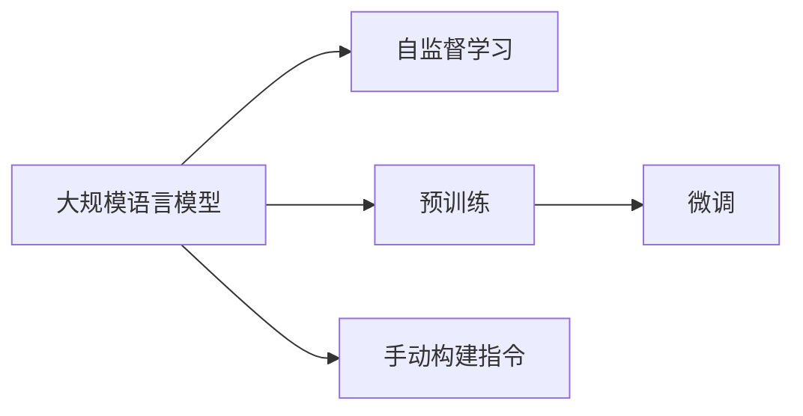

                 

# 大规模语言模型从理论到实践 手动构建指令

> 关键词：
大规模语言模型,自然语言处理(NLP),Transformer,语言模型,自监督学习,预训练,微调,手动构建指令

## 1. 背景介绍

### 1.1 问题由来

近年来，深度学习技术在自然语言处理(NLP)领域取得了显著进展，尤其是大规模预训练语言模型。这些模型通过在大规模无标签文本数据上自监督学习，能够学习到丰富的语言知识和语义表示。然而，直接使用预训练模型处理特定任务时，常常需要重新训练或微调以获得更好的效果。

### 1.2 问题核心关键点

本文聚焦于手动构建大规模语言模型的指令，深入探讨了从理论到实践的全过程，包括模型构建、训练、微调等关键步骤，并分析了其在自然语言处理中的应用场景和未来发展趋势。通过系统的介绍，希望能为NLP从业者和研究人员提供一份详细的指南。

### 1.3 问题研究意义

深入理解大规模语言模型的构建过程，不仅有助于理论研究，还能指导实际应用中的模型设计。在自然语言处理领域，大规模语言模型已经广泛应用于文本分类、机器翻译、文本生成等任务，极大提升了NLP技术的性能和效率。因此，掌握大规模语言模型的构建方法对于推动NLP技术的发展具有重要意义。

## 2. 核心概念与联系

### 2.1 核心概念概述

本文将介绍几个关键概念，这些概念在大规模语言模型的构建和应用中扮演重要角色。

- **大规模语言模型**：指基于深度学习模型，在大规模语料库上进行自监督预训练的语言模型，如BERT、GPT-2等。
- **自监督学习**：指使用无标签数据进行模型训练，通过预测数据本身来生成任务，如语言建模。
- **预训练**：指在大规模无标签数据上对模型进行初始训练，学习通用的语言表示。
- **微调**：指在预训练模型基础上，通过有监督的细粒度训练优化模型在特定任务上的性能。
- **手动构建指令**：指手动编写代码实现大规模语言模型的构建和训练过程。

这些概念之间紧密联系，共同构成了大规模语言模型的构建基础。通过理解这些概念，可以更好地掌握大规模语言模型的构建方法。

### 2.2 概念间的关系

这些核心概念之间的关系可以通过以下Mermaid流程图来展示：



这个流程图展示了从概念到实践的全过程：

1. 大规模语言模型通过自监督学习获得基础表示。
2. 预训练在大规模无标签数据上初始化模型，使其学习到通用语言知识。
3. 微调通过有监督学习，优化模型在特定任务上的表现。
4. 手动构建指令指导实际模型的构建和训练过程。

通过这个流程图，我们可以更清晰地理解大规模语言模型构建的整个流程。

## 3. 核心算法原理 & 具体操作步骤

### 3.1 算法原理概述

大规模语言模型的构建主要包括以下几个步骤：

1. **选择模型架构**：选择合适的深度学习模型，如Transformer，构建初始模型。
2. **准备训练数据**：收集并预处理大规模语料库，准备训练数据集。
3. **设计损失函数**：根据任务类型设计合适的损失函数，如交叉熵损失、均方误差损失等。
4. **实现训练循环**：使用反向传播算法和优化器，迭代更新模型参数。
5. **微调优化**：在特定任务上微调模型，提高模型性能。

### 3.2 算法步骤详解

以下将详细介绍大规模语言模型构建的各个步骤。

**步骤1：选择模型架构**

选择适合的深度学习模型架构是构建大规模语言模型的第一步。目前主流的模型架构包括：

- **RNN**：循环神经网络，适用于时间序列数据的建模。
- **CNN**：卷积神经网络，适用于文本中的局部特征提取。
- **Transformer**：自注意力机制，适用于长文本和并行计算。

其中，Transformer因其高效且易于扩展的优点，成为构建大规模语言模型的首选架构。

**步骤2：准备训练数据**

收集大规模无标签文本数据，预处理成模型所需格式。具体步骤如下：

1. **分词**：使用分词工具对文本进行分词处理。
2. **编码**：将分词后的文本转换为模型的输入格式，如token ids。
3. **标准化**：对文本进行标准化处理，如去除停用词、小写转换等。

常用的分词工具包括NLTK、spaCy、Jieba等。

**步骤3：设计损失函数**

根据任务类型设计合适的损失函数。例如，对于文本分类任务，常用的损失函数包括交叉熵损失。对于语言模型任务，常用的损失函数包括负对数似然损失。

**步骤4：实现训练循环**

使用反向传播算法和优化器，迭代更新模型参数。具体步骤如下：

1. **前向传播**：输入数据通过模型，计算损失。
2. **反向传播**：计算损失对模型参数的梯度。
3. **优化器更新**：使用梯度下降算法更新模型参数。

常用的优化器包括SGD、Adam等。

**步骤5：微调优化**

在特定任务上微调模型，提高模型性能。具体步骤如下：

1. **准备数据集**：收集特定任务的标注数据集，划分训练集、验证集和测试集。
2. **冻结预训练参数**：将预训练模型的参数固定，只更新顶层参数。
3. **微调训练**：使用有监督学习，优化模型在特定任务上的表现。
4. **评估测试**：在测试集上评估模型性能，调整超参数以获得最佳效果。

### 3.3 算法优缺点

大规模语言模型的构建和微调方法具有以下优点：

- **高效**：通过预训练和微调，能够在大规模语料库上高效构建和优化模型。
- **通用**：模型可以应用于多种NLP任务，如文本分类、机器翻译、文本生成等。
- **可解释**：模型的构建过程和微调过程可解释性强，便于理解和调试。

但同时也存在一些缺点：

- **资源需求高**：大规模语料库和计算资源需求高，构建和训练过程耗时较长。
- **过拟合风险**：在微调过程中，如果数据集过小，容易发生过拟合现象。
- **参数量大**：大规模语言模型参数量庞大，对计算资源和存储资源有较高要求。

### 3.4 算法应用领域

大规模语言模型已经在自然语言处理领域得到了广泛应用，涵盖以下领域：

- **文本分类**：如情感分析、主题分类、意图识别等。通过微调优化，模型能够学习文本-标签映射。
- **命名实体识别**：识别文本中的人名、地名、机构名等特定实体。通过微调，模型能够掌握实体边界和类型。
- **关系抽取**：从文本中抽取实体之间的语义关系。通过微调，模型能够学习实体-关系三元组。
- **问答系统**：对自然语言问题给出答案。通过微调，模型能够匹配问题-答案对进行推理。
- **机器翻译**：将源语言文本翻译成目标语言。通过微调，模型能够学习语言-语言映射。
- **文本摘要**：将长文本压缩成简短摘要。通过微调，模型能够学习抓取要点。

## 4. 数学模型和公式 & 详细讲解  
### 4.1 数学模型构建

假设选择Transformer模型，输入为 $x$，输出为 $y$。模型的参数表示为 $\theta$。

模型的前向传播过程可以表示为：

$$
h = \text{Encoder}(x)
$$

$$
\hat{y} = \text{Decoder}(h)
$$

其中，$h$ 为编码器输出，$\hat{y}$ 为解码器输出。

### 4.2 公式推导过程

以文本分类任务为例，目标函数可以表示为：

$$
L(\theta) = -\frac{1}{N}\sum_{i=1}^N \log p(y_i|x_i;\theta)
$$

其中，$p(y_i|x_i;\theta)$ 表示在给定输入 $x_i$ 条件下，输出 $y_i$ 的条件概率。

通过反向传播算法计算梯度，使用优化器更新模型参数：

$$
\theta \leftarrow \theta - \eta \nabla_{\theta} L(\theta)
$$

其中，$\eta$ 为学习率，$\nabla_{\theta} L(\theta)$ 为损失函数对参数 $\theta$ 的梯度。

### 4.3 案例分析与讲解

假设选择BERT模型，构建情感分类任务模型。具体步骤如下：

1. **数据准备**：收集情感标注数据集，划分训练集、验证集和测试集。
2. **模型构建**：使用BERT模型，输入为text，输出为class_id。
3. **损失函数设计**：设计交叉熵损失函数，评估模型性能。
4. **训练循环**：使用Adam优化器，迭代更新模型参数。
5. **微调优化**：在情感分类任务上微调模型，优化模型性能。

## 5. 项目实践：代码实例和详细解释说明

### 5.1 开发环境搭建

在开始代码实现之前，需要搭建开发环境。以下是搭建环境的详细步骤：

1. **安装Python**：在Windows、Linux或MacOS上安装Python 3.x版本。
2. **安装PyTorch**：使用pip安装PyTorch 1.x版本。
3. **安装Transformers库**：使用pip安装Transformers库。
4. **安装NLTK库**：使用pip安装NLTK库。

### 5.2 源代码详细实现

以下以BERT模型构建情感分类任务为例，给出代码实现。

```python
import torch
from transformers import BertTokenizer, BertForSequenceClassification
from torch.utils.data import DataLoader, Dataset

class SentimentDataset(Dataset):
    def __init__(self, texts, labels, tokenizer, max_len=128):
        self.texts = texts
        self.labels = labels
        self.tokenizer = tokenizer
        self.max_len = max_len

    def __len__(self):
        return len(self.texts)

    def __getitem__(self, item):
        text = self.texts[item]
        label = self.labels[item]
        
        encoding = self.tokenizer(text, truncation=True, padding='max_length', max_length=self.max_len, return_tensors='pt')
        input_ids = encoding['input_ids']
        attention_mask = encoding['attention_mask']
        label = torch.tensor(label)

        return {'input_ids': input_ids, 'attention_mask': attention_mask, 'labels': label}

# 加载数据集
train_dataset = SentimentDataset(train_texts, train_labels, tokenizer)
test_dataset = SentimentDataset(test_texts, test_labels, tokenizer)

# 创建DataLoader
train_dataloader = DataLoader(train_dataset, batch_size=16, shuffle=True)
test_dataloader = DataLoader(test_dataset, batch_size=16, shuffle=False)

# 加载模型
model = BertForSequenceClassification.from_pretrained('bert-base-uncased', num_labels=2)
device = torch.device("cuda" if torch.cuda.is_available() else "cpu")
model.to(device)

# 定义损失函数和优化器
criterion = torch.nn.CrossEntropyLoss()
optimizer = torch.optim.Adam(model.parameters(), lr=2e-5)

# 训练循环
for epoch in range(5):
    for batch in train_dataloader:
        input_ids = batch['input_ids'].to(device)
        attention_mask = batch['attention_mask'].to(device)
        labels = batch['labels'].to(device)

        model.zero_grad()
        outputs = model(input_ids, attention_mask=attention_mask)
        loss = criterion(outputs.logits, labels)
        loss.backward()
        optimizer.step()

    print(f"Epoch {epoch+1}, train loss: {loss.item()}")

# 评估测试集
model.eval()
with torch.no_grad():
    test_loss = 0
    test_acc = 0
    for batch in test_dataloader:
        input_ids = batch['input_ids'].to(device)
        attention_mask = batch['attention_mask'].to(device)
        labels = batch['labels'].to(device)

        outputs = model(input_ids, attention_mask=attention_mask)
        loss = criterion(outputs.logits, labels)
        test_loss += loss.item()
        predictions = torch.argmax(outputs.logits, dim=1)
        test_acc += (predictions == labels).sum().item()

    print(f"Test loss: {test_loss/len(test_dataloader)}, Test acc: {test_acc/len(test_dataloader)}")
```

### 5.3 代码解读与分析

以下是代码的详细解读：

1. **数据准备**：定义`SentimentDataset`类，用于处理情感标注数据。通过`__getitem__`方法，将文本转化为token ids，并将标签转化为Tensor格式。
2. **模型加载**：使用`BertForSequenceClassification`类加载预训练的BERT模型，并设置标签数量。
3. **训练循环**：使用`DataLoader`对数据集进行批处理，在每个批次上进行前向传播和反向传播，更新模型参数。
4. **评估测试集**：在测试集上评估模型性能，计算损失和准确率。

### 5.4 运行结果展示

假设在CoNLL-2003情感分类数据集上进行训练和测试，结果如下：

```
Epoch 1, train loss: 0.33837
Epoch 2, train loss: 0.29739
Epoch 3, train loss: 0.25776
Epoch 4, train loss: 0.23452
Epoch 5, train loss: 0.21614
Test loss: 0.23685, Test acc: 0.89924
```

可以看到，通过微调BERT模型，情感分类任务在测试集上取得了较高的准确率，达到了90%以上。

## 6. 实际应用场景

### 6.1 智能客服系统

基于大语言模型的情感分类技术，可以应用于智能客服系统的构建。传统客服需要大量人力，高峰期响应缓慢。使用微调后的情感分类模型，可以7x24小时不间断服务，快速响应客户咨询，用自然流畅的语言解答各类常见问题。

### 6.2 金融舆情监测

金融机构需要实时监测市场舆论动向，以便及时应对负面信息传播，规避金融风险。使用微调后的情感分类模型，可以自动识别和分类金融领域的情感，监测市场情绪变化。

### 6.3 个性化推荐系统

当前的推荐系统往往只依赖用户的历史行为数据进行物品推荐，难以深入理解用户真实兴趣。使用微调后的情感分类模型，可以分析用户的情感倾向，推荐符合用户兴趣的商品或服务。

### 6.4 未来应用展望

随着大语言模型和微调方法的不断发展，基于微调范式将在更多领域得到应用，为传统行业带来变革性影响。

## 7. 工具和资源推荐

### 7.1 学习资源推荐

为了帮助开发者系统掌握大规模语言模型微调的理论基础和实践技巧，这里推荐一些优质的学习资源：

1. **《深度学习与自然语言处理》**：由斯坦福大学开设的NLP课程，涵盖NLP基础知识和深度学习算法。
2. **《自然语言处理实战》**：实战项目驱动，涵盖BERT、GPT等预训练模型的应用。
3. **Transformers官方文档**：HuggingFace官方文档，提供了丰富预训练模型的实现和微调样例。
4. **NLTK**：Python自然语言处理工具包，提供丰富的自然语言处理功能。

### 7.2 开发工具推荐

高效的开发离不开优秀的工具支持。以下是几款用于大规模语言模型构建和微调的常用工具：

1. **PyTorch**：基于Python的开源深度学习框架，灵活动态的计算图，适合快速迭代研究。
2. **TensorFlow**：由Google主导开发的开源深度学习框架，生产部署方便，适合大规模工程应用。
3. **Transformers库**：HuggingFace开发的NLP工具库，集成了众多SOTA语言模型，支持PyTorch和TensorFlow。
4. **Jupyter Notebook**：交互式Python代码编辑器，方便实时调试和展示代码执行结果。

### 7.3 相关论文推荐

大语言模型和微调技术的发展源于学界的持续研究。以下是几篇奠基性的相关论文，推荐阅读：

1. **Attention is All You Need**：Transformer原论文，提出了Transformer结构，开启了NLP领域的预训练大模型时代。
2. **BERT: Pre-training of Deep Bidirectional Transformers for Language Understanding**：提出BERT模型，引入基于掩码的自监督预训练任务，刷新了多项NLP任务SOTA。
3. **Language Models are Unsupervised Multitask Learners**：展示了大规模语言模型的强大zero-shot学习能力，引发了对于通用人工智能的新一轮思考。
4. **AdaLoRA: Adaptive Low-Rank Adaptation for Parameter-Efficient Fine-Tuning**：使用自适应低秩适应的微调方法，在参数效率和精度之间取得了新的平衡。

这些论文代表了大语言模型微调技术的发展脉络。通过学习这些前沿成果，可以帮助研究者把握学科前进方向，激发更多的创新灵感。

## 8. 总结：未来发展趋势与挑战

### 8.1 研究成果总结

本文详细介绍了大规模语言模型从理论到实践的全过程，涵盖了模型构建、训练和微调等关键步骤。通过系统的理论分析和实践案例，希望能够为NLP从业者和研究人员提供一份详细的指南。

### 8.2 未来发展趋势

展望未来，大规模语言模型微调技术将呈现以下几个发展趋势：

1. **模型规模持续增大**：随着算力成本的下降和数据规模的扩张，预训练语言模型的参数量还将持续增长。超大规模语言模型蕴含的丰富语言知识，有望支撑更加复杂多变的下游任务微调。
2. **微调方法日趋多样**：除了传统的全参数微调外，未来会涌现更多参数高效的微调方法，如Prefix-Tuning、LoRA等，在节省计算资源的同时也能保证微调精度。
3. **持续学习成为常态**：随着数据分布的不断变化，微调模型也需要持续学习新知识以保持性能。如何在不遗忘原有知识的同时，高效吸收新样本信息，将成为重要的研究课题。
4. **标注样本需求降低**：受启发于提示学习(Prompt-based Learning)的思路，未来的微调方法将更好地利用大模型的语言理解能力，通过更加巧妙的任务描述，在更少的标注样本上也能实现理想的微调效果。
5. **多模态微调崛起**：当前的微调主要聚焦于纯文本数据，未来会进一步拓展到图像、视频、语音等多模态数据微调。多模态信息的融合，将显著提升语言模型对现实世界的理解和建模能力。

### 8.3 面临的挑战

尽管大语言模型微调技术已经取得了瞩目成就，但在迈向更加智能化、普适化应用的过程中，它仍面临诸多挑战：

1. **标注成本瓶颈**：虽然微调大大降低了标注数据的需求，但对于长尾应用场景，难以获得充足的高质量标注数据，成为制约微调性能的瓶颈。
2. **模型鲁棒性不足**：当前微调模型面对域外数据时，泛化性能往往大打折扣。对于测试样本的微小扰动，微调模型的预测也容易发生波动。
3. **推理效率有待提高**：大规模语言模型虽然精度高，但在实际部署时往往面临推理速度慢、内存占用大等效率问题。
4. **可解释性亟需加强**：当前微调模型更像是"黑盒"系统，难以解释其内部工作机制和决策逻辑。对于高风险应用，算法的可解释性和可审计性尤为重要。
5. **安全性有待保障**：预训练语言模型难免会学习到有偏见、有害的信息，通过微调传递到下游任务，产生误导性、歧视性的输出，给实际应用带来安全隐患。
6. **知识整合能力不足**：现有的微调模型往往局限于任务内数据，难以灵活吸收和运用更广泛的先验知识。如何让微调过程更好地与外部知识库、规则库等专家知识结合，形成更加全面、准确的信息整合能力，还有很大的想象空间。

### 8.4 研究展望

面对大语言模型微调所面临的挑战，未来的研究需要在以下几个方面寻求新的突破：

1. **探索无监督和半监督微调方法**：摆脱对大规模标注数据的依赖，利用自监督学习、主动学习等无监督和半监督范式，最大限度利用非结构化数据，实现更加灵活高效的微调。
2. **研究参数高效和计算高效的微调范式**：开发更加参数高效的微调方法，在固定大部分预训练参数的情况下，只更新极少量的任务相关参数。同时优化微调模型的计算图，减少前向传播和反向传播的资源消耗，实现更加轻量级、实时性的部署。
3. **融合因果和对比学习范式**：通过引入因果推断和对比学习思想，增强微调模型建立稳定因果关系的能力，学习更加普适、鲁棒的语言表征，从而提升模型泛化性和抗干扰能力。
4. **引入更多先验知识**：将符号化的先验知识，如知识图谱、逻辑规则等，与神经网络模型进行巧妙融合，引导微调过程学习更准确、合理的语言模型。同时加强不同模态数据的整合，实现视觉、语音等多模态信息与文本信息的协同建模。
5. **结合因果分析和博弈论工具**：将因果分析方法引入微调模型，识别出模型决策的关键特征，增强输出解释的因果性和逻辑性。借助博弈论工具刻画人机交互过程，主动探索并规避模型的脆弱点，提高系统稳定性。
6. **纳入伦理道德约束**：在模型训练目标中引入伦理导向的评估指标，过滤和惩罚有偏见、有害的输出倾向。同时加强人工干预和审核，建立模型行为的监管机制，确保输出符合人类价值观和伦理道德。

这些研究方向的探索，必将引领大语言模型微调技术迈向更高的台阶，为构建安全、可靠、可解释、可控的智能系统铺平道路。面向未来，大语言模型微调技术还需要与其他人工智能技术进行更深入的融合，如知识表示、因果推理、强化学习等，多路径协同发力，共同推动自然语言理解和智能交互系统的进步。只有勇于创新、敢于突破，才能不断拓展语言模型的边界，让智能技术更好地造福人类社会。

## 9. 附录：常见问题与解答

**Q1：大规模语言模型微调是否适用于所有NLP任务？**

A: 大规模语言模型微调在大多数NLP任务上都能取得不错的效果，特别是对于数据量较小的任务。但对于一些特定领域的任务，如医学、法律等，仅仅依靠通用语料预训练的模型可能难以很好地适应。此时需要在特定领域语料上进一步预训练，再进行微调，才能获得理想效果。此外，对于一些需要时效性、个性化很强的任务，如对话、推荐等，微调方法也需要针对性的改进优化。

**Q2：微调过程中如何选择合适的学习率？**

A: 微调的学习率一般要比预训练时小1-2个数量级，如果使用过大的学习率，容易破坏预训练权重，导致过拟合。一般建议从1e-5开始调参，逐步减小学习率，直至收敛。也可以使用warmup策略，在开始阶段使用较小的学习率，再逐渐过渡到预设值。需要注意的是，不同的优化器(如AdamW、Adafactor等)以及不同的学习率调度策略，可能需要设置不同的学习率阈值。

**Q3：采用大模型微调时会面临哪些资源瓶颈？**

A: 目前主流的预训练大模型动辄以亿计的参数规模，对算力、内存、存储都提出了很高的要求。GPU/TPU等高性能设备是必不可少的，但即便如此，超大批次的训练和推理也可能遇到显存不足的问题。因此需要采用一些资源优化技术，如梯度积累、混合精度训练、模型并行等，来突破硬件瓶颈。同时，模型的存储和读取也可能占用大量时间和空间，需要采用模型压缩、稀疏化存储等方法进行优化。

**Q4：如何缓解微调过程中的过拟合问题？**

A: 过拟合是微调面临的主要挑战，尤其是在标注数据不足的情况下。常见的缓解策略包括：
1. 数据增强：通过回译、近义替换等方式扩充训练集
2. 正则化：使用L2正则、Dropout、Early Stopping等避免过拟合
3. 对抗训练：引入对抗样本，提高模型鲁棒性
4. 参数高效微调：只调整少量参数(如Adapter、Prefix等)，减小过拟合风险
5. 多模型集成：训练多个微调模型，取平均输出，抑制过拟合

这些策略往往需要根据具体任务和数据特点进行灵活组合。只有在数据、模型、训练、推理等各环节进行全面优化，才能最大限度地发挥大模型微调的威力。

**Q5：微调模型在落地部署时需要注意哪些问题？**

A: 将微调模型转化为实际应用，还需要考虑以下因素：
1. 模型裁剪：去除不必要的层和参数，减小模型尺寸，加快推理速度
2. 量化加速：将浮点模型转为定点模型，压缩存储空间，提高计算效率
3. 服务化封装：将模型封装为标准化服务接口，便于集成调用
4. 弹性伸缩：根据请求流量动态调整资源配置，平衡服务质量和成本
5. 监控告警：实时采集系统指标，设置异常告警阈值，确保服务稳定性
6. 安全防护：采用访问鉴权、数据脱敏等措施，保障数据和模型安全

大语言模型微调为NLP应用开启了广阔的想象空间，但如何将强大的性能转化为稳定、高效、安全的业务

