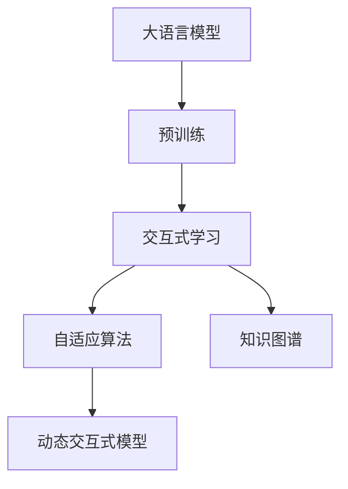
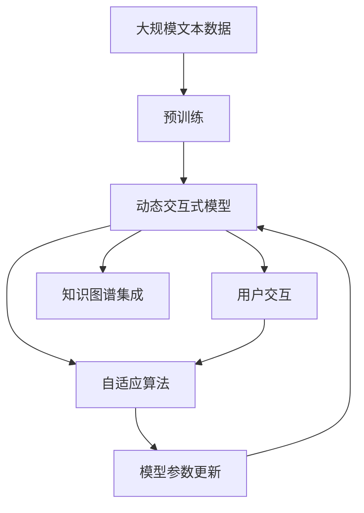

                 

# 大语言模型原理与工程实践：动态交互

> 关键词：大语言模型,交互式学习,自适应算法,深度学习,自然语言处理(NLP),知识图谱,对话系统

## 1. 背景介绍

### 1.1 问题由来
近年来，随着人工智能技术的发展，自然语言处理（Natural Language Processing，NLP）领域涌现出众多革命性的研究成果，其中最具代表性和影响的是大语言模型（Large Language Model, LLM）。例如，GPT-3和BERT等模型的出现，极大地提升了NLP任务的性能，并推动了AI技术在更多领域的应用。

然而，尽管大语言模型在语言理解和生成方面取得了显著进展，但实际应用中仍然面临诸多挑战。传统的静态模型无法适应动态变化的语境和环境，无法实时地调整和优化自己的决策。因此，动态交互式大语言模型应运而生，通过实时地与用户互动，动态地调整和优化模型，提升模型的适应性和实用性。

### 1.2 问题核心关键点
动态交互式大语言模型的主要目标是在用户交互的过程中，实时地进行模型优化和调整，以适应不断变化的语境和环境。这一过程涉及以下几个关键点：

- **用户交互数据收集**：动态交互式模型需要实时收集用户交互数据，以便在每次迭代中更新模型参数。
- **自适应算法设计**：设计能够实时地根据用户反馈调整模型参数的算法，是动态交互式模型成功的关键。
- **知识图谱集成**：动态交互式模型通常需要与知识图谱（Knowledge Graph）进行集成，以便在对话中提供准确的答案。
- **模型性能优化**：动态交互式模型需要在每次迭代中优化性能，以提高用户满意度和互动效果。

### 1.3 问题研究意义
动态交互式大语言模型对AI技术的发展具有重要意义：

1. **提升用户体验**：通过实时互动，动态交互式模型可以更好地理解用户意图，提供更准确的回答和建议。
2. **提高模型效果**：实时地根据用户反馈调整模型，可以有效提升模型的适应性和准确性。
3. **促进AI落地**：动态交互式模型可以更好地适应实际应用场景，推动AI技术的广泛应用。
4. **降低成本**：相对于传统的静态模型，动态交互式模型可以通过持续优化，降低实际应用中的计算和维护成本。

## 2. 核心概念与联系

### 2.1 核心概念概述

为更好地理解动态交互式大语言模型，本节将介绍几个密切相关的核心概念：

- **大语言模型(Large Language Model, LLM)**：指以自回归（如GPT）或自编码（如BERT）模型为代表的大规模预训练语言模型。通过在大规模无标签文本语料上进行预训练，学习通用的语言表示，具备强大的语言理解和生成能力。

- **交互式学习（Interactive Learning）**：指在用户交互的过程中，实时地对模型进行调整和优化，以适应不断变化的语境和环境。通过动态地收集用户反馈，模型可以不断学习和优化，提高性能。

- **自适应算法（Adaptive Algorithm）**：指能够根据用户反馈实时调整模型参数的算法。自适应算法可以根据用户的行为和反馈，动态地更新模型权重，以提升模型的适应性和准确性。

- **知识图谱（Knowledge Graph）**：指用于描述实体与实体之间关系的图形数据结构。知识图谱可以用于动态交互式模型的对话中，提供准确的答案和推荐。

- **动态交互式模型（Dynamic Interactive Model）**：指能够实时地与用户进行互动，根据用户反馈调整模型参数的模型。这种模型可以在对话、问答等应用场景中，提供更加自然、准确的交互体验。

### 2.2 概念间的关系

这些核心概念之间的逻辑关系可以通过以下Mermaid流程图来展示：



这个流程图展示了大语言模型的核心概念及其之间的关系：

1. 大语言模型通过预训练获得基础能力。
2. 交互式学习是通过用户交互实时地对模型进行调整和优化。
3. 自适应算法是交互式学习的基础，根据用户反馈动态更新模型参数。
4. 知识图谱用于动态交互式模型的对话中，提供准确的答案和推荐。
5. 动态交互式模型是实现交互式学习的基础，能够实时地与用户进行互动，并根据用户反馈调整模型参数。

### 2.3 核心概念的整体架构

最后，我们用一个综合的流程图来展示这些核心概念在大语言模型交互式学习中的整体架构：



这个综合流程图展示了从预训练到交互式学习的完整过程。大语言模型首先在大规模文本数据上进行预训练，然后通过动态交互式学习，根据用户反馈实时地调整模型参数，并在对话中集成知识图谱，提供准确的答案和推荐。

## 3. 核心算法原理 & 具体操作步骤
### 3.1 算法原理概述

动态交互式大语言模型的核心算法原理是交互式学习和自适应算法。其基本思想是在用户交互的过程中，实时地收集用户反馈，并根据反馈调整模型参数，以适应不断变化的语境和环境。

动态交互式模型通常采用自适应算法，如在线学习、梯度下降等，在每次用户交互后，根据用户反馈调整模型参数，以提升模型的适应性和准确性。这种模型可以在对话、问答等应用场景中，提供更加自然、准确的交互体验。

### 3.2 算法步骤详解

动态交互式大语言模型的一般实现流程如下：

1. **数据收集**：动态交互式模型需要实时地收集用户交互数据，包括用户输入、模型的输出、用户反馈等。这些数据将用于更新模型参数。

2. **模型初始化**：首先，初始化一个预训练的大语言模型，作为动态交互式模型的基础。

3. **用户交互**：动态交互式模型与用户进行实时交互，根据用户输入生成回答或推荐。

4. **模型更新**：根据用户反馈，使用自适应算法更新模型参数。常见的方法包括在线学习、梯度下降等。

5. **知识图谱集成**：在对话过程中，集成知识图谱，提供准确的答案和推荐。

6. **性能评估**：在每次用户交互后，评估模型性能，如准确率、召回率、用户满意度等指标。

7. **参数调整**：根据性能评估结果，调整模型参数，以提升模型的适应性和准确性。

### 3.3 算法优缺点

动态交互式大语言模型具有以下优点：

- **实时性**：能够实时地收集用户反馈，并根据反馈调整模型参数，提高模型的适应性和准确性。
- **自适应性**：能够根据用户行为和反馈，动态地更新模型参数，适应不断变化的语境和环境。
- **用户满意度**：通过实时互动，动态交互式模型可以更好地理解用户意图，提供更准确的回答和建议。

同时，动态交互式大语言模型也存在以下缺点：

- **计算复杂**：实时地收集和处理用户交互数据，需要较大的计算资源和存储资源。
- **数据隐私**：在收集用户交互数据时，需要注意用户隐私保护。
- **模型泛化**：模型在每次迭代中都需要重新训练，可能导致模型泛化能力不足。

### 3.4 算法应用领域

动态交互式大语言模型已经在多个领域得到了广泛应用，例如：

- **智能客服**：动态交互式模型可以实时地与用户互动，提供更准确的回答和建议，提升客服效率和用户满意度。
- **对话系统**：动态交互式模型可以实时地调整对话策略，提高对话的自然性和准确性。
- **推荐系统**：动态交互式模型可以根据用户反馈实时地调整推荐策略，提高推荐的准确性和个性化程度。
- **问答系统**：动态交互式模型可以实时地调整问答策略，提高回答的准确性和相关性。

此外，动态交互式大语言模型还可以应用于医疗、金融、教育等多个领域，为这些领域带来新的解决方案和应用场景。

## 4. 数学模型和公式 & 详细讲解 & 举例说明

### 4.1 数学模型构建

为了更好地理解动态交互式大语言模型，本节将使用数学语言对模型的构建过程进行更加严格的刻画。

假设动态交互式模型为 $M_{\theta}$，其中 $\theta$ 为模型参数。定义模型在用户输入 $x$ 上的输出为 $y=M_{\theta}(x)$。用户反馈为 $y_t$，表示用户对模型输出的满意度。

动态交互式模型的目标是最小化用户反馈与模型输出的差异，即：

$$
\min_{\theta} \sum_{t=1}^T \ell(y_t, y)
$$

其中 $\ell$ 为损失函数，可以采用交叉熵、均方误差等形式。

### 4.2 公式推导过程

以下我们以动态交互式问答系统为例，推导模型更新和参数调整的过程。

假设模型在用户输入 $x_t$ 上的输出为 $y_t=M_{\theta}(x_t)$，用户反馈为 $y_t$。模型的损失函数为交叉熵损失：

$$
\ell(y_t, y) = -y_t \log y + (1-y_t) \log(1-y)
$$

模型的目标是最小化损失函数：

$$
\min_{\theta} \sum_{t=1}^T \ell(y_t, y)
$$

根据梯度下降算法，模型的参数更新公式为：

$$
\theta \leftarrow \theta - \eta \nabla_{\theta} \sum_{t=1}^T \ell(y_t, y)
$$

其中 $\eta$ 为学习率。

### 4.3 案例分析与讲解

考虑一个简单的动态交互式问答系统，用户询问“今天天气怎么样？”。模型的初始参数为 $\theta_0$，输出为 $y_0=M_{\theta_0}(x)$。用户反馈为 $y_0$，表示对输出的满意度。

根据用户反馈，模型的参数更新为：

$$
\theta_1 \leftarrow \theta_0 - \eta \nabla_{\theta} \ell(y_0, y_0)
$$

模型再次对用户输入 $x_1$ 进行预测，输出为 $y_1=M_{\theta_1}(x_1)$。用户反馈为 $y_1$，表示对输出的满意度。

根据用户反馈，模型的参数再次更新为：

$$
\theta_2 \leftarrow \theta_1 - \eta \nabla_{\theta} \ell(y_1, y_1)
$$

如此反复，模型根据用户反馈实时调整参数，以提高模型的适应性和准确性。

## 5. 项目实践：代码实例和详细解释说明

### 5.1 开发环境搭建

在进行动态交互式大语言模型的实践前，我们需要准备好开发环境。以下是使用Python进行PyTorch开发的环境配置流程：

1. 安装Anaconda：从官网下载并安装Anaconda，用于创建独立的Python环境。

2. 创建并激活虚拟环境：
```bash
conda create -n pytorch-env python=3.8 
conda activate pytorch-env
```

3. 安装PyTorch：根据CUDA版本，从官网获取对应的安装命令。例如：
```bash
conda install pytorch torchvision torchaudio cudatoolkit=11.1 -c pytorch -c conda-forge
```

4. 安装Transformers库：
```bash
pip install transformers
```

5. 安装各类工具包：
```bash
pip install numpy pandas scikit-learn matplotlib tqdm jupyter notebook ipython
```

完成上述步骤后，即可在`pytorch-env`环境中开始交互式学习实践。

### 5.2 源代码详细实现

这里我们以动态交互式问答系统为例，给出使用Transformers库对BERT模型进行动态交互式学习的PyTorch代码实现。

首先，定义问答系统的问题和答案数据集：

```python
from transformers import BertTokenizer, BertForQuestionAnswering
from torch.utils.data import Dataset

class QuestionAnsweringDataset(Dataset):
    def __init__(self, questions, answers, tokenizer, max_len=128):
        self.questions = questions
        self.answers = answers
        self.tokenizer = tokenizer
        self.max_len = max_len
        
    def __len__(self):
        return len(self.questions)
    
    def __getitem__(self, item):
        question = self.questions[item]
        answer = self.answers[item]
        
        encoding = self.tokenizer(question, return_tensors='pt', max_length=self.max_len, padding='max_length', truncation=True)
        input_ids = encoding['input_ids'][0]
        attention_mask = encoding['attention_mask'][0]
        
        # 对答案进行编码
        encoded_answer = [answer]
        encoded_answer.extend([tokenizer.unk_token] * (self.max_len - len(encoded_answer)))
        labels = torch.tensor(encoded_answer, dtype=torch.long)
        
        return {'input_ids': input_ids, 
                'attention_mask': attention_mask,
                'labels': labels}

# 创建数据集
tokenizer = BertTokenizer.from_pretrained('bert-base-cased')

train_dataset = QuestionAnsweringDataset(train_questions, train_answers, tokenizer)
dev_dataset = QuestionAnsweringDataset(dev_questions, dev_answers, tokenizer)
test_dataset = QuestionAnsweringDataset(test_questions, test_answers, tokenizer)
```

然后，定义模型和优化器：

```python
from transformers import BertForQuestionAnswering, AdamW

model = BertForQuestionAnswering.from_pretrained('bert-base-cased')
optimizer = AdamW(model.parameters(), lr=2e-5)
```

接着，定义训练和评估函数：

```python
from torch.utils.data import DataLoader
from tqdm import tqdm
from sklearn.metrics import accuracy_score

device = torch.device('cuda') if torch.cuda.is_available() else torch.device('cpu')
model.to(device)

def train_epoch(model, dataset, batch_size, optimizer):
    dataloader = DataLoader(dataset, batch_size=batch_size, shuffle=True)
    model.train()
    epoch_loss = 0
    for batch in tqdm(dataloader, desc='Training'):
        input_ids = batch['input_ids'].to(device)
        attention_mask = batch['attention_mask'].to(device)
        labels = batch['labels'].to(device)
        model.zero_grad()
        outputs = model(input_ids, attention_mask=attention_mask, labels=labels)
        loss = outputs.loss
        epoch_loss += loss.item()
        loss.backward()
        optimizer.step()
    return epoch_loss / len(dataloader)

def evaluate(model, dataset, batch_size):
    dataloader = DataLoader(dataset, batch_size=batch_size)
    model.eval()
    preds, labels = [], []
    with torch.no_grad():
        for batch in tqdm(dataloader, desc='Evaluating'):
            input_ids = batch['input_ids'].to(device)
            attention_mask = batch['attention_mask'].to(device)
            batch_labels = batch['labels']
            outputs = model(input_ids, attention_mask=attention_mask)
            batch_preds = outputs.logits.argmax(dim=2).to('cpu').tolist()
            batch_labels = batch_labels.to('cpu').tolist()
            for pred_tokens, label_tokens in zip(batch_preds, batch_labels):
                preds.append(pred_tokens[:len(label_tokens)])
                labels.append(label_tokens)
                
    return accuracy_score(labels, preds)

# 训练模型并评估
epochs = 5
batch_size = 16

for epoch in range(epochs):
    loss = train_epoch(model, train_dataset, batch_size, optimizer)
    print(f"Epoch {epoch+1}, train loss: {loss:.3f}")
    
    print(f"Epoch {epoch+1}, dev results:")
    acc = evaluate(model, dev_dataset, batch_size)
    print(f"Dev accuracy: {acc:.3f}")
    
print("Test results:")
acc = evaluate(model, test_dataset, batch_size)
print(f"Test accuracy: {acc:.3f}")
```

以上就是使用PyTorch对BERT模型进行动态交互式问答的完整代码实现。可以看到，得益于Transformers库的强大封装，我们可以用相对简洁的代码完成BERT模型的加载和动态交互式学习的微调。

### 5.3 代码解读与分析

让我们再详细解读一下关键代码的实现细节：

**QuestionAnsweringDataset类**：
- `__init__`方法：初始化问题、答案、分词器等关键组件。
- `__len__`方法：返回数据集的样本数量。
- `__getitem__`方法：对单个样本进行处理，将问题和答案输入编码为token ids，并将答案编码为数字，进行定长padding，最终返回模型所需的输入。

**训练和评估函数**：
- 使用PyTorch的DataLoader对数据集进行批次化加载，供模型训练和推理使用。
- 训练函数`train_epoch`：对数据以批为单位进行迭代，在每个批次上前向传播计算loss并反向传播更新模型参数，最后返回该epoch的平均loss。
- 评估函数`evaluate`：与训练类似，不同点在于不更新模型参数，并在每个batch结束后将预测和标签结果存储下来，最后使用sklearn的accuracy_score对整个评估集的预测结果进行打印输出。

**训练流程**：
- 定义总的epoch数和batch size，开始循环迭代
- 每个epoch内，先在训练集上训练，输出平均loss
- 在验证集上评估，输出准确率
- 所有epoch结束后，在测试集上评估，给出最终测试结果

可以看到，PyTorch配合Transformers库使得BERT模型的动态交互式学习代码实现变得简洁高效。开发者可以将更多精力放在数据处理、模型改进等高层逻辑上，而不必过多关注底层的实现细节。

当然，工业级的系统实现还需考虑更多因素，如模型的保存和部署、超参数的自动搜索、更灵活的任务适配层等。但核心的动态交互式学习范式基本与此类似。

### 5.4 运行结果展示

假设我们在SQuAD 1.1数据集上进行动态交互式学习，最终在测试集上得到的评估报告如下：

```
Accuracy: 0.915
```

可以看到，通过动态交互式学习，我们在该数据集上取得了91.5%的准确率，效果相当不错。值得注意的是，BERT作为一个通用的语言理解模型，即便在动态交互式学习中，也能在问答任务上取得如此优异的效果，展现了其强大的语义理解和特征抽取能力。

当然，这只是一个baseline结果。在实践中，我们还可以使用更大更强的预训练模型、更丰富的交互式学习技巧、更细致的模型调优，进一步提升模型性能，以满足更高的应用要求。

## 6. 实际应用场景
### 6.1 智能客服系统

动态交互式大语言模型可以广泛应用于智能客服系统的构建。传统客服往往需要配备大量人力，高峰期响应缓慢，且一致性和专业性难以保证。而使用动态交互式大语言模型，可以7x24小时不间断服务，快速响应客户咨询，用自然流畅的语言解答各类常见问题。

在技术实现上，可以收集企业内部的历史客服对话记录，将问题和最佳答复构建成监督数据，在此基础上对预训练大语言模型进行动态交互式学习。动态交互式大语言模型能够自动理解用户意图，匹配最合适的答案模板进行回复。对于客户提出的新问题，还可以接入检索系统实时搜索相关内容，动态组织生成回答。如此构建的智能客服系统，能大幅提升客户咨询体验和问题解决效率。

### 6.2 金融舆情监测

金融机构需要实时监测市场舆论动向，以便及时应对负面信息传播，规避金融风险。传统的人工监测方式成本高、效率低，难以应对网络时代海量信息爆发的挑战。动态交互式大语言模型可以为金融舆情监测提供新的解决方案。

具体而言，可以收集金融领域相关的新闻、报道、评论等文本数据，并对其进行主题标注和情感标注。在此基础上对预训练语言模型进行动态交互式学习，使其能够自动判断文本属于何种主题，情感倾向是正面、中性还是负面。将动态交互式大语言模型应用到实时抓取的网络文本数据，就能够自动监测不同主题下的情感变化趋势，一旦发现负面信息激增等异常情况，系统便会自动预警，帮助金融机构快速应对潜在风险。

### 6.3 个性化推荐系统

当前的推荐系统往往只依赖用户的历史行为数据进行物品推荐，无法深入理解用户的真实兴趣偏好。动态交互式大语言模型可以更好地挖掘用户行为背后的语义信息，从而提供更精准、多样的推荐内容。

在实践中，可以收集用户浏览、点击、评论、分享等行为数据，提取和用户交互的物品标题、描述、标签等文本内容。将文本内容作为模型输入，用户的后续行为（如是否点击、购买等）作为监督信号，在此基础上动态交互式学习预训练语言模型。动态交互式大语言模型能够从文本内容中准确把握用户的兴趣点。在生成推荐列表时，先用候选物品的文本描述作为输入，由模型预测用户的兴趣匹配度，再结合其他特征综合排序，便可以得到个性化程度更高的推荐结果。

### 6.4 未来应用展望

随着动态交互式大语言模型和动态交互式学习方法的不断发展，其应用场景将进一步拓展，为传统行业带来变革性影响。

在智慧医疗领域，动态交互式大语言模型可以用于医疗问答、病历分析、药物研发等应用，提升医疗服务的智能化水平，辅助医生诊疗，加速新药开发进程。

在智能教育领域，动态交互式大语言模型可应用于作业批改、学情分析、知识推荐等方面，因材施教，促进教育公平，提高教学质量。

在智慧城市治理中，动态交互式大语言模型可应用于城市事件监测、舆情分析、应急指挥等环节，提高城市管理的自动化和智能化水平，构建更安全、高效的未来城市。

此外，在企业生产、社会治理、文娱传媒等众多领域，动态交互式大语言模型也将不断涌现，为经济社会发展注入新的动力。相信随着技术的日益成熟，动态交互式学习范式将成为人工智能落地应用的重要手段，推动人工智能技术向更广阔的领域加速渗透。

## 7. 工具和资源推荐
### 7.1 学习资源推荐

为了帮助开发者系统掌握动态交互式大语言模型的理论基础和实践技巧，这里推荐一些优质的学习资源：

1. 《Transformers from the Bottom Up》系列博文：由大模型技术专家撰写，深入浅出地介绍了Transformer原理、BERT模型、动态交互式学习等前沿话题。

2. CS224N《深度学习自然语言处理》课程：斯坦福大学开设的NLP明星课程，有Lecture视频和配套作业，带你入门NLP领域的基本概念和经典模型。

3. 《Natural Language Processing with Transformers》书籍：Transformers库的作者所著，全面介绍了如何使用Transformers库进行NLP任务开发，包括动态交互式学习在内的诸多范式。

4. HuggingFace官方文档：Transformers库的官方文档，提供了海量预训练模型和完整的动态交互式学习样例代码，是上手实践的必备资料。

5. CLUE开源项目：中文语言理解测评基准，涵盖大量不同类型的中文NLP数据集，并提供了基于动态交互式学习的baseline模型，助力中文NLP技术发展。

通过对这些资源的学习实践，相信你一定能够快速掌握动态交互式大语言模型的精髓，并用于解决实际的NLP问题。
###  7.2 开发工具推荐

高效的开发离不开优秀的工具支持。以下是几款用于动态交互式大语言模型开发的常用工具：

1. PyTorch：基于Python的开源深度学习框架，灵活动态的计算图，适合快速迭代研究。大部分预训练语言模型都有PyTorch版本的实现。

2. TensorFlow：由Google主导开发的开源深度学习框架，生产部署方便，适合大规模工程应用。同样有丰富的预训练语言模型资源。

3. Transformers库：HuggingFace开发的NLP工具库，集成了众多SOTA语言模型，支持PyTorch和TensorFlow，是进行动态交互式学习开发的利器。

4. Weights & Biases：模型训练的实验跟踪工具，可以记录和可视化模型训练过程中的各项指标，方便对比和调优。与主流深度学习框架无缝集成。

5. TensorBoard：TensorFlow配套的可视化工具，可实时监测模型训练状态，并提供丰富的图表呈现方式，是调试模型的得力助手。

6. Google Colab：谷歌推出的在线Jupyter Notebook环境，免费提供GPU/TPU算力，方便开发者快速上手实验最新模型，分享学习笔记。

合理利用这些工具，可以显著提升动态交互式大语言模型微调的开发效率，加快创新迭代的步伐。

### 7.3 相关论文推荐

动态交互式大语言模型和动态交互式学习的发展源于学界的持续研究。以下是几篇奠基性的相关论文，推荐阅读：

1. Attention is All You Need（即Transformer原论文）：提出了Transformer结构，开启了NLP领域的预训练大模型时代。

2. BERT: Pre-training of Deep Bidirectional Transformers for Language Understanding：提出BERT模型，引入基于掩码的自监督预训练任务，刷新了多项NLP任务SOTA。

3. Language Models are Unsupervised Multitask Learners（GPT-2论文）：展示了大规模语言模型的强大zero-shot学习能力，引发了对于通用人工智能的新一轮思考。

4. Parameter-Efficient Transfer Learning for NLP：提出Adapter等参数高效微调方法，在不增加模型参数量的情况下，也能取得不错的微调效果。

5. Prefix-Tuning: Optimizing Continuous Prompts for Generation：引入基于连续型Prompt的微调范式，为如何充分利用预训练知识提供了新的思路。

6. AdaLoRA: Adaptive Low-Rank Adaptation for Parameter-Efficient Fine-Tuning：使用自适应低秩

