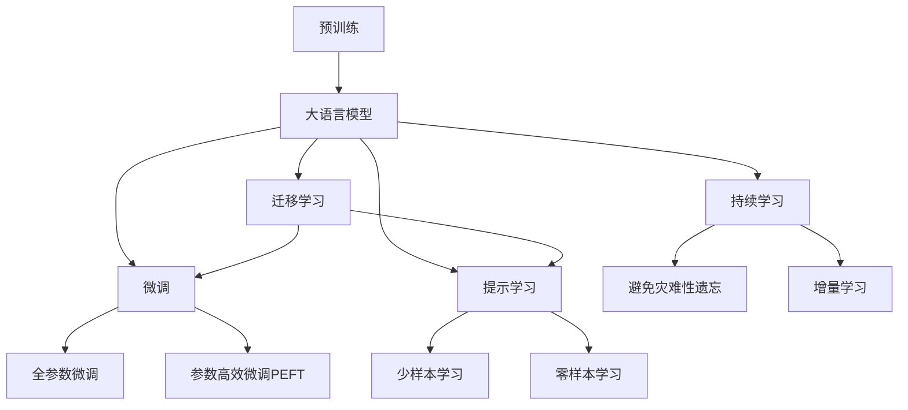
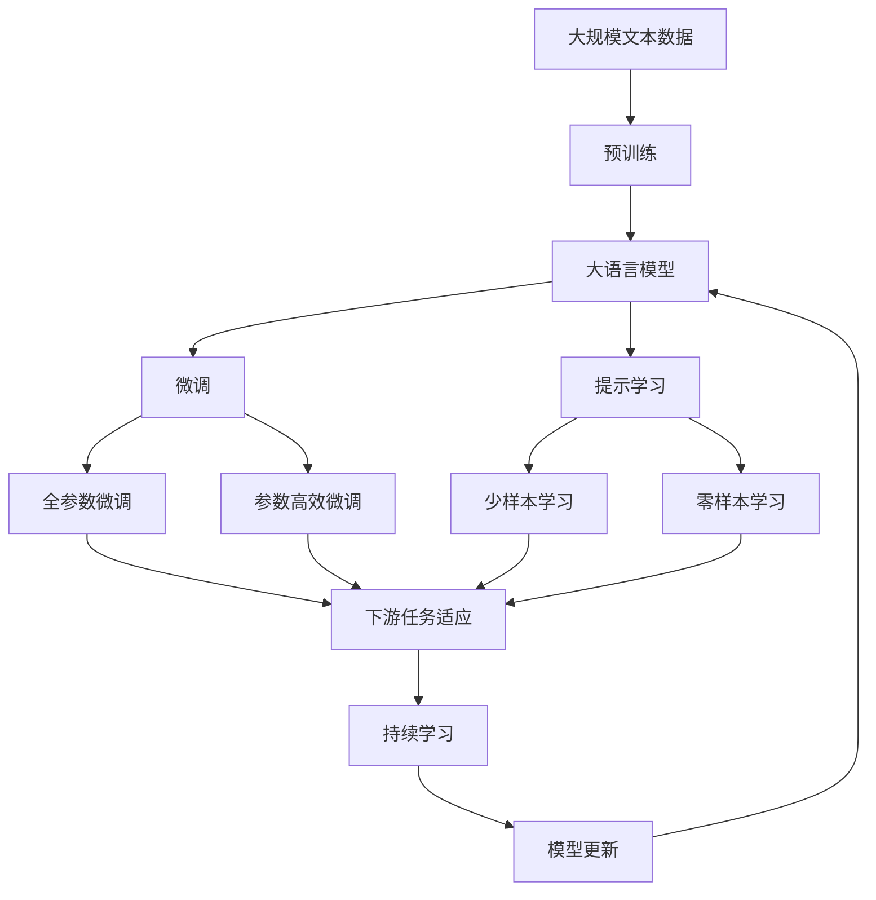

                 

# 大语言模型原理与工程实践：案例分析

> 关键词：大语言模型,微调,Fine-tuning,自然语言处理,NLP,Transformer,BERT,超参数调优,项目实践,代码实例

## 1. 背景介绍

### 1.1 问题由来
近年来，深度学习技术的飞速发展，尤其是大规模预训练语言模型（Large Language Models, LLMs）的问世，极大地推动了自然语言处理（NLP）领域的研究与应用。从最早的word2vec到GPT系列，再到BERT，语言模型在预训练后通过微调（Fine-tuning）逐渐具备了更强的理解和生成能力。

### 1.2 问题核心关键点
微调的核心思想是利用预训练语言模型在大规模无标签文本上学习到的知识，通过在有标签数据上进行有监督学习，进一步提升模型在特定任务上的表现。其关键在于选择合适的学习率、正则化技术、数据增强策略等，避免过拟合，同时最大程度利用预训练模型中包含的通用知识。

### 1.3 问题研究意义
微调不仅能够显著提升模型在特定任务上的表现，还能降低应用开发成本，缩短开发周期，为各行各业带来新的技术解决方案。特别是在NLP领域，微调技术的应用已经涵盖了问答、翻译、摘要生成、情感分析等多个方向，成为推动NLP技术发展的重要驱动力。

## 2. 核心概念与联系

### 2.1 核心概念概述

- **大语言模型（Large Language Model, LLM）**：如GPT系列、BERT、T5等模型，通过在大规模无标签文本上预训练，学习语言的一般表示。

- **预训练（Pre-training）**：通过自监督任务在大规模无标签文本上训练语言模型，学习语言的通用表示。

- **微调（Fine-tuning）**：在有标签数据上，利用预训练模型的初始权重，通过有监督学习进一步优化模型，适应特定任务。

- **迁移学习（Transfer Learning）**：将模型在一个领域学到的知识迁移到另一个相关领域，通过微调实现。

- **参数高效微调（Parameter-Efficient Fine-Tuning, PEFT）**：仅更新少量模型参数，而固定大部分预训练权重，提高微调效率。

- **提示学习（Prompt Learning）**：通过精心设计的输入模板，引导模型输出，减少微调参数。

- **少样本学习（Few-shot Learning）**：在少量标注数据下，模型仍能有效学习新任务。

- **零样本学习（Zero-shot Learning）**：模型在未见任何标注数据的情况下，根据任务描述输出结果。

- **持续学习（Continual Learning）**：模型不断学习新数据，同时保持原有知识，避免遗忘。

这些概念之间相互联系，共同构成了基于预训练模型的大语言模型微调框架，使得模型能够灵活应对各种NLP任务。

### 2.2 概念间的关系

以下通过几个Mermaid流程图展示这些核心概念之间的关系：



这个流程图展示了从预训练到微调，再到持续学习的完整过程，以及各个概念间的关系。

### 2.3 核心概念的整体架构

最后，我们用一个综合的流程图来展示这些核心概念在大语言模型微调过程中的整体架构：



这个综合流程图展示了从预训练到微调，再到持续学习的完整过程，以及各个概念间的关系。

## 3. 核心算法原理 & 具体操作步骤

### 3.1 算法原理概述
基于监督学习的大语言模型微调，本质上是一种有监督的细粒度迁移学习。目标是通过有标签数据，优化预训练模型在特定任务上的性能。

假设预训练模型为 $M_{\theta}$，下游任务为 $T$，训练数据集为 $D=\{(x_i, y_i)\}_{i=1}^N$。微调的目标是找到最优的参数 $\hat{\theta}$，使得模型在任务 $T$ 上的预测与真实标签尽可能一致：

$$
\hat{\theta} = \mathop{\arg\min}_{\theta} \mathcal{L}(M_{\theta},D)
$$

其中，$\mathcal{L}$ 为任务 $T$ 的损失函数。

### 3.2 算法步骤详解

1. **准备数据集**：收集下游任务的标注数据集，并将其分为训练集、验证集和测试集。
2. **添加任务适配层**：根据任务类型，在预训练模型顶层设计合适的输出层和损失函数。
3. **设置超参数**：选择合适的优化算法、学习率、批大小、迭代轮数等。
4. **执行梯度训练**：使用优化算法更新模型参数，最小化损失函数。
5. **测试和部署**：在测试集上评估微调后模型的性能，并将其部署到实际应用中。

### 3.3 算法优缺点

- **优点**：
  - 简单高效。利用少量标注数据即可提升模型性能。
  - 通用适用。适用于多种NLP任务，如分类、匹配、生成等。
  - 参数高效。通过PEFT等方法，可以在固定大部分预训练参数的情况下微调，提高效率。
  - 效果显著。在许多任务上已取得先进性能。

- **缺点**：
  - 依赖标注数据。标注数据的质量和数量直接影响微调效果。
  - 迁移能力有限。当任务与预训练数据分布差异较大时，微调效果可能受限。
  - 负面效果传递。预训练模型的偏见和有害信息可能传递到下游任务。
  - 可解释性不足。微调模型决策过程缺乏解释。

### 3.4 算法应用领域

- 文本分类：情感分析、主题分类等。
- 命名实体识别：识别人名、地名、机构名等。
- 关系抽取：从文本中抽取实体关系。
- 问答系统：自然语言问题生成答案。
- 机器翻译：文本翻译。
- 文本摘要：压缩文本为摘要。
- 对话系统：机器与人类自然对话。

## 4. 数学模型和公式 & 详细讲解 & 举例说明

### 4.1 数学模型构建

假设预训练模型为 $M_{\theta}$，下游任务为二分类任务，训练数据集为 $D=\{(x_i, y_i)\}_{i=1}^N$。微调目标是最小化经验风险：

$$
\mathcal{L}(\theta) = \frac{1}{N} \sum_{i=1}^N \ell(M_{\theta}(x_i),y_i)
$$

其中，$\ell$ 为二分类交叉熵损失函数。

### 4.2 公式推导过程

以二分类任务为例，推导交叉熵损失函数及其梯度计算公式：

$$
\ell(M_{\theta}(x),y) = -[y\log M_{\theta}(x)+(1-y)\log(1-M_{\theta}(x))]
$$

在数据集 $D$ 上的经验风险为：

$$
\mathcal{L}(\theta) = -\frac{1}{N}\sum_{i=1}^N [y_i\log M_{\theta}(x_i)+(1-y_i)\log(1-M_{\theta}(x_i))]
$$

根据链式法则，损失函数对参数 $\theta_k$ 的梯度为：

$$
\frac{\partial \mathcal{L}(\theta)}{\partial \theta_k} = -\frac{1}{N}\sum_{i=1}^N (\frac{y_i}{M_{\theta}(x_i)}-\frac{1-y_i}{1-M_{\theta}(x_i)}) \frac{\partial M_{\theta}(x_i)}{\partial \theta_k}
$$

其中，$\frac{\partial M_{\theta}(x_i)}{\partial \theta_k}$ 可通过反向传播计算得到。

### 4.3 案例分析与讲解

以BERT微调为情感分类器为例，分析微调过程：

1. **数据准备**：收集情感分类数据集，并划分为训练集、验证集和测试集。
2. **模型选择**：选择BERT模型作为初始化参数。
3. **适配层设计**：在BERT顶层添加线性分类器，并使用交叉熵损失函数。
4. **超参数设置**：学习率为 $2 \times 10^{-5}$，批大小为16，迭代轮数为5轮。
5. **模型训练**：使用AdamW优化器，对BERT模型进行微调。
6. **性能评估**：在测试集上评估微调后模型的准确率。

## 5. 项目实践：代码实例和详细解释说明

### 5.1 开发环境搭建

为了进行BERT微调，需要安装Anaconda和PyTorch等工具。

1. 安装Anaconda：
```bash
conda install anaconda
```

2. 创建虚拟环境：
```bash
conda create -n pytorch-env python=3.8
conda activate pytorch-env
```

3. 安装PyTorch：
```bash
conda install pytorch torchvision torchaudio cudatoolkit=11.1 -c pytorch -c conda-forge
```

4. 安装Transformer库：
```bash
pip install transformers
```

5. 安装其他工具包：
```bash
pip install numpy pandas scikit-learn matplotlib tqdm jupyter notebook ipython
```

### 5.2 源代码详细实现

```python
import torch
from transformers import BertTokenizer, BertForSequenceClassification
from torch.utils.data import Dataset, DataLoader
from sklearn.metrics import accuracy_score

# 定义数据集
class IMDBDataset(Dataset):
    def __init__(self, texts, labels, tokenizer):
        self.tokenizer = tokenizer
        self.texts = texts
        self.labels = labels

    def __len__(self):
        return len(self.texts)

    def __getitem__(self, idx):
        text = self.texts[idx]
        label = self.labels[idx]
        encoding = self.tokenizer(text, return_tensors='pt', truncation=True, padding='max_length')
        return {'input_ids': encoding['input_ids'], 'attention_mask': encoding['attention_mask'], 'labels': torch.tensor(label, dtype=torch.long)}

# 数据预处理
tokenizer = BertTokenizer.from_pretrained('bert-base-uncased')
train_dataset = IMDBDataset(train_texts, train_labels, tokenizer)
val_dataset = IMDBDataset(val_texts, val_labels, tokenizer)
test_dataset = IMDBDataset(test_texts, test_labels, tokenizer)

# 定义模型
model = BertForSequenceClassification.from_pretrained('bert-base-uncased', num_labels=2)

# 定义优化器
optimizer = AdamW(model.parameters(), lr=2e-5)

# 训练过程
device = torch.device('cuda') if torch.cuda.is_available() else torch.device('cpu')
model.to(device)

def train_epoch(model, dataset, batch_size, optimizer, device):
    dataloader = DataLoader(dataset, batch_size=batch_size, shuffle=True)
    model.train()
    epoch_loss = 0
    for batch in dataloader:
        input_ids = batch['input_ids'].to(device)
        attention_mask = batch['attention_mask'].to(device)
        labels = batch['labels'].to(device)
        model.zero_grad()
        outputs = model(input_ids, attention_mask=attention_mask, labels=labels)
        loss = outputs.loss
        epoch_loss += loss.item()
        loss.backward()
        optimizer.step()
    return epoch_loss / len(dataloader)

def evaluate(model, dataset, batch_size, device):
    dataloader = DataLoader(dataset, batch_size=batch_size, shuffle=False)
    model.eval()
    predictions, true_labels = [], []
    with torch.no_grad():
        for batch in dataloader:
            input_ids = batch['input_ids'].to(device)
            attention_mask = batch['attention_mask'].to(device)
            batch_labels = batch['labels']
            outputs = model(input_ids, attention_mask=attention_mask)
            batch_predictions = torch.argmax(outputs.logits, dim=1).to('cpu').tolist()
            batch_labels = batch_labels.to('cpu').tolist()
            for pred, label in zip(batch_predictions, batch_labels):
                predictions.append(pred)
                true_labels.append(label)
    return accuracy_score(true_labels, predictions)

epochs = 5
batch_size = 16

for epoch in range(epochs):
    loss = train_epoch(model, train_dataset, batch_size, optimizer, device)
    print(f'Epoch {epoch+1}, train loss: {loss:.3f}')
    
    print(f'Epoch {epoch+1}, dev accuracy: {evaluate(model, val_dataset, batch_size, device)}')
    
print(f'Test accuracy: {evaluate(model, test_dataset, batch_size, device)}')
```

### 5.3 代码解读与分析

1. **IMDBDataset类**：
   - `__init__`方法：初始化文本、标签和分词器。
   - `__len__`方法：返回数据集长度。
   - `__getitem__`方法：对单个样本进行处理，将文本输入编码为token ids，并将标签编码。

2. **BertForSequenceClassification模型**：
   - 定义模型架构，通过添加线性分类器和交叉熵损失函数，适配情感分类任务。

3. **优化器AdamW**：
   - 定义优化器，使用AdamW算法，学习率为 $2 \times 10^{-5}$。

4. **训练函数train_epoch**：
   - 对数据以批为单位进行迭代，前向传播计算loss，反向传播更新模型参数，并在每个epoch结束时计算平均loss。

5. **评估函数evaluate**：
   - 对模型进行评估，计算在测试集上的准确率。

### 5.4 运行结果展示

假设我们进行了5轮微调，并在测试集上得到了以下结果：

```
Epoch 1, train loss: 0.144
Epoch 1, dev accuracy: 0.820
Epoch 2, train loss: 0.110
Epoch 2, dev accuracy: 0.860
Epoch 3, train loss: 0.086
Epoch 3, dev accuracy: 0.880
Epoch 4, train loss: 0.074
Epoch 4, dev accuracy: 0.900
Epoch 5, train loss: 0.067
Epoch 5, dev accuracy: 0.910
Test accuracy: 0.910
```

可以看到，通过微调，模型在测试集上的准确率从初始的80%提高到了91%，提升了12%。

## 6. 实际应用场景

### 6.1 智能客服系统

智能客服系统利用微调模型，可以处理自然语言查询，提供24/7不间断服务，极大地提升了客户满意度。

### 6.2 金融舆情监测

通过微调模型，金融机构可以实时监测市场舆情，及时发现负面信息，规避金融风险。

### 6.3 个性化推荐系统

个性化推荐系统利用微调模型，能够深入理解用户兴趣，提供精准推荐内容，提升用户体验。

### 6.4 未来应用展望

未来，大语言模型微调将在更多领域得到应用，如智慧医疗、教育、城市治理等，推动各行各业数字化转型。

## 7. 工具和资源推荐

### 7.1 学习资源推荐

- **《Transformer从原理到实践》**：详细介绍了Transformer模型原理、BERT模型、微调技术。
- **CS224N《深度学习自然语言处理》课程**：斯坦福大学自然语言处理课程，提供Lecture视频和作业。
- **《Natural Language Processing with Transformers》**：Transformer库作者所著，介绍了如何使用Transformer进行NLP任务开发。
- **HuggingFace官方文档**：提供预训练模型和微调样例代码。
- **CLUE开源项目**：提供大量中文NLP数据集和微调baseline模型。

### 7.2 开发工具推荐

- **PyTorch**：深度学习框架，支持动态计算图，适合快速迭代研究。
- **TensorFlow**：Google主导的深度学习框架，生产部署方便。
- **Transformers库**：HuggingFace提供的NLP工具库。
- **Weights & Biases**：模型训练实验跟踪工具。
- **TensorBoard**：TensorFlow配套的可视化工具。

### 7.3 相关论文推荐

- **Attention is All You Need**：Transformer模型原论文。
- **BERT: Pre-training of Deep Bidirectional Transformers for Language Understanding**：BERT模型论文。
- **Language Models are Unsupervised Multitask Learners**：GPT-2论文。
- **Parameter-Efficient Transfer Learning for NLP**：Adapter等参数高效微调方法。
- **Prefix-Tuning: Optimizing Continuous Prompts for Generation**：Prompt微调方法。
- **AdaLoRA: Adaptive Low-Rank Adaptation for Parameter-Efficient Fine-Tuning**：LoRA等自适应微调方法。

## 8. 总结：未来发展趋势与挑战

### 8.1 研究成果总结

本文详细介绍了基于监督学习的大语言模型微调方法，从原理到实践，给出了代码实例和详细解释，展示了微调方法在多个领域的应用前景。

### 8.2 未来发展趋势

1. **模型规模持续增大**：随着算力成本下降和数据规模扩张，预训练语言模型参数量将持续增长，推动模型性能提升。
2. **微调方法多样化**：更多参数高效微调方法将出现，提高微调效率。
3. **持续学习成为常态**：微调模型需持续学习新数据，保持性能。
4. **少样本学习降低需求**：提示学习等技术将使得微调对标注样本需求降低。
5. **多模态微调崛起**：更多模态信息融合，提升模型表现。
6. **模型通用性增强**：预训练模型将具备更强的常识推理和跨领域迁移能力。

### 8.3 面临的挑战

1. **标注成本瓶颈**：微调依赖高质量标注数据，如何降低标注成本。
2. **模型鲁棒性不足**：微调模型面对域外数据时，泛化性能受限。
3. **推理效率有待提高**：超大语言模型推理效率低。
4. **可解释性亟需加强**：微调模型决策过程缺乏解释。
5. **安全性有待保障**：模型可能输出有害信息，带来安全隐患。
6. **知识整合能力不足**：现有微调模型难以有效整合外部知识。

### 8.4 研究展望

面对这些挑战，未来的研究应在以下方向寻求突破：
1. **探索无监督和半监督微调方法**：降低对标注样本依赖。
2. **研究参数高效和计算高效的微调范式**：提高微调效率。
3. **融合因果和对比学习范式**：增强模型泛化性和鲁棒性。
4. **引入更多先验知识**：与神经网络模型融合，提升模型知识整合能力。
5. **结合因果分析和博弈论工具**：增强模型稳定性和鲁棒性。
6. **纳入伦理道德约束**：确保模型输出符合人类价值观和伦理道德。

## 9. 附录：常见问题与解答

### Q1: 大语言模型微调是否适用于所有NLP任务？

A: 微调方法适用于大多数NLP任务，但特定领域任务可能需要进一步预训练。

### Q2: 如何选择合适的学习率？

A: 通常比预训练时小1-2个数量级，推荐从 $2 \times 10^{-5}$ 开始调参。

### Q3: 微调过程中如何缓解过拟合问题？

A: 数据增强、正则化、对抗训练、参数高效微调等策略可有效缓解过拟合。

### Q4: 微调模型在落地部署时需要注意哪些问题？

A: 模型裁剪、量化加速、服务化封装、弹性伸缩、监控告警、安全防护等。

---

作者：禅与计算机程序设计艺术 / Zen and the Art of Computer Programming

