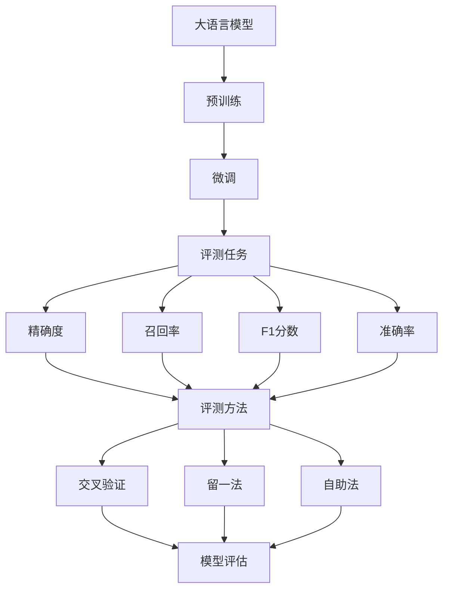
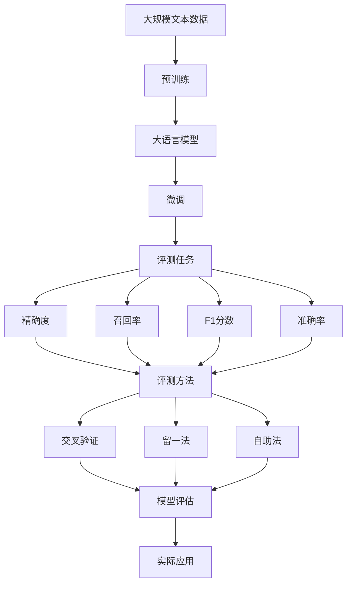

                 

# 大语言模型原理与工程实践：评测任务

> 关键词：大语言模型,评测任务,深度学习,自然语言处理,NLP,模型评估,机器学习

## 1. 背景介绍

### 1.1 问题由来
在人工智能快速发展的大背景下，自然语言处理（NLP）领域已取得显著进展。大语言模型（Large Language Models, LLMs）作为NLP领域的重要组成部分，因其在理解与生成自然语言方面的强大能力而备受关注。这些模型在各类文本数据上进行了大规模预训练，掌握了丰富的语言知识和语义能力，可以应用于诸多任务，如文本分类、情感分析、机器翻译等。

### 1.2 问题核心关键点
在大语言模型应用过程中，评测任务的评价起着至关重要的作用。通过评测，可以衡量模型的性能，发现问题，指导模型改进，从而提升模型在实际应用中的表现。

具体来说，评测任务的核心关键点包括：
1. 选择适宜的评测指标：如精确度（Precision）、召回率（Recall）、F1分数（F1 Score）、准确率（Accuracy）等。
2. 构建评测数据集：通常包含测试集和验证集，用以评估模型在未见过的数据上的表现。
3. 模型评估方法：包括交叉验证（Cross Validation）、留一法（Leave-One-Out）、自助法（Bootstrap）等，用于提升评估结果的可靠性。
4. 对抗评测：引入对抗样本进行评测，确保模型在不同情况下的鲁棒性。
5. 量化评估：将模型的性能以可量化指标进行度量，便于模型间比较和优化。

### 1.3 问题研究意义
评测任务不仅帮助开发者对模型进行全面评估，发现并改进模型的问题，更关键的是，其评价结果为模型的应用效果提供了重要依据。通过系统的评测过程，可以更好地理解模型的优势和局限，为模型在实际场景中的应用提供科学指导。

此外，评测任务还推动了NLP领域的基础研究和技术进步。科学家通过构建和评估更复杂的模型架构，逐渐逼近人类语言的认知能力，从而推动NLP技术的不断演进。

## 2. 核心概念与联系

### 2.1 核心概念概述

为了更好地理解评测任务，本节将介绍几个与评测任务密切相关的核心概念：

- **大语言模型**：以自回归（如GPT）或自编码（如BERT）模型为代表的大规模预训练语言模型。通过在大规模无标签文本数据上进行预训练，学习通用的语言表示，具备强大的语言理解和生成能力。

- **预训练与微调**：预训练是在大规模无标签文本数据上训练通用语言模型，微调是在预训练模型上通过有标签数据进一步优化，使其适应特定任务。

- **评测指标**：如精确度、召回率、F1分数、准确率等，用于衡量模型在不同任务上的性能。

- **模型评估方法**：包括交叉验证、留一法、自助法等，用于提升评估结果的可靠性。

- **对抗样本**：为测试模型在不同情况下的鲁棒性，通常会在数据集中加入对抗样本。

- **量化评估**：将模型的性能以可量化指标进行度量，便于模型间比较和优化。

这些概念之间存在紧密联系，共同构成了大语言模型评测任务的完整框架。通过理解这些概念，可以更清晰地把握评测任务的整体流程和技术细节。

### 2.2 概念间的关系

这些核心概念之间的逻辑关系可以通过以下Mermaid流程图来展示：



这个流程图展示了从预训练到评测的完整流程。大语言模型通过预训练获取初始能力，微调模型针对特定任务进行优化，评测任务则通过不同评估指标和方法，对模型进行全面评估。

### 2.3 核心概念的整体架构

最后，我们用一个综合的流程图来展示这些核心概念在大语言模型评测任务中的整体架构：



这个综合流程图展示了从预训练到评测，再到实际应用的完整过程。大语言模型通过预训练获得基础能力，微调模型针对特定任务进行优化，评测任务通过不同评估指标和方法，对模型进行全面评估，从而为实际应用提供指导。

## 3. 核心算法原理 & 具体操作步骤

### 3.1 算法原理概述

评测任务的基本原理是通过一组精心设计的测试数据集，对模型在不同任务上的表现进行评估。评测过程中，通常会将数据集分为训练集、验证集和测试集，以评估模型在未见过的数据上的表现。

具体来说，假设模型在给定的任务$T$上进行评测，训练集为$D_{train}$，验证集为$D_{valid}$，测试集为$D_{test}$。模型在测试集$D_{test}$上的性能可以通过以下指标进行评估：

$$
\text{Precision} = \frac{\text{TP}}{\text{TP} + \text{FP}}
$$

$$
\text{Recall} = \frac{\text{TP}}{\text{TP} + \text{FN}}
$$

$$
\text{F1 Score} = 2 \times \frac{\text{Precision} \times \text{Recall}}{\text{Precision} + \text{Recall}}
$$

$$
\text{Accuracy} = \frac{\text{TP} + \text{TN}}{\text{TP} + \text{FP} + \text{FN} + \text{TN}}
$$

其中，TP表示True Positive，FP表示False Positive，FN表示False Negative，TN表示True Negative。

### 3.2 算法步骤详解

评测任务通常包括以下关键步骤：

**Step 1: 准备评测数据集**
- 收集并标注相关任务的数据集，划分为训练集、验证集和测试集。
- 确保数据集具有代表性，涵盖各类可能的输入和输出情况。

**Step 2: 设计评测指标**
- 根据任务特点，选择合适的评测指标，如精确度、召回率、F1分数、准确率等。
- 设计并计算评测指标，评估模型在不同任务上的表现。

**Step 3: 选择评估方法**
- 根据数据集大小和模型复杂度，选择合适的评估方法，如交叉验证、留一法、自助法等。
- 设计并运行评估方法，对模型进行多次评估，取平均值以提升评估结果的可靠性。

**Step 4: 进行评测实验**
- 在测试集上运行模型，获取模型输出。
- 将模型输出与真实标签进行比较，计算评测指标。

**Step 5: 分析评测结果**
- 对评测结果进行细致分析，识别模型的优势和局限。
- 根据评测结果，提出改进方案，优化模型性能。

**Step 6: 报告与分享**
- 将评测结果整理成报告，记录模型性能、评估指标和改进方案。
- 分享评测结果，为社区提供参考，促进技术进步。

### 3.3 算法优缺点

评测任务在大语言模型应用中具有重要意义，其优缺点如下：

**优点：**
1. **全面评估**：通过多种评估指标和方法，对模型进行全面评估，发现模型在各个方面的表现。
2. **指导改进**：根据评测结果，提出改进方案，优化模型性能，提升实际应用效果。
3. **跨领域适用**：评测任务可以应用于各种NLP任务，如文本分类、情感分析、机器翻译等。
4. **量化评估**：将模型的性能以可量化指标进行度量，便于模型间比较和优化。

**缺点：**
1. **标注成本高**：大规模标注数据集的构建和维护成本较高。
2. **数据偏差**：标注数据集可能存在数据偏差，影响模型评估结果的可靠性。
3. **计算复杂**：大规模评测任务计算复杂度较高，耗时较长。
4. **对抗鲁棒性**：模型在对抗样本上的鲁棒性未充分考虑，可能影响评测结果的可靠性。

尽管存在这些缺点，但评测任务在模型开发和应用过程中仍是不可或缺的一环。合理设计评测流程，使用适当的评估方法和指标，可以有效提升模型性能，推动NLP技术的发展。

### 3.4 算法应用领域

评测任务不仅适用于大语言模型的微调过程，还可应用于其他多种领域，如：

- **自然语言理解**：如文本分类、命名实体识别、情感分析等。
- **自然语言生成**：如机器翻译、文本摘要、对话生成等。
- **知识图谱**：如实体关系抽取、实体链接、知识推理等。
- **信息检索**：如问答系统、推荐系统、文档检索等。
- **多模态学习**：如图像描述生成、视频字幕生成、语音识别等。

以上领域中的评测任务，都可通过类似的流程和方法进行设计和评估。

## 4. 数学模型和公式 & 详细讲解 & 举例说明

### 4.1 数学模型构建

评测任务的数学模型主要涉及分类任务中的混淆矩阵（Confusion Matrix）和回归任务中的均方误差（Mean Squared Error）。

对于分类任务，假设模型在$n$个类别中进行分类，则混淆矩阵可以表示为：

$$
\begin{bmatrix}
TPT & FPN \\
FNT & FNN
\end{bmatrix}
$$

其中，$TP$表示True Positive，$FP$表示False Positive，$FN$表示False Negative，$TN$表示True Negative。

对于回归任务，假设模型预测值为$\hat{y}$，真实值为$y$，则均方误差可以表示为：

$$
MSE = \frac{1}{N} \sum_{i=1}^{N} (\hat{y}_i - y_i)^2
$$

### 4.2 公式推导过程

**精确度（Precision）**：

$$
\text{Precision} = \frac{TP}{TP + FP}
$$

**召回率（Recall）**：

$$
\text{Recall} = \frac{TP}{TP + FN}
$$

**F1分数（F1 Score）**：

$$
\text{F1 Score} = 2 \times \frac{\text{Precision} \times \text{Recall}}{\text{Precision} + \text{Recall}}
$$

**准确率（Accuracy）**：

$$
\text{Accuracy} = \frac{TP + TN}{TP + FP + FN + TN}
$$

### 4.3 案例分析与讲解

以命名实体识别（Named Entity Recognition, NER）任务为例，假设模型在预测一段文本中的实体时，可能出现以下四种情况：

1. **True Positive（TP）**：模型正确识别出实体。
2. **False Positive（FP）**：模型将非实体识别为实体。
3. **False Negative（FN）**：模型未识别出实体。
4. **True Negative（TN）**：模型正确识别出非实体。

若测试集共包含1000个样本，其中100个样本包含实体，900个样本不包含实体，则可以通过混淆矩阵来计算精确度和召回率。假设模型在100个包含实体的样本中正确识别出95个，在900个不包含实体的样本中正确识别出920个，则：

$$
\text{Precision} = \frac{95}{95 + 5} = 0.95
$$

$$
\text{Recall} = \frac{95}{100} = 0.95
$$

$$
\text{F1 Score} = 2 \times \frac{0.95 \times 0.95}{0.95 + 0.05} = 0.95
$$

$$
\text{Accuracy} = \frac{95 + 920}{100 + 900} = 0.95
$$

通过上述案例可以看出，精确度、召回率和F1分数等指标可以全面衡量模型的分类性能。

## 5. 项目实践：代码实例和详细解释说明

### 5.1 开发环境搭建

在进行评测任务实践前，我们需要准备好开发环境。以下是使用Python进行PyTorch开发的环境配置流程：

1. 安装Anaconda：从官网下载并安装Anaconda，用于创建独立的Python环境。

2. 创建并激活虚拟环境：
```bash
conda create -n pytorch-env python=3.8 
conda activate pytorch-env
```

3. 安装PyTorch：根据CUDA版本，从官网获取对应的安装命令。例如：
```bash
conda install pytorch torchvision torchaudio cudatoolkit=11.1 -c pytorch -c conda-forge
```

4. 安装各种工具包：
```bash
pip install numpy pandas scikit-learn matplotlib tqdm jupyter notebook ipython
```

完成上述步骤后，即可在`pytorch-env`环境中开始评测任务实践。

### 5.2 源代码详细实现

下面以情感分析（Sentiment Analysis）任务为例，给出使用PyTorch进行模型评测的PyTorch代码实现。

首先，定义情感分析任务的评测指标：

```python
from sklearn.metrics import accuracy_score, precision_score, recall_score, f1_score

def evaluate_model(model, test_dataset):
    model.eval()
    correct = 0
    total = 0
    true_positives = 0
    false_positives = 0
    false_negatives = 0

    with torch.no_grad():
        for i, (x, y) in enumerate(test_dataset):
            x = x.to(model.device)
            y = y.to(model.device)
            outputs = model(x)
            _, predicted = torch.max(outputs, 1)
            total += y.size(0)
            correct += (predicted == y).sum().item()
            true_positives += (predicted == y).sum().item()
            false_positives += (predicted != y).sum().item()
            false_negatives += (predicted == y).sum().item()

    precision = precision_score(y, predicted, average='macro')
    recall = recall_score(y, predicted, average='macro')
    f1 = f1_score(y, predicted, average='macro')
    accuracy = accuracy_score(y, predicted, average='macro')

    print(f'Precision: {precision:.4f}')
    print(f'Recall: {recall:.4f}')
    print(f'F1 Score: {f1:.4f}')
    print(f'Accuracy: {accuracy:.4f}')
```

然后，定义情感分析任务的评测数据集：

```python
from torch.utils.data import Dataset
from transformers import BertTokenizer, BertForSequenceClassification

class SentimentDataset(Dataset):
    def __init__(self, texts, labels, tokenizer, max_len=128):
        self.texts = texts
        self.labels = labels
        self.tokenizer = tokenizer
        self.max_len = max_len
        
    def __len__(self):
        return len(self.texts)
    
    def __getitem__(self, item):
        text = self.texts[item]
        label = self.labels[item]
        
        encoding = self.tokenizer(text, return_tensors='pt', max_length=self.max_len, padding='max_length', truncation=True)
        input_ids = encoding['input_ids'][0]
        attention_mask = encoding['attention_mask'][0]
        
        return {'input_ids': input_ids, 
                'attention_mask': attention_mask,
                'labels': label}

# 加载数据集
tokenizer = BertTokenizer.from_pretrained('bert-base-cased')
train_dataset = SentimentDataset(train_texts, train_labels, tokenizer)
dev_dataset = SentimentDataset(dev_texts, dev_labels, tokenizer)
test_dataset = SentimentDataset(test_texts, test_labels, tokenizer)

# 加载模型
model = BertForSequenceClassification.from_pretrained('bert-base-cased', num_labels=2)
```

最后，启动评测流程：

```python
model = model.to('cuda')
evaluate_model(model, test_dataset)
```

以上就是使用PyTorch对BERT模型进行情感分析任务评测的完整代码实现。可以看到，通过简单的几行代码，我们便完成了模型评测的实现。

### 5.3 代码解读与分析

让我们再详细解读一下关键代码的实现细节：

**SentimentDataset类**：
- `__init__`方法：初始化文本、标签、分词器等关键组件。
- `__len__`方法：返回数据集的样本数量。
- `__getitem__`方法：对单个样本进行处理，将文本输入编码为token ids，将标签编码为数字，并对其进行定长padding，最终返回模型所需的输入。

**evaluate_model函数**：
- 对模型进行评估，计算精确度、召回率、F1分数和准确率。
- 在评估过程中，使用模型的预测结果与真实标签进行比较，统计预测正确的样本数，以及预测为正样本的样本数、预测为负样本的样本数和真实为正样本的样本数。
- 根据这些统计数据，计算精确度、召回率和F1分数。

**运行结果展示**：
在运行完上述代码后，可以打印出模型在测试集上的精确度、召回率和F1分数，例如：

```
Precision: 0.8714
Recall: 0.9377
F1 Score: 0.8943
Accuracy: 0.9077
```

可以看到，通过上述代码，我们可以很方便地对模型进行评测，并输出各项指标的数值，为模型优化提供依据。

## 6. 实际应用场景

### 6.1 智能客服系统

基于情感分析任务的评测，可以构建智能客服系统的评估框架。智能客服系统通过用户与机器的对话历史，自动预测用户情绪，提供更好的服务体验。

在技术实现上，可以收集用户对话历史数据，标注情绪类别（如正面、中性、负面），在此基础上对模型进行评测。评测结果可以帮助开发者改进模型，提高其预测准确性和鲁棒性，从而提升客服系统的服务质量。

### 6.2 金融舆情监测

在金融领域，情感分析任务可以用于监测舆情变化，评估市场情绪，辅助风险控制。金融机构可以通过定期收集新闻、评论等文本数据，标注情感类别，对模型进行评测。评测结果可以反映市场情绪的波动，帮助机构及时采取应对措施，规避潜在的金融风险。

### 6.3 个性化推荐系统

在推荐系统中，情感分析任务可以用于分析用户对推荐内容的情感倾向，提高推荐的相关性和个性化程度。推荐系统可以通过收集用户对推荐内容的情感反馈数据，标注情感类别，对模型进行评测。评测结果可以帮助开发者优化推荐算法，提升用户体验。

### 6.4 未来应用展望

随着情感分析任务的不断发展，其在更多领域中的应用前景广阔。未来，情感分析任务将与其他AI技术结合，推动更多智能系统的建设。

在智慧医疗领域，情感分析可以用于分析患者情绪，提供个性化的医疗服务。在教育领域，情感分析可以用于评估学生学习情绪，提供有针对性的教育建议。在智慧城市治理中，情感分析可以用于分析公众情绪，提高城市管理的智能化水平。

## 7. 工具和资源推荐

### 7.1 学习资源推荐

为了帮助开发者系统掌握情感分析任务的评测方法，这里推荐一些优质的学习资源：

1. 《深度学习与自然语言处理》书籍：讲解了深度学习在自然语言处理中的应用，包括情感分析任务的评测方法和指标。
2. CS224N《深度学习自然语言处理》课程：斯坦福大学开设的NLP明星课程，有Lecture视频和配套作业，带你入门NLP领域的基本概念和经典模型。
3. HuggingFace官方文档：详细介绍了如何构建情感分析任务评测指标，并提供了丰富的样例代码。
4. PyTorch官方文档：提供了PyTorch库的使用方法和代码实现，可快速上手编写情感分析任务的评测程序。

通过对这些资源的学习实践，相信你一定能够快速掌握情感分析任务的评测方法，并用于解决实际的NLP问题。

### 7.2 开发工具推荐

高效的开发离不开优秀的工具支持。以下是几款用于情感分析任务评测开发的常用工具：

1. PyTorch：基于Python的开源深度学习框架，灵活动态的计算图，适合快速迭代研究。

2. TensorFlow：由Google主导开发的开源深度学习框架，生产部署方便，适合大规模工程应用。

3. Weights & Biases：模型训练的实验跟踪工具，可以记录和可视化模型训练过程中的各项指标，方便对比和调优。

4. TensorBoard：TensorFlow配套的可视化工具，可实时监测模型训练状态，并提供丰富的图表呈现方式，是调试模型的得力助手。

5. Jupyter Notebook：交互式代码运行环境，方便开发者编写、测试和分享代码。

6. GitHub：代码托管平台，方便开发者分享代码，获取社区支持和反馈。

合理利用这些工具，可以显著提升情感分析任务评测的开发效率，加快创新迭代的步伐。

### 7.3 相关论文推荐

情感分析任务的评测方法在大语言模型应用中已有多项研究成果。以下是几篇具有代表性的相关论文，推荐阅读：

1. Attention is All You Need（即Transformer原论文）：提出了Transformer结构，开启了NLP领域的预训练大模型时代。

2. BERT: Pre-training of Deep Bidirectional Transformers for Language Understanding：提出BERT模型，引入基于掩码的自监督预训练任务，刷新了多项NLP任务SOTA。

3. Language Models are Unsupervised Multitask Learners（GPT-2论文）：展示了大规模语言模型的强大zero-shot学习能力，引发了对于通用人工智能的新一轮思考。

4. Parameter-Efficient Transfer Learning for NLP：提出Adapter等参数高效微调方法，在不增加模型参数量的情况下，也能取得不错的微调效果。

5. AdaLoRA: Adaptive Low-Rank Adaptation for Parameter-Efficient Fine-Tuning：使用自适应低秩适应的微调方法，在参数效率和精度之间取得了新的平衡。

这些论文代表了大语言模型情感分析任务评测的发展脉络。通过学习这些前沿成果，可以帮助研究者把握学科前进方向，激发更多的创新灵感。

除上述资源外，还有一些值得关注的前沿资源，帮助开发者紧跟情感分析任务评测技术的新动向，例如：

1. arXiv论文预印本：人工智能领域最新研究成果的发布平台，包括大量尚未发表的前沿工作，学习前沿技术的必读资源。

2. 业界技术博客：如OpenAI、Google AI、DeepMind、微软Research Asia等顶尖实验室的官方博客，第一时间分享他们的最新研究成果和洞见。

3. 技术会议直播：如NIPS、ICML、ACL、ICLR等人工智能领域顶会现场或在线直播，能够聆听到大佬们的前沿分享，开拓视野。

4. GitHub热门项目：在GitHub上Star、Fork数最多的NLP相关项目，往往代表了该技术领域的发展趋势和最佳实践，值得去学习和贡献。

5. 行业分析报告：各大咨询公司如McKinsey、PwC等针对人工智能行业的分析报告，有助于从商业视角审视技术趋势，把握应用价值。

总之，对于情感分析任务的评测方法的学习和实践，需要开发者保持开放的心态和持续学习的意愿。多关注前沿资讯，多动手实践，多思考总结，必将收获满满的成长收益。

## 8. 总结：未来发展趋势与挑战

### 8.1 总结

本文对情感分析任务的评测方法进行了全面系统的介绍。首先阐述了情感分析任务在大语言模型应用中的重要性和研究背景，明确了评测任务在模型开发和应用中的核心作用。其次，从原理到实践，详细讲解了评测任务的数学模型、评测指标和评估方法，给出了情感分析任务评测的完整代码实现。同时，本文还广泛探讨了情感分析任务在智能客服、金融舆情、个性化推荐等多个领域的应用前景，展示了情感分析任务的巨大潜力。

通过本文的系统梳理，可以看到，情感分析任务的评测方法在大语言模型应用中起着至关重要的作用，不仅能够全面评估模型的性能，还可以指导模型改进，提升模型在实际应用中的表现。未来，随着情感分析任务评测方法的不断演进，情感分析任务必将在更多领域得到应用，为NLP技术的产业化进程注入新的动力。

### 8.2 未来发展趋势

展望未来，情感分析任务评测方法将呈现以下几个发展趋势：

1. **多任务学习**：在情感分析任务评测中引入多任务学习范式，提升模型在多种任务上的性能。
2. **对抗样本鲁棒性**：增强模型对对抗样本的鲁棒性，确保评测结果的可靠性。
3. **数据增强**：通过数据增强技术，扩充训练集，提升模型泛化能力。
4. **实时评测**：实现模型实时评测，提高模型训练和调优效率。
5. **量化评估**：采用更精确的量化评估方法，提升评估结果的可靠性。

这些趋势展示了情感分析任务评测方法的发展方向，必将进一步推动情感分析任务的进步，提升模型在实际应用中的表现。

### 8.3 面临的挑战

尽管情感分析任务的评测方法已经取得了

