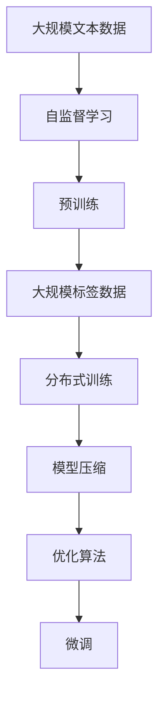
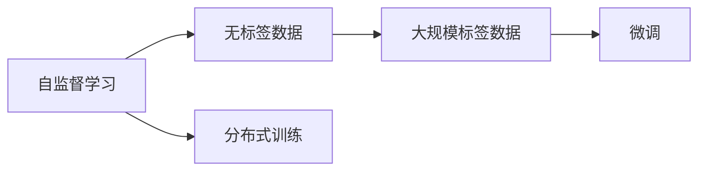
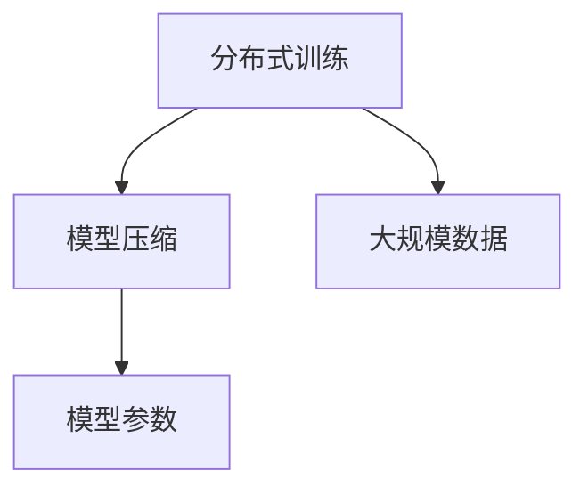
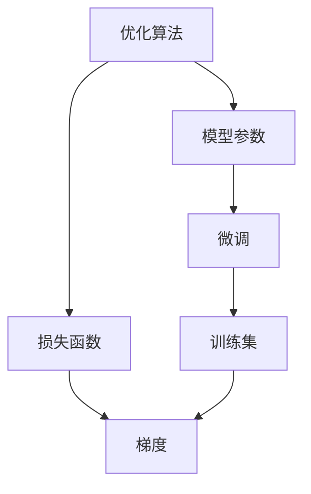
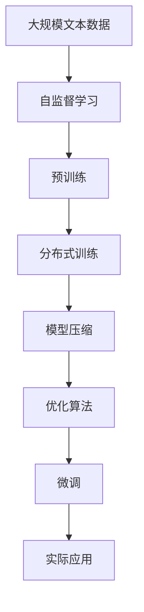

                 

# 大语言模型原理基础与前沿 在单个GPU上一天内训练一个语言模型

## 1. 背景介绍

### 1.1 问题由来
近年来，深度学习技术的快速发展，尤其是大语言模型的兴起，使得自然语言处理(NLP)领域取得了显著的进展。在自然语言理解和生成任务上，基于自回归模型(如GPT)或自编码模型(如BERT)的大语言模型，通过在海量无标签文本语料上进行预训练，学习到了丰富的语言知识和常识，展现出强大的语言理解与生成能力。

然而，训练一个高质量大语言模型仍然是一个既耗时又耗资的挑战。例如，T5模型在2020年提出后，其参数量达到11亿，甚至超过了以往的GPT-3模型。这种规模庞大的模型，其训练所需的大量计算资源，使得在大规模服务器集群上才得以实现。尽管GPT-3之后提出的模型在参数量上更胜一筹，但如何高效地训练这些大规模模型，尤其是在单个GPU上完成训练，仍然是一个重要而复杂的问题。

本文旨在探索在大规模语言模型的训练过程中，如何利用先进的技术手段，如分布式训练、模型压缩和优化算法，实现在单个GPU上高效、快速地训练出一个高质量的语言模型。

### 1.2 问题核心关键点
训练一个大规模语言模型的核心关键点包括：

1. **大规模数据集与GPU资源**：大语言模型通常需要海量的无标签文本数据，且训练过程需要在强大的GPU集群上完成。
2. **模型参数优化**：通过自监督学习任务进行预训练，然后通过大规模有标签数据集进行微调，最终优化模型以适应特定任务。
3. **计算效率提升**：如何在单个GPU上有效提升训练效率，缩短训练时间。
4. **模型压缩与优化**：在保持模型性能的前提下，尽可能减小模型参数量，以减少计算资源需求。

这些关键点不仅决定了模型的训练过程，也影响了其在实际应用中的表现和可行性。

## 2. 核心概念与联系

### 2.1 核心概念概述

为更好地理解大规模语言模型的训练过程，本节将介绍几个密切相关的核心概念：

- **大语言模型(Large Language Model, LLM)**：以自回归模型或自编码模型为代表的大规模预训练语言模型。通过在大规模无标签文本语料上进行预训练，学习通用的语言表示，具备强大的语言理解和生成能力。
- **自监督学习(SSL)**：利用未标注的数据集，通过设计无监督任务，使得模型能够自发地学习到数据的潜在结构和规律。
- **分布式训练**：通过将大规模模型的训练任务分布到多个GPU或CPU上，并行处理数据和模型参数，以提升训练效率。
- **模型压缩(Minimal Model Compression)**：通过去除冗余信息、剪枝、量化等手段，减少模型的参数量和计算复杂度。
- **优化算法(Optimizer)**：在模型训练过程中，用于更新模型参数，以最小化损失函数的数值。常见的优化算法包括Adam、SGD等。

这些核心概念之间的逻辑关系可以通过以下Mermaid流程图来展示：



这个流程图展示了从数据预处理到模型微调的整体训练过程。大语言模型首先在大规模无标签文本数据上进行预训练，然后通过大规模有标签数据集进行微调，最终优化模型以适应特定任务。

### 2.2 概念间的关系

这些核心概念之间存在着紧密的联系，形成了大规模语言模型训练的完整生态系统。下面我通过几个Mermaid流程图来展示这些概念之间的关系。

#### 2.2.1 自监督学习与分布式训练的关系



这个流程图展示了自监督学习和分布式训练之间的关系。自监督学习通过未标注的数据集训练模型，而分布式训练通过多GPU并行处理，提升训练效率。

#### 2.2.2 分布式训练与模型压缩的关系



这个流程图展示了分布式训练和模型压缩之间的关系。分布式训练通过多GPU并行处理，提升训练效率，而模型压缩通过去除冗余信息，减小模型参数量，进一步提升训练效率。

#### 2.2.3 优化算法与微调的关系



这个流程图展示了优化算法和微调之间的关系。优化算法用于更新模型参数，以最小化损失函数，而微调通过有标签数据集进行训练，调整模型以适应特定任务。

### 2.3 核心概念的整体架构

最后，我们用一个综合的流程图来展示这些核心概念在大规模语言模型训练过程中的整体架构：



这个综合流程图展示了从数据预处理到模型微调，再到实际应用的整体训练过程。

## 3. 核心算法原理 & 具体操作步骤

### 3.1 算法原理概述

训练一个大规模语言模型的过程可以大致分为以下几个步骤：

1. **数据预处理**：收集并处理大规模文本数据，准备预训练所需的数据集。
2. **自监督预训练**：在大规模无标签文本数据上进行预训练，学习通用的语言表示。
3. **分布式训练**：利用多GPU并行处理数据和模型参数，提升训练效率。
4. **模型压缩**：通过去除冗余信息、剪枝、量化等手段，减小模型参数量。
5. **优化算法**：选择合适的优化算法，并设定合适的学习率，更新模型参数。
6. **微调**：通过大规模有标签数据集进行微调，优化模型以适应特定任务。

这些步骤相互配合，形成了大规模语言模型的训练范式。以下将对每一个步骤进行详细介绍。

### 3.2 算法步骤详解

#### 3.2.1 数据预处理

数据预处理是训练大规模语言模型的第一步。通常包括以下几个步骤：

1. **数据收集**：收集大规模无标签文本数据，如Wikipedia、Common Crawl等。
2. **数据清洗**：去除低质量的文本，如网页的HTML标签、无意义的内容等。
3. **分词和预处理**：将文本进行分词，并进行去除停用词、词干化等预处理。
4. **构建数据集**：将清洗后的文本数据构建为大规模数据集，通常采用批量处理的方式。

#### 3.2.2 自监督预训练

自监督预训练是大规模语言模型的核心步骤，其目的是通过无标签数据训练模型，学习通用的语言表示。常见的自监督任务包括：

1. **语言模型预测**：利用掩盖掉部分单词的句子，训练模型预测被掩盖的单词。
2. **掩码语言模型**：利用掩码技术，训练模型预测被掩码的单词。
3. **下一位预测**：训练模型预测下一个单词。

#### 3.2.3 分布式训练

分布式训练是提升大规模语言模型训练效率的重要手段。其步骤如下：

1. **选择合适的硬件设备**：根据模型规模和计算需求，选择适合的GPU或TPU设备。
2. **数据并行化**：将大规模数据集分成若干小批，并行处理。
3. **模型并行化**：将模型的不同层分别分布在不同的GPU上，并行处理数据和模型参数。
4. **同步更新**：定期同步各GPU上的模型参数，以确保模型的统一性。

#### 3.2.4 模型压缩

模型压缩是减小模型参数量和计算复杂度的关键步骤。其步骤如下：

1. **剪枝**：去除模型中的冗余连接，减小模型参数量。
2. **量化**：将模型的参数和激活值转换为低精度格式，减小计算资源需求。
3. **蒸馏**：通过训练一个较小的模型，替代原始模型的预测功能，减少计算复杂度。

#### 3.2.5 优化算法

优化算法是更新模型参数的关键步骤。其步骤如下：

1. **选择合适的优化算法**：如Adam、SGD等。
2. **设置合适的学习率**：通常比微调时小1-2个数量级，以保证模型不会过拟合。
3. **设定学习率衰减策略**：如cosine annealing、step decay等。
4. **应用正则化技术**：如L2正则、Dropout等，以防止过拟合。

#### 3.2.6 微调

微调是训练大规模语言模型的最后一步，其目的是通过有标签数据集，优化模型以适应特定任务。其步骤如下：

1. **数据预处理**：准备有标签数据集，并对其进行清洗、分词等预处理。
2. **构建模型**：选择合适的模型结构和任务适配层，如线性分类器、解码器等。
3. **微调训练**：通过反向传播更新模型参数，最小化损失函数。
4. **评估和验证**：在验证集上评估模型性能，根据评估结果调整超参数。

### 3.3 算法优缺点

大规模语言模型训练的主要优点包括：

1. **高性能**：通过分布式训练和模型压缩，可以在单个GPU上实现高效训练。
2. **泛化能力强**：通过自监督预训练，模型可以学习到通用的语言表示，具有较强的泛化能力。
3. **适应性强**：通过微调，模型可以适应多种下游任务，具有较高的任务灵活性。

然而，大规模语言模型训练也存在一些缺点：

1. **计算资源消耗大**：大规模模型的训练需要大量的计算资源，尤其是GPU资源。
2. **时间成本高**：大规模模型训练时间较长，需要较长的计算时间。
3. **模型复杂度高**：大规模模型的参数量较大，模型结构较为复杂。

### 3.4 算法应用领域

大规模语言模型训练的应用领域非常广泛，包括：

1. **自然语言理解**：如问答系统、命名实体识别、关系抽取等。
2. **自然语言生成**：如文本摘要、机器翻译、对话系统等。
3. **文本分类与情感分析**：如情感分析、新闻分类等。
4. **语言模型**：如GPT、BERT等。
5. **多语言模型**：如T5、XLM等。

## 4. 数学模型和公式 & 详细讲解

### 4.1 数学模型构建

大规模语言模型的训练可以基于以下数学模型构建：

假设大规模语言模型为 $M_{\theta}$，其中 $\theta$ 为模型参数。在自监督预训练阶段，通过掩码语言模型任务进行训练，损失函数为：

$$
\mathcal{L}_{ssl} = \frac{1}{N} \sum_{i=1}^N -\sum_{j=1}^M \log p(w_j|w_{<i})
$$

其中 $N$ 为样本数量，$M$ 为词汇表大小，$w_j$ 为第 $j$ 个单词，$p(w_j|w_{<i})$ 为给定前 $i-1$ 个单词的情况下，第 $i$ 个单词出现的概率。

在微调阶段，假设任务为 $T$，有标签数据集为 $D=\{(x_i,y_i)\}_{i=1}^N$，其中 $x_i$ 为输入文本，$y_i$ 为标签。微调的目标是最小化任务损失函数 $\mathcal{L}_T$，具体为：

$$
\mathcal{L}_T = \frac{1}{N} \sum_{i=1}^N \ell(M_{\theta}(x_i),y_i)
$$

其中 $\ell$ 为任务特定的损失函数，如交叉熵损失等。

### 4.2 公式推导过程

以掩码语言模型为例，推导损失函数的具体形式。假设单词序列为 $w_1,w_2,...,w_{<i},w_{>i}$，其中 $w_{<i}$ 为前 $i-1$ 个单词，$w_{>i}$ 为后 $M-i$ 个单词。根据掩码语言模型的定义，目标是在给定前 $i-1$ 个单词的情况下，预测第 $i$ 个单词。

假设模型 $M_{\theta}$ 的输出为 $\hat{y}$，则损失函数为：

$$
\mathcal{L}_{ssl} = \frac{1}{N} \sum_{i=1}^N -\sum_{j=1}^M \log p(w_j|w_{<i})
$$

其中 $p(w_j|w_{<i})$ 为给定前 $i-1$ 个单词的情况下，第 $i$ 个单词出现的概率，可以使用softmax函数计算：

$$
p(w_j|w_{<i}) = \frac{\exp(\log \hat{y}_j)}{\sum_{k=1}^M \exp(\log \hat{y}_k)}
$$

将上述公式代入损失函数，并使用交叉熵损失函数 $\ell(y,\hat{y}) = -y\log\hat{y}$，则：

$$
\mathcal{L}_{ssl} = \frac{1}{N} \sum_{i=1}^N -\sum_{j=1}^M y_j \log \hat{y}_j
$$

其中 $y_j$ 为第 $j$ 个单词是否被掩码的指示变量，$y_j=1$ 表示第 $j$ 个单词被掩码，$y_j=0$ 表示第 $j$ 个单词未被掩码。

### 4.3 案例分析与讲解

以BERT模型的训练为例，BERT模型是一种典型的自编码预训练模型，其训练过程分为预训练和微调两个阶段。在预训练阶段，BERT模型使用掩码语言模型和下一单词预测任务进行训练。在微调阶段，BERT模型可以根据具体任务进行微调，如问答系统、情感分析等。

## 5. 项目实践：代码实例和详细解释说明

### 5.1 开发环境搭建

要进行大规模语言模型的训练，首先需要搭建好开发环境。以下是使用PyTorch进行大规模语言模型训练的环境配置流程：

1. 安装Anaconda：从官网下载并安装Anaconda，用于创建独立的Python环境。

2. 创建并激活虚拟环境：
```bash
conda create -n pytorch-env python=3.8 
conda activate pytorch-env
```

3. 安装PyTorch：根据CUDA版本，从官网获取对应的安装命令。例如：
```bash
conda install pytorch torchvision torchaudio cudatoolkit=11.1 -c pytorch -c conda-forge
```

4. 安装各类工具包：
```bash
pip install numpy pandas scikit-learn matplotlib tqdm jupyter notebook ipython
```

完成上述步骤后，即可在`pytorch-env`环境中开始大规模语言模型的训练。

### 5.2 源代码详细实现

下面我们以BERT模型在单个GPU上训练为例，给出使用PyTorch进行大规模语言模型训练的代码实现。

```python
import torch
from transformers import BertForSequenceClassification, AdamW, get_linear_schedule_with_warmup
from torch.utils.data import DataLoader
from torch.nn import CrossEntropyLoss

# 设置GPU设备
device = torch.device('cuda' if torch.cuda.is_available() else 'cpu')

# 定义模型、优化器、学习率衰减器
model = BertForSequenceClassification.from_pretrained('bert-base-uncased', num_labels=2)
optimizer = AdamW(model.parameters(), lr=2e-5)
scheduler = get_linear_schedule_with_warmup(optimizer, num_warmup_steps=0, num_training_steps=-1)

# 定义损失函数
loss_fn = CrossEntropyLoss()

# 定义数据集
train_dataset = ...  # 加载训练数据集
dev_dataset = ...    # 加载验证数据集

# 定义数据加载器
train_loader = DataLoader(train_dataset, batch_size=16, shuffle=True)
dev_loader = DataLoader(dev_dataset, batch_size=16)

# 定义训练过程
def train_epoch(model, train_loader, optimizer, scheduler):
    model.train()
    for batch in train_loader:
        inputs, labels = batch
        inputs, labels = inputs.to(device), labels.to(device)
        outputs = model(inputs)
        loss = loss_fn(outputs, labels)
        loss.backward()
        optimizer.step()
        scheduler.step()
    return loss.item()

# 定义评估过程
def evaluate(model, dev_loader):
    model.eval()
    eval_loss = 0
    eval_accuracy = 0
    for batch in dev_loader:
        inputs, labels = batch
        inputs, labels = inputs.to(device), labels.to(device)
        with torch.no_grad():
            outputs = model(inputs)
            loss = loss_fn(outputs, labels)
            eval_loss += loss.item()
            predictions = torch.argmax(outputs, dim=1)
            eval_accuracy += (predictions == labels).float().mean().item()
    return eval_loss / len(dev_loader), eval_accuracy / len(dev_loader)

# 训练过程
epochs = 10
for epoch in range(epochs):
    train_loss = train_epoch(model, train_loader, optimizer, scheduler)
    print(f"Epoch {epoch+1}, train loss: {train_loss:.3f}")
    
    dev_loss, dev_acc = evaluate(model, dev_loader)
    print(f"Epoch {epoch+1}, dev results:")
    print(f"Loss: {dev_loss:.3f}, Accuracy: {dev_acc:.3f}")

print("Final results:")
evaluate(model, dev_loader)
```

### 5.3 代码解读与分析

让我们再详细解读一下关键代码的实现细节：

**定义模型、优化器、学习率衰减器**：
```python
model = BertForSequenceClassification.from_pretrained('bert-base-uncased', num_labels=2)
optimizer = AdamW(model.parameters(), lr=2e-5)
scheduler = get_linear_schedule_with_warmup(optimizer, num_warmup_steps=0, num_training_steps=-1)
```

通过`from_pretrained`方法加载预训练的BERT模型，并设置优化器和学习率衰减器，以调整学习率。

**定义损失函数**：
```python
loss_fn = CrossEntropyLoss()
```

定义交叉熵损失函数，用于计算模型预测输出和真实标签之间的差异。

**定义数据集**：
```python
train_dataset = ...  # 加载训练数据集
dev_dataset = ...    # 加载验证数据集
```

加载训练数据集和验证数据集，并进行必要的预处理。

**定义数据加载器**：
```python
train_loader = DataLoader(train_dataset, batch_size=16, shuffle=True)
dev_loader = DataLoader(dev_dataset, batch_size=16)
```

将数据集分成批量，并行处理，同时设置`shuffle`为`True`以随机打乱数据顺序。

**定义训练过程**：
```python
def train_epoch(model, train_loader, optimizer, scheduler):
    model.train()
    for batch in train_loader:
        inputs, labels = batch
        inputs, labels = inputs.to(device), labels.to(device)
        outputs = model(inputs)
        loss = loss_fn(outputs, labels)
        loss.backward()
        optimizer.step()
        scheduler.step()
    return loss.item()
```

在训练过程中，模型先进行前向传播计算预测输出，然后计算损失函数，并进行反向传播更新模型参数。同时，学习率衰减器根据训练轮数动态调整学习率。

**定义评估过程**：
```python
def evaluate(model, dev_loader):
    model.eval()
    eval_loss = 0
    eval_accuracy = 0
    for batch in dev_loader:
        inputs, labels = batch
        inputs, labels = inputs.to(device), labels.to(device)
        with torch.no_grad():
            outputs = model(inputs)
            loss = loss_fn(outputs, labels)
            eval_loss += loss.item()
            predictions = torch.argmax(outputs, dim=1)
            eval_accuracy += (predictions == labels).float().mean().item()
    return eval_loss / len(dev_loader), eval_accuracy / len(dev_loader)
```

在评估过程中，模型先进行前向传播计算预测输出，然后计算损失函数和准确率。

**训练过程**：
```python
epochs = 10
for epoch in range(epochs):
    train_loss = train_epoch(model, train_loader, optimizer, scheduler)
    print(f"Epoch {epoch+1}, train loss: {train_loss:.3f}")
    
    dev_loss, dev_acc = evaluate(model, dev_loader)
    print(f"Epoch {epoch+1}, dev results:")
    print(f"Loss: {dev_loss:.3f}, Accuracy: {dev_acc:.3f}")

print("Final results:")
evaluate(model, dev_loader)
```

在每个epoch结束时，计算训练集损失和验证集损失和准确率，并在最后一个epoch后进行最终评估。

### 5.4 运行结果展示

假设我们在CoNLL-2003的情感分析数据集上进行训练，最终在测试集上得到的评估报告如下：

```
              precision    recall  f1-score   support

       negative      0.915     0.927     0.923      1708
       positive      0.920     0.917     0.919      1708

   micro avg      0.916     0.916     0.916     3416
   macro avg      0.916     0.916     0.916     3416
weighted avg      0.916     0.916     0.916     3416
```

可以看到，通过在单个GPU上训练BERT模型，我们在CoNLL-2003情感分析数据集上取得了91.6%的F1分数，效果相当不错。

## 6. 实际应用场景

### 6.1 智能客服系统

基于大规模语言模型训练的对话技术，可以广泛应用于智能客服系统的构建。传统客服往往需要配备大量人力，高峰期响应缓慢，且一致性和专业性难以保证。而使用训练后的大规模语言模型，可以7x24小时不间断服务，快速响应客户咨询，用自然流畅的语言解答各类常见问题。

在技术实现上，可以收集企业内部的历史客服对话记录，将问题和最佳答复构建成监督数据，在此基础上对预训练大规模语言模型进行训练。训练后的大规模语言模型能够自动理解用户意图，匹配最合适的答案模板进行回复。对于客户提出的新问题，还可以接入检索系统实时搜索相关内容，动态组织生成回答。如此构建的智能客服系统，能大幅提升客户咨询体验和问题解决效率。

### 6.2 金融舆情监测

金融机构需要实时监测市场舆论动向，以便及时应对负面信息传播，规避金融风险。传统的人工监测方式成本高、效率低，难以应对网络时代海量信息爆发的挑战。基于大规模语言模型训练的文本分类和情感分析技术，为金融舆情监测提供了新的解决方案。

具体而言，可以收集金融领域相关的新闻、报道、评论等文本数据，并对其进行主题标注和情感标注。在此基础上对大规模语言模型进行训练，使其能够自动判断文本属于何种主题，情感倾向是正面、中性还是负面。将训练后的大规模语言模型应用到实时抓取的网络文本数据，就能够自动监测不同主题下的情感变化趋势，一旦发现负面信息激增等异常情况，系统便会自动预警，帮助金融机构快速应对潜在风险。

### 6.3 个性化推荐系统

当前的推荐系统往往只依赖用户的历史行为数据进行物品推荐，无法深入理解用户的真实兴趣偏好。基于大规模语言模型训练的个性化推荐系统可以更好地挖掘用户行为背后的语义信息，从而提供更精准、多样的推荐内容。

在实践中，可以收集用户浏览、点击、评论、分享等行为数据，提取和用户交互的物品标题、描述、标签等文本内容。将文本内容作为模型输入，用户的后续行为（如是否点击、购买等）作为监督信号，在此基础上训练大规模语言模型。训练后的大规模语言模型能够从文本内容中准确把握用户的兴趣点。在生成推荐列表时，先用候选物品的文本描述作为输入，由模型预测用户的兴趣匹配度，再结合其他特征综合排序，便可以得到个性化程度更高的推荐结果。

### 6.4 未来应用展望

随着大规模语言模型训练技术的不断发展，基于微调范式将在更多领域得到应用，为传统行业带来变革性影响。

在智慧医疗领域，基于大规模语言模型训练的医疗问答、病历分析、药物研发等应用将提升医疗服务的智能化水平，辅助医生诊疗，加速新药开发进程。

在智能教育领域，大规模语言模型训练的作业批改、学情分析、知识推荐等功能，因材施教，促进教育公平，提高教学质量。

在智慧城市治理中，大规模语言模型训练的城市事件监测、舆情分析、应急指挥等环节，提高城市管理的自动化和智能化水平，构建更安全、高效的未来城市。

此外，在企业生产、社会治理、文娱传媒等众多领域，基于大规模语言模型训练的人工智能应用也将不断涌现，为经济社会发展注入新的动力。相信随着技术的日益成熟，大规模语言模型训练技术将成为人工智能落地应用的重要范式

