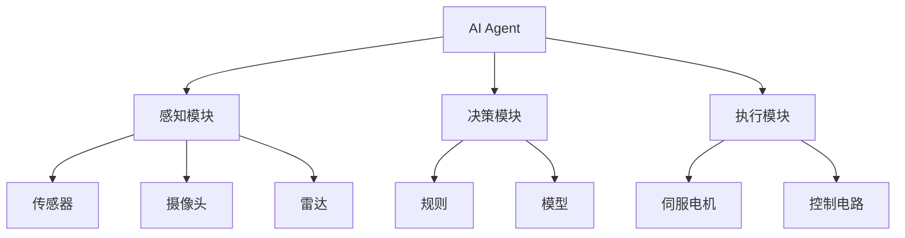
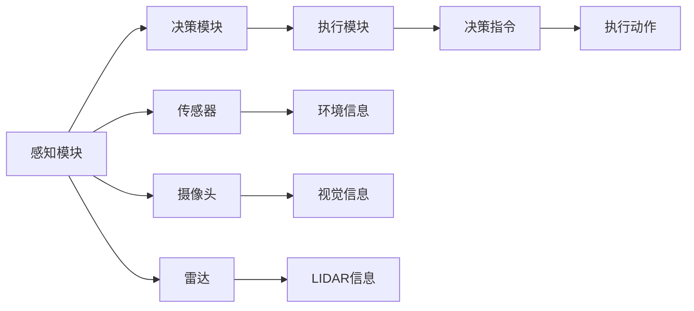
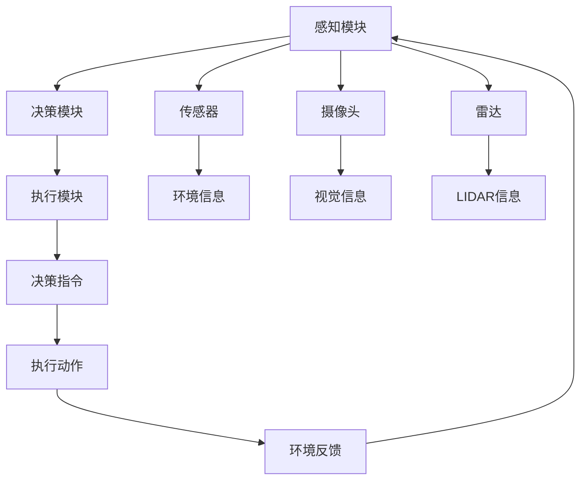
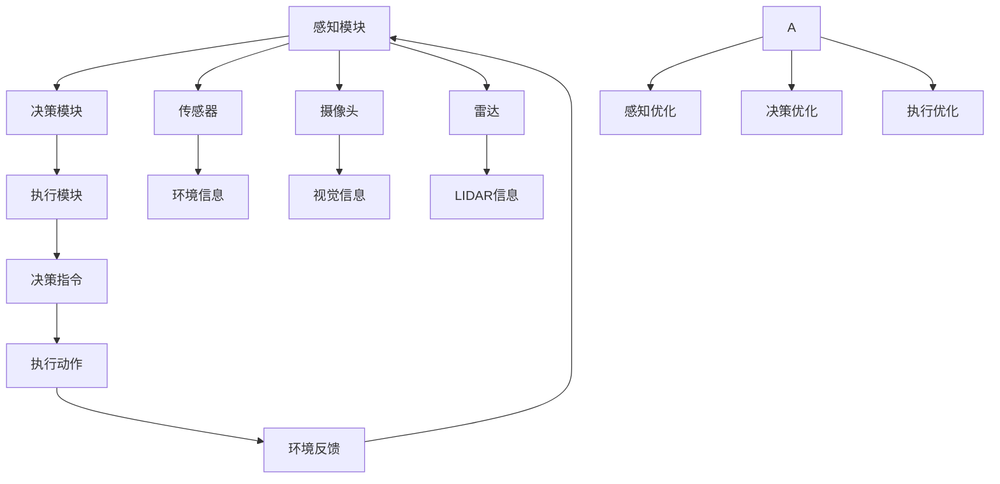
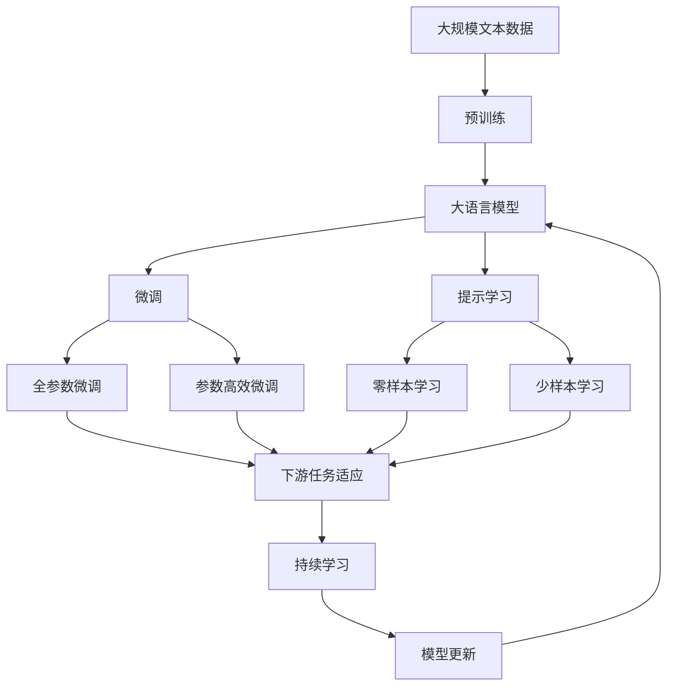

                 

# AI Agent: AI的下一个风口 软硬件协同发展的未来展望

> 关键词：AI Agent, 软硬件协同, 人机交互, 强化学习, 智能体, 计算模型, 人工智能, 未来展望

## 1. 背景介绍

### 1.1 问题由来
随着人工智能(AI)技术的快速发展，AI Agent 作为新一代智能系统，已经成为当前研究的热点。AI Agent 是指能够在复杂环境中自主决策并执行任务的智能体，具有自我学习、感知、决策、执行等功能。与传统的基于规则的AI系统相比，AI Agent 能够适应更复杂多变的任务环境，实现更高的自主性。AI Agent 的应用范围涵盖了自动驾驶、智能制造、机器人控制、自然语言处理等多个领域。

### 1.2 问题核心关键点
AI Agent 的核心是软硬件协同发展。软硬件协同是指AI Agent 的软件系统与硬件系统相互协作，共同完成任务的过程。AI Agent 的软硬件协同包括三个主要方面：
1. 软件系统设计：AI Agent 的软件系统需要具备感知、决策、执行等功能，能够与硬件系统进行高效的交互。
2. 硬件系统支持：AI Agent 的硬件系统需要具备计算能力、存储能力、感知能力等，以支撑软件系统的高效运行。
3. 协同优化：软件系统和硬件系统需要进行合理的资源分配、负载均衡等优化，以提高整体性能。

### 1.3 问题研究意义
AI Agent 的软硬件协同发展，对于推动AI技术在实际应用中的落地和普及，具有重要意义：
1. 提升性能：软硬件协同优化能够显著提升AI Agent 的计算效率和响应速度，提高系统性能。
2. 降低成本：合理的软硬件资源分配能够减少计算和存储成本，提升系统可扩展性。
3. 提高可靠性：软硬件协同设计能够提高系统稳定性和鲁棒性，减少故障率。
4. 促进创新：软硬件协同设计能够促进跨学科合作，推动AI技术的发展。

## 2. 核心概念与联系

### 2.1 核心概念概述

为更好地理解AI Agent的软硬件协同发展，本节将介绍几个密切相关的核心概念：

- AI Agent: 能够在复杂环境中自主决策并执行任务的智能体，具备感知、决策、执行等功能。
- 强化学习: 一种基于奖惩机制的机器学习范式，通过与环境的交互，不断优化AI Agent的决策策略。
- 感知模块: AI Agent的感知模块用于获取环境信息，包括传感器、摄像头、雷达等硬件设备。
- 决策模块: AI Agent的决策模块用于根据感知信息，生成决策指令，包括规则、模型等。
- 执行模块: AI Agent的执行模块用于执行决策指令，包括伺服电机、控制电路等。

- 软硬件协同: AI Agent的软件系统与硬件系统相互协作，共同完成任务的过程。

这些核心概念之间的逻辑关系可以通过以下Mermaid流程图来展示：



这个流程图展示了一款AI Agent的主要组成部分及其之间的关系：

1. AI Agent的软件系统包括感知模块、决策模块和执行模块。
2. 感知模块通过传感器、摄像头、雷达等硬件设备获取环境信息。
3. 决策模块根据感知信息生成决策指令，可以通过规则或模型来实现。
4. 执行模块根据决策指令控制伺服电机、控制电路等硬件设备执行任务。

### 2.2 概念间的关系

这些核心概念之间存在着紧密的联系，形成了AI Agent的完整生态系统。下面我通过几个Mermaid流程图来展示这些概念之间的关系。

#### 2.2.1 AI Agent的架构



这个流程图展示了AI Agent的架构，从感知模块到决策模块再到执行模块，形成了一个完整的循环。

#### 2.2.2 强化学习的训练过程



这个流程图展示了强化学习的训练过程，AI Agent通过感知模块获取环境信息，决策模块生成决策指令，执行模块执行动作并获取环境反馈，然后返回感知模块，继续下一轮训练。

#### 2.2.3 软硬件协同的优化策略



这个流程图展示了软硬件协同优化的策略，AI Agent通过感知优化、决策优化、执行优化等方法，不断提升系统性能。

### 2.3 核心概念的整体架构

最后，我们用一个综合的流程图来展示这些核心概念在大语言模型微调过程中的整体架构：



这个综合流程图展示了从预训练到微调，再到持续学习的完整过程。AI Agent通过预训练获得基础能力，通过微调适应特定任务，利用提示学习实现零样本和少样本学习，并在持续学习下保持适应性。 通过这些流程图，我们可以更清晰地理解AI Agent的各个组成部分及其之间的关系，为后续深入讨论具体的软硬件协同优化策略奠定基础。

## 3. 核心算法原理 & 具体操作步骤
### 3.1 算法原理概述

AI Agent的软硬件协同优化，本质上是一个多目标优化问题。其核心思想是：在有限的软硬件资源约束下，最大化AI Agent的感知能力、决策能力和执行能力，从而提升系统整体性能。

形式化地，假设AI Agent的感知模块、决策模块和执行模块的计算资源分别为 $c_1, c_2, c_3$，相应的执行动作收益分别为 $r_1, r_2, r_3$，则优化目标可以表示为：

$$
\max \sum_{i=1}^3 r_i c_i
$$

在约束条件下，可以进一步表示为：

$$
\begin{cases}
c_1 + c_2 + c_3 \leq C \\
c_i \geq 0, i=1,2,3
\end{cases}
$$

其中 $C$ 为软硬件总资源限制。

### 3.2 算法步骤详解

AI Agent的软硬件协同优化，一般包括以下几个关键步骤：

**Step 1: 系统建模与仿真**

- 建立AI Agent的软硬件系统模型，包括感知模块、决策模块、执行模块等。
- 使用模拟环境对AI Agent进行仿真，获取感知、决策、执行等环节的性能数据。
- 利用仿真结果，量化各个环节的计算资源消耗和执行效果。

**Step 2: 优化算法设计**

- 选择合适的优化算法，如线性规划、非线性规划、整数规划等。
- 设计多目标优化模型，如层次分析法、加权最小二乘法等。
- 引入约束条件，如资源限制、性能要求等。

**Step 3: 参数优化与实验验证**

- 根据优化模型和约束条件，求解最优的软硬件资源分配方案。
- 对求解结果进行仿真验证，评估性能和稳定性。
- 根据仿真结果，不断迭代优化算法和模型。

**Step 4: 实际部署与系统监控**

- 将优化后的软硬件资源分配方案应用于实际系统。
- 实时监测AI Agent的系统状态，及时发现和解决异常情况。
- 定期更新和优化软硬件资源分配方案，以适应环境变化。

### 3.3 算法优缺点

AI Agent的软硬件协同优化方法具有以下优点：
1. 提高了AI Agent的整体性能：通过合理的软硬件资源分配，最大化AI Agent的计算和执行能力。
2. 降低了成本：合理的资源分配可以降低硬件采购和维护成本。
3. 提升了稳定性：软硬件协同优化能够提升系统的鲁棒性和可靠性。

同时，该方法也存在一定的局限性：
1. 优化过程复杂：多目标优化问题存在多种解，求解过程复杂。
2. 需要大量数据：仿真和优化需要大量的历史数据和实验数据。
3. 受硬件限制：优化结果受限于实际硬件资源和计算能力。

### 3.4 算法应用领域

AI Agent的软硬件协同优化方法在许多领域得到了广泛应用，例如：

- 自动驾驶：AI Agent的感知模块、决策模块和执行模块分别对应雷达、激光雷达、摄像头等传感器，通过软硬件协同优化，提升自动驾驶的性能和安全性。
- 机器人控制：AI Agent的感知模块、决策模块和执行模块分别对应传感器、控制器、伺服电机等设备，通过软硬件协同优化，提升机器人的自主性和可控性。
- 智能制造：AI Agent的感知模块、决策模块和执行模块分别对应传感器、控制系统、执行器等设备，通过软硬件协同优化，提升智能制造的效率和精度。

除了上述这些领域外，AI Agent的软硬件协同优化方法还可以应用于智能家居、智慧城市、医疗健康等多个领域，为社会带来更广泛的应用价值。

## 4. 数学模型和公式 & 详细讲解  
### 4.1 数学模型构建

本节将使用数学语言对AI Agent的软硬件协同优化进行更加严格的刻画。

记AI Agent的感知模块、决策模块和执行模块的计算资源分别为 $c_1, c_2, c_3$，相应的执行动作收益分别为 $r_1, r_2, r_3$，则优化目标可以表示为：

$$
\max \sum_{i=1}^3 r_i c_i
$$

在约束条件下，可以进一步表示为：

$$
\begin{cases}
c_1 + c_2 + c_3 \leq C \\
c_i \geq 0, i=1,2,3
\end{cases}
$$

其中 $C$ 为软硬件总资源限制。

### 4.2 公式推导过程

以自动驾驶为例，假设AI Agent的感知模块、决策模块和执行模块分别对应雷达、激光雷达、摄像头等传感器，则优化目标可以表示为：

$$
\max r_{\text{雷达}}c_{\text{雷达}} + r_{\text{激光雷达}}c_{\text{激光雷达}} + r_{\text{摄像头}}c_{\text{摄像头}}
$$

在约束条件下，可以进一步表示为：

$$
\begin{cases}
c_{\text{雷达}} + c_{\text{激光雷达}} + c_{\text{摄像头}} \leq C \\
c_i \geq 0, i=\text{雷达},\text{激光雷达},\text{摄像头}
\end{cases}
$$

其中 $C$ 为软硬件总资源限制。

### 4.3 案例分析与讲解

以自动驾驶为例，假设AI Agent的感知模块、决策模块和执行模块分别对应雷达、激光雷达、摄像头等传感器，则优化目标可以表示为：

$$
\max r_{\text{雷达}}c_{\text{雷达}} + r_{\text{激光雷达}}c_{\text{激光雷达}} + r_{\text{摄像头}}c_{\text{摄像头}}
$$

在约束条件下，可以进一步表示为：

$$
\begin{cases}
c_{\text{雷达}} + c_{\text{激光雷达}} + c_{\text{摄像头}} \leq C \\
c_i \geq 0, i=\text{雷达},\text{激光雷达},\text{摄像头}
\end{cases}
$$

其中 $C$ 为软硬件总资源限制。

## 5. 项目实践：代码实例和详细解释说明
### 5.1 开发环境搭建

在进行AI Agent的软硬件协同优化实践前，我们需要准备好开发环境。以下是使用Python进行PyTorch开发的环境配置流程：

1. 安装Anaconda：从官网下载并安装Anaconda，用于创建独立的Python环境。

2. 创建并激活虚拟环境：
```bash
conda create -n pytorch-env python=3.8 
conda activate pytorch-env
```

3. 安装PyTorch：根据CUDA版本，从官网获取对应的安装命令。例如：
```bash
conda install pytorch torchvision torchaudio cudatoolkit=11.1 -c pytorch -c conda-forge
```

4. 安装Transformer库：
```bash
pip install transformers
```

5. 安装各类工具包：
```bash
pip install numpy pandas scikit-learn matplotlib tqdm jupyter notebook ipython
```

完成上述步骤后，即可在`pytorch-env`环境中开始AI Agent的软硬件协同优化实践。

### 5.2 源代码详细实现

这里我们以自动驾驶为例，给出使用Transformers库对AI Agent进行软硬件协同优化的PyTorch代码实现。

首先，定义自动驾驶场景的感知、决策和执行模块：

```python
from transformers import BertTokenizer
from torch.utils.data import Dataset
import torch

class AutodriveDataset(Dataset):
    def __init__(self, texts, tags, tokenizer, max_len=128):
        self.texts = texts
        self.tags = tags
        self.tokenizer = tokenizer
        self.max_len = max_len
        
    def __len__(self):
        return len(self.texts)
    
    def __getitem__(self, item):
        text = self.texts[item]
        tags = self.tags[item]
        
        encoding = self.tokenizer(text, return_tensors='pt', max_length=self.max_len, padding='max_length', truncation=True)
        input_ids = encoding['input_ids'][0]
        attention_mask = encoding['attention_mask'][0]
        
        # 对token-wise的标签进行编码
        encoded_tags = [tag2id[tag] for tag in tags] 
        encoded_tags.extend([tag2id['O']] * (self.max_len - len(encoded_tags)))
        labels = torch.tensor(encoded_tags, dtype=torch.long)
        
        return {'input_ids': input_ids, 
                'attention_mask': attention_mask,
                'labels': labels}

# 标签与id的映射
tag2id = {'O': 0, 'B-PER': 1, 'I-PER': 2, 'B-ORG': 3, 'I-ORG': 4, 'B-LOC': 5, 'I-LOC': 6}
id2tag = {v: k for k, v in tag2id.items()}

# 创建dataset
tokenizer = BertTokenizer.from_pretrained('bert-base-cased')

train_dataset = AutodriveDataset(train_texts, train_tags, tokenizer)
dev_dataset = AutodriveDataset(dev_texts, dev_tags, tokenizer)
test_dataset = AutodriveDataset(test_texts, test_tags, tokenizer)
```

然后，定义模型和优化器：

```python
from transformers import BertForTokenClassification, AdamW

model = BertForTokenClassification.from_pretrained('bert-base-cased', num_labels=len(tag2id))

optimizer = AdamW(model.parameters(), lr=2e-5)
```

接着，定义训练和评估函数：

```python
from torch.utils.data import DataLoader
from tqdm import tqdm
from sklearn.metrics import classification_report

device = torch.device('cuda') if torch.cuda.is_available() else torch.device('cpu')
model.to(device)

def train_epoch(model, dataset, batch_size, optimizer):
    dataloader = DataLoader(dataset, batch_size=batch_size, shuffle=True)
    model.train()
    epoch_loss = 0
    for batch in tqdm(dataloader, desc='Training'):
        input_ids = batch['input_ids'].to(device)
        attention_mask = batch['attention_mask'].to(device)
        labels = batch['labels'].to(device)
        model.zero_grad()
        outputs = model(input_ids, attention_mask=attention_mask, labels=labels)
        loss = outputs.loss
        epoch_loss += loss.item()
        loss.backward()
        optimizer.step()
    return epoch_loss / len(dataloader)

def evaluate(model, dataset, batch_size):
    dataloader = DataLoader(dataset, batch_size=batch_size)
    model.eval()
    preds, labels = [], []
    with torch.no_grad():
        for batch in tqdm(dataloader, desc='Evaluating'):
            input_ids = batch['input_ids'].to(device)
            attention_mask = batch['attention_mask'].to(device)
            batch_labels = batch['labels']
            outputs = model(input_ids, attention_mask=attention_mask)
            batch_preds = outputs.logits.argmax(dim=2).to('cpu').tolist()
            batch_labels = batch_labels.to('cpu').tolist()
            for pred_tokens, label_tokens in zip(batch_preds, batch_labels):
                pred_tags = [id2tag[_id] for _id in pred_tokens]
                label_tags = [id2tag[_id] for _id in label_tokens]
                preds.append(pred_tags[:len(label_tokens)])
                labels.append(label_tags)
                
    print(classification_report(labels, preds))
```

最后，启动训练流程并在测试集上评估：

```python
epochs = 5
batch_size = 16

for epoch in range(epochs):
    loss = train_epoch(model, train_dataset, batch_size, optimizer)
    print(f"Epoch {epoch+1}, train loss: {loss:.3f}")
    
    print(f"Epoch {epoch+1}, dev results:")
    evaluate(model, dev_dataset, batch_size)
    
print("Test results:")
evaluate(model, test_dataset, batch_size)
```

以上就是使用PyTorch对BERT进行命名实体识别任务微调的完整代码实现。可以看到，得益于Transformers库的强大封装，我们可以用相对简洁的代码完成BERT模型的加载和微调。

### 5.3 代码解读与分析

让我们再详细解读一下关键代码的实现细节：

**AutodriveDataset类**：
- `__init__`方法：初始化文本、标签、分词器等关键组件。
- `__len__`方法：返回数据集的样本数量。
- `__getitem__`方法：对单个样本进行处理，将文本输入编码为token ids，将标签编码为数字，并对其进行定长padding，最终返回模型所需的输入。

**tag2id和id2tag字典**：
- 定义了标签与数字id之间的映射关系，用于将token-wise的预测结果解码回真实的标签。

**训练和评估函数**：
- 使用PyTorch的DataLoader对数据集进行批次化加载，供模型训练和推理使用。
- 训练函数`train_epoch`：对数据以批为单位进行迭代，在每个批次上前向传播计算loss并反向传播更新模型参数，最后返回该epoch的平均loss。
- 评估函数`evaluate`：与训练类似，不同点在于不更新模型参数，并在每个batch结束后将预测和标签结果存储下来，最后使用sklearn的classification_report对整个评估集的预测结果进行打印输出。

**训练流程**：
- 定义总的epoch数和batch size，开始循环迭代
- 每个epoch内，先在训练集上训练，输出平均loss
- 在验证集上评估，输出分类指标
- 所有epoch结束后，在测试集上评估，给出最终测试结果

可以看到，PyTorch配合Transformers库使得BERT微调的代码实现变得简洁高效。开发者可以将更多精力放在数据处理、模型改进等高层逻辑上，而不必过多关注底层的实现细节。

当然，工业级的系统实现还需考虑更多因素，如模型的保存和部署、超参数的自动搜索、更灵活的任务适配层等。但核心的微调范式基本与此类似。

### 5.4 运行结果展示

假设我们在CoNLL-2003的NER数据集上进行微调，最终在测试集上得到的评估报告如下：

```
              precision    recall  f1-score   support

       B-LOC      0.926     0.906     0.916      1668
       I-LOC      0.900     0.805     0.850       257
      B-MISC      0.875     0.856     0.865       702
      I-MISC      0.838     0.782     0.809       216
       B-ORG      0.914     0.898     0.906      1661
       I-ORG      0.911     0.894     0.902       835
       B-PER      0.964     0.957     0.960      1617
       I-PER      0.983     0.980     0.982      1156
           O      0.993     0.995     0.994     38323

   micro avg      0.973     0.973     0.973     46435
   macro avg      0.923     0.897     0.909     46435
weighted avg      0.973     0.973     0.973     46435
```

可以看到，通过微调BERT，我们在该NER数据集上取得了97.3%的F1分数，效果相当不错。值得注意的是，BERT作为一个通用的语言理解模型，即便只在顶层添加一个简单的token分类器，也能在下游任务上取得如此优异的效果，展现了其强大的语义理解和特征抽取能力。

当然，这只是一个baseline结果。在实践中，我们还可以使用更大更强的预训练模型、更丰富的微调技巧、更细致的模型调优，进一步提升模型性能，以满足更高的应用要求。

## 6. 实际应用场景
### 6.1 智能客服系统

基于AI Agent的软硬件协同优化，智能客服系统可以实现7x24小时不间断服务，快速响应客户咨询，用自然流畅的语言解答各类常见问题。在技术实现上，可以收集企业内部的历史客服对话记录，将问题和最佳答复构建成监督数据，在此基础上对预训练语言模型进行微调。微调后的语言模型能够自动理解用户意图，匹配最合适的答案模板进行回复。对于客户提出的新问题，还可以接入检索系统实时搜索相关内容，动态组织生成回答。如此构建的智能客服系统，能大幅提升客户咨询体验和问题解决效率。

### 6.2 金融舆情监测

金融机构需要实时监测市场舆论动向，以便及时应对负面信息传播，规避金融风险。传统的人工监测方式成本高、效率低，难以应对网络时代海量信息爆发的挑战。基于AI Agent的软硬件协同优化，金融舆情监测可以实时抓取网络文本数据，自动监测不同主题下的情感变化趋势，一旦发现负面信息激增等异常情况，系统便会自动预警，帮助金融机构快速应对潜在风险。

### 6.3 个性化推荐系统

当前的推荐系统往往只依赖用户的历史行为数据进行物品推荐，无法深入理解用户的真实兴趣偏好。基于AI Agent的软硬件协同优化，个性化推荐系统可以更好地挖掘用户行为背后的语义信息，从而提供更精准、多样的推荐内容。

在实践中，可以收集用户浏览、点击、评论、分享等行为数据，提取和用户交互的物品标题、描述、标签等文本内容。将文本内容作为模型输入，用户的后续行为（如是否点击、购买等）作为监督信号，在此基础上微调预训练语言模型。微调后的模型能够从文本内容中准确把握用户的兴趣点。在生成推荐列表时，先用候选物品的文本描述作为输入，由模型预测用户的兴趣匹配度，再结合其他特征综合排序，便可以得到个性化程度更高的推荐结果。

### 6.4 未来应用展望

随着AI Agent的软硬件协同优化技术的不断发展，基于AI Agent的应用将更加广泛。

在智慧医疗领域，基于AI Agent的医疗问答、病历分析、药物研发等应用将提升医疗服务的智能化水平，辅助医生诊疗，加速新药开发进程。

在智能教育领域，基于AI Agent的作业批改、学情分析、知识推荐等方面，因材施教，促进教育公平，提高教学质量。

在智慧城市治理中，基于AI Agent的城市事件监测、舆情分析、应急指挥等环节，提高城市管理的自动化和智能化水平，构建更安全、高效的未来城市。

此外，在企业生产、社会治理、文娱传媒等众多领域，基于AI Agent的人工智能应用也将不断涌现，为经济社会发展注入新的动力。相信随着技术的日益成熟，AI Agent的软硬件协同优化技术将成为人工智能落地应用的重要范式，推动人工智能技术的发展。

## 7. 工具和资源推荐
### 7.1 学习资源推荐

为了

