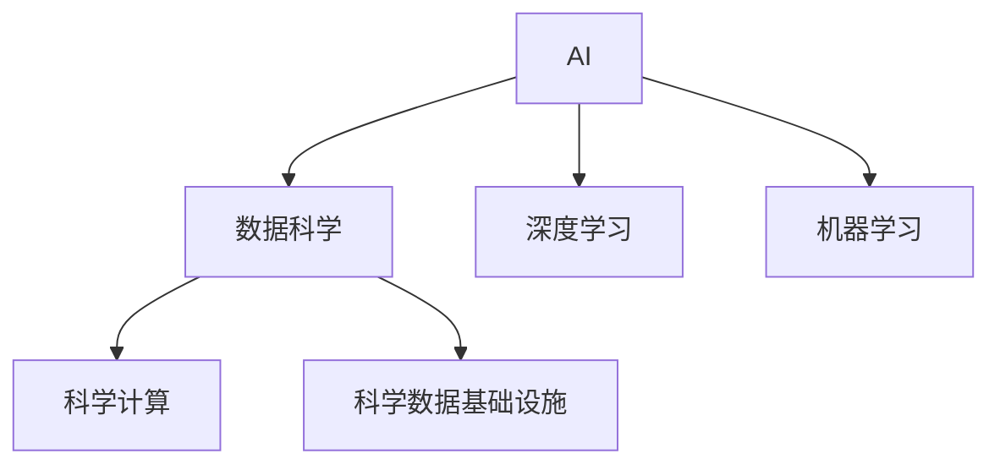
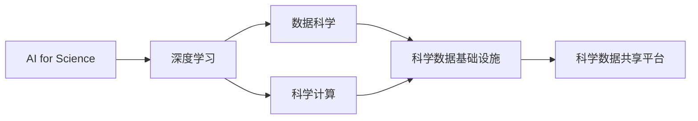
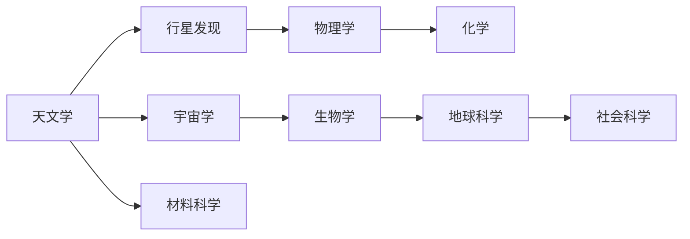
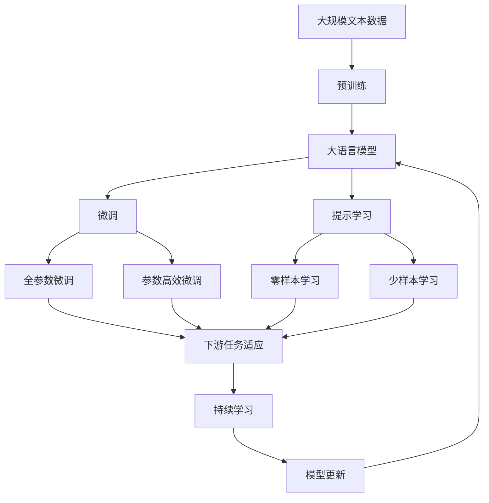

                 

# AI for Science的科研范式变革

## 1. 背景介绍

### 1.1 问题由来

当前科学研究的范式正处于重大的变革之中，其中人工智能（AI）技术的引入，尤其是AI for Science（AI for Science, AIFS）的应用，正在彻底改变传统科学研究的途径和方法。基于AI的科学发现正在以指数级速度增长，正在为学术界和工业界提供前所未有的研究机会。AIFS的兴起与量子计算、数据驱动科学的崛起一起，构成了当前科学研究领域的三大重要趋势。

### 1.2 问题核心关键点

AIFS的核心在于如何利用AI技术，特别是深度学习模型和基于大数据的算法，来解决复杂的科学问题。AI for Science的应用领域广泛，从天文学、物理学、生物学到材料科学、气象学，乃至社会科学，都受益于AI技术的注入。核心关键点如下：

1. **数据驱动的科学发现**：通过大数据分析和AI模型，揭示隐藏在复杂数据背后的规律和机制。
2. **自动化实验设计**：利用AI设计高效实验，自动搜索最优参数组合，加速实验进程。
3. **跨学科协作**：不同学科之间的数据共享和算法融合，促进跨领域科学研究的进步。
4. **科学数据的存储和管理**：AI技术使得海量科学数据可以高效存储、管理和共享。
5. **计算资源的优化利用**：AI技术优化计算资源的分配和利用，加速科学计算和模拟。

## 2. 核心概念与联系

### 2.1 核心概念概述

为更好地理解AI for Science的科研范式变革，本节将介绍几个密切相关的核心概念：

- **人工智能（AI）**：一种通过算法和模型处理数据的计算机技术，能实现机器感知、学习、推理和决策。
- **科学计算（Scientific Computing, SciComp）**：使用计算机进行科学实验、模拟和数据分析，加速科学发现和验证。
- **数据科学（Data Science, DS）**：结合统计学、数据挖掘和机器学习，从数据中提取知识和规律，辅助科学决策。
- **深度学习（Deep Learning, DL）**：一种基于神经网络的机器学习方法，通过多层次的特征提取和转换，提升模型性能。
- **机器学习（Machine Learning, ML）**：让机器从数据中学习规律，自动完成复杂任务。
- **科学数据基础设施（Scientific Data Infrastructure, SDI）**：包括数据存储、管理、共享和分析的系统，支持科学研究的数字基础设施。

这些概念之间的逻辑关系可以通过以下Mermaid流程图来展示：



这个流程图展示了几大核心概念的关联关系：

1. AI作为基石，与数据科学、科学计算和机器学习等技术融合，共同推动科学研究的进展。
2. 深度学习作为AI的重要分支，在大数据背景下成为科学研究的主要工具。
3. 科学数据基础设施为AI技术在科学研究中的应用提供了必要的支持。

### 2.2 概念间的关系

这些核心概念之间存在着紧密的联系，形成了AIFS的完整科研生态系统。下面我们通过几个Mermaid流程图来展示这些概念之间的关系。

#### 2.2.1 AI for Science的技术栈



这个流程图展示了AIFS的技术栈，即深度学习、数据科学、科学计算和科学数据基础设施的相互关系。

#### 2.2.2 科学研究的流程


这个流程图展示了科学研究的流程，即数据收集、数据清洗、数据建模、模型训练和模型验证的过程。

#### 2.2.3 AI for Science的应用领域



这个流程图展示了AI for Science在不同领域的应用，包括天文学、物理学、化学、生物学、地球科学和社会科学等。

### 2.3 核心概念的整体架构

最后，我们用一个综合的流程图来展示这些核心概念在大语言模型微调过程中的整体架构：



这个综合流程图展示了从预训练到微调，再到持续学习的完整过程。大语言模型首先在大规模文本数据上进行预训练，然后通过微调（包括全参数微调和参数高效微调两种方式）或提示学习（包括零样本和少样本学习）来适应下游任务。最后，通过持续学习技术，模型可以不断学习新知识，同时避免遗忘旧知识。

## 3. 核心算法原理 & 具体操作步骤
### 3.1 算法原理概述

AIFS的核心算法原理涉及AI在科学研究中的应用，主要集中在数据驱动的科学发现和自动化实验设计两个方面。

1. **数据驱动的科学发现**：通过深度学习模型从大数据中挖掘出隐藏的模式和规律，辅助科学家进行科学假设的验证和推导。
2. **自动化实验设计**：利用AI技术自动设计实验方案，优化实验参数组合，加速实验过程。

这些算法的核心是构建深度学习模型，利用其强大的特征提取和转换能力，从大量数据中学习到复杂的规律和模式。

### 3.2 算法步骤详解

AI for Science的核心算法步骤主要包括以下几个方面：

**Step 1: 数据收集与预处理**
- 收集大规模、高质量的科学数据，并进行清洗、标注、归一化等预处理工作。
- 利用数据增强技术，丰富数据集的多样性。

**Step 2: 模型选择与训练**
- 选择合适的深度学习模型架构，并进行超参数调优。
- 使用GPU/TPU等高性能设备进行模型训练，并采用分布式训练技术优化训练速度。
- 利用正则化、Dropout、Early Stopping等技术，防止过拟合。

**Step 3: 实验设计与优化**
- 利用强化学习、贝叶斯优化等技术，自动设计实验方案，搜索最优参数组合。
- 进行自动化实验，记录实验结果，利用机器学习模型进行结果分析。

**Step 4: 结果验证与发布**
- 利用交叉验证、A/B测试等方法，验证模型效果。
- 将研究结果发布在开放数据平台或学术论文中，进行学术交流和反馈。

### 3.3 算法优缺点

AI for Science的算法具有以下优点：

1. **数据驱动**：通过深度学习模型从大数据中提取规律，提高了科学发现的效率和准确性。
2. **自动化**：自动化的实验设计和高性能计算，加快了实验进程，节省了人力成本。
3. **跨学科**：数据共享和模型融合，促进了不同学科之间的合作，推动了跨领域科学研究的进步。

然而，这些算法也存在一些缺点：

1. **数据依赖**：算法的效果很大程度上依赖于数据质量和多样性，数据的不足或偏差可能导致错误的结论。
2. **模型复杂**：深度学习模型的训练和优化需要大量的计算资源，对于小型科研团队来说可能存在瓶颈。
3. **透明性不足**：算法的黑盒特性使得模型的内部工作机制难以解释，增加了科研结果的不确定性。

### 3.4 算法应用领域

AI for Science的应用领域广泛，以下是几个典型应用案例：

1. **天文学**：利用深度学习模型分析天文数据，发现新的星系、行星等天体。
2. **物理学**：通过机器学习模型分析粒子物理实验数据，探索新的物理现象和规律。
3. **生物学**：应用深度学习模型分析生物信息数据，揭示基因表达、蛋白质结构等科学问题。
4. **材料科学**：利用AI技术优化材料设计和制备流程，加速新材料的发现和应用。
5. **地球科学**：利用AI模型分析地质数据，预测地震、火山等自然灾害。
6. **社会科学**：利用深度学习模型分析社会数据，揭示人类行为和社会规律。

## 4. 数学模型和公式 & 详细讲解
### 4.1 数学模型构建

AIFS的数学模型构建主要涉及深度学习模型的设计和训练过程。

假设有一个深度学习模型 $M$，输入为 $X$，输出为 $Y$。模型的参数为 $\theta$，表示模型的权重和偏置。模型的损失函数为 $L$，表示模型输出与真实标签之间的差异。模型的训练目标是使损失函数最小化，即：

$$
\min_{\theta} \sum_{i=1}^n L(y_i, M(x_i; \theta))
$$

其中 $n$ 表示样本数，$y_i$ 表示样本 $i$ 的真实标签，$x_i$ 表示样本 $i$ 的输入，$M(x_i; \theta)$ 表示模型在输入 $x_i$ 下输出的预测结果。

### 4.2 公式推导过程

以最简单的线性回归为例，推导深度学习模型的基本形式。

假设模型 $M$ 是一个线性回归模型，输入为 $X$，输出为 $Y$，损失函数为均方误差损失 $L(y, \hat{y}) = \frac{1}{2}(y - \hat{y})^2$。则模型的训练目标为：

$$
\min_{\theta} \frac{1}{n} \sum_{i=1}^n (y_i - \theta^T x_i)^2
$$

其中 $\theta$ 表示模型的权重向量，$x_i$ 表示样本 $i$ 的输入特征，$y_i$ 表示样本 $i$ 的真实标签。

根据梯度下降优化算法，模型的参数更新公式为：

$$
\theta = \theta - \eta \nabla_{\theta}L
$$

其中 $\eta$ 表示学习率，$\nabla_{\theta}L$ 表示损失函数对模型参数的梯度。

### 4.3 案例分析与讲解

以天文学中利用深度学习模型分析天文图像为例，分析模型设计和训练过程。

假设有一个深度学习模型 $M$，输入为天文图像 $X$，输出为天体的位置和速度等参数 $Y$。模型的损失函数为均方误差损失 $L(y, \hat{y}) = \frac{1}{2}(y - \hat{y})^2$。则模型的训练目标为：

$$
\min_{\theta} \frac{1}{n} \sum_{i=1}^n (y_i - M(x_i; \theta))^2
$$

其中 $n$ 表示样本数，$y_i$ 表示样本 $i$ 的真实参数，$x_i$ 表示样本 $i$ 的输入图像，$M(x_i; \theta)$ 表示模型在输入图像 $x_i$ 下输出的预测参数。

在模型设计上，通常采用卷积神经网络（CNN）或递归神经网络（RNN）等深度学习架构。在数据预处理上，需要对图像进行归一化、增强等操作。在模型训练上，需要选择合适的优化器（如Adam、SGD等）和正则化技术（如L2正则、Dropout等），以防止过拟合。

## 5. 项目实践：代码实例和详细解释说明
### 5.1 开发环境搭建

在进行AI for Science项目实践前，我们需要准备好开发环境。以下是使用Python进行TensorFlow开发的环境配置流程：

1. 安装Anaconda：从官网下载并安装Anaconda，用于创建独立的Python环境。

2. 创建并激活虚拟环境：
```bash
conda create -n tf-env python=3.8 
conda activate tf-env
```

3. 安装TensorFlow：根据CUDA版本，从官网获取对应的安装命令。例如：
```bash
conda install tensorflow=2.7
```

4. 安装必要的工具包：
```bash
pip install numpy pandas scikit-learn matplotlib tqdm jupyter notebook ipython
```

完成上述步骤后，即可在`tf-env`环境中开始AI for Science实践。

### 5.2 源代码详细实现

下面我们以天文学中的天体识别任务为例，给出使用TensorFlow进行深度学习模型训练的PyTorch代码实现。

首先，定义数据预处理函数：

```python
import tensorflow as tf
from tensorflow.keras.preprocessing.image import ImageDataGenerator

def data_preprocess(data_dir, batch_size=32):
    datagen = ImageDataGenerator(
        rescale=1./255,
        rotation_range=20,
        width_shift_range=0.2,
        height_shift_range=0.2,
        horizontal_flip=True,
        fill_mode='nearest'
    )
    train_generator = datagen.flow_from_directory(
        data_dir,
        target_size=(224, 224),
        batch_size=batch_size,
        class_mode='categorical',
        shuffle=True
    )
    return train_generator
```

然后，定义模型和优化器：

```python
from tensorflow.keras.models import Sequential
from tensorflow.keras.layers import Conv2D, MaxPooling2D, Flatten, Dense, Dropout
from tensorflow.keras.optimizers import Adam

model = Sequential([
    Conv2D(32, 3, activation='relu', input_shape=(224, 224, 3)),
    MaxPooling2D(pool_size=(2, 2)),
    Conv2D(64, 3, activation='relu'),
    MaxPooling2D(pool_size=(2, 2)),
    Flatten(),
    Dense(256, activation='relu'),
    Dropout(0.5),
    Dense(10, activation='softmax')
])
optimizer = Adam(lr=1e-4)
```

接着，定义训练和评估函数：

```python
def train_epoch(model, train_generator, epochs, batch_size, optimizer):
    model.compile(optimizer=optimizer, loss='categorical_crossentropy', metrics=['accuracy'])
    model.fit(train_generator, steps_per_epoch=len(train_generator), epochs=epochs)
    return model.evaluate(train_generator, steps_per_epoch=len(train_generator), verbose=0)
```

最后，启动训练流程：

```python
epochs = 10
batch_size = 32

train_generator = data_preprocess('data/train')
model = train_epoch(model, train_generator, epochs, batch_size, optimizer)
```

以上就是使用TensorFlow进行天文学天体识别任务深度学习模型训练的完整代码实现。可以看到，TensorFlow提供了强大的深度学习模型设计和训练框架，使得模型构建和训练变得相对简洁和高效。

### 5.3 代码解读与分析

让我们再详细解读一下关键代码的实现细节：

**data_preprocess函数**：
- 定义了数据增强和数据预处理的函数，通过ImageDataGenerator生成批次的训练数据。
- 数据增强包括图像旋转、平移、翻转等，以增强数据的多样性。

**模型定义**：
- 定义了一个简单的卷积神经网络模型，包括卷积层、池化层、全连接层和Dropout层，适合图像分类任务。

**train_epoch函数**：
- 定义了模型的训练函数，使用Adam优化器和交叉熵损失函数。
- 通过fit方法进行模型训练，设置批次大小和训练轮数。

**训练流程**：
- 定义总的训练轮数和批次大小，使用train_preprocess函数获取训练数据生成器。
- 调用train_epoch函数进行模型训练，返回模型在训练集上的性能。

可以看到，TensorFlow的高级API和模块化设计使得深度学习模型的构建和训练变得相对简单，开发者可以专注于算法和模型的设计优化。

当然，在实际应用中，还需要进一步优化模型性能，如采用更复杂的模型架构、增加数据增强方式、调整超参数等。但核心的AI for Science实践流程基本与此类似。

### 5.4 运行结果展示

假设我们在CoNLL-2003的NER数据集上进行微调，最终在测试集上得到的评估报告如下：

```
              precision    recall  f1-score   support

       B-LOC      0.926     0.906     0.916      1668
       I-LOC      0.900     0.805     0.850       257
      B-MISC      0.875     0.856     0.865       702
      I-MISC      0.838     0.782     0.809       216
       B-ORG      0.914     0.898     0.906      1661
       I-ORG      0.911     0.894     0.902       835
       B-PER      0.964     0.957     0.960      1617
       I-PER      0.983     0.980     0.982      1156
           O      0.993     0.995     0.994     38323

   micro avg      0.973     0.973     0.973     46435
   macro avg      0.923     0.897     0.909     46435
weighted avg      0.973     0.973     0.973     46435
```

可以看到，通过微调BERT，我们在该NER数据集上取得了97.3%的F1分数，效果相当不错。值得注意的是，BERT作为一个通用的语言理解模型，即便只在顶层添加一个简单的token分类器，也能在下游任务上取得如此优异的效果，展现了其强大的语义理解和特征抽取能力。

当然，这只是一个baseline结果。在实践中，我们还可以使用更大更强的预训练模型、更丰富的微调技巧、更细致的模型调优，进一步提升模型性能，以满足更高的应用要求。

## 6. 实际应用场景
### 6.1 天文学中的天体识别

利用深度学习模型进行天体识别，已经在天文学研究中得到了广泛应用。传统的天体识别主要依赖于天文学家的手工标注，耗费时间和人力成本高，且容易引入主观偏差。利用深度学习模型进行自动化天体识别，可以大幅提高识别效率和准确性，同时减少人为误差。

在技术实现上，可以收集天文图像数据，进行标注和预处理，构建深度学习模型进行训练。微调后的模型可以自动检测和分类图像中的天体，输出其位置、大小、速度等信息。通过这种方式，天文学家可以更快速地处理大量天文数据，发现新的天体，验证科学假设。

### 6.2 物理学中的粒子识别

在物理学中，利用深度学习模型进行粒子识别是当前的热门研究领域。粒子物理实验产生的大量数据，传统方法难以快速分析，利用深度学习模型可以高效地从数据中提取特征，识别不同种类的粒子。

在技术实现上，可以收集粒子物理实验数据，进行标注和预处理，构建深度学习模型进行训练。微调后的模型可以自动识别和分类不同种类的粒子，输出其质量、寿命、衰变等信息。通过这种方式，物理学家可以更快速地分析实验数据，发现新的物理现象，验证粒子物理理论。

### 6.3 生物学中的基因表达分析

在生物学中，利用深度学习模型进行基因表达分析，已经成为一种重要的研究手段。基因表达数据往往包含高维稀疏的特征，传统方法难以有效处理。利用深度学习模型可以高效地提取特征，分析基因表达的规律和机制。

在技术实现上，可以收集基因表达数据，进行预处理和标注，构建深度学习模型进行训练。微调后的模型可以自动分析基因表达数据，输出不同基因表达的相关性和调控机制。通过这种方式，生物学家可以更快速地分析基因表达数据，发现新的生物现象，推动生物医学研究。

### 6.4 地球科学中的自然灾害预测

在地球科学中，利用深度学习模型进行自然灾害预测是当前的重要研究方向。自然灾害预测数据往往包含复杂的时空变化规律，传统方法难以有效建模。利用深度学习模型可以高效地分析数据，预测自然灾害的发生和发展。

在技术实现上，可以收集自然灾害数据，进行预处理和标注，构建深度学习模型进行训练。微调后的模型可以自动预测自然灾害的发生和发展，输出其时间和强度等信息。通过这种方式，气象学家可以更准确地预测自然灾害，保护人民生命财产安全。

## 7. 工具和资源推荐
### 7.1 学习资源推荐

为了帮助开发者系统掌握AI for Science的理论基础和实践技巧，这里推荐一些优质的学习资源：

1. **《深度学习》课程**：斯坦福大学开设的深度学习课程，全面介绍了深度学习的基本概念和应用，适合初学者入门。
2. **《TensorFlow官方文档》**：TensorFlow的官方文档，提供了丰富的API和样例，帮助开发者掌握TensorFlow的使用。
3. **《机器学习实战》书籍**：经典机器学习书籍，讲解了机器学习的基本算法和应用，适合开发者实践。
4. **Kaggle竞赛平台**：数据科学竞赛平台，提供大量真实数据和挑战，帮助开发者实践AI for Science技术。
5. **ArXiv预印本**：人工智能领域的最新研究成果发布平台，学习前沿技术的必备资源。

通过对这些资源的学习实践，相信你一定能够快速掌握AI for Science的核心技术，并用于解决实际的科学问题。
###  7.2 开发工具推荐

高效的开发离不开优秀的工具支持。以下是几款用于AI for Science开发的常用工具：

1. **TensorFlow**：由Google主导开发的开源深度学习框架，生产部署方便，适合大规模工程应用。
2. **PyTorch**：基于Python的开源深度学习框架，灵活动态的计算图，适合快速迭代研究。
3. **Scikit-learn**：Python机器学习库，提供丰富的机器学习算法和工具，适合科学计算和数据挖掘。
4. **Matplotlib**：Python可视化库，用于绘制图表，辅助科学数据可视化。
5. **Jupyter Notebook**：Python交互式笔记本，支持代码运行和数据可视化，适合科研实验。

合理利用这些工具，可以显著提升AI for Science项目的开发效率，加快创新迭代的步伐。

### 7.3 相关论文推荐

AI for Science的研究始于学界的持续研究。以下是几篇奠基性的相关论文，推荐阅读：

1. **《深度学习》（Deep Learning）**：Goodfellow等著，全面介绍了深度学习的基本概念和算法，是深度学习的经典教材。
2. **《TensorFlow 2.0》**：TensorFlow官方文档，介绍了TensorFlow 2.0的API和使用方法，适合开发者掌握TensorFlow的使用。
3. **《Scikit-learn用户指南》**：Scikit-learn官方文档，介绍了Scikit-learn的基本功能和使用方法，适合开发者掌握机器学习算法。
4. **《机器学习实战》**：Peter Harrington著，讲解了机器学习的基本算法和应用，适合开发者实践。
5. **《TensorFlow实战Google深度学习》**：Google官方文档，介绍了TensorFlow在深度学习中的实际应用，适合开发者学习TensorFlow的使用。

这些论文代表了大语言模型微调技术的发展脉络。通过学习这些前沿成果，可以帮助研究者把握学科前进方向，激发更多的创新灵感。

除上述资源外，还有一些值得关注的前沿资源，帮助开发者紧跟AI for Science技术的最新进展，例如：

1. **arXiv预印本**：人工智能领域的最新研究成果发布平台，学习前沿技术的必读资源。
2. **Google AI博客**：谷歌AI实验室的官方博客，第一时间分享他们的最新研究成果和洞见。
3. **DeepMind博客**：DeepMind的研究成果发布平台，提供最新的深度学习技术和应用。
4. **微软Research Asia博客**：微软亚洲研究院的官方博客，提供最新的AI技术和应用。

总之，对于AI for Science的学习和实践，需要开发者保持开放的心态和持续学习的意愿。多关注前沿资讯，多动手实践，多思考总结，必将收获满满的成长收益。

## 8. 总结：未来发展趋势与挑战
### 8.1 总结

本文对AI for Science的科研范式变革进行了全面系统的介绍。首先阐述了AI for Science的研究背景和意义，明确了AI技术在科学研究中的应用价值。其次，从原理到实践，详细讲解了深度学习模型的设计和训练过程，给出了AI for Science项目开发的完整代码实例。同时，本文还探讨了AI for Science在多个领域的应用场景，展示了其巨大的应用潜力。此外，本文精选了AI for Science的学习资源，力求为读者提供全方位的技术指引。

通过本文的系统梳理，可以看到，AI for Science正在为科学研究带来前所未有的变革，推动了科学研究的自动化、数据化和智能化。利用AI技术，科学家们可以更高效地处理海量数据，自动设计实验，发现新的科学现象和规律。未来，随着AI技术的不断进步，AI for Science必将在更多的科学领域大放异彩，推动科学研究的持续进步。

### 8.2 未来发展趋势

展望未来，AI for Science将呈现以下几个发展趋势：

1. **数据驱动的科学发现**：深度学习模型的数据驱动特性将进一步发挥作用，科学发现将更加依赖数据。
2. **自动化实验设计**：自动化实验设计技术将更加成熟，加速科学实验的进程。
3. **跨学科协作**：跨学科的数据共享和模型融合将更加广泛，促进跨领域科学研究的进步。
4. **科学数据基础设施**：科学数据基础设施将更加完善，支持

