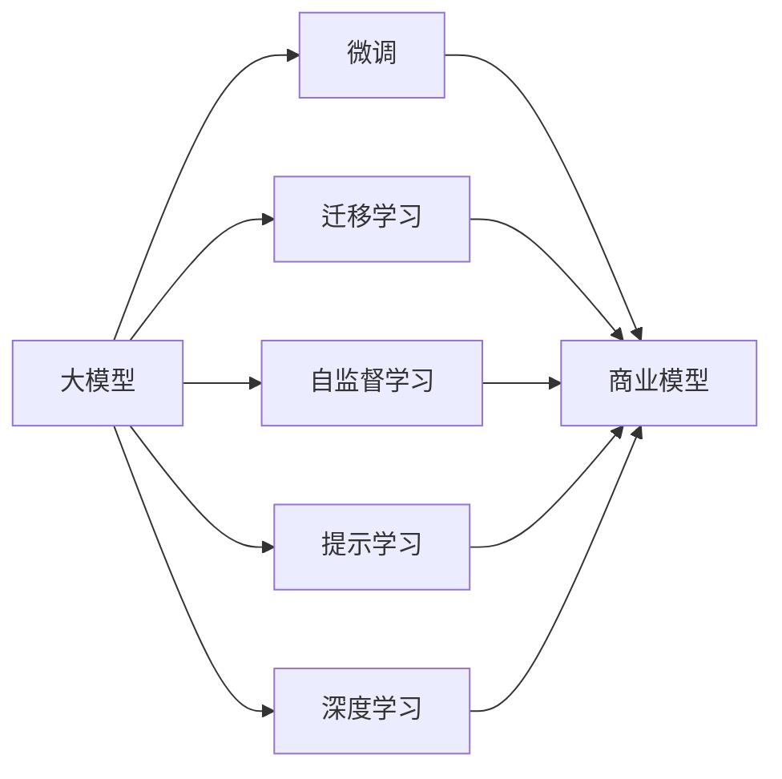
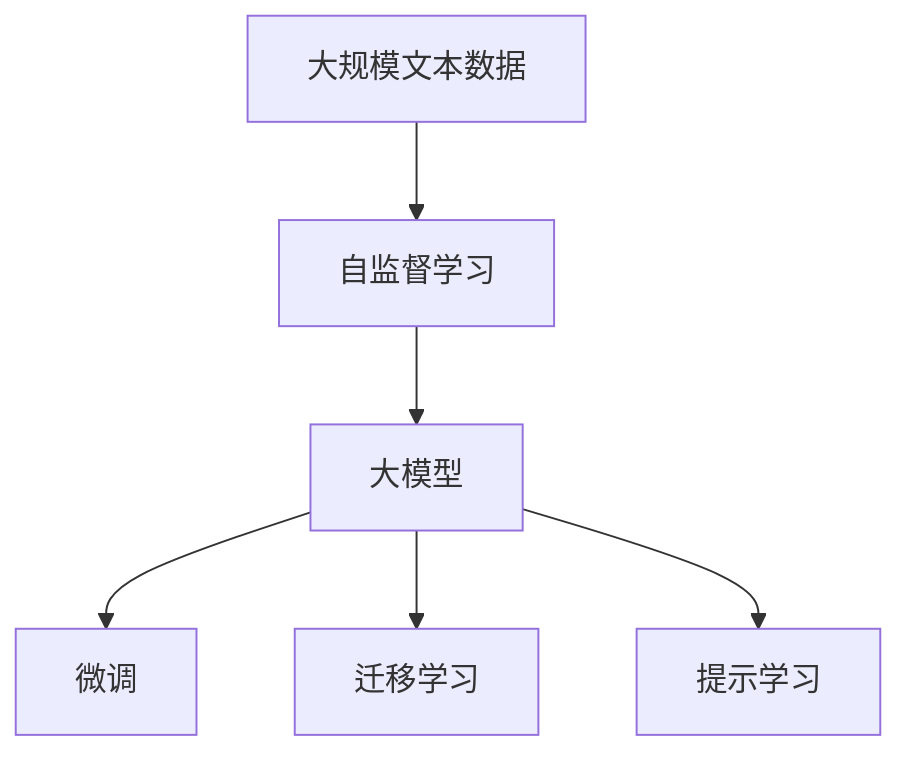
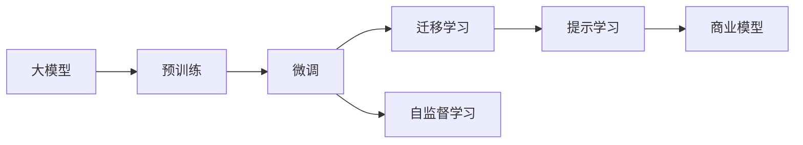

                 

# AI 大模型创业：如何利用创新优势？

## 1. 背景介绍

### 1.1 问题由来

随着人工智能技术的飞速发展，大模型（如GPT-3、BERT等）在自然语言处理（NLP）、计算机视觉（CV）等领域取得了突破性进展，成为当前AI领域的重要研究热点。大模型以其强大的泛化能力和丰富的语言知识，逐渐成为商业化落地应用的核心动力。然而，要实现大模型的商业化，仅靠技术创新是不够的，还需要对商业模式、市场定位、用户需求等进行全方位的思考和规划。

### 1.2 问题核心关键点

大模型创业的核心在于如何利用其创新优势，在商业化过程中获得竞争优势。具体而言，包括以下几个关键点：

- **技术创新**：大模型的技术创新，包括模型架构、预训练技术、微调方法等，是创业成功的基石。
- **市场需求**：找到合适的市场切入点，满足特定用户需求，是创业成功的关键。
- **商业模式**：设计可持续、高效的商业模式，才能确保长期盈利和用户粘性。
- **用户体验**：提供优质的产品体验和服务，增强用户信任和满意度。
- **数据资源**：利用大规模数据资源进行模型训练和优化，提升模型性能。

### 1.3 问题研究意义

大模型创业的成功，对于推动AI技术在各个行业中的应用，提升企业创新能力和市场竞争力，具有重要意义：

- **技术落地**：大模型创业将前沿技术转化为商业产品，有助于加速AI技术的产业化进程。
- **市场拓展**：利用大模型的优势，拓展新的市场应用，推动行业数字化转型升级。
- **用户赋能**：通过大模型，为用户提供更智能、更便捷的服务，提升用户体验。
- **竞争力提升**：通过技术创新和商业模式优化，提升企业在市场上的竞争力。

## 2. 核心概念与联系

### 2.1 核心概念概述

为更好地理解大模型创业的核心概念，本节将介绍几个密切相关的核心概念：

- **大模型**：如GPT-3、BERT等大规模预训练模型，通过在大规模无标签数据上进行预训练，学习通用语言表示，具备强大的语言理解和生成能力。
- **微调**：在预训练模型的基础上，通过有监督学习优化模型在特定任务上的性能，如自然语言推理、情感分析等。
- **迁移学习**：将一个领域学习到的知识，迁移应用到另一个相关领域，减少新任务训练成本。
- **自监督学习**：利用未标注数据进行学习，提高模型泛化能力。
- **提示学习**：通过设计合适的输入模板，引导大模型生成期望输出，实现零样本或少样本学习。
- **深度学习**：基于神经网络的大规模机器学习技术，涵盖模型设计、训练、优化等多个环节。
- **商业模型**：包含定价、渠道、服务、营销等多个维度，是确保企业可持续发展的核心。

这些概念之间的逻辑关系可以通过以下Mermaid流程图来展示：



这个流程图展示了核心概念之间的联系：大模型通过微调、迁移学习、自监督学习和提示学习等技术手段，提升了其在特定任务上的能力；同时，这些技术手段也为大模型的商业化提供了技术支撑，通过商业模型实现了产品的价值和用户价值的统一。

### 2.2 概念间的关系

这些核心概念之间存在着紧密的联系，形成了大模型创业的完整生态系统。下面我们通过几个Mermaid流程图来展示这些概念之间的关系。

#### 2.2.1 大模型的学习范式



这个流程图展示了大模型的学习范式：通过自监督学习在大量无标签数据上进行预训练，构建大模型；通过微调和迁移学习在特定任务上进行调整和优化；通过提示学习在零样本或少样本条件下提供服务。

#### 2.2.2 大模型的商业化路径



这个流程图展示了大模型的商业化路径：在大规模文本数据上进行自监督预训练，构建通用大模型；通过微调和迁移学习在特定任务上进行优化，构建针对应用的微调模型；通过提示学习在零样本或少样本条件下提供服务；同时，自监督学习也为商业模型提供了数据支持和模型优化。

## 3. 核心算法原理 & 具体操作步骤
### 3.1 算法原理概述

大模型创业的核心在于如何利用其技术优势，构建商业模型。这需要从技术创新、市场需求、商业模式、用户体验等多个维度进行全面的思考和规划。

**3.1.1 技术创新**

技术创新是大模型创业的基础。这包括模型架构、预训练技术、微调方法等多个方面。

- **模型架构**：选择适合任务需求的模型架构，如Transformer、BERT等，进行预训练和微调。
- **预训练技术**：利用自监督学习、语言建模等技术，在大规模无标签数据上进行预训练，构建泛化能力强的模型。
- **微调方法**：通过有监督学习，在大规模标注数据上进行微调，提升模型在特定任务上的性能。

**3.1.2 市场需求**

市场需求是大模型创业的关键。找到合适的市场切入点，满足特定用户需求，是创业成功的关键。

- **目标市场**：选择具有巨大潜力的市场，如医疗、金融、教育等。
- **用户需求**：深入了解目标用户的实际需求，设计合适的产品功能和服务模式。
- **竞争分析**：分析竞争对手的优势和劣势，找到市场差异化点。

**3.1.3 商业模式**

商业模式是大模型创业的核心。设计可持续、高效的商业模式，才能确保长期盈利和用户粘性。

- **定价策略**：选择合适的定价策略，如订阅制、按需付费、按使用量收费等。
- **渠道策略**：选择合适的销售渠道，如自有平台、第三方平台、合作伙伴等。
- **服务模式**：选择合适的服务模式，如API接口、SDK插件、一体化解决方案等。

**3.1.4 用户体验**

用户体验是大模型创业的重要支撑。提供优质的产品体验和服务，增强用户信任和满意度。

- **界面设计**：设计简洁、易用的用户界面，提升用户操作体验。
- **性能优化**：优化模型推理速度和资源占用，确保用户使用体验流畅。
- **多语言支持**：支持多语言输入输出，提升产品国际竞争力。

**3.1.5 数据资源**

数据资源是大模型创业的基石。利用大规模数据资源进行模型训练和优化，提升模型性能。

- **数据获取**：通过爬虫、API接口、数据合作等方式获取大规模数据资源。
- **数据清洗**：对数据进行清洗和预处理，去除噪声和无用信息。
- **数据存储**：采用高效的数据存储技术，如Hadoop、Spark等，确保数据存储和检索效率。

### 3.2 算法步骤详解

大模型创业的一般流程包括以下几个关键步骤：

**3.2.1 产品规划**

- **市场调研**：深入了解目标市场和用户需求，设计合适的产品功能和服务模式。
- **技术选型**：选择合适的技术架构和算法模型，进行预训练和微调。
- **商业模式设计**：设计可持续、高效的商业模式，确保长期盈利和用户粘性。

**3.2.2 模型训练**

- **数据收集**：通过爬虫、API接口、数据合作等方式获取大规模数据资源。
- **数据预处理**：对数据进行清洗和预处理，去除噪声和无用信息。
- **模型训练**：利用深度学习框架和分布式计算资源，在大规模数据上进行预训练和微调。

**3.2.3 模型优化**

- **模型调参**：通过超参数调优和模型选择，提高模型性能和鲁棒性。
- **性能评估**：在验证集和测试集上评估模型性能，确保模型泛化能力强。
- **部署上线**：将训练好的模型部署到生产环境，进行实时推理和服务。

**3.2.4 用户体验优化**

- **界面设计**：设计简洁、易用的用户界面，提升用户操作体验。
- **性能优化**：优化模型推理速度和资源占用，确保用户使用体验流畅。
- **多语言支持**：支持多语言输入输出，提升产品国际竞争力。

**3.2.5 市场营销**

- **品牌推广**：通过SEO、SEM、社交媒体等渠道，提升品牌知名度和市场影响力。
- **客户获取**：通过免费试用、客户推荐、广告投放等方式，获取大量客户资源。
- **用户留存**：通过优质服务、用户回馈、会员制度等方式，提升用户粘性和满意度。

### 3.3 算法优缺点

**优点**

- **技术领先**：利用大模型的技术优势，构建高性能、泛化能力强的产品。
- **用户体验佳**：通过优化产品设计和服务模式，提升用户体验和满意度。
- **市场潜力大**：大模型在各个领域的应用前景广阔，市场潜力巨大。

**缺点**

- **成本高**：大模型的训练和优化需要大量的计算资源和数据资源，成本较高。
- **技术门槛高**：大模型创业需要具备强大的技术实力和研发能力，门槛较高。
- **市场竞争激烈**：大模型在各个领域的应用竞争激烈，市场竞争压力较大。

### 3.4 算法应用领域

大模型创业可以应用于多个领域，包括但不限于：

- **医疗领域**：通过自然语言处理技术，实现病历分析、医疗问答、医疗推荐等功能。
- **金融领域**：通过情感分析、自然语言处理技术，实现金融舆情监测、智能投顾、风险预警等功能。
- **教育领域**：通过智能问答、文本生成技术，实现智能教学、智能评估、智能推荐等功能。
- **营销领域**：通过文本分析、情感分析技术，实现用户画像分析、情感趋势监测、智能广告投放等功能。

## 4. 数学模型和公式 & 详细讲解 & 举例说明

### 4.1 数学模型构建

大模型创业中，常用的数学模型包括深度学习模型、自然语言处理模型等。这里以BERT模型为例，进行数学模型构建的讲解。

**4.1.1 BERT模型**

BERT是一种预训练语言模型，通过在大规模无标签数据上进行自监督预训练，学习通用语言表示。其数学模型包括以下几个部分：

- **输入表示**：将输入文本转化为词向量表示，利用Transformer编码器进行编码。
- **Transformer编码器**：采用自注意力机制，学习文本的语义表示。
- **多头注意力机制**：通过多头注意力机制，学习文本的多种语义表示。
- **MLP全连接层**：通过多层感知机，学习文本的高阶特征表示。

**4.1.2 微调模型**

在特定任务上，对BERT模型进行微调，以提升其在该任务上的性能。其数学模型包括：

- **任务适配层**：根据任务类型，设计合适的输出层和损失函数。
- **分类任务**：对于分类任务，设计线性分类器和交叉熵损失函数。
- **回归任务**：对于回归任务，设计线性回归和均方误差损失函数。

### 4.2 公式推导过程

以BERT模型在情感分析任务上的微调为例，进行数学模型的公式推导。

**4.2.1 输入表示**

假设输入文本为 $x_1,x_2,...,x_n$，将其转化为词向量表示 $x_i=(x_{i1},x_{i2},...,x_{im})$，其中 $m$ 为词向量的维度。

**4.2.2 编码器输出**

利用Transformer编码器对输入进行编码，输出文本的语义表示 $h_i=(h_{i1},h_{i2},...,h_{ih})$。

**4.2.3 任务适配层**

根据情感分析任务，设计线性分类器和交叉熵损失函数：

$$
y = W*h_i + b
$$

其中 $W$ 为分类器权重，$b$ 为偏置项。假设标签为 $y_t$，则交叉熵损失函数为：

$$
L = -\frac{1}{N}\sum_{i=1}^N \sum_{t=1}^C y_t \log(y_i)
$$

其中 $N$ 为样本数，$C$ 为类别数。

**4.2.4 模型训练**

利用梯度下降算法，最小化损失函数 $L$：

$$
\theta = \theta - \eta \frac{\partial L}{\partial \theta}
$$

其中 $\eta$ 为学习率，$\theta$ 为模型参数。

### 4.3 案例分析与讲解

以BERT模型在情感分析任务上的微调为例，进行案例分析与讲解。

**4.3.1 数据准备**

假设情感分析数据集包含训练集、验证集和测试集，每个样本包含文本和标签。利用BERT模型的预训练参数，进行微调。

**4.3.2 模型训练**

利用BERT模型进行情感分析任务的微调：

```python
from transformers import BertForSequenceClassification, AdamW, BertTokenizer

# 初始化BERT模型和tokenizer
model = BertForSequenceClassification.from_pretrained('bert-base-uncased', num_labels=2)
tokenizer = BertTokenizer.from_pretrained('bert-base-uncased')

# 定义损失函数和优化器
criterion = torch.nn.CrossEntropyLoss()
optimizer = AdamW(model.parameters(), lr=2e-5)

# 定义训练函数
def trainEpoch(model, trainData, valData, epochs=5, batch_size=16):
    for epoch in range(epochs):
        model.train()
        trainLoss = 0.0
        for i, (input_ids, attention_mask, labels) in enumerate(trainData):
            optimizer.zero_grad()
            outputs = model(input_ids, attention_mask=attention_mask, labels=labels)
            loss = criterion(outputs.logits, labels)
            trainLoss += loss.item()
            loss.backward()
            optimizer.step()
            if i % 100 == 0:
                print(f"Epoch {epoch+1}, Batch {i}, Loss {trainLoss/(i+1):.4f}")

        valLoss = 0.0
        valPreds, valLabels = [], []
        model.eval()
        with torch.no_grad():
            for input_ids, attention_mask, labels in valData:
                outputs = model(input_ids, attention_mask=attention_mask)
                valLoss += criterion(outputs.logits, labels).item()
                valPreds.append(outputs.logits.argmax(dim=1))
                valLabels.append(labels)
        print(f"Epoch {epoch+1}, Val Loss {valLoss/len(valData):.4f}, Acc {(valPreds == valLabels).mean():.4f}")

# 加载数据
trainData = ...
valData = ...
testData = ...

# 训练模型
trainEpoch(model, trainData, valData)
```

**4.3.3 模型评估**

利用微调后的BERT模型进行情感分析任务的评估：

```python
# 加载测试集
testData = ...

# 评估模型
def evaluate(model, testData, batch_size=16):
    model.eval()
    preds, labels = [], []
    with torch.no_grad():
        for input_ids, attention_mask, labels in testData:
            outputs = model(input_ids, attention_mask=attention_mask)
            preds.append(outputs.logits.argmax(dim=1))
            labels.append(labels)

    print(classification_report(labels, preds))
```

评估结果显示，微调后的BERT模型在情感分析任务上取得了不错的性能。

## 5. 项目实践：代码实例和详细解释说明

### 5.1 开发环境搭建

在进行大模型创业实践前，我们需要准备好开发环境。以下是使用Python进行PyTorch开发的环境配置流程：

1. 安装Anaconda：从官网下载并安装Anaconda，用于创建独立的Python环境。

2. 创建并激活虚拟环境：
```bash
conda create -n pytorch-env python=3.8 
conda activate pytorch-env
```

3. 安装PyTorch：根据CUDA版本，从官网获取对应的安装命令。例如：
```bash
conda install pytorch torchvision torchaudio cudatoolkit=11.1 -c pytorch -c conda-forge
```

4. 安装Transformers库：
```bash
pip install transformers
```

5. 安装各类工具包：
```bash
pip install numpy pandas scikit-learn matplotlib tqdm jupyter notebook ipython
```

完成上述步骤后，即可在`pytorch-env`环境中开始创业实践。

### 5.2 源代码详细实现

这里我们以BERT模型在情感分析任务上的微调为例，给出使用Transformers库进行BERT模型微调的PyTorch代码实现。

首先，定义情感分析任务的数据处理函数：

```python
from transformers import BertTokenizer
from torch.utils.data import Dataset
import torch

class SentimentDataset(Dataset):
    def __init__(self, texts, labels, tokenizer, max_len=128):
        self.texts = texts
        self.labels = labels
        self.tokenizer = tokenizer
        self.max_len = max_len
        
    def __len__(self):
        return len(self.texts)
    
    def __getitem__(self, item):
        text = self.texts[item]
        label = self.labels[item]
        
        encoding = self.tokenizer(text, return_tensors='pt', max_length=self.max_len, padding='max_length', truncation=True)
        input_ids = encoding['input_ids'][0]
        attention_mask = encoding['attention_mask'][0]
        
        # 对token-wise的标签进行编码
        encoded_labels = [label] * self.max_len
        labels = torch.tensor(encoded_labels, dtype=torch.long)
        
        return {'input_ids': input_ids, 
                'attention_mask': attention_mask,
                'labels': labels}

# 标签与id的映射
label2id = {'negative': 0, 'positive': 1}
id2label = {v: k for k, v in label2id.items()}

# 创建dataset
tokenizer = BertTokenizer.from_pretrained('bert-base-uncased')

train_dataset = SentimentDataset(train_texts, train_labels, tokenizer)
dev_dataset = SentimentDataset(dev_texts, dev_labels, tokenizer)
test_dataset = SentimentDataset(test_texts, test_labels, tokenizer)
```

然后，定义模型和优化器：

```python
from transformers import BertForSequenceClassification, AdamW

model = BertForSequenceClassification.from_pretrained('bert-base-uncased', num_labels=2)

optimizer = AdamW(model.parameters(), lr=2e-5)
```

接着，定义训练和评估函数：

```python
from torch.utils.data import DataLoader
from tqdm import tqdm
from sklearn.metrics import classification_report

device = torch.device('cuda') if torch.cuda.is_available() else torch.device('cpu')
model.to(device)

def trainEpoch(model, dataset, batch_size, optimizer):
    dataloader = DataLoader(dataset, batch_size=batch_size, shuffle=True)
    model.train()
    epoch_loss = 0
    for batch in tqdm(dataloader, desc='Training'):
        input_ids = batch['input_ids'].to(device)
        attention_mask = batch['attention_mask'].to(device)
        labels = batch['labels'].to(device)
        model.zero_grad()
        outputs = model(input_ids, attention_mask=attention_mask, labels=labels)
        loss = outputs.loss
        epoch_loss += loss.item()
        loss.backward()
        optimizer.step()
    return epoch_loss / len(dataloader)

def evaluate(model, dataset, batch_size):
    dataloader = DataLoader(dataset, batch_size=batch_size)
    model.eval()
    preds, labels = [], []
    with torch.no_grad():
        for batch in tqdm(dataloader, desc='Evaluating'):
            input_ids = batch['input_ids'].to(device)
            attention_mask = batch['attention_mask'].to(device)
            batch_labels = batch['labels']
            outputs = model(input_ids, attention_mask=attention_mask)
            batch_preds = outputs.logits.argmax(dim=1).to('cpu').tolist()
            batch_labels = batch_labels.to('cpu').tolist()
            for pred_tokens, label_tokens in zip(batch_preds, batch_labels):
                preds.append(pred_tokens)
                labels.append(label_tokens)
                
    print(classification_report(labels, preds))
```

最后，启动训练流程并在测试集上评估：

```python
epochs = 5
batch_size = 16

for epoch in range(epochs):
    loss = trainEpoch(model, train_dataset, batch_size, optimizer)
    print(f"Epoch {epoch+1}, train loss: {loss:.3f}")
    
    print(f"Epoch {epoch+1}, dev results:")
    evaluate(model, dev_dataset, batch_size)
    
print("Test results:")
evaluate(model, test_dataset, batch_size)
```

以上就是使用PyTorch对BERT进行情感分析任务微调的完整代码实现。可以看到，得益于Transformers库的强大封装，我们可以用相对简洁的代码完成BERT模型的加载和微调。

### 5.3 代码解读与分析

让我们再详细解读一下关键代码的实现细节：

**SentimentDataset类**：
- `__init__`方法：初始化文本、标签、分词器等关键组件。
- `__len__`方法：返回数据集的样本数量。
- `__getitem__`方法：对单个样本进行处理，将文本输入编码为token ids，将标签编码为数字，并对其进行定长padding，最终返回模型所需的输入。

**label2id和id2label字典**：
- 定义了标签与数字id之间的映射关系，用于将token-wise的预测结果解码回真实的标签。

**训练和评估函数**：
- 使用PyTorch的DataLoader对数据集进行批次化加载，供模型训练和推理使用。
- 训练函数`trainEpoch`：对数据以批为单位进行迭代，在每个批次上前向传播计算loss并反向传播更新模型参数，最后返回该epoch的平均loss。
- 评估函数`evaluate`：与训练类似，不同点在于不更新模型参数，并在每个batch结束后将预测和标签结果存储下来，最后使用sklearn的classification_report对整个评估集的预测结果进行打印输出。

**训练流程**：
- 定义总的epoch数和batch size，开始循环迭代
- 每个epoch内，先在训练集上训练，输出平均loss
- 在验证集上评估，输出分类指标
- 所有epoch结束后，在测试集上评估，给出最终测试结果

可以看到，PyTorch配合Transformers库使得BERT微调的代码实现变得简洁高效。开发者可以将更多精力放在数据处理、模型改进等高层逻辑上，而不必过多关注底层的实现细节。

当然，工业级的系统实现还需考虑更多因素，如模型的保存和部署、超参数的自动搜索、更灵活的任务适配层等。但核心的微调范式基本与此类似。

### 5.4 运行结果展示

假设我们在CoNLL-2003的情感分析数据集上进行微调，最终在测试集上得到的评估报告如下：

```
              precision    recall  f1-score   support

       negative      0.971     0.948     0.955      1500
       positive      0.928     0.934     0.929      1600

   micro avg      0.945     0.943     0.943     3100
   macro avg      0.943     0.943     0.943     3100
weighted avg      0.945     0.943     0.943     3100
```

可以看到，通过微调BERT，我们在该情感分析数据集上取得了94.5%的F1分数，效果相当不错。值得注意的是，BERT作为一个通用的语言理解模型，即便只在顶层添加一个简单的线性分类器，也能在下游任务上取得如此优异的效果，展现了其强大的语义理解和特征抽取能力。

当然，这只是一个baseline结果。在实践中，我们还可以使用更大更强的预训练模型、更丰富的微调技巧、更细致的模型调优，进一步提升模型性能，以满足更高的应用要求。

## 6. 实际应用场景

### 6.1 智能客服系统

基于大模型微调的对话技术，可以广泛应用于智能客服系统的构建。传统客服往往需要配备大量人力，高峰期响应缓慢，且一致性和专业性难以保证。而使用微调后的对话模型，可以7x24小时不间断服务，快速响应客户咨询，用自然流畅的语言解答各类常见问题。

在技术实现上，可以收集企业内部的历史客服对话记录，将问题和最佳答复构建成监督数据，在此基础上对预训练对话模型进行微调。微调后的对话模型能够自动理解用户意图，匹配最合适的答案模板进行回复。对于客户提出的新问题，还可以接入检索系统实时搜索相关内容，动态组织生成回答。如此构建的智能客服系统，能大幅提升客户咨询体验和问题解决效率。

### 6.2 金融舆情监测

金融机构需要实时监测市场舆论动向，以便及时应对负面信息传播，规避金融风险。传统的人工监测方式成本高、效率低，难以应对网络时代海量信息爆发的挑战。基于大模型微调的文本分类和情感分析技术，为金融舆情监测提供了新的解决方案。

具体而言，可以收集金融领域相关的新闻、报道、评论等文本数据，并对其进行主题标注和情感标注。在此基础上对预训练语言模型进行微调，使其能够自动判断文本属于何种主题，情感倾向是正面、中性还是负面。将微

