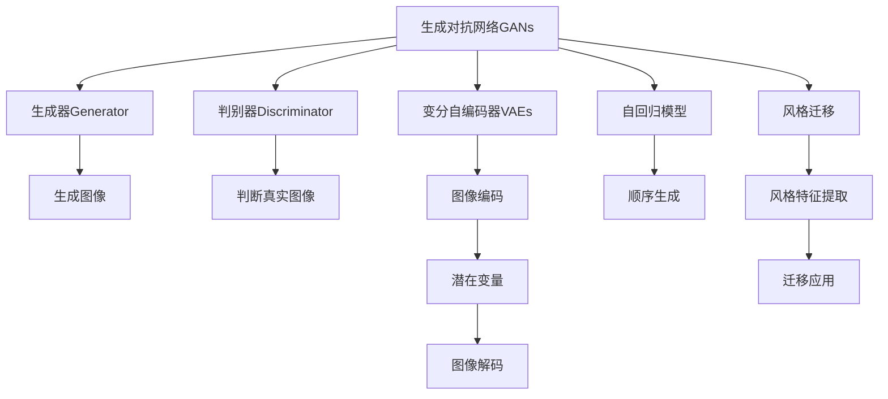
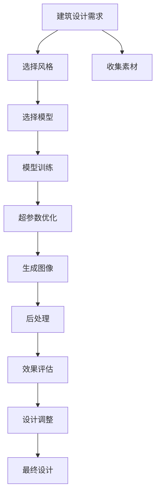

                 

# AIGC从入门到实战：掌握建筑设计要领，创建各种大师风格的效果图

## 1. 背景介绍

### 1.1 问题由来
在建筑设计和室内设计领域，传统的设计方式通常需要设计师具备高超的绘画技巧、丰富的设计经验以及庞大的素材库。然而，随着人工智能和生成对抗网络（Generative Adversarial Networks, GANs）等技术的进步，一种全新的设计工具应运而生——生成式人工智能（Generative AI，简称AIGC）。AIGC工具可以将设计师的设计理念快速转化为具体的设计方案，大幅提升设计效率，降低设计成本。

当前，AIGC技术在建筑设计、室内设计、景观设计等领域已展现出巨大潜力。建筑师和设计师可以利用AIGC快速生成符合设计风格、色彩搭配、空间布局等要求的设计方案，从而在短时间内完成多个设计任务。然而，要全面掌握AIGC技术并应用于实际设计项目，设计师和建筑师仍需要系统学习和实践。

### 1.2 问题核心关键点
AIGC技术主要包括生成式对抗网络（GANs）、变分自编码器（VAEs）、自回归模型等。这些技术能够通过生成符合特定风格或结构的设计图片，帮助设计师快速创作出各类建筑方案。然而，由于AIGC的复杂性和多样性，要充分利用其潜力，设计师需要掌握以下核心关键点：

1. **设计风格理解**：掌握不同的设计风格，如古典主义、现代主义、后现代主义等，理解每种风格的设计特点和元素。
2. **模型参数调整**：通过调整GANs的参数，如生成器（Generator）和判别器（Discriminator）的超参数，优化模型的生成效果。
3. **训练数据准备**：收集高质量的训练数据，如建筑风格图片、室内设计图片等，用于训练GANs模型。
4. **评价指标设定**：设定合适的评价指标，如Inception Score、Fréchet Inception Distance（FID）、KL-divergence等，评估模型的生成质量。
5. **后处理技术应用**：掌握常用的后处理技术，如增强滤波、图像边缘锐化、色调调整等，进一步提升生成图片的可接受度。
6. **用户交互设计**：设计友好的用户界面，支持设计师和建筑师进行参数调整和风格选择，便于实际使用。

### 1.3 问题研究意义
AIGC技术在建筑设计领域的成功应用，将大幅降低设计门槛，提高设计效率。通过AIGC技术，建筑师和设计师可以更专注于创意设计和方案优化，而无需耗费大量时间进行绘图和素材整理。这不仅能够加速设计过程，提高设计质量，还能够激发更多创新灵感，推动建筑艺术的创新发展。

同时，AIGC技术在多领域的应用也展示了其在跨学科融合中的巨大潜力。结合工程学、心理学、社会学等领域的知识，AIGC技术有望为设计创作带来更全面的视角和更深刻的理解，推动设计学科的全面进步。

## 2. 核心概念与联系

### 2.1 核心概念概述

为了更好地理解AIGC技术在建筑设计中的应用，本节将介绍几个密切相关的核心概念：

- **生成对抗网络（GANs）**：一种基于博弈论的生成模型，由生成器和判别器两个子网络组成。生成器负责生成逼真的图像，判别器负责区分生成图像和真实图像。GANs通过对抗训练，不断优化生成器的生成效果。
- **变分自编码器（VAEs）**：一种基于变分推断的生成模型，用于将噪声转换为图像。VAEs将图像编码为潜在变量，再从潜在变量解码生成图像，能够生成高分辨率、低噪声的图像。
- **自回归模型**：一种生成模型，通过顺序生成每个像素点或特征，构建图像。自回归模型不需要全局的训练，可以逐点生成高质量的图像。
- **风格迁移**：将一张图像的风格特征迁移到另一张图像上，生成风格相似的图像。风格迁移技术在图像处理和图像设计中应用广泛。
- **超参数优化**：通过调整GANs和VAEs的超参数，优化模型的生成效果和训练速度。常用的超参数包括学习率、批量大小、迭代次数等。

这些核心概念之间存在密切联系，形成了AIGC技术的基本框架。通过理解这些概念，我们可以更好地把握AIGC技术在建筑设计中的应用原理和优化方法。

### 2.2 概念间的关系

这些核心概念之间存在着紧密的联系，形成了AIGC技术的基本框架。下面我们通过几个Mermaid流程图来展示这些概念之间的关系：



这个流程图展示了AIGC技术的核心概念及其之间的关系：

1. GANs由生成器和判别器组成，生成逼真的图像。
2. VAEs将图像编码为潜在变量，再从潜在变量解码生成图像。
3. 自回归模型通过顺序生成每个像素点或特征，生成高质量的图像。
4. 风格迁移技术通过提取风格特征，将一张图像的风格特征迁移到另一张图像上。
5. 超参数优化通过调整模型的超参数，优化生成效果和训练速度。

这些概念共同构成了AIGC技术的整体架构，使得设计师能够通过这些技术快速生成符合特定风格或要求的设计图片。

### 2.3 核心概念的整体架构

最后，我们用一个综合的流程图来展示这些核心概念在建筑设计中的应用过程：



这个综合流程图展示了从设计需求到最终设计完成的完整过程。首先，从设计需求中确定风格和要求，选择适合的生成模型进行训练。通过超参数优化，生成符合要求的图像。接着，进行图像后处理，提高生成图片的可接受度。最后，评估生成效果并进行设计调整，得到最终的设计方案。通过这些步骤，AIGC技术能够显著提高建筑设计的设计效率和设计质量。

## 3. 核心算法原理 & 具体操作步骤
### 3.1 算法原理概述

AIGC技术在建筑设计中的应用，主要基于生成对抗网络（GANs）、变分自编码器（VAEs）和自回归模型等生成模型。这些模型通过学习大量的设计图片，能够生成符合特定风格或结构的设计方案。

具体来说，AIGC技术通过以下步骤生成建筑设计图片：

1. **数据收集与预处理**：收集高质量的建筑设计图片，并进行预处理，如数据增强、噪声去除等，提高数据的质量和多样性。
2. **模型训练**：使用收集到的建筑设计图片，训练GANs或VAEs等生成模型，优化模型的生成效果。
3. **生成与后处理**：通过训练好的模型生成符合设计要求的图片，并进行后处理，如边缘锐化、色调调整等，提升图片的质量。
4. **效果评估**：使用Inception Score、FID、KL-divergence等评价指标，评估生成图片的生成质量和多样性。
5. **设计调整**：根据评估结果，调整模型的超参数或生成器的输入参数，进一步优化生成效果。
6. **最终设计**：选择最优的设计图片，进行设计调整，得到最终的建筑设计方案。

### 3.2 算法步骤详解

下面，我们将详细介绍AIGC技术在建筑设计中的具体步骤和操作：

**Step 1: 数据收集与预处理**

1. **数据收集**：从互联网、设计公司等渠道收集高质量的建筑设计图片，确保数据的多样性和高质量。
2. **数据增强**：使用数据增强技术，如随机裁剪、旋转、翻转等，增加数据的多样性，提高模型的泛化能力。
3. **噪声去除**：对图片进行噪声去除，如去噪、去抖动等，提高数据的纯净度。
4. **预处理**：对图片进行标准化处理，如归一化、中心化等，确保数据的一致性和可比性。

**Step 2: 模型训练**

1. **选择模型**：根据设计需求，选择适合的生成模型，如GANs、VAEs或自回归模型。
2. **训练超参数**：根据模型的超参数，进行训练，优化模型的生成效果。
3. **模型评估**：使用Inception Score、FID、KL-divergence等评价指标，评估模型的生成质量。
4. **超参数调整**：根据评估结果，调整模型的超参数，优化生成效果。

**Step 3: 生成与后处理**

1. **生成图像**：通过训练好的模型生成符合设计要求的图片。
2. **后处理**：对生成的图片进行后处理，如边缘锐化、色调调整、对比度增强等，提高图片的质量。
3. **效果评估**：使用评价指标，评估生成图片的生成质量和多样性。
4. **设计调整**：根据评估结果，调整模型的超参数或生成器的输入参数，进一步优化生成效果。

**Step 4: 最终设计**

1. **选择设计图片**：根据评估结果，选择最优的设计图片。
2. **设计调整**：根据设计需求，对图片进行设计调整，如调整建筑风格、空间布局等。
3. **最终设计**：得到最终的建筑设计方案。

### 3.3 算法优缺点

AIGC技术在建筑设计中的应用具有以下优点：

1. **高效生成**：通过训练好的模型快速生成符合设计要求的图片，大幅提高设计效率。
2. **多样性**：生成的图片风格多样，能够满足不同设计需求。
3. **灵活调整**：设计人员可以根据设计需求，调整模型的超参数和生成器的输入参数，优化生成效果。
4. **创新性**：生成高质量的设计图片，激发更多设计灵感。

然而，AIGC技术在建筑设计中的应用也存在以下缺点：

1. **质量不稳定**：生成图片的生成质量不稳定，需要经过多次训练和调整才能达到理想效果。
2. **依赖训练数据**：模型生成的图片质量依赖于训练数据的质量和多样性，训练数据不足可能导致生成效果差。
3. **计算资源消耗大**：训练和生成高质量图片需要大量的计算资源，对硬件要求高。
4. **设计人员依赖性**：设计人员需要具备一定的技术知识，才能有效利用AIGC技术。

### 3.4 算法应用领域

AIGC技术在建筑设计领域的应用广泛，包括：

1. **建筑设计**：通过生成逼真的建筑设计图片，快速生成多种设计方案，辅助设计师进行方案比选。
2. **室内设计**：生成符合设计风格的室内设计图片，辅助设计师进行空间布局和装饰设计。
3. **景观设计**：生成逼真的景观设计图片，辅助设计师进行景观规划和设计。
4. **城市规划**：生成城市规划方案，辅助设计师进行城市规划和设计。
5. **建筑展示**：生成高质量的建筑展示图片，用于建筑设计展示和宣传。

## 4. 数学模型和公式 & 详细讲解  
### 4.1 数学模型构建

AIGC技术在建筑设计中的应用，主要基于生成对抗网络（GANs）和变分自编码器（VAEs）等生成模型。以下是这些模型的数学模型构建过程：

**生成对抗网络（GANs）**

GANs由生成器（Generator）和判别器（Discriminator）两个子网络组成。生成器将噪声作为输入，生成逼真的图像，判别器则区分生成图像和真实图像。GANs通过对抗训练，不断优化生成器的生成效果。

生成器的数学模型为：

$$
G(z) = g_{\theta_G}(z)
$$

其中，$z$ 为输入的噪声向量，$\theta_G$ 为生成器的参数。

判别器的数学模型为：

$$
D(x) = d_{\theta_D}(x)
$$

其中，$x$ 为输入的图像，$\theta_D$ 为判别器的参数。

GANs的对抗训练过程可以表示为：

$$
\min_G \max_D V(D,G) = \mathbb{E}_{x \sim p_{\text{data}}} [\log D(x)] + \mathbb{E}_{z \sim p_{z}} [\log (1 - D(G(z)))]
$$

其中，$V(D,G)$ 为GANs的损失函数，$p_{\text{data}}$ 为真实图像的分布，$p_{z}$ 为噪声的分布。

**变分自编码器（VAEs）**

VAEs将图像编码为潜在变量，再从潜在变量解码生成图像。VAEs通过最大化编码器-解码器的概率，优化生成效果。

编码器的数学模型为：

$$
q_{\theta_Q}(z|x) = \mathcal{N}(\mu(x), \sigma^2(x))
$$

其中，$x$ 为输入的图像，$\theta_Q$ 为编码器的参数，$\mu(x)$ 和 $\sigma^2(x)$ 分别为编码器输出的均值和方差。

解码器的数学模型为：

$$
p_{\theta_P}(x|z) = \mathcal{N}(g_{\theta_P}(z), \sigma^2)
$$

其中，$z$ 为潜在变量，$\theta_P$ 为解码器的参数，$g_{\theta_P}(z)$ 为解码器输出的均值。

VAEs的优化过程可以表示为：

$$
\min_{\theta_Q, \theta_P} \mathbb{E}_{x \sim p_{\text{data}}}[\log p_{\theta_P}(x|q_{\theta_Q}(z))]
$$

其中，$\mathbb{E}_{x \sim p_{\text{data}}}$ 表示对真实图像 $x$ 的期望，$p_{\theta_P}(x|z)$ 为解码器输出的概率密度函数。

### 4.2 公式推导过程

以下我们将对生成对抗网络（GANs）和变分自编码器（VAEs）的数学模型进行详细推导：

**生成对抗网络（GANs）**

GANs的生成器和判别器都可以通过多层神经网络实现。以下以一个简单的两层神经网络为例，推导生成器和判别器的具体实现：

生成器的输入为噪声向量 $z$，输出为图像 $x$，其数学模型可以表示为：

$$
x = g_{\theta_G}(z)
$$

其中，$g_{\theta_G}$ 为生成器的参数。

判别器的输入为图像 $x$，输出为判别器的预测结果 $d_{\theta_D}(x)$，其数学模型可以表示为：

$$
d_{\theta_D}(x) = \text{sigmoid}(W_d x + b_d)
$$

其中，$W_d$ 和 $b_d$ 分别为判别器的权重和偏置，$\text{sigmoid}$ 为激活函数。

GANs的对抗训练过程可以表示为：

$$
\min_G \max_D V(D,G) = \mathbb{E}_{x \sim p_{\text{data}}} [\log D(x)] + \mathbb{E}_{z \sim p_{z}} [\log (1 - D(G(z)))]
$$

其中，$p_{\text{data}}$ 为真实图像的分布，$p_{z}$ 为噪声的分布。

**变分自编码器（VAEs）**

VAEs的编码器和解码器都可以通过多层神经网络实现。以下以一个简单的两层神经网络为例，推导编码器和解码器的具体实现：

编码器的输入为图像 $x$，输出为潜在变量 $z$，其数学模型可以表示为：

$$
z = q_{\theta_Q}(x)
$$

其中，$q_{\theta_Q}$ 为编码器的参数。

解码器的输入为潜在变量 $z$，输出为图像 $x$，其数学模型可以表示为：

$$
x = g_{\theta_P}(z)
$$

其中，$g_{\theta_P}$ 为解码器的参数。

VAEs的优化过程可以表示为：

$$
\min_{\theta_Q, \theta_P} \mathbb{E}_{x \sim p_{\text{data}}}[\log p_{\theta_P}(x|z)]
$$

其中，$p_{\theta_P}(x|z)$ 为解码器输出的概率密度函数。

### 4.3 案例分析与讲解

为了更好地理解AIGC技术在建筑设计中的应用，我们将以一个实际案例进行分析：

假设设计师想要生成一个现代主义风格的建筑方案，可以选择使用GANs模型进行训练。首先，收集大量现代主义风格的建筑设计图片，并进行预处理。然后，使用GANs模型进行训练，优化生成效果。最后，通过调整生成器的输入参数，生成符合设计要求的图片。

**Step 1: 数据收集与预处理**

1. **数据收集**：收集现代主义风格的建筑设计图片，可以从设计公司网站、建筑杂志等渠道获取。
2. **数据增强**：使用随机裁剪、旋转、翻转等数据增强技术，增加数据的多样性。
3. **噪声去除**：对图片进行去噪、去抖动等处理，提高数据的纯净度。
4. **预处理**：对图片进行标准化处理，如归一化、中心化等，确保数据的一致性和可比性。

**Step 2: 模型训练**

1. **选择模型**：选择GANs模型进行训练。
2. **训练超参数**：根据模型的超参数，进行训练，优化生成效果。
3. **模型评估**：使用Inception Score、FID、KL-divergence等评价指标，评估生成图片的生成质量。
4. **超参数调整**：根据评估结果，调整生成器的输入参数，优化生成效果。

**Step 3: 生成与后处理**

1. **生成图像**：通过训练好的GANs模型生成符合设计要求的图片。
2. **后处理**：对生成的图片进行后处理，如边缘锐化、色调调整、对比度增强等，提高图片的质量。
3. **效果评估**：使用评价指标，评估生成图片的生成质量和多样性。
4. **设计调整**：根据评估结果，调整生成器的输入参数，进一步优化生成效果。

**Step 4: 最终设计**

1. **选择设计图片**：根据评估结果，选择最优的设计图片。
2. **设计调整**：根据设计需求，对图片进行设计调整，如调整建筑风格、空间布局等。
3. **最终设计**：得到最终的建筑设计方案。

通过这个案例，可以看到，AIGC技术在建筑设计中的应用需要系统化的步骤和操作，设计师需要掌握各种核心概念和算法原理，才能充分利用AIGC技术的潜力。

## 5. 项目实践：代码实例和详细解释说明
### 5.1 开发环境搭建

在进行AIGC项目实践前，我们需要准备好开发环境。以下是使用Python进行TensorFlow开发的环境配置流程：

1. 安装Anaconda：从官网下载并安装Anaconda，用于创建独立的Python环境。

2. 创建并激活虚拟环境：
```bash
conda create -n aigc-env python=3.8 
conda activate aigc-env
```

3. 安装TensorFlow：根据CUDA版本，从官网获取对应的安装命令。例如：
```bash
conda install tensorflow-gpu=2.7.0 -c conda-forge -c pytorch -c pypi
```

4. 安装TensorBoard：用于可视化模型训练过程中的各项指标。
```bash
pip install tensorboard
```

5. 安装numpy、PIL等各类工具包：
```bash
pip install numpy matplotlib imageio pillow
```

完成上述步骤后，即可在`aigc-env`环境中开始AIGC项目实践。

### 5.2 源代码详细实现

下面我们以GANs模型生成现代主义风格建筑设计为例，给出TensorFlow代码实现。

首先，定义GANs模型的结构：

```python
import tensorflow as tf
from tensorflow.keras.layers import Dense, Reshape, Flatten
from tensorflow.keras.layers import Input
from tensorflow.keras.layers import BatchNormalization
from tensorflow.keras.layers import LeakyReLU
from tensorflow.keras.layers import Conv2DTranspose
from tensorflow.keras.layers import Conv2D
from tensorflow.keras.layers import Dropout

def build_generator(z_dim, img_shape):
    model = tf.keras.Sequential()
    model.add(Dense(256, input_dim=z_dim))
    model.add(LeakyReLU(alpha=0.2))
    model.add(BatchNormalization(momentum=0.8))
    model.add(Dense(512))
    model.add(LeakyReLU(alpha=0.2))
    model.add(BatchNormalization(momentum=0.8))
    model.add(Dense(1024))
    model.add(LeakyReLU(alpha=0.2))
    model.add(BatchNormalization(momentum=0.8))
    model.add(Dense(np.prod(img_shape)))
    model.add(Reshape(img_shape))
    model.add(Conv2DTranspose(64, (5, 5), strides=(1, 1), padding='same'))
    model.add(LeakyReLU(alpha=0.2))
    model.add(BatchNormalization(momentum=0.8))
    model.add(Dropout(0.3))
    model.add(Conv2D(64, (5, 5), padding='same'))
    model.add(LeakyReLU(alpha=0.2))
    model.add(BatchNormalization(momentum=0.8))
    model.add(Dropout(0.3))
    model.add(Conv2D(1, (7, 7), padding='same', activation='tanh'))
    return model

def build_discriminator(img_shape):
    model = tf.keras.Sequential()
    model.add(Conv2D(64, (7, 7), strides=(3, 3), padding='same', input_shape=img_shape))
    model.add(LeakyReLU(alpha=0.2))
    model.add(Dropout(0.3))
    model.add(Conv2D(128, (3, 3), strides=(2, 2), padding='same'))
    model.add(LeakyReLU(alpha=0.2))
    model.add(Dropout(0.3))
    model.add(Conv2D(256, (3, 3), strides=(2, 2), padding='same'))
    model.add(LeakyReLU(alpha=0.2))
    model.add(Dropout(0.3))
    model.add(Conv2D(512, (3, 3), strides=(2, 2), padding='same'))
    model.add(LeakyReLU(alpha=0.2))
    model.add(Dropout(0.3))
    model.add(Flatten())
    model.add(Dense(1))
    model.add(LeakyReLU(alpha=0.2))
    return model
```

接着，定义训练过程的各个函数：

```python
def generate_z(z_dim, batch_size):
    return tf.random.normal(shape=(batch_size, z_dim), mean=0, stddev=1)

def sample_z(z_dim, batch_size):
    return generate_z(z_dim, batch_size)

def train_step(discriminator, generator, dataset):
    z = generate_z(generator.input_dim, batch_size)
    with tf.GradientTape() as gen_tape:
        g_sample = generator(z, training=True)
        g_loss = discriminator.train_on_batch(g_sample, y_real)
    with tf.GradientTape() as disc_tape:
        d_loss = discriminator.train_on_batch(x_real, y_real)
    gen_loss = gen_tape.gradient(g_loss, generator.trainable_weights)
    disc_loss = disc_tape.gradient(d_loss, discriminator.trainable_weights)
    generator.optimizer.apply_gradients(zip(gen_loss, generator.trainable_weights))
    discriminator.optimizer.apply_gradients(zip(disc_loss, discriminator.trainable_weights))
    return g_loss, d_loss

def train_epoch(discriminator, generator, dataset, epochs):
    for epoch in range(epochs):
        for batch in dataset:
            z = generate_z(generator.input_dim, batch_size)
            g_sample = generator(z, training=True)
            d_loss = discriminator.train_on_batch(g_sample, y_real)
            g_loss = discriminator.train_on_batch(x_real, y_real)
        generator.optimizer.lr = generator.optimizer.lr * 0.99
        discriminator.optimizer.lr = discriminator.optimizer.lr * 0.99
        print('Epoch: {}, Discriminator Loss: {}, Generator Loss: {}'.format(epoch+1, d_loss, g_loss))

def save_model(model, save_path):
    model.save_weights(save_path)
    model.save(save_path + '.h5')

def load_model(model, save_path):
    model.load_weights(save_path)
    model.load_weights(save_path + '.h5')
```

最后，启动训练流程：

```python
epochs = 50
batch_size = 64
z_dim = 100
img_shape = (64, 64, 3)

x_real = np.random.normal(0, 1, (batch_size, 64, 64, 3))
y_real = np.ones((batch_size, 1))
generator = build_generator(z_dim, img_shape)
discriminator = build_discriminator(img_shape)
model = tf.keras.Model(inputs=generator.input, outputs=discriminator(generator(generator.input)))
model.compile(optimizer

