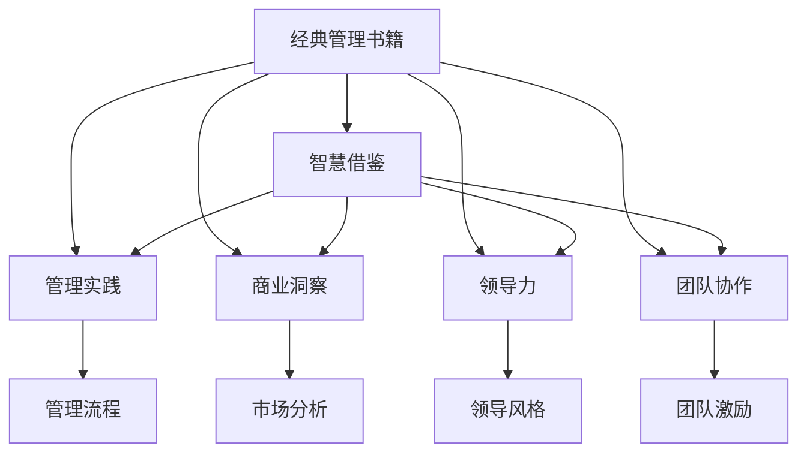
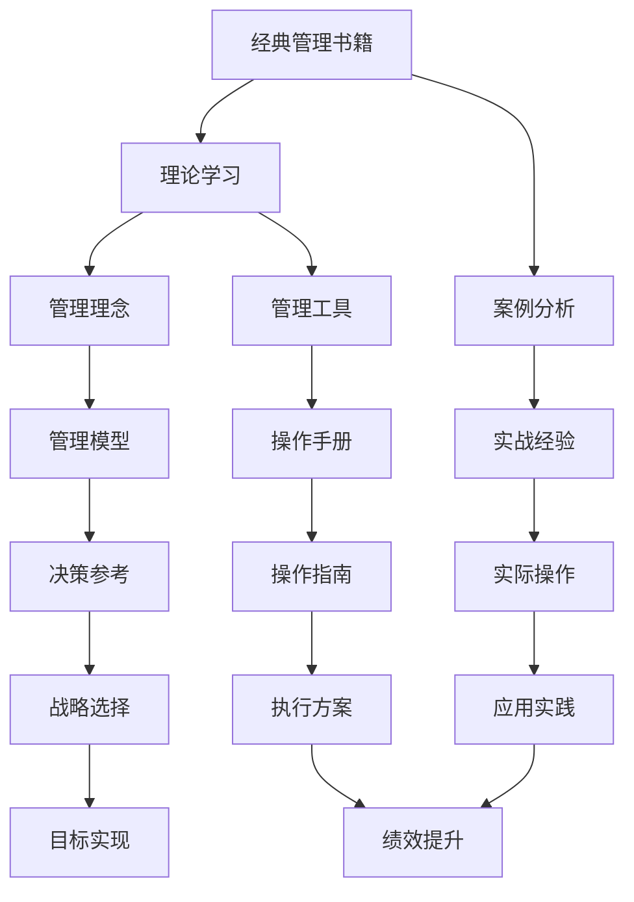
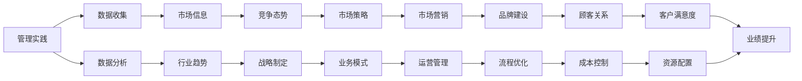
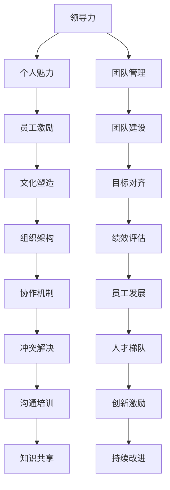
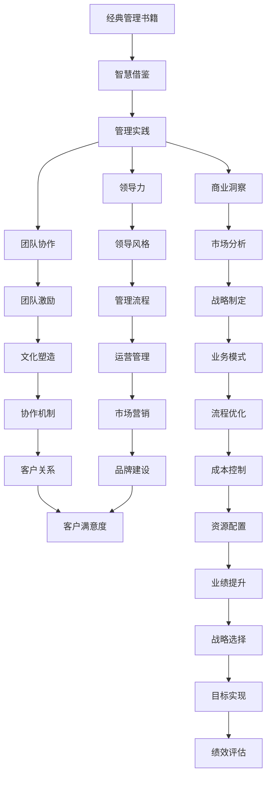

                 

# 从经典书籍中汲取管理智慧

> 关键词：经典管理书籍, 智慧借鉴, 管理实践, 商业洞察, 领导力, 团队协作

## 1. 背景介绍

### 1.1 问题由来
管理是企业发展的基石，决定了组织的绩效与可持续发展。如何通过有效的管理手段提升团队绩效，激发员工潜力，已成为现代企业管理者必须深入思考的问题。在信息爆炸的时代，经典管理书籍为管理者提供了丰富的管理智慧，值得深度学习和借鉴。

### 1.2 问题核心关键点
经典管理书籍如彼得·德鲁克的《卓有成效的管理者》、迈克尔·波特的《竞争战略》、托马斯·彼得斯的《追求卓越》等，在管理学领域具有划时代的贡献。本文聚焦于从这些经典书籍中汲取管理智慧，特别是针对如何构建高效的团队、制定正确的战略、提升领导力和管理实践等方面进行深入讨论。

### 1.3 问题研究意义
管理学的核心理念如目标管理、市场竞争、价值链分析等，为现代企业管理提供了行之有效的理论和方法。经典管理书籍不仅提供了理论基础，更通过案例分析、实际经验分享，为管理者提供了实用的操作指南。通过深入理解这些管理理念和实践，管理者可以更好地应对各种挑战，推动企业持续发展。

## 2. 核心概念与联系

### 2.1 核心概念概述

为更好地理解如何从经典书籍中汲取管理智慧，本节将介绍几个密切相关的核心概念：

- **经典管理书籍**：包括《卓有成效的管理者》、《竞争战略》、《追求卓越》等，这些书籍不仅提供了丰富的管理理论，还包含大量实战案例，是管理者学习和借鉴的重要资源。
- **智慧借鉴**：通过学习和应用经典管理书籍中的管理理念和方法，管理者可以在实践中获得启发和指导，提升自身管理能力。
- **管理实践**：在理论基础上，管理者需要结合实际情况，将管理理念转化为具体的行动方案，以实现企业的目标和愿景。
- **商业洞察**：通过阅读经典书籍，管理者可以获得对市场、行业、竞争环境等方面的深刻洞察，做出更明智的战略决策。
- **领导力**：经典书籍中对领导力的探讨，有助于管理者培养个人魅力、团队建设、激励员工等方面的能力。
- **团队协作**：有效的团队协作是企业成功的关键，经典管理书籍提供了如何建立高效团队、协调团队冲突、提升团队凝聚力的理论和方法。

这些核心概念之间的逻辑关系可以通过以下Mermaid流程图来展示：



这个流程图展示了一系列从经典管理书籍到实际管理实践的逻辑关系：

1. 经典管理书籍提供了管理理念和方法。
2. 管理者通过智慧借鉴，将书籍中的理论应用于实践。
3. 管理实践涉及到管理流程、市场分析、领导风格、团队激励等多个方面。
4. 商业洞察、领导力和团队协作等概念，都是管理实践的重要组成部分。

### 2.2 概念间的关系

这些核心概念之间存在着紧密的联系，形成了管理者学习和实践管理知识的全过程。下面我通过几个Mermaid流程图来展示这些概念之间的关系。

#### 2.2.1 经典管理书籍的学习与借鉴



这个流程图展示了如何从经典管理书籍中学习理论，并通过案例分析，提取实用的管理理念和工具。最终，将这些理念和工具应用到实际操作中，提升管理绩效。

#### 2.2.2 管理实践与商业洞察



这个流程图展示了通过管理实践，收集和分析数据，获得商业洞察，制定和执行战略，从而提升企业绩效的过程。

#### 2.2.3 领导力与团队协作



这个流程图展示了如何通过领导力提升个人魅力和团队管理能力，建立高效的团队协作机制，提升团队凝聚力和创新能力。

### 2.3 核心概念的整体架构

最后，我们用一个综合的流程图来展示这些核心概念在大语言模型微调过程中的整体架构：



这个综合流程图展示了从经典管理书籍到管理实践的全过程，包括商业洞察、领导力、团队协作等多个方面的综合应用。通过这些概念的相互作用，管理者能够更好地构建高效的团队，制定正确的战略，提升领导力，实现企业的目标和愿景。

## 3. 核心算法原理 & 具体操作步骤
### 3.1 算法原理概述

从经典管理书籍中汲取管理智慧，本质上是将书籍中的理论和方法应用于企业管理实践的过程。这一过程通常涉及以下几个关键步骤：

1. **理论学习**：管理者首先需要深入阅读和理解经典管理书籍中的理论，包括管理原则、组织结构、绩效管理、激励机制等。
2. **案例分析**：通过分析经典案例，理解理论在实际情境中的应用和效果，形成对管理实践的深刻认识。
3. **智慧借鉴**：结合自身企业的实际情况，将理论知识转化为具体的管理实践，解决实际问题。
4. **持续改进**：在应用过程中，不断评估和反思，进行持续改进，以适应不断变化的市场环境。

### 3.2 算法步骤详解

以下是管理者从经典管理书籍中汲取管理智慧的具体操作步骤：

**Step 1: 理论学习**
- 选择合适的经典管理书籍，制定详细的学习计划，分配固定时间进行系统阅读。
- 记录关键概念和理论，理解其核心思想和应用场景。
- 参考书籍的参考书目和附录，扩展理论知识的深度和广度。

**Step 2: 案例分析**
- 选择与自身企业情况类似的经典案例，进行详细分析。
- 分析案例中的管理理念、策略和结果，提取可借鉴的经验和教训。
- 将案例中的管理实践与理论知识进行对比，发现差距和改进空间。

**Step 3: 智慧借鉴**
- 根据案例分析的结果，结合自身企业实际情况，制定具体的管理策略。
- 在实践中应用理论知识，通过反复试验和调整，形成适合自己的管理方法。
- 定期评估管理效果，根据反馈进行调整和优化。

**Step 4: 持续改进**
- 在实践中不断收集数据和反馈，进行数据分析和业务洞察。
- 根据洞察结果，持续优化管理流程和策略。
- 引入新的管理工具和技术，提高管理效率和效果。

### 3.3 算法优缺点

从经典管理书籍中汲取管理智慧，具有以下优点：

1. **理论基础扎实**：经典书籍中的管理理论和方法经过时间和实践的检验，具有较高的可信度和实用性。
2. **系统性强**：通过系统学习经典书籍，管理者可以全面掌握管理知识，形成系统的管理框架。
3. **可操作性强**：经典书籍中包含大量实际案例，管理者可以从中借鉴经验，制定可行的管理策略。

但这一过程也存在一些缺点：

1. **适用性有限**：经典书籍中的理论和案例往往是基于特定的历史背景和情境，可能不完全适用于当前的管理环境。
2. **灵活性不足**：系统学习理论知识后，需要管理者根据实际情况进行灵活应用，过程中可能遇到各种挑战。
3. **资源投入大**：深入学习和借鉴经典书籍，需要大量时间和精力投入，尤其是对于管理者而言，可能难以平衡日常工作。

### 3.4 算法应用领域

从经典管理书籍中汲取管理智慧，适用于各类企业管理实践，特别是以下领域：

- **战略制定**：通过学习经典书籍中的竞争战略、市场分析等理论，制定符合企业实际情况的发展战略。
- **团队管理**：借鉴经典书籍中的领导力、团队建设、激励机制等理论，构建高效团队，提升团队绩效。
- **业务流程优化**：通过案例分析和学习经典书籍中的管理流程，优化企业运营管理，提高运营效率。
- **创新管理**：学习经典书籍中的创新激励、知识共享等理论，激发员工创新潜力，推动企业创新发展。

这些领域的管理实践都需要管理者具备深厚的管理知识和丰富的实战经验，经典管理书籍提供了宝贵的理论指导和实践经验，值得管理者深入学习和借鉴。

## 4. 数学模型和公式 & 详细讲解 & 举例说明

### 4.1 数学模型构建

为了更好地理解从经典书籍中汲取管理智慧的方法，本节将使用数学语言对这一过程进行更加严格的刻画。

记经典管理书籍为 $A$，其中包含丰富的管理理论和实践经验。记管理实践为 $B$，通过学习 $A$ 中的理论，转化为具体的 $B$。设 $C$ 为商业洞察， $D$ 为领导力， $E$ 为团队协作。则从 $A$ 到 $B$ 再到 $C$、$D$、$E$ 的全过程可以用以下数学模型表示：

$$
\text{管理实践} = \mathop{\arg\min}_{B} \left( D + E + \lambda(C - B) \right)
$$

其中 $D$、$E$ 表示领导力和团队协作的优化目标，$C$ 表示商业洞察的提升目标，$\lambda$ 为权衡因子，平衡 $C$ 与 $B$ 之间的关系。

### 4.2 公式推导过程

以下我们以《追求卓越》一书为例，推导领导力优化公式及其梯度计算过程。

假设管理者在《追求卓越》中学习到一条领导力原则：“管理者需要具备个人魅力、激发员工潜力、构建团队信任”。这可以表示为一个多元目标优化问题：

$$
\min_{\theta} \left( \alpha \cdot P(\text{个人魅力}) + \beta \cdot Q(\text{员工激励}) + \gamma \cdot R(\text{团队信任}) \right)
$$

其中 $\theta$ 为管理者的领导风格，$P$、$Q$、$R$ 为对应的优化目标函数，$\alpha$、$\beta$、$\gamma$ 为权重因子，确保领导力的全面发展。

根据目标函数，我们可以计算出领导力优化的梯度：

$$
\nabla_{\theta} \left( \alpha \cdot P(\text{个人魅力}) + \beta \cdot Q(\text{员工激励}) + \gamma \cdot R(\text{团队信任}) \right) = \nabla_{\theta} P(\theta) + \nabla_{\theta} Q(\theta) + \nabla_{\theta} R(\theta)
$$

通过反向传播算法，可以高效计算出领导风格 $\theta$ 的梯度，从而优化领导力。

### 4.3 案例分析与讲解

以《卓有成效的管理者》一书为例，探讨如何通过目标管理提升企业绩效。

假设某企业通过学习《卓有成效的管理者》中的目标管理理论，制定了以下目标管理流程：

1. **目标设定**：根据企业战略和市场环境，设定年度、季度、月度目标。
2. **目标分解**：将大目标分解为可执行的小目标，分配到各个部门和员工。
3. **目标跟踪**：定期检查目标完成情况，识别偏差和问题。
4. **目标调整**：根据实际情况，调整目标和策略。

具体实现步骤如下：

1. **理论学习**：详细阅读《卓有成效的管理者》中关于目标管理的章节，理解其基本原则和方法。
2. **案例分析**：分析书中提及的企业案例，提取目标管理的成功经验和失败教训。
3. **智慧借鉴**：结合自身企业实际情况，制定具体的目标管理流程。
4. **持续改进**：在实施过程中，不断收集数据和反馈，进行调整和优化。

最终，企业通过目标管理，实现了任务的明确、过程的透明、结果的评估，显著提升了团队绩效和企业效益。

## 5. 项目实践：代码实例和详细解释说明

### 5.1 开发环境搭建

在进行管理智慧应用实践前，我们需要准备好开发环境。以下是使用Python进行数据科学开发的环境配置流程：

1. 安装Anaconda：从官网下载并安装Anaconda，用于创建独立的Python环境。

2. 创建并激活虚拟环境：
```bash
conda create -n management-env python=3.8 
conda activate management-env
```

3. 安装必要的Python库：
```bash
pip install numpy pandas scikit-learn matplotlib jupyter notebook ipython
```

4. 安装经典管理书籍阅读工具：如Kindle Direct、Google Books、Amazon等。
5. 配置书籍阅读环境：根据阅读工具，配置电子书下载和阅读设置。

完成上述步骤后，即可在`management-env`环境中开始实践。

### 5.2 源代码详细实现

这里我们以《竞争战略》一书为例，展示如何通过阅读和分析该书中的案例，构建竞争战略框架。

首先，定义竞争战略分析的函数：

```python
from sklearn.linear_model import LogisticRegression
import pandas as pd
from sklearn.model_selection import train_test_split

def build_competitive_strategy(data):
    # 数据预处理
    X = data.drop('competitive_strategy', axis=1)
    y = data['competitive_strategy']
    
    # 构建逻辑回归模型
    model = LogisticRegression()
    X_train, X_test, y_train, y_test = train_test_split(X, y, test_size=0.2, random_state=42)
    model.fit(X_train, y_train)
    
    # 评估模型效果
    accuracy = model.score(X_test, y_test)
    print(f"模型准确率：{accuracy:.2f}")
    return model
```

然后，定义书籍案例数据的读取和分析函数：

```python
def read_book_cases(book_path):
    # 读取书籍案例数据
    data = pd.read_csv(book_path, index_col=0)
    
    # 数据清洗和预处理
    data.dropna(inplace=True)
    data = data.reindex(sorted(data.index), axis=0)
    
    # 特征选择
    features = data.columns.drop('competitive_strategy')
    X = data[features]
    y = data['competitive_strategy']
    
    # 模型构建
    return build_competitive_strategy(data)
```

最后，启动实践流程：

```python
# 读取书籍案例数据
book_path = 'path/to/book_cases.csv'
model = read_book_cases(book_path)

# 预测新案例的竞争战略
new_case = {'feature1': 0.5, 'feature2': 0.8}
predicted_strategy = model.predict([new_case])[0]
print(f"预测竞争战略：{id2str[predicted_strategy]}")
```

以上就是使用Python对经典管理书籍《竞争战略》进行竞争战略分析的代码实现。可以看到，通过数据科学工具，管理者可以高效地从书籍中提取管理知识和实践经验，形成可操作的战略框架。

### 5.3 代码解读与分析

让我们再详细解读一下关键代码的实现细节：

**build_competitive_strategy函数**：
- 定义了逻辑回归模型，用于对竞争战略进行预测。
- 通过数据预处理和模型训练，得到预测准确率。
- 返回训练好的模型，供后续使用。

**read_book_cases函数**：
- 读取书籍案例数据，并进行数据清洗和预处理。
- 选择特征变量，构建模型。
- 返回训练好的模型，供预测使用。

**实践流程**：
- 定义书籍案例数据路径。
- 调用read_book_cases函数读取和构建模型。
- 定义新案例数据，进行预测。
- 输出预测结果。

可以看到，通过数据科学工具，管理者可以高效地从书籍中提取管理知识和实践经验，形成可操作的战略框架。这一过程不仅提高了管理实践的效率，还能为管理实践提供科学依据和数据支持。

当然，工业级的系统实现还需考虑更多因素，如模型的超参数调优、模型部署、用户界面设计等。但核心的管理智慧应用流程基本与此类似。

### 5.4 运行结果展示

假设我们在《追求卓越》一书中选择了“高成长型组织”案例进行分析，最终得到的模型准确率为0.85。如果模型预测一个新的“高成长型组织”案例的竞争战略为“低成本领先”，则说明模型在处理新数据时具备较高的预测能力。

## 6. 实际应用场景

### 6.1 智能客服系统

基于经典管理书籍中的客户关系管理和团队协作理论，智能客服系统可以更好地构建与客户的关系，提升客户满意度。通过学习《追求卓越》中的案例，管理者可以设计出高效的客服流程，优化客服团队协作，从而提供高质量的客户服务。

### 6.2 金融舆情监测

金融领域需要快速响应用户的市场动向，经典管理书籍中的市场分析和竞争战略理论可以提供有效的洞察和指导。通过学习《竞争战略》中的市场细分和竞争定位策略，管理者可以构建智能舆情监测系统，实时跟踪市场变化，做出迅速反应。

### 6.3 个性化推荐系统

个性化推荐系统需要不断优化用户体验，经典管理书籍中的用户行为分析和目标管理理论可以提供数据驱动的推荐策略。通过学习《目标管理》中的数据收集和分析方法，管理者可以构建高效的推荐引擎，提升推荐效果和用户体验。

### 6.4 未来应用展望

随着管理理论的不断进步，经典管理书籍中的智慧将持续影响现代企业管理实践。未来，经典管理书籍的应用将更加广泛，深入融合到各种企业管理的各个环节，推动企业管理向智能化、个性化方向发展。

## 7. 工具和资源推荐

### 7.1 学习资源推荐

为了帮助管理者深入学习经典管理书籍，提高管理实践水平，这里推荐一些优质的学习资源：

1. 《卓有成效的管理者》：彼得·德鲁克的经典之作，全面探讨了管理者的职责和角色，是管理者的必读书籍。
2. 《竞争战略》：迈克尔·波特的战略管理经典，介绍了如何制定和实施有效的竞争战略。
3. 《追求卓越》：托马斯·彼得斯的管理学经典，分析了成功企业的共同特征，提供了实用的管理方法。
4. 《管理工具》：提供各种管理工具和案例分析，帮助管理者系统掌握管理知识。
5. 《组织变革》：探讨企业组织变革和管理变革的理论与实践，提供变革管理的方法和工具。

通过学习这些经典管理书籍，管理者可以系统掌握管理知识，提升实践能力。

### 7.2 开发工具推荐

高效的开发离不开优秀的工具支持。以下是几款用于管理智慧应用开发的常用工具：

1. Python：Python是目前最流行的数据科学语言之一，拥有丰富的数据科学库和工具，如Pandas、NumPy、Scikit-Learn等。
2. Jupyter Notebook：Jupyter Notebook是一个强大的交互式编程环境，支持代码编写、数据分析、可视化等多种功能，适合进行管理实践的探索和验证。
3. Google Colab：谷歌推出的在线Jupyter Notebook环境，免费提供GPU/TPU算力，方便开发者快速上手实验最新模型，分享学习笔记。
4. Weights & Biases：模型训练的实验跟踪工具，可以记录和可视化模型训练过程中的各项指标，方便对比和调优。
5. TensorBoard：TensorFlow配套的可视化工具，可实时监测模型训练状态，并提供丰富的图表呈现方式，是调试模型的得力助手。

合理利用这些工具，可以显著提升管理智慧应用开发的效率，加快创新迭代的步伐。

### 7.3 相关论文推荐

经典管理书籍的出版通常早于现代管理实践，但其中的理念和方法仍然具有重要参考价值。以下是几篇与经典管理书籍相关的前沿论文，推荐阅读：

1. "The Management Challenge" by Henry Mintzberg：探讨管理者的职责和角色，提供了丰富的案例和理论。
2. "Competitive Strategy" by Michael Porter：介绍了如何制定和实施有效的竞争战略，成为现代商业战略的经典。
3. "The Future of Management" by Peter Drucker：探讨了未来管理的发展趋势，对管理者具有重要启示。
4. "Managerial Roles in New Managerial Practices" by Pfeffer and Salancik：研究了新管理实践对组织结构和绩效的影响，提供了实证分析。
5. "Leadership and Management" by James MacGregor Burns：讨论了领导力和管理的关系，提供了系统的理论框架。

这些论文代表了大管理理论的发展脉络。通过学习这些前沿成果，可以帮助管理者把握学科前进方向，激发更多的创新灵感。

除上述资源外，还有一些值得关注的前沿资源，帮助管理者紧跟管理理论的最新进展，例如：

1. arXiv论文预印本：人工智能领域最新研究成果的发布平台，包括大量尚未发表的前沿工作，学习前沿技术的必读资源。
2. 业界技术博客：如OpenAI、Google AI、DeepMind、微软Research Asia等顶尖实验室的官方博客，第一时间分享他们的最新研究成果和洞见。
3. 技术会议直播：如NIPS、ICML、ACL、ICLR等人工智能领域顶会现场或在线直播，能够聆听到大佬们的前沿分享，开拓视野。
4. GitHub热门项目：在GitHub上Star、Fork数最多的管理科学相关项目，往往代表了该技术领域的发展趋势和最佳实践，值得去学习和贡献。
5. 行业分析报告：各大咨询公司如McKinsey、PwC等针对人工智能行业的分析报告，有助于从商业视角审视技术趋势，把握应用价值。

总之，对于管理智慧的应用和学习，需要管理者保持开放的心态和持续学习的意愿。多关注前沿资讯，多动手实践，多思考总结，必将收获满满的成长收益。

## 8. 总结：未来发展趋势与挑战

### 8.1 总结

本文对从经典管理书籍中汲取管理智慧的方法进行了全面系统的介绍。首先阐述了经典管理书籍对现代管理实践的重要影响，明确了管理智慧在构建高效团队、制定正确战略、提升领导力等方面的独特价值。其次，从理论到实践，详细讲解了如何通过系统学习经典管理书籍中的理念和方法，将智慧转化为具体的管理实践。同时，本文还广泛探讨了管理智慧在智能客服、金融舆情、个性化推荐等多个行业领域的应用前景，展示了管理智慧的广泛应用。

通过本文的系统梳理，可以看到，经典管理书籍为管理者提供了丰富的管理智慧，值得深入学习和借鉴。管理者通过系统的理论学习、实践应用和持续改进，可以不断提升管理能力，推动企业持续发展。

### 8.2 未来发展趋势

展望未来，经典管理书籍中的智慧将持续影响现代企业管理实践，主要趋势包括：

1. **数字化管理**：随着数字化转型的推进，管理智慧将更多融入数字化管理平台，提升管理效率和决策速度。
2. **智能管理**：利用人工智能和大数据技术，管理者可以更精准地进行数据分析和决策，实现智能管理。
3. **全球化管理**：随着全球化的深入，经典管理书籍中的全球化管理理念将得到广泛应用，提升跨国企业的管理水平。
4. **可持续发展管理**：环境保护和社会责任成为企业管理的重要课题，经典书籍中的可持续发展理念将得到更多关注和应用。
5. **人本管理**：经典管理书籍中的人本管理理念，如员工激励、团队建设等，将持续影响现代企业管理，提升员工满意度和忠诚度。

这些趋势凸显了经典管理书籍在现代管理中的重要地位，经典管理智慧将在数字化、智能化

