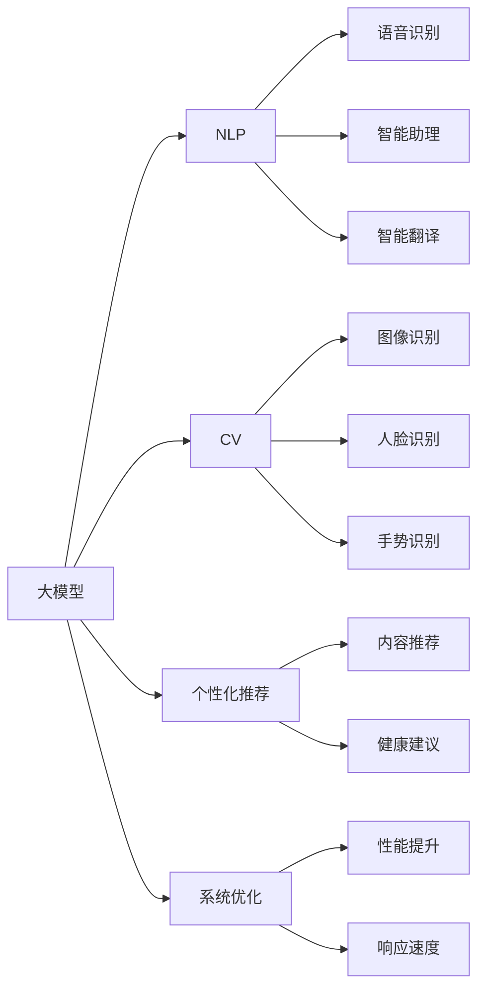
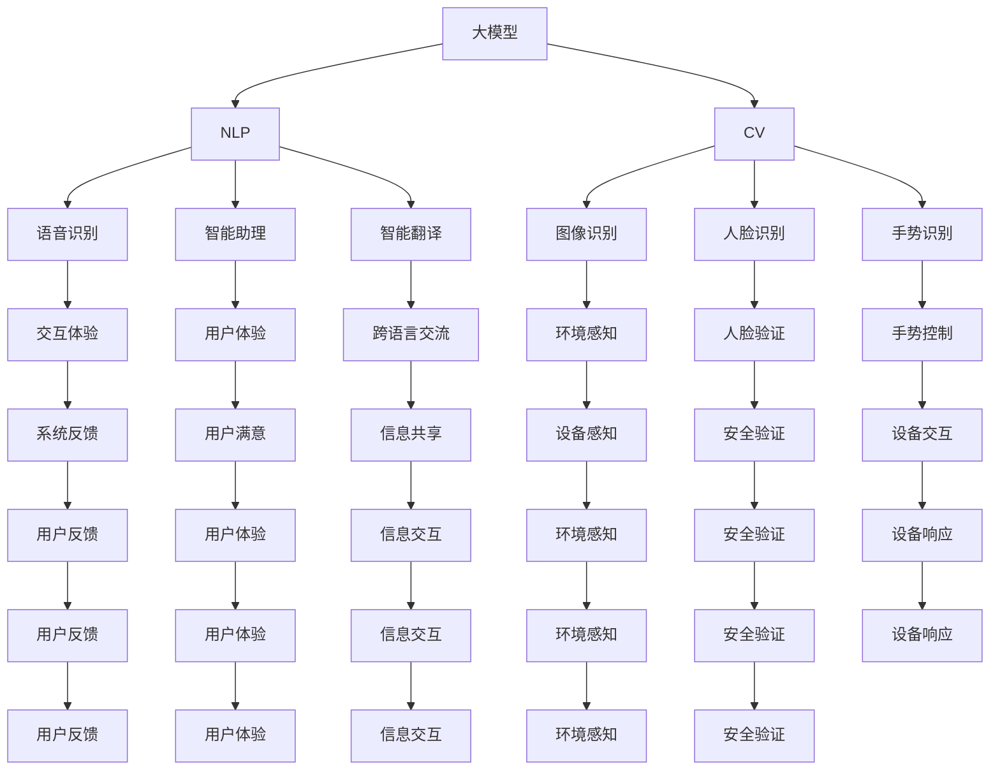
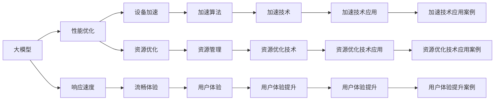
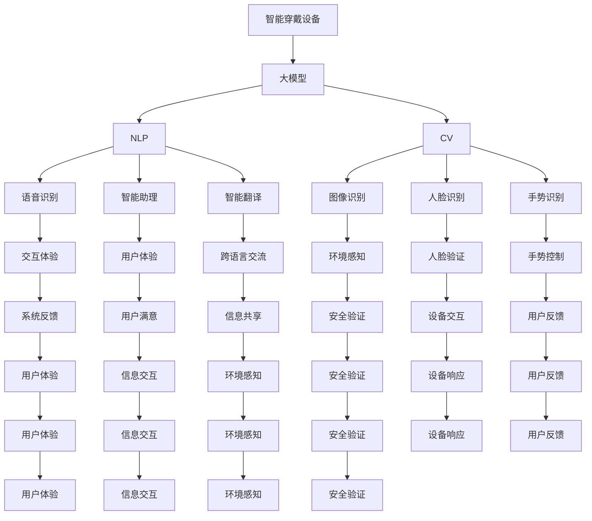

                 

# 大模型在智能穿戴设备中的应用

> 关键词：智能穿戴设备, 大模型, 自然语言处理(NLP), 计算机视觉, 个性化推荐, 健康监测, 语音识别, 系统优化

## 1. 背景介绍

### 1.1 问题由来

随着科技的进步和人们生活水平的提高，智能穿戴设备逐渐成为人们生活中不可或缺的一部分。智能手表、智能眼镜、智能健身设备等，极大地便利了人们的日常生活。然而，智能穿戴设备不仅仅是个性的展示，更是一个复杂的集成系统，涉及到硬件、软件、传感器、通信等多个方面，其核心竞争力也在于强大的数据分析和处理能力。

大模型作为人工智能技术的代表，以其强大的计算能力和广泛的应用场景，为智能穿戴设备注入了新的活力。大模型在自然语言处理、计算机视觉、个性化推荐等多个领域的应用，不仅提高了设备的智能化水平，也极大地提升了用户体验。本文将详细探讨大模型在智能穿戴设备中的应用，涵盖自然语言处理、计算机视觉、个性化推荐等多个方面。

### 1.2 问题核心关键点

大模型在智能穿戴设备中的应用主要围绕以下几个关键点展开：

- 自然语言处理（NLP）：在智能穿戴设备中，大模型可以用于语音识别、智能助理、智能翻译等任务，提升设备与用户之间的交互体验。
- 计算机视觉：大模型在智能穿戴设备中用于图像识别、人脸识别、手势识别等任务，可以增强设备对环境的感知和理解。
- 个性化推荐：通过大模型的学习和分析，智能穿戴设备可以根据用户的行为和偏好，提供个性化的内容推荐和健康建议，提升用户体验。
- 健康监测：利用大模型的分析能力，智能穿戴设备可以实时监测用户的健康状况，提供及时的预警和建议，保障用户的安全和健康。
- 系统优化：大模型可以用于智能穿戴设备的系统优化，提升设备的性能和响应速度，提供更加流畅的用户体验。

这些关键点的综合应用，为大模型在智能穿戴设备中提供了广阔的发展空间和应用前景。

### 1.3 问题研究意义

大模型在智能穿戴设备中的应用，对于提升设备的智能化水平、改善用户体验、推动技术创新等方面具有重要意义：

1. **提升设备的智能化水平**：通过大模型的应用，智能穿戴设备可以具备更强的数据处理和分析能力，提升设备的智能化水平，提供更全面的功能和服务。
2. **改善用户体验**：大模型可以提供更自然、更个性化的交互体验，帮助用户更轻松地使用设备，提升用户满意度。
3. **推动技术创新**：大模型的应用可以推动智能穿戴设备技术的创新和突破，提升设备的核心竞争力。
4. **促进健康监测**：大模型可以用于健康监测，为用户提供及时的预警和建议，保障用户的健康和安全。
5. **系统优化**：大模型可以用于智能穿戴设备的系统优化，提升设备的性能和响应速度，提供更加流畅的用户体验。

## 2. 核心概念与联系

### 2.1 核心概念概述

为更好地理解大模型在智能穿戴设备中的应用，本节将介绍几个密切相关的核心概念：

- 大模型（Large Model）：以深度学习为基础的大规模神经网络模型，通常具有数十亿个参数。通过在大规模数据集上进行训练，可以学习到丰富的知识，应用于各种复杂的任务。
- 自然语言处理（NLP）：利用计算机技术处理、理解和生成人类语言的技术，包括语音识别、智能助理、智能翻译等。
- 计算机视觉（CV）：利用计算机技术处理、分析和理解图像和视频的技术，包括图像识别、人脸识别、手势识别等。
- 个性化推荐：根据用户的行为和偏好，提供个性化的内容推荐和健康建议，提升用户体验。
- 健康监测：利用传感器和数据处理技术，实时监测用户的健康状况，提供及时的预警和建议。
- 系统优化：通过算法和模型优化，提升设备的性能和响应速度，提供更加流畅的用户体验。

这些核心概念之间的逻辑关系可以通过以下Mermaid流程图来展示：

这个流程图展示了大模型在智能穿戴设备中的核心概念及其之间的关系：

1. 大模型通过学习大规模数据集，获得了丰富的知识，可以应用于NLP、CV等多个领域。
2. 在大模型的基础上，可以开发语音识别、智能助理、智能翻译等NLP应用。
3. 大模型还可以用于图像识别、人脸识别、手势识别等CV任务。
4. 利用大模型，可以提供个性化的内容推荐和健康建议，提升用户体验。
5. 大模型还可以用于智能穿戴设备的系统优化，提升设备的性能和响应速度。

### 2.2 概念间的关系

这些核心概念之间存在着紧密的联系，形成了智能穿戴设备的应用生态系统。下面我们通过几个Mermaid流程图来展示这些概念之间的关系。

#### 2.2.1 大模型的应用范式

这个流程图展示了大模型在智能穿戴设备中的应用范式：

1. 大模型通过学习大规模数据集，获得了丰富的知识，可以应用于NLP、CV等多个领域。
2. 在大模型的基础上，可以开发语音识别、智能助理、智能翻译等NLP应用，提升交互体验。
3. 大模型还可以用于图像识别、人脸识别、手势识别等CV任务，增强设备对环境的感知和理解。
4. 利用大模型，可以提供个性化的内容推荐和健康建议，提升用户体验。
5. 大模型还可以用于智能穿戴设备的系统优化，提升设备的性能和响应速度。

#### 2.2.2 系统优化范式

这个流程图展示了大模型在智能穿戴设备系统优化中的应用范式：

1. 大模型可以用于性能优化，提升设备的响应速度。
2. 通过性能优化，可以提升设备的加速算法，提升设备响应速度。
3. 通过资源优化，可以优化设备的资源管理，提升用户体验。
4. 通过系统优化，可以提升设备的流畅体验，提升用户体验。

### 2.3 核心概念的整体架构

最后，我们用一个综合的流程图来展示这些核心概念在大模型应用过程中的整体架构：

这个综合流程图展示了从大模型到NLP、CV等多个任务的整体应用架构：

1. 大模型通过学习大规模数据集，获得了丰富的知识，可以应用于NLP、CV等多个领域。
2. 在大模型的基础上，可以开发语音识别、智能助理、智能翻译等NLP应用，提升交互体验。
3. 大模型还可以用于图像识别、人脸识别、手势识别等CV任务，增强设备对环境的感知和理解。
4. 利用大模型，可以提供个性化的内容推荐和健康建议，提升用户体验。
5. 大模型还可以用于智能穿戴设备的系统优化，提升设备的性能和响应速度。

## 3. 核心算法原理 & 具体操作步骤
### 3.1 算法原理概述

大模型在智能穿戴设备中的应用主要基于深度学习技术，通过在大规模数据集上进行训练，学习到丰富的知识，应用于各种复杂的任务。以下是几个核心算法原理：

1. **自然语言处理（NLP）**：大模型通过自监督学习或监督学习的方式，学习语言的通用表示，可以应用于语音识别、智能助理、智能翻译等任务。
2. **计算机视觉（CV）**：大模型通过图像识别、人脸识别、手势识别等任务，学习到图像的特征表示，可以应用于图像处理和识别任务。
3. **个性化推荐**：大模型通过用户行为和偏好的学习，提供个性化的内容推荐，提升用户体验。
4. **健康监测**：大模型通过传感器数据的分析，实时监测用户的健康状况，提供及时的预警和建议。
5. **系统优化**：大模型通过系统优化的算法和模型，提升设备的性能和响应速度，提供更加流畅的用户体验。

### 3.2 算法步骤详解

以下是大模型在智能穿戴设备中的应用步骤详解：

#### 3.2.1 自然语言处理（NLP）

**Step 1: 数据准备**
- 收集智能穿戴设备上用户输入的语音、文本数据。
- 进行数据清洗和预处理，如分词、去噪、归一化等。

**Step 2: 模型选择**
- 选择合适的预训练语言模型，如BERT、GPT等。
- 根据任务需求，选择不同的NLP任务适配器。

**Step 3: 微调训练**
- 将数据集分成训练集、验证集和测试集。
- 使用适当的优化算法（如AdamW、SGD等）进行微调训练。
- 设置适当的超参数，如学习率、批大小、迭代轮数等。

**Step 4: 模型评估**
- 在验证集上评估模型性能。
- 根据评估结果调整超参数，继续训练或停止训练。
- 在测试集上评估最终模型性能。

**Step 5: 应用部署**
- 将模型部署到智能穿戴设备上。
- 通过API接口提供语音识别、智能助理、智能翻译等服务。

#### 3.2.2 计算机视觉（CV）

**Step 1: 数据准备**
- 收集智能穿戴设备上用户的图像、视频数据。
- 进行数据清洗和预处理，如图像裁剪、缩放、归一化等。

**Step 2: 模型选择**
- 选择合适的预训练计算机视觉模型，如ResNet、Inception等。
- 根据任务需求，选择不同的计算机视觉任务适配器。

**Step 3: 微调训练**
- 将数据集分成训练集、验证集和测试集。
- 使用适当的优化算法（如SGD、Adam等）进行微调训练。
- 设置适当的超参数，如学习率、批大小、迭代轮数等。

**Step 4: 模型评估**
- 在验证集上评估模型性能。
- 根据评估结果调整超参数，继续训练或停止训练。
- 在测试集上评估最终模型性能。

**Step 5: 应用部署**
- 将模型部署到智能穿戴设备上。
- 通过API接口提供图像识别、人脸识别、手势识别等服务。

#### 3.2.3 个性化推荐

**Step 1: 数据准备**
- 收集智能穿戴设备上用户的行为数据。
- 进行数据清洗和预处理，如去重、归一化等。

**Step 2: 模型选择**
- 选择合适的预训练推荐模型，如BERT、DNN等。
- 根据任务需求，选择不同的推荐任务适配器。

**Step 3: 微调训练**
- 将数据集分成训练集、验证集和测试集。
- 使用适当的优化算法（如AdamW、SGD等）进行微调训练。
- 设置适当的超参数，如学习率、批大小、迭代轮数等。

**Step 4: 模型评估**
- 在验证集上评估模型性能。
- 根据评估结果调整超参数，继续训练或停止训练。
- 在测试集上评估最终模型性能。

**Step 5: 应用部署**
- 将模型部署到智能穿戴设备上。
- 通过API接口提供个性化推荐服务。

#### 3.2.4 健康监测

**Step 1: 数据准备**
- 收集智能穿戴设备上的传感器数据。
- 进行数据清洗和预处理，如去噪、归一化等。

**Step 2: 模型选择**
- 选择合适的预训练健康监测模型，如BERT、DNN等。
- 根据任务需求，选择不同的健康监测任务适配器。

**Step 3: 微调训练**
- 将数据集分成训练集、验证集和测试集。
- 使用适当的优化算法（如AdamW、SGD等）进行微调训练。
- 设置适当的超参数，如学习率、批大小、迭代轮数等。

**Step 4: 模型评估**
- 在验证集上评估模型性能。
- 根据评估结果调整超参数，继续训练或停止训练。
- 在测试集上评估最终模型性能。

**Step 5: 应用部署**
- 将模型部署到智能穿戴设备上。
- 通过API接口提供健康监测服务。

#### 3.2.5 系统优化

**Step 1: 数据准备**
- 收集智能穿戴设备上的系统性能数据。
- 进行数据清洗和预处理，如去噪、归一化等。

**Step 2: 模型选择**
- 选择合适的预训练系统优化模型，如BERT、DNN等。
- 根据任务需求，选择不同的系统优化任务适配器。

**Step 3: 微调训练**
- 将数据集分成训练集、验证集和测试集。
- 使用适当的优化算法（如AdamW、SGD等）进行微调训练。
- 设置适当的超参数，如学习率、批大小、迭代轮数等。

**Step 4: 模型评估**
- 在验证集上评估模型性能。
- 根据评估结果调整超参数，继续训练或停止训练。
- 在测试集上评估最终模型性能。

**Step 5: 应用部署**
- 将模型部署到智能穿戴设备上。
- 通过API接口提供系统优化服务。

### 3.3 算法优缺点

大模型在智能穿戴设备中的应用，具有以下优点：

1. **强大的数据处理能力**：大模型通过深度学习技术，具备强大的数据处理能力，可以应用于各种复杂的任务。
2. **泛化能力强**：大模型在预训练阶段学习到丰富的知识，可以应用于不同的场景和任务。
3. **快速适应新任务**：通过微调，大模型可以快速适应新任务，提升设备的功能和性能。

同时，大模型在智能穿戴设备中的应用也存在一些缺点：

1. **资源消耗大**：大模型参数量较大，需要较高的计算资源和内存空间。
2. **模型训练时间长**：由于模型参数较多，训练时间较长，需要较长的开发周期。
3. **部署复杂**：大模型在智能穿戴设备上的部署需要考虑系统架构和性能优化，较为复杂。

### 3.4 算法应用领域

大模型在智能穿戴设备中的应用，已经涵盖了NLP、CV、个性化推荐、健康监测等多个领域。以下是一些典型的应用领域：

1. **语音识别**：通过大模型实现实时语音识别，提升智能穿戴设备的交互体验。
2. **智能助理**：通过大模型实现智能助理功能，帮助用户完成各种任务。
3. **智能翻译**：通过大模型实现跨语言翻译，提升智能穿戴设备的国际化水平。
4. **图像识别**：通过大模型实现图像识别，提升智能穿戴设备的环境感知能力。
5. **人脸识别**：通过大模型实现人脸识别，提升智能穿戴设备的安全验证能力。
6. **手势识别**：通过大模型实现手势识别，提升智能穿戴设备的人机交互能力。
7. **个性化推荐**：通过大模型实现个性化推荐，提升智能穿戴设备的内容推荐能力。
8. **健康监测**：通过大模型实现健康监测，提升智能穿戴设备的用户健康水平。
9. **系统优化**：通过大模型实现系统优化，提升智能穿戴设备的性能和响应速度。

这些应用领域展示了大模型在智能穿戴设备中的广泛应用，为大模型在智能穿戴设备中的应用提供了广阔的发展空间。

## 4. 数学模型和公式 & 详细讲解 & 举例说明

### 4.1 数学模型构建

以下是几个关键数学模型的构建过程：

#### 4.1.1 自然语言处理（NLP）

**数学模型构建**

大模型在NLP任务中的应用，主要基于自监督学习和监督学习的方式。以BERT模型为例，其数学模型构建如下：

$$
\mathcal{L}(\theta) = \frac{1}{N}\sum_{i=1}^N \ell(M_{\theta}(x_i), y_i)
$$

其中，$M_{\theta}$表示BERT模型，$x_i$表示输入文本，$y_i$表示标注标签。$\ell$表示损失函数，如交叉熵损失函数。

**公式推导过程**

以BERT模型的交叉熵损失函数为例，其公式推导如下：

$$
\ell(M_{\theta}(x), y) = -\log P_{\theta}(y|x)
$$

其中，$P_{\theta}(y|x)$表示模型在输入$x$下输出标签$y$的概率。

**案例分析与讲解**

以智能助理任务为例，可以使用大模型进行语音识别和自然语言处理。具体流程如下：

1. 收集智能穿戴设备上的语音数据。
2. 使用语音识别模型对语音进行转换，得到文本输入。
3. 使用大模型对文本进行分析和处理，得出智能助理的回复。
4. 将回复输出到智能穿戴设备，完成与用户的交互。

#### 4.1.2 计算机视觉（CV）

**数学模型构建**

大模型在CV任务中的应用，主要基于深度学习技术。以ResNet模型为例，其数学模型构建如下：

$$
\mathcal{L}(\theta) = \frac{1}{N}\sum_{i=1}^N \ell(M_{\theta}(x_i), y_i)
$$

其中，$M_{\theta}$表示ResNet模型，$x_i$表示输入图像，$y_i$表示标注标签。$\ell$表示损失函数，如交叉熵损失函数。

**公式推导过程**

以ResNet模型的交叉熵损失函数为例，其公式推导如下：

$$
\ell(M_{\theta}(x), y) = -\log \frac{\exp(\text{score}(x, y))}{\sum_{k=1}^K \exp(\text{score}(x, k))}
$$

其中，$\text{score}(x, y)$表示模型在输入$x$下输出标签$y$的概率。

**案例分析与讲解**

以人脸识别任务为例，可以使用大模型进行图像识别和人脸验证。具体流程如下：

1. 收集智能穿戴设备上的人脸图像数据。
2. 使用图像识别模型对图像进行预处理，得到特征表示。
3. 使用大模型对特征表示进行分析和处理，得出人脸验证结果。
4. 将验证结果输出到智能穿戴设备，完成用户身份验证。

#### 4.1.3 个性化推荐

**数学模型构建**

大模型在个性化推荐任务中的应用，主要基于协同过滤和深度学习技术。以BERT模型为例，其数学模型构建如下：

$$
\mathcal{L}(\theta) = \frac{1}{N}\sum_{i=1}^N \ell(M_{\theta}(x_i), y_i)
$$

其中，$M_{\theta}$表示BERT模型，$x_i$表示用户行为数据，$y_i$表示推荐结果。$\ell$表示损失函数，如交叉熵损失函数。

**公式推导过程**

以BERT模型的交叉熵损失函数为例，其公式推导如下：

$$
\ell(M_{\theta}(x), y) = -\log P_{\theta}(y|x)
$$

其中，$P_{\theta}(y|x)$表示模型在输入$x$下输出标签$y$的概率。

**案例分析与讲解**

以个性化推荐任务为例，可以使用大模型进行内容推荐和健康建议。具体流程如下：

1. 收集智能穿戴设备上的用户行为数据。
2. 使用大模型对行为数据进行分析，得到用户兴趣和偏好。
3. 根据用户兴趣和偏好，生成个性化推荐结果。
4. 将推荐结果输出到智能穿戴设备，提升用户体验。

#### 4.1.4 健康监测

**数学模型构建**

大模型在健康监测任务中的应用，主要基于深度学习技术和时间序列分析。以BERT模型为例，其数学模型构建如下：

$$
\mathcal{L}(\theta) = \frac{1}{N}\sum_{i=1}^N \ell(M_{\theta}(x_i), y_i)
$$

其中，$M_{\theta}$表示BERT模型，$x_i$表示传感器数据，$y_i$表示健康监测结果。$\ell$表示损失函数，如交叉熵损失函数。

**公式推导过程**

以BERT模型的交叉熵损失函数为例，其公式推导如下：

$$
\ell(M_{\theta}(x), y) = -\log P_{\theta}(y|x)
$$

其中，$P_{\theta}(y|x)$表示模型在输入$x$下输出标签$y$的概率。

**案例分析与讲解**

以健康监测任务为例，可以使用大模型进行健康状况分析和预警。具体流程如下：

1. 收集智能穿戴设备上的传感器数据。
2. 使用大模型对传感器数据进行分析，得到健康状况结果。
3. 根据健康状况结果，生成预警和建议。
4. 将预警和建议输出到智能穿戴设备，保障用户健康安全。

#### 4.1.5 系统优化

**数学模型构建**

大模型在系统优化任务中的应用，主要基于深度学习技术和系统优化算法。以BERT模型为例，其数学模型构建如下：

$$
\mathcal{L}(\theta) = \frac{1}{N}\sum_{i=1}^N \ell(M_{\theta}(x_i), y_i)
$$

其中，$M_{\theta}$表示BERT模型，$x_i$表示系统性能数据，$y_i$表示优化结果。$\ell$表示损失函数，如交叉熵损失函数。

**公式推导过程**

以BERT模型的交叉熵损失函数为例，其公式推导如下：

$$
\ell(M_{\theta}(x), y) = -\log P_{\theta}(y|x)
$$

其中，$P_{\theta}(y|x)$表示模型在输入$x$下输出标签$y$的概率。

**案例分析与讲解**

以系统优化任务为例，可以使用大模型进行性能优化和响应速度提升。具体流程如下：

1. 收集智能穿戴设备上的系统性能数据。
2. 使用大模型对性能数据进行分析，得到优化结果。
3. 根据优化结果，生成性能提升策略。
4. 将性能提升策略输出到智能穿戴设备，提升设备性能和响应速度。

## 5. 项目实践：

