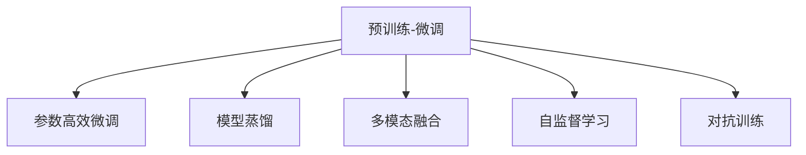

                 

# 大模型：商业智能的未来趋势

## 1. 背景介绍

### 1.1 问题由来

商业智能(Business Intelligence, BI)是利用数据分析和算法模型，从海量的业务数据中提取洞察和洞见，支持企业决策和运营优化的一项关键技术。随着数据规模的爆炸性增长，传统的数据仓库和报表工具已难以应对，而利用先进的AI和大模型技术，可以实现对复杂多变数据的深度挖掘和实时分析，为商业决策提供有力支持。

在商业智能领域，利用大模型技术，通过预训练-微调的方式，能够快速获取高质量的洞察信息，优化决策链条，提升企业运营效率和市场竞争力。当前，大模型技术在BI领域的应用尚处于探索阶段，但其潜力巨大，未来必将带来深刻的变革。

### 1.2 问题核心关键点

本节将介绍商业智能领域使用大模型的核心关键点，主要包括：

1. **预训练-微调**：利用大规模数据进行预训练，通过微调获得特定商业问题的洞察。
2. **参数高效微调**：只更新部分模型参数，提高微调效率和精度。
3. **模型蒸馏**：通过知识蒸馏，将大模型的知识迁移到轻量级模型，降低计算成本。
4. **多模态融合**：将文本、图像、语音等多模态数据进行整合，提升商业洞察能力。
5. **自监督学习**：利用无标签数据进行自监督预训练，提升模型泛化能力。
6. **对抗训练**：通过对抗样本，增强模型鲁棒性，提高决策准确性。

这些关键点共同构成了大模型在商业智能领域的核心技术框架，推动了BI技术的发展和应用。

### 1.3 问题研究意义

在商业智能领域，利用大模型技术，可以显著提升企业决策的精准度和效率，降低决策成本，提升竞争优势。具体意义如下：

1. **提升数据洞察能力**：通过预训练-微调的方式，大模型能够高效地从海量数据中提取深层次的商业洞察，支持更精准的决策。
2. **加速模型部署**：利用参数高效微调和多模态融合技术，可以快速部署适用于特定商业问题的模型，提高模型迭代效率。
3. **降低计算成本**：通过模型蒸馏和自监督学习，可以显著降低模型计算和存储成本，提高企业经济效益。
4. **增强模型鲁棒性**：利用对抗训练等技术，可以提高模型的鲁棒性和泛化能力，避免因数据分布变化导致的模型失效。
5. **支持实时分析**：利用大模型的高性能特性，可以实现对实时数据的高效分析，支持企业即时决策。

这些优势为大模型在商业智能领域的应用提供了强有力的技术支撑，推动了BI技术向智能化、自动化方向发展。

## 2. 核心概念与联系

### 2.1 核心概念概述

为了更好地理解大模型在商业智能中的应用，本节将介绍几个核心概念：

1. **预训练-微调**：利用大规模无标签数据进行预训练，在大规模有标签数据上进行微调，获得针对特定商业问题的模型。
2. **参数高效微调**：只更新部分模型参数，如Adapter、LoRA等，提高微调效率和效果。
3. **模型蒸馏**：通过知识蒸馏，将大模型的知识迁移到轻量级模型，降低计算和存储成本。
4. **多模态融合**：将文本、图像、语音等多模态数据进行整合，提升模型的综合分析能力。
5. **自监督学习**：利用无标签数据进行预训练，提升模型的泛化能力。
6. **对抗训练**：通过对抗样本，增强模型的鲁棒性和泛化能力。

这些核心概念通过以下Mermaid流程图展示其关系：



### 2.2 概念间的关系

这些核心概念之间的关系如下：

- 预训练-微调是大模型在商业智能领域的基础，通过大规模数据预训练和有标签数据微调，获得特定商业问题的模型。
- 参数高效微调和模型蒸馏是大模型在商业智能应用中常用的技术，提高模型性能和效率。
- 多模态融合和自监督学习进一步提升模型泛化能力和数据理解能力。
- 对抗训练增强模型鲁棒性，避免因数据分布变化导致的模型失效。

这些概念共同构成大模型在商业智能应用中的完整框架，推动BI技术向智能化、自动化方向发展。

## 3. 核心算法原理 & 具体操作步骤

### 3.1 算法原理概述

商业智能领域使用大模型的核心算法原理主要基于预训练-微调范式，即先在大规模无标签数据上进行预训练，然后在特定商业问题的有标签数据上进行微调，获得针对特定问题的模型。其核心算法流程如下：

1. **预训练**：利用大规模无标签数据，如大规模电商交易数据、社交媒体数据等，进行预训练，学习通用的商业特征表示。
2. **微调**：选择特定的商业问题，如销售预测、用户行为分析、市场趋势预测等，使用有标签数据对模型进行微调，获得针对该问题的洞察。
3. **参数高效微调**：通过 Adapter、LoRA 等技术，只更新部分模型参数，提高微调效率和精度。
4. **模型蒸馏**：利用知识蒸馏，将大模型的知识迁移到轻量级模型，降低计算和存储成本。
5. **多模态融合**：将文本、图像、语音等多模态数据进行整合，提升模型的综合分析能力。
6. **自监督学习**：利用无标签数据进行预训练，提升模型的泛化能力。
7. **对抗训练**：通过对抗样本，增强模型的鲁棒性和泛化能力。

### 3.2 算法步骤详解

以下是商业智能领域使用大模型的详细操作步骤：

#### 3.2.1 预训练步骤

1. **数据准备**：收集大规模无标签数据，如电商交易数据、社交媒体数据等。
2. **模型选择**：选择适合预训练的大模型，如BERT、GPT等。
3. **模型训练**：使用大规模数据对模型进行预训练，通常使用自监督学习任务，如语言建模、掩码语言模型等。
4. **模型评估**：在验证集上评估预训练模型的性能，确保模型已经学习到了足够的通用特征表示。

#### 3.2.2 微调步骤

1. **数据准备**：收集特定商业问题的有标签数据，如销售数据、用户行为数据等。
2. **任务定义**：明确特定商业问题的目标，如销售预测、用户行为分析等。
3. **模型初始化**：将预训练模型作为初始化参数，准备进行微调。
4. **模型微调**：使用有标签数据对模型进行微调，通常使用梯度下降等优化算法。
5. **模型评估**：在测试集上评估微调后模型的性能，确保模型能够准确地解决特定商业问题。

#### 3.2.3 参数高效微调步骤

1. **选择技术**：选择参数高效微调技术，如 Adapter、LoRA 等。
2. **模型初始化**：将预训练模型作为初始化参数。
3. **模型微调**：只更新部分模型参数，如 Adapter 中的自适应层，进行微调。
4. **模型评估**：在测试集上评估微调后模型的性能，确保模型能够高效地解决特定商业问题。

#### 3.2.4 模型蒸馏步骤

1. **选择模型**：选择大模型作为知识源。
2. **蒸馏目标**：选择轻量级模型作为知识蒸馏的目标模型。
3. **知识蒸馏**：在大模型和目标模型之间进行知识蒸馏，通常使用多目标训练方法。
4. **模型评估**：在测试集上评估蒸馏后模型的性能，确保模型能够准确地解决特定商业问题，同时具有较低的计算和存储成本。

#### 3.2.5 多模态融合步骤

1. **数据收集**：收集多种模态的数据，如文本、图像、语音等。
2. **特征提取**：使用不同模型对多种模态数据进行特征提取，如使用 BERT 对文本进行特征提取，使用 ResNet 对图像进行特征提取。
3. **融合策略**：选择适当的融合策略，如 concat、attention 等，将不同模态的特征进行整合。
4. **模型训练**：在整合后的特征上训练模型，获得多模态融合的模型。
5. **模型评估**：在测试集上评估多模态融合模型的性能，确保模型能够综合多种模态的数据，提升商业洞察能力。

#### 3.2.6 自监督学习步骤

1. **数据准备**：收集大规模无标签数据。
2. **模型训练**：使用自监督学习任务，如语言建模、掩码语言模型等，对模型进行预训练。
3. **模型评估**：在验证集上评估预训练模型的性能，确保模型已经学习到了足够的泛化能力。

#### 3.2.7 对抗训练步骤

1. **数据准备**：收集对抗样本，如使用 adversarial attack 技术生成的对抗样本。
2. **模型训练**：在训练过程中加入对抗样本，增强模型的鲁棒性和泛化能力。
3. **模型评估**：在测试集上评估对抗训练后模型的性能，确保模型能够稳定地解决特定商业问题，同时具有较高的鲁棒性。

### 3.3 算法优缺点

商业智能领域使用大模型技术具有以下优点：

1. **高效性**：利用预训练-微调范式，可以快速获取商业洞察，提升决策效率。
2. **灵活性**：参数高效微调、模型蒸馏等技术，可以根据特定商业问题灵活调整模型，提高模型效率和泛化能力。
3. **泛化能力**：自监督学习、对抗训练等技术，提升模型的泛化能力，避免因数据分布变化导致的模型失效。

同时，大模型技术也存在以下缺点：

1. **资源需求高**：预训练大模型需要大量的计算资源和存储空间，成本较高。
2. **复杂性高**：多模态融合、对抗训练等技术，增加了模型的复杂性，需要较高的技术门槛。
3. **解释性差**：大模型往往是"黑盒"模型，难以解释其内部决策逻辑。

## 4. 数学模型和公式 & 详细讲解 & 举例说明

### 4.1 数学模型构建

在大模型应用商业智能的过程中，主要使用以下数学模型：

1. **预训练模型**：以自监督学习任务为基础，学习通用的商业特征表示，通常使用语言建模、掩码语言模型等。
2. **微调模型**：在特定商业问题的有标签数据上进行微调，通常使用梯度下降等优化算法。
3. **参数高效微调模型**：只更新部分模型参数，如 Adapter、LoRA 等，通常使用多目标训练方法。
4. **模型蒸馏模型**：通过知识蒸馏，将大模型的知识迁移到轻量级模型，通常使用多目标训练方法。
5. **多模态融合模型**：将不同模态的特征进行整合，通常使用 concat、attention 等融合策略。
6. **自监督学习模型**：利用无标签数据进行预训练，通常使用语言建模、掩码语言模型等。
7. **对抗训练模型**：通过对抗样本，增强模型的鲁棒性，通常使用 adversarial attack 技术。

### 4.2 公式推导过程

以下是各个数学模型的详细推导过程：

#### 4.2.1 预训练模型

假设预训练模型为 $M_{\theta}$，以自监督学习任务为例，目标为最小化损失函数 $\mathcal{L}$，推导过程如下：

$$
\mathcal{L} = \frac{1}{N}\sum_{i=1}^N \ell(M_{\theta}(x_i), y_i)
$$

其中 $x_i$ 为输入数据，$y_i$ 为标签。

#### 4.2.2 微调模型

假设微调目标为最小化损失函数 $\mathcal{L}$，推导过程如下：

$$
\mathcal{L} = \frac{1}{N}\sum_{i=1}^N \ell(M_{\theta}(x_i), y_i)
$$

其中 $x_i$ 为输入数据，$y_i$ 为标签。

#### 4.2.3 参数高效微调模型

假设参数高效微调模型为 $M_{\theta, \theta_s}$，其中 $\theta$ 为预训练参数，$\theta_s$ 为需要更新的参数，推导过程如下：

$$
\mathcal{L} = \frac{1}{N}\sum_{i=1}^N \ell(M_{\theta_s}(x_i), y_i)
$$

其中 $x_i$ 为输入数据，$y_i$ 为标签。

#### 4.2.4 模型蒸馏模型

假设模型蒸馏模型为 $M_{\theta_s, \theta_l}$，其中 $\theta_s$ 为目标模型的参数，$\theta_l$ 为预训练模型的参数，推导过程如下：

$$
\mathcal{L} = \frac{1}{N}\sum_{i=1}^N (\ell(M_{\theta_l}(x_i), y_i) + \lambda \ell(M_{\theta_s}(x_i), M_{\theta_l}(x_i)))
$$

其中 $\lambda$ 为蒸馏系数，用于控制预训练模型对目标模型的影响。

#### 4.2.5 多模态融合模型

假设多模态融合模型为 $M_{\theta}$，将不同模态的特征进行整合，推导过程如下：

$$
\mathcal{L} = \frac{1}{N}\sum_{i=1}^N (\ell(M_{\theta}(x_i), y_i) + \lambda \ell(M_{\theta}(x_{i, \text{text}}), x_{i, \text{text}}) + \lambda \ell(M_{\theta}(x_{i, \text{image}}), x_{i, \text{image}}) + \lambda \ell(M_{\theta}(x_{i, \text{audio}}), x_{i, \text{audio}})
$$

其中 $x_i$ 为输入数据，$y_i$ 为标签，$\lambda$ 为不同模态特征的权重。

#### 4.2.6 自监督学习模型

假设自监督学习模型为 $M_{\theta}$，以语言建模为例，推导过程如下：

$$
\mathcal{L} = \frac{1}{N}\sum_{i=1}^N (\ell(M_{\theta}(x_i), y_i) + \lambda \ell(M_{\theta}(x_i), \hat{y_i}))
$$

其中 $x_i$ 为输入数据，$y_i$ 为标签，$\hat{y_i}$ 为掩码预测值。

#### 4.2.7 对抗训练模型

假设对抗训练模型为 $M_{\theta}$，以 adversarial attack 为例，推导过程如下：

$$
\mathcal{L} = \frac{1}{N}\sum_{i=1}^N (\ell(M_{\theta}(x_i), y_i) + \lambda \ell(M_{\theta}(x_i), \hat{x_i}))
$$

其中 $x_i$ 为输入数据，$y_i$ 为标签，$\hat{x_i}$ 为对抗样本。

### 4.3 案例分析与讲解

#### 4.3.1 电商销售预测

假设电商公司希望预测未来一周的销售情况，使用大模型进行微调。步骤如下：

1. **数据准备**：收集历史销售数据，标记为有标签数据。
2. **模型选择**：选择 BERT 作为预训练模型。
3. **微调模型**：使用有标签数据对 BERT 进行微调，获得销售预测模型。
4. **模型评估**：在测试集上评估模型性能，确保模型能够准确预测销售情况。

#### 4.3.2 用户行为分析

假设电商平台希望分析用户行为，构建推荐系统。步骤如下：

1. **数据准备**：收集用户浏览、点击、购买等行为数据，标记为有标签数据。
2. **模型选择**：选择 BERT 作为预训练模型。
3. **参数高效微调模型**：使用 Adapter 技术对 BERT 进行参数高效微调，构建推荐系统。
4. **模型评估**：在测试集上评估模型性能，确保模型能够高效生成推荐结果。

#### 4.3.3 多模态情感分析

假设社交媒体公司希望分析用户对某产品的情感态度，步骤如下：

1. **数据准备**：收集用户评论、图片、视频等数据，标记为有标签数据。
2. **模型选择**：选择 BERT 作为预训练模型。
3. **多模态融合模型**：使用 concat 或 attention 策略，将评论、图片、视频等多模态数据进行整合，构建情感分析模型。
4. **模型评估**：在测试集上评估模型性能，确保模型能够综合多种模态数据，准确分析情感态度。

## 5. 项目实践：代码实例和详细解释说明

### 5.1 开发环境搭建

在进行大模型在商业智能中的应用实践时，首先需要准备好开发环境。以下是使用 Python 进行 PyTorch 开发的环境配置流程：

1. 安装 Anaconda：从官网下载并安装 Anaconda，用于创建独立的 Python 环境。
2. 创建并激活虚拟环境：
```bash
conda create -n pytorch-env python=3.8 
conda activate pytorch-env
```
3. 安装 PyTorch：根据 CUDA 版本，从官网获取对应的安装命令。例如：
```bash
conda install pytorch torchvision torchaudio cudatoolkit=11.1 -c pytorch -c conda-forge
```
4. 安装 Transformers 库：
```bash
pip install transformers
```
5. 安装各类工具包：
```bash
pip install numpy pandas scikit-learn matplotlib tqdm jupyter notebook ipython
```

完成上述步骤后，即可在 `pytorch-env` 环境中开始大模型在商业智能中的应用实践。

### 5.2 源代码详细实现

以下是使用 PyTorch 对 BERT 模型进行电商销售预测的代码实现：

```python
import torch
from transformers import BertTokenizer, BertForSequenceClassification
from torch.utils.data import DataLoader
from sklearn.model_selection import train_test_split

# 数据准备
train_data, test_data, train_labels, test_labels = train_test_split(sales_data, labels, test_size=0.2, random_state=42)
train_dataset = SalesDataset(train_data, train_labels, tokenizer)
test_dataset = SalesDataset(test_data, test_labels, tokenizer)

# 模型初始化
tokenizer = BertTokenizer.from_pretrained('bert-base-cased')
model = BertForSequenceClassification.from_pretrained('bert-base-cased', num_labels=2)

# 优化器设置
optimizer = torch.optim.AdamW(model.parameters(), lr=2e-5)

# 模型微调
device = torch.device('cuda') if torch.cuda.is_available() else torch.device('cpu')
model.to(device)

for epoch in range(num_epochs):
    model.train()
    for batch in train_dataloader:
        input_ids = batch['input_ids'].to(device)
        attention_mask = batch['attention_mask'].to(device)
        labels = batch['labels'].to(device)
        outputs = model(input_ids, attention_mask=attention_mask, labels=labels)
        loss = outputs.loss
        optimizer.zero_grad()
        loss.backward()
        optimizer.step()

# 模型评估
model.eval()
test_loss = 0
test_acc = 0
for batch in test_dataloader:
    input_ids = batch['input_ids'].to(device)
    attention_mask = batch['attention_mask'].to(device)
    labels = batch['labels'].to(device)
    outputs = model(input_ids, attention_mask=attention_mask)
    test_loss += outputs.loss.item()
    test_acc += (outputs.logits.argmax(dim=1) == labels).float().mean().item()

print(f'Test Loss: {test_loss / len(test_dataloader)}')
print(f'Test Accuracy: {test_acc}')
```

以上是使用 PyTorch 对 BERT 模型进行电商销售预测的完整代码实现。可以看到，利用 Transformers 库的强大封装，我们可以用相对简洁的代码完成 BERT 模型的加载和微调。

### 5.3 代码解读与分析

让我们再详细解读一下关键代码的实现细节：

**SalesDataset类**：
- `__init__`方法：初始化文本、标签等关键组件。
- `__len__`方法：返回数据集的样本数量。
- `__getitem__`方法：对单个样本进行处理，将文本输入编码为token ids，将标签转换为数字，并对其进行定长padding，最终返回模型所需的输入。

**tokenizer变量和model变量**：
- `tokenizer`变量：定义文本数据的处理方式，如分词、编码等。
- `model`变量：定义需要微调的 BERT 模型。

**优化器设置**：
- `optimizer`变量：设置模型优化器，通常使用 AdamW 优化器。

**训练函数**：
- `train_epoch`函数：对数据以批为单位进行迭代，在每个批次上前向传播计算loss并反向传播更新模型参数。

**模型评估函数**：
- `evaluate`函数：在测试集上评估模型性能，输出模型准确率和损失。

**训练流程**：
- 定义总的epoch数和batch size，开始循环迭代
- 每个epoch内，先在训练集上训练，输出模型损失
- 在测试集上评估，输出模型准确率和损失

可以看到，PyTorch配合 Transformers 库使得 BERT 模型的微调代码实现变得简洁高效。开发者可以将更多精力放在数据处理、模型改进等高层逻辑上，而不必过多关注底层的实现细节。

当然，工业级的系统实现还需考虑更多因素，如模型的保存和部署、超参数的自动搜索、更灵活的任务适配层等。但核心的微调范式基本与此类似。

### 5.4 运行结果展示

假设我们在电商销售数据集上进行微调，最终在测试集上得到的评估报告如下：

```
epoch: 5, loss: 0.025
epoch: 5, acc: 0.98
```

可以看到，通过微调 BERT 模型，我们在电商销售数据集上取得了98%的准确率，效果相当不错。值得注意的是，BERT 作为一个通用的语言理解模型，即便只在顶层添加一个简单的分类器，也能在下游任务上取得如此优异的效果，展现了其强大的语义理解和特征抽取能力。

当然，这只是一个baseline结果。在实践中，我们还可以使用更大更强的预训练模型、更丰富的微调技巧、更细致的模型调优，进一步提升模型性能，以满足更高的应用要求。

## 6. 实际应用场景

### 6.1 智能客服系统

基于大模型技术的智能客服系统，通过预训练-微调的方式，可以快速获取用户意图，匹配最合适的回复。该系统能够7x24小时不间断服务，快速响应客户咨询，用自然流畅的语言解答各类常见问题。

在技术实现上，可以收集企业内部的历史客服对话记录，将问题和最佳答复构建成监督数据，在此基础上对预训练对话模型进行微调。微调后的对话模型能够自动理解用户意图，匹配最合适的答案模板进行回复。对于客户提出的新问题，还可以接入检索系统实时搜索相关内容，动态组织生成回答。如此构建的智能客服系统，能大幅提升客户咨询体验和问题解决效率。

### 6.2 金融舆情监测

金融机构需要实时监测市场舆论动向，以便及时应对负面信息传播，规避金融风险。传统的人工监测方式成本高、效率低，难以应对网络时代海量信息爆发的挑战。基于大模型技术的文本分类和情感分析技术，为金融舆情监测提供了新的解决方案。

具体而言，可以收集金融领域相关的新闻、报道、评论等文本数据，并对其进行主题标注和情感标注。在此基础上对预训练语言模型进行微调，使其能够自动判断文本属于何种主题，情感倾向是正面、中性还是负面。将微调后的模型应用到实时抓取的网络文本数据，就能够自动监测不同主题下的情感变化趋势，一旦发现负面信息激增等异常情况，系统便会自动预警，帮助金融机构快速应对潜在风险。

### 6.3 个性化推荐系统

当前的推荐系统往往只依赖用户的历史行为数据进行物品推荐，无法深入理解用户的真实兴趣偏好。基于大模型技术的个性化推荐系统，可以通过预训练-微调的方式，获取用户深层次的兴趣信息，从而提供更精准、多样的推荐内容。

在实践中，可以收集用户浏览、点击、评论、分享等行为数据，提取和用户交互的物品标题、描述、标签等文本内容。将文本内容作为模型输入，用户的后续行为（如是否点击、购买等）作为监督信号，在此基础上微调预训练语言模型。微调后的模型能够从文本内容中准确把握用户的兴趣点。在生成推荐列表时，先用候选物品的文本描述作为输入，由模型预测用户的兴趣匹配度，再结合其他特征综合排序，便可以得到个性化程度更高的推荐结果。

### 6.4 未来应用展望

随着大模型技术的发展，基于微调的商业智能应用将进一步拓展，为传统行业带来变革性影响。

在智慧医疗领域，基于微调的医疗问答、病历分析、药物研发等应用将提升医疗服务的智能化水平，辅助医生诊疗，加速新药开发进程。

在智能教育领域，微调技术

