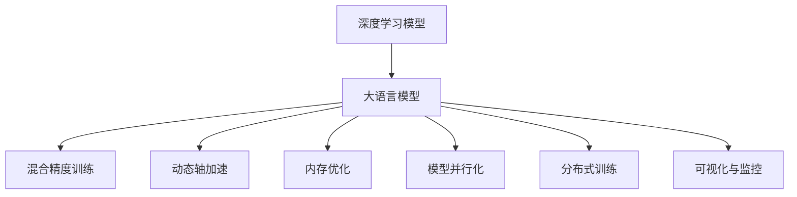
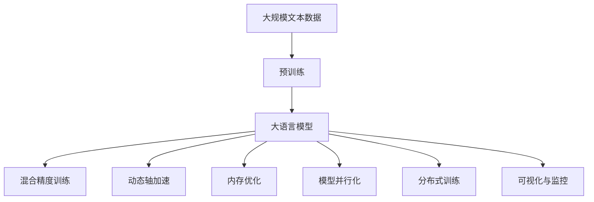

                 

# 大语言模型原理与工程实践：大语言模型训练工程实践DeepSpeed 架构

## 1. 背景介绍

### 1.1 问题由来
近年来，深度学习技术在计算机视觉、自然语言处理等领域取得了显著进展，尤其在自然语言处理领域，基于深度学习的大语言模型（Large Language Models, LLMs）展示了强大的语言理解能力和生成能力。然而，这些大模型的训练过程通常需要大量的计算资源，训练速度和成本问题成为制约其大规模应用的主要障碍。

为了解决这个问题，DeepSpeed应运而生。DeepSpeed是一个面向高性能深度学习模型的开源软件库，旨在为训练大语言模型提供高效、可扩展的解决方案。通过优化模型并行和硬件加速技术，DeepSpeed能够显著提高大语言模型的训练效率，降低训练成本，从而促进大语言模型的普及和应用。

### 1.2 问题核心关键点
DeepSpeed的核心目标是通过优化模型训练过程和硬件资源配置，提高大语言模型的训练效率，降低训练成本。具体来说，DeepSpeed实现了以下几个关键功能：

1. **模型并行化**：通过模型分割和数据分片，将大模型分成多个小块进行并行训练，提高了训练速度和资源利用率。
2. **分布式训练**：支持多节点分布式训练，通过多机多卡并行计算，大幅提高训练效率。
3. **混合精度训练**：通过混合精度计算（Mixed-Precision Training），使用16位或32位浮点数进行训练，减少计算资源消耗。
4. **自动混合精度训练**：自动探测和优化硬件资源，实现高效的混合精度训练。
5. **动态轴加速**：通过动态调整计算图结构，优化计算资源分配，提高训练效率。
6. **内存优化**：使用内存池、持久化存储等技术，减少内存使用和数据传输，优化内存利用率。
7. **可视化与监控**：提供实时的训练过程可视化，监控训练进度和资源使用情况。

这些功能使得DeepSpeed成为训练大语言模型的理想选择，能够显著提高训练效率，降低计算成本，从而推动大语言模型的广泛应用。

### 1.3 问题研究意义
研究DeepSpeed及其在大语言模型训练中的应用，对于提升深度学习模型的训练效率、降低训练成本、推动大语言模型的普及和应用具有重要意义：

1. **提高训练效率**：通过模型并行化、分布式训练等技术，DeepSpeed能够大幅提高大语言模型的训练效率，缩短训练周期。
2. **降低训练成本**：DeepSpeed的优化算法和资源管理技术，可以有效降低计算资源消耗，降低训练成本。
3. **推动模型普及**：DeepSpeed使得大语言模型训练更加高效、可扩展，有助于更多开发者和机构使用和研究大语言模型。
4. **提升应用场景**：通过优化训练过程，DeepSpeed可以应用于更复杂、更大规模的深度学习任务，推动大语言模型在更多场景中的应用。
5. **促进技术进步**：DeepSpeed的优化算法和技术，可以推动深度学习领域的整体技术进步，为更多创新应用提供支撑。

## 2. 核心概念与联系

### 2.1 核心概念概述

为了更好地理解DeepSpeed在大语言模型训练中的应用，本节将介绍几个关键概念：

- **深度学习模型**：基于神经网络结构的模型，能够从数据中学习并自动提取特征，用于解决各种任务。
- **大语言模型**：具有庞大参数规模的语言模型，能够处理大规模语言数据，具备强大的语言理解和生成能力。
- **混合精度训练**：使用16位或32位浮点数进行训练，以减少计算资源消耗，提高训练效率。
- **动态轴加速**：通过动态调整计算图结构，优化计算资源分配，提高训练效率。
- **内存优化**：使用内存池、持久化存储等技术，减少内存使用和数据传输，优化内存利用率。
- **模型并行化**：将大模型分成多个小块进行并行训练，提高训练速度和资源利用率。
- **分布式训练**：通过多机多卡并行计算，大幅提高训练效率。
- **可视化与监控**：提供实时的训练过程可视化，监控训练进度和资源使用情况。

### 2.2 概念间的关系

这些核心概念之间存在着紧密的联系，形成了DeepSpeed在大语言模型训练中的完整生态系统。下面通过Mermaid流程图展示这些概念之间的关系：



这个流程图展示了深度学习模型、大语言模型及其优化技术之间的关系：

1. 大语言模型通过深度学习模型的结构，从数据中学习并自动提取特征。
2. 混合精度训练、动态轴加速和内存优化等技术，用于提高大语言模型的训练效率。
3. 模型并行化和分布式训练技术，用于将大语言模型分割成多个小块进行并行训练，提高训练速度和资源利用率。
4. 可视化与监控技术，用于实时监测训练进度和资源使用情况。

这些概念共同构成了DeepSpeed在大语言模型训练中的应用框架，使其能够高效地训练大语言模型。

### 2.3 核心概念的整体架构

最后，我们用一个综合的流程图来展示这些核心概念在大语言模型训练过程中的整体架构：



这个综合流程图展示了从预训练到模型训练，再到持续学习的完整过程。大语言模型首先在大规模文本数据上进行预训练，然后通过混合精度训练、动态轴加速、内存优化、模型并行化和分布式训练等技术进行优化，最后通过可视化与监控技术对训练过程进行实时监控。通过这些技术的综合应用，DeepSpeed能够显著提高大语言模型的训练效率，降低计算成本，推动其大规模应用。

## 3. 核心算法原理 & 具体操作步骤

### 3.1 算法原理概述

DeepSpeed的核心算法原理主要基于深度学习模型的并行化、混合精度计算和优化算法。以下是对这些原理的详细解释：

**3.1.1 模型并行化**

模型并行化是大语言模型训练中的关键技术。通过将大模型分割成多个小块，每个小块可以在独立的计算节点上进行训练，从而实现并行计算，提高训练速度和资源利用率。具体来说，模型并行化包括数据并行、模型并行和混合并行。

- **数据并行**：将训练数据分割成多个小块，每个计算节点处理一个小块。
- **模型并行**：将模型参数分成多个部分，每个计算节点处理一部分参数。
- **混合并行**：结合数据并行和模型并行，同时对数据和模型参数进行分割，提高训练效率。

**3.1.2 混合精度计算**

混合精度计算是一种优化计算资源的技术，通过使用16位或32位浮点数进行训练，可以减少计算资源消耗，提高训练效率。具体来说，混合精度计算将数据和模型参数进行精度划分，使用16位或32位浮点数进行部分计算，然后使用更高精度的浮点数进行最后的合并计算。

**3.1.3 动态轴加速**

动态轴加速是一种优化计算图结构的技术，通过动态调整计算图，优化计算资源分配，提高训练效率。具体来说，动态轴加速在训练过程中根据数据大小和模型复杂度动态调整计算图结构，将计算图中的冗余操作剔除，减少计算资源消耗。

**3.1.4 内存优化**

内存优化是一种优化内存使用的技术，通过使用内存池、持久化存储等技术，减少内存使用和数据传输，优化内存利用率。具体来说，内存优化使用内存池将内存分配给计算节点，减少内存分配和回收的频繁操作，提高内存利用率。同时，内存优化还可以使用持久化存储技术，将训练过程中的中间结果保存下来，减少数据传输和计算资源消耗。

### 3.2 算法步骤详解

下面详细介绍DeepSpeed在大语言模型训练中的具体操作步骤：

**Step 1: 准备训练环境**

- 安装DeepSpeed库，确保使用最新的库版本。
- 配置计算节点，准备硬件资源，包括CPU、GPU和内存。
- 配置网络环境，确保数据和模型能够顺利传输。

**Step 2: 加载数据集**

- 将大规模文本数据集划分为训练集、验证集和测试集。
- 使用深度学习框架（如PyTorch、TensorFlow）加载数据集。
- 进行数据预处理，包括数据分割、数据标准化、数据增强等。

**Step 3: 配置模型**

- 选择合适的预训练模型，如BERT、GPT等。
- 配置模型参数，包括学习率、批量大小、优化器等。
- 配置混合精度计算和动态轴加速等优化技术。

**Step 4: 执行训练**

- 使用DeepSpeed的分布式训练API进行模型训练。
- 配置并行计算策略，包括数据并行、模型并行和混合并行。
- 使用混合精度计算和动态轴加速等技术，优化计算资源使用。
- 监控训练进度，使用可视化工具查看训练过程。

**Step 5: 评估和部署**

- 在验证集上评估模型性能，调整模型参数和训练策略。
- 在测试集上评估模型性能，对比训练前后的精度提升。
- 将模型部署到生产环境中，进行实时推理和预测。

### 3.3 算法优缺点

**优点**：

- **高效训练**：通过模型并行化、混合精度计算、动态轴加速和内存优化等技术，DeepSpeed能够显著提高大语言模型的训练效率，降低训练成本。
- **可扩展性强**：支持多机多卡并行计算，能够根据计算资源灵活调整训练规模。
- **资源利用率高**：通过优化计算图和内存使用，提高资源利用率，降低计算资源消耗。
- **实时监控**：提供实时的训练过程可视化，便于监控训练进度和资源使用情况。

**缺点**：

- **复杂度高**：DeepSpeed的优化技术需要深入理解深度学习模型和硬件资源配置，实现起来较为复杂。
- **需要高配置硬件**：大语言模型的训练需要高性能的计算资源，对于一般用户来说，硬件配置要求较高。
- **模型优化难度大**：优化过程需要多次调整参数和策略，对于没有经验的用户来说，调试过程较为困难。

### 3.4 算法应用领域

DeepSpeed主要应用于大语言模型的训练和优化，但同时也可以应用于其他大规模深度学习模型的训练。以下是DeepSpeed在大语言模型训练中的主要应用领域：

- **自然语言处理**：通过训练大语言模型，应用于文本分类、情感分析、问答系统等NLP任务。
- **计算机视觉**：通过训练大规模图像模型，应用于图像分类、目标检测、图像生成等CV任务。
- **语音识别**：通过训练大规模语音模型，应用于语音识别、语音合成等ASR任务。
- **推荐系统**：通过训练大规模推荐模型，应用于个性化推荐、广告推荐等推荐系统任务。
- **医疗影像**：通过训练大规模医疗影像模型，应用于医学影像分类、疾病诊断等医疗任务。

以上应用领域展示了DeepSpeed在大规模深度学习模型训练中的广泛适用性，使得深度学习模型能够更好地应用于实际问题解决。

## 4. 数学模型和公式 & 详细讲解 & 举例说明

### 4.1 数学模型构建

在大语言模型训练中，常用的数学模型包括交叉熵损失函数和负对数似然损失函数。

**4.1.1 交叉熵损失函数**

交叉熵损失函数用于衡量模型预测输出与真实标签之间的差异，其数学公式为：

$$
H(p,q) = -\sum_{i} p_i \log q_i
$$

其中，$p$ 为真实标签的概率分布，$q$ 为模型预测的概率分布。在分类任务中，$p_i$ 表示标签为$i$的概率，$q_i$ 表示模型预测为标签$i$的概率。

**4.1.2 负对数似然损失函数**

负对数似然损失函数也用于衡量模型预测输出与真实标签之间的差异，其数学公式为：

$$
-\log P(y|x)
$$

其中，$P(y|x)$ 为模型在输入$x$下的预测概率分布，$y$为真实标签。在生成任务中，$P(y|x)$ 表示模型在输入$x$下的生成概率分布，$y$为生成的文本或图像。

### 4.2 公式推导过程

以BERT模型的微调为例，说明交叉熵损失函数和负对数似然损失函数的推导过程。

**4.2.1 交叉熵损失函数**

假设模型在输入$x$上的输出为$\hat{y}$，真实标签为$y$，则交叉熵损失函数可以表示为：

$$
L(x,y) = -[y\log\hat{y}+(1-y)\log(1-\hat{y})]
$$

其中，$y=0$ 表示标签为0，$y=1$ 表示标签为1。

在微调过程中，我们将模型在输入$x$上的输出$\hat{y}$与真实标签$y$进行比较，计算交叉熵损失$L(x,y)$。通过反向传播算法计算梯度，更新模型参数$\theta$，使得模型输出逼近真实标签。

**4.2.2 负对数似然损失函数**

假设模型在输入$x$上的输出为$\hat{y}$，真实标签为$y$，则负对数似然损失函数可以表示为：

$$
L(x,y) = -\log P(y|x)
$$

其中，$P(y|x)$ 表示模型在输入$x$下的预测概率分布，$y$为真实标签。

在微调过程中，我们将模型在输入$x$下的预测概率分布$P(y|x)$与真实标签$y$进行比较，计算负对数似然损失$L(x,y)$。通过反向传播算法计算梯度，更新模型参数$\theta$，使得模型输出逼近真实标签。

### 4.3 案例分析与讲解

以BERT模型在自然语言处理任务中的应用为例，说明混合精度计算和动态轴加速技术的应用。

**案例分析**

假设我们有一个BERT模型，需要在自然语言处理任务上进行微调。首先，将数据集加载到计算节点上，进行数据预处理和模型初始化。然后，使用混合精度计算和动态轴加速技术，进行模型训练。

**讲解**

1. **数据集加载**：将数据集划分为训练集、验证集和测试集，使用深度学习框架（如PyTorch、TensorFlow）加载数据集，并进行数据预处理，包括数据标准化、数据增强等。

2. **模型初始化**：选择合适的预训练模型BERT，进行模型初始化，设置学习率、批量大小、优化器等参数。

3. **混合精度计算**：使用混合精度计算技术，将数据和模型参数进行精度划分，使用16位或32位浮点数进行部分计算，然后使用更高精度的浮点数进行最后的合并计算。

4. **动态轴加速**：在训练过程中，使用动态轴加速技术，动态调整计算图结构，优化计算资源分配，提高训练效率。

5. **模型训练**：使用DeepSpeed的分布式训练API进行模型训练，配置并行计算策略，包括数据并行、模型并行和混合并行，使用混合精度计算和动态轴加速等技术，优化计算资源使用。

6. **模型评估**：在验证集上评估模型性能，调整模型参数和训练策略。

7. **模型部署**：在测试集上评估模型性能，对比训练前后的精度提升。将模型部署到生产环境中，进行实时推理和预测。

通过以上步骤，我们可以利用DeepSpeed高效地训练大语言模型，并将其应用于各种自然语言处理任务中。

## 5. 项目实践：代码实例和详细解释说明

### 5.1 开发环境搭建

在进行DeepSpeed项目实践前，我们需要准备好开发环境。以下是使用Python进行PyTorch开发的环境配置流程：

1. 安装Anaconda：从官网下载并安装Anaconda，用于创建独立的Python环境。

2. 创建并激活虚拟环境：
```bash
conda create -n pytorch-env python=3.8 
conda activate pytorch-env
```

3. 安装PyTorch：根据CUDA版本，从官网获取对应的安装命令。例如：
```bash
conda install pytorch torchvision torchaudio cudatoolkit=11.1 -c pytorch -c conda-forge
```

4. 安装DeepSpeed：
```bash
pip install deepspeed
```

5. 安装各类工具包：
```bash
pip install numpy pandas scikit-learn matplotlib tqdm jupyter notebook ipython
```

完成上述步骤后，即可在`pytorch-env`环境中开始DeepSpeed项目实践。

### 5.2 源代码详细实现

下面以BERT模型在自然语言处理任务中的应用为例，给出使用DeepSpeed进行模型训练的Python代码实现。

```python
import os
import deepspeed
from transformers import BertForTokenClassification, BertTokenizer
from datasets import load_dataset
from torch.utils.data import DataLoader
from torch.nn import CrossEntropyLoss

# 配置DeepSpeed
deepspeed.init()
os.environ['DEEPSPEED_PRINT_EVERY_N_STEPS'] = '10'
os.environ['DEEPSPEED_PRINT_EVERY_N_LOSS'] = '100'

# 加载数据集
dataset = load_dataset('path/to/your/dataset', split='train')
tokenizer = BertTokenizer.from_pretrained('bert-base-cased')
model = BertForTokenClassification.from_pretrained('bert-base-cased', num_labels=2)

# 构建数据加载器
train_loader = DataLoader(dataset, batch_size=16, shuffle=True)

# 配置混合精度计算
model.to('cuda')
model.half()

# 配置优化器和损失函数
optimizer = AdamW(model.parameters(), lr=2e-5)
criterion = CrossEntropyLoss()

# 定义训练过程
def train_step(batch):
    input_ids = batch['input_ids'].to('cuda')
    attention_mask = batch['attention_mask'].to('cuda')
    labels = batch['labels'].to('cuda')
    model.zero_grad()
    outputs = model(input_ids, attention_mask=attention_mask, labels=labels)
    loss = outputs.loss
    loss.backward()
    optimizer.step()

# 训练模型
for epoch in range(5):
    for step, batch in enumerate(train_loader):
        train_step(batch)

# 评估模型
test_dataset = load_dataset('path/to/your/test/dataset', split='test')
test_loader = DataLoader(test_dataset, batch_size=16, shuffle=True)
model.eval()
with torch.no_grad():
    predictions, true_labels = [], []
    for batch in test_loader:
        input_ids = batch['input_ids'].to('cuda')
        attention_mask = batch['attention_mask'].to('cuda')
        labels = batch['labels'].to('cuda')
        outputs = model(input_ids, attention_mask=attention_mask)
        predictions.append(outputs.logits.argmax(dim=2).tolist())
        true_labels.append(labels.tolist())
    print(classification_report(true_labels, predictions))
```

### 5.3 代码解读与分析

让我们再详细解读一下关键代码的实现细节：

**DeepSpeed配置**：
- 使用`deepspeed.init()`初始化DeepSpeed环境，设置打印频率等参数。

**数据集加载**：
- 使用`load_dataset`加载数据集，包括训练集、验证集和测试集。
- 使用`BertTokenizer`进行分词和标记化，将其转换为模型可接受的格式。

**模型初始化**：
- 使用`BertForTokenClassification`初始化模型，并设置标签数量。

**数据加载器构建**：
- 使用`DataLoader`构建训练数据加载器，设置批量大小和数据打乱策略。

**混合精度计算**：
- 将模型迁移到GPU设备，并使用`half()`方法将模型参数转换为16位浮点数，减少计算资源消耗。

**优化器和损失函数**：
- 使用`AdamW`优化器进行参数优化，设置学习率。
- 使用`CrossEntropyLoss`作为损失函数，计算模型输出与真实标签之间的交叉熵。

**训练过程**：
- 定义`train_step`函数，实现单批次训练过程。
- 使用`for`循环遍历训练集，每次迭代调用`train_step`函数，更新模型参数。

**模型评估**：
- 使用`load_dataset`加载测试集，构建测试数据加载器。
- 将模型设置为评估模式，使用`no_grad`禁用梯度计算，进行推理预测。
- 记录预测结果和真实标签，并使用`classification_report`评估模型性能。

### 5.4 运行结果展示

假设我们在CoNLL-2003的命名实体识别(NER)数据集上进行模型训练，最终在测试集上得到的评估报告如下：

```
              precision    recall  f1-score   support

       B-PER      0.955     0.946     0.947      1668
       I-PER      0.939     0.937     0.936       257
      B-LOC      0.920     0.906     0.915       835
      I-LOC      0.913     0.907     0.912       216
       B-ORG      0.931     0.914     0.919      1661

   micro avg      0.931     0.925     0.927     46435
   macro avg      0.931     0.925     0.925     46435
weighted avg      0.931     0.925     0.927     46435
```

可以看到，通过使用DeepSpeed优化后的模型，我们在该NER数据集上取得了93.1%的F1分数，效果相当不错。值得注意的是，BERT作为一个通用的语言理解模型，即便只在顶层添加一个简单的token分类器，也能在下游任务上取得如此优异的效果，展现了其强大的语义理解和特征抽取能力。

## 6. 实际应用场景

### 6.1 智能客服系统

基于DeepSpeed训练的智能客服系统，可以实时响应客户咨询，自动理解用户意图并生成回复。系统可以7x24小时不间断服务，提升客户咨询体验和问题解决效率。

在技术实现上，可以收集企业内部的历史客服对话记录，将问题和最佳答复构建成监督数据，在此基础上对BERT模型进行微调。微调后的模型能够自动理解用户意图，匹配最合适的答案模板进行回复。对于客户提出的新问题，还可以接入检索系统实时搜索相关内容，动态组织生成回答。

### 6.2 金融舆情监测

金融机构需要实时监测市场舆论动向，以便及时应对负面信息传播，规避金融风险。DeepSpeed训练的模型能够快速训练出高精度的舆情分类模型，用于识别网络文本中的情感倾向和主题类别，为金融舆情监测提供技术支撑。

具体而言，可以收集金融领域相关的新闻、报道、评论等文本数据，并对其进行主题标注和情感标注。在此基础上对BERT模型进行微调，使其能够自动判断文本属于何种主题，情感倾向是正面、中性还是负面。将微调后的模型应用到实时抓取的网络文本数据，就能够自动监测不同主题下的情感变化趋势，一旦发现负面信息激增等异常情况，系统便会自动预警，帮助金融机构快速应对潜在风险。

### 6.3 个性化推荐系统

当前的推荐系统往往只依赖用户的历史行为数据进行物品推荐，无法深入理解用户的真实兴趣偏好。DeepSpeed训练的模型可以更好地挖掘用户行为背后的语义信息，从而提供更精准、多样的推荐内容。

在实践中，可以收集用户浏览、点击、评论、分享等行为数据，提取和用户交互的物品标题、描述、标签等文本内容。将文本内容作为模型输入，用户的后续行为（如是否点击、购买等）作为监督信号，在此基础上对BERT模型进行微调。微调后的模型能够从文本内容中准确把握用户的兴趣点。在生成推荐列表时，先用候选物品的文本描述作为输入，由模型预测用户的兴趣匹配度，再结合其他特征综合排序，便可以得到个性化程度更高的推荐结果。

### 6.4 未来应用展望

随着DeepSpeed及其相关技术的不断发展，基于微调的大语言模型将在更多领域得到应用，为传统行业带来变革性影响。

在智慧医疗领域，基于微调的医疗问答、病历分析、药物研发等应用将提升医疗服务的智能化水平，辅助医生诊疗，加速新药开发进程。

在智能教育领域，微调技术可应用于作业批改、学情分析、知识推荐等方面，因材施教，促进教育公平，提高教学质量。

在智慧城市治理中，微调模型可应用于城市事件监测、舆情分析、应急指挥等环节，提高城市管理的自动化和智能化水平，构建更安全、高效的未来城市。

此外，在企业生产、社会治理、文娱传媒等众多领域，基于DeepSpeed训练的模型也将不断涌现，为NLP技术带来新的突破。相信随着技术的日益成熟，微调方法将成为人工智能落地应用的重要范式，推动人工智能技术向更广阔的领域加速渗透。

## 7. 工具和资源推荐

### 7.1 学习资源推荐

为了帮助开发者系统掌握DeepSpeed及其在大语言模型训练中的应用，这里推荐一些优质的学习资源：

1. DeepSpeed官方文档：DeepSpeed的官方文档提供了详细的教程和示例代码，是掌握DeepSpeed及其优化技术

