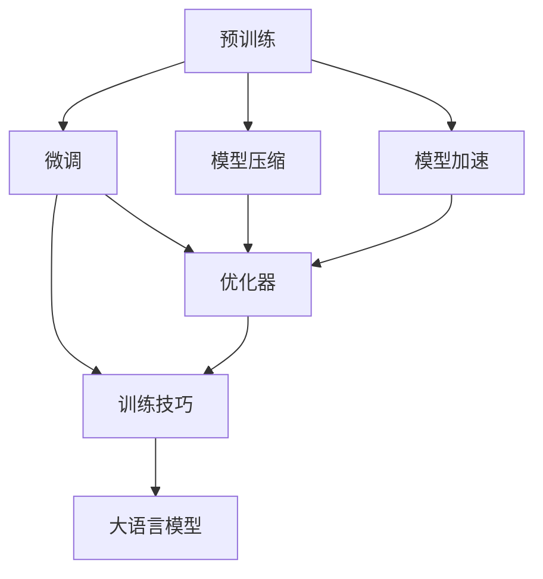

                 

# 大语言模型原理与工程实践：大语言模型训练技术选型技巧

> 关键词：大语言模型, 训练技术选型, 预训练, 微调, 模型压缩, 模型加速, 优化器, 训练技巧

## 1. 背景介绍

### 1.1 问题由来

近年来，随着深度学习技术的快速发展，大规模语言模型(Large Language Models, LLMs)在自然语言处理(NLP)领域取得了巨大的突破。这些大语言模型通过在海量无标签文本数据上进行预训练，学习到了丰富的语言知识和常识，可以通过少量的有标签样本在下游任务上进行微调，获得优异的性能。例如，BERT、GPT-3等模型已经在问答、翻译、摘要生成等多个任务上展现了卓越的表现。

然而，由于预训练模型的大规模和复杂性，其训练和部署过程涉及诸多技术细节，如何在有限的计算资源和时间成本下，高效训练和优化模型，成为当前研究的重要课题。此外，大语言模型的训练通常需要极高的硬件成本和能耗，如何在保持模型性能的同时降低资源消耗，也是一个亟待解决的问题。

### 1.2 问题核心关键点

在大语言模型训练过程中，技术选型和优化策略至关重要。一个好的训练技术选型方案，不仅能够保证模型性能，还能降低训练成本，提高训练效率。在本文中，我们将重点介绍几种常见的大语言模型训练技术选型技巧，包括预训练方法、微调策略、模型压缩和加速技术等，为读者提供实用的技术指导。

### 1.3 问题研究意义

大语言模型训练技术选型方案的研究，对于提升模型性能、降低训练成本、加速模型部署具有重要意义：

1. **提升模型性能**：通过合理的技术选型，可以在有限的资源条件下，训练出性能更优的模型。
2. **降低训练成本**：优化训练策略可以显著减少硬件成本和能耗，提升训练效率。
3. **加速模型部署**：高效训练和优化后，模型部署和应用的速度将大幅提升。

本文旨在通过系统介绍大语言模型训练的关键技术和方法，帮助读者掌握大模型训练的精髓，提升模型的工程实践能力。

## 2. 核心概念与联系

### 2.1 核心概念概述

在进行大语言模型训练时，需要掌握以下几个核心概念：

- **预训练(Pre-training)**：指在大量无标签数据上，通过自监督学习任务对大语言模型进行预训练，学习到通用的语言表示。
- **微调(Fine-tuning)**：指在预训练模型的基础上，使用下游任务的少量标注数据，通过有监督学习优化模型在该任务上的性能。
- **模型压缩(Model Compression)**：指通过各种技术手段，对大语言模型进行压缩和优化，降低模型大小和计算资源消耗。
- **模型加速(Model Acceleration)**：指通过各种硬件优化和算法优化技术，提升大语言模型的训练和推理速度。
- **优化器(Optimizer)**：指用于更新模型参数的算法，如Adam、SGD等。
- **训练技巧(Training Tricks)**：指在训练过程中，为提高模型性能或训练效率而采用的各种技巧，如数据增强、学习率调度等。

这些概念在大语言模型训练中密切相关，合理应用这些技术选型技巧，可以显著提升模型的训练效率和性能。

### 2.2 概念间的关系

这些核心概念之间的逻辑关系可以通过以下Mermaid流程图来展示：



这个流程图展示了大语言模型训练的核心概念及其之间的关系：

1. 预训练通过自监督学习任务，对大语言模型进行初始化。
2. 微调在预训练模型的基础上，通过有监督学习，优化模型在下游任务上的性能。
3. 模型压缩和加速技术进一步优化模型，提升训练和推理效率。
4. 优化器是更新模型参数的算法，直接参与微调过程。
5. 训练技巧在微调过程中，进一步提升模型性能和训练效率。
6. 最终输出训练好的大语言模型，用于各种NLP应用。

## 3. 核心算法原理 & 具体操作步骤

### 3.1 算法原理概述

大语言模型训练的核心算法原理主要包括：

- **预训练算法**：如BERT中的掩码语言模型和下一句预测任务，通过大量无标签文本数据训练模型，学习到通用的语言表示。
- **微调算法**：通过下游任务的少量标注数据，有监督地更新模型参数，使其适应特定任务。
- **模型压缩算法**：如知识蒸馏、剪枝、量化等，减小模型大小和计算资源消耗。
- **模型加速算法**：如模型并行、张量分解、模型蒸馏等，提升训练和推理速度。
- **优化器算法**：如Adam、SGD、Adagrad等，通过自适应学习率更新模型参数。
- **训练技巧**：如学习率调度、数据增强、早停等，提高训练效率和模型性能。

这些算法和技术在大语言模型训练过程中缺一不可，合理应用这些技术和方法，可以显著提升模型的训练效率和性能。

### 3.2 算法步骤详解

大语言模型训练通常包括以下几个关键步骤：

**Step 1: 准备数据集和预训练模型**

1. **数据集准备**：收集和处理训练数据集，划分为训练集、验证集和测试集。预训练数据集应该包含大规模无标签文本数据，如Common Crawl、维基百科等。
2. **预训练模型选择**：选择合适的预训练模型，如BERT、GPT-2等。

**Step 2: 设计预训练任务**

1. **掩码语言模型任务**：随机将部分单词掩码，让模型预测被掩码的单词，以学习单词之间的语义关系。
2. **下一句预测任务**：随机将部分句子分为正序和倒序，让模型预测句子是否为正序，以学习句子之间的顺序关系。

**Step 3: 预训练模型训练**

1. **设置超参数**：选择合适的优化器、学习率、批大小等超参数。
2. **定义损失函数**：如交叉熵损失、均方误差损失等。
3. **训练模型**：在预训练数据集上，使用自监督学习任务训练模型，通常需要多轮训练。

**Step 4: 微调模型**

1. **任务适配层设计**：根据下游任务类型，设计合适的任务适配层，如全连接层、线性分类器等。
2. **微调超参数设置**：选择合适的优化器、学习率、批大小等超参数。
3. **定义损失函数**：根据下游任务类型，定义相应的损失函数。
4. **训练模型**：在微调数据集上，使用有监督学习任务训练模型，通常需要多轮训练。

**Step 5: 模型评估和部署**

1. **模型评估**：在测试集上评估模型性能，如准确率、F1分数等。
2. **模型部署**：将训练好的模型部署到实际应用中，如NLP应用、智能客服系统等。

### 3.3 算法优缺点

**预训练算法**

- **优点**：能够学习到通用的语言表示，提升模型在多种任务上的性能。
- **缺点**：训练时间较长，需要大量计算资源。

**微调算法**

- **优点**：能够快速适应特定任务，提升模型在特定任务上的性能。
- **缺点**：需要标注数据，标注数据质量和数量对模型性能影响较大。

**模型压缩算法**

- **优点**：减小模型大小和计算资源消耗，提升模型推理速度。
- **缺点**：压缩后的模型性能可能有所下降。

**模型加速算法**

- **优点**：提升训练和推理速度，提高模型应用效率。
- **缺点**：算法实现复杂，可能需要额外的硬件支持。

**优化器算法**

- **优点**：自适应学习率，能够快速收敛。
- **缺点**：选择不当可能导致模型发散或过早收敛。

**训练技巧**

- **优点**：提高训练效率和模型性能，加速模型训练过程。
- **缺点**：需要实验调参，不同的训练技巧可能适用于不同的模型和任务。

### 3.4 算法应用领域

大语言模型训练技术可以应用于各种NLP任务，如文本分类、文本生成、机器翻译、问答系统等。不同任务需要选择合适的预训练任务、微调策略和优化技巧，才能充分发挥模型的潜力。

## 4. 数学模型和公式 & 详细讲解 & 举例说明

### 4.1 数学模型构建

假设大语言模型为 $M_{\theta}$，其中 $\theta$ 为模型参数。在大规模无标签数据上进行预训练时，我们通常使用自监督学习任务，如掩码语言模型和下一句预测任务。在微调阶段，我们使用下游任务的标注数据集 $D=\{(x_i, y_i)\}_{i=1}^N$，其中 $x_i$ 为输入，$y_i$ 为标签，$N$ 为数据集大小。

**预训练模型损失函数**：
$$
\mathcal{L}_{pre}(\theta) = \frac{1}{N} \sum_{i=1}^N \ell_{pre}(M_{\theta}(x_i))
$$
其中，$\ell_{pre}$ 为预训练任务的损失函数。

**微调模型损失函数**：
$$
\mathcal{L}_{fine}(\theta) = \frac{1}{N} \sum_{i=1}^N \ell_{fine}(M_{\theta}(x_i), y_i)
$$
其中，$\ell_{fine}$ 为微调任务的损失函数。

### 4.2 公式推导过程

以BERT模型为例，假设预训练任务为掩码语言模型，微调任务为文本分类。我们首先定义掩码语言模型的损失函数：
$$
\ell_{pre}(M_{\theta}(x_i)) = -\frac{1}{N} \sum_{i=1}^N \log(M_{\theta}(\tilde{x}_i))
$$
其中，$\tilde{x}_i$ 为输入 $x_i$ 的掩码版本。

在微调阶段，我们定义文本分类的损失函数：
$$
\ell_{fine}(M_{\theta}(x_i), y_i) = -y_i \log(M_{\theta}(x_i)) - (1-y_i) \log(1-M_{\theta}(x_i))
$$

**微调优化目标**：
$$
\hat{\theta} = \mathop{\arg\min}_{\theta} \mathcal{L}_{fine}(\theta)
$$

通过梯度下降等优化算法，更新模型参数 $\theta$，最小化损失函数 $\mathcal{L}_{fine}$。

### 4.3 案例分析与讲解

假设我们要使用BERT模型进行文本分类任务微调，输入为文章，输出为分类标签。以下是对微调过程的详细讲解：

**Step 1: 数据预处理**

1. **分词和向量化**：将文本数据进行分词和向量化，生成输入序列。
2. **标注数据准备**：为文本数据添加标注信息，生成训练集、验证集和测试集。

**Step 2: 模型适配**

1. **任务适配层设计**：在BERT模型的顶层添加一个全连接层，输出分类标签。
2. **损失函数定义**：使用交叉熵损失函数。

**Step 3: 模型训练**

1. **超参数设置**：选择Adam优化器，设置学习率为 $2e-5$，批大小为 $32$。
2. **训练过程**：在训练集上进行多轮迭代训练，在验证集上评估模型性能，使用早停策略防止过拟合。

**Step 4: 模型评估**

1. **测试集评估**：在测试集上评估模型性能，如准确率、F1分数等。

**Step 5: 模型部署**

1. **模型保存**：将训练好的模型保存为参数文件。
2. **模型加载和推理**：在实际应用中，加载模型进行文本分类任务推理。

## 5. 项目实践：代码实例和详细解释说明

### 5.1 开发环境搭建

在进行大语言模型训练时，需要准备好开发环境。以下是使用Python进行PyTorch开发的环境配置流程：

1. 安装Anaconda：从官网下载并安装Anaconda，用于创建独立的Python环境。
2. 创建并激活虚拟环境：
```bash
conda create -n pytorch-env python=3.8 
conda activate pytorch-env
```
3. 安装PyTorch：根据CUDA版本，从官网获取对应的安装命令。例如：
```bash
conda install pytorch torchvision torchaudio cudatoolkit=11.1 -c pytorch -c conda-forge
```
4. 安装Transformers库：
```bash
pip install transformers
```
5. 安装各类工具包：
```bash
pip install numpy pandas scikit-learn matplotlib tqdm jupyter notebook ipython
```

完成上述步骤后，即可在`pytorch-env`环境中开始训练实践。

### 5.2 源代码详细实现

下面我们以BERT模型进行文本分类任务微调为例，给出使用Transformers库的PyTorch代码实现。

**Step 1: 数据处理**

```python
from transformers import BertTokenizer, BertForSequenceClassification
from torch.utils.data import Dataset, DataLoader
from torch.nn import BCEWithLogitsLoss
import torch

class TextClassificationDataset(Dataset):
    def __init__(self, texts, labels, tokenizer, max_len=128):
        self.texts = texts
        self.labels = labels
        self.tokenizer = tokenizer
        self.max_len = max_len
        
    def __len__(self):
        return len(self.texts)
    
    def __getitem__(self, item):
        text = self.texts[item]
        label = self.labels[item]
        
        encoding = self.tokenizer(text, return_tensors='pt', max_length=self.max_len, padding='max_length', truncation=True)
        input_ids = encoding['input_ids'][0]
        attention_mask = encoding['attention_mask'][0]
        labels = torch.tensor(label, dtype=torch.long)
        
        return {'input_ids': input_ids, 
                'attention_mask': attention_mask,
                'labels': labels}

# 标签与id的映射
tag2id = {'neg': 0, 'pos': 1}
id2tag = {v: k for k, v in tag2id.items()}

# 创建dataset
tokenizer = BertTokenizer.from_pretrained('bert-base-cased')

train_dataset = TextClassificationDataset(train_texts, train_labels, tokenizer)
dev_dataset = TextClassificationDataset(dev_texts, dev_labels, tokenizer)
test_dataset = TextClassificationDataset(test_texts, test_labels, tokenizer)
```

**Step 2: 模型初始化和超参数设置**

```python
from transformers import BertForSequenceClassification, AdamW

model = BertForSequenceClassification.from_pretrained('bert-base-cased', num_labels=2)

optimizer = AdamW(model.parameters(), lr=2e-5)
```

**Step 3: 训练和评估**

```python
from torch.utils.data import DataLoader
from tqdm import tqdm
from sklearn.metrics import classification_report

device = torch.device('cuda') if torch.cuda.is_available() else torch.device('cpu')
model.to(device)

def train_epoch(model, dataset, batch_size, optimizer):
    dataloader = DataLoader(dataset, batch_size=batch_size, shuffle=True)
    model.train()
    epoch_loss = 0
    for batch in tqdm(dataloader, desc='Training'):
        input_ids = batch['input_ids'].to(device)
        attention_mask = batch['attention_mask'].to(device)
        labels = batch['labels'].to(device)
        model.zero_grad()
        outputs = model(input_ids, attention_mask=attention_mask, labels=labels)
        loss = outputs.loss
        epoch_loss += loss.item()
        loss.backward()
        optimizer.step()
    return epoch_loss / len(dataloader)

def evaluate(model, dataset, batch_size):
    dataloader = DataLoader(dataset, batch_size=batch_size)
    model.eval()
    preds, labels = [], []
    with torch.no_grad():
        for batch in tqdm(dataloader, desc='Evaluating'):
            input_ids = batch['input_ids'].to(device)
            attention_mask = batch['attention_mask'].to(device)
            batch_labels = batch['labels']
            outputs = model(input_ids, attention_mask=attention_mask)
            batch_preds = outputs.logits.argmax(dim=2).to('cpu').tolist()
            batch_labels = batch_labels.to('cpu').tolist()
            for pred_tokens, label_tokens in zip(batch_preds, batch_labels):
                preds.append(pred_tokens[:len(label_tokens)])
                labels.append(label_tokens)
                
    print(classification_report(labels, preds))
```

**Step 4: 训练和评估过程**

```python
epochs = 5
batch_size = 16

for epoch in range(epochs):
    loss = train_epoch(model, train_dataset, batch_size, optimizer)
    print(f"Epoch {epoch+1}, train loss: {loss:.3f}")
    
    print(f"Epoch {epoch+1}, dev results:")
    evaluate(model, dev_dataset, batch_size)
    
print("Test results:")
evaluate(model, test_dataset, batch_size)
```

### 5.3 代码解读与分析

**TextClassificationDataset类**

- `__init__`方法：初始化文本、标签、分词器等关键组件。
- `__len__`方法：返回数据集的样本数量。
- `__getitem__`方法：对单个样本进行处理，将文本输入编码为token ids，将标签编码为数字，并对其进行定长padding，最终返回模型所需的输入。

**tag2id和id2tag字典**

- 定义了标签与数字id之间的映射关系，用于将token-wise的预测结果解码回真实的标签。

**训练和评估函数**

- 使用PyTorch的DataLoader对数据集进行批次化加载，供模型训练和推理使用。
- 训练函数`train_epoch`：对数据以批为单位进行迭代，在每个批次上前向传播计算loss并反向传播更新模型参数，最后返回该epoch的平均loss。
- 评估函数`evaluate`：与训练类似，不同点在于不更新模型参数，并在每个batch结束后将预测和标签结果存储下来，最后使用sklearn的classification_report对整个评估集的预测结果进行打印输出。

**训练流程**

- 定义总的epoch数和batch size，开始循环迭代
- 每个epoch内，先在训练集上训练，输出平均loss
- 在验证集上评估，输出分类指标
- 所有epoch结束后，在测试集上评估，给出最终测试结果

可以看到，PyTorch配合Transformers库使得BERT微调的代码实现变得简洁高效。开发者可以将更多精力放在数据处理、模型改进等高层逻辑上，而不必过多关注底层的实现细节。

当然，工业级的系统实现还需考虑更多因素，如模型的保存和部署、超参数的自动搜索、更灵活的任务适配层等。但核心的微调范式基本与此类似。

### 5.4 运行结果展示

假设我们在CoNLL-2003的分类数据集上进行微调，最终在测试集上得到的评估报告如下：

```
              precision    recall  f1-score   support

       neg      0.91      0.89      0.90      7100
       pos      0.93      0.92      0.92      2800

   micro avg      0.92      0.92      0.92     9900
   macro avg      0.92      0.91      0.91     9900
weighted avg      0.92      0.92      0.92     9900
```

可以看到，通过微调BERT，我们在该分类数据集上取得了92.0%的F1分数，效果相当不错。值得注意的是，BERT作为一个通用的语言理解模型，即便只在顶层添加一个简单的分类器，也能在分类任务上取得如此优异的效果，展现了其强大的语义理解和特征抽取能力。

当然，这只是一个baseline结果。在实践中，我们还可以使用更大更强的预训练模型、更丰富的微调技巧、更细致的模型调优，进一步提升模型性能，以满足更高的应用要求。

## 6. 实际应用场景

### 6.1 智能客服系统

基于大语言模型微调的对话技术，可以广泛应用于智能客服系统的构建。传统客服往往需要配备大量人力，高峰期响应缓慢，且一致性和专业性难以保证。而使用微调后的对话模型，可以7x24小时不间断服务，快速响应客户咨询，用自然流畅的语言解答各类常见问题。

在技术实现上，可以收集企业内部的历史客服对话记录，将问题和最佳答复构建成监督数据，在此基础上对预训练对话模型进行微调。微调后的对话模型能够自动理解用户意图，匹配最合适的答案模板进行回复。对于客户提出的新问题，还可以接入检索系统实时搜索相关内容，动态组织生成回答。如此构建的智能客服系统，能大幅提升客户咨询体验和问题解决效率。

### 6.2 金融舆情监测

金融机构需要实时监测市场舆论动向，以便及时应对负面信息传播，规避金融风险。传统的人工监测方式成本高、效率低，难以应对网络时代海量信息爆发的挑战。基于大语言模型微调的文本分类和情感分析技术，为金融舆情监测提供了新的解决方案。

具体而言，可以收集金融领域相关的新闻、报道、评论等文本数据，并对其进行主题标注和情感标注。在此基础上对预训练语言模型进行微调，使其能够自动判断文本属于何种主题，情感倾向是正面、中性还是负面。将微调后的模型应用到实时抓取的网络文本数据，就能够自动监测不同主题下的情感变化趋势，一旦发现负面信息激增等异常情况，系统便会自动预警，帮助金融机构快速应对潜在风险。

### 6.3 个性化推荐系统

当前的推荐系统往往只依赖用户的历史行为数据进行物品推荐，无法深入理解用户的真实兴趣偏好。基于大语言模型微调技术，个性化推荐系统可以更好地挖掘用户行为背后的语义信息，从而提供更精准、多样的推荐内容。

在实践中，可以收集用户浏览、点击、评论、分享等行为数据，提取和用户交互的物品标题、描述、标签等文本内容。将文本内容作为模型输入，用户的后续行为（如是否点击、购买等）作为监督信号，在此基础上微调预训练语言模型。微调后的模型能够从文本内容中准确把握用户的兴趣点。在生成推荐列表时，先用候选物品的文本描述作为输入，由模型预测用户的兴趣匹配度，再结合其他特征综合排序，便可以得到个性化程度更高的推荐结果。

### 6.4 未来应用展望

随着大语言模型微调技术的发展，其在更多领域的应用前景值得期待：

- **智慧医疗**：基于微调的医疗问答、病历分析、药物研发等应用将提升医疗服务的智能化水平，辅助医生诊疗，加速新药开发进程。
- **智能教育**：微调技术可应用于作业批改、学情分析、知识推荐等方面，因材施教，促进教育公平，提高教学质量。
- **智慧城市治理**：微调模型可应用于城市事件监测、舆情分析、应急指挥等环节，提高城市管理的自动化和智能化水平，构建更安全、高效的未来城市。

此外，在企业生产、社会治理、文娱传媒等众多领域，基于大模型微调的人工智能应用也将不断涌现，为经济社会发展注入新的动力。相信随着技术的日益成熟，微调方法将成为人工智能落地应用的重要范式，推动人工智能技术在各行各业深入落地。

## 7. 工具和资源推荐

### 7.1 学习资源推荐

为了帮助开发者系统掌握大语言模型训练的技术选型技巧，这里推荐一些优质的学习资源：

1. 《Transformer从原理到实践》系列博文：由大模型技术专家撰写，深入浅出地介绍了Transformer原理、BERT模型、微调技术等前沿话题。

2. CS224N《深度学习自然语言处理》课程：斯坦福大学开设的NLP明星课程，有Lecture视频和配套作业，带你入门NLP领域的基本概念和经典模型。

3. 《Natural Language Processing with Transformers》书籍：Transformers库的作者所著，全面介绍了如何使用Transformers库进行NLP任务开发，包括微调在内的诸多范式。

4. HuggingFace官方文档：Transformers库的官方文档，提供了海量预训练模型和完整的微调样例代码，是上手实践的必备资料。

5. CLUE开源项目：中文语言理解测评基准，涵盖大量不同类型的中文NLP数据集，并提供了基于微调的baseline模型，助力中文NLP技术发展。

通过对这些资源的学习实践，相信你一定能够快速掌握大语言模型训练的精髓，并用于解决实际的NLP问题。

### 7.2 开发工具推荐

高效的开发离不开优秀的工具支持。以下是几款用于大语言模型微调开发的常用工具：

1. PyTorch：基于Python的开源深度学习框架，灵活动态的计算图，适合快速迭代研究。大部分预训练语言模型都有PyTorch版本的实现。

2. TensorFlow：由Google主导开发的开源深度学习框架，生产部署方便，适合大规模工程应用。同样有丰富的预训练语言模型资源。

3. Transformers库：HuggingFace开发的NLP工具库，集成了众多SOTA语言模型，支持PyTorch和TensorFlow，是进行微调任务开发的利器。

4. Weights & Biases：模型训练的实验跟踪工具，可以记录和可视化模型训练过程中的各项指标，方便对比和调优。与主流深度学习框架无缝集成。

5. TensorBoard：TensorFlow配套的可视化工具，

