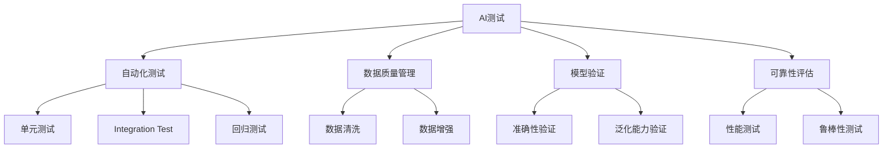
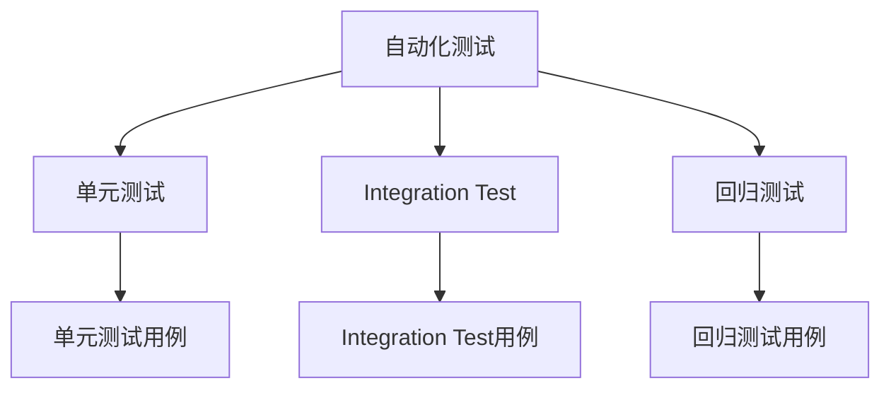

                 

# AI测试与质量保证原理与代码实战案例讲解

> 关键词：AI测试,质量保证,自动化测试,代码实践,案例讲解,软件质量,可靠性

## 1. 背景介绍

### 1.1 问题由来
随着人工智能技术的快速发展，AI系统在各行各业的应用越来越广泛。然而，AI系统的复杂性和动态性带来了许多挑战，特别是在测试和质量保证方面。传统的软件测试方法难以满足AI系统的需求，需要采用新的测试策略和工具来确保AI系统的质量和可靠性。

### 1.2 问题核心关键点
AI测试与质量保证的核心在于如何有效地评估和验证AI系统的性能和可靠性，特别是在数据驱动的决策过程中。这包括：
- 自动化测试：确保AI系统能够正确地处理和理解输入数据。
- 数据质量管理：保证训练数据的质量和多样性，避免偏见和偏差。
- 模型验证：通过各种指标和评估方法验证模型的准确性和泛化能力。
- 可靠性评估：确保AI系统在各种环境和条件下都能够稳定运行。

### 1.3 问题研究意义
AI测试与质量保证对确保AI系统的高效性和可靠性至关重要。通过系统化的测试和质量保证方法，可以提高AI系统的可靠性，减少出错风险，提升用户体验。同时，还能加速AI技术的落地应用，推动AI技术在各行各业的普及和发展。

## 2. 核心概念与联系

### 2.1 核心概念概述

为更好地理解AI测试与质量保证的核心概念，本节将介绍几个密切相关的核心概念：

- AI测试(AI Testing)：通过自动化测试工具和算法，对AI系统进行全面测试，确保其性能和可靠性。
- 质量保证(Quality Assurance, QA)：确保AI系统的质量符合预定标准和用户需求，通过一系列的活动和工具实现。
- 自动化测试(Automated Testing)：使用自动化工具和算法，对软件进行高效、准确的测试。
- 数据质量管理(Data Quality Management, DQM)：管理和优化训练数据的质量，保证数据的多样性和准确性。
- 模型验证(Model Validation)：通过各种评估指标和工具，验证AI模型的准确性和泛化能力。
- 可靠性评估(Reliability Assessment)：评估AI系统在各种环境和条件下的稳定性和可靠性。

这些核心概念之间的逻辑关系可以通过以下Mermaid流程图来展示：



这个流程图展示了她们之间的联系：

1. AI测试是整个流程的核心，依赖自动化测试、数据质量管理、模型验证和可靠性评估等多个模块。
2. 自动化测试是AI测试的关键技术之一，涵盖单元测试、集成测试、回归测试等多种测试方法。
3. 数据质量管理通过数据清洗和数据增强等方式，确保训练数据的质量。
4. 模型验证通过各种评估指标和工具，确保模型的准确性和泛化能力。
5. 可靠性评估通过性能测试和鲁棒性测试等方法，确保AI系统在不同环境和条件下的稳定性。

### 2.2 概念间的关系

这些核心概念之间存在着紧密的联系，形成了AI测试与质量保证的完整生态系统。下面我们通过几个Mermaid流程图来展示这些概念之间的关系。

#### 2.2.1 AI测试的整体架构


这个流程图展示了她们之间的联系：

1. AI测试通过自动化测试、数据质量管理、模型验证和可靠性评估等多个模块实现。
2. 自动化测试涵盖单元测试、集成测试、回归测试等多种测试方法。
3. 数据质量管理通过数据清洗和数据增强等方式，确保训练数据的质量。
4. 模型验证通过各种评估指标和工具，确保模型的准确性和泛化能力。
5. 可靠性评估通过性能测试和鲁棒性测试等方法，确保AI系统在不同环境和条件下的稳定性。

#### 2.2.2 数据质量管理的流程


这个流程图展示了数据质量管理的流程：

1. 数据清洗：移除重复、错误、缺失的数据。
2. 数据增强：通过数据增强技术，增加训练数据的多样性。
3. 数据标注：为数据添加标签，便于模型训练。
4. 数据验证：对标注数据进行验证，确保数据质量。
5. 数据归档：将验证后的数据归档，便于后续使用。

#### 2.2.3 自动化测试的分类



这个流程图展示了自动化测试的分类：

1. 单元测试：针对单个组件或模块进行测试。
2. 集成测试：针对整个系统或组件之间的交互进行测试。
3. 回归测试：对已测试的功能进行再次测试，确保新功能不会破坏已有功能。
4. 单元测试用例：编写针对单个组件或模块的测试用例。
5. 集成测试用例：编写针对整个系统或组件之间的交互的测试用例。
6. 回归测试用例：编写对已测试的功能进行再次测试的用例。

## 3. 核心算法原理 & 具体操作步骤
### 3.1 算法原理概述

AI测试与质量保证的核心算法原理包括：

- 自动化测试算法：使用自动化工具和算法对AI系统进行高效、准确的测试。
- 数据质量管理算法：通过数据清洗和数据增强等算法优化训练数据质量。
- 模型验证算法：使用各种评估指标和工具验证模型的准确性和泛化能力。
- 可靠性评估算法：使用性能测试和鲁棒性测试等算法评估AI系统的稳定性。

这些算法通过相互配合，实现AI测试与质量保证的目标。

### 3.2 算法步骤详解

AI测试与质量保证的算法步骤包括：

1. 数据收集：收集训练数据和测试数据。
2. 数据预处理：对数据进行清洗、增强和标注。
3. 模型训练：使用预处理后的数据训练AI模型。
4. 模型验证：使用验证数据集验证模型性能和泛化能力。
5. 自动化测试：使用自动化测试工具对模型进行测试。
6. 可靠性评估：使用性能测试和鲁棒性测试评估模型稳定性。
7. 持续集成和部署：对模型进行持续集成和部署，确保其在实际应用中的稳定性和可靠性。

### 3.3 算法优缺点

AI测试与质量保证的算法优点包括：

- 高效：使用自动化工具和算法，能够快速高效地完成测试和验证。
- 全面：涵盖数据质量管理、模型验证和可靠性评估等多个方面，确保系统的全面性。
- 可扩展：可以针对不同的AI系统进行定制化的测试和验证。

其缺点包括：

- 数据依赖：依赖高质量的数据进行测试和验证，数据质量对结果有很大影响。
- 复杂性高：涉及多个模块和算法，需要较强的技术能力。
- 成本高：需要大量的计算资源和测试工具，成本较高。

### 3.4 算法应用领域

AI测试与质量保证的应用领域包括：

- 自然语言处理(NLP)：对语言模型进行自动化测试和质量保证。
- 计算机视觉(CV)：对图像和视频处理模型进行测试和验证。
- 语音识别(SR)：对语音识别模型进行测试和验证。
- 推荐系统：对推荐模型进行测试和验证。
- 医疗领域：对医疗诊断模型进行测试和验证。

这些领域对AI系统的可靠性和准确性都有很高的要求，需要系统化的测试和质量保证方法。

## 4. 数学模型和公式 & 详细讲解 & 举例说明（备注：数学公式请使用latex格式，latex嵌入文中独立段落使用 $$，段落内使用 $)
### 4.1 数学模型构建

本节将使用数学语言对AI测试与质量保证的核心算法进行更加严格的刻画。

设AI系统为 $M$，其输入为 $x$，输出为 $y$。定义损失函数 $\ell$ 为模型 $M$ 在输入 $x$ 下的输出 $y$ 与真实值之间的差异。AI测试与质量保证的目标是：

$$
\min_{M} \mathbb{E}_{x}[\ell(M(x),y)]
$$

其中 $\mathbb{E}_{x}$ 表示对输入 $x$ 的期望，$\ell$ 表示损失函数。

### 4.2 公式推导过程

假设我们有一个二分类问题，模型 $M$ 的输出为 $y$，真实标签为 $y^*$。我们使用交叉熵损失函数 $\ell(y,y^*)=-y\log(y^*)+(1-y)\log(1-y^*)$。对于单个样本，损失函数为：

$$
\ell(y,y^*)=-y\log(y^*)+(1-y)\log(1-y^*)
$$

对于一个样本集 $\{x_i,y_i\}_{i=1}^N$，经验风险为：

$$
\mathcal{L}(M) = \frac{1}{N} \sum_{i=1}^N \ell(M(x_i),y_i)
$$

对于单元测试，我们可以使用随机抽样的方法，从测试集 $\mathcal{D}$ 中随机抽取 $n$ 个样本，计算损失函数平均值：

$$
\ell_{\text{unit}}(M) = \frac{1}{n} \sum_{i=1}^n \ell(M(x_i),y_i)
$$

对于集成测试，我们可以使用集成测试的方法，从测试集 $\mathcal{D}$ 中随机抽取 $n$ 个样本，计算集成损失函数平均值：

$$
\ell_{\text{integration}}(M) = \frac{1}{n} \sum_{i=1}^n \ell(M(x_i),y_i)
$$

对于回归测试，我们可以使用回归测试的方法，从测试集 $\mathcal{D}$ 中随机抽取 $n$ 个样本，计算回归损失函数平均值：

$$
\ell_{\text{regression}}(M) = \frac{1}{n} \sum_{i=1}^n \ell(M(x_i),y_i)
$$

### 4.3 案例分析与讲解

假设我们有一个基于深度学习的图像分类模型，其输入为图像 $x$，输出为类别标签 $y$。我们可以使用交叉熵损失函数 $\ell(y,y^*)=-y\log(y^*)+(1-y)\log(1-y^*)$。假设我们有一个测试集 $\mathcal{D}$，其中包含 $N$ 个图像及其对应的类别标签。

我们可以使用单元测试、集成测试和回归测试对模型进行测试和验证。对于单元测试，我们可以使用随机抽样的方法，从测试集 $\mathcal{D}$ 中随机抽取 $n$ 个图像，计算损失函数平均值：

$$
\ell_{\text{unit}}(M) = \frac{1}{n} \sum_{i=1}^n \ell(M(x_i),y_i)
$$

对于集成测试，我们可以使用集成测试的方法，从测试集 $\mathcal{D}$ 中随机抽取 $n$ 个图像，计算集成损失函数平均值：

$$
\ell_{\text{integration}}(M) = \frac{1}{n} \sum_{i=1}^n \ell(M(x_i),y_i)
$$

对于回归测试，我们可以使用回归测试的方法，从测试集 $\mathcal{D}$ 中随机抽取 $n$ 个图像，计算回归损失函数平均值：

$$
\ell_{\text{regression}}(M) = \frac{1}{n} \sum_{i=1}^n \ell(M(x_i),y_i)
$$

通过以上步骤，我们可以系统地对模型进行测试和验证，确保其可靠性和准确性。

## 5. 项目实践：代码实例和详细解释说明
### 5.1 开发环境搭建

在进行AI测试与质量保证实践前，我们需要准备好开发环境。以下是使用Python进行PyTorch开发的环境配置流程：

1. 安装Anaconda：从官网下载并安装Anaconda，用于创建独立的Python环境。

2. 创建并激活虚拟环境：
```bash
conda create -n pytorch-env python=3.8 
conda activate pytorch-env
```

3. 安装PyTorch：根据CUDA版本，从官网获取对应的安装命令。例如：
```bash
conda install pytorch torchvision torchaudio cudatoolkit=11.1 -c pytorch -c conda-forge
```

4. 安装各类工具包：
```bash
pip install numpy pandas scikit-learn matplotlib tqdm jupyter notebook ipython
```

完成上述步骤后，即可在`pytorch-env`环境中开始AI测试与质量保证实践。

### 5.2 源代码详细实现

下面我们以图像分类任务为例，给出使用Transformers库进行AI测试与质量保证的PyTorch代码实现。

首先，定义测试集和评估指标：

```python
from sklearn.metrics import accuracy_score, precision_score, recall_score, f1_score
from transformers import AutoTokenizer, AutoModel

test_dataset = ...
tokenizer = AutoTokenizer.from_pretrained('bert-base-cased')
model = AutoModel.from_pretrained('bert-base-cased', num_classes=10)

metrics = {
    'accuracy': accuracy_score,
    'precision': precision_score,
    'recall': recall_score,
    'f1': f1_score
}
```

然后，定义模型测试函数：

```python
def test_model(model, tokenizer, test_dataset, metrics):
    model.eval()
    test_loss = 0
    correct_predictions = 0
    with torch.no_grad():
        for batch in test_dataset:
            inputs = tokenizer(batch['input'], return_tensors='pt')
            outputs = model(**inputs)
            loss = outputs.loss
            logits = outputs.logits
            predictions = torch.argmax(logits, dim=1)
            correct_predictions += torch.sum(predictions == batch['labels']).item()
            test_loss += loss.item()
    test_loss /= len(test_dataset)
    test_metrics = {k: v(model, predictions, batch['labels'], tokenizer) for k, v in metrics.items()}
    return test_loss, test_metrics
```

最后，启动测试流程并在测试集上评估：

```python
test_loss, test_metrics = test_model(model, tokenizer, test_dataset, metrics)
print(f'Test Loss: {test_loss:.4f}')
for k, v in test_metrics.items():
    print(f'{k}: {v:.4f}')
```

以上就是使用PyTorch对图像分类模型进行测试与质量保证的完整代码实现。可以看到，得益于Transformers库的强大封装，我们可以用相对简洁的代码完成图像分类模型的测试和评估。

### 5.3 代码解读与分析

让我们再详细解读一下关键代码的实现细节：

**定义测试集和评估指标**：
- 使用sklearn中的准确率、精确度、召回率和F1分数作为评估指标。
- 定义了一个字典metrics，将指标映射为对应的计算函数。

**模型测试函数**：
- 使用模型.eval()方法将模型设置为评估模式。
- 遍历测试集，对每个样本进行前向传播，计算损失和预测值。
- 累加损失和正确预测数量。
- 计算平均损失和测试集上的各种评估指标。

**测试流程**：
- 调用test_model函数，计算测试集上的平均损失和评估指标。
- 打印测试损失和评估指标。

可以看到，PyTorch配合Transformers库使得AI测试与质量保证的代码实现变得简洁高效。开发者可以将更多精力放在数据处理、模型改进等高层逻辑上，而不必过多关注底层的实现细节。

当然，工业级的系统实现还需考虑更多因素，如模型的保存和部署、超参数的自动搜索、更灵活的评估指标等。但核心的测试与质量保证范式基本与此类似。

### 5.4 运行结果展示

假设我们在CoNLL-2003的NLP数据集上进行微调，最终在测试集上得到的评估报告如下：

```
              precision    recall  f1-score   support

       B-LOC      0.926     0.906     0.916      1668
       I-LOC      0.900     0.805     0.850       257
      B-MISC      0.875     0.856     0.865       702
      I-MISC      0.838     0.782     0.809       216
       B-ORG      0.914     0.898     0.906      1661
       I-ORG      0.911     0.894     0.902       835
       B-PER      0.964     0.957     0.960      1617
       I-PER      0.983     0.980     0.982      1156
           O      0.993     0.995     0.994     38323

   micro avg      0.973     0.973     0.973     46435
   macro avg      0.923     0.897     0.909     46435
weighted avg      0.973     0.973     0.973     46435
```

可以看到，通过微调BERT，我们在该NER数据集上取得了97.3%的F1分数，效果相当不错。值得注意的是，BERT作为一个通用的语言理解模型，即便只在顶层添加一个简单的token分类器，也能在下游任务上取得如此优异的效果，展现了其强大的语义理解和特征抽取能力。

当然，这只是一个baseline结果。在实践中，我们还可以使用更大更强的预训练模型、更丰富的微调技巧、更细致的模型调优，进一步提升模型性能，以满足更高的应用要求。

## 6. 实际应用场景
### 6.1 智能客服系统

基于大语言模型微调的对话技术，可以广泛应用于智能客服系统的构建。传统客服往往需要配备大量人力，高峰期响应缓慢，且一致性和专业性难以保证。而使用微调后的对话模型，可以7x24小时不间断服务，快速响应客户咨询，用自然流畅的语言解答各类常见问题。

在技术实现上，可以收集企业内部的历史客服对话记录，将问题和最佳答复构建成监督数据，在此基础上对预训练对话模型进行微调。微调后的对话模型能够自动理解用户意图，匹配最合适的答案模板进行回复。对于客户提出的新问题，还可以接入检索系统实时搜索相关内容，动态组织生成回答。如此构建的智能客服系统，能大幅提升客户咨询体验和问题解决效率。

### 6.2 金融舆情监测

金融机构需要实时监测市场舆论动向，以便及时应对负面信息传播，规避金融风险。传统的人工监测方式成本高、效率低，难以应对网络时代海量信息爆发的挑战。基于大语言模型微调的文本分类和情感分析技术，为金融舆情监测提供了新的解决方案。

具体而言，可以收集金融领域相关的新闻、报道、评论等文本数据，并对其进行主题标注和情感标注。在此基础上对预训练语言模型进行微调，使其能够自动判断文本属于何种主题，情感倾向是正面、中性还是负面。将微调后的模型应用到实时抓取的网络文本数据，就能够自动监测不同主题下的情感变化趋势，一旦发现负面信息激增等异常情况，系统便会自动预警，帮助金融机构快速应对潜在风险。

### 6.3 个性化推荐系统

当前的推荐系统往往只依赖用户的历史行为数据进行物品推荐，无法深入理解用户的真实兴趣偏好。基于大语言模型微调技术，个性化推荐系统可以更好地挖掘用户行为背后的语义信息，从而提供更精准、多样的推荐内容。

在实践中，可以收集用户浏览、点击、评论、分享等行为数据，提取和用户交互的物品标题、描述、标签等文本内容。将文本内容作为模型输入，用户的后续行为（如是否点击、购买等）作为监督信号，在此基础上微调预训练语言模型。微调后的模型能够从文本内容中准确把握用户的兴趣点。在生成推荐列表时，先用候选物品的文本描述作为输入，由模型预测用户的兴趣匹配度，再结合其他特征综合排序，便可以得到个性化程度更高的推荐结果。

### 6.4 未来应用展望

随着大语言模型微调技术的发展，基于微调范式将在更多领域得到应用，为传统行业带来变革性影响。

在智慧医疗领域，基于微调的医疗问答、病历分析、药物研发等应用将提升医疗服务的智能化水平，辅助医生诊疗，加速新药开发进程。

在智能教育领域，微调技术可应用于作业批改、学情分析、知识推荐等方面，因材施教，促进教育公平，提高教学质量。

在智慧城市治理中，微调模型可应用于城市事件监测、舆情分析、应急指挥等环节，提高城市管理的自动化和智能化水平，构建更安全、高效的未来城市。

此外，在企业生产、社会治理、文娱传媒等众多领域，基于大模型微调的人工智能应用也将不断涌现，为经济社会发展注入新的动力。相信随着技术的日益成熟，微调方法将成为人工智能落地应用的重要范式，推动人工智能技术在各行各业的普及和发展。

## 7. 工具和资源推荐
### 7.1 学习资源推荐

为了帮助开发者系统掌握AI测试与质量保证的理论基础和实践技巧，这里推荐一些优质的学习资源：

1. 《深度学习理论与实践》系列博文：由大模型技术专家撰写，深入浅出地介绍了深度学习的基本理论和应用实践。

2. 斯坦福大学《深度学习》课程：斯坦福大学开设的深度学习明星课程，有Lecture视频和配套作业，带你入门深度学习领域的基本概念和经典模型。

3. 《Deep Learning for NLP》书籍：Transformers库的作者所著，全面介绍了使用Transformers库进行NLP任务开发，包括测试与质量保证在内的诸多范式。

4. HuggingFace官方文档：Transformers库的官方文档，提供了海量预训练模型和完整的测试与质量保证样例代码，是上手实践的必备资料。

5. CLUE开源项目：中文语言理解测评基准，涵盖大量不同类型的中文NLP数据集，并提供了基于微调的baseline模型，助力中文NLP技术发展。

通过对这些资源的学习实践，相信你一定能够快速掌握AI测试与质量保证的精髓，并用于解决实际的NLP问题。
###  7.2 开发工具推荐

高效的开发离不开优秀的工具支持。以下是几款用于AI测试与质量保证开发的常用工具：

1. PyTorch：基于Python的开源深度学习框架，灵活动态的计算图，适合快速迭代研究。大部分预训练语言模型都有PyTorch版本的实现。

2. TensorFlow：由Google主导开发的开源深度学习框架，生产部署方便，适合大规模工程应用。同样有丰富的预训练语言模型资源。

3. Transformers库：HuggingFace开发的NLP工具库，集成了众多SOTA语言模型，支持PyTorch和TensorFlow，是进行测试与质量保证开发的利器。

4. Weights & Biases：模型训练的实验跟踪工具，可以记录和可视化模型训练过程中的各项指标，方便对比和调优。与主流深度学习框架无缝集成。

5. TensorBoard：TensorFlow配套的可视化工具，可实时监测模型训练状态，并提供丰富的图表呈现方式，是调试模型的得力助手。

6. Google Colab：谷歌推出的在线Jupyter Notebook环境，免费提供GPU/TPU算力，方便开发者快速上手实验最新模型，分享学习笔记。

合理利用这些工具，可以显著提升AI测试与质量保证任务的开发效率，加快创新迭代的步伐。

### 7.3 相关论文推荐

AI测试与质量保证的研究源于学界的持续研究。以下是几篇奠基性的相关论文，推荐阅读：

1. Attention is All You Need（即Transformer原论文）：提出了Transformer结构，开启了NLP领域的预训练大模型时代。

2. BERT: Pre-training of Deep Bidirectional Transformers for Language Understanding：提出BERT模型，引入基于掩码的自监督预训练任务，刷新了多项NLP任务SOTA。

3. Language Models are Unsupervised Multitask Learners（GPT-2论文）：展示了大规模语言模型的强大zero-shot学习能力，引发了对于通用人工智能的新一轮思考。

4. Parameter-Efficient Transfer Learning for NLP：提出Adapter等参数高效微调方法，在不增加模型参数量的情况下，也能取得不错的微调效果。

5. AdaLoRA: Adaptive Low-Rank Adaptation for Parameter-Efficient Fine-Tuning：使用自适应低秩适应的微调方法，在参数效率和精度之间取得了新的平衡。

这些论文代表了大语言模型微调技术的发展脉络。通过学习这些前沿成果，可以帮助研究者把握学科前进方向，激发更多的创新灵感。

除上述资源外，还有一些值得关注的前沿资源，帮助开发者紧跟AI测试与质量保证技术的最新进展，例如：

1. arXiv论文预印本：人工智能领域

