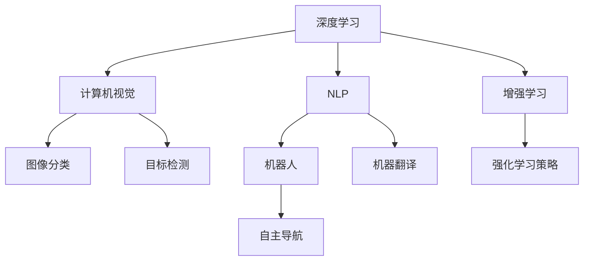

                 

# AI领域的独特时刻与未来发展

## 1. 背景介绍

### 1.1 问题由来

人工智能(AI)是21世纪最引人注目的技术之一，其影响力已经渗透到生活的方方面面。从深度学习、自然语言处理到机器视觉、机器人，AI技术的应用和发展成为了科技创新的重要驱动力。回顾AI领域的发展历程，我们可以找到几个关键的时刻，这些时刻不仅标志着技术的突破，也塑造了AI领域的未来方向。

## 2. 核心概念与联系

### 2.1 核心概念概述

为了深入理解AI领域的独特时刻与未来发展，我们先介绍几个核心的概念：

- **深度学习**：基于人工神经网络的一种机器学习方法，通过多层非线性变换，可以处理复杂的非线性问题。
- **自然语言处理(NLP)**：涉及计算机与人类语言交互的技术，包括文本理解、生成、翻译等。
- **计算机视觉(CV)**：使计算机能够“看”和理解图像和视频的技术，涉及特征提取、模式识别等。
- **机器人**：融合计算机视觉、自然语言处理、控制技术等多领域的智能系统，可以执行复杂的任务。
- **增强学习(Reinforcement Learning, RL)**：通过智能体与环境的交互，逐步优化决策策略的方法。

这些核心概念构成了AI领域的技术基础，在实际应用中常常需要综合运用。

### 2.2 概念间的关系

这些核心概念之间的关系可以通过以下Mermaid流程图来展示：



这个流程图展示了AI核心技术间的相互作用和关联，每个技术领域都通过特定的应用场景，与其他技术进行交互和融合。

## 3. 核心算法原理 & 具体操作步骤

### 3.1 算法原理概述

AI的核心算法和模型经过了多年的发展，形成了许多具有影响力的理论和模型。以下是一些核心算法的原理概述：

- **深度神经网络**：通过多层非线性变换，可以捕捉输入数据中的复杂特征，适用于图像分类、语音识别、自然语言处理等任务。
- **卷积神经网络(CNN)**：特别适用于图像处理，通过卷积操作捕捉局部特征，再通过池化操作进行特征压缩。
- **循环神经网络(RNN)**：适用于序列数据，如自然语言和语音，能够处理变长序列，但容易出现梯度消失和爆炸问题。
- **长短时记忆网络(LSTM)**：RNN的改进版本，通过门控机制解决了梯度消失问题，适用于文本生成、语音合成等任务。
- **生成对抗网络(GAN)**：通过生成器和判别器的对抗训练，生成逼真、高质量的图像和音频。
- **强化学习**：通过与环境的交互，智能体在多次试验中逐步优化策略，适用于游戏、机器人控制等任务。

### 3.2 算法步骤详解

以深度神经网络为例，其训练过程一般包括数据预处理、模型搭建、损失函数定义、优化器选择、训练迭代等步骤。

1. **数据预处理**：将原始数据转换为模型可以处理的格式，如将图像数据标准化，将文本数据分词和编码。
2. **模型搭建**：选择合适的网络结构，如卷积神经网络、循环神经网络等，并设置各层的参数。
3. **损失函数定义**：根据具体任务，选择合适的损失函数，如均方误差、交叉熵等。
4. **优化器选择**：选择适合的优化器，如SGD、Adam等，并设置学习率。
5. **训练迭代**：使用优化器更新模型参数，最小化损失函数，重复迭代直至收敛。

### 3.3 算法优缺点

深度学习模型的优点在于其强大的表达能力，能够处理复杂的非线性关系。但其缺点也显而易见：

- **计算资源消耗大**：深度神经网络通常需要大量的训练数据和计算资源，训练时间较长。
- **过拟合风险高**：模型参数过多，容易在训练数据上过拟合，导致泛化能力差。
- **可解释性差**：深度神经网络往往被视为“黑盒”，难以解释其内部决策逻辑。

### 3.4 算法应用领域

深度学习模型在多个领域得到了广泛应用，以下是一些典型的应用场景：

- **图像分类**：如ImageNet比赛中的AlexNet、ResNet等模型，通过卷积操作识别图像中的对象。
- **语音识别**：如Google的WaveNet，通过卷积和循环神经网络实现端到端的语音识别。
- **自然语言处理**：如BERT、GPT等模型，通过深度学习处理文本分类、生成、翻译等任务。
- **机器翻译**：如Transformer模型，通过自注意力机制实现高质量的翻译。
- **自动驾驶**：如Yolov3，通过检测和分类算法实现道路标志识别、行人检测等任务。
- **游戏AI**：如AlphaGo，通过增强学习实现复杂的棋类游戏。

## 4. 数学模型和公式 & 详细讲解 & 举例说明

### 4.1 数学模型构建

以图像分类任务为例，常见的深度神经网络模型可以表示为：

$$
y = f(x; \theta)
$$

其中，$x$ 表示输入的图像数据，$\theta$ 表示模型的参数，$f$ 表示前向传播函数。

### 4.2 公式推导过程

以CNN为例，其前向传播过程可以表示为：

$$
h^{[l+1]} = \sigma(W^{[l+1]} h^{[l]} + b^{[l+1]})
$$

其中，$h^{[l]}$ 表示第$l$层的输入，$h^{[l+1]}$ 表示第$l+1$层的输出，$\sigma$ 表示激活函数，$W^{[l+1]}$ 表示第$l+1$层的权重矩阵，$b^{[l+1]}$ 表示第$l+1$层的偏置向量。

### 4.3 案例分析与讲解

以ImageNet比赛中的AlexNet为例，其网络结构由多个卷积层、池化层和全连接层组成，通过卷积和池化操作捕捉局部特征，通过全连接层进行分类。

## 5. 项目实践：代码实例和详细解释说明

### 5.1 开发环境搭建

进行深度学习项目开发时，我们需要搭建合适的开发环境。以下是一个基于Python的深度学习开发环境配置流程：

1. **安装Python**：确保Python版本为3.6以上，可以通过Anaconda、pip等工具进行安装。
2. **安装依赖库**：安装常用的深度学习库，如TensorFlow、Keras、PyTorch等，可以通过pip或conda进行安装。
3. **设置环境变量**：在开发环境中设置必要的路径和库，确保导入库时能够正常运行。

### 5.2 源代码详细实现

以TensorFlow为例，实现一个简单的图像分类模型：

```python
import tensorflow as tf
from tensorflow.keras import layers

model = tf.keras.Sequential([
    layers.Conv2D(32, (3, 3), activation='relu', input_shape=(28, 28, 1)),
    layers.MaxPooling2D((2, 2)),
    layers.Flatten(),
    layers.Dense(10, activation='softmax')
])

model.compile(optimizer=tf.keras.optimizers.Adam(),
              loss=tf.keras.losses.SparseCategoricalCrossentropy(from_logits=True),
              metrics=['accuracy'])
```

### 5.3 代码解读与分析

- **Sequential模型**：通过添加多个层，构建一个简单的神经网络模型。
- **Conv2D层**：使用卷积操作捕捉图像局部特征，参数可调。
- **MaxPooling2D层**：通过池化操作减少特征数量，提高模型效率。
- **Flatten层**：将二维特征图展开为一维向量，送入全连接层。
- **Dense层**：全连接层，将特征映射到10个类别的概率分布。
- **模型编译**：设置优化器、损失函数和评估指标，准备训练模型。

### 5.4 运行结果展示

训练模型后，使用测试集进行评估：

```python
test_loss, test_acc = model.evaluate(test_images, test_labels, verbose=2)
print('Test accuracy:', test_acc)
```

## 6. 实际应用场景

### 6.1 医疗影像分析

医疗影像分析是AI在医疗领域的重要应用之一。通过深度学习模型，可以对X光片、CT扫描等影像数据进行自动诊断，提高诊断效率和准确率。

以肺结节检测为例，可以使用卷积神经网络对肺部CT影像进行分类，识别出可能存在的结节，辅助医生进行诊断。

### 6.2 智能推荐系统

智能推荐系统已经广泛应用于电商、社交媒体等平台，通过深度学习模型，可以根据用户的历史行为和兴趣，推荐个性化的商品或内容。

以电商推荐为例，可以使用协同过滤、矩阵分解等算法，结合深度神经网络，进行精准推荐，提升用户体验和平台粘性。

### 6.3 自动驾驶

自动驾驶技术是AI在智能交通领域的重要应用。通过计算机视觉、自然语言处理、增强学习等多技术融合，可以实现自主导航和决策。

以自动驾驶汽车为例，可以使用卷积神经网络进行道路标志识别、行人检测等任务，结合路径规划和控制算法，实现自动驾驶。

### 6.4 未来应用展望

未来，AI技术将进一步渗透到更多领域，为人类社会带来更多变革：

- **智慧城市**：通过AI技术，可以实现交通管理、智能安防、环境监测等，提升城市运行效率和安全水平。
- **工业制造**：通过AI技术，可以实现设备监控、质量检测、供应链管理等，提升生产效率和质量。
- **教育领域**：通过AI技术，可以实现个性化教学、智能评估、学习内容推荐等，提升教育质量和学习效果。
- **金融科技**：通过AI技术，可以实现风险评估、客户服务、投资决策等，提升金融服务效率和质量。
- **环境保护**：通过AI技术，可以实现生态监测、资源管理、灾害预警等，保护生态环境和可持续发展。

## 7. 工具和资源推荐

### 7.1 学习资源推荐

- **深度学习与数据分析**：吴恩达Coursera课程，涵盖深度学习、机器学习、数据科学等基础和高级内容。
- **自然语言处理**：斯坦福大学CS224n课程，涵盖NLP的算法和应用，实战性强。
- **计算机视觉**：吴恩达Coursera课程、Fast.ai课程，涵盖图像分类、目标检测、生成对抗网络等。
- **增强学习**：DeepMind OpenSausage教程，涵盖Reinforcement Learning的基础和前沿技术。
- **TensorFlow官方文档**：详细介绍TensorFlow的API和应用场景，适合开发者参考。
- **Keras官方文档**：详细介绍Keras的API和应用场景，适合开发者参考。
- **PyTorch官方文档**：详细介绍PyTorch的API和应用场景，适合开发者参考。

### 7.2 开发工具推荐

- **TensorFlow**：Google开发的深度学习框架，具有强大的计算能力和丰富的API。
- **Keras**：基于TensorFlow的高级API，易于上手，适合初学者使用。
- **PyTorch**：Facebook开发的深度学习框架，具有动态图和静态图两种计算图，适合研究型开发者使用。
- **Jupyter Notebook**：开源的交互式笔记本，适合数据分析和机器学习任务。
- **Google Colab**：免费的GPU计算资源，适合快速验证和实验。
- **Visual Studio Code**：流行的开发工具，支持多种编程语言和扩展插件。

### 7.3 相关论文推荐

- **深度学习在计算机视觉中的应用**：P. Viola和M. Jones，介绍深度学习在计算机视觉中的基本原理和应用。
- **自然语言处理中的深度学习**：Y. Bengio等，介绍深度学习在NLP中的基本原理和应用。
- **生成对抗网络**：I. Goodfellow等，介绍生成对抗网络的原理和应用。
- **强化学习**：R. Sutton和A. Barto，介绍强化学习的原理和应用。
- **卷积神经网络**：G. Hinton等，介绍卷积神经网络的原理和应用。
- **循环神经网络**：S. Hochreiter和J. Schmidhuber，介绍循环神经网络的原理和应用。
- **自然语言处理中的预训练模型**：A. Radford等，介绍BERT、GPT等预训练模型的原理和应用。

## 8. 总结：未来发展趋势与挑战

### 8.1 研究成果总结

深度学习技术在过去十年取得了显著的进展，推动了AI领域的广泛应用。以下是一些主要的研究成果：

- **深度神经网络**：通过多层非线性变换，实现了复杂的图像分类、语音识别、自然语言处理等任务。
- **卷积神经网络**：特别适用于图像处理，通过卷积操作捕捉局部特征。
- **循环神经网络**：适用于序列数据，如自然语言和语音，能够处理变长序列，但容易出现梯度消失和爆炸问题。
- **长短时记忆网络**：RNN的改进版本，通过门控机制解决了梯度消失问题，适用于文本生成、语音合成等任务。
- **生成对抗网络**：通过生成器和判别器的对抗训练，生成逼真、高质量的图像和音频。
- **增强学习**：通过与环境的交互，智能体在多次试验中逐步优化策略，适用于游戏、机器人控制等任务。

### 8.2 未来发展趋势

未来，AI领域将呈现以下几个发展趋势：

- **多模态学习**：将视觉、语音、文本等多种模态信息融合，实现更加全面的智能感知。
- **自监督学习**：通过未标注数据进行预训练，提高模型泛化能力和数据利用效率。
- **迁移学习**：通过在多个任务间共享模型参数，提高模型适应性和泛化能力。
- **强化学习**：通过智能体与环境的交互，优化决策策略，实现更智能的自动驾驶、机器人控制等。
- **联邦学习**：通过分布式计算，保护数据隐私，实现高效的数据协同学习。
- **边缘计算**：通过在本地设备上运行AI算法，提升计算效率和响应速度。

### 8.3 面临的挑战

尽管AI技术取得了显著进展，但在实现更加智能、可靠的应用时，仍面临以下挑战：

- **数据隐私和安全**：如何在保证数据隐私和安全的前提下，进行高效的数据收集和处理。
- **模型公平性和鲁棒性**：如何避免模型偏见和过拟合，提高模型鲁棒性和公平性。
- **计算资源消耗**：如何在资源受限的情况下，提高模型训练和推理效率。
- **模型可解释性**：如何赋予模型更好的可解释性，提高模型的可信度和可用性。
- **跨领域知识整合**：如何将跨领域知识与AI模型进行有效整合，提升模型的知识整合能力。

### 8.4 研究展望

未来的研究需要从以下几个方向进行突破：

- **数据隐私保护**：研究如何在保证数据隐私和安全的前提下，进行高效的数据协同学习和模型训练。
- **模型公平性和鲁棒性**：研究如何避免模型偏见和过拟合，提高模型鲁棒性和公平性。
- **计算资源优化**：研究如何在资源受限的情况下，提高模型训练和推理效率，降低计算成本。
- **模型可解释性**：研究如何赋予模型更好的可解释性，提高模型的可信度和可用性。
- **跨领域知识整合**：研究如何将跨领域知识与AI模型进行有效整合，提升模型的知识整合能力。
- **多模态学习**：研究如何将视觉、语音、文本等多种模态信息融合，实现更加全面的智能感知。
- **自监督学习**：研究如何通过未标注数据进行预训练，提高模型泛化能力和数据利用效率。
- **迁移学习**：研究如何在多个任务间共享模型参数，提高模型适应性和泛化能力。
- **增强学习**：研究通过智能体与环境的交互，优化决策策略，实现更智能的自动驾驶、机器人控制等。
- **联邦学习**：研究通过分布式计算，保护数据隐私，实现高效的数据协同学习。
- **边缘计算**：研究通过在本地设备上运行AI算法，提升计算效率和响应速度。

## 9. 附录：常见问题与解答

**Q1: 深度学习与传统机器学习有什么区别？**

A: 深度学习与传统机器学习的主要区别在于模型的复杂度和数据驱动的强度。深度学习使用神经网络，具有多层非线性变换能力，能够处理复杂的非线性关系。而传统机器学习通常使用统计模型，如线性回归、决策树等，无法处理复杂的非线性关系。

**Q2: 深度学习模型容易过拟合，如何解决这一问题？**

A: 深度学习模型容易过拟合，可以通过以下方法解决：
- 数据增强：通过旋转、裁剪等方式增加数据量，减少过拟合。
- 正则化：使用L2正则、Dropout等方式，防止模型过拟合。
- 早停法：通过监控验证集性能，提前停止训练，防止过拟合。
- 模型简化：减少模型层数和参数，提高泛化能力。

**Q3: 深度学习模型如何应用到实际场景中？**

A: 深度学习模型可以应用到实际场景中，具体步骤如下：
- 数据收集：收集与任务相关的数据，并进行预处理。
- 模型构建：选择合适的模型架构，并进行初始化。
- 训练模型：使用训练数据对模型进行训练，调整参数。
- 评估模型：使用测试数据对模型进行评估，判断模型性能。
- 模型应用：将模型应用到实际场景中，进行推理和预测。

**Q4: 深度学习模型的训练过程有哪些关键步骤？**

A: 深度学习模型的训练过程包括以下关键步骤：
- 数据预处理：将原始数据转换为模型可以处理的格式。
- 模型构建：选择合适的模型架构，并进行初始化。
- 损失函数定义：根据具体任务，选择合适的损失函数。
- 优化器选择：选择适合的优化器，并进行参数初始化。
- 训练迭代：使用训练数据对模型进行迭代训练，调整参数。

**Q5: 深度学习模型在实际应用中需要注意哪些问题？**

A: 深度学习模型在实际应用中需要注意以下问题：
- 数据质量：数据质量对模型训练和性能有重要影响，需要保证数据的准确性和完整性。
- 模型复杂度：模型复杂度过高，容易导致过拟合，需要进行适当简化。
- 计算资源：深度学习模型通常需要大量的计算资源，需要进行资源优化。
- 模型可解释性：深度学习模型通常被视为“黑盒”，需要进行解释和可视化。

通过这些学习资源和开发工具，相信你一定能够更好地掌握深度学习技术，并应用于实际场景中。

