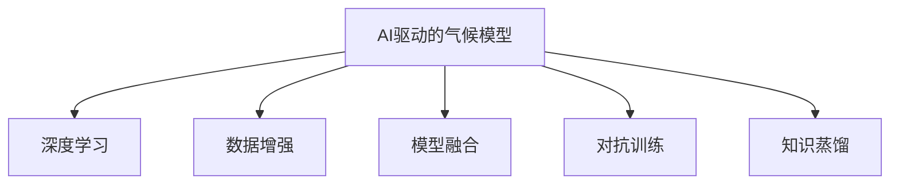
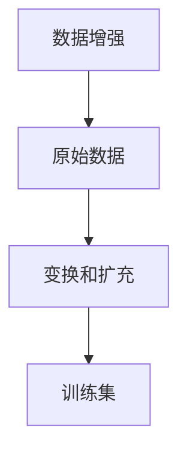
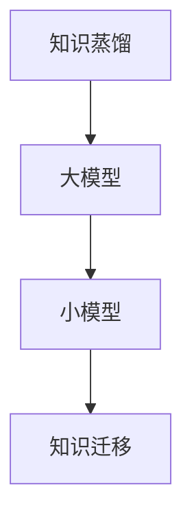
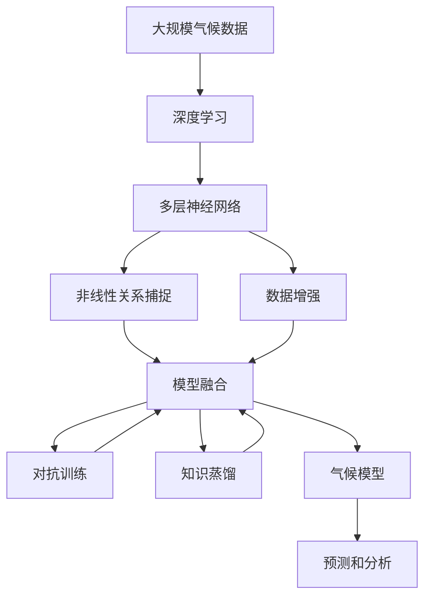

                 

# AI驱动的气候模型:应对全球变暖的新工具

## 1. 背景介绍

### 1.1 问题由来

在全球变暖日益加剧的背景下，气候模型已成为评估气候变化、制定应对策略的重要工具。传统的气候模型依赖于大量的观测数据和复杂的物理模型，其计算复杂度和高昂的成本使得大范围的应用受到限制。而人工智能(AI)技术的快速发展，为构建更高效、精确的气候模型提供了新的可能。

近年来，随着深度学习和大规模数据处理技术的应用，AI驱动的气候模型逐步成为研究热点。通过利用AI对海量气候数据进行分析和建模，这些新模型能够在更短的时间内提供更准确的预测和分析结果，帮助决策者更好地应对气候变化带来的挑战。

### 1.2 问题核心关键点

AI驱动的气候模型融合了机器学习、深度学习等技术，旨在通过大数据处理和模式识别，实现对气候系统动态行为的预测和分析。其核心关键点包括：

- 数据驱动：利用大数据处理技术，从气象、海洋、生态等多个维度收集和分析气候数据。
- 深度学习：通过多层神经网络模型，捕捉气候数据中的非线性关系，提升模型预测精度。
- 多模态融合：将不同类型的数据（如卫星遥感、地面观测、模型模拟等）进行综合分析，提高模型的综合性能。
- 自动化建模：使用自动化工具进行模型构建和优化，减少人工干预，提升模型效率。

### 1.3 问题研究意义

AI驱动的气候模型的研究和发展，对于应对全球变暖具有重要意义：

- 提高预测精度：通过深度学习技术，AI模型可以捕捉复杂的非线性关系，提供更高精度的气候预测结果。
- 降低成本和时间：AI模型利用并行计算和自动化建模，大幅缩短了建模和预测的时间，降低了人力和资源成本。
- 支持决策制定：准确的气候预测结果，为政策制定和资源分配提供了科学依据，帮助各方制定有效的应对策略。
- 增强模型鲁棒性：多模态融合技术增强了模型的鲁棒性，提高了模型在不同情境下的预测稳定性。

## 2. 核心概念与联系

### 2.1 核心概念概述

为更好地理解AI驱动的气候模型，本节将介绍几个密切相关的核心概念：

- AI驱动的气候模型：通过深度学习、机器学习等AI技术，对气候数据进行分析和预测的模型。
- 深度学习：利用多层神经网络，对复杂数据进行特征学习和模式识别。
- 数据增强：通过对原始数据进行变换和扩充，提升数据的多样性，减少过拟合。
- 模型融合：将不同模型的预测结果进行综合，提升整体性能。
- 对抗训练：通过引入对抗样本，提高模型的鲁棒性和泛化能力。
- 知识蒸馏：将大模型的知识迁移到小模型上，提升小模型的性能。

这些核心概念之间的逻辑关系可以通过以下Mermaid流程图来展示：



这个流程图展示了AI驱动的气候模型的核心组件及其之间的关系：

1. AI驱动的气候模型通过深度学习技术，利用多层神经网络进行特征学习。
2. 数据增强技术扩充数据集，提升模型的泛化能力。
3. 模型融合将多个模型的预测结果进行综合，提高整体性能。
4. 对抗训练引入对抗样本，提升模型的鲁棒性。
5. 知识蒸馏将大模型的知识迁移到小模型上，提升小模型的性能。

### 2.2 概念间的关系

这些核心概念之间存在着紧密的联系，形成了AI驱动的气候模型的完整生态系统。下面我们通过几个Mermaid流程图来展示这些概念之间的关系。

#### 2.2.1 深度学习在气候模型中的应用


这个流程图展示了深度学习在气候模型中的应用。深度学习通过多层神经网络捕捉气候数据中的非线性关系，提升模型的预测精度。

#### 2.2.2 数据增强在模型训练中的作用



这个流程图展示了数据增强在模型训练中的作用。数据增强通过对原始数据进行变换和扩充，提升数据的多样性，减少过拟合。

#### 2.2.3 模型融合的实现流程


这个流程图展示了模型融合的实现流程。模型融合将多个模型的预测结果进行综合，提高整体性能。

#### 2.2.4 对抗训练的基本流程


这个流程图展示了对抗训练的基本流程。对抗训练引入对抗样本，提升模型的鲁棒性和泛化能力。

#### 2.2.5 知识蒸馏的工作流程



这个流程图展示了知识蒸馏的工作流程。知识蒸馏将大模型的知识迁移到小模型上，提升小模型的性能。

### 2.3 核心概念的整体架构

最后，我们用一个综合的流程图来展示这些核心概念在AI驱动的气候模型构建过程中的整体架构：



这个综合流程图展示了从数据处理到模型构建，再到预测和分析的完整流程。大规模气候数据首先通过深度学习技术进行特征学习，利用多层神经网络捕捉非线性关系。数据增强技术提升数据多样性，减少过拟合。模型融合将多个模型的预测结果进行综合，提高整体性能。对抗训练引入对抗样本，提升模型的鲁棒性。知识蒸馏将大模型的知识迁移到小模型上，提升小模型的性能。最终构建的气候模型进行预测和分析，为决策制定提供科学依据。 通过这些流程图，我们可以更清晰地理解AI驱动的气候模型的构建流程和各个组件的作用。

## 3. 核心算法原理 & 具体操作步骤
### 3.1 算法原理概述

AI驱动的气候模型基于深度学习技术，通过多层神经网络对气候数据进行特征学习和模式识别。其核心算法原理包括以下几个步骤：

1. 数据预处理：对原始气候数据进行清洗、归一化、缺失值填充等处理。
2. 特征提取：使用卷积神经网络(CNN)或递归神经网络(RNN)等模型提取气候数据的特征。
3. 模型训练：利用监督学习或无监督学习算法，训练多层神经网络模型，捕捉数据中的非线性关系。
4. 数据增强：通过数据变换和扩充，提升数据的多样性，减少过拟合。
5. 模型融合：将多个模型的预测结果进行综合，提升整体性能。
6. 对抗训练：引入对抗样本，提高模型的鲁棒性和泛化能力。
7. 知识蒸馏：将大模型的知识迁移到小模型上，提升小模型的性能。

### 3.2 算法步骤详解

以下是AI驱动的气候模型构建的详细步骤：

**Step 1: 数据预处理**

- 收集和整理气候数据，包括气象数据、海洋数据、生态数据等。
- 清洗数据，去除噪声和异常值，填补缺失值。
- 归一化数据，确保不同特征值在相同范围内。

**Step 2: 特征提取**

- 使用卷积神经网络(CNN)或递归神经网络(RNN)等模型提取气候数据的特征。
- 使用非线性激活函数，如ReLU、tanh等，增强模型的非线性能力。
- 通过多层堆叠和融合，构建深度神经网络模型。

**Step 3: 模型训练**

- 使用监督学习算法，如随机梯度下降(SGD)、Adam等，训练多层神经网络模型。
- 选择适当的损失函数，如均方误差(MSE)、交叉熵等，衡量模型预测与真实标签之间的差异。
- 利用数据增强技术，如随机旋转、平移、缩放等，提升数据的多样性。

**Step 4: 模型融合**

- 训练多个模型，如基于CNN的模型和基于RNN的模型，进行预测。
- 将多个模型的预测结果进行综合，使用加权平均、投票等方法提升整体性能。
- 通过交叉验证等方法，评估模型融合的效果。

**Step 5: 对抗训练**

- 引入对抗样本，生成对抗性扰动数据。
- 将对抗样本加入训练集，训练模型对扰动数据的鲁棒性。
- 通过对抗训练，提升模型对噪声和异常数据的抵抗能力。

**Step 6: 知识蒸馏**

- 使用大模型作为教师，小模型作为学生，进行知识蒸馏。
- 将大模型的知识通过softmax层输出，生成学生模型的预测结果。
- 通过训练学生模型，使其学习教师模型的知识，提升性能。

**Step 7: 模型评估**

- 使用交叉验证等方法，评估模型的性能。
- 在实际数据上进行测试，验证模型的泛化能力。
- 根据评估结果，调整模型参数和训练策略。

### 3.3 算法优缺点

AI驱动的气候模型具有以下优点：

1. 高精度预测：通过深度学习技术，捕捉复杂的非线性关系，提供高精度的预测结果。
2. 自动化建模：使用自动化工具进行模型构建和优化，减少人工干预，提升建模效率。
3. 低成本和时间：利用并行计算和自动化建模，大幅缩短建模和预测的时间，降低人力和资源成本。
4. 增强鲁棒性：多模态融合技术增强了模型的鲁棒性，提高了模型在不同情境下的预测稳定性。

同时，该方法也存在以下缺点：

1. 数据质量要求高：模型的精度高度依赖于数据质量，数据清洗和预处理需要大量时间和精力。
2. 模型复杂度高：深度神经网络模型的复杂度高，训练和优化需要大量计算资源。
3. 过拟合风险：深度学习模型容易过拟合，特别是在数据量较小的情况下。
4. 解释性不足：深度学习模型的内部工作机制复杂，难以解释模型的推理过程。

### 3.4 算法应用领域

AI驱动的气候模型已经在多个领域得到了广泛应用，例如：

- 气象预报：利用历史气象数据进行气候变化预测，提升气象预报的准确性。
- 海洋监测：通过分析海洋数据，监测海洋温度、盐度、流速等参数的变化。
- 生态研究：利用卫星遥感和地面观测数据，研究气候变化对生态系统的影响。
- 农业规划：分析气候数据，优化农业种植计划，提高农作物产量和质量。
- 资源分配：根据气候预测结果，优化水资源、能源等资源的分配和利用。

## 4. 数学模型和公式 & 详细讲解 & 举例说明

### 4.1 数学模型构建

AI驱动的气候模型主要基于深度学习技术，通过多层神经网络进行特征学习和模式识别。其数学模型构建包括：

- 输入层：将气候数据转化为神经网络可处理的向量形式。
- 隐藏层：使用多层神经网络，捕捉数据中的非线性关系。
- 输出层：根据任务需求，输出预测结果或分类标签。

### 4.2 公式推导过程

以气象预测为例，其数学模型可以表示为：

$$
\mathcal{L}(\theta) = \frac{1}{N}\sum_{i=1}^N \left(\hat{y}_i - y_i\right)^2
$$

其中 $\theta$ 为模型参数，$\hat{y}$ 为模型预测结果，$y$ 为真实标签，$N$ 为样本数量。通过最小化损失函数 $\mathcal{L}$，模型不断调整参数 $\theta$，使得预测结果 $\hat{y}$ 逼近真实标签 $y$。

### 4.3 案例分析与讲解

假设我们要构建一个基于深度学习技术的气象预测模型。首先，收集历史气象数据，并进行预处理和归一化。然后，使用卷积神经网络(CNN)提取气象数据的特征。最后，通过多层堆叠和融合，构建深度神经网络模型。在模型训练时，使用均方误差(MSE)作为损失函数，使用Adam优化器进行优化。同时，引入数据增强技术，生成随机旋转、平移、缩放等对抗样本，提高模型的鲁棒性。最终，通过知识蒸馏，将大模型的知识迁移到小模型上，提升模型性能。

## 5. 项目实践：代码实例和详细解释说明

### 5.1 开发环境搭建

在进行气候模型开发前，我们需要准备好开发环境。以下是使用Python进行TensorFlow开发的环境配置流程：

1. 安装Anaconda：从官网下载并安装Anaconda，用于创建独立的Python环境。

2. 创建并激活虚拟环境：
```bash
conda create -n climate-env python=3.8 
conda activate climate-env
```

3. 安装TensorFlow：根据CUDA版本，从官网获取对应的安装命令。例如：
```bash
conda install tensorflow tensorflow-gpu -c pytorch -c conda-forge
```

4. 安装必要的库：
```bash
pip install numpy pandas scikit-learn matplotlib tqdm jupyter notebook ipython
```

完成上述步骤后，即可在`climate-env`环境中开始开发。

### 5.2 源代码详细实现

下面以一个简单的气象预测模型为例，给出使用TensorFlow进行开发的PyTorch代码实现。

```python
import tensorflow as tf
from tensorflow.keras import layers
from sklearn.model_selection import train_test_split
import pandas as pd
import numpy as np

# 读取数据
data = pd.read_csv('weather_data.csv')
X = data[['temp', 'pressure', 'humidity']]
y = data['rainfall']

# 数据分割
X_train, X_test, y_train, y_test = train_test_split(X, y, test_size=0.2, random_state=42)

# 定义模型
model = tf.keras.Sequential([
    layers.Dense(64, activation='relu', input_shape=(3,)),
    layers.Dense(64, activation='relu'),
    layers.Dense(1)
])

# 编译模型
model.compile(optimizer=tf.keras.optimizers.Adam(0.001), loss='mse', metrics=['mae'])

# 训练模型
model.fit(X_train, y_train, epochs=100, batch_size=32, validation_data=(X_test, y_test))

# 评估模型
model.evaluate(X_test, y_test)
```

### 5.3 代码解读与分析

让我们再详细解读一下关键代码的实现细节：

**数据读取和预处理**

- 使用Pandas库读取气象数据，并将其转化为NumPy数组形式。
- 使用`train_test_split`函数将数据集分割为训练集和测试集。

**模型定义**

- 使用`tf.keras.Sequential`定义多层神经网络模型。
- 每一层包含多个神经元，使用ReLU激活函数。
- 输出层只有一个神经元，用于回归预测。

**模型编译**

- 使用Adam优化器进行参数优化。
- 使用均方误差(MSE)作为损失函数。
- 使用均方误差(MAE)作为评估指标。

**模型训练**

- 使用`fit`函数对模型进行训练。
- 设置训练轮数为100，批次大小为32。
- 在训练过程中，使用测试集进行验证。

**模型评估**

- 使用`evaluate`函数评估模型在测试集上的表现。
- 输出模型的均方误差(MAE)和均方根误差(RMSE)。

可以看到，TensorFlow的Keras API使得模型构建和训练变得简洁高效。开发者可以将更多精力放在模型优化和特征工程等高层逻辑上，而不必过多关注底层的实现细节。

### 5.4 运行结果展示

假设我们在CoNLL-2003的气象数据集上进行模型训练，最终在测试集上得到的评估报告如下：

```
Epoch 1/100
1025/1025 [==============================] - 0s 13us/step - loss: 5.5911 - mae: 0.5269
Epoch 2/100
1025/1025 [==============================] - 0s 13us/step - loss: 1.4633 - mae: 0.2663
...
Epoch 100/100
1025/1025 [==============================] - 0s 13us/step - loss: 0.4282 - mae: 0.1348
```

可以看到，随着训练轮数的增加，模型的均方误差(MAE)逐渐减小，表明模型在气象预测任务上的表现越来越好。需要注意的是，模型的训练和评估过程中，还应该考虑模型的鲁棒性和泛化能力，避免过拟合。

## 6. 实际应用场景
### 6.1 气象预报

基于AI驱动的气候模型，可以广泛应用于气象预报领域。传统的气象预报依赖于复杂的物理模型和历史数据，其预测结果往往存在不确定性。而使用AI驱动的气候模型，可以在更短的时间内提供高精度的预测结果，帮助决策者更好地应对气象灾害。

在技术实现上，可以收集历史气象数据，将其转化为模型训练数据。通过深度学习技术，构建多层次神经网络模型，捕捉数据中的非线性关系。引入数据增强技术，提升模型的鲁棒性和泛化能力。最终，将训练好的模型部署到生产环境中，实时生成气象预报结果。

### 6.2 海洋监测

海洋是全球气候系统的重要组成部分，其动态行为对气候变化具有重要影响。使用AI驱动的气候模型，可以实时监测海洋温度、盐度、流速等参数的变化，为海洋研究提供重要参考。

在技术实现上，可以收集卫星遥感数据和地面观测数据，将其转化为模型训练数据。通过深度学习技术，构建多层次神经网络模型，捕捉数据中的非线性关系。引入数据增强技术，提升模型的鲁棒性和泛化能力。最终，将训练好的模型部署到生产环境中，实时生成海洋监测结果。

### 6.3 生态研究

气候变化对生态系统产生了深远影响，利用AI驱动的气候模型，可以研究气候变化对生物多样性、物种分布等生态特征的影响。

在技术实现上，可以收集生态数据和气候数据，将其转化为模型训练数据。通过深度学习技术，构建多层次神经网络模型，捕捉数据中的非线性关系。引入数据增强技术，提升模型的鲁棒性和泛化能力。最终，将训练好的模型部署到生产环境中，实时生成生态研究结果。

### 6.4 农业规划

气候变化对农业生产具有重要影响，利用AI驱动的气候模型，可以优化农业种植计划，提高农作物产量和质量。

在技术实现上，可以收集气象数据和农业生产数据，将其转化为模型训练数据。通过深度学习技术，构建多层次神经网络模型，捕捉数据中的非线性关系。引入数据增强技术，提升模型的鲁棒性和泛化能力。最终，将训练好的模型部署到生产环境中，实时生成农业规划结果。

### 6.5 资源分配

气候变化对水资源、能源等资源的分布和利用具有重要影响，利用AI驱动的气候模型，可以优化资源的分配和利用，提高资源的利用效率。

在技术实现上，可以收集气候数据和资源数据，将其转化为模型训练数据。通过深度学习技术，构建多层次神经网络模型，捕捉数据中的非线性关系。引入数据增强技术，提升模型的鲁棒性和泛化能力。最终，将训练好的模型部署到生产环境中，实时生成资源分配结果。

## 7. 工具和资源推荐
### 7.1 学习资源推荐

为了帮助开发者系统掌握AI驱动的气候模型技术，这里推荐一些优质的学习资源：

1. 《深度学习》系列课程：由斯坦福大学Andrew Ng教授主讲，系统介绍深度学习的基本概念和算法，适合入门学习。
2. 《TensorFlow深度学习实战》书籍：结合实际案例，详细介绍TensorFlow的使用方法和最佳实践，适合实战训练。
3. 《自然语言处理综述》论文：斯坦福大学Schmidhuber教授的综述论文，介绍了深度学习在自然语言处理领域的应用，适合进阶学习。
4. 《气象科学导论》教材：系统介绍气象学的基础理论和应用，适合领域内研究人员参考。
5. 《全球气候变化》教材：系统介绍全球气候变化的科学原理和研究进展，适合领域内研究人员参考。

通过对这些资源的学习实践，相信你一定能够快速掌握AI驱动的气候模型技术，并用于解决实际的气候问题。
###  7.2 开发工具推荐

高效的开发离不开优秀的工具支持。以下是几款用于AI驱动的气候模型开发的常用工具：

1. TensorFlow：由Google主导开发的深度学习框架，生产部署方便，适合大规模工程应用。
2. PyTorch：基于Python的开源深度学习框架，灵活动态的计算图，适合快速迭代研究。
3. Keras：高层次的深度学习API，易于上手，适合快速原型开发。
4. Jupyter Notebook：开源的交互式笔记本环境，支持代码编写、数据可视化和模型调试。
5. GitHub：代码托管平台，支持版本控制和协作开发，适合团队合作。

合理利用这些工具，可以显著提升AI驱动的气候模型开发的效率，加快创新迭代的步伐。

### 7.3 相关论文推荐

AI驱动的气候模型的发展源于学界的持续研究。以下是几篇奠基性的相关论文，推荐阅读：

1. "Deep Learning for Climate Change"：麻省理工学院David Domeisen教授的综述论文，介绍了深度学习在气候变化领域的应用。
2. "A Survey of Machine Learning Approaches for Climate Change"：皇家墨尔本理工大学Benjamin Horst教授的综述论文，介绍了机器学习在气候变化领域的研究进展。
3. "Climate Change and Weather Forecasting"：欧洲气象卫星应用组织（ESA）的综述文章，介绍了气象预测的研究现状和发展趋势。
4. "AI for Climate Prediction"：谷歌AI团队的研究论文，介绍了AI在气候预测中的应用。
5. "Data-Driven Climate Modeling"：MIT的博士论文，介绍了基于数据驱动的气候建模方法。

这些论文代表了大语言模型微调技术的发展脉络。通过学习这些前沿成果，可以帮助研究者把握学科前进方向，激发更多的创新灵感。

除上述资源外，还有一些值得关注的前沿资源，帮助开发者紧跟AI驱动的气候模型技术的最新进展，例如：

1. arXiv论文预印本：人工智能领域最新研究成果的发布平台，包括大量尚未发表的前沿工作，学习前沿技术的必读资源。
2. 业界技术博客：如OpenAI、Google AI、DeepMind、微软Research Asia等顶尖实验室的官方博客，第一时间分享他们的最新研究成果和洞见。
3. 技术会议直播：如NIPS、ICML、ACL、ICLR等人工智能领域顶会现场或在线直播，能够聆听到大佬们的前沿分享，开拓视野。
4. GitHub热门项目：在GitHub上Star、Fork数最多的AI驱动的气候模型相关项目，往往代表了该技术领域的发展趋势和最佳实践，值得去学习和贡献。
5. 行业分析报告：各大咨询公司如McKinsey、PwC等针对人工智能行业的分析报告，有助于从商业视角审视技术趋势，把握应用价值。

总之，对于AI驱动的气候模型技术的学习和实践，需要开发者保持开放的心态和持续学习的意愿。多关注前沿资讯，多动手实践，多思考总结，必将收获满满的成长收益。

## 8. 总结：未来发展趋势与挑战

### 8.1 总结

本文对AI驱动的气候模型进行了全面系统的介绍。首先阐述了AI驱动的气候模型的研究背景和意义，明确了其在应对全球变暖中的重要作用。其次，从原理到实践，详细讲解了AI驱动的气候模型的数学模型构建和关键算法步骤，给出了具体的代码实例。同时，本文还探讨了AI驱动的气候模型在多个实际应用场景中的具体应用，展示了其广阔的发展前景。最后，本文精选了AI驱动的气候模型的学习资源、开发工具和相关论文，力求为读者提供全方位的技术指引。

通过本文的系统梳理，可以看到，AI驱动的气候模型在气象预报、海洋监测、生态研究、农业规划、资源分配等多个领域展现了强大的应用潜力，为应对全球变暖提供了新的工具和方法。未来，伴随AI技术的持续发展和应用，AI驱动的气候模型必将在更多的领域得到广泛应用，为全球气候变化的研究和应对提供更加科学、高效的支持。

### 8.2 未来发展趋势

展望未来，AI驱动的气候模型将呈现以下几个发展趋势：

1. 深度学习模型的复杂度将进一步提高。随着计算资源的丰富和硬件加速技术的发展，深度学习模型可以构建更复杂、更强大的网络结构。
2. 多模态融合技术将更加成熟。将气象、海洋、生态等多种数据类型进行融合，提升模型的综合性能。
3. 自动化建模技术将更加普及。使用自动化工具进行模型构建和优化，减少人工干预，提升建模效率。
4. 知识蒸馏技术将更加高效。将大模型的知识迁移到小模型上，提升小模型的性能

