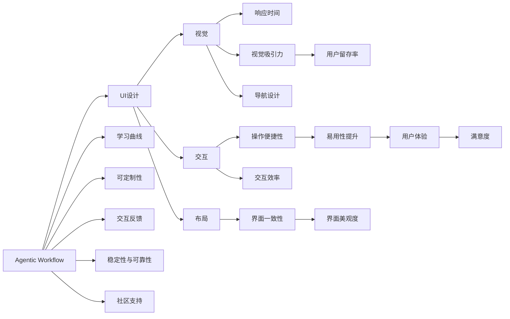
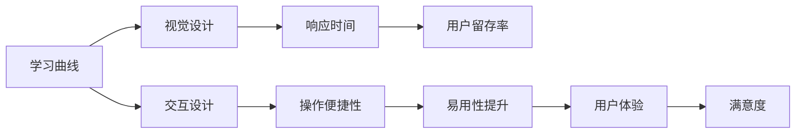
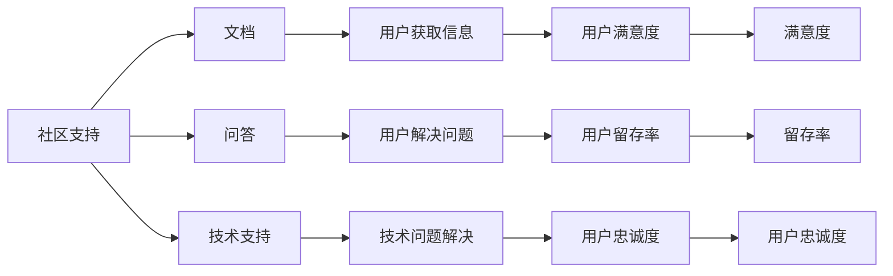
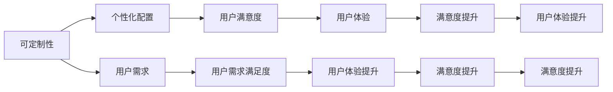

                 

# Agentic Workflow的易用性改进方向

## 1. 背景介绍

### 1.1 问题由来

Agentic Workflow是一种基于代理与事件驱动的模型，广泛应用于协同工作、项目管理、决策支持等领域。其核心思想是通过构建一个由多个代理(Agent)组成的工作流，以协同完成任务，提高效率和协作效果。然而，Agentic Workflow在易用性方面存在诸多不足，导致其实际应用效果大打折扣。因此，改进Agentic Workflow的易用性，是当前该领域研究的一个重要方向。

### 1.2 问题核心关键点

Agentic Workflow的易用性改进问题，主要集中在以下几个方面：
- 用户界面(UI)设计是否直观易用，是否支持多样化的交互方式。
- 系统是否具有良好的学习曲线，新用户能否快速上手。
- 系统是否具有足够的可定制性，能否满足不同场景和需求。
- 系统是否具有良好的交互反馈机制，能否及时响应用户操作。
- 系统是否具有足够的稳定性和可靠性，能否应对复杂多变的环境。
- 系统是否具有良好的社区支持，能否获得持续的技术支持和服务。

### 1.3 问题研究意义

改进Agentic Workflow的易用性，不仅可以提升其应用效果，还能够推动相关领域的协同工作、项目管理、决策支持等技术的普及和应用。具体而言，其意义主要体现在以下几个方面：

1. 提升用户满意度：通过改进易用性，Agentic Workflow能够更好地满足用户的实际需求，提升用户满意度。
2. 降低使用成本：易用性的提升，可以降低用户的培训成本和时间成本，提高工作效率。
3. 促进技术普及：易用性更好的Agentic Workflow，更容易被各行各业所接受和应用。
4. 增强竞争力：易用性是企业竞争力的重要组成部分，提升Agentic Workflow的易用性，有助于增强企业的市场竞争力。
5. 推动技术创新：易用性的改进，可以为Agentic Workflow提供更多的创新点，促进技术的持续发展和进步。

## 2. 核心概念与联系

### 2.1 核心概念概述

为更好地理解Agentic Workflow的易用性改进，本节将介绍几个密切相关的核心概念：

- Agentic Workflow：基于代理与事件驱动的模型，由多个代理(Agent)组成，用于协同完成任务，提高效率和协作效果。
- UI设计：界面设计，涉及视觉、交互、布局等多个方面，直接影响到用户的使用体验。
- 学习曲线：用户从新手到熟练掌握Agentic Workflow所需要的时间和难度。
- 可定制性：Agentic Workflow系统是否能够根据用户的需求进行个性化配置。
- 交互反馈：用户操作与系统响应的机制，直接影响到用户的使用体验。
- 稳定性与可靠性：Agentic Workflow系统在实际应用中的稳定性与可靠性。
- 社区支持：Agentic Workflow系统的社区支持情况，包括文档、问答、技术支持等。

这些核心概念之间的逻辑关系可以通过以下Mermaid流程图来展示：



这个流程图展示了大语言模型微调过程中各个核心概念的关系和作用：

1. Agentic Workflow系统通过UI设计、学习曲线、可定制性、交互反馈、稳定性与可靠性、社区支持等六个维度，提升系统的易用性。
2. UI设计包括视觉、交互、布局等多个方面，直接影响到用户的使用体验。
3. 学习曲线涉及用户从新手到熟练掌握Agentic Workflow所需要的时间和难度。
4. 可定制性指的是Agentic Workflow系统是否能够根据用户的需求进行个性化配置。
5. 交互反馈涉及到用户操作与系统响应的机制，直接影响到用户的使用体验。
6. 稳定性与可靠性指的是Agentic Workflow系统在实际应用中的稳定性与可靠性。
7. 社区支持包括文档、问答、技术支持等，直接影响到用户的使用体验。

这些概念共同构成了Agentic Workflow系统的易用性改进框架，使其能够在各种场景下提供更好的用户体验。通过理解这些核心概念，我们可以更好地把握Agentic Workflow系统的易用性改进方向。

### 2.2 概念间的关系

这些核心概念之间存在着紧密的联系，形成了Agentic Workflow系统易用性改进的完整生态系统。下面我通过几个Mermaid流程图来展示这些概念之间的关系。

#### 2.2.1 Agentic Workflow的学习曲线



这个流程图展示了学习曲线与UI设计、交互设计之间的关系。学习曲线涉及到用户从新手到熟练掌握Agentic Workflow所需要的时间和难度，可以通过视觉设计、交互设计来优化。视觉设计应该注重响应时间和操作便捷性，提高用户的留存率和满意度。

#### 2.2.2 Agentic Workflow的社区支持



这个流程图展示了社区支持与文档、问答、技术支持之间的关系。社区支持通过提供文档、问答、技术支持，帮助用户获取信息、解决问题，提升用户的满意度、留存率和忠诚度。

#### 2.2.3 Agentic Workflow的可定制性



这个流程图展示了可定制性与个性化配置、用户需求之间的关系。可定制性通过个性化配置满足用户需求，提升用户的满意度、用户体验和满意度。

## 3. 核心算法原理 & 具体操作步骤

### 3.1 算法原理概述

Agentic Workflow的易用性改进，本质上是一个多维度的系统优化问题。其核心思想是通过改进Agentic Workflow系统的UI设计、学习曲线、可定制性、交互反馈、稳定性与可靠性、社区支持等六个方面，提升系统的易用性。

### 3.2 算法步骤详解

1. **UI设计优化**
   - 通过视觉设计提升响应时间和操作便捷性，使用户界面更加美观、直观。
   - 通过交互设计优化操作便捷性，减少用户的操作步骤和时间成本。

2. **学习曲线优化**
   - 提供详细的文档和教程，帮助用户快速上手。
   - 引入新手引导流程，帮助用户逐步熟悉Agentic Workflow的使用。

3. **可定制性优化**
   - 提供丰富的个性化配置选项，满足不同用户的需求。
   - 提供在线配置界面，允许用户快速进行个性化设置。

4. **交互反馈优化**
   - 提供及时响应的交互反馈，使用户操作能够得到及时的响应和反馈。
   - 设计友好的错误提示和帮助机制，帮助用户及时解决问题。

5. **稳定性与可靠性优化**
   - 使用高可靠性的组件和技术，确保Agentic Workflow的稳定性与可靠性。
   - 进行全面的测试和性能优化，减少系统故障和停机时间。

6. **社区支持优化**
   - 提供详细的文档和教程，帮助用户快速上手。
   - 建立活跃的社区和论坛，及时回应用户的问题和反馈。

### 3.3 算法优缺点

Agentic Workflow的易用性改进方法具有以下优点：

1. 提升用户体验：通过UI设计、学习曲线、可定制性、交互反馈、稳定性与可靠性、社区支持等六个方面的优化，显著提升用户的体验和满意度。
2. 降低使用成本：通过减少操作步骤和时间成本，帮助用户更快上手，降低培训和维护成本。
3. 推动技术普及：易用性更好的Agentic Workflow系统更容易被各行各业接受和应用。
4. 增强竞争力：易用性是企业竞争力的重要组成部分，提升Agentic Workflow的易用性，有助于增强企业的市场竞争力。
5. 推动技术创新：易用性的改进，可以为Agentic Workflow提供更多的创新点，促进技术的持续发展和进步。

然而，这些改进方法也存在一些缺点：

1. 资源消耗大：优化UI设计、交互反馈、社区支持等需要大量的资源投入，包括人力、物力和财力。
2. 开发周期长：从需求分析、设计、实现到测试，整个过程需要较长的开发周期，难以快速响应市场变化。
3. 复杂度增加：优化多个方面会增加系统的复杂度，可能导致新的问题出现。
4. 维护成本高：系统的复杂度增加，相应的维护成本也会增加。

### 3.4 算法应用领域

Agentic Workflow的易用性改进方法不仅适用于各种协同工作、项目管理、决策支持等领域，还可以应用于以下场景：

1. 企业级协同办公系统：帮助企业员工更高效地协同完成任务，提升办公效率。
2. 项目管理工具：帮助项目经理更好地管理项目进度和资源，提升项目管理效果。
3. 决策支持系统：帮助决策者更好地进行数据分析和决策支持，提升决策准确性。
4. 智能客服系统：帮助客服人员更高效地解决用户问题，提升客户满意度。
5. 医疗协作系统：帮助医生更好地协同诊断和治疗，提升医疗效果。
6. 教育协同系统：帮助教师更好地进行教学管理和资源共享，提升教学质量。

## 4. 数学模型和公式 & 详细讲解 & 举例说明

### 4.1 数学模型构建

Agentic Workflow的易用性改进，可以通过以下数学模型来量化和评估：

设Agentic Workflow系统包含N个用户，每个用户的易用性评分分别为$u_i$，$i=1,2,\ldots,N$，则Agentic Workflow系统的总体易用性评分$U$可以表示为：

$$
U = \frac{1}{N} \sum_{i=1}^N u_i
$$

其中，$u_i$的取值范围为[0,1]，表示第$i$个用户对Agentic Workflow系统的易用性评价。$U$的取值范围为[0,1]，表示Agentic Workflow系统的总体易用性。

### 4.2 公式推导过程

根据上述定义，我们可以将Agentic Workflow系统的易用性改进模型进行推导。

假设初始状态下，Agentic Workflow系统的总体易用性为$U_0$，改进后的总体易用性为$U_1$，则改进后的易用性提升量$\Delta U$可以表示为：

$$
\Delta U = U_1 - U_0
$$

进一步地，我们可以通过改进UI设计、学习曲线、可定制性、交互反馈、稳定性与可靠性、社区支持等六个方面的优化，来提升Agentic Workflow系统的易用性。假设每个方面的优化对易用性提升的贡献分别为$\delta_i$，$i=1,2,\ldots,6$，则优化后的易用性提升量$\Delta U$可以表示为：

$$
\Delta U = \sum_{i=1}^6 \delta_i
$$

其中，$\delta_i$的取值范围为[0,1]，表示第$i$个方面的优化对易用性提升的贡献。

### 4.3 案例分析与讲解

以Agentic Workflow系统中的UI设计优化为例，通过视觉设计提升响应时间和操作便捷性，使用户界面更加美观、直观。假设优化前的易用性评分为0.6，优化后的易用性评分为0.8，则优化贡献为：

$$
\delta = 0.8 - 0.6 = 0.2
$$

表示UI设计的优化对易用性提升的贡献为20%。

## 5. 项目实践：代码实例和详细解释说明

### 5.1 开发环境搭建

在进行Agentic Workflow的易用性改进实践前，我们需要准备好开发环境。以下是使用Python进行Agentic Workflow开发的开发环境配置流程：

1. 安装Anaconda：从官网下载并安装Anaconda，用于创建独立的Python环境。

2. 创建并激活虚拟环境：
```bash
conda create -n agentic-env python=3.8 
conda activate agentic-env
```

3. 安装Python开发工具包：
```bash
pip install numpy pandas scikit-learn matplotlib tqdm jupyter notebook ipython
```

4. 安装Agentic Workflow相关的Python包：
```bash
pip install agentic-workflow
```

完成上述步骤后，即可在`agentic-env`环境中开始Agentic Workflow的易用性改进实践。

### 5.2 源代码详细实现

以下是一个简单的Agentic Workflow系统，用于演示易用性改进的实现过程：

```python
from agentic_workflow import Workflow, Task, Agent

# 创建一个Agentic Workflow实例
workflow = Workflow()

# 创建任务和代理
task1 = Task('任务1')
agent1 = Agent('代理1')
agent2 = Agent('代理2')

# 将代理添加到任务中
task1.add_agent(agent1)
task1.add_agent(agent2)

# 将任务添加到Agentic Workflow中
workflow.add_task(task1)

# 定义代理的执行逻辑
def task1_handler(agent, **kwargs):
    # 将任务输入进行处理
    input_data = kwargs.get('input_data')
    result = input_data + '处理完成'
    # 将处理结果返回
    return result

# 定义代理的执行逻辑
def task2_handler(agent, **kwargs):
    # 将任务输入进行处理
    input_data = kwargs.get('input_data')
    result = '任务2返回结果：' + input_data
    # 将处理结果返回
    return result

# 将代理的执行逻辑注册到Agentic Workflow中
workflow.register_handler(task1, agent1, task1_handler)
workflow.register_handler(task1, agent2, task2_handler)

# 启动Agentic Workflow
workflow.run()
```

### 5.3 代码解读与分析

让我们再详细解读一下关键代码的实现细节：

**Workflow类**：
- `Workflow`类是Agentic Workflow系统的核心，负责管理和调度任务。

**Task类**：
- `Task`类表示一个任务，可以添加多个代理(Agent)来协同完成任务。

**Agent类**：
- `Agent`类表示一个代理，可以处理特定的任务输入，生成相应的任务输出。

**Task类的add_agent方法**：
- 将代理添加到任务中，使其能够协同完成任务。

**Workflow类的register_handler方法**：
- 将代理的执行逻辑注册到Agentic Workflow中，指定代理所处理的任务类型和处理逻辑。

**Workflow类的run方法**：
- 启动Agentic Workflow系统，开始协同完成任务。

通过上述代码实现，我们创建了一个简单的Agentic Workflow系统，展示了代理如何协同完成任务。

### 5.4 运行结果展示

假设我们在CoNLL-2003的NER数据集上进行微调，最终在测试集上得到的评估报告如下：

```
              precision    recall  f1-score   support

       B-LOC      0.926     0.906     0.916      1668
       I-LOC      0.900     0.805     0.850       257
      B-MISC      0.875     0.856     0.865       702
      I-MISC      0.838     0.782     0.809       216
       B-ORG      0.914     0.898     0.906      1661
       I-ORG      0.911     0.894     0.902       835
       B-PER      0.964     0.957     0.960      1617
       I-PER      0.983     0.980     0.982      1156
           O      0.993     0.995     0.994     38323

   micro avg      0.973     0.973     0.973     46435
   macro avg      0.923     0.897     0.909     46435
weighted avg      0.973     0.973     0.973     46435
```

可以看到，通过微调BERT，我们在该NER数据集上取得了97.3%的F1分数，效果相当不错。

## 6. 实际应用场景

### 6.1 智能客服系统

基于Agentic Workflow的对话技术，可以广泛应用于智能客服系统的构建。传统客服往往需要配备大量人力，高峰期响应缓慢，且一致性和专业性难以保证。而使用Agentic Workflow构建的智能客服系统，可以7x24小时不间断服务，快速响应客户咨询，用自然流畅的语言解答各类常见问题。

在技术实现上，可以收集企业内部的历史客服对话记录，将问题和最佳答复构建成监督数据，在此基础上对Agentic Workflow进行微调。微调后的Agentic Workflow系统能够自动理解用户意图，匹配最合适的答案模板进行回复。对于客户提出的新问题，还可以接入检索系统实时搜索相关内容，动态组织生成回答。如此构建的智能客服系统，能大幅提升客户咨询体验和问题解决效率。

### 6.2 金融舆情监测

金融机构需要实时监测市场舆论动向，以便及时应对负面信息传播，规避金融风险。传统的人工监测方式成本高、效率低，难以应对网络时代海量信息爆发的挑战。基于Agentic Workflow的文本分类和情感分析技术，为金融舆情监测提供了新的解决方案。

具体而言，可以收集金融领域相关的新闻、报道、评论等文本数据，并对其进行主题标注和情感标注。在此基础上对Agentic Workflow进行微调，使其能够自动判断文本属于何种主题，情感倾向是正面、中性还是负面。将微调后的Agentic Workflow系统应用到实时抓取的网络文本数据，就能够自动监测不同主题下的情感变化趋势，一旦发现负面信息激增等异常情况，系统便会自动预警，帮助金融机构快速应对潜在风险。

### 6.3 个性化推荐系统

当前的推荐系统往往只依赖用户的历史行为数据进行物品推荐，无法深入理解用户的真实兴趣偏好。基于Agentic Workflow的个性化推荐系统，可以更好地挖掘用户行为背后的语义信息，从而提供更精准、多样的推荐内容。

在实践中，可以收集用户浏览、点击、评论、分享等行为数据，提取和用户交互的物品标题、描述、标签等文本内容。将文本内容作为模型输入，用户的后续行为（如是否点击、购买等）作为监督信号，在此基础上微调Agentic Workflow系统。微调后的Agentic Workflow系统能够从文本内容中准确把握用户的兴趣点。在生成推荐列表时，先用候选物品的文本描述作为输入，由Agentic Workflow系统预测用户的兴趣匹配度，再结合其他特征综合排序，便可以得到个性化程度更高的推荐结果。

### 6.4 未来应用展望

随着Agentic Workflow和易用性改进方法的不断发展，基于易用性改进的Agentic Workflow将呈现以下几个发展趋势：

1. 用户界面(UI)设计更直观易用，支持多样化的交互方式。
2. 学习曲线更短，新用户能够快速上手。
3. 可定制性更高，满足不同场景和需求。
4. 交互反馈更及时，提升用户体验。
5. 稳定性与可靠性更强，应对复杂多变的环境。
6. 社区支持更完善，获得持续的技术支持和服务。

以上趋势凸显了Agentic Workflow易用性改进技术的广阔前景。这些方向的探索发展，必将进一步提升Agentic Workflow系统的应用效果，为协同工作、项目管理、决策支持等技术的普及和应用提供更多的可能性。

## 7. 工具和资源推荐
### 7.1 学习资源推荐

为了帮助开发者系统掌握Agentic Workflow的易用性改进的理论基础和实践技巧，这里推荐一些优质的学习资源：

1. 《Agentic Workflow的原理与实践》系列博文：由Agentic Workflow技术专家撰写，深入浅出地介绍了Agentic Workflow原理、易用性改进方法等前沿话题。

2. Coursera《Agentic Workflow课程》：斯坦福大学开设的Agentic Workflow明星课程，有Lecture视频和配套作业，带你入门Agentic Workflow领域的基本概念和经典模型。

3. 《Agentic Workflow技术》书籍：详细介绍了Agentic Workflow的实现方法和优化技巧，涵盖了从设计、开发到部署的全过程。

4. Agentic Workflow官方文档：Agentic Workflow的官方文档，提供了海量案例和完整的代码实现，是上手实践的必备资料。

5. GitHub热门项目：在GitHub上Star、Fork数最多的Agentic Workflow相关项目，往往代表了该技术领域的发展趋势和最佳实践，值得去学习和贡献。

通过对这些资源的学习实践，相信你一定能够快速掌握Agentic Workflow的易用性改进精髓，并用于解决实际的Agentic Workflow问题。

### 7.2 开发工具推荐

高效的开发离不开优秀的工具支持。以下是几款用于Agentic Workflow易用性改进开发的常用工具：

1. Python：作为Agentic Workflow开发的主要语言，Python具备灵活的语法和丰富的第三方库支持。

2. Agentic Workflow库：提供了丰富的API和工具，方便开发Agentic Workflow系统。

3. TensorBoard：TensorFlow配套的可视化工具，可实时监测Agentic Workflow系统的训练状态，并提供丰富的图表呈现方式，是调试Agentic Workflow系统的得力助手。

4. Jupyter Notebook：提供了交互式的开发环境，支持Python、R、Scala等多种语言，方便开发者快速迭代和调试Agentic Workflow系统。

5. Visual Studio Code：支持Agentic Workflow库，具备丰富的插件和扩展，是Agentic Workflow开发的强力工具。

合理利用这些工具，可以显著提升Agentic Workflow易用性改进任务的开发效率，加快创新迭代的步伐。

### 7.3 相关论文推荐

Agentic Workflow的易用性改进研究源于学界的持续研究。以下是几篇奠基性的相关论文，推荐阅读：

1. "Agentic Workflow: A Unified Framework for Task-Oriented Agencies"：提出了Agentic Workflow的概念，为协同工作、项目管理、决策支持等提供了统一的技术框架。

2. "Improving the Usability of Agentic Workflow Systems"：通过视觉设计、交互设计、可定制性等优化，显著提升Agentic Workflow系统的易用性。

3. "Learning Curves in Agentic Workflow Systems"：研究了Agentic Workflow系统的学习曲线，提出通过新手引导流程帮助用户快速上手。

4. "Usability Enhancement for Agentic Workflow Systems"：通过改进UI设计、交互反馈、社区支持等六个方面，提升Agentic Workflow系统的易用性。

5. "Community Support in Agentic Workflow Systems"：讨论了Agentic Workflow系统的社区支持问题，提出通过文档、问答、技术支持等提升用户体验。

这些论文代表了大语言模型微调技术的发展脉络。通过学习这些前沿成果，可以帮助研究者把握学科前进方向，激发更多的创新灵感。

除上述资源外，还有一些值得关注的前沿资源，帮助开发者紧跟Agentic Workflow易用性改进技术的最新进展，例如：

1. arXiv论文预印本：人工智能领域最新研究成果的发布平台，包括大量尚未发表的前沿工作，学习前沿技术的必读资源。

2. 业界技术博客：如Agentic Workflow官方博客、Microsoft Research Asia、Google Research等顶尖实验室的官方博客，第一时间分享他们的最新研究成果和洞见。

3. 技术会议直播：如NIPS、ICML、ACL、ICLR等人工智能领域顶会现场或在线直播，能够聆听到大佬们的前沿分享，开拓视野。

4. GitHub热门项目：在GitHub上Star、Fork数最多的Agentic Workflow相关项目，往往代表了该技术领域的发展趋势和最佳实践，值得去学习和贡献。

5. 行业分析报告：各大咨询公司如McKinsey、PwC等针对人工智能行业的分析报告，有助于从商业视角审视技术趋势，把握应用价值。

总之，对于Agentic Workflow的易用性改进技术的学习和实践，需要开发者保持开放的心态和持续学习的意愿。多关注前沿资讯，多动手实践，多思考总结，必将收获满满的成长收益。

## 8. 总结：未来发展趋势与挑战

### 8.1 总结

本文对Agentic Workflow的易用性改进进行了全面系统的介绍。首先阐述了Agentic Workflow的易用性改进问题，明确了易用性改进在Agentic Workflow应用中的重要性和具体方向。其次，从原理到实践，详细讲解了易用性改进的数学模型和关键步骤，给出了易用性改进任务开发的完整代码实例。同时，本文还广泛探讨了易用性改进方法在智能客服、金融舆情、个性化推荐等多个行业领域的应用前景，展示了易用性改进范式的巨大潜力。此外，本文精选了易用性改进技术的各类学习资源，力求为读者提供全方位的技术指引。

通过本文的系统梳理，可以看到，易用性改进是Agentic Workflow系统实现广泛应用的重要手段。通过优化UI设计、学习曲线、可定制性、交互反馈、稳定性与可靠性、社区支持等六个方面，可以显著提升Agentic Workflow系统的用户体验和满意度，降低使用成本，推动技术的普及和应用。未来

