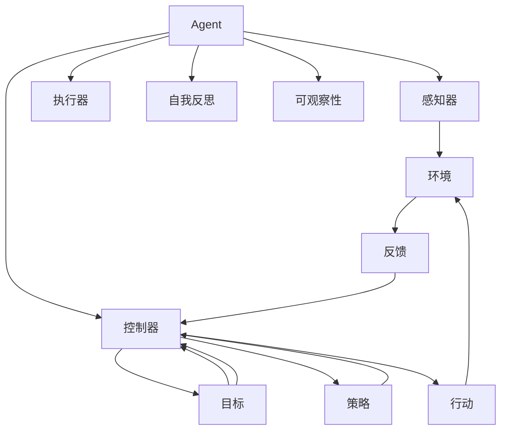
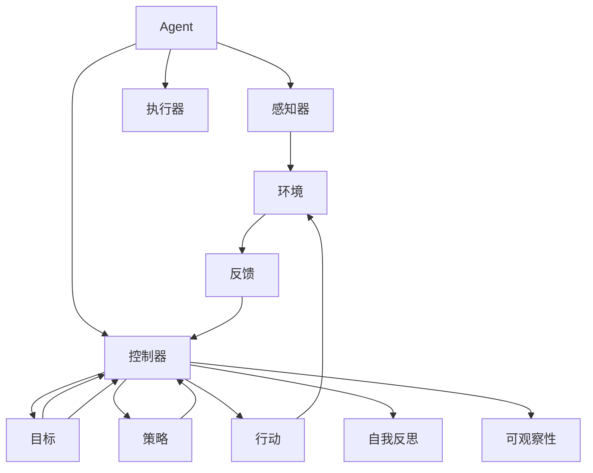
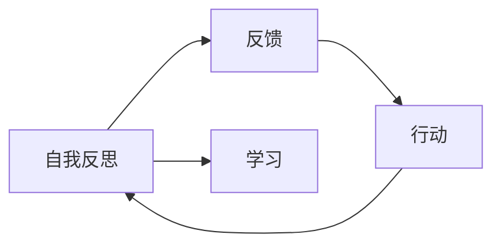
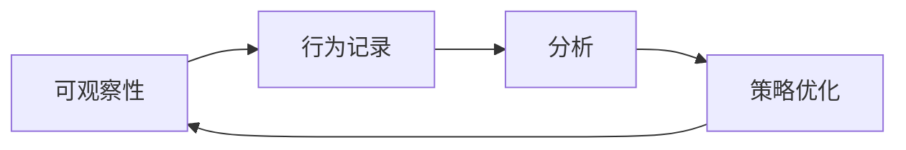

                 

# Agent能够通过自我反思和反馈来改进执行，同时提供可观察性

## 1. 背景介绍

在现代智能系统中，Agent（代理）扮演着越来越重要的角色。无论是自动驾驶汽车、智能推荐系统，还是机器人、聊天机器人，Agent都在与环境互动，执行各种任务。然而，Agent的性能不仅取决于算法设计，还受到数据、模型、超参数、环境等诸多因素的影响。在实践中，Agent往往需要频繁进行迭代和优化，以提高执行效率和质量。

在传统的Agent设计中，常常采用静态模型、固定参数的方法，即Agent一旦部署，就很难进行自适应和调整。这意味着在实际应用中，如果环境发生变化或任务需求变化，Agent往往需要重新训练或手动调整，才能适应新的情况。这不仅增加了开发和维护成本，也限制了Agent的灵活性和适应性。

为了解决这一问题，近年来，一种新的设计范式应运而生：Agent能够通过自我反思和反馈来改进执行，同时提供可观察性，从而实现更高效、更智能的运行。

## 2. 核心概念与联系

### 2.1 核心概念概述

为了更好地理解这一设计范式，本节将介绍几个关键概念：

- **Agent**：执行特定任务的智能体，可以是软件、硬件或虚拟实体。Agent通常由感知器、控制器、执行器等组件构成，能够在复杂环境中自主执行任务。

- **自我反思**：Agent主动检查自身行为和决策，评估其效果和潜在问题，通过回溯和分析提升性能。自我反思通常包括目标评估、性能监控、错误检测等环节。

- **反馈机制**：Agent接收环境对自身行为的反馈，根据反馈信息调整决策和执行策略。反馈可以是显式的（如用户评分、专家意见），也可以是隐式的（如系统性能指标、环境响应）。

- **可观察性**：Agent提供透明度和可视化，允许用户和开发者观察其行为和状态，从而更好地理解和优化Agent。可观察性通常包括日志记录、状态报告、可视化仪表盘等手段。

- **自适应学习**：Agent能够通过自我反思和反馈机制，自动调整其内部模型、参数和策略，以适应不断变化的环境和任务需求。自适应学习是Agent保持高性能、高稳定性的关键。

- **可解释性**：Agent能够提供其决策过程和执行结果的解释，使人类用户和开发者能够理解其内部工作机制和行为逻辑。可解释性对于增强信任、确保安全和合规性非常重要。

这些核心概念之间的逻辑关系可以通过以下Mermaid流程图来展示：



这个流程图展示了大语言模型的核心概念及其之间的关系：

1. Agent通过感知器获取环境信息，通过控制器设计策略和行动，并由执行器执行。
2. 环境对Agent的行动做出反馈，Agent根据反馈调整策略和行动。
3. Agent通过自我反思和可观察性模块，评估自身性能和行为，优化决策和执行。
4. Agent在执行过程中，其内部参数和模型不断自适应学习，以适应环境和任务的变化。

通过这些流程图，我们可以更清晰地理解Agent的自我反思和反馈机制，以及其在实际应用中的关键作用。

### 2.2 概念间的关系

这些核心概念之间存在着紧密的联系，形成了Agent设计、优化和运行的完整生态系统。下面我通过几个Mermaid流程图来展示这些概念之间的关系。

#### 2.2.1 Agent的学习范式



这个流程图展示了大语言模型的三种主要学习范式：感知、决策和执行。Agent通过感知器获取环境信息，通过控制器设计策略和行动，并由执行器执行。环境对Agent的行动做出反馈，Agent根据反馈调整策略和行动。同时，Agent通过自我反思和可观察性模块，评估自身性能和行为，优化决策和执行。

#### 2.2.2 自我反思与反馈的关系



这个流程图展示了自我反思与反馈的关系。Agent通过自我反思获取自身行为和决策的效果，并将反馈用于调整行动和学习。

#### 2.2.3 可观察性与学习的关系



这个流程图展示了可观察性在Agent学习中的作用。可观察性模块记录和分析Agent的行为，反馈给策略优化模块，优化Agent的策略和行为。

## 3. 核心算法原理 & 具体操作步骤

### 3.1 算法原理概述

Agent能够通过自我反思和反馈来改进执行的算法原理，主要包括以下几个关键步骤：

1. **感知与反馈获取**：Agent通过感知器获取环境信息，并将行为发送给环境，环境对行为做出反馈。
2. **决策与执行**：Agent根据反馈调整策略和行动，通过控制器设计决策和行动，并由执行器执行。
3. **自我反思**：Agent在执行过程中，通过可观察性模块记录行为和状态，进行自我反思，评估其效果和潜在问题。
4. **反馈与学习**：Agent将自我反思结果作为反馈，调整策略和模型，进行自适应学习。

这一过程形成一个闭环，使得Agent能够持续优化其执行效果，适应不断变化的环境和任务需求。

### 3.2 算法步骤详解

以下是Agent通过自我反思和反馈改进执行的具体操作步骤：

**Step 1: 环境感知与反馈获取**

Agent首先通过感知器获取环境信息。感知器可以是摄像头、传感器、网络等设备，将环境数据转换为Agent可理解的形式。

```python
# 假设感知器获取到环境数据
environment_data = sensor.get_data()
```

Agent将感知数据发送给环境，并根据环境反馈调整行动。环境反馈可以是显式的（如用户评分、专家意见），也可以是隐式的（如系统性能指标、环境响应）。

```python
# 将感知数据发送给环境
environment_feedback = environment.send(environment_data)
```

**Step 2: 决策与执行**

Agent根据反馈调整策略和行动，通过控制器设计决策和行动，并由执行器执行。控制器可以是规则、决策树、深度学习模型等。

```python
# 根据反馈调整策略
strategy = strategy.update(environment_feedback)

# 设计决策和行动
action = strategy.select(environment_data)

# 执行行动
executor.execute(action)
```

**Step 3: 自我反思**

Agent在执行过程中，通过可观察性模块记录行为和状态，进行自我反思，评估其效果和潜在问题。可观察性模块可以是日志记录、状态报告、可视化仪表盘等。

```python
# 记录行为和状态
log = loggers.add(environment_data, action)

# 评估效果和潜在问题
reflection = reflect(log)
```

**Step 4: 反馈与学习**

Agent将自我反思结果作为反馈，调整策略和模型，进行自适应学习。自适应学习可以采用强化学习、深度学习、神经网络等方法。

```python
# 将反思结果作为反馈
feedback = reflect

# 调整策略和模型
strategy = strategy.update(feedback)
model = model.update(reflect)
```

**Step 5: 执行与反馈循环**

重复执行以上步骤，直到达到预设的目标或条件。

```python
while not done:
    environment_data = sensor.get_data()
    environment_feedback = environment.send(environment_data)
    strategy = strategy.update(environment_feedback)
    action = strategy.select(environment_data)
    executor.execute(action)
    log = loggers.add(environment_data, action)
    reflection = reflect(log)
    feedback = reflect
    strategy = strategy.update(feedback)
    model = model.update(reflect)
```

### 3.3 算法优缺点

基于自我反思和反馈的Agent算法具有以下优点：

1. **自适应性强**：Agent能够根据环境反馈自动调整策略和模型，适应不断变化的任务和环境。
2. **灵活性高**：Agent可以通过自我反思和反馈机制，灵活调整行为和决策，应对未知和复杂的情况。
3. **可解释性好**：Agent通过可观察性模块提供透明度和可视化，使人类用户和开发者能够理解其内部工作机制和行为逻辑。

然而，该算法也存在一些缺点：

1. **数据需求高**：Agent需要大量数据进行自我反思和反馈，特别是在早期训练阶段，可能需要更多数据来避免过拟合。
2. **算法复杂度高**：Agent在执行过程中需要进行大量的自我反思和反馈，计算复杂度较高，特别是在大规模系统中。
3. **模型更新难度大**：Agent在执行过程中，模型和策略不断更新，需要保证模型的一致性和稳定性。

### 3.4 算法应用领域

基于自我反思和反馈的Agent算法，已经在多个领域得到应用，例如：

- 智能推荐系统：通过用户反馈调整推荐策略，提升推荐效果。
- 智能客服系统：通过用户互动记录和反馈，调整客服策略和知识库，提高服务质量。
- 自动驾驶汽车：通过传感器数据和环境反馈，优化行驶策略和决策。
- 机器人：通过传感器数据和环境反馈，优化移动和交互策略，提高执行效率和安全性。
- 智能家居：通过环境反馈和用户互动，优化家居控制策略，提升居住体验。

除了上述这些领域，Agent在医疗、金融、教育等更多场景中也有广泛应用前景。

## 4. 数学模型和公式 & 详细讲解 & 举例说明

### 4.1 数学模型构建

Agent通过自我反思和反馈改进执行的数学模型，可以形式化为：

$$
A = F(P, E, S)
$$

其中，$A$ 表示Agent，$P$ 表示感知器，$E$ 表示环境，$S$ 表示控制器和执行器。环境反馈 $F$ 通过感知器 $P$ 和控制器 $S$，不断调整Agent的行为和决策。

### 4.2 公式推导过程

Agent在执行过程中，通过感知器 $P$ 获取环境数据 $X$，并通过控制器 $S$ 设计决策 $U$，执行器 $E$ 执行行动 $A$。环境反馈 $F$ 通过感知器 $P$ 和控制器 $S$，不断调整Agent的行为和决策。

$$
X = P(A)
$$

$$
U = S(X)
$$

$$
A = E(U)
$$

$$
F = P(A)
$$

$$
U' = S'(F)
$$

$$
A' = E(U')
$$

其中，$'$ 表示反馈后的更新。Agent通过多次迭代，不断调整感知器 $P$、控制器 $S$ 和执行器 $E$，以优化其行为和决策。

### 4.3 案例分析与讲解

以智能推荐系统为例，分析Agent如何通过自我反思和反馈改进执行。

假设一个电子商务平台，Agent需要根据用户历史行为数据和商品属性，推荐用户可能感兴趣的商品。

**Step 1: 环境感知与反馈获取**

Agent通过感知器获取用户行为数据 $X$，并将推荐结果 $A$ 发送给用户。用户对推荐结果给出评分 $F$ 作为反馈。

$$
X = P(A)
$$

$$
A = E(U)
$$

$$
F = P(A)
$$

**Step 2: 决策与执行**

Agent根据用户评分反馈 $F$，调整推荐策略 $U$，重新设计决策和行动。

$$
U' = S'(F)
$$

$$
A' = E(U')
$$

**Step 3: 自我反思**

Agent通过可观察性模块记录用户行为数据 $X$ 和推荐结果 $A$，进行自我反思，评估其效果和潜在问题。

$$
X' = P(A')
$$

$$
F' = P(A')
$$

**Step 4: 反馈与学习**

Agent将自我反思结果作为反馈，调整推荐策略和模型，进行自适应学习。

$$
U'' = S''(F')
$$

$$
A'' = E(U'')
$$

**Step 5: 执行与反馈循环**

重复执行以上步骤，直到达到预设的目标或条件。

通过这一过程，Agent能够不断优化其推荐策略和模型，提高推荐效果，满足用户的个性化需求。

## 5. 项目实践：代码实例和详细解释说明

### 5.1 开发环境搭建

在进行Agent开发和实践前，我们需要准备好开发环境。以下是使用Python进行Agent开发的环境配置流程：

1. 安装Anaconda：从官网下载并安装Anaconda，用于创建独立的Python环境。

2. 创建并激活虚拟环境：
```bash
conda create -n agent-env python=3.8 
conda activate agent-env
```

3. 安装相关依赖库：
```bash
pip install numpy pandas sklearn torch gym gymnasium
```

4. 安装相关模拟器和测试工具：
```bash
pip install simpy
```

完成上述步骤后，即可在`agent-env`环境中开始Agent开发。

### 5.2 源代码详细实现

下面我们以智能推荐系统为例，给出使用PyTorch实现Agent的Python代码实现。

首先，定义推荐系统的环境：

```python
from gymnasium import spaces

class RecommendationEnv:
    def __init__(self, num_items=10, num_users=10):
        self.num_items = num_items
        self.num_users = num_users
        self.item_features = np.random.randn(num_items, 10)
        self.user_features = np.random.randn(num_users, 10)
        self.terminal = False
        
    def reset(self):
        self.terminal = False
        return np.random.randn(self.num_users, 1), self.item_features
    
    def step(self, action):
        if self.terminal:
            return self.item_features, -1.0, self.terminal, {}
        else:
            user_id, item_id = action
            relevance = np.dot(self.user_features[user_id], self.item_features[item_id])
            reward = relevance + np.random.normal(0, 0.1)
            next_state = np.random.randn(self.num_users, 1), self.item_features
            self.terminal = self.terminal or np.random.rand() < 0.1
            return next_state, reward, self.terminal, {}
```

然后，定义推荐系统的Agent：

```python
from torch import nn, optim

class QNetwork(nn.Module):
    def __init__(self, input_size, output_size):
        super(QNetwork, self).__init__()
        self.fc1 = nn.Linear(input_size, 64)
        self.fc2 = nn.Linear(64, 64)
        self.fc3 = nn.Linear(64, output_size)
        
    def forward(self, x):
        x = nn.functional.relu(self.fc1(x))
        x = nn.functional.relu(self.fc2(x))
        return self.fc3(x)
    
class RecommendationAgent:
    def __init__(self, num_items, num_users, num_actions):
        self.num_items = num_items
        self.num_users = num_users
        self.num_actions = num_actions
        self.agent = QNetwork(num_users + num_items, num_items)
        self.optimizer = optim.Adam(self.agent.parameters(), lr=0.01)
        self.item_features = np.random.randn(num_items, 10)
        self.user_features = np.random.randn(num_users, 10)
        self.gamma = 0.99
        
    def act(self, state):
        state = torch.from_numpy(state).float()
        action_scores = self.agent(state)
        return action_scores.argmax().item()
    
    def update(self, state, action, reward, next_state, done):
        state = torch.from_numpy(state).float()
        next_state = torch.from_numpy(next_state).float()
        action = torch.tensor([action])
        action_scores = self.agent(next_state)
        target = reward + self.gamma * action_scores.max().item()
        loss = nn.functional.mse_loss(self.agent(state), target)
        self.optimizer.zero_grad()
        loss.backward()
        self.optimizer.step()
```

接着，定义Agent的训练和测试流程：

```python
from simpy import Environment

def train_agent(agent, env, num_episodes=1000, batch_size=16):
    for episode in range(num_episodes):
        state, item_features = env.reset()
        total_reward = 0.0
        done = False
        while not done:
            action = agent.act(state)
            next_state, reward, done, _ = env.step(action)
            total_reward += reward
            agent.update(state, action, reward, next_state, done)
            state = next_state
        print(f"Episode {episode+1}, total reward: {total_reward:.3f}")
    
    return agent

def test_agent(agent, env, num_episodes=100):
    for episode in range(num_episodes):
        state, item_features = env.reset()
        total_reward = 0.0
        done = False
        while not done:
            action = agent.act(state)
            next_state, reward, done, _ = env.step(action)
            total_reward += reward
            state = next_state
        print(f"Episode {episode+1}, total reward: {total_reward:.3f}")
    
    return agent

env = RecommendationEnv()
agent = RecommendationAgent(num_items=10, num_users=10, num_actions=num_items*num_users)

agent = train_agent(agent, env, num_episodes=1000, batch_size=16)

agent = test_agent(agent, env, num_episodes=100)
```

最后，运行测试并展示结果：

```python
test_agent(agent, env, num_episodes=100)
```

以上就是使用PyTorch实现智能推荐系统的Agent开发和测试的完整代码实现。可以看到，Agent通过感知环境数据，根据反馈调整决策和行动，并在执行过程中进行自我反思和反馈，优化推荐策略和模型。

### 5.3 代码解读与分析

让我们再详细解读一下关键代码的实现细节：

**RecommendationEnv类**：
- `__init__`方法：初始化环境参数，包括物品数量、用户数量、物品特征、用户特征和终止标志。
- `reset`方法：重置环境状态，返回用户行为数据和物品特征。
- `step`方法：根据行动和状态，计算奖励和下一个状态，并根据终止条件判断是否继续执行。

**QNetwork类**：
- `__init__`方法：初始化神经网络，包括全连接层和激活函数。
- `forward`方法：前向传播计算输出，返回动作评分。

**RecommendationAgent类**：
- `__init__`方法：初始化Agent，包括物品数量、用户数量、动作数量、神经网络、优化器、物品特征、用户特征和学习率。
- `act`方法：根据当前状态，计算动作评分并返回最佳动作。
- `update`方法：根据状态、行动、奖励、下一个状态和终止条件，更新神经网络参数。

**训练和测试函数**：
- `train_agent`函数：进行环境感知和反馈获取、决策与执行、自我反思和反馈学习，不断优化神经网络和策略。
- `test_agent`函数：对训练好的Agent进行测试，评估其在推荐系统中的表现。

通过这些代码，可以看到Agent如何通过自我反思和反馈机制，不断优化推荐策略和模型，提高推荐效果。

当然，工业级的系统实现还需考虑更多因素，如日志记录、状态报告、可视化仪表盘等。但核心的自我反思和反馈机制基本与此类似。

## 6. 实际应用场景

### 6.1 智能推荐系统

智能推荐系统已经成为互联网和电子商务行业的重要组成部分。通过Agent的自我反思和反馈机制，推荐系统能够根据用户行为和反馈，不断调整推荐策略和模型，提供更精准、个性化的推荐服务。

在技术实现上，可以收集用户浏览、点击、购买等行为数据，并对其进行分析和建模。将用户行为数据和物品属性作为输入，利用神经网络模型进行预测和推荐。在推荐过程中，Agent通过感知器获取用户行为数据，通过控制器设计推荐策略和模型，执行器进行推荐，并通过用户反馈进行自我反思和反馈学习。如此构建的推荐系统，能够实时调整推荐策略，提升用户满意度，实现更高的转化率和收入。

### 6.2 智能客服系统

智能客服系统是另一个Agent在实际应用中的典型场景。传统客服往往需要配备大量人力，高峰期响应缓慢，且一致性和专业性难以保证。而使用Agent的自我反思和反馈机制，智能客服系统能够7x24小时不间断服务，快速响应客户咨询，用自然流畅的语言解答各类常见问题。

在技术实现上，可以收集企业内部的历史客服对话记录，将问题和最佳答复构建成监督数据，在此基础上对预训练模型进行微调。微调后的Agent能够自动理解用户意图，匹配最合适的答复模板进行回复。对于客户提出的新问题，还可以接入检索系统实时搜索相关内容，动态组织生成回答。如此构建的智能客服系统，能大幅提升客户咨询体验和问题解决效率。

### 6.3 自动驾驶汽车

自动驾驶汽车是Agent在实际应用中最为复杂的场景之一。通过Agent的自我反思和反馈机制，自动驾驶汽车能够根据传感器数据和环境反馈，不断调整行驶策略和决策，提高驾驶安全和效率。

在技术实现上，可以采集车辆状态数据和环境数据，并对其进行分析和建模。将车辆状态数据和环境数据作为输入，利用神经网络模型进行决策和控制。在驾驶过程中，Agent通过感知器获取传感器数据和环境反馈，通过控制器设计行驶策略和模型，执行器进行控制，并通过用户反馈进行自我反思和反馈学习。如此构建的自动驾驶系统，能够实时调整驾驶策略，提高行车安全和效率，提升用户体验。

## 7. 工具和资源推荐
### 7.1 学习资源推荐

为了帮助开发者系统掌握Agent的自我反思和反馈技术，这里推荐一些优质的学习资源：

1. 《Reinforcement Learning: An Introduction》：由Richard S. Sutton和Andrew G. Barto合著的经典书籍，全面介绍了强化学习的原理和应用，是学习Agent技术的重要参考资料。

2. 《Deep Reinforcement Learning Handbook》：由Deep Reinforcement Learning Specialization提供的深度学习强化学习手册，包括多种Agent的实现和案例分析，适合初学者和进阶学习者。

3. OpenAI Gym：一个Python界面开发生态系统，提供多种环境模拟和Agent库，用于测试和优化Agent算法。

4. PyTorch Reinforcement Learning：PyTorch官方提供的强化学习教程，涵盖了多种Agent的实现和优化技巧。

5. Google Deepmind Blog：Deepmind团队的官方博客，发布最新的强化学习研究成果和实践经验，值得关注和借鉴。

通过学习这些资源，相信你一定能够快速掌握Agent的自我反思和反馈机制，并用于解决实际的NLP问题。
###  7.2 开发工具推荐

高效的开发离不开优秀的工具支持。以下是几款用于Agent开发和测试的常用工具：

1. PyTorch：基于Python的开源深度学习框架，灵活动态的计算图，适合快速迭代研究。广泛的Agent实现和优化资源，适合Agent开发。

2. TensorFlow：由Google主导开发的开源深度学习框架，生产部署方便，适合大规模工程应用。Agent的实现和优化资源丰富。

3. OpenAI Gym：一个Python界面开发生态系统，提供多种环境模拟和Agent库，用于测试和优化Agent算法。

4. PyTorch Reinforcement Learning：PyTorch官方提供的强化学习教程，涵盖了多种Agent的实现和优化技巧。

5. TensorBoard：TensorFlow配套的可视化工具，可实时监测Agent训练状态，并提供丰富的图表呈现方式，是调试Agent的得力助手。

6. Weights & Biases：模型训练的实验跟踪工具，可以记录和可视化Agent训练过程中的各项指标，方便对比和调优。

合理利用这些工具，可以显著提升Agent开发的效率，加快创新迭代的步伐。

### 7.3 相关论文推荐

Agent的自我反思和反馈技术是近年来人工智能领域的研究热点。以下是几篇奠基性的相关论文，推荐阅读：

1. DeepMind的《Playing Atari with human-level curriculum》：展示了Agent通过自我反思和反馈，在复杂的Atari游戏中取得优异成绩。

2. OpenAI的《A Survey of AI-Based Recommendation Systems》：总结了基于AI的推荐系统发展历程，包括Agent的实现和优化方法。

3. DeepMind的《Human-level control through deep reinforcement learning》：展示了Agent通过自我反思和反馈，在复杂的控制任务中取得优异成绩。

4. DeepMind的《Deep reinforcement learning for playing go》：展示了Agent通过自我反思和反馈，在复杂的围棋游戏中取得优异成绩。

5. OpenAI的《AlphaGo Zero: Mastering the game of Go without human knowledge》：展示了Agent通过自我反思和反馈，在没有人类知识的情况下，通过自我博弈，取得优异成绩。

这些论文代表了Agent自我反思和反馈技术的发展脉络。通过学习这些前沿成果，可以帮助研究者把握学科前进方向，激发更多的创新灵感。

## 8. 总结：未来发展趋势与挑战

### 8.1 总结

本文对Agent通过自我反思和反馈改进执行

