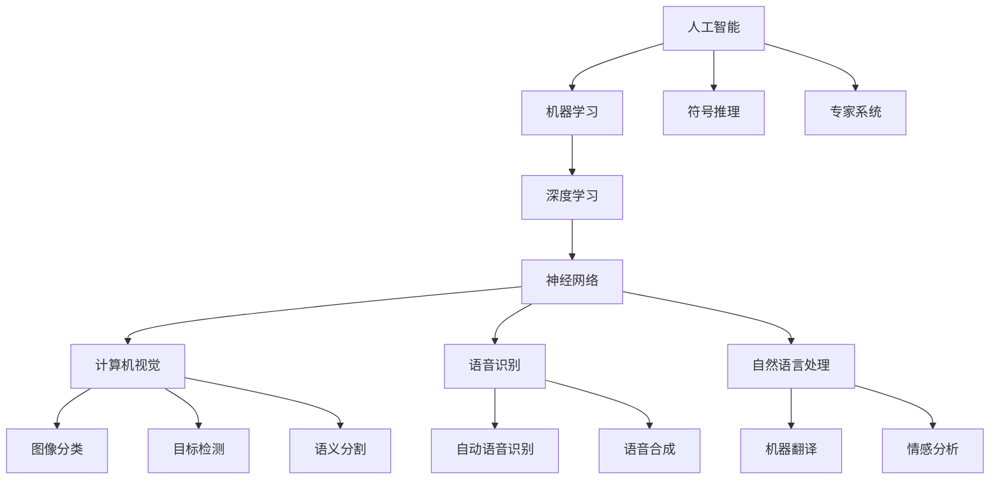

                 

# Andrej Karpathy谈AI的历史与未来

> 关键词：人工智能历史,深度学习演变,未来趋势,前沿技术,深度学习框架,创新应用

## 1. 背景介绍

### 1.1 历史回顾：AI的百年征程
人工智能（Artificial Intelligence，AI）的概念自1950年代初首次提出以来，已经经历了数十年的历史演变，从理论到实践，不断推陈出新。AI的历史可以划分为以下几个重要阶段：

1. **早期探索（1950s-1970s）**：AI的萌芽期，计算机科学家如John McCarthy、Marvin Minsky等人提出了符号推理、专家系统等早期AI理论，但受限于计算能力，早期AI的研究多停留在理论层面。

2. **衰落期（1980s）**：由于理论上的瓶颈和实际应用中的困难，AI进入了一个发展停滞的时期。许多曾名噪一时的AI项目纷纷宣告失败，AI的发展几乎陷入停滞。

3. **复兴期（1990s至今）**：计算机硬件和软件的飞速发展为AI注入了新的活力。机器学习（Machine Learning，ML）特别是深度学习（Deep Learning，DL）的兴起，为AI带来了新的希望和突破。

Andrej Karpathy，作为Facebook AI Research（FAIR）的AI研究主管，同时也是一位深度学习领域的先锋，他对AI的发展历程有着深刻的见解。在他的讲话中，他特别强调了深度学习在推动AI技术快速发展中的关键作用。

## 2. 核心概念与联系

### 2.1 核心概念概述

要深刻理解Andrej Karpathy所谈的AI，首先需要了解几个核心概念：

- **人工智能（AI）**：旨在创建能够执行人类智能任务（如理解自然语言、视觉感知、决策制定）的机器系统。
- **深度学习（DL）**：一种基于人工神经网络的机器学习技术，能够通过多层非线性变换学习复杂的特征表示，广泛应用于计算机视觉、语音识别、自然语言处理等领域。
- **神经网络（Neural Network）**：模拟人类大脑神经元网络的结构，通过多层次的节点连接和激活函数进行数据处理和特征学习。

Andrej Karpathy特别强调了深度学习在AI发展中的核心地位，他指出，深度学习的出现标志着AI进入了一个全新的发展阶段，其强大的表示学习能力为AI的各类应用提供了坚实的基础。

### 2.2 核心概念之间的关系

以下是一个简化的核心概念关系图：



通过这张图，我们可以看到深度学习作为机器学习的核心分支，在人工智能的多个应用领域中发挥了重要作用。

## 3. 核心算法原理 & 具体操作步骤

### 3.1 算法原理概述

Andrej Karpathy在讨论深度学习的算法原理时，特别强调了神经网络的学习过程。深度学习模型通过多层神经元构建复杂的特征表示，并通过反向传播算法优化模型参数，以最小化预测误差。这一过程可以通过以下几个步骤详细展开：

1. **前向传播**：输入数据经过神经网络的多层非线性变换，输出预测结果。
2. **损失计算**：将预测结果与真实标签计算误差，得到损失函数值。
3. **反向传播**：通过链式法则，计算每个神经元的梯度，并根据梯度更新模型参数。
4. **参数优化**：使用梯度下降等优化算法更新模型参数，不断迭代优化模型。

### 3.2 算法步骤详解

以图像分类为例，详细讲解深度学习模型的训练步骤：

1. **数据准备**：收集和标注训练数据集，如CIFAR-10、ImageNet等。
2. **模型选择**：选择合适的深度学习模型，如卷积神经网络（Convolutional Neural Network，CNN）。
3. **模型初始化**：随机初始化模型的权重参数。
4. **前向传播**：将训练数据输入模型，计算预测结果。
5. **损失计算**：计算预测结果与真实标签的误差，如交叉熵损失。
6. **反向传播**：计算梯度，并根据梯度更新权重参数。
7. **参数优化**：使用Adam、SGD等优化算法更新参数。
8. **迭代优化**：重复步骤4-7，直至模型收敛。

### 3.3 算法优缺点

**优点**：
1. **高效表示**：深度学习模型能够自动学习复杂的特征表示，适用于各种复杂任务。
2. **泛化能力强**：深度学习模型在大规模数据上训练得到的表示能够很好地泛化到新数据。
3. **并行计算**：深度学习模型在GPU、TPU等硬件上高效并行计算，加速训练过程。

**缺点**：
1. **资源需求高**：深度学习模型参数量大，计算资源需求高。
2. **过拟合风险**：深度学习模型容易发生过拟合，需要精心设计正则化策略。
3. **可解释性差**：深度学习模型的决策过程难以解释，缺乏透明性。

### 3.4 算法应用领域

深度学习在多个领域得到了广泛应用，以下是其中几个典型领域：

- **计算机视觉**：如图像分类、目标检测、语义分割等。
- **自然语言处理**：如机器翻译、情感分析、自动摘要等。
- **语音识别**：如自动语音识别、语音合成等。
- **游戏AI**：如AlphaGo、Dota 2自动对战系统等。
- **医疗健康**：如医学图像分析、疾病预测等。

## 4. 数学模型和公式 & 详细讲解

### 4.1 数学模型构建

深度学习模型的核心是神经网络。以卷积神经网络（CNN）为例，其数学模型可以表示为：

$$
y = \text{Conv}(x; \theta)
$$

其中，$y$ 表示模型输出，$x$ 表示输入数据，$\theta$ 表示模型参数。CNN由卷积层、池化层、全连接层等组成，每个层的计算过程都可以表示为矩阵乘法和激活函数的复合。

### 4.2 公式推导过程

以CNN为例，详细推导卷积层和池化层的计算公式：

1. **卷积层**：假设输入数据为$x \in \mathbb{R}^{n \times n \times c}$，卷积核为$w \in \mathbb{R}^{k \times k \times c \times o}$，则卷积操作可以表示为：

$$
y_i = x \star w
$$

其中，$y_i$ 表示卷积操作结果，$x$ 表示输入数据，$w$ 表示卷积核，$\star$ 表示卷积操作。

2. **池化层**：假设输入数据为$x \in \mathbb{R}^{n \times n \times c}$，池化核为$w \in \mathbb{R}^{k \times k}$，则池化操作可以表示为：

$$
y_i = \text{Pool}(x; w)
$$

其中，$y_i$ 表示池化操作结果，$x$ 表示输入数据，$w$ 表示池化核，$\text{Pool}$ 表示池化操作。

### 4.3 案例分析与讲解

以图像分类任务为例，详细讲解CNN模型的训练过程：

1. **数据准备**：收集和标注图像数据集，如CIFAR-10、ImageNet等。
2. **模型选择**：选择合适的CNN模型，如LeNet、AlexNet、VGG等。
3. **模型初始化**：随机初始化模型的权重参数。
4. **前向传播**：将训练数据输入模型，计算预测结果。
5. **损失计算**：计算预测结果与真实标签的误差，如交叉熵损失。
6. **反向传播**：计算梯度，并根据梯度更新权重参数。
7. **参数优化**：使用Adam、SGD等优化算法更新参数。
8. **迭代优化**：重复步骤4-7，直至模型收敛。

## 5. 项目实践：代码实例和详细解释说明

### 5.1 开发环境搭建

为了进行深度学习项目的开发，首先需要搭建好开发环境。以下是Python环境配置的详细步骤：

1. **安装Anaconda**：从官网下载并安装Anaconda，用于创建独立的Python环境。
2. **创建并激活虚拟环境**：
   ```bash
   conda create -n dl-env python=3.8 
   conda activate dl-env
   ```
3. **安装PyTorch**：根据CUDA版本，从官网获取对应的安装命令。例如：
   ```bash
   conda install pytorch torchvision torchaudio cudatoolkit=11.1 -c pytorch -c conda-forge
   ```
4. **安装TensorFlow**：
   ```bash
   pip install tensorflow
   ```
5. **安装各类工具包**：
   ```bash
   pip install numpy pandas scikit-learn matplotlib tqdm jupyter notebook ipython
   ```

完成上述步骤后，即可在`dl-env`环境中开始深度学习实践。

### 5.2 源代码详细实现

以下是一个基于PyTorch实现的简单CNN图像分类模型：

```python
import torch
import torch.nn as nn
import torch.optim as optim
import torchvision
import torchvision.transforms as transforms

class Net(nn.Module):
    def __init__(self):
        super(Net, self).__init__()
        self.conv1 = nn.Conv2d(3, 6, 5)
        self.pool = nn.MaxPool2d(2, 2)
        self.conv2 = nn.Conv2d(6, 16, 5)
        self.fc1 = nn.Linear(16 * 5 * 5, 120)
        self.fc2 = nn.Linear(120, 84)
        self.fc3 = nn.Linear(84, 10)

    def forward(self, x):
        x = self.pool(nn.functional.relu(self.conv1(x)))
        x = self.pool(nn.functional.relu(self.conv2(x)))
        x = x.view(-1, 16 * 5 * 5)
        x = nn.functional.relu(self.fc1(x))
        x = nn.functional.relu(self.fc2(x))
        x = self.fc3(x)
        return x

net = Net()
criterion = nn.CrossEntropyLoss()
optimizer = optim.SGD(net.parameters(), lr=0.001, momentum=0.9)

transform = transforms.Compose([transforms.ToTensor(),
                               transforms.Normalize((0.5,), (0.5,))])

trainset = torchvision.datasets.CIFAR10(root='./data', train=True,
                                        download=True, transform=transform)
trainloader = torch.utils.data.DataLoader(trainset, batch_size=4,
                                          shuffle=True, num_workers=2)

testset = torchvision.datasets.CIFAR10(root='./data', train=False,
                                       download=True, transform=transform)
testloader = torch.utils.data.DataLoader(testset, batch_size=4,
                                       shuffle=False, num_workers=2)

for epoch in range(2):  # 只训练两轮
    running_loss = 0.0
    for i, data in enumerate(trainloader, 0):
        inputs, labels = data
        optimizer.zero_grad()
        outputs = net(inputs)
        loss = criterion(outputs, labels)
        loss.backward()
        optimizer.step()
        running_loss += loss.item()
        if i % 2000 == 1999:    # 每2000个小批量梯度更新一次，输出进度
            print('[%d, %5d] loss: %.3f' %
                  (epoch + 1, i + 1, running_loss / 2000))
            running_loss = 0.0

print('Finished Training')
```

### 5.3 代码解读与分析

以上代码实现了一个简单的CNN图像分类模型，并展示了训练过程的各个步骤。

- **模型定义**：首先定义了CNN模型的各个层，包括卷积层、池化层、全连接层等。
- **损失函数和优化器**：选择交叉熵损失函数和随机梯度下降（SGD）优化器。
- **数据准备**：加载CIFAR-10数据集，并进行了数据增强和标准化处理。
- **训练循环**：对每个小批量数据进行前向传播、损失计算、反向传播和参数更新。
- **输出进度**：每2000个小批量梯度更新一次，输出训练进度。

## 6. 实际应用场景

### 6.1 计算机视觉：自动驾驶

深度学习在自动驾驶领域得到了广泛应用，如目标检测、语义分割、行为预测等。例如，通过训练CNN模型对车辆、行人、交通信号等进行检测和分类，可以为自动驾驶系统提供实时的环境感知。

### 6.2 自然语言处理：机器翻译

机器翻译是深度学习在自然语言处理领域的典型应用之一。通过训练神经机器翻译模型（Neural Machine Translation, NMT），可以将一种语言的文本自动翻译成另一种语言，广泛应用于在线翻译、跨语言通讯等场景。

### 6.3 游戏AI：AlphaGo

AlphaGo是深度学习在游戏AI领域的杰出代表。通过训练神经网络模型，AlphaGo能够理解复杂的棋局，制定最优的下一步策略，从而在围棋对抗中取得了人类无法企及的成绩。

### 6.4 医疗健康：医学图像分析

深度学习在医学图像分析中也有广泛应用，如通过训练CNN模型对X光片、CT图像进行肿瘤检测、病变分析等。这些技术大大提高了诊断效率和准确率，为医疗健康事业带来了革命性变化。

## 7. 工具和资源推荐

### 7.1 学习资源推荐

为了深入了解深度学习技术，以下是一些优质的学习资源：

1. **深度学习课程**：斯坦福大学的CS231n《Convolutional Neural Networks for Visual Recognition》，涵盖了图像分类、目标检测等深度学习核心技术。
2. **在线资源**：Coursera、Udacity等在线教育平台提供了大量深度学习相关的课程和实战项目。
3. **博客和论文**：Andrej Karpathy的博客、博客园、知乎等平台上有很多深度学习的技术分享和案例分析。
4. **书籍**：Ian Goodfellow的《Deep Learning》、GurudFinisher的《深度学习入门》等书籍，系统讲解了深度学习的理论和实践。

### 7.2 开发工具推荐

为了高效开发深度学习项目，以下是一些推荐的工具：

1. **PyTorch**：基于Python的开源深度学习框架，提供了灵活的动态计算图和丰富的模型库。
2. **TensorFlow**：由Google主导开发的深度学习框架，适用于大规模工程应用。
3. **Keras**：高层次的神经网络API，适合快速原型开发和模型测试。
4. **Jupyter Notebook**：交互式编程环境，支持Python代码的实时运行和结果展示。
5. **Anaconda**：用于创建和管理Python虚拟环境的工具，方便不同项目间的隔离和切换。

### 7.3 相关论文推荐

以下是一些深度学习领域的经典论文，推荐阅读：

1. **AlexNet**：Hinton等人在2012年提出的深度卷积神经网络，在ImageNet图像分类比赛中取得了突破性的成绩。
2. **ResNet**：He等人在2015年提出的残差网络，通过跨层连接解决了深度神经网络训练过程中的梯度消失问题。
3. **BERT**：Devlin等人在2018年提出的预训练语言模型，在自然语言处理领域取得了广泛应用。
4. **AlphaGo**：Silver等人在2016年提出的基于深度学习的围棋AI，展示了AI在复杂游戏领域的潜力。
5. **GAN**：Goodfellow等人在2014年提出的生成对抗网络，能够生成高质量的图像和音频数据。

## 8. 总结：未来发展趋势与挑战

### 8.1 研究成果总结

深度学习技术在过去十年间取得了显著的进展，推动了AI应用的广泛落地。以下是一些关键的研究成果：

1. **模型结构优化**：ResNet、Inception等模型结构显著提升了深度学习模型的表达能力。
2. **数据增强技术**：数据增强技术如随机裁剪、翻转、回译等，大大提高了模型的泛化能力。
3. **正则化技术**：L2正则、Dropout、Batch Normalization等正则化技术，有效缓解了过拟合问题。
4. **预训练和迁移学习**：预训练和迁移学习技术显著提升了模型的性能和泛化能力。
5. **深度学习框架**：PyTorch、TensorFlow等深度学习框架提供了高效的模型训练和推理能力。

### 8.2 未来发展趋势

未来，深度学习技术将继续快速发展，呈现以下几个趋势：

1. **模型规模不断扩大**：随着计算资源的提升和算法优化，深度学习模型的规模将不断扩大，模型参数量将达到数十亿甚至数百亿。
2. **模型结构不断优化**：新的模型结构如Capsule Network、Autoencoder等，将进一步提升模型的表达能力和泛化能力。
3. **新算法不断涌现**：如联邦学习、分布式训练等新算法，将进一步提升深度学习的训练效率和可扩展性。
4. **跨模态融合**：深度学习将不断拓展到更多模态数据，如图像、语音、文本、时间序列等，实现多模态数据的协同建模。
5. **硬件加速**：GPU、TPU、FPGA等硬件将为深度学习提供更强大的计算能力，加速模型训练和推理。

### 8.3 面临的挑战

尽管深度学习技术取得了显著进展，但在应用过程中仍面临诸多挑战：

1. **数据稀缺**：许多领域尤其是新兴领域，高质量的数据资源相对稀缺，限制了深度学习模型的应用范围。
2. **计算成本高**：深度学习模型训练和推理的计算资源需求高，昂贵的硬件成本限制了模型的应用规模。
3. **可解释性差**：深度学习模型的决策过程缺乏可解释性，难以理解模型的内部机制和推理逻辑。
4. **鲁棒性不足**：深度学习模型对噪声和攻击的鲁棒性不足，容易受到微小的输入变化影响。
5. **伦理问题**：深度学习模型的决策过程可能存在偏见和歧视，需要关注伦理和社会影响。

### 8.4 研究展望

未来，深度学习技术需要在以下几个方面进行深入研究：

1. **模型压缩与加速**：通过模型剪枝、量化、蒸馏等技术，提升深度学习模型的推理速度和资源利用效率。
2. **可解释性增强**：开发可解释性强的模型结构和方法，提升深度学习的透明性和可信度。
3. **鲁棒性提升**：研究鲁棒性增强的方法，如对抗训练、鲁棒正则化等，提高深度学习模型的抗干扰能力。
4. **跨领域应用**：探索深度学习在更多领域的应用，如智能交通、环境保护、智能制造等。
5. **跨模态融合**：研究多模态数据融合的方法，实现视觉、语音、文本等多模态数据的协同建模。

## 9. Andrej Karpathy谈AI的未来展望

Andrej Karpathy在演讲中谈到了他对AI未来的展望，他认为AI技术的进步将带来以下几个重要变化：

1. **自动化决策**：深度学习技术将使机器能够处理复杂的决策问题，从医疗诊断到金融投资，AI将逐渐承担更多的决策任务。
2. **人机协作**：AI将与人类协同工作，如智能助手、自动化客服等，提升工作效率和生活质量。
3. **个性化服务**：AI将提供高度个性化的服务，如个性化推荐、个性化医疗等，满足用户多样化需求。
4. **新型的应用场景**：AI技术将催生更多创新的应用场景，如自动驾驶、智能家居等，改变人类的生产生活方式。

总之，Andrej Karpathy认为深度学习技术将继续推动AI的发展，为人类社会带来深远的影响。作为AI研究者，我们需要不断探索和优化深度学习技术，提升AI的应用价值，为构建更加智能化、普适化的未来做出贡献。

---

作者：禅与计算机程序设计艺术 / Zen and the Art of Computer Programming

