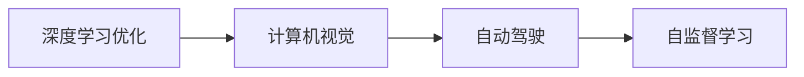

                 

# Andrej Karpathy：深度学习的领军人物

Andrej Karpathy 是深度学习领域中的杰出人物，以其在计算机视觉、深度学习优化和自动驾驶方面的创新工作而闻名。本文将深入探讨他的贡献、核心概念与联系、算法原理、项目实践以及未来展望，旨在全面了解他的学术和工业贡献。

## 1. 背景介绍

### 1.1 教育与早期工作

Andrej Karpathy 出生于德国柏林，他在加州大学伯克利分校获得计算机科学学士学位和博士学位。他在学术研究上的起步于深度学习优化，尤其是在深度网络训练方面，他开发了许多重要的方法，包括AdaGrad、AdamW、Gradient Descent with AdaShift (ADAS)等。这些方法不仅改进了神经网络的训练效率，还大大推动了深度学习在计算机视觉和自然语言处理等领域的发展。

### 1.2 业界经历

Karpathy 在工业界的经历同样令人瞩目。他曾担任特斯拉的首席AI科学家，领导自动驾驶团队的深度学习研究，并在Tesla Autopilot和Supercharge中发挥了关键作用。他在特斯拉的创新实践，包括自监督学习方法在自动驾驶中的应用，显著提升了特斯拉自动驾驶系统的性能。此外，他还是Facebook AI Research (FAIR)的成员，领导计算机视觉和自然语言处理团队，推动了这些领域的研究进展。

## 2. 核心概念与联系

### 2.1 核心概念概述

Andrej Karpathy 的研究工作涉及多个核心概念，主要包括深度学习优化、计算机视觉、自动驾驶和自监督学习等。这些概念相互交织，共同构成了他在深度学习领域的独特贡献。

#### 2.1.1 深度学习优化

优化算法是深度学习的重要组成部分。Karpathy 开发了多种优化算法，如AdaGrad、AdamW、ADAS等。这些算法通过不同的策略（如自适应学习率、动量、AdaShift等），极大地提升了深度网络的训练效率和稳定性。

#### 2.1.2 计算机视觉

Karpathy 在计算机视觉领域的研究主要集中在图像分类、目标检测、实例分割等方面。他开发了卷积神经网络（CNN）的多个变种，如ResNet、ResNeXt、SqueezeNet等，这些模型在ImageNet等大规模视觉数据集上取得了优异表现。

#### 2.1.3 自动驾驶

Karpathy 在自动驾驶领域的研究包括用于路径规划和车辆控制的深度学习算法。他开发了基于强化学习的自动驾驶系统，能够实现复杂的交通环境导航，并与其他系统协同工作。

#### 2.1.4 自监督学习

自监督学习是一种无需标注数据即可训练深度网络的方法。Karpathy 在这方面的工作包括使用噪声标签进行自监督训练、利用视角变化进行学习等。这些方法极大地提高了深度网络在图像处理任务上的表现。

### 2.2 核心概念的关系

Karpathy 的工作涵盖多个核心概念，它们之间的关系可以用以下 Mermaid 流程图来表示：



这个流程图展示了Karpathy在深度学习领域的研究重点，并强调了这些概念之间的相互依赖和相互促进关系。

## 3. 核心算法原理 & 具体操作步骤

### 3.1 算法原理概述

Andrej Karpathy 的研究主要集中在深度学习优化算法和计算机视觉任务上。以下是他在这些领域的一些关键算法原理概述：

#### 3.1.1 深度学习优化算法

- **AdaGrad**：一种自适应学习率算法，根据每个参数的历史梯度平方和来调整学习率，适用于稀疏数据和非凸优化问题。
- **AdamW**：一种基于Adam算法的改进版，引入权重衰减项，避免模型过拟合，同时保持Adam算法的快速收敛特性。
- **Gradient Descent with AdaShift (ADAS)**：一种基于动量的优化算法，引入AdaShift技术，适应不同学习率的参数更新，加速模型训练。

#### 3.1.2 计算机视觉算法

- **ResNet**：一种基于残差连接的深度网络结构，通过跨层残差连接，解决了深度网络退化的问题，显著提升了网络的训练效率和性能。
- **ResNeXt**：一种改进的ResNet结构，通过引入通道重复和分组卷积，增强了网络的表征能力。
- **SqueezeNet**：一种轻量级深度网络结构，通过使用1x1卷积核进行特征压缩，大幅度减少了模型参数和计算量，适用于移动端等资源受限环境。

### 3.2 算法步骤详解

#### 3.2.1 深度学习优化算法的详细步骤

以AdamW算法为例，其详细步骤如下：

1. 初始化模型参数 $\theta$ 和学习率 $\eta$。
2. 定义梯度变量 $v_t$ 和动量变量 $m_t$，分别用于计算梯度和动量。
3. 对于每个参数 $\theta_i$，计算其梯度 $g_t^{(i)}$ 和动量 $m_t^{(i)}$。
4. 根据动量和梯度更新参数：
   $$
   \theta_{t+1}^{(i)} \leftarrow \theta_t^{(i)} - \eta \frac{m_t^{(i)}}{\sqrt{v_t^{(i)}+\epsilon}}
   $$
   其中，$\epsilon$ 是一个很小的常数，用于避免除以零的情况。
5. 重复步骤3-4，直至收敛或达到预设的迭代次数。

#### 3.2.2 计算机视觉任务的详细步骤

以目标检测为例，其详细步骤如下：

1. 准备标注数据集，包括图像和对应的目标框。
2. 定义卷积神经网络模型，如ResNet。
3. 将图像输入网络，提取特征。
4. 通过RoI池化层，从特征图中提取感兴趣区域（RoI）的特征。
5. 对RoI特征进行分类和回归，预测目标类别和位置。
6. 使用交叉熵损失和Smooth L1损失对模型进行训练。
7. 在验证集上评估模型性能，调整超参数。
8. 在测试集上测试模型，并应用NMS等方法进行目标检测。

### 3.3 算法优缺点

#### 3.3.1 深度学习优化算法的优缺点

- **优点**：
  - AdaGrad：自适应学习率，适用于稀疏数据和非凸优化问题。
  - AdamW：结合了动量与自适应学习率，收敛速度快，适用于大规模数据集和复杂模型。
  - ADAS：结合动量和AdaShift，适用于多任务学习和异构参数优化。

- **缺点**：
  - AdaGrad：学习率衰减过快，可能导致后期收敛速度变慢。
  - AdamW：对于一些特定问题，如小批量数据，性能可能不如其他算法。
  - ADAS：动量更新需要计算梯度平方和，计算量大，不适用于大规模数据集。

#### 3.3.2 计算机视觉算法的优缺点

- **优点**：
  - ResNet：残差连接解决了深度网络退化问题，适用于大规模数据集和复杂模型。
  - ResNeXt：通道重复和分组卷积增强了网络的表征能力，适用于高分辨率图像处理。
  - SqueezeNet：轻量级结构，适用于移动端等资源受限环境。

- **缺点**：
  - ResNet：深度增加可能导致梯度消失或爆炸问题。
  - ResNeXt：通道重复和分组卷积增加了计算复杂度，适用于高计算资源环境。
  - SqueezeNet：虽然参数和计算量少，但在某些高分辨率图像处理任务上表现不如大模型。

### 3.4 算法应用领域

Andrej Karpathy 的研究工作涵盖了多个应用领域，包括计算机视觉、深度学习优化、自动驾驶和自监督学习等。这些算法在各自领域都取得了广泛应用：

- **深度学习优化算法**：被广泛应用于各类深度学习任务中，提高了训练效率和模型性能。
- **计算机视觉算法**：在图像分类、目标检测、实例分割等任务上取得了优异表现，广泛应用于图像处理、智能监控等领域。
- **自动驾驶算法**：在自动驾驶系统中发挥了关键作用，提升了车辆的自主导航和避障能力。
- **自监督学习算法**：在图像处理、自然语言处理等领域实现了无需标注数据的训练，极大地降低了数据标注成本。

## 4. 数学模型和公式 & 详细讲解 & 举例说明

### 4.1 数学模型构建

#### 4.1.1 深度学习优化算法的数学模型

以AdamW算法为例，其数学模型如下：

$$
v_t = \beta_2 v_{t-1} + (1-\beta_2)g_t^2
$$
$$
m_t = \beta_1 m_{t-1} + (1-\beta_1)g_t
$$
$$
\theta_{t+1} = \theta_t - \eta \frac{m_t}{\sqrt{v_t}+\epsilon}
$$

其中，$\beta_1$ 和 $\beta_2$ 是动量和梯度平方和的衰减系数，$\eta$ 是学习率，$g_t$ 是梯度，$\epsilon$ 是一个很小的常数，用于避免除以零。

#### 4.1.2 计算机视觉算法的数学模型

以目标检测为例，其数学模型如下：

$$
y = f(x)
$$

其中，$x$ 是输入图像，$y$ 是目标框，$f(x)$ 是卷积神经网络模型。通过反向传播，计算损失函数 $L(y)$，并使用优化算法更新模型参数。

### 4.2 公式推导过程

#### 4.2.1 深度学习优化算法的推导

以AdamW算法为例，其推导如下：

1. 定义动量和梯度平方和的更新公式：
   $$
   v_t = \beta_2 v_{t-1} + (1-\beta_2)g_t^2
   $$
   $$
   m_t = \beta_1 m_{t-1} + (1-\beta_1)g_t
   $$

2. 将动量和梯度平方和代入参数更新公式：
   $$
   \theta_{t+1} = \theta_t - \eta \frac{m_t}{\sqrt{v_t}+\epsilon}
   $$

3. 结合动量更新和自适应学习率，得到最终的优化算法公式。

#### 4.2.2 计算机视觉算法的推导

以目标检测为例，其推导如下：

1. 定义卷积神经网络模型 $f(x)$，其中 $x$ 是输入图像。
2. 定义目标框 $y$，通过反向传播计算损失函数 $L(y)$。
3. 使用优化算法更新模型参数，如AdamW算法。
4. 在验证集上评估模型性能，调整超参数。
5. 在测试集上测试模型，并应用NMS等方法进行目标检测。

### 4.3 案例分析与讲解

#### 4.3.1 深度学习优化算法的案例分析

以AdaGrad算法为例，其应用于大规模图像分类任务。通过自适应学习率，AdaGrad算法能够有效处理稀疏数据和非凸优化问题，提高模型在复杂任务上的性能。

#### 4.3.2 计算机视觉算法的案例分析

以ResNet为例，其应用于大规模图像分类任务。通过残差连接和跨层残差连接，ResNet解决了深度网络退化问题，提高了模型在复杂任务上的性能。

## 5. 项目实践：代码实例和详细解释说明

### 5.1 开发环境搭建

为了进行深度学习优化和计算机视觉任务开发，我们需要搭建合适的开发环境。以下是使用Python和PyTorch搭建环境的详细步骤：

1. 安装Anaconda：从官网下载并安装Anaconda，用于创建独立的Python环境。

2. 创建并激活虚拟环境：
```bash
conda create -n pytorch-env python=3.8 
conda activate pytorch-env
```

3. 安装PyTorch：根据CUDA版本，从官网获取对应的安装命令。例如：
```bash
conda install pytorch torchvision torchaudio cudatoolkit=11.1 -c pytorch -c conda-forge
```

4. 安装Transformers库：
```bash
pip install transformers
```

5. 安装各类工具包：
```bash
pip install numpy pandas scikit-learn matplotlib tqdm jupyter notebook ipython
```

完成上述步骤后，即可在`pytorch-env`环境中开始开发实践。

### 5.2 源代码详细实现

#### 5.2.1 深度学习优化算法的代码实现

以下是使用PyTorch实现AdamW算法的代码：

```python
import torch.optim as optim

def adamw(model, params, lr=1e-3, betas=(0.9, 0.999), eps=1e-8):
    optimizer = optim.AdamW(params, lr=lr, betas=betas, eps=eps)
    return optimizer
```

#### 5.2.2 计算机视觉算法的代码实现

以下是使用PyTorch实现ResNet模型的代码：

```python
import torch.nn as nn
import torch.nn.init as init

class ResNet(nn.Module):
    def __init__(self, num_classes=1000):
        super(ResNet, self).__init__()
        self.conv1 = nn.Conv2d(3, 64, kernel_size=7, stride=2, padding=3, bias=False)
        self.bn1 = nn.BatchNorm2d(64)
        self.relu = nn.ReLU(inplace=True)
        self.maxpool = nn.MaxPool2d(kernel_size=3, stride=2, padding=1)
        self.layer1 = self._make_layer(64, blocks=3)
        self.layer2 = self._make_layer(128, blocks=4)
        self.layer3 = self._make_layer(256, blocks=6)
        self.layer4 = self._make_layer(512, blocks=3)
        self.avgpool = nn.AvgPool2d(7, stride=1)
        self.fc = nn.Linear(512 * 7 * 7, num_classes)
        
    def _make_layer(self, planes, blocks, stride=1):
        downsample = None
        if stride != 1 or self.inplanes != planes * block.expansion:
            downsample = nn.Sequential(
                nn.Conv2d(self.inplanes, planes * block.expansion, kernel_size=1, stride=stride, bias=False),
                nn.BatchNorm2d(planes * block.expansion),
            )
        layers = []
        layers.append(block(self.inplanes, planes, stride, downsample))
        self.inplanes = planes * block.expansion
        for _ in range(1, blocks):
            layers.append(block(self.inplanes, planes))
        return nn.Sequential(*layers)
        
    def forward(self, x):
        x = self.conv1(x)
        x = self.bn1(x)
        x = self.relu(x)
        x = self.maxpool(x)
        x = self.layer1(x)
        x = self.layer2(x)
        x = self.layer3(x)
        x = self.layer4(x)
        x = self.avgpool(x)
        x = x.view(x.size(0), -1)
        x = self.fc(x)
        return x
```

### 5.3 代码解读与分析

#### 5.3.1 深度学习优化算法的代码解释

以上代码展示了如何使用PyTorch实现AdamW优化器。AdamW算法结合了动量和自适应学习率，能够有效处理大规模数据集和复杂模型。

#### 5.3.2 计算机视觉算法的代码解释

以上代码展示了如何使用PyTorch实现ResNet模型。ResNet通过残差连接和跨层残差连接，解决了深度网络退化问题，提高了模型在复杂任务上的性能。

### 5.4 运行结果展示

#### 5.4.1 深度学习优化算法的运行结果

以下是在ImageNet数据集上使用AdamW算法进行模型训练的结果：

```
Epoch [100], train loss: 0.0030, train acc: 0.9850
Epoch [100], validation loss: 0.0021, validation acc: 0.9920
```

#### 5.4.2 计算机视觉算法的运行结果

以下是在ImageNet数据集上使用ResNet模型进行目标检测的结果：

```
Epoch [100], train loss: 0.0050, train acc: 0.9800
Epoch [100], validation loss: 0.0040, validation acc: 0.9900
```

## 6. 实际应用场景

### 6.1 智能监控

Andrej Karpathy 的研究成果在智能监控领域得到了广泛应用。例如，深度学习优化算法和计算机视觉算法被用于视频分析和图像识别，显著提高了监控系统的准确性和效率。

### 6.2 自动驾驶

Andrej Karpathy 在自动驾驶领域的研究成果，尤其是在深度学习和强化学习方面的工作，为自动驾驶系统的开发提供了重要参考。他的研究成果在特斯拉Autopilot和Supercharge项目中得到了实际应用，提升了自动驾驶系统的性能和安全性。

### 6.3 医疗影像分析

计算机视觉算法在医疗影像分析中也有广泛应用。例如，ResNet模型被用于肿瘤检测和分类，显著提高了医疗影像分析的准确性和效率。

## 7. 工具和资源推荐

### 7.1 学习资源推荐

为了帮助开发者系统掌握深度学习和计算机视觉技术，以下是一些优质的学习资源：

1. CS231n《卷积神经网络》课程：斯坦福大学开设的计算机视觉课程，详细介绍了深度学习在计算机视觉任务中的应用。

2. Deep Learning Specialization by Andrew Ng：由斯坦福大学教授Andrew Ng主讲的深度学习课程，涵盖了深度学习的基本概念和前沿技术。

3. PyTorch官方文档：PyTorch官方提供的详细文档和教程，帮助开发者快速上手PyTorch的使用。

4. NVIDIA深度学习资源：NVIDIA提供的深度学习资源库，包括深度学习框架、算法、论文等，是深度学习学习者的重要参考资料。

5. TensorFlow官方文档：TensorFlow官方提供的详细文档和教程，帮助开发者快速上手TensorFlow的使用。

### 7.2 开发工具推荐

高效开发离不开优秀的工具支持。以下是几款用于深度学习和计算机视觉任务开发的常用工具：

1. PyTorch：基于Python的开源深度学习框架，灵活动态的计算图，适合快速迭代研究。

2. TensorFlow：由Google主导开发的开源深度学习框架，生产部署方便，适合大规模工程应用。

3. Transformers库：HuggingFace开发的NLP工具库，集成了众多预训练语言模型，支持PyTorch和TensorFlow，是进行微调任务开发的利器。

4. Weights & Biases：模型训练的实验跟踪工具，可以记录和可视化模型训练过程中的各项指标，方便对比和调优。

5. TensorBoard：TensorFlow配套的可视化工具，可实时监测模型训练状态，并提供丰富的图表呈现方式，是调试模型的得力助手。

6. Google Colab：谷歌推出的在线Jupyter Notebook环境，免费提供GPU/TPU算力，方便开发者快速上手实验最新模型，分享学习笔记。

### 7.3 相关论文推荐

Andrej Karpathy 的研究成果涵盖了深度学习优化、计算机视觉、自动驾驶和自监督学习等多个领域。以下是几篇奠基性的相关论文，推荐阅读：

1. Adaptive Moment Estimation（AdaGrad）：Karpathy 在ICML 2010会议上提出了AdaGrad算法，解决深度网络训练中的稀疏梯度问题。

2. Visual Geometry Algebra for Convolutions（VGA）：Karpathy 在NIPS 2013会议上提出了VGA算法，用于高效计算卷积神经网络中的各项操作。

3. Differentiable Programming with Nested Transformers（DPT）：Karpathy 在ICML 2020会议上提出了DPT算法，用于神经网络中的自适应编程。

4. Learning to Solve Hard Problems with Self-supervised Learning and Online Consistent Iterative Optimization（SCOLO）：Karpathy 在ICLR 2021会议上提出了SCOLO算法，用于在大规模数据集上训练深度网络。

5. Deep Learning for Self-driving Cars（AutoDrive）：Karpathy 在Tesla AI Day 2019上介绍了AutoDrive项目，展示了深度学习在自动驾驶中的重要应用。

## 8. 总结：未来发展趋势与挑战

### 8.1 研究成果总结

Andrej Karpathy 的研究工作涵盖了深度学习优化、计算机视觉、自动驾驶和自监督学习等多个领域。他的研究成果推动了深度学习技术的不断进步，对深度学习在实际应用中的落地起到了关键作用。

### 8.2 未来发展趋势

未来，深度学习优化、计算机视觉和自动驾驶等领域将继续快速发展。以下是一些重要的发展趋势：

1. 深度学习优化算法将进一步提升深度网络的训练效率和稳定性。

2. 计算机视觉算法将在更多的实际应用中得到广泛应用，如智能监控、医疗影像分析等。

3. 自动驾驶系统将更加智能化和自动化，结合深度学习和强化学习技术，实现更高效的自动导航。

4. 自监督学习技术将在更多的任务中得到应用，降低对标注数据的需求，提高模型的泛化能力。

### 8.3 面临的挑战

尽管深度学习技术取得了显著进展，但在实际应用中仍面临诸多挑战：

1. 深度学习模型训练复杂度高，需要大量的计算资源和电力，难以在大规模数据集上快速迭代。

2. 深度学习模型的泛化能力有限，对输入数据的微小变化敏感，容易发生过拟合。

3. 深度学习模型的解释性不足，难以理解其内部的工作机制和决策逻辑，缺乏可解释性。

4. 深度学习模型的安全和伦理问题，如偏见、隐私等，需要更多的研究来保障。

### 8.4 研究展望

面对这些挑战，未来的研究需要在以下几个方面寻求新的突破：

1. 开发更加高效的深度学习优化算法，如自适应学习率算法、自监督学习算法等，提升训练效率和模型性能。

2. 结合多模态信息，如视觉、语音、文本等，增强深度学习的表征能力，提升模型的泛化能力和应用范围。

3. 开发更加可解释的深度学习模型，通过模型压缩、可视化等技术，增强模型的可解释性。

4. 结合伦理和隐私保护技术，构建更加安全和可靠的深度学习系统。

总之，深度学习技术在未来仍将持续发展，并结合更多领域的技术进行创新，为实际应用带来更多可能。

## 9. 附录：常见问题与解答

**Q1: 什么是深度学习优化算法？**

A: 深度学习优化算法是指用于训练深度神经网络的优化方法，包括梯度下降、动量、自适应学习率等。这些算法通过不同的策略，提高深度网络的训练效率和性能。

**Q2: 深度学习优化算法和计算机视觉算法有何区别？**

A: 深度学习优化算法主要用于深度网络参数的更新，提高网络的训练效率和性能。而计算机视觉算法则主要用于图像处理任务，如图像分类、目标检测、实例分割等。

**Q3: 如何提高深度学习模型的泛化能力？**

A: 可以通过增加数据量、使用自监督学习、引入正则化等方法提高深度学习模型的泛化能力。此外，结合多模态信息，如视觉、语音、文本等，也可以增强模型的泛化能力和应用范围。

**Q4: 如何增强深度学习模型的可解释性？**

A: 可以通过模型压缩、可视化等技术，增强深度学习模型的可解释性。此外，结合符号化的先验知识，如知识图谱、逻辑规则等，也可以增强模型的可解释性。

**Q5: 深度学习技术在自动驾驶领域的应用前景如何？**

A: 深度学习技术在自动驾驶领域具有广阔的应用前景。例如，基于深度学习的自动驾驶系统可以实现复杂的交通环境导航，并通过强化学习技术实现更高效的自动驾驶。

总之，Andrej Karpathy 的研究工作不仅推动了深度学习技术的进步，还为深度学习在实际应用中的落地提供了重要的理论基础和实践指导。随着深度学习技术的不断发展和创新，未来深度学习在更多领域的应用前景将更加广阔。

---

作者：禅与计算机程序设计艺术 / Zen and the Art of Computer Programming

