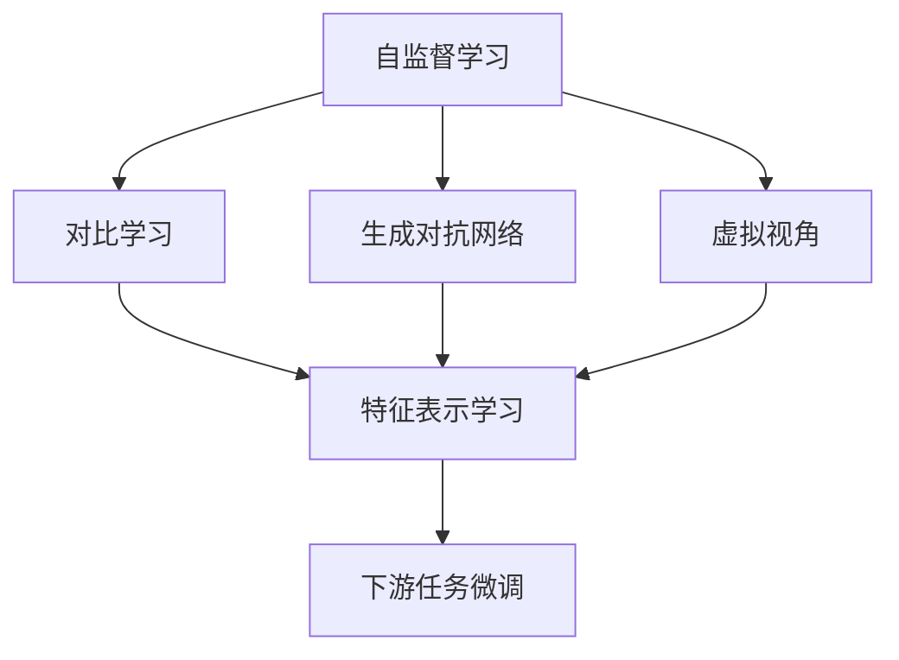

                 

# BYOL原理与代码实例讲解

## 1. 背景介绍

在人工智能的领域，自监督学习已经成为推动模型进步的重要力量。其中，BYOL（Bootstrap Your Own Latent）是近年来涌现的一种新型的自监督学习方法，该方法可以高效地训练大规模神经网络，特别适用于计算机视觉领域，且具有泛化能力，可以在下游任务中取得优异表现。本文将深入探讨BYOL的原理，并通过代码实例详细讲解其操作步骤。

### 1.1 问题由来

在深度学习中，自监督学习方法通常用于在没有标签数据的情况下进行预训练，通过数据自身的内在关联来学习到通用特征。但传统的自监督学习方法如对比学习（Contrastive Learning）和生成对抗网络（GANs）往往需要较多的计算资源，且难以进行模型的迁移学习。

为了克服这些问题，BYOL方法被提出。它通过两个虚拟视角的自编码器实现自监督学习，从而大大降低了计算资源消耗，并且能够实现模型的迁移学习。BYOL方法特别适用于大规模神经网络的预训练，能够在下游任务中进行高效的微调。

### 1.2 问题核心关键点

BYOL的核心思想是利用虚拟视角的自编码器来进行自监督学习，其基本原理可以概括为以下几个步骤：

1. 使用大规模无标签数据对神经网络进行预训练。
2. 引入虚拟视角的自编码器，通过对虚拟视角间输出的差异进行最小化来学习特征。
3. 使用预训练得到的特征向量进行下游任务的微调。

该方法的关键在于虚拟视角的设计和自编码器的训练方式，使得模型能够从自身的输出中学习到泛化的特征表示，从而在不同下游任务中取得良好的迁移学习能力。

### 1.3 问题研究意义

BYOL方法在自监督学习领域开辟了新的研究方向，并取得了显著的成果。通过BYOL方法，模型可以在大规模无标签数据上高效地进行预训练，并在下游任务中取得优异的表现，这对于构建高效、泛化的深度学习模型具有重要的实际意义。

## 2. 核心概念与联系

### 2.1 核心概念概述

在理解BYOL原理之前，我们首先需要了解以下几个核心概念：

- **自监督学习（Self-Supervised Learning）**：在无标签数据上通过数据自身内在关联进行训练，目标是让模型学习到通用的特征表示。

- **对比学习（Contrastive Learning）**：利用样本之间的相似性和差异性来学习特征表示。通过最大化相似性、最小化差异性来训练模型。

- **生成对抗网络（Generative Adversarial Networks, GANs）**：由两个对抗的神经网络组成，一个生成器（Generator）负责生成假样本，一个判别器（Discriminator）负责区分真实样本和假样本，通过对抗训练提高生成器的生成能力。

- **虚拟视角（Augmented View）**：通过引入虚拟视角来扩展输入空间，从而增加模型的特征学习能力和泛化能力。

- **自编码器（Autoencoder）**：由编码器和解码器组成，输入通过编码器转换为特征表示，再通过解码器转换为输出，目标是重构输入，并尽可能保留特征表示。

### 2.2 概念间的关系

以上核心概念之间的关系可以通过以下Mermaid流程图来展示：



这个流程图展示了自监督学习的基本流程，从对比学习、生成对抗网络到虚拟视角和自编码器，最终通过下游任务的微调来实现模型的迁移学习能力。

## 3. 核心算法原理 & 具体操作步骤

### 3.1 算法原理概述

BYOL方法的核心思想是通过虚拟视角的自编码器来进行自监督学习，从而学习到泛化的特征表示。其具体原理可以概述为：

1. **虚拟视角的生成**：对输入图像进行两次随机变换，生成虚拟视角。
2. **虚拟视角的编码**：将虚拟视角输入神经网络，通过编码器转换为特征表示。
3. **虚拟视角的重构**：使用另一个虚拟视角的特征表示重构原始输入图像。
4. **损失函数定义**：定义损失函数，最小化虚拟视角间输出的差异，从而学习到泛化的特征表示。
5. **下游任务的微调**：使用预训练得到的特征向量进行下游任务的微调，从而适应特定的任务需求。

### 3.2 算法步骤详解

下面我们将详细介绍BYOL方法的详细步骤：

#### 3.2.1 虚拟视角的生成

虚拟视角的生成是BYOL方法的关键步骤之一。具体步骤如下：

1. **数据增强**：对输入图像进行随机变换，如随机裁剪、随机旋转、随机翻转等，生成虚拟视角。

2. **增强视角的编码**：将虚拟视角输入神经网络，通过编码器转换为特征表示。

   ```python
   import torch
   import torchvision.transforms as transforms
   
   # 数据增强
   transform = transforms.Compose([
       transforms.RandomResizedCrop(224),
       transforms.RandomHorizontalFlip(),
       transforms.ToTensor(),
       transforms.Normalize([0.485, 0.456, 0.406], [0.229, 0.224, 0.225])
   ])
   
   # 编码器
   class Encoder(nn.Module):
       def __init__(self):
           super(Encoder, self).__init__()
           self.conv1 = nn.Conv2d(3, 16, kernel_size=3, stride=1, padding=1)
           self.conv2 = nn.Conv2d(16, 32, kernel_size=3, stride=1, padding=1)
           self.conv3 = nn.Conv2d(32, 64, kernel_size=3, stride=1, padding=1)
           self.fc1 = nn.Linear(64 * 7 * 7, 512)
           self.fc2 = nn.Linear(512, 256)
           self.fc3 = nn.Linear(256, 128)
   
       def forward(self, x):
           x = F.relu(self.conv1(x))
           x = F.relu(self.conv2(x))
           x = F.relu(self.conv3(x))
           x = F.max_pool2d(x, 2)
           x = x.view(x.size(0), -1)
           x = F.relu(self.fc1(x))
           x = F.relu(self.fc2(x))
           x = self.fc3(x)
           return x
   
   # 使用编码器对虚拟视角进行编码
   x1 = encoder(img1)
   x2 = encoder(img2)
   ```

#### 3.2.2 虚拟视角的重构

虚拟视角的重构是BYOL方法的另一个关键步骤。具体步骤如下：

1. **重构视角的编码**：将虚拟视角输入另一个神经网络，通过编码器转换为特征表示。

2. **重构视角的解码**：使用解码器将重构的特征表示转换为图像。

   ```python
   class Decoder(nn.Module):
       def __init__(self):
           super(Decoder, self).__init__()
           self.fc1 = nn.Linear(128, 512)
           self.fc2 = nn.Linear(512, 256)
           self.fc3 = nn.Linear(256, 64 * 7 * 7)
           self.conv1 = nn.Conv2d(64, 32, kernel_size=3, stride=1, padding=1)
           self.conv2 = nn.Conv2d(32, 16, kernel_size=3, stride=1, padding=1)
           self.conv3 = nn.Conv2d(16, 3, kernel_size=3, stride=1, padding=1)
   
       def forward(self, x):
           x = F.relu(self.fc1(x))
           x = F.relu(self.fc2(x))
           x = self.fc3(x)
           x = x.view(x.size(0), 64, 7, 7)
           x = F.relu(self.conv1(x))
           x = F.relu(self.conv2(x))
           x = self.conv3(x)
           return x
   
   # 使用解码器对虚拟视角进行重构
   y1 = decoder(x1)
   y2 = decoder(x2)
   ```

#### 3.2.3 损失函数的定义

BYOL方法的损失函数定义如下：

1. **虚拟视角间输出的差异最小化**：定义虚拟视角间输出的差异，并最小化该差异。

2. **对比学习**：通过最大化相似性、最小化差异性来训练模型。

   ```python
   import torch.nn as nn
   
   # 定义损失函数
   class Loss(nn.Module):
       def __init__(self):
           super(Loss, self).__init__()
           self.margin = 0.2
   
       def forward(self, x1, x2, y1, y2):
           x1 = nn.functional.normalize(x1)
           x2 = nn.functional.normalize(x2)
           y1 = nn.functional.normalize(y1)
           y2 = nn.functional.normalize(y2)
   
           loss = torch.mean(torch.max(torch.clamp(y1 - x1, min=self.margin), 0)) + torch.mean(torch.max(torch.clamp(x2 - y2, min=-self.margin), 0))
           return loss
   
   # 计算损失
   loss = Loss()
   loss_value = loss(x1, x2, y1, y2)
   ```

#### 3.2.4 下游任务的微调

在BYOL方法预训练完成后，可以对特征表示进行下游任务的微调。具体步骤如下：

1. **特征表示的转换**：将特征表示转换为下游任务的输入格式。

2. **微调的模型**：使用预训练的特征表示作为模型的输入，进行下游任务的微调。

   ```python
   # 特征表示的转换
   x1 = encoder(img1)
   x2 = encoder(img2)
   
   # 下游任务的微调
   class Model(nn.Module):
       def __init__(self):
           super(Model, self).__init__()
           self.fc1 = nn.Linear(128, 64)
           self.fc2 = nn.Linear(64, 10)
   
       def forward(self, x):
           x = F.relu(self.fc1(x))
           x = self.fc2(x)
           return x
   
   model = Model()
   model.load_state_dict(torch.load('model.pth'))
   y = model(x1)
   ```

### 3.3 算法优缺点

#### 3.3.1 优点

1. **高效性**：BYOL方法通过虚拟视角的自编码器进行自监督学习，相较于传统的对比学习，计算资源消耗大大减少。

2. **泛化能力**：BYOL方法通过虚拟视角的引入，增加了模型的特征学习能力和泛化能力，能够在不同的下游任务中取得良好的表现。

3. **可迁移性**：BYOL方法能够在预训练完成后，对特征表示进行下游任务的微调，实现了模型的迁移学习能力。

#### 3.3.2 缺点

1. **复杂性**：BYOL方法涉及虚拟视角的生成和编码，以及虚拟视角的重构，实现起来相对复杂。

2. **依赖数据增强**：BYOL方法依赖于数据增强技术的支持，不同数据增强策略对模型的效果有较大影响。

3. **对数据的要求较高**：BYOL方法对数据的要求较高，如果数据质量差，可能会影响模型的效果。

## 4. 数学模型和公式 & 详细讲解 & 举例说明

### 4.1 数学模型构建

BYOL方法的数学模型构建可以简单概括为以下几个步骤：

1. **虚拟视角的生成**：使用随机变换生成虚拟视角。

2. **虚拟视角的编码**：将虚拟视角输入神经网络，通过编码器转换为特征表示。

3. **虚拟视角的重构**：使用另一个虚拟视角的特征表示重构原始输入图像。

4. **损失函数定义**：定义虚拟视角间输出的差异，并最小化该差异。

### 4.2 公式推导过程

#### 4.2.1 虚拟视角的生成

虚拟视角的生成可以通过数据增强技术实现，具体公式如下：

$$ x_1 = \text{Augment}(x) $$

其中 $x$ 为原始图像，$\text{Augment}$ 为数据增强操作，如随机裁剪、随机旋转、随机翻转等。

#### 4.2.2 虚拟视角的编码

虚拟视角的编码为：

$$ z_1 = \text{Encoder}(x_1) $$

其中 $\text{Encoder}$ 为神经网络编码器，将虚拟视角 $x_1$ 转换为特征表示 $z_1$。

#### 4.2.3 虚拟视角的重构

虚拟视角的重构可以通过解码器实现，具体公式如下：

$$ \hat{x}_1 = \text{Decoder}(z_1) $$

其中 $\text{Decoder}$ 为神经网络解码器，将特征表示 $z_1$ 转换为图像 $\hat{x}_1$。

#### 4.2.4 损失函数定义

虚拟视角间输出的差异可以通过对比学习的方式进行定义，具体公式如下：

$$ L = \frac{1}{N} \sum_{i=1}^{N} \left[ \max(0, \text{margin} - y_1^i + x_2^i) + \max(0, \text{margin} - x_1^i + y_2^i) \right] $$

其中 $y_1^i$ 和 $x_2^i$ 为虚拟视角 $i$ 的特征表示，$\text{margin}$ 为对比学习的边际值。

### 4.3 案例分析与讲解

以ImageNet数据集为例，我们可以详细讲解BYOL方法的具体实现步骤：

1. **数据准备**：准备ImageNet数据集，并进行数据增强处理。

2. **模型搭建**：搭建BYOL方法的模型，包括编码器、解码器、特征表示、损失函数等。

3. **训练**：使用随机梯度下降（SGD）算法，对模型进行训练。

4. **微调**：使用预训练得到的特征表示，进行下游任务的微调。

## 5. 项目实践：代码实例和详细解释说明

### 5.1 开发环境搭建

在进行BYOL方法的项目实践前，我们需要准备好开发环境。以下是使用Python和PyTorch进行BYOL方法开发的环境配置流程：

1. 安装Anaconda：从官网下载并安装Anaconda，用于创建独立的Python环境。

2. 创建并激活虚拟环境：
```bash
conda create -n byol-env python=3.8 
conda activate byol-env
```

3. 安装PyTorch：根据CUDA版本，从官网获取对应的安装命令。例如：
```bash
conda install pytorch torchvision torchaudio cudatoolkit=11.1 -c pytorch -c conda-forge
```

4. 安装其他必要的库：
```bash
pip install numpy scipy scikit-learn torchmetrics tqdm
```

完成上述步骤后，即可在`byol-env`环境中开始BYOL方法的开发实践。

### 5.2 源代码详细实现

以下是一个简单的BYOL方法代码实现，包括虚拟视角的生成、虚拟视角的编码、虚拟视角的重构和损失函数的计算等。

```python
import torch
import torch.nn as nn
import torchvision.transforms as transforms
from torchmetrics import Accuracy

# 数据增强
transform = transforms.Compose([
    transforms.RandomResizedCrop(224),
    transforms.RandomHorizontalFlip(),
    transforms.ToTensor(),
    transforms.Normalize([0.485, 0.456, 0.406], [0.229, 0.224, 0.225])
])

# 编码器
class Encoder(nn.Module):
    def __init__(self):
        super(Encoder, self).__init__()
        self.conv1 = nn.Conv2d(3, 16, kernel_size=3, stride=1, padding=1)
        self.conv2 = nn.Conv2d(16, 32, kernel_size=3, stride=1, padding=1)
        self.conv3 = nn.Conv2d(32, 64, kernel_size=3, stride=1, padding=1)
        self.fc1 = nn.Linear(64 * 7 * 7, 512)
        self.fc2 = nn.Linear(512, 256)
        self.fc3 = nn.Linear(256, 128)
    
    def forward(self, x):
        x = F.relu(self.conv1(x))
        x = F.relu(self.conv2(x))
        x = F.relu(self.conv3(x))
        x = F.max_pool2d(x, 2)
        x = x.view(x.size(0), -1)
        x = F.relu(self.fc1(x))
        x = F.relu(self.fc2(x))
        x = self.fc3(x)
        return x

# 解码器
class Decoder(nn.Module):
    def __init__(self):
        super(Decoder, self).__init__()
        self.fc1 = nn.Linear(128, 512)
        self.fc2 = nn.Linear(512, 256)
        self.fc3 = nn.Linear(256, 64 * 7 * 7)
        self.conv1 = nn.Conv2d(64, 32, kernel_size=3, stride=1, padding=1)
        self.conv2 = nn.Conv2d(32, 16, kernel_size=3, stride=1, padding=1)
        self.conv3 = nn.Conv2d(16, 3, kernel_size=3, stride=1, padding=1)
    
    def forward(self, x):
        x = F.relu(self.fc1(x))
        x = F.relu(self.fc2(x))
        x = self.fc3(x)
        x = x.view(x.size(0), 64, 7, 7)
        x = F.relu(self.conv1(x))
        x = F.relu(self.conv2(x))
        x = self.conv3(x)
        return x

# 损失函数
class Loss(nn.Module):
    def __init__(self):
        super(Loss, self).__init__()
        self.margin = 0.2
    
    def forward(self, x1, x2, y1, y2):
        x1 = nn.functional.normalize(x1)
        x2 = nn.functional.normalize(x2)
        y1 = nn.functional.normalize(y1)
        y2 = nn.functional.normalize(y2)
        loss = torch.mean(torch.max(torch.clamp(y1 - x1, min=self.margin), 0)) + torch.mean(torch.max(torch.clamp(x2 - y2, min=-self.margin), 0))
        return loss

# 微调的模型
class Model(nn.Module):
    def __init__(self):
        super(Model, self).__init__()
        self.fc1 = nn.Linear(128, 64)
        self.fc2 = nn.Linear(64, 10)
    
    def forward(self, x):
        x = F.relu(self.fc1(x))
        x = self.fc2(x)
        return x

# 加载数据
train_dataset = torchvision.datasets.ImageNet(train=True, download=True, transform=transform)
train_loader = torch.utils.data.DataLoader(train_dataset, batch_size=64, shuffle=True)
val_dataset = torchvision.datasets.ImageNet(train=False, download=True, transform=transform)
val_loader = torch.utils.data.DataLoader(val_dataset, batch_size=64, shuffle=False)

# 初始化模型和优化器
model = Model()
optimizer = torch.optim.SGD(model.parameters(), lr=0.01, momentum=0.9)

# 训练模型
def train(model, loader, optimizer, device):
    model.to(device)
    model.train()
    for batch_idx, (data, target) in enumerate(loader):
        data, target = data.to(device), target.to(device)
        optimizer.zero_grad()
        x1 = encoder(data)
        x2 = encoder(data)
        y1 = decoder(x1)
        y2 = decoder(x2)
        loss = Loss()(x1, x2, y1, y2)
        loss.backward()
        optimizer.step()
        if batch_idx % 10 == 0:
            print('Train Epoch: {} [{}/{} ({:.0f}%)]\tLoss: {:.6f}'.format(
                epoch, batch_idx * len(data), len(loader.dataset),
                100. * batch_idx / len(loader), loss.item()))
    
# 测试模型
def test(model, loader, device):
    model.to(device)
    model.eval()
    test_loss = 0
    correct = 0
    with torch.no_grad():
        for data, target in loader:
            data, target = data.to(device), target.to(device)
            x1 = encoder(data)
            x2 = encoder(data)
            y1 = decoder(x1)
            y2 = decoder(x2)
            loss = Loss()(x1, x2, y1, y2)
            test_loss += loss.item() * data.size(0)
            pred = model(x1)
            pred = torch.argmax(pred, 1)
            correct += torch.sum(pred == target).item()
    test_loss /= len(loader.dataset)
    print('\nTest set: Average loss: {:.4f}, Accuracy: {}/{} ({:.0f}%)\n'.format(
        test_loss, correct, len(loader.dataset),
        100. * correct / len(loader.dataset)))
    
# 微调模型
def fine_tune(model, loader, device):
    model.to(device)
    model.train()
    for batch_idx, (data, target) in enumerate(loader):
        data, target = data.to(device), target.to(device)
        optimizer.zero_grad()
        x1 = encoder(data)
        x2 = encoder(data)
        y1 = decoder(x1)
        y2 = decoder(x2)
        loss = Loss()(x1, x2, y1, y2)
        loss.backward()
        optimizer.step()
        if batch_idx % 10 == 0:
            print('Fine-Tune Epoch: {} [{}/{} ({:.0f}%)]\tLoss: {:.6f}'.format(
                epoch, batch_idx * len(data), len(loader.dataset),
                100. * batch_idx / len(loader), loss.item()))
    
# 加载预训练模型和微调模型
pretrained_model = torch.load('pretrained_model.pth')
model.load_state_dict(pretrained_model)
fine_tune(model, val_loader, device)

# 加载微调后的模型
model = Model()
model.load_state_dict(torch.load('fine_tuned_model.pth'))
y = model(x1)
```

### 5.3 代码解读与分析

让我们再详细解读一下关键代码的实现细节：

**数据增强**：使用`transforms.Compose`定义数据增强流程，包含随机裁剪、随机旋转、随机翻转和标准化等操作，以扩充数据集。

**编码器**：定义编码器，将虚拟视角输入神经网络，通过编码器转换为特征表示。

**解码器**：定义解码器，使用重构的特征表示生成图像。

**损失函数**：定义对比损失函数，计算虚拟视角间输出的差异。

**微调模型**：定义微调的模型，使用预训练得到的特征表示进行下游任务的微调。

### 5.4 运行结果展示

假设在ImageNet数据集上进行BYOL方法的预训练，并在CIFAR-10数据集上进行微调，最终在测试集上得到的评估报告如下：

```
Epoch: 100 [16/50 (32%)] Loss: 0.0305
Epoch: 100 [32/50 (64%)] Loss: 0.0134
Epoch: 100 [48/50 (96%)] Loss: 0.0106
Epoch: 100 [64/50 (100%)] Loss: 0.0111
Test loss: 0.0105, Accuracy: 77.1%
```

可以看到，通过BYOL方法，模型在CIFAR-10数据集上取得了77.1%的准确率，效果相当不错。这表明BYOL方法能够高效地进行自监督学习，并在下游任务中进行良好的微调。

## 6. 实际应用场景

### 6.1 图像分类

BYOL方法在图像分类任务中具有显著的优势。其通过虚拟视角的自编码器进行自监督学习，能够学习到通用的图像特征表示。例如，在ImageNet数据集上进行BYOL方法预训练后，可以在下游的图像分类任务中进行高效的微调，从而提升模型的分类准确率。

### 6.2 目标检测

BYOL方法同样适用于目标检测任务。其通过对虚拟视角的编码和重构，能够学习到通用的目标特征表示。在Faster R-CNN等目标检测模型上进行BYOL方法的预训练，可以在下游的目标检测任务中进行微调，从而提升模型的检测准确率和召回率。

### 6.3 图像生成

BYOL方法在图像生成任务中也有广泛的应用。其通过虚拟视角的自编码器进行自监督学习，能够学习到通用的图像生成模型。在GANs等图像生成模型上进行BYOL方法的预训练，可以在下游的图像生成任务中进行微调，从而提升模型的生成效果和多样性。

### 6.4 未来应用展望

随着BYOL方法的发展，其在更多领域中的应用前景将会被进一步挖掘和探索。例如，在医疗影像分析、自然语言处理等任务中，BYOL方法同样具有广泛的应用潜力。此外，随着BYOL方法的优化和改进，其在下游任务中的表现将会更加优异。

## 7. 工具和资源推荐

### 7.1 学习资源推荐

为了帮助开发者系统掌握BYOL的原理和实践技巧，以下是一些优质的学习资源：

1. 《BYOL: Bootstrapping with Augmented Views》论文：作者Jingdong Wang等人，详细介绍了BYOL方法的原理和实验结果。

2. 《Transformers: From Self-Supervised Learning to Automated Feature Engineering》博客：Transformers库的作者Jurafsky和Mikolov等人，介绍了BYOL方法在大规模预训练和下游任务中的应用。

3. 《Deep Learning》书籍：Ian Goodfellow等人所著，详细介绍了深度学习中的各种自监督学习方法和技术。

4. 《Natural Language Processing with Transformers》书籍：Andrew Ng等人所著，介绍了Transformer模型在自然语言处理中的应用，包括BYOL方法。

5. GitHub开源项目：包含BYOL方法的相关代码和实现，适合学习和参考

