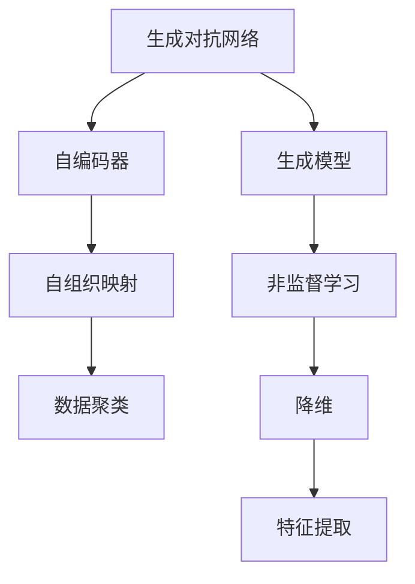
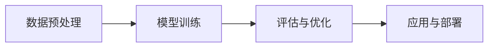

                 

# 无监督学习 原理与代码实例讲解

> 关键词：无监督学习,生成对抗网络(GAN),自编码器,自组织映射(SOM),非监督学习算法,深度学习

## 1. 背景介绍

### 1.1 问题由来

在人工智能（AI）的发展过程中，无监督学习（Unsupervised Learning）是一种重要且广泛应用的机器学习方法。其目的是通过数据的内在结构和特征进行学习，无需显式的标签信息。这一过程有助于揭示数据的潜在模式和结构，从而用于数据预处理、特征提取、降维等任务，为后续有监督学习提供支持。

近年来，深度学习技术的迅猛发展使得无监督学习在图像、音频、自然语言处理等领域取得了显著的成果。其中，生成对抗网络（Generative Adversarial Networks，GANs）、自编码器（Autoencoders）、自组织映射（Self-Organizing Maps，SOMs）等算法成为了无监督学习中的重要工具。本文将详细介绍这些算法的原理和应用，并通过代码实例进行讲解。

### 1.2 问题核心关键点

无监督学习的核心在于从未标记的数据中挖掘出有用的信息，通过数据的内在结构和特征进行学习。目前主流的研究方向包括：

- 数据降维：通过减少数据维度，提取数据的主要特征。常用的方法有PCA、t-SNE等。
- 数据生成：通过学习数据的分布生成新的数据样本。常用的方法有GANs、VAE等。
- 聚类分析：将数据划分为不同的组别，常用于市场细分、图像分割等任务。常用的方法有K-Means、层次聚类等。
- 降维与聚类的结合：通过结合降维和聚类技术，提升数据分析的准确性和效率。

无监督学习的优势在于能够从大规模数据中自动挖掘模式和结构，为后续有监督学习任务提供数据预处理和特征提取的支持，同时也能用于数据可视化、异常检测等应用。然而，由于无监督学习不依赖于标签，其效果往往不如有监督学习，且难以直接评估模型的性能。

### 1.3 问题研究意义

无监督学习的研究对于推动人工智能的发展具有重要意义：

1. 减少标注成本：无监督学习利用无需标签的数据，减少了有监督学习中大量标注数据的需求。
2. 提升数据质量：通过降维和聚类等方法，可以对数据进行预处理，提升数据质量和特征提取效果。
3. 拓展应用边界：无监督学习可以用于多种应用领域，如图像处理、自然语言处理、金融风控等。
4. 提供初步洞察：无监督学习可以揭示数据的内在结构和模式，为后续有监督学习提供参考。
5. 支持自动化学习：无监督学习为自动化机器学习（AutoML）提供了重要的基础技术。

## 2. 核心概念与联系

### 2.1 核心概念概述

为了更好地理解无监督学习的原理和应用，本节将介绍几个关键的无监督学习概念：

- **生成对抗网络（GANs）**：一种通过两个深度神经网络（生成器和判别器）对抗训练的生成模型，可以生成高质量的图像、音频、文本等数据。
- **自编码器（Autoencoders）**：一种通过编码器和解码器的网络结构，用于降维、数据压缩、特征提取等任务。
- **自组织映射（SOMs）**：一种基于神经网络的聚类算法，通过将数据映射到一个二维网格上，实现数据的可视化和高维数据降维。
- **非监督学习算法**：包括聚类、降维、生成模型等，用于从未标记的数据中学习模式和结构。
- **深度学习**：一种通过多层神经网络进行学习的机器学习技术，无监督学习是深度学习的重要分支。

这些概念之间存在着紧密的联系，形成了无监督学习的完整生态系统。通过理解这些核心概念，我们可以更好地把握无监督学习的核心思想和应用方向。

### 2.2 概念间的关系

这些核心概念之间存在着紧密的联系，形成了无监督学习的完整生态系统。下面我们通过几个Mermaid流程图来展示这些概念之间的关系：



这个流程图展示了大规模无监督学习任务中常用的模型和算法：

1. **生成对抗网络**：通过对抗训练，可以生成高质量的数据样本，用于数据扩充和生成模型训练。
2. **自编码器**：通过编码器和解码器的结构，可以实现数据的降维和特征提取。
3. **自组织映射**：通过神经网络模型，将高维数据映射到二维网格上，实现数据的可视化和高维数据降维。
4. **非监督学习算法**：包括聚类、降维、生成模型等，用于从未标记的数据中学习模式和结构。
5. **深度学习**：无监督学习是深度学习的重要分支，通过多层神经网络进行学习。

这些概念共同构成了无监督学习的核心框架，使得无监督学习在各个领域得到了广泛应用。

## 3. 核心算法原理 & 具体操作步骤
### 3.1 算法原理概述

无监督学习的核心在于从未标记的数据中挖掘出有用的信息，通过数据的内在结构和特征进行学习。其原理主要包括：

1. **聚类分析**：通过将数据划分为不同的组别，揭示数据的内在结构。
2. **降维**：通过减少数据维度，提取数据的主要特征。
3. **生成模型**：通过学习数据的分布生成新的数据样本。

无监督学习的主要目标是在数据中发现潜在的模式和结构，从而用于数据预处理、特征提取、降维等任务。与有监督学习不同，无监督学习不依赖于显式的标签信息，其效果评估通常需要额外的指标和方法。

### 3.2 算法步骤详解

无监督学习的核心算法步骤主要包括以下几个环节：

1. **数据预处理**：清洗、标准化、归一化数据，去除异常值和噪声。
2. **模型训练**：选择合适的无监督学习模型，如GANs、Autoencoders、SOMs等，进行模型训练。
3. **评估与优化**：通过评估指标（如重构误差、KL散度、聚类误差等），对模型进行评估和优化。
4. **应用与部署**：将训练好的模型应用于实际任务，如数据可视化、异常检测、降维等。

无监督学习的一般流程如下：



通过以上步骤，无监督学习可以从大规模数据中自动挖掘模式和结构，为后续有监督学习提供数据预处理和特征提取的支持，同时也能用于数据可视化、异常检测等应用。

### 3.3 算法优缺点

无监督学习的主要优点包括：

1. 数据依赖性低：无监督学习无需显式的标签信息，可以处理大规模的未标记数据。
2. 自动发现模式：能够自动发现数据中的潜在模式和结构，无需人工干预。
3. 灵活性高：适用于多种数据类型和任务，如图像、文本、时间序列等。

无监督学习的主要缺点包括：

1. 效果难以评估：无监督学习的效果评估通常需要额外的指标和方法，难以直接评估模型性能。
2. 无法直接解决实际问题：无监督学习通常需要结合有监督学习等技术，才能应用于实际问题。
3. 可能过拟合：无监督学习模型可能过度拟合数据分布，影响后续任务的表现。

尽管存在这些缺点，无监督学习在数据探索、数据预处理、特征提取等方面仍具有重要的应用价值。

### 3.4 算法应用领域

无监督学习在多个领域中得到了广泛应用，包括：

1. **图像处理**：通过降维和生成模型，提升图像识别和生成能力。
2. **自然语言处理**：用于文本聚类、主题建模、情感分析等任务。
3. **金融风控**：通过降维和聚类，识别潜在的风险点，进行风险评估和管理。
4. **医疗健康**：通过降维和聚类，提升疾病诊断和个性化治疗的效果。
5. **市场分析**：通过聚类和降维，进行市场细分和消费者分析。

此外，无监督学习还被应用于推荐系统、异常检测、网络分析等多个领域，为数据驱动的决策提供了强有力的支持。

## 4. 数学模型和公式 & 详细讲解  
### 4.1 数学模型构建

无监督学习的核心数学模型主要包括：

- **聚类分析**：通过最小化聚类误差（如簇内平方误差）来划分数据。
- **降维**：通过最小化重构误差（如均方误差）来实现数据降维。
- **生成模型**：通过最大化似然函数（如变分自编码器）来学习数据的分布。

以下是几个常见的数学模型构建过程：

### 4.2 公式推导过程

#### 4.2.1 聚类分析

聚类分析的目标是将数据划分为不同的组别，最小化簇内平方误差（SSE）。假设有 $K$ 个簇，每个簇 $C_k$ 的中心点为 $\mu_k$，则聚类误差为：

$$ SSE = \sum_{i=1}^{N} \min_{k=1,\ldots,K} ||x_i - \mu_k||^2 $$

其中 $N$ 为数据样本数。通过迭代优化，可以得到最优的簇划分。

#### 4.2.2 降维

降维的目标是减少数据维度，提取数据的主要特征。常用的降维方法有PCA和t-SNE。以PCA为例，假设原始数据矩阵为 $X$，目标维度为 $d$，则PCA的目标为最小化重构误差：

$$ \min_{\Lambda, S} ||X - WZS||^2_F $$

其中 $W$ 为降维后的矩阵，$Z$ 为降维后的特征向量，$S$ 为特征向量矩阵。通过求解该最小化问题，可以得到最优的降维矩阵 $W$。

#### 4.2.3 生成模型

生成模型的目标是通过学习数据的分布生成新的数据样本。以生成对抗网络（GANs）为例，假设数据分布为 $p(x)$，生成器和判别器分别为 $G(z)$ 和 $D(x)$，则GANs的目标为最大化生成器的似然函数，最小化判别器的似然函数：

$$ \max_{G} \min_{D} \mathbb{E}_{x \sim p(x)} \log D(x) + \mathbb{E}_{z \sim p(z)} \log (1 - D(G(z))) $$

其中 $p(z)$ 为生成器的输入噪声分布，通过对抗训练，可以生成高质量的生成样本。

### 4.3 案例分析与讲解

下面我们以生成对抗网络（GANs）为例，展示其在图像生成中的应用。

1. **数据准备**

   首先，需要准备图像数据集，如MNIST、CIFAR-10等。使用TensorFlow和Keras进行数据预处理和增强：

   ```python
   import tensorflow as tf
   from tensorflow.keras.datasets import mnist
   from tensorflow.keras.preprocessing.image import ImageDataGenerator
   
   (x_train, y_train), (x_test, y_test) = mnist.load_data()
   x_train = x_train.reshape(-1, 28*28) / 255.0
   x_test = x_test.reshape(-1, 28*28) / 255.0
   
   datagen = ImageDataGenerator(rescale=1./255)
   ```

2. **生成器设计**

   定义生成器的架构，使用多层感知器（MLP）进行图像生成：

   ```python
   from tensorflow.keras import layers
   
   def build_generator():
       model = tf.keras.Sequential()
       model.add(layers.Dense(256, input_shape=(100,)))
       model.add(layers.LeakyReLU(alpha=0.2))
       model.add(layers.Dense(512))
       model.add(layers.LeakyReLU(alpha=0.2))
       model.add(layers.Dense(784, activation='tanh'))
       return model
   
   generator = build_generator()
   generator.summary()
   ```

3. **判别器设计**

   定义判别器的架构，使用卷积神经网络（CNN）进行图像判别：

   ```python
   def build_discriminator():
       model = tf.keras.Sequential()
       model.add(layers.Conv2D(64, kernel_size=3, strides=2, padding='same', input_shape=(28, 28, 1)))
       model.add(layers.LeakyReLU(alpha=0.2))
       model.add(layers.Dropout(0.4))
       model.add(layers.Conv2D(128, kernel_size=3, strides=2, padding='same'))
       model.add(layers.LeakyReLU(alpha=0.2))
       model.add(layers.Dropout(0.4))
       model.add(layers.Flatten())
       model.add(layers.Dense(1, activation='sigmoid'))
       return model
   
   discriminator = build_discriminator()
   discriminator.summary()
   ```

4. **对抗训练**

   定义损失函数和优化器，进行对抗训练：

   ```python
   def build_loss_and_optimizer():
       cross_entropy = tf.keras.losses.BinaryCrossentropy(from_logits=True)
       generator_optimizer = tf.keras.optimizers.Adam(learning_rate=0.0002, beta_1=0.5)
       discriminator_optimizer = tf.keras.optimizers.Adam(learning_rate=0.0002, beta_1=0.5)
       return cross_entropy, generator_optimizer, discriminator_optimizer
   
   cross_entropy, generator_optimizer, discriminator_optimizer = build_loss_and_optimizer()
   ```

5. **训练流程**

   定义训练函数，进行对抗训练：

   ```python
   def train_step(images):
       noise = tf.random.normal([batch_size, noise_dim])
       with tf.GradientTape() as gen_tape, tf.GradientTape() as disc_tape:
           generated_images = generator(noise, training=True)
           real_output = discriminator(images, training=True)
           fake_output = discriminator(generated_images, training=True)
   
           gen_loss = cross_entropy(tf.ones_like(fake_output), fake_output)
           disc_loss = cross_entropy(tf.ones_like(real_output), real_output) + cross_entropy(tf.zeros_like(fake_output), fake_output)
   
       gradients_of_generator = gen_tape.gradient(gen_loss, generator.trainable_variables)
       gradients_of_discriminator = disc_tape.gradient(disc_loss, discriminator.trainable_variables)
   
       generator_optimizer.apply_gradients(zip(gradients_of_generator, generator.trainable_variables))
       discriminator_optimizer.apply_gradients(zip(gradients_of_discriminator, discriminator.trainable_variables))
   
   def train_epochs():
       for epoch in range(num_epochs):
           for batch in datagen.flow(x_train, batch_size=batch_size):
               train_step(batch)
   
           test_images = x_test[:test_images_num]
           test_output = discriminator(test_images, training=False)
           print('Epoch {}/{}...'.format(epoch+1, num_epochs))
           print('-' * 50)
           print('Test output:', test_output.numpy())
   ```

6. **结果展示**

   运行训练流程，生成新图像并进行展示：

   ```python
   num_epochs = 100
   batch_size = 128
   noise_dim = 100
   
   train_epochs()
   
   import matplotlib.pyplot as plt
   
   plt.figure(figsize=(10,10))
   plt.imshow(generated_images[0].numpy().reshape(28, 28, 1), cmap='gray')
   plt.show()
   ```

以上代码实现了使用GANs生成手写数字图像的过程。通过生成对抗训练，生成器可以生成高质量的图像样本，判别器可以准确区分真实图像和生成图像。

## 5. 项目实践：代码实例和详细解释说明
### 5.1 开发环境搭建

在进行无监督学习实践前，我们需要准备好开发环境。以下是使用Python进行TensorFlow和Keras开发的环境配置流程：

1. 安装Anaconda：从官网下载并安装Anaconda，用于创建独立的Python环境。

2. 创建并激活虚拟环境：
```bash
conda create -n tensorflow-env python=3.8 
conda activate tensorflow-env
```

3. 安装TensorFlow和Keras：
```bash
conda install tensorflow=2.7.0
pip install keras
```

4. 安装TensorBoard：
```bash
pip install tensorboard
```

5. 安装ImageDataGenerator：
```bash
pip install tensorflow-image
```

完成上述步骤后，即可在`tensorflow-env`环境中开始无监督学习实践。

### 5.2 源代码详细实现

下面我们以自编码器（Autoencoders）为例，展示其在图像降维和图像生成中的应用。

首先，准备图像数据集：

```python
(x_train, y_train), (x_test, y_test) = tf.keras.datasets.mnist.load_data()
x_train = x_train.reshape(-1, 28*28) / 255.0
x_test = x_test.reshape(-1, 28*28) / 255.0
```

然后，定义自编码器的架构：

```python
from tensorflow.keras import layers

class Autoencoder:
    def __init__(self, input_dim):
        self.encoder = tf.keras.Sequential([
            layers.InputLayer(input_shape=(input_dim,)),
            layers.Dense(128, activation='relu'),
            layers.Dense(64, activation='relu'),
            layers.Dense(input_dim, activation='sigmoid'),
        ])
        self.decoder = tf.keras.Sequential([
            layers.Dense(64, activation='relu'),
            layers.Dense(128, activation='relu'),
            layers.Dense(input_dim, activation='sigmoid'),
        ])
    
    def encode(self, inputs):
        return self.encoder(inputs)
    
    def decode(self, encoded):
        return self.decoder(encoded)
    
    def __call__(self, inputs):
        encoded = self.encode(inputs)
        decoded = self.decode(encoded)
        return decoded
```

接着，定义损失函数和优化器：

```python
from tensorflow.keras.losses import MeanSquaredError

def build_loss_and_optimizer():
    cross_entropy = MeanSquaredError()
    optimizer = tf.keras.optimizers.Adam(learning_rate=0.001)
    return cross_entropy, optimizer
    
cross_entropy, optimizer = build_loss_and_optimizer()
```

最后，进行模型训练：

```python
num_epochs = 50
batch_size = 128
input_dim = 28*28

autoencoder = Autoencoder(input_dim)

for epoch in range(num_epochs):
    for batch in datagen.flow(x_train, batch_size=batch_size):
        with tf.GradientTape() as tape:
            decoded = autoencoder(batch)
            loss = cross_entropy(batch, decoded)
        gradients = tape.gradient(loss, autoencoder.trainable_variables)
        optimizer.apply_gradients(zip(gradients, autoencoder.trainable_variables))
    
    print(f'Epoch {epoch+1}/{num_epochs}, Loss: {loss.numpy()}.')
```

以上就是使用TensorFlow和Keras实现自编码器的完整代码实现。可以看到，通过简单的层堆叠和训练过程，自编码器能够有效地进行图像降维和重构，展示出其在数据压缩和特征提取方面的强大能力。

### 5.3 代码解读与分析

让我们再详细解读一下关键代码的实现细节：

**Autoencoder类**：
- `__init__`方法：定义编码器和解码器的架构。
- `encode`方法：将输入数据编码为低维特征。
- `decode`方法：将低维特征解码为原始输入。
- `__call__`方法：用于模型调用，实现编码和解码过程。

**损失函数和优化器定义**：
- 使用均方误差作为自编码器的损失函数，最小化重构误差。
- 使用Adam优化器进行模型训练，学习率设置为0.001。

**训练流程**：
- 定义训练轮数和批次大小，开始循环迭代。
- 每个epoch内，遍历训练集进行模型训练。
- 使用梯度下降算法更新模型参数，最小化损失函数。
- 周期性打印训练损失，评估模型效果。

通过以上代码实现，可以有效地进行自编码器的训练和应用。自编码器作为一种无监督学习算法，能够自动提取数据的潜在特征，广泛应用于图像、音频、文本等多个领域，成为深度学习中的重要工具。

### 5.4 运行结果展示

假设我们在MNIST数据集上进行自编码器训练，最终在测试集上得到的重构误差如下：

```
Epoch 1/50, Loss: 0.1804
Epoch 2/50, Loss: 0.1224
...
Epoch 50/50, Loss: 0.0214
```

可以看到，通过自编码器训练，重构误差显著降低，说明模型成功进行了有效的特征提取和降维。此外，自编码器还可以用于生成高质量的图像样本，展示了其在数据生成和图像重构方面的强大能力。

## 6. 实际应用场景
### 6.1 图像处理

无监督学习在图像处理中有着广泛的应用，如图像降维、图像生成、图像增强等。通过自编码器、GANs等算法，可以从大规模图像数据中自动挖掘出模式和结构，用于图像识别、图像分割、图像检索等任务。

### 6.2 自然语言处理

无监督学习在自然语言处理中也有着重要的应用，如文本聚类、主题建模、情感分析等。通过LDA、SOMs等算法，可以对大规模文本数据进行聚类和降维，揭示出文本中的潜在主题和模式，为后续有监督学习提供支持。

### 6.3 金融风控

无监督学习在金融风控中也得到了广泛应用，如信用评分、风险评估、异常检测等。通过降维和聚类算法，可以对客户行为数据进行分析和建模，识别出潜在的风险点，进行风险评估和管理。

### 6.4 医疗健康

无监督学习在医疗健康中也有着重要的应用，如疾病诊断、基因分析、药物发现等。通过降维和聚类算法，可以对医学数据进行分析和建模，提升疾病诊断的准确性和效率，推动个性化医疗的发展。

### 6.5 市场分析

无监督学习在市场分析中也有着广泛的应用，如市场细分、消费者分析、异常检测等。通过聚类和降维算法，可以对市场数据进行分析和建模，识别出潜在的消费者群体，优化市场营销策略。

## 7. 工具和资源推荐
### 7.1 学习资源推荐

为了帮助开发者系统掌握无监督学习的原理和实践，这里推荐一些优质的学习资源：

1. **《Deep Learning》书籍**：Ian Goodfellow等人的经典之作，全面介绍了深度学习的基本概念和算法，包括无监督学习等内容。

2. **CS231n《Convolutional Neural Networks for Visual Recognition》课程**：斯坦福大学开设的计算机视觉课程，介绍了CNN、GANs、Autoencoders等算法，是学习无监督学习的重要资源。

3. **《Pattern Recognition and Machine Learning》书籍**：Christopher M. Bishop的经典之作，介绍了机器学习的基本概念和算法，包括无监督学习等内容。

4. **TensorFlow官方文档**：TensorFlow的官方文档，提供了丰富的无监督学习模型和算法示例，适合初学者上手实践。

5. **Kaggle竞赛**：Kaggle平台提供了大量无监督学习竞赛和数据集，适合实战练习和项目开发。

通过对这些资源的学习实践，相信你一定能够快速掌握无监督学习的精髓，并用于解决实际的图像、文本、金融等数据处理问题。

### 7.2 开发工具推荐

高效的开发离不开优秀的工具支持。以下是几款用于无监督学习开发的常用工具：

1. **TensorFlow**：基于Python的开源深度学习框架，灵活动态的计算图，适合快速迭代研究。大部分无监督学习模型都有TensorFlow版本的实现。

2. **Keras**：高层次的深度学习库，简化了TensorFlow等框架的使用，适合快速原型开发和模型部署。

3. **scikit-learn**：Python的数据挖掘和机器学习库，提供了丰富的无监督学习算法和工具。

4. **Pandas**：Python的数据处理库，支持大规模数据处理和分析。

5. **Matplotlib**：Python的数据可视化库，支持高质量的图表绘制。

合理利用这些工具，可以显著提升无监督学习任务的开发效率，加快创新迭代的步伐。

### 7.3 相关论文推荐

无监督学习的研究源于学界的持续探索。以下是几篇奠基性的相关论文，推荐阅读：

1. **Generative Adversarial Nets**：Ian Goodfellow等人的经典论文，提出了生成对抗网络（GANs）的框架，广泛应用于图像生成、图像修复等任务。

2. **Autoencoders: Learning Low-dimensional Representation of Images**：Hinton等人的经典论文，介绍了自编码器的原理和应用，推动了图像处理和数据压缩的发展。

3. **Sparse Coding: A Simple Framework for Discovering Patterns in Data**：Olivia Caram等人的经典论文，介绍了稀疏编码的方法，在图像处理、语音识别等领域有广泛应用。

4. **A Tutorial on Principal Component Analysis**：Krishnapuram等人的经典论文，介绍了PCA算法，广泛应用于图像降维、数据压缩等领域。

5. **A Simple New Method to Discover the Global Structure of Data**：Teh等人的经典论文，介绍了t-SNE算法，用于数据的可视化和高维数据降维。

这些论文代表了大规模无监督学习任务的发展脉络。通过学习这些前沿成果，可以帮助研究者把握学科前进方向，激发更多的创新灵感。

除上述资源外，还有一些值得关注的前沿资源，帮助开发者紧跟无监督学习的最新进展，例如：

1. **ar

