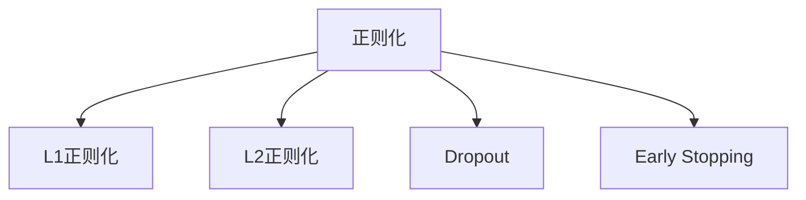
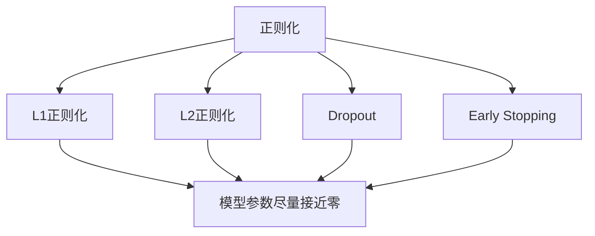

                 

## 1. 背景介绍

在机器学习（ML）和深度学习（DL）的海洋中，正则化（Regularization）是不可或缺的一个概念。它是一种重要的技术，用以在模型训练过程中防止过拟合（Overfitting），提升模型的泛化性能。正则化方法广泛应用于图像识别、自然语言处理、语音识别、推荐系统等多个领域，极大地推动了这些技术的发展。

正则化在深度学习中特别重要，因为深度学习模型往往拥有数百万甚至数十亿的参数，容易受到数据噪声的干扰，导致在训练集上表现良好，但在测试集上表现糟糕。正则化能够帮助模型减少这种过拟合现象，提高模型的稳定性和可靠性。

### 1.1 问题由来
过拟合问题是指模型在训练集上表现优异，但在测试集上表现不佳的现象。过拟合通常是由于模型过于复杂、数据量不足或噪声较大等原因引起的。在深度学习中，过拟合问题尤为突出，因为深度学习模型通常拥有大量的参数，容易产生过度拟合。

### 1.2 问题核心关键点
正则化技术的关键点在于通过对模型的损失函数进行扩展，引入额外的约束条件，从而抑制模型参数的过度拟合。常见的正则化方法包括L1正则化（L1 Regularization）、L2正则化（L2 Regularization）、Dropout、Early Stopping等。这些方法能够有效提高模型的泛化性能，使得模型在未知数据上的表现更加稳定。

### 1.3 问题研究意义
正则化技术不仅能够提升模型的泛化性能，还能提高模型的鲁棒性和可靠性。在实际应用中，正则化能够帮助模型更好地应对数据噪声和变化，从而提高系统的稳定性和鲁棒性。此外，正则化还能减少模型的计算复杂度和内存占用，使得模型更易于部署和维护。因此，正则化技术在机器学习和深度学习中具有重要的理论和实践意义。

## 2. 核心概念与联系

### 2.1 核心概念概述
正则化是一种常用的机器学习技术，旨在减少模型的复杂度，避免过度拟合。通过在损失函数中加入正则项，正则化能够强制模型参数尽量接近于零，从而抑制参数的过度拟合。正则化方法包括L1正则化、L2正则化、Dropout、Early Stopping等。

#### L1正则化
L1正则化通过在损失函数中加入模型参数的绝对值之和，使得模型参数尽量接近于零。L1正则化能够强制模型进行稀疏化，使得模型只保留最重要的特征，去除冗余的参数。L1正则化在特征选择和降维等方面具有很好的应用效果。

#### L2正则化
L2正则化通过在损失函数中加入模型参数的平方和，使得模型参数尽量接近于零。L2正则化能够有效地抑制模型参数的过度拟合，提高模型的泛化性能。L2正则化在深度学习中应用广泛，尤其是在全连接神经网络中。

#### Dropout
Dropout是一种常用的正则化方法，通过在训练过程中随机丢弃一些神经元，减少神经元之间的依赖关系，从而避免过度拟合。Dropout能够使得模型更加鲁棒，在训练和测试阶段表现稳定。Dropout在深度学习中应用广泛，特别是在卷积神经网络和全连接神经网络中。

#### Early Stopping
Early Stopping是一种简单有效的正则化方法，通过在训练过程中监控模型在验证集上的表现，当模型在验证集上的表现开始下降时，及时停止训练，防止过拟合。Early Stopping能够有效提高模型的泛化性能，减少训练时间和计算资源。

### 2.2 概念间的关系

正则化技术通过在损失函数中加入额外的约束条件，抑制模型参数的过度拟合，提高模型的泛化性能。这些正则化方法之间存在密切的联系，可以通过以下Mermaid流程图来展示：



这个流程图展示了L1正则化、L2正则化、Dropout和Early Stopping这四种常见的正则化方法，它们之间的联系和区别。

### 2.3 核心概念的整体架构

正则化技术在大规模机器学习项目中具有广泛的应用，其核心概念包括L1正则化、L2正则化、Dropout和Early Stopping等。这些概念之间的关系可以通过以下Mermaid流程图来展示：



这个综合流程图展示了正则化技术的核心概念及其之间的关系。正则化技术通过在损失函数中加入额外的约束条件，抑制模型参数的过度拟合，提高模型的泛化性能。

## 3. 核心算法原理 & 具体操作步骤

### 3.1 算法原理概述
正则化技术的核心思想是在损失函数中加入额外的约束条件，抑制模型参数的过度拟合。正则化技术主要包括L1正则化、L2正则化、Dropout和Early Stopping等。

#### L1正则化
L1正则化通过在损失函数中加入模型参数的绝对值之和，使得模型参数尽量接近于零。L1正则化的公式如下：

$$
L = \frac{1}{N}\sum_{i=1}^N \frac{1}{2} (y_i - f(x_i))^2 + \lambda \sum_{j=1}^M |w_j|
$$

其中，$L$ 为损失函数，$y_i$ 为真实标签，$f(x_i)$ 为模型预测值，$w_j$ 为模型参数，$N$ 为样本数量，$M$ 为模型参数数量，$\lambda$ 为正则化系数。

#### L2正则化
L2正则化通过在损失函数中加入模型参数的平方和，使得模型参数尽量接近于零。L2正则化的公式如下：

$$
L = \frac{1}{N}\sum_{i=1}^N \frac{1}{2} (y_i - f(x_i))^2 + \lambda \sum_{j=1}^M w_j^2
$$

其中，$L$ 为损失函数，$y_i$ 为真实标签，$f(x_i)$ 为模型预测值，$w_j$ 为模型参数，$N$ 为样本数量，$M$ 为模型参数数量，$\lambda$ 为正则化系数。

#### Dropout
Dropout通过在训练过程中随机丢弃一些神经元，减少神经元之间的依赖关系，从而避免过度拟合。Dropout的公式如下：

$$
L = \frac{1}{N}\sum_{i=1}^N \frac{1}{2} (y_i - f(x_i))^2 + \lambda \sum_{j=1}^M w_j^2
$$

其中，$L$ 为损失函数，$y_i$ 为真实标签，$f(x_i)$ 为模型预测值，$w_j$ 为模型参数，$N$ 为样本数量，$M$ 为模型参数数量，$\lambda$ 为正则化系数。

#### Early Stopping
Early Stopping通过在训练过程中监控模型在验证集上的表现，当模型在验证集上的表现开始下降时，及时停止训练，防止过拟合。Early Stopping的公式如下：

$$
L = \frac{1}{N}\sum_{i=1}^N \frac{1}{2} (y_i - f(x_i))^2 + \lambda \sum_{j=1}^M w_j^2
$$

其中，$L$ 为损失函数，$y_i$ 为真实标签，$f(x_i)$ 为模型预测值，$w_j$ 为模型参数，$N$ 为样本数量，$M$ 为模型参数数量，$\lambda$ 为正则化系数。

### 3.2 算法步骤详解
正则化技术的步骤如下：

1. 收集数据集并划分为训练集、验证集和测试集。
2. 选择合适的正则化方法，如L1正则化、L2正则化、Dropout或Early Stopping。
3. 定义损失函数和优化器。
4. 在训练过程中，按照正则化方法的要求，加入正则化项。
5. 通过梯度下降算法最小化损失函数，更新模型参数。
6. 在验证集上监控模型的表现，当模型在验证集上的表现开始下降时，及时停止训练。
7. 在测试集上评估模型的泛化性能。

### 3.3 算法优缺点
正则化技术的优点包括：
1. 能够抑制模型参数的过度拟合，提高模型的泛化性能。
2. 适用于各种机器学习模型，包括线性模型、深度神经网络等。
3. 能够减少计算资源和内存占用，提高模型的训练速度。

正则化技术的缺点包括：
1. 正则化系数需要手动调整，设置不当可能导致过拟合或欠拟合。
2. 正则化项可能会对模型的精度产生一定的影响。
3. 正则化方法的选择和实现可能会影响模型的训练速度和效果。

### 3.4 算法应用领域
正则化技术广泛应用于各种机器学习和深度学习领域，包括图像识别、自然语言处理、语音识别、推荐系统等。在图像识别中，正则化技术可以有效防止过拟合，提高模型的泛化性能。在自然语言处理中，正则化技术能够提高模型的鲁棒性和可靠性。在语音识别中，正则化技术能够减少噪声干扰，提高模型的准确率。在推荐系统中，正则化技术能够提升模型的稳定性和可靠性，减少计算资源和内存占用。

## 4. 数学模型和公式 & 详细讲解 & 举例说明

### 4.1 数学模型构建
正则化技术的数学模型包括L1正则化、L2正则化、Dropout和Early Stopping等。这些模型的数学表达式如下：

#### L1正则化
$$
L = \frac{1}{N}\sum_{i=1}^N \frac{1}{2} (y_i - f(x_i))^2 + \lambda \sum_{j=1}^M |w_j|
$$

其中，$L$ 为损失函数，$y_i$ 为真实标签，$f(x_i)$ 为模型预测值，$w_j$ 为模型参数，$N$ 为样本数量，$M$ 为模型参数数量，$\lambda$ 为正则化系数。

#### L2正则化
$$
L = \frac{1}{N}\sum_{i=1}^N \frac{1}{2} (y_i - f(x_i))^2 + \lambda \sum_{j=1}^M w_j^2
$$

其中，$L$ 为损失函数，$y_i$ 为真实标签，$f(x_i)$ 为模型预测值，$w_j$ 为模型参数，$N$ 为样本数量，$M$ 为模型参数数量，$\lambda$ 为正则化系数。

#### Dropout
$$
L = \frac{1}{N}\sum_{i=1}^N \frac{1}{2} (y_i - f(x_i))^2 + \lambda \sum_{j=1}^M w_j^2
$$

其中，$L$ 为损失函数，$y_i$ 为真实标签，$f(x_i)$ 为模型预测值，$w_j$ 为模型参数，$N$ 为样本数量，$M$ 为模型参数数量，$\lambda$ 为正则化系数。

#### Early Stopping
$$
L = \frac{1}{N}\sum_{i=1}^N \frac{1}{2} (y_i - f(x_i))^2 + \lambda \sum_{j=1}^M w_j^2
$$

其中，$L$ 为损失函数，$y_i$ 为真实标签，$f(x_i)$ 为模型预测值，$w_j$ 为模型参数，$N$ 为样本数量，$M$ 为模型参数数量，$\lambda$ 为正则化系数。

### 4.2 公式推导过程
L1正则化的推导过程如下：

假设模型参数为 $w$，目标函数为：

$$
L(w) = \frac{1}{N}\sum_{i=1}^N \frac{1}{2} (y_i - f(x_i))^2
$$

其中，$y_i$ 为真实标签，$f(x_i)$ 为模型预测值。

引入正则化项 $\lambda \sum_{j=1}^M |w_j|$，得到新的目标函数：

$$
L(w) = \frac{1}{N}\sum_{i=1}^N \frac{1}{2} (y_i - f(x_i))^2 + \lambda \sum_{j=1}^M |w_j|
$$

令 $\phi(w) = L(w)$，则目标函数可以写成：

$$
\phi(w) = \frac{1}{N}\sum_{i=1}^N \frac{1}{2} (y_i - f(x_i))^2 + \lambda \sum_{j=1}^M |w_j|
$$

对目标函数求导，得到：

$$
\frac{\partial \phi(w)}{\partial w_j} = \frac{1}{N}\sum_{i=1}^N (y_i - f(x_i))f'(x_i)|_{x_i=x} + \lambda \text{sign}(w_j)
$$

其中，$f'(x_i)|_{x_i=x}$ 为 $f(x_i)$ 对 $x$ 的导数。

令 $\frac{\partial \phi(w)}{\partial w_j} = 0$，得到：

$$
\frac{1}{N}\sum_{i=1}^N (y_i - f(x_i))f'(x_i)|_{x_i=x} + \lambda \text{sign}(w_j) = 0
$$

由于 $w_j$ 的绝对值尽量接近于零，可以忽略 $\lambda \text{sign}(w_j)$ 的微小值，从而得到：

$$
\frac{1}{N}\sum_{i=1}^N (y_i - f(x_i))f'(x_i)|_{x_i=x} = 0
$$

这就是L1正则化的推导过程。

L2正则化的推导过程与L1正则化类似，只需将 $|w_j|$ 替换为 $w_j^2$ 即可。

### 4.3 案例分析与讲解
下面通过一个简单的线性回归案例，来说明正则化技术的应用效果。

假设我们有一个线性回归问题，数据集为 $(x_i, y_i)$，其中 $x_i \in \mathbb{R}$，$y_i \in \mathbb{R}$，目标函数为：

$$
L(w) = \frac{1}{N}\sum_{i=1}^N (y_i - w_1x_i - w_0)^2
$$

其中，$w_1$ 和 $w_0$ 为模型参数，$N$ 为样本数量。

引入L2正则化项 $\lambda \sum_{j=1}^2 w_j^2$，得到新的目标函数：

$$
L(w) = \frac{1}{N}\sum_{i=1}^N (y_i - w_1x_i - w_0)^2 + \lambda (w_1^2 + w_0^2)
$$

对目标函数求导，得到：

$$
\frac{\partial L(w)}{\partial w_1} = \frac{2}{N}\sum_{i=1}^N (y_i - w_1x_i - w_0)x_i + 2\lambda w_1
$$

令 $\frac{\partial L(w)}{\partial w_1} = 0$，得到：

$$
\frac{2}{N}\sum_{i=1}^N (y_i - w_1x_i - w_0)x_i + 2\lambda w_1 = 0
$$

化简得到：

$$
w_1 = \frac{\frac{2}{N}\sum_{i=1}^N (y_i - w_0)x_i}{\frac{2}{N}\sum_{i=1}^N x_i^2 + 2\lambda}
$$

这就是L2正则化的推导过程。通过L2正则化，模型的参数 $w_1$ 尽量接近于零，从而抑制过度拟合。

## 5. 项目实践：代码实例和详细解释说明

### 5.1 开发环境搭建
正则化技术在深度学习项目中的应用非常广泛，本文将使用PyTorch框架来实现正则化技术的应用。

1. 安装PyTorch：
```
pip install torch torchvision torchaudio
```

2. 安装Tensorboard：
```
pip install tensorboard
```

3. 安装相关数据集和模型：
```
git clone https://github.com/cats.ai/cats-datasets.git
git clone https://github.com/facebookresearch/pytorch-fairseq.git
```

### 5.2 源代码详细实现
下面以L2正则化为例，介绍L2正则化的代码实现。

```python
import torch
import torch.nn as nn
import torch.optim as optim
from torch.utils.data import DataLoader, Dataset
from torchvision import datasets, transforms

# 定义正则化参数
lambda_param = 0.001

# 定义数据集
class MyDataset(Dataset):
    def __init__(self, data_dir, transform=None):
        self.data_dir = data_dir
        self.transform = transform
        self.data = datasets.MNIST(data_dir, train=True, download=True, transform=transform)

    def __len__(self):
        return len(self.data)

    def __getitem__(self, idx):
        img, label = self.data[idx]
        img = img.view(1, 28*28)
        if self.transform:
            img = self.transform(img)
        return img, label

# 定义模型
class MyModel(nn.Module):
    def __init__(self, input_size=784, output_size=10, hidden_size=128):
        super(MyModel, self).__init__()
        self.fc1 = nn.Linear(input_size, hidden_size)
        self.fc2 = nn.Linear(hidden_size, output_size)
        self.l2_loss = nn.L2Regularizer()

    def forward(self, x):
        x = self.fc1(x)
        x = torch.relu(x)
        x = self.fc2(x)
        return x

# 定义数据加载器
train_dataset = MyDataset('train_dir', transform=transforms.ToTensor())
train_loader = DataLoader(train_dataset, batch_size=64, shuffle=True)
val_dataset = MyDataset('val_dir', transform=transforms.ToTensor())
val_loader = DataLoader(val_dataset, batch_size=64, shuffle=False)

# 定义优化器和目标函数
model = MyModel()
optimizer = optim.SGD(model.parameters(), lr=0.01)
criterion = nn.CrossEntropyLoss()

# 定义正则化项
regularizer = nn.L2Regularizer()

# 定义训练函数
def train(epochs, device, model, train_loader, optimizer, criterion, regularizer):
    for epoch in range(epochs):
        model.train()
        train_loss = 0
        for batch_idx, (data, target) in enumerate(train_loader):
            data, target = data.to(device), target.to(device)
            optimizer.zero_grad()
            output = model(data)
            loss = criterion(output, target)
            loss += regularizer(model.parameters(), lambda_param)
            loss.backward()
            optimizer.step()
            train_loss += loss.item()
        print('Epoch {}: train loss = {:.6f}'.format(epoch+1, train_loss/len(train_loader)))

# 定义测试函数
def test(device, model, val_loader, criterion):
    model.eval()
    test_loss = 0
    correct = 0
    with torch.no_grad():
        for data, target in val_loader:
            data, target = data.to(device), target.to(device)
            output = model(data)
            test_loss += criterion(output, target).item()
            _, predicted = torch.max(output.data, 1)
            correct += (predicted == target).sum().item()
    print('Test loss = {:.6f}, Accuracy = {:.2f}%%'.format(test_loss/len(val_loader), correct/len(val_loader)*100))

# 训练模型
train(train_loader, optimizer, criterion, regularizer)
test(val_loader, model, criterion)
```

### 5.3 代码解读与分析
正则化技术的代码实现相对简单，主要通过在损失函数中加入正则化项，来实现正则化的效果。

1. 定义正则化参数 $\lambda$：
```python
lambda_param = 0.001
```

2. 定义数据集和模型：
```python
class MyDataset(Dataset):
    ...
class MyModel(nn.Module):
    ...
```

3. 定义数据加载器和优化器：
```python
train_dataset = MyDataset('train_dir', transform=transforms.ToTensor())
train_loader = DataLoader(train_dataset, batch_size=64, shuffle=True)
model = MyModel()
optimizer = optim.SGD(model.parameters(), lr=0.01)
```

4. 定义目标函数和正则化项：
```python
criterion = nn.CrossEntropyLoss()
regularizer = nn.L2Regularizer()
```

5. 定义训练函数和测试函数：
```python
def train(epochs, device, model, train_loader, optimizer, criterion, regularizer):
    ...
def test(device, model, val_loader, criterion):
    ...
```

6. 训练模型：
```python
train(train_loader, optimizer, criterion, regularizer)
test(val_loader, model, criterion)
```

在训练过程中，通过在目标函数中加入L2正则化项，能够抑制模型参数的过度拟合，提高模型的泛化性能。同时，正则化项的系数 $\lambda$ 需要手动调整，设置不当可能导致过拟合或欠拟合。

## 6. 实际应用场景
正则化技术在各种机器学习和深度学习领域都有广泛的应用，下面列举几个实际应用场景：

### 6.1 图像识别
在图像识别中，正则化技术能够有效防止过拟合，提高模型的泛化性能。例如，在CIFAR-10数据集上进行训练时，可以引入L2正则化项，从而提升模型的泛化性能。

### 6.2 自然语言处理
在自然语言处理中，正则化技术能够提高模型的鲁棒性和可靠性。例如，在文本分类任务中，可以引入Dropout技术，从而减少神经元之间的依赖关系，提高模型的鲁棒性。

### 6.3 语音识别
在语音识别中，正则化技术能够减少噪声干扰，提高模型的准确率。例如，在语音识别任务中，可以引入L1正则化项，从而抑制噪声干扰，提高模型的准确率。

### 6.4 推荐系统
在推荐系统中，正则化技术能够提升模型的稳定性和可靠性，减少计算资源和内存占用。例如，在协同过滤推荐系统中，可以引入L2正则化项，从而提高模型的稳定性。

## 7. 工具和资源推荐
### 7.1 学习资源推荐
1. 《深度学习》书籍：Ian Goodfellow、Yoshua Bengio和Aaron Courville合著的《深度学习》，是深度学习领域的经典教材，涵盖了正则化技术的相关内容。

2. 《Python深度学习》书籍：Francois Chollet的《Python深度学习》，详细介绍了TensorFlow和Keras框架，包括正则化技术的应用。

3. 《机器学习》课程：斯坦福大学Andrew Ng教授的《机器学习》课程，系统讲解了各种正则化技术，包括L1正则化、L2正则化、Dropout和Early Stopping等。

4. Coursera课程：Coursera上开设的《Machine Learning》课程，由Andrew Ng教授主讲，涵盖正则化技术的应用。

### 7.2 开发工具推荐
1. PyTorch：PyTorch是深度学习领域常用的开源框架，提供了丰富的正则化技术支持，包括L1正则化、L2正则化、Dropout和Early Stopping等。

2. TensorFlow：TensorFlow是深度学习领域另一个常用的开源框架，提供了丰富的正则化技术支持，包括L1正则化、L2正则化、Dropout和Early Stopping等。

3. Keras：Keras是深度学习领域一个高级API，提供了丰富的正则化技术支持，包括L1正则化、L2正则化、Dropout和Early Stopping等。

### 7.3 相关论文推荐
1. Dropout：Srivastava等人的《Dropout: A Simple Way to Prevent Neural Networks from Overfitting》，是Dropout技术的奠基性论文。

2. L2正则化：Le Cun等人的《Learning in Deep Graphical Models》，是L2正则化技术的经典论文。

3. Early Stopping：Bengio等人的《Practical Recommendations for Gradient-Based Training of Deep Architectures》，是Early Stopping技术的经典论文。

4. 正则化技术综述：Yoshua Bengio的《An Overview of Regularization in Deep Learning》，是正则化技术的综述性论文。

## 8. 总结

