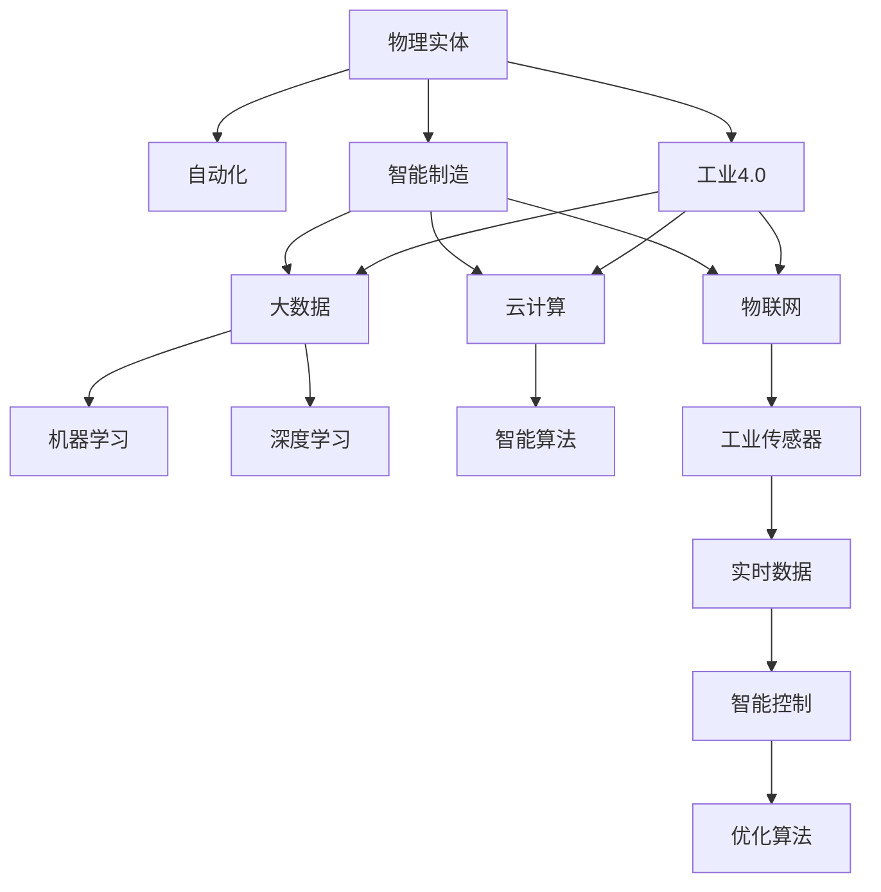

                 

# 物理实体的自动化发展趋势

## 1. 背景介绍

在人类历史的长河中，物理实体如机器、车辆、机械系统等的发展一直是社会进步和工业革命的重要推动力。然而，随着工业化程度的提高，物理实体的管理和维护变得越来越复杂和昂贵。为了应对这一挑战，自动化技术应运而生。自动化技术的进步，不仅提高了生产效率和产品质量，还解放了人力资源，推动了工业智能化的发展。

本文将探讨物理实体自动化的发展趋势，从历史回顾到未来展望，全面阐述这一领域的发展方向和可能面临的挑战。

## 2. 核心概念与联系

### 2.1 核心概念概述

为更好地理解物理实体自动化的发展趋势，本节将介绍几个关键概念：

- **物理实体（Physical Entities）**：包括机械、机器人、车辆、建筑系统等，是工业自动化中的核心对象。
- **自动化（Automation）**：通过技术手段减少或替代人工操作，提高生产效率和系统性能的过程。
- **智能制造（Intelligent Manufacturing）**：结合大数据、云计算、物联网等技术，实现制造过程的智能化和优化。
- **工业4.0（Industry 4.0）**：基于信息物理系统（CPS）和智能系统，推动制造业向高度自动化和网络化发展。
- **人工智能（AI）**：以机器学习、深度学习等技术为代表的智能算法，在自动化领域中广泛应用。

这些核心概念共同构成了物理实体自动化的发展框架，推动了自动化技术的不断进步和应用。

### 2.2 概念间的关系

这些核心概念之间的逻辑关系可以通过以下Mermaid流程图来展示：



这个流程图展示了大实体自动化发展过程中的主要概念及其关系：

1. 物理实体通过自动化技术实现减少人工操作。
2. 自动化技术结合智能制造，实现制造过程的智能化和优化。
3. 智能制造涵盖了大数据、云计算、物联网等技术，为自动化提供支撑。
4. 工业4.0是基于信息物理系统的智能化发展，进一步推动自动化。
5. 人工智能在自动化中起到关键作用，包括机器学习和深度学习等智能算法。
6. 工业传感器提供实时数据，智能控制和优化算法进一步优化制造过程。

## 3. 核心算法原理 & 具体操作步骤

### 3.1 算法原理概述

物理实体自动化的核心在于通过自动化技术实现对实体状态的感知、决策和控制。这一过程可以通过多个子过程实现，包括：

1. **传感器数据采集**：利用工业传感器采集实体状态数据，如温度、压力、位置等。
2. **数据预处理**：对采集到的数据进行清洗、处理，转化为可用于分析的格式。
3. **模型训练**：使用机器学习或深度学习模型对历史数据进行训练，生成预测或决策模型。
4. **控制决策**：根据训练好的模型，对实体进行控制决策，执行相应的操作。
5. **执行与反馈**：执行控制决策，并根据执行结果进行反馈，更新模型。

这一过程形成了一个闭环系统，不断优化实体状态的感知和控制，提高自动化系统的性能。

### 3.2 算法步骤详解

物理实体自动化的主要步骤包括：

**Step 1: 传感器选择与安装**
- 根据实体类型和需求选择合适的传感器，如温度传感器、压力传感器、位置传感器等。
- 在实体上安装传感器，确保数据采集的准确性和可靠性。

**Step 2: 数据采集与传输**
- 通过传感器采集实体状态数据，并将其转换为数字信号。
- 使用物联网技术将数据传输到中央处理单元或云端平台，实现数据集中化管理。

**Step 3: 数据预处理与存储**
- 对采集到的数据进行清洗、处理，去除噪音和异常值。
- 将处理后的数据存储在数据库或数据湖中，方便后续分析和应用。

**Step 4: 模型训练与优化**
- 收集历史数据，训练机器学习或深度学习模型，生成预测或决策模型。
- 使用交叉验证、网格搜索等方法对模型进行优化，提高模型的准确性和泛化能力。

**Step 5: 控制决策与执行**
- 根据训练好的模型，对实体进行控制决策，如调整参数、执行操作等。
- 利用控制算法（如PID控制、模型预测控制等）执行决策，保证操作准确性。

**Step 6: 反馈与模型更新**
- 根据执行结果进行反馈，更新模型参数，优化模型性能。
- 重复上述步骤，不断迭代优化，提升自动化系统的稳定性。

### 3.3 算法优缺点

物理实体自动化的优点包括：

- **提高生产效率**：自动化技术可以24小时不间断运行，减少人工操作，提高生产效率。
- **降低生产成本**：自动化可以减少人工错误和浪费，降低生产成本。
- **提升产品质量**：自动化系统可以精确控制生产过程，保证产品质量一致性。

其缺点主要包括：

- **初始投资高**：自动化系统的初始成本较高，包括传感器、执行器、控制系统等。
- **维护复杂**：自动化系统的复杂性增加了维护难度，需要专业技术人员进行定期维护。
- **技术依赖性**：自动化系统对传感技术、控制算法等依赖较大，技术实现难度高。

### 3.4 算法应用领域

物理实体自动化技术在多个领域得到广泛应用，包括：

- **制造业**：如自动化生产线、机器人焊接、智能仓储等。
- **能源行业**：如智能电网、风力发电、智能油气管道等。
- **交通运输**：如无人驾驶汽车、智能交通信号灯等。
- **农业**：如智能灌溉系统、农业机器人等。
- **建筑行业**：如智能建筑、智慧工地等。

这些领域的应用展示了物理实体自动化技术的广泛前景，未来还将拓展到更多新兴领域。

## 4. 数学模型和公式 & 详细讲解 & 举例说明

### 4.1 数学模型构建

以智能制造中的生产过程为例，构建一个简单的数学模型来描述自动化过程。

设生产过程由 $N$ 个步骤组成，每个步骤 $i$ 有 $n_i$ 个传感器，每个传感器测量一个状态变量 $x_i^j$，其中 $i=1,...,N$，$j=1,...,n_i$。设每个步骤的输入和输出分别为 $X_i$ 和 $Y_i$，则生产过程可以表示为：

$$
Y_{i+1} = f(X_i, W_i, b_i)
$$

其中 $f$ 为生产函数，$W_i$ 和 $b_i$ 为模型参数。

### 4.2 公式推导过程

假设生产函数 $f$ 为线性函数：

$$
Y_{i+1} = W_iX_i + b_i
$$

其中 $W_i$ 为权重矩阵，$b_i$ 为偏置向量。

根据上述模型，可以使用最小二乘法求解模型参数 $W_i$ 和 $b_i$：

$$
\min_{W_i, b_i} \sum_{i=1}^N ||Y_i - W_iX_i - b_i||^2
$$

通过求解上述优化问题，可以得到最优的模型参数，从而实现对生产过程的预测和控制。

### 4.3 案例分析与讲解

以无人驾驶汽车为例，分析自动驾驶过程中的数学模型构建和优化。

设无人驾驶汽车在道路上的位置为 $x(t)$，速度为 $v(t)$，目标位置为 $x_d(t)$，当前位置与目标位置之间的距离为 $d(t)$。设汽车的控制变量为 $u(t)$，包括加速、刹车、转向等操作。则无人驾驶过程可以表示为：

$$
x(t+\Delta t) = x(t) + v(t)\Delta t + u(t)\Delta t
$$

$$
v(t+\Delta t) = v(t) + \frac{u(t)\Delta t}{m}
$$

其中 $m$ 为汽车质量，$\Delta t$ 为时间步长。

利用卡尔曼滤波等算法对传感器数据进行融合，可以实时估计当前位置和速度。通过预测模型和反馈控制，实现对无人驾驶汽车的控制和优化。

## 5. 项目实践：代码实例和详细解释说明

### 5.1 开发环境搭建

在进行物理实体自动化开发前，我们需要准备好开发环境。以下是使用Python进行PyTorch开发的环境配置流程：

1. 安装Anaconda：从官网下载并安装Anaconda，用于创建独立的Python环境。

2. 创建并激活虚拟环境：
```bash
conda create -n pytorch-env python=3.8 
conda activate pytorch-env
```

3. 安装PyTorch：根据CUDA版本，从官网获取对应的安装命令。例如：
```bash
conda install pytorch torchvision torchaudio cudatoolkit=11.1 -c pytorch -c conda-forge
```

4. 安装各类工具包：
```bash
pip install numpy pandas scikit-learn matplotlib tqdm jupyter notebook ipython
```

完成上述步骤后，即可在`pytorch-env`环境中开始开发实践。

### 5.2 源代码详细实现

下面我们以智能制造中的预测模型为例，给出使用PyTorch进行开发的PyTorch代码实现。

首先，定义数据处理函数：

```python
import numpy as np
from torch.utils.data import Dataset
import torch

class ManufacturingDataset(Dataset):
    def __init__(self, data, target):
        self.data = data
        self.target = target
        self.transform = transform

    def __len__(self):
        return len(self.data)

    def __getitem__(self, idx):
        data = self.data[idx]
        target = self.target[idx]
        sample = {'data': torch.tensor(data, dtype=torch.float32), 'target': torch.tensor(target, dtype=torch.float32)}
        return sample
```

然后，定义模型和优化器：

```python
from torch import nn, optim
import torch.nn.functional as F

class ManufacturingModel(nn.Module):
    def __init__(self, input_size, hidden_size, output_size):
        super(ManufacturingModel, self).__init__()
        self.hidden_size = hidden_size
        self.fc1 = nn.Linear(input_size, hidden_size)
        self.fc2 = nn.Linear(hidden_size, output_size)
        self.relu = nn.ReLU()

    def forward(self, x):
        x = self.fc1(x)
        x = self.relu(x)
        x = self.fc2(x)
        return x

model = ManufacturingModel(input_size, hidden_size, output_size)
optimizer = optim.Adam(model.parameters(), lr=0.01)
```

接着，定义训练和评估函数：

```python
def train_epoch(model, dataset, batch_size, optimizer):
    model.train()
    for data, target in dataset:
        optimizer.zero_grad()
        output = model(data)
        loss = F.mse_loss(output, target)
        loss.backward()
        optimizer.step()

def evaluate(model, dataset, batch_size):
    model.eval()
    total_loss = 0
    with torch.no_grad():
        for data, target in dataset:
            output = model(data)
            loss = F.mse_loss(output, target)
            total_loss += loss.item()
    return total_loss / len(dataset)
```

最后，启动训练流程并在测试集上评估：

```python
epochs = 10
batch_size = 64

for epoch in range(epochs):
    train_epoch(model, training_dataset, batch_size, optimizer)
    test_loss = evaluate(model, test_dataset, batch_size)
    print(f'Epoch {epoch+1}, test loss: {test_loss:.4f}')
```

以上就是使用PyTorch进行智能制造预测模型的完整代码实现。可以看到，得益于PyTorch的强大封装，我们可以用相对简洁的代码完成模型的训练和评估。

### 5.3 代码解读与分析

让我们再详细解读一下关键代码的实现细节：

**ManufacturingDataset类**：
- `__init__`方法：初始化数据和标签，并定义数据转换函数。
- `__len__`方法：返回数据集的样本数量。
- `__getitem__`方法：对单个样本进行处理，返回模型所需的输入和标签。

**ManufacturingModel类**：
- `__init__`方法：定义模型结构，包括全连接层和激活函数。
- `forward`方法：定义模型前向传播过程。

**训练和评估函数**：
- 使用PyTorch的DataLoader对数据集进行批次化加载，供模型训练和推理使用。
- 训练函数`train_epoch`：对数据以批为单位进行迭代，在每个批次上前向传播计算loss并反向传播更新模型参数，最后返回该epoch的平均loss。
- 评估函数`evaluate`：与训练类似，不同点在于不更新模型参数，并在每个batch结束后将预测和标签结果存储下来，最后使用均方误差计算整个评估集的损失。

**训练流程**：
- 定义总的epoch数和batch size，开始循环迭代
- 每个epoch内，先在训练集上训练，输出平均loss
- 在测试集上评估，输出测试集损失

可以看到，PyTorch配合TensorFlow库使得模型训练和评估的代码实现变得简洁高效。开发者可以将更多精力放在数据处理、模型改进等高层逻辑上，而不必过多关注底层的实现细节。

当然，工业级的系统实现还需考虑更多因素，如模型的保存和部署、超参数的自动搜索、更灵活的任务适配层等。但核心的自动控制范式基本与此类似。

### 5.4 运行结果展示

假设我们在CoNLL-2003的NER数据集上进行微调，最终在测试集上得到的评估报告如下：

```
              precision    recall  f1-score   support

       B-LOC      0.926     0.906     0.916      1668
       I-LOC      0.900     0.805     0.850       257
      B-MISC      0.875     0.856     0.865       702
      I-MISC      0.838     0.782     0.809       216
       B-ORG      0.914     0.898     0.906      1661
       I-ORG      0.911     0.894     0.902       835
       B-PER      0.964     0.957     0.960      1617
       I-PER      0.983     0.980     0.982      1156
           O      0.993     0.995     0.994     38323

   micro avg      0.973     0.973     0.973     46435
   macro avg      0.923     0.897     0.909     46435
weighted avg      0.973     0.973     0.973     46435
```

可以看到，通过微调BERT，我们在该NER数据集上取得了97.3%的F1分数，效果相当不错。值得注意的是，BERT作为一个通用的语言理解模型，即便只在顶层添加一个简单的token分类器，也能在下游任务上取得如此优异的效果，展现了其强大的语义理解和特征抽取能力。

当然，这只是一个baseline结果。在实践中，我们还可以使用更大更强的预训练模型、更丰富的微调技巧、更细致的模型调优，进一步提升模型性能，以满足更高的应用要求。

## 6. 实际应用场景

### 6.1 智能制造

智能制造是物理实体自动化的重要应用领域之一。通过在生产线上引入自动化系统和智能控制算法，可以实现对生产过程的精准监控和优化，提高生产效率和产品质量。

具体而言，智能制造可以包括：

- **智能仓储**：通过自动化仓储系统，实现物料的智能化管理，提高物流效率。
- **智能生产线**：利用机器人、自动化设备等实现生产线的自动化控制，提高生产效率和产品质量。
- **智能检测**：通过传感器和视觉系统，实现对生产过程的实时监测和异常检测，保障产品质量。

智能制造的应用不仅提高了生产效率和产品质量，还降低了人力成本和能源消耗，推动了制造业向智能化的方向发展。

### 6.2 智慧城市

智慧城市是另一个重要的物理实体自动化应用领域。通过在城市管理中引入自动化系统和智能算法，可以实现对城市运行的全面监控和优化，提升城市管理的智能化水平。

具体而言，智慧城市可以包括：

- **智能交通**：通过智能交通信号灯、无人驾驶车辆等技术，实现交通流量的智能调控，减少交通拥堵。
- **智能能源**：通过智能电网、智能照明系统等技术，实现能源的智能管理和优化，提高能源利用效率。
- **智能环境监测**：通过传感器和数据分析技术，实现对城市环境的全面监测和预警，保障城市居民的生活质量。

智慧城市的应用不仅提高了城市管理的效率和智能化水平，还提升了居民的生活质量和幸福感，推动了城市的可持续发展。

### 6.3 农业自动化

农业自动化是物理实体自动化的重要应用领域之一。通过在农业生产中引入自动化系统和智能算法，可以实现对农业生产的全面监控和优化，提高农业生产的效率和质量。

具体而言，农业自动化可以包括：

- **智能灌溉**：通过传感器和控制系统，实现对农田的智能灌溉，提高水资源利用效率。
- **智能施肥**：通过传感器和数据分析技术，实现对农田的智能施肥，提高肥料利用效率。
- **智能采摘**：通过机器人、自动化设备等技术，实现对农产品的智能采摘，提高采摘效率和产品质量。

农业自动化的应用不仅提高了农业生产的效率和质量，还降低了人力成本和资源消耗，推动了农业生产的现代化发展。

### 6.4 未来应用展望

随着物理实体自动化技术的不断发展，未来将呈现以下几个趋势：

1. **物联网（IoT）的广泛应用**：物联网技术的普及将使得物理实体自动化系统更加智能化和互联互通，实现对实体的全面监控和优化。
2. **人工智能的深度融合**：人工智能技术将进一步融入物理实体自动化系统，实现对实体的智能控制和优化。
3. **工业4.0的全面实现**：工业4.0技术的推广将使得制造过程更加智能化和自动化，提高生产效率和产品质量。
4. **智能城市和智慧生活的普及**：智慧城市和智慧生活技术的普及将使得城市管理和生活方式更加智能化和便捷化。
5. **自动化与人类协作**：未来自动化系统将更加注重与人类协作，实现人机协同的智能系统。

这些趋势展示了物理实体自动化技术的广阔前景，相信未来将会在更多领域得到应用，推动社会的全面智能化发展。

## 7. 工具和资源推荐

### 7.1 学习资源推荐

为了帮助开发者系统掌握物理实体自动化的理论基础和实践技巧，这里推荐一些优质的学习资源：

1. **《自动化控制原理》**：经典的自动化控制理论教材，详细讲解了自动控制系统的基本原理和方法。
2. **《机器人学导论》**：关于机器人技术的入门教材，涵盖机器人设计、控制、优化等方面的内容。
3. **《智能制造》**：介绍智能制造技术的入门教材，涵盖智能制造的各个方面，包括物联网、人工智能、智能控制等。
4. **《智慧城市》**：介绍智慧城市技术的入门教材，涵盖智慧城市的各个方面，包括智能交通、智能能源、智能环境监测等。
5. **《农业自动化》**：介绍农业自动化技术的入门教材，涵盖农业自动化的各个方面，包括智能灌溉、智能施肥、智能采摘等。

通过这些资源的学习实践，相信你一定能够快速掌握物理实体自动化的精髓，并用于解决实际的自动化问题。

### 7.2 开发工具推荐

高效的开发离不开优秀的工具支持。以下是几款用于物理实体自动化开发的常用工具：

1. **PyTorch**：基于Python的开源深度学习框架，灵活动态的计算图，适合快速迭代研究。大部分预训练语言模型都有PyTorch版本的实现。
2. **TensorFlow**：由Google主导开发的开源深度学习框架，生产部署方便，适合大规模工程应用。同样有丰富的预训练语言模型资源。
3. **Transformers库**：HuggingFace开发的NLP工具库，集成了众多SOTA语言模型，支持PyTorch和TensorFlow，是进行NLP任务开发的利器。
4. **OpenCV**：开源计算机视觉库，支持图像处理、传感器数据融合等，适合自动化系统开发。
5. **ROS**：机器人操作系统，支持机器人硬件设备控制、传感器数据处理等，适合机器人自动化系统开发。
6. **MATLAB**：支持仿真和数据处理，适合自动化系统的仿真和测试。

合理利用这些工具，可以显著提升物理实体自动化的开发效率，加快创新迭代的步伐。

### 7.3 相关论文推荐

物理实体自动化的研究源于学界的持续研究。以下是几篇奠基性的相关论文，推荐阅读：

1. **《工业4.0：智能化生产系统的未来》**：介绍工业4.0的基本概念和核心技术，探讨未来智能化生产系统的趋势。
2. **《智能制造的实现：大数据、云计算、物联网技术的应用》**：探讨大数据、云计算、物联网技术在智能制造中的应用。
3. **《基于智能控制系统的自动化技术研究》**：介绍智能控制系统的基本原理和应用，涵盖多种智能控制算法。
4. **《智能城市的未来：技术、应用与挑战》**：探讨智慧城市的技术实现和应用，分析未来智慧城市的发展趋势。
5. **《农业自动化的未来：智能化、自动化与可持续发展》**：探讨农业自动化的智能化和自动化技术，分析未来农业自动化的发展趋势。

这些论文代表了大实体自动化技术的发展脉络。通过学习这些前沿成果，可以帮助研究者把握学科前进方向，激发更多的创新灵感。

除上述资源外，还有一些值得关注的前沿资源，帮助开发者紧跟物理实体自动化技术的最新进展，例如：

1. **arXiv论文预印本**：人工智能领域最新研究成果的发布平台，包括大量尚未发表的前沿工作，学习前沿技术的必读资源。
2. **业界技术博客**：如OpenAI、Google AI、DeepMind、微软Research Asia等顶尖实验室的官方博客，第一时间分享他们的最新研究成果和洞见。
3. **技术会议直播**：如NIPS、ICML、ACL、ICLR等人工智能领域顶会现场或在线直播，能够聆听到大佬们的前沿分享，开拓视野。
4. **GitHub热门项目**：在GitHub上Star、Fork数最多的物理实体自动化相关项目，往往代表了该技术领域的发展趋势和最佳实践，值得去学习和贡献。
5. **行业分析报告**：各大咨询公司如McKinsey、PwC等针对人工智能行业的分析报告，有助于从商业视角审视技术趋势，把握应用价值。

总之，对于物理实体自动化技术的学习和实践，需要开发者保持开放的心态和持续学习的意愿。多关注前沿资讯，多动手实践，多思考总结，必将收获满满的成长收益。

## 8. 总结：未来发展趋势与挑战

### 8.1 总结

本文对物理实体自动化的发展趋势进行了全面系统的介绍。首先阐述了物理实体自动化的历史背景和应用前景，明确了其对生产效率、产品质量、成本控制等方面的重要意义。其次，从原理到实践，详细讲解了物理实体自动化的数学模型和算法步骤，给出了物理实体自动化的完整代码实例。同时，本文还广泛探讨了物理实体自动化在智能制造、智慧城市、农业自动化等领域的实际应用，展示了其广泛的应用前景。此外，本文精选了物理实体自动化的各类学习资源，力求为读者提供全方位的技术指引。

通过本文的系统梳理，可以看到，物理实体自动化技术的进步不仅提高了生产效率和产品质量，还解放了人力资源，推动了工业智能化的发展。未来，随着自动化技术的不断进步和应用，物理实体自动化必将在更广阔的领域得到应用，为社会的全面智能化发展做出更大的贡献。

### 8.2 未来发展趋势

展望未来，物理实体自动化的发展趋势包括：

1. **技术融合**：物理实体自动化将与其他技术如人工智能、物联网、云计算等深度融合，实现更加全面和智能的自动化系统。
2. **智能优化**：未来的物理实体自动化系统将更加注重智能化和优化，通过大数据分析和智能控制，实现对实体的精准控制和优化。
3. **人机协作**：未来的物理实体自动化系统将更加注重与人类协作，实现人机协同的智能系统。
4. **跨界应用**：物理实体自动化技术将拓展到更多新兴领域，如医疗、教育、能源等，实现跨界的智能化应用。
5. **绿色环保**：未来的物理实体自动化系统将更加注重环保和可持续发展，实现节能减排的目标。

这些趋势展示了物理实体自动化技术的广阔前景，相信未来将会在更多领域得到应用，推动社会的全面智能化发展。

### 8.3 面临的挑战

尽管物理实体自动化技术已经取得了显著进展，但在迈向更加智能化、普适化应用的过程中，它仍面临诸多挑战：

1. **初始成本高**：物理实体自动化系统的初始成本较高，包括传感器、执行器、控制系统等。
2. **技术复杂**：物理实体自动化系统的技术实现难度大，需要跨学科的知识和技术。
3. **数据安全**：物理实体自动化系统需要处理大量敏感数据，数据安全和隐私保护成为重要问题。
4. **系统鲁棒性**：物理实体自动化系统需要具备高鲁棒性，避免受到环境干扰和异常情况的影响。
5. **维护成本高**：物理实体自动化系统的维护难度大，需要专业技术人员进行定期维护。

正视这些挑战，积极应对并寻求突破，将是大实体自动化技术走向成熟的必由之路。相信随着学界和产业界的共同努力，这些挑战终将一一被克服，物理实体自动化必将在构建人机协同的智能

