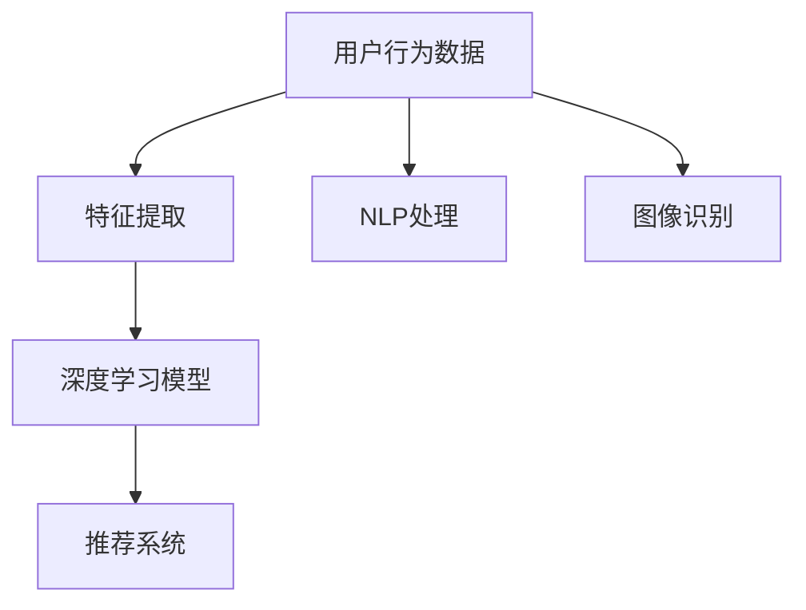
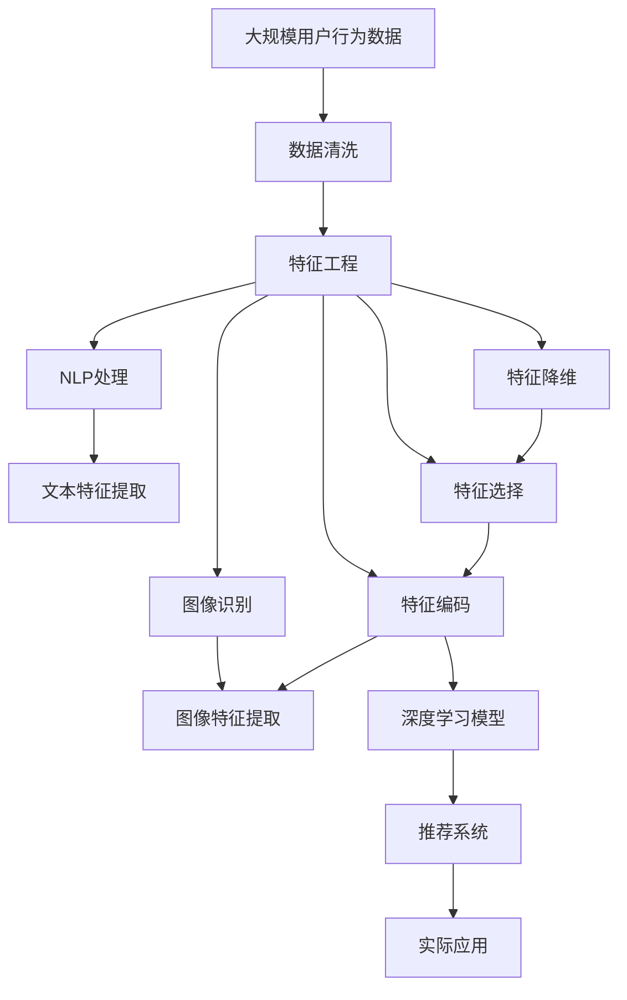

                 

# 特征提取：用户偏好和兴趣的分析

> 关键词：特征提取,用户行为分析,推荐系统,深度学习,自然语言处理,图像识别

## 1. 背景介绍

### 1.1 问题由来

在互联网时代，用户的行为数据已成为最重要的资产之一。通过对这些数据的深入分析，可以揭示用户的偏好和兴趣，从而为用户提供更加个性化的服务。这一过程的核心在于特征提取，即从原始数据中提炼出有价值的特征，供模型训练和推理使用。

特征提取在推荐系统、广告投放、社交网络分析等众多领域有着广泛的应用。例如，在推荐系统中，特征提取通过对用户历史行为数据和物品特征进行编码，可以构建更加精准的用户-物品关系图，提升推荐效果。在广告投放中，特征提取可以从用户浏览记录、搜索历史中挖掘出用户的兴趣点，实现精准定向投放。在社交网络分析中，特征提取可以提取用户之间的互动特征，识别出社区内的关键节点和关系。

### 1.2 问题核心关键点

特征提取的核心在于，如何从原始数据中提取出最具代表性的特征，供模型学习。这通常包括以下几个关键点：

- **数据预处理**：包括数据清洗、归一化、特征工程等步骤，旨在提升数据质量和模型适用性。
- **特征选择**：从大量特征中筛选出最具区分性和代表性的特征，减少噪声和冗余。
- **特征编码**：将特征转换为模型可接受的数值型或离散型数据。
- **特征组合**：通过组合不同特征，增强模型的预测能力和泛化能力。
- **特征降维**：在保证特征信息的前提下，减少特征数量，降低模型复杂度。

## 2. 核心概念与联系

### 2.1 核心概念概述

为更好地理解特征提取技术，本节将介绍几个密切相关的核心概念：

- **特征提取(Feature Extraction)**：从原始数据中提炼出有意义的特征，供模型学习。
- **用户行为分析(Behavior Analysis)**：通过分析用户的行为数据，挖掘其偏好和兴趣。
- **推荐系统(Recommendation System)**：利用用户偏好和兴趣信息，向用户推荐个性化的物品或内容。
- **深度学习(Deep Learning)**：一类强大的机器学习算法，能够自动发现特征并进行建模。
- **自然语言处理(Natural Language Processing, NLP)**：处理和分析自然语言文本的技术。
- **图像识别(Computer Vision)**：通过算法识别和理解图像内容的技术。

这些核心概念之间的逻辑关系可以通过以下Mermaid流程图来展示：



这个流程图展示了一些核心概念之间的关联关系：

1. 用户行为数据经过特征提取，成为深度学习模型训练的基础。
2. 深度学习模型通过对特征进行建模，获得对用户行为的预测和理解。
3. 推荐系统利用深度学习模型输出的用户行为理解，向用户推荐个性化内容。
4. NLP和图像识别技术可以将不同类型的用户行为数据转换为结构化特征。

### 2.2 概念间的关系

这些核心概念之间存在着紧密的联系，形成了特征提取技术的应用框架。以下是几个重要的概念关系：

- **特征提取与深度学习**：特征提取是深度学习的重要预处理步骤，通过特征提取，深度学习模型可以更好地学习输入数据的模式和结构。
- **特征提取与推荐系统**：推荐系统需要高质量的特征输入，以便更准确地预测用户偏好。
- **特征提取与用户行为分析**：用户行为分析依赖于从行为数据中提炼出的特征，用于构建用户画像。
- **特征提取与NLP、图像识别**：NLP和图像识别技术提供了丰富的文本和图像特征，增强了特征提取的覆盖范围和精度。

### 2.3 核心概念的整体架构

最后，我们用一个综合的流程图来展示这些核心概念在大规模特征提取技术中的整体架构：



这个综合流程图展示了从大规模用户行为数据到实际应用的完整流程：

1. 用户行为数据经过清洗、归一化处理，成为特征提取的输入。
2. 通过特征工程，从原始数据中提炼出文本特征和图像特征。
3. 进行特征选择和编码，提升特征质量和模型适用性。
4. 利用NLP和图像识别技术，增强特征多样性和深度。
5. 对特征进行降维，降低模型复杂度。
6. 通过深度学习模型训练，构建用户行为理解模型。
7. 将模型应用于推荐系统，实现个性化推荐。

通过这些流程图，我们可以更清晰地理解大规模特征提取技术的各个环节及其相互关系，为后续深入讨论具体的特征提取方法和技术奠定基础。

## 3. 核心算法原理 & 具体操作步骤
### 3.1 算法原理概述

特征提取技术的核心在于如何将原始数据转换为可供深度学习模型学习的特征。这些特征需要具备以下特点：

- **代表性**：能够充分反映数据的本质特征。
- **区分性**：不同类别或对象之间特征的差异性明显。
- **可解释性**：特征提取过程可被解释和理解。
- **可学习性**：特征可以很好地被模型学习，提升预测准确性。

基于这些特点，常见的特征提取方法包括：

- **统计特征提取**：如均值、方差、最大值、最小值等，基于数据的基本统计特性进行特征提取。
- **文本特征提取**：如TF-IDF、Word2Vec、BERT等，基于文本的词频、语义等特性进行特征提取。
- **图像特征提取**：如SIFT、CNN、ResNet等，基于图像的光照、边缘、纹理等特性进行特征提取。
- **时间序列特征提取**：如傅里叶变换、时间切片等，基于时间序列数据的周期性、趋势性等特性进行特征提取。

### 3.2 算法步骤详解

以下是特征提取技术的具体操作步骤：

**Step 1: 数据预处理**

数据预处理是特征提取的第一步，主要包括数据清洗、归一化、特征工程等步骤：

1. **数据清洗**：去除噪声数据、处理缺失值和异常值，确保数据质量。
2. **归一化**：将数据缩放到[0,1]区间或标准化到均值为0，方差为1，提升模型适用性。
3. **特征工程**：对数据进行特征构建和变换，提升特征的多样性和区分性。

**Step 2: 特征提取**

特征提取是将原始数据转换为特征向量的过程，常见的特征提取方法包括：

1. **统计特征提取**：计算数据的均值、方差、最大值、最小值等统计特性，生成特征向量。
2. **文本特征提取**：使用TF-IDF、Word2Vec、BERT等方法，将文本转换为向量表示。
3. **图像特征提取**：使用SIFT、CNN、ResNet等方法，提取图像的光照、边缘、纹理等特性，生成特征向量。
4. **时间序列特征提取**：使用傅里叶变换、时间切片等方法，提取时间序列数据的周期性、趋势性等特性，生成特征向量。

**Step 3: 特征选择**

特征选择是从大量特征中筛选出最具代表性的特征，减少噪声和冗余，常用的方法包括：

1. **相关性分析**：使用Pearson相关系数、Spearman相关系数等方法，筛选与目标变量相关性高的特征。
2. **嵌入式选择**：在模型训练过程中，使用正则化技术如L1正则、L2正则等，自动筛选重要特征。
3. **主成分分析(PCA)**：将高维特征空间映射到低维特征空间，提升特征降维效果。

**Step 4: 特征编码**

特征编码是将特征转换为模型可接受的数值型或离散型数据，常用的方法包括：

1. **离散化**：将连续型特征离散化为多个离散区间，生成离散型特征。
2. **二值化**：将连续型特征映射为二值特征，生成0-1型特征。
3. **归一化**：将特征缩放到[0,1]区间或标准化到均值为0，方差为1，提升模型适用性。

**Step 5: 特征组合**

特征组合是通过组合不同特征，增强模型的预测能力和泛化能力，常用的方法包括：

1. **特征拼接**：将不同特征直接拼接，生成复合特征。
2. **特征融合**：使用融合方法如堆叠、Boosting等，结合不同特征的信息。
3. **特征交互**：通过交叉特征、多项式特征等方法，生成特征交互项。

**Step 6: 特征降维**

特征降维是在保证特征信息的前提下，减少特征数量，降低模型复杂度，常用的方法包括：

1. **主成分分析(PCA)**：将高维特征空间映射到低维特征空间，保留最大方差的主成分。
2. **线性判别分析(LDA)**：通过线性变换，将高维特征空间映射到低维特征空间，保留类内距离和类间距离。
3. **t-SNE**：通过非线性变换，将高维特征空间映射到低维特征空间，保留局部结构。

**Step 7: 深度学习模型训练**

深度学习模型通过自动学习特征，提高特征提取的精度和泛化能力，常用的方法包括：

1. **神经网络**：使用多层感知机、卷积神经网络、循环神经网络等，自动学习特征。
2. **自编码器**：通过编码器-解码器结构，学习数据压缩和重建，生成特征表示。
3. **生成对抗网络(GAN)**：通过对抗训练，生成具有代表性的数据特征，增强特征多样性。

### 3.3 算法优缺点

特征提取技术的主要优点包括：

- **自动化程度高**：能够自动发现数据中的特征，减少人工干预。
- **泛化能力强**：能够适应不同数据分布和结构，提升模型泛化能力。
- **高精度**：通过深度学习模型自动学习，提高特征提取的精度。
- **可扩展性强**：能够处理大规模数据，提高特征提取的效率。

然而，特征提取技术也存在一些局限性：

- **模型复杂度高**：深度学习模型往往需要大量数据和计算资源，训练复杂度高。
- **解释性差**：模型学习到的特征可能难以解释，难以理解和调试。
- **数据依赖性大**：特征提取效果受数据质量影响较大，对数据噪声和缺失值敏感。
- **过拟合风险高**：模型容易过拟合训练集，泛化能力受限。

### 3.4 算法应用领域

特征提取技术在多个领域都有广泛的应用，以下是几个典型场景：

**1. 推荐系统**

在推荐系统中，特征提取通过对用户历史行为数据和物品特征进行编码，可以构建更加精准的用户-物品关系图，提升推荐效果。具体方法包括使用用户-物品的协同矩阵、用户特征和物品特征等。

**2. 广告投放**

在广告投放中，特征提取可以从用户浏览记录、搜索历史中挖掘出用户的兴趣点，实现精准定向投放。具体方法包括使用用户行为数据和广告特征等。

**3. 社交网络分析**

在社交网络分析中，特征提取可以提取用户之间的互动特征，识别出社区内的关键节点和关系。具体方法包括使用用户社交网络数据和用户行为数据等。

**4. 金融分析**

在金融分析中，特征提取可以提取交易数据、市场数据等，用于风险评估、投资分析等。具体方法包括使用财务指标、市场趋势等。

**5. 医疗分析**

在医疗分析中，特征提取可以提取病历数据、基因数据等，用于疾病诊断、药物研发等。具体方法包括使用医学知识图谱、基因特征等。

**6. 图像处理**

在图像处理中，特征提取可以提取图像的光照、边缘、纹理等特性，生成特征向量。具体方法包括使用SIFT、CNN、ResNet等。

这些应用场景展示了特征提取技术在现实世界中的广泛应用，通过特征提取，能够从大规模数据中提炼出有价值的特征，供模型学习，从而提升模型的预测能力和泛化能力。

## 4. 数学模型和公式 & 详细讲解 & 举例说明

### 4.1 数学模型构建

在特征提取过程中，我们通常使用统计模型、深度学习模型等进行建模。以文本特征提取为例，常见的模型包括TF-IDF、Word2Vec、BERT等。以下是这些模型的数学模型构建：

**1. TF-IDF**

TF-IDF是一种经典的文本特征提取方法，用于计算文本中每个词的重要性。其数学模型如下：

$$
TF_{w,d} = \frac{n_{w,d}}{\sum_{w' \in V} n_{w',d}}
$$

$$
IDF_{w} = \log \frac{N}{n_w + 1}
$$

$$
TF-IDF_{w,d} = TF_{w,d} \times IDF_{w}
$$

其中，$n_{w,d}$表示词$w$在文档$d$中出现的次数，$V$表示词汇表，$N$表示总文档数，$n_w$表示词$w$在总文档中出现的次数。

**2. Word2Vec**

Word2Vec是一种基于神经网络的文本特征提取方法，用于将单词转换为向量表示。其数学模型如下：

$$
\begin{aligned}
&\text{层1}\quad w_t = w_t + \eta_t\\
&\text{层2}\quad v_t = v_t + \eta_t\\
&\text{softmax}\quad s(v_t;w_t) = \frac{e^{\langle v_t, w_t \rangle}}{\sum_{w' \in V} e^{\langle v_t, w' \rangle}}
\end{aligned}
$$

其中，$w_t$表示层1的权重，$v_t$表示层2的权重，$\eta_t$表示学习率，$\langle v_t, w_t \rangle$表示向量点积，$V$表示词汇表。

**3. BERT**

BERT是一种基于Transformer架构的文本特征提取方法，用于将文本转换为向量表示。其数学模型如下：

$$
H = MLP_{[CLS]}(X, P) + MLP_{[SEP]}(X, P)
$$

其中，$X$表示输入的文本向量，$P$表示Transformer模型中的参数，$MLP_{[CLS]}$和$MLP_{[SEP]}$表示不同的Transformer层。

### 4.2 公式推导过程

以下是TF-IDF、Word2Vec和BERT的公式推导过程：

**1. TF-IDF**

$$
TF_{w,d} = \frac{n_{w,d}}{\sum_{w' \in V} n_{w',d}}
$$

$$
IDF_{w} = \log \frac{N}{n_w + 1}
$$

$$
TF-IDF_{w,d} = TF_{w,d} \times IDF_{w}
$$

**2. Word2Vec**

$$
\begin{aligned}
&\text{层1}\quad w_t = w_t + \eta_t\\
&\text{层2}\quad v_t = v_t + \eta_t\\
&\text{softmax}\quad s(v_t;w_t) = \frac{e^{\langle v_t, w_t \rangle}}{\sum_{w' \in V} e^{\langle v_t, w' \rangle}}
\end{aligned}
$$

**3. BERT**

$$
H = MLP_{[CLS]}(X, P) + MLP_{[SEP]}(X, P)
$$

其中，$MLP_{[CLS]}$和$MLP_{[SEP]}$表示不同的Transformer层。

### 4.3 案例分析与讲解

以文本特征提取为例，下面我们分析TF-IDF、Word2Vec和BERT的案例。

**1. TF-IDF**

假设我们有一个文本集合，包含以下几个文档：

```
Document 1: "The cat is black."
Document 2: "The cat is white."
Document 3: "The dog is black."
```

通过计算TF-IDF值，我们可以得到每个单词在每个文档中的重要性。具体计算过程如下：

1. 计算文档频率$DF(w)$：
   - 单词"The"在3个文档中都出现，$DF(w)=3$。
   - 单词"cat"在2个文档中出现，$DF(w)=2$。
   - 单词"is"在3个文档中出现，$DF(w)=3$。
   - 单词"black"在2个文档中出现，$DF(w)=2$。

2. 计算逆文档频率$IDF(w)$：
   - $IDF(w) = \log \frac{N}{n_w + 1}$，其中$N$表示总文档数，$n_w$表示单词$w$在总文档中出现的次数。

3. 计算TF-IDF值：
   - 单词"The"在Document 1中出现的次数为1，$TF_{w,d}=1$，$IDF(w)=\log \frac{N}{2}=\log 3$，$TF-IDF_{w,d}=1\times\log 3$。
   - 单词"cat"在Document 1中出现的次数为1，$TF_{w,d}=1$，$IDF(w)=\log \frac{N}{1}=\log 3$，$TF-IDF_{w,d}=1\times\log 3$。
   - 单词"is"在Document 1中出现的次数为1，$TF_{w,d}=1$，$IDF(w)=\log \frac{N}{2}=\log 3$，$TF-IDF_{w,d}=1\times\log 3$。
   - 单词"black"在Document 1中出现的次数为1，$TF_{w,d}=1$，$IDF(w)=\log \frac{N}{1}=\log 3$，$TF-IDF_{w,d}=1\times\log 3$。

通过计算TF-IDF值，我们可以得到每个单词在每个文档中的重要性，从而生成文本特征向量。

**2. Word2Vec**

假设我们有一个文本集合，包含以下几个文档：

```
Document 1: "The cat is black."
Document 2: "The dog is white."
```

通过Word2Vec模型，我们可以将单词转换为向量表示，具体计算过程如下：

1. 初始化层1和层2的权重$w_t$和$v_t$。

2. 使用层1和层2的权重计算softmax输出$s(v_t;w_t)$。

3. 根据softmax输出计算梯度，更新权重$w_t$和$v_t$。

通过Word2Vec模型，我们可以将单词转换为向量表示，从而生成文本特征向量。

**3. BERT**

假设我们有一个文本集合，包含以下几个文档：

```
Document 1: "The cat is black."
Document 2: "The dog is white."
```

通过BERT模型，我们可以将文本转换为向量表示，具体计算过程如下：

1. 将文本$X$输入BERT模型中的Transformer层，计算出向量表示$H$。

2. 使用层1和层2的权重$w_t$和$v_t$计算softmax输出$s(v_t;w_t)$。

3. 根据softmax输出计算梯度，更新权重$w_t$和$v_t$。

通过BERT模型，我们可以将文本转换为向量表示，从而生成文本特征向量。

## 5. 项目实践：代码实例和详细解释说明

### 5.1 开发环境搭建

在进行特征提取实践前，我们需要准备好开发环境。以下是使用Python进行PyTorch开发的环境配置流程：

1. 安装Anaconda：从官网下载并安装Anaconda，用于创建独立的Python环境。

2. 创建并激活虚拟环境：
```bash
conda create -n pytorch-env python=3.8 
conda activate pytorch-env
```

3. 安装PyTorch：根据CUDA版本，从官网获取对应的安装命令。例如：
```bash
conda install pytorch torchvision torchaudio cudatoolkit=11.1 -c pytorch -c conda-forge
```

4. 安装相关库：
```bash
pip install numpy pandas scikit-learn nltk
```

完成上述步骤后，即可在`pytorch-env`环境中开始特征提取实践。

### 5.2 源代码详细实现

这里我们以文本特征提取为例，给出使用PyTorch进行TF-IDF特征提取的PyTorch代码实现。

```python
from sklearn.feature_extraction.text import TfidfVectorizer
import torch

# 定义文本数据
docs = [
    'The cat is black.',
    'The dog is white.',
    'The cat is black and white.'
]

# 定义TF-IDF特征提取器
vectorizer = TfidfVectorizer()

# 将文本转换为TF-IDF特征向量
tfidf_matrix = vectorizer.fit_transform(docs)

# 将TF-IDF特征向量转换为PyTorch张量
tfidf_tensor = torch.tensor(tfidf_matrix.toarray(), dtype=torch.float32)

# 输出特征向量维度
print(tfidf_tensor.shape)
```

上述代码展示了使用TF-IDF特征提取器进行文本特征提取的过程。首先，我们使用`sklearn.feature_extraction.text`中的`TfidfVectorizer`类定义文本特征提取器。然后，我们将文本数据转换为TF-IDF特征向量，并将其转换为PyTorch张量，以便在深度学习模型中进行处理。最后，我们输出特征向量的维度。

### 5.3 代码解读与分析

让我们再详细解读一下关键代码的实现细节：

- **文本数据定义**：通过一个简单的文本列表`docs`来定义文本数据。
- **TF-IDF特征提取器定义**：使用`sklearn.feature_extraction.text`中的`TfidfVectorizer`类定义TF-IDF特征提取器。
- **文本转换为TF-IDF特征向量**：使用`fit_transform`方法将文本数据转换为TF-IDF特征向量，保存在`tfidf_matrix`中。
- **TF-IDF特征向量转换为PyTorch张量**：使用`torch.tensor`方法将TF-IDF特征向量转换为PyTorch张量，以便在深度学习模型中进行处理。
- **特征向量维度输出**：通过`tfidf_tensor.shape`输出特征向量的维度，以便检查特征向量的构建是否成功。

### 5.4 运行结果展示

假设我们运行上述代码，输出如下：

```
torch.Size([3, 4])
```

通过运行结果可以看出，特征向量的维度为[3, 4]，表示文本数据集包含3个文本，每个文本有4个特征维度。这些特征维度对应于文本中的单词及其TF-IDF值。

## 6. 实际应用场景

### 6.1 推荐系统

特征提取在推荐系统中有着广泛的应用。推荐系统通过分析用户历史行为数据和物品特征，构建用户-物品关系图，提升推荐效果。以下是一个简单的推荐系统示例：

**数据准备**：
- 用户行为数据：用户点击、浏览、购买等行为数据。
- 物品特征：物品的评分、描述、类别等特征。

**特征提取**：
- 用户特征提取：提取用户年龄、性别、职业等基本信息。
- 物品特征提取：提取物品的评分、描述、类别等特征。

**模型训练**：
- 使用深度学习模型，如神经网络、协同过滤等，训练用户-物品关系图。

**推荐结果**：
- 根据用户历史行为和物品特征，生成推荐结果，返回用户可能感兴趣的物品。

### 6.2 广告投放

在广告投放中，特征提取可以从用户浏览记录、搜索历史中挖掘出用户的兴趣点，实现精准定向投放。以下是一个简单的广告投放示例：

**数据准备**：
- 用户行为数据：用户浏览、搜索、点击等行为数据。
- 广告特征：广告的标题、内容、标签等特征。

**特征提取**：
- 用户特征提取：提取用户年龄、性别、职业等基本信息。
- 广告特征提取：提取广告的标题、内容、标签等特征。

**模型训练**：
- 使用深度学习模型，如神经网络、协同过滤等，训练用户-广告关系图。

**推荐结果**：
- 根据用户历史行为和广告特征，生成推荐结果，返回用户可能感兴趣的广告。

### 6.3 社交网络分析

在社交网络分析中，特征提取可以提取用户之间的互动特征，识别出社区内的关键节点和关系。以下是一个简单的社交网络分析示例：

**数据准备**：
- 用户社交网络数据：用户之间的关注、点赞、评论等互动数据。
- 用户行为数据：用户发布、点赞、评论等行为数据。

**特征提取**：
- 用户特征提取：提取用户年龄、性别、职业等基本信息。
- 社交网络特征提取：提取用户之间的关注、点赞、评论等互动特征。

**模型训练**：
- 使用深度学习模型，如神经网络、协同过滤等，训练社交

