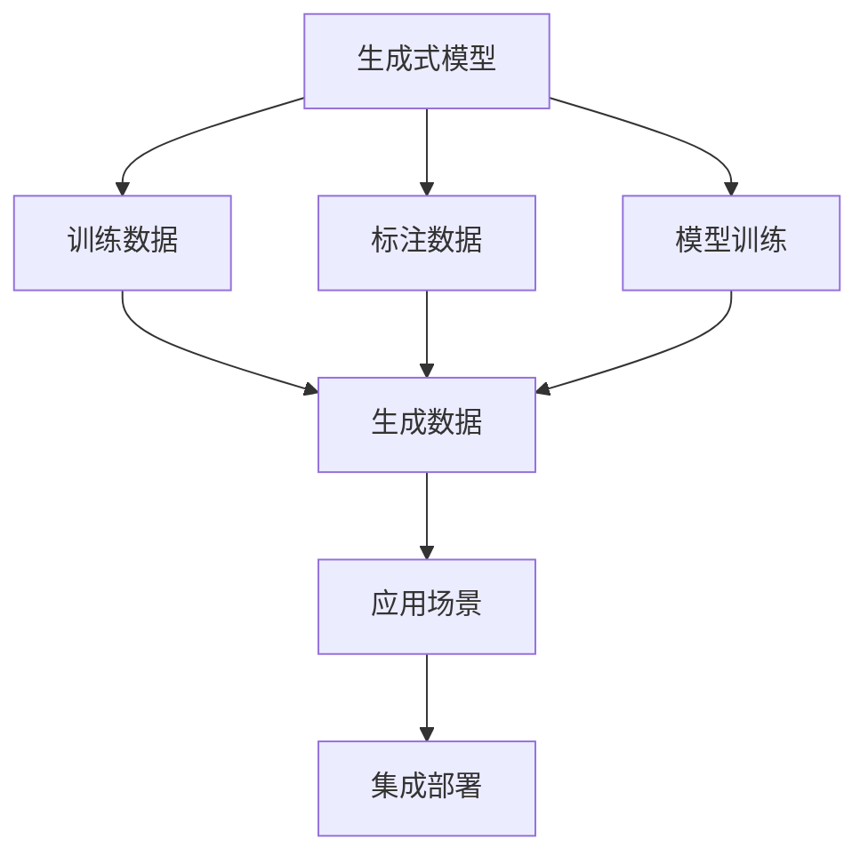
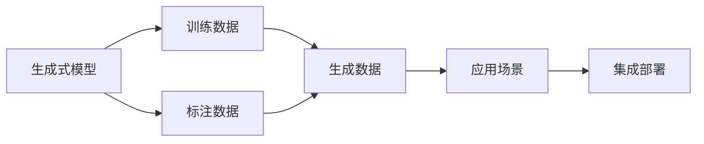
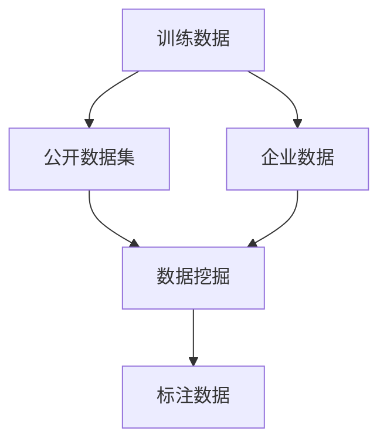
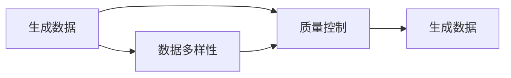
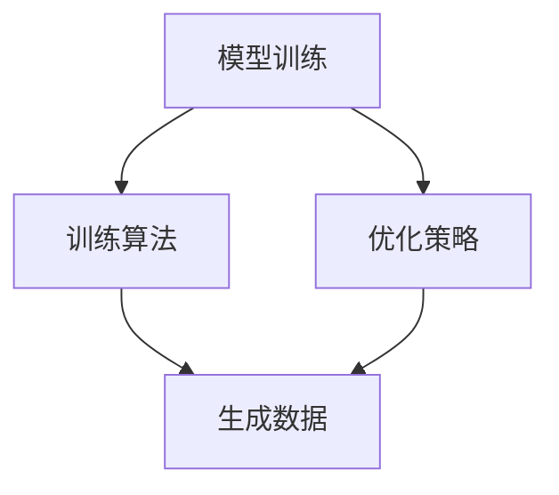
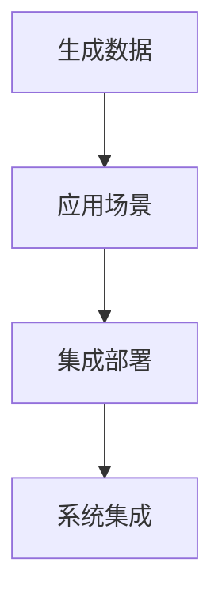
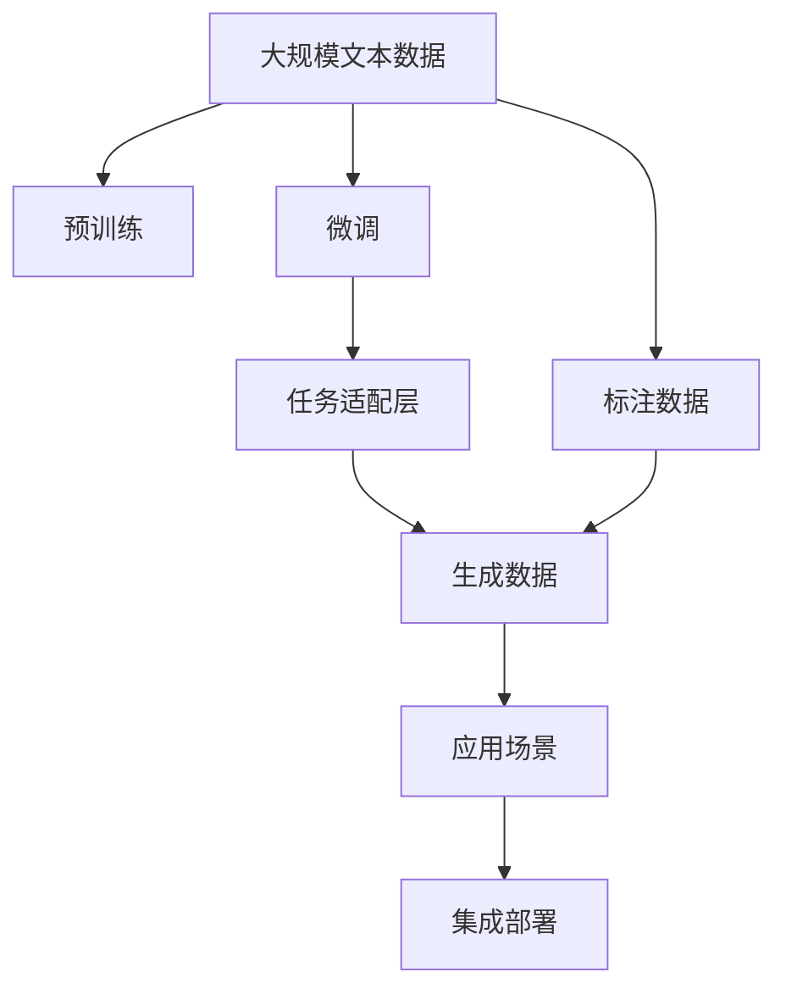

                 

# 生成式AIGC：从理论到实践的商业应用

> 关键词：生成式AIGC,人工智能,机器学习,商业应用,自然语言处理(NLP),图像生成,计算机视觉,音频生成,语音合成,自动化创作

## 1. 背景介绍

### 1.1 问题由来
近年来，人工智能（AI）技术在各个领域的应用如火如荼，其中生成式人工智能（AIGC）成为了新的热点。生成式AIGC，即Generative Adversarial Networks（GANs）和Autoregressive Models（如Transformer），能够通过模型训练生成高质量、逼真的人脸图像、文本、音频等内容。这些生成式模型在商业应用中具有广泛的应用前景，如内容创作、媒体娱乐、个性化推荐、智能客服、自动驾驶、虚拟现实等。

生成式AIGC的核心思想是利用神经网络模型学习生成数据的概率分布，从而生成符合特定分布的数据样本。这种生成式模型可以用于文本生成、图像生成、音频生成等多个领域，为各行业带来了革命性的变化。然而，生成式AIGC模型的训练和应用仍面临诸多挑战，如模型的训练成本、数据的标注需求、生成的数据质量等。

### 1.2 问题核心关键点
生成式AIGC的核心关键点包括：

- 生成式模型（如GANs、Transformer等）：学习生成数据的概率分布，通过逆过程生成高质量样本。
- 训练数据和标注：需要大量高质标注数据，以及有监督的训练过程。
- 生成质量与多样性：生成式模型需生成高质量、多样性的数据样本，满足商业应用需求。
- 模型训练和优化：需要高效的训练算法和优化策略，以降低计算成本。
- 部署与集成：如何将模型集成到实际应用中，确保生成数据的实时性和可控性。

这些关键点共同构成了生成式AIGC的技术框架，并通过不断的技术进步和实际应用探索，逐步在商业领域展现出强大的潜力。

### 1.3 问题研究意义
研究生成式AIGC技术，对于拓展AI技术在商业应用中的应用范围，提升人工智能系统的智能化水平，具有重要的理论和实际意义：

1. 降低应用开发成本：生成式AIGC模型能够自动生成高质量数据，减少了人工标注和创作的工作量，大大降低了开发成本。
2. 提升生成数据质量：生成式模型在训练过程中学习生成高质量数据，减少了对人工干预的依赖，提升了数据的真实性和多样性。
3. 加速开发进度：生成式AIGC技术可以快速生成大量数据样本，为NLP、计算机视觉、音频处理等任务提供了丰富的训练数据，加速了模型开发和迭代。
4. 带来技术创新：生成式AIGC技术推动了AI领域的一系列创新，如模型结构的优化、生成策略的改进、训练方法的多样化等，为AI技术的发展提供了新的思路和方法。
5. 赋能产业升级：生成式AIGC技术为各行业带来了新的应用场景和价值，如虚拟主播、虚拟偶像、虚拟客服等，推动了行业数字化转型和智能化升级。

总之，生成式AIGC技术通过模型训练和自动生成数据，使得AI技术更加智能化、自动化、高效化，为商业应用提供了强大的技术支持。

## 2. 核心概念与联系

### 2.1 核心概念概述

为更好地理解生成式AIGC技术，本节将介绍几个密切相关的核心概念：

- 生成式模型（Generative Model）：如GANs、Transformer等，通过学习数据的概率分布，生成高质量的数据样本。
- 训练数据和标注（Training Data and Annotation）：生成式模型的训练需要大量标注数据，用于指导模型的学习过程。
- 生成数据质量与多样性（Data Quality and Diversity）：生成式模型需生成的数据需满足真实性、多样性、一致性等质量要求。
- 模型训练和优化（Model Training and Optimization）：需要高效的训练算法和优化策略，以提升模型生成数据的精度和效率。
- 部署与集成（Deployment and Integration）：将生成式模型集成到实际应用中，确保生成的数据满足实时性和可控性。

这些核心概念之间的逻辑关系可以通过以下Mermaid流程图来展示：



这个流程图展示了大语言模型微调过程中各个核心概念的关系：

1. 生成式模型通过训练数据学习生成数据分布，生成高质量的数据样本。
2. 生成式模型在训练过程中，需要大量的标注数据进行指导。
3. 生成的数据需满足真实性、多样性、一致性等质量要求，以符合实际应用需求。
4. 通过高效的训练算法和优化策略，提升生成数据的精度和效率。
5. 将生成式模型集成到实际应用中，确保生成的数据满足实时性和可控性。

这些核心概念共同构成了生成式AIGC技术的完整生态系统，使其能够在各种场景下发挥强大的生成能力。

### 2.2 概念间的关系

这些核心概念之间存在着紧密的联系，形成了生成式AIGC技术的完整生态系统。下面我们通过几个Mermaid流程图来展示这些概念之间的关系。

#### 2.2.1 生成式模型的学习范式



这个流程图展示了生成式模型的学习范式，从训练数据和标注数据中学习生成数据的概率分布，生成符合应用需求的数据。

#### 2.2.2 训练数据与标注的来源



这个流程图展示了训练数据和标注数据的来源，包括公开数据集和企业数据，以及数据挖掘生成的数据和标注。

#### 2.2.3 生成数据的多样性与质量控制



这个流程图展示了生成数据的多样性和质量控制。生成的数据需满足多样性和质量要求，才能满足实际应用需求。

#### 2.2.4 模型训练与优化



这个流程图展示了模型训练与优化的过程，通过高效的训练算法和优化策略，提升生成数据的精度和效率。

#### 2.2.5 生成数据的应用与集成



这个流程图展示了生成数据的应用与集成过程，将生成的数据集成到实际应用中，确保生成的数据满足实时性和可控性。

### 2.3 核心概念的整体架构

最后，我们用一个综合的流程图来展示这些核心概念在大语言模型微调过程中的整体架构：



这个综合流程图展示了从预训练到微调，再到生成数据的应用和集成的完整过程。生成式模型首先在大规模文本数据上进行预训练，然后通过微调学习生成符合任务需求的数据。接着，通过任务适配层生成符合具体应用场景的生成数据，最后将数据集成到实际应用中，确保生成的数据满足实时性和可控性。

通过这些流程图，我们可以更清晰地理解生成式AIGC技术的核心概念及其之间的关系，为后续深入讨论具体的生成式模型和应用方法奠定基础。

## 3. 核心算法原理 & 具体操作步骤
### 3.1 算法原理概述

生成式AIGC技术的核心算法原理基于生成对抗网络（GANs）和自回归模型（如Transformer）。生成对抗网络通过对抗训练的方式，生成高质量、逼真的人脸图像、文本、音频等内容；自回归模型通过逆过程生成数据，具有高效的推理和生成能力。

生成对抗网络（GANs）由生成器（Generator）和判别器（Discriminator）两部分组成。生成器学习生成数据，判别器学习判断数据是否真实。两者通过对抗训练的方式，不断优化生成器的生成能力和判别器的判别能力，最终生成高质量的生成数据。

自回归模型（如Transformer）通过逆过程生成数据，具有高效的推理和生成能力。Transformer模型通过编码器-解码器结构，学习数据的概率分布，生成符合特定分布的数据样本。

### 3.2 算法步骤详解

生成式AIGC技术的核心算法步骤包括数据准备、模型构建、训练优化和应用部署等环节。

#### 3.2.1 数据准备

生成式AIGC模型的训练需要大量的标注数据。数据准备步骤包括：

1. 收集和整理训练数据，确保数据的多样性和质量。
2. 将数据标注化，生成训练集、验证集和测试集。
3. 对数据进行预处理，包括归一化、标准化、数据增强等。

#### 3.2.2 模型构建

生成式AIGC模型的构建包括：

1. 选择合适的生成式模型，如GANs、Transformer等。
2. 设计任务适配层，将生成式模型与具体任务需求相匹配。
3. 设计损失函数，用于衡量生成数据的真实性和多样性。

#### 3.2.3 训练优化

生成式AIGC模型的训练优化步骤包括：

1. 选择合适的优化器，如Adam、SGD等。
2. 设置合适的学习率、批大小、迭代轮数等。
3. 应用正则化技术，如L2正则、Dropout、Early Stopping等，避免过拟合。
4. 使用对抗训练、数据增强等技术，提高生成数据的真实性和多样性。

#### 3.2.4 应用部署

生成式AIGC模型的应用部署步骤包括：

1. 将模型集成到实际应用中，如内容创作、媒体娱乐、个性化推荐等。
2. 设计接口，方便调用生成式模型进行数据生成。
3. 实现实时性、可控性的数据生成，满足实际应用需求。

### 3.3 算法优缺点

生成式AIGC技术具有以下优点：

1. 生成数据的高质量与多样性：生成式模型通过训练学习生成高质量、多样性的数据样本，满足实际应用需求。
2. 高效的数据生成能力：生成式模型能够快速生成大量数据样本，加速模型开发和迭代。
3. 泛化能力较强：生成式模型在预训练阶段学习到广泛的领域知识，能够很好地适应不同的应用场景。

生成式AIGC技术也存在以下缺点：

1. 训练成本较高：生成式模型的训练需要大量的标注数据和高性能计算资源，成本较高。
2. 模型复杂度较高：生成式模型结构复杂，训练和优化过程较为困难。
3. 生成的数据可能存在偏差：生成式模型在训练过程中可能会学习到数据的偏见，生成存在偏见的生成数据。

尽管存在这些局限性，但生成式AIGC技术仍是大规模生成数据的重要手段，广泛应用于内容创作、媒体娱乐、个性化推荐等诸多领域。未来，随着算力成本的下降和数据规模的扩大，生成式AIGC技术将逐步得到更广泛的应用。

### 3.4 算法应用领域

生成式AIGC技术已经被广泛应用于以下多个领域：

1. 内容创作：生成式模型能够自动生成高质量的文本、图像、音频等内容，为内容创作提供新的创意来源。
2. 媒体娱乐：生成式模型能够生成逼真的人脸图像、动画角色、虚拟场景等，为影视、游戏、虚拟现实等媒体娱乐行业带来革命性的变化。
3. 个性化推荐：生成式模型能够生成个性化的推荐内容，提升用户满意度和粘性。
4. 智能客服：生成式模型能够自动生成个性化的客服回答，提升客户体验和满意度。
5. 自动驾驶：生成式模型能够生成虚拟道路场景、交通标志等，为自动驾驶模拟训练提供高质量数据。
6. 虚拟现实：生成式模型能够生成逼真的虚拟场景和角色，为虚拟现实应用提供强大的支持。

除了这些应用领域外，生成式AIGC技术还在教育、医疗、金融等领域得到广泛应用，为这些行业带来了新的价值和可能性。

## 4. 数学模型和公式 & 详细讲解 & 举例说明

### 4.1 数学模型构建

生成式AIGC技术的数学模型主要基于概率模型和优化模型。假设生成式模型为 $G(z;\theta)$，其中 $z$ 为随机噪声，$\theta$ 为模型参数。生成式模型的目标是通过训练学习生成数据 $x$ 的概率分布 $p(x|z;\theta)$。

对于GANs，生成器的目标是最小化判别器损失 $L_D$，判别器的目标是最小化生成器损失 $L_G$。判别器损失定义为：

$$
L_D = \mathbb{E}_{x \sim p_{data}(x)}[\log D(x)] + \mathbb{E}_{z \sim p(z)}[\log (1-D(G(z;\theta))]]
$$

生成器损失定义为：

$$
L_G = \mathbb{E}_{z \sim p(z)}[\log D(G(z;\theta))]
$$

对于自回归模型（如Transformer），通过逆过程生成数据，其生成过程可以表示为：

$$
x_t = \mathbb{E}_{p(x)}[x_t|x_{<t};\theta]
$$

其中 $x_t$ 为第 $t$ 个时间步的输出，$x_{<t}$ 为前 $t-1$ 个时间步的输出。自回归模型的目标是最大化似然概率 $p(x_{1:T}|\theta)$。

### 4.2 公式推导过程

下面以生成对抗网络（GANs）为例，推导判别器损失函数和生成器损失函数的详细推导过程。

#### 4.2.1 判别器损失函数

判别器的目标是区分真实数据和生成数据，其损失函数为：

$$
L_D = -\mathbb{E}_{x \sim p_{data}(x)}[\log D(x)] - \mathbb{E}_{z \sim p(z)}[\log (1-D(G(z;\theta))]
$$

其中，$p_{data}(x)$ 为真实数据的概率分布，$D$ 为判别器的预测概率。

判别器在训练过程中，通过最小化判别器损失函数，学习区分真实数据和生成数据的能力。

#### 4.2.2 生成器损失函数

生成器的目标是生成高质量的生成数据，其损失函数为：

$$
L_G = -\mathbb{E}_{z \sim p(z)}[\log D(G(z;\theta))]
$$

生成器在训练过程中，通过最小化生成器损失函数，学习生成高质量生成数据的能力。

### 4.3 案例分析与讲解

假设我们希望生成高质量的人脸图像，使用GANs技术。

#### 4.3.1 数据准备

首先需要收集和整理高质量的人脸图像数据，如LFW、CelebA等公开数据集，或自行收集并标注数据。将数据划分为训练集、验证集和测试集，并进行预处理，如归一化、标准化、数据增强等。

#### 4.3.2 模型构建

选择GANs模型作为生成器，判别器可以使用卷积神经网络（CNN）。设计任务适配层，将生成器输出的图像进行分类、生成等处理，满足具体应用需求。设计损失函数，如GAN损失函数，用于衡量生成数据的真实性和多样性。

#### 4.3.3 训练优化

选择Adam优化器，设置合适的学习率、批大小、迭代轮数等。应用正则化技术，如L2正则、Dropout、Early Stopping等，避免过拟合。使用对抗训练、数据增强等技术，提高生成数据的真实性和多样性。

#### 4.3.4 应用部署

将训练好的模型集成到实际应用中，如人脸识别、虚拟现实等场景。设计接口，方便调用生成式模型进行数据生成。实现实时性、可控性的数据生成，满足实际应用需求。

## 5. 项目实践：代码实例和详细解释说明

### 5.1 开发环境搭建

在进行生成式AIGC项目实践前，我们需要准备好开发环境。以下是使用Python进行PyTorch开发的环境配置流程：

1. 安装Anaconda：从官网下载并安装Anaconda，用于创建独立的Python环境。

2. 创建并激活虚拟环境：
```bash
conda create -n pytorch-env python=3.8 
conda activate pytorch-env
```

3. 安装PyTorch：根据CUDA版本，从官网获取对应的安装命令。例如：
```bash
conda install pytorch torchvision torchaudio cudatoolkit=11.1 -c pytorch -c conda-forge
```

4. 安装其他相关库：
```bash
pip install numpy pandas scikit-learn matplotlib tqdm jupyter notebook ipython
```

完成上述步骤后，即可在`pytorch-env`环境中开始生成式AIGC项目实践。

### 5.2 源代码详细实现

下面我们以生成高质量人脸图像的GANs项目为例，给出使用PyTorch实现GANs的代码实现。

首先，定义数据集处理函数：

```python
from torchvision import datasets, transforms
from torch.utils.data import DataLoader

class CelebADataset(datasets.ImageFolder):
    def __init__(self, root, transform=None):
        super(CelebADataset, self).__init__(root, transform)

    def __getitem__(self, index):
        img, label = self.imgs[index]
        img = datasets.ImageFolder载影()

```

