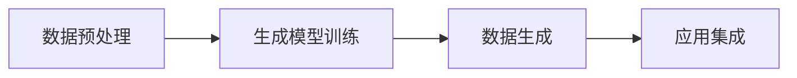
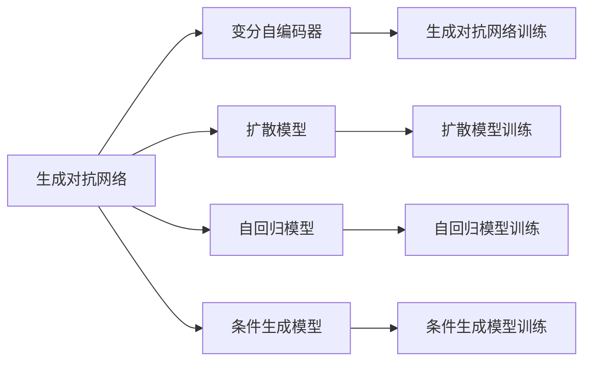

                 

# 生成式AIGC：商业智能的新引擎

## 1. 背景介绍

### 1.1 问题由来
随着人工智能(AI)技术的迅猛发展，生成式人工智能(Generative AI, AIGC)逐渐成为商业智能(Business Intelligence, BI)领域的新引擎。AIGC通过深度学习和生成模型，能够自主生成高仿真度、高相关性的数据，帮助企业深入洞察业务动向，实现更加精准的决策支持。与传统的BI工具相比，AIGC能够处理更大规模、更多维度的数据，挖掘更复杂、更深入的业务关联，并具备更强的动态适应性和交互性。

AIGC的应用场景非常广泛，涵盖金融、医疗、电商、制造等多个行业。在金融领域，AIGC可以生成逼真的交易数据和市场模拟，帮助金融机构进行风险评估和策略测试。在医疗领域，AIGC可以生成虚拟的病历记录和临床试验数据，辅助医生进行诊断和治疗。在电商领域，AIGC可以生成商品推荐和广告文案，提升用户体验和销售转化率。在制造领域，AIGC可以生成设备运行维护记录和供应链管理数据，优化生产流程和资源配置。

### 1.2 问题核心关键点
AIGC的核心在于通过生成模型，从给定的输入数据中学习到数据的生成过程，并能够根据新的条件生成相似的数据。其核心算法包括生成对抗网络(GAN)、变分自编码器(VAE)、扩散模型等。这些算法能够学习到数据的低维嵌入表示，并通过条件采样生成新的数据。

AIGC的技术框架一般包括以下几个关键点：

- 数据预处理：对原始数据进行清洗、归一化、特征工程等处理，提取有意义的特征信息。
- 生成模型训练：使用生成的算法和模型对数据进行训练，学习数据的生成过程。
- 数据生成：根据新的条件，使用训练好的生成模型生成高仿真度的数据。
- 应用集成：将生成的数据集成到实际应用场景中，实现业务决策支持。

通过这些关键点的协同工作，AIGC能够不断提升其生成数据的质量和应用效果，成为BI领域的重要工具。

### 1.3 问题研究意义
AIGC技术的研究与应用，对于推动商业智能领域的发展，具有重要意义：

1. 提升数据质量：AIGC能够生成高质量的数据，弥补真实数据的缺陷，解决数据稀疏、噪声等问题，提升BI模型的精度。
2. 扩充数据规模：AIGC能够生成大规模的数据，扩充数据集，提升BI模型的泛化能力。
3. 增强预测能力：AIGC能够生成与真实数据分布相似的数据，提升模型对未来事件的预测准确性。
4. 促进多模态融合：AIGC能够生成多模态数据，促进文本、图像、音频等多种数据类型的融合，提升BI模型的综合分析能力。
5. 强化决策支持：AIGC生成的仿真数据，能够帮助业务人员更深入地理解业务过程和决策结果，提升决策的合理性和可信度。

AIGC技术的不断发展，必将极大地提升商业智能的应用效果，推动企业数字化转型和智能化升级。

## 2. 核心概念与联系

### 2.1 核心概念概述

AIGC的实现离不开以下几个核心概念：

- **生成对抗网络(GAN)**：由生成器(Generator)和判别器(Discriminator)两部分组成，通过对抗训练学习数据的生成过程，生成与真实数据相似的新数据。
- **变分自编码器(VAE)**：使用变分推断的方法，将数据编码为低维的潜在变量，再通过解码器生成原始数据。VAE主要用于生成与原始数据分布相似的数据。
- **扩散模型(Diffusion Model)**：通过逐步引入噪声，将高维数据映射到低维潜在空间，再逐步去噪生成原始数据。扩散模型尤其擅长生成连续分布的数据，如自然语言文本。
- **自回归模型(AR)**：通过自回归的方式，生成数据序列，适用于文本生成、音频生成等序列数据的生成任务。
- **条件生成模型**：通过引入条件变量，生成与条件相关的数据，应用于如个性化推荐、内容生成等任务。

这些核心概念之间通过数学和算法的关系紧密相连，形成一个完整的AIGC技术框架。以下是一个Mermaid流程图来展示这些概念的关系：



### 2.2 概念间的关系

这些核心概念之间的逻辑关系可以通过以下Mermaid流程图来展示：



这个流程图展示了AIGC技术中的各个核心概念及其之间的关联。其中，生成对抗网络(GAN)是AIGC的基础，变分自编码器(VAE)和扩散模型(Diffusion Model)是其重要的生成模型方法，自回归模型(AR)和条件生成模型是数据生成和应用集成中常用的技术手段。

## 3. 核心算法原理 & 具体操作步骤
### 3.1 算法原理概述

AIGC的生成算法主要包括三类：生成对抗网络(GAN)、变分自编码器(VAE)和扩散模型(Diffusion Model)。这些算法通过不同的方式学习数据的生成过程，并生成逼真的新数据。

**生成对抗网络(GAN)**：由生成器和判别器两部分组成，通过对抗训练学习数据的生成过程。生成器试图生成与真实数据相似的新数据，判别器试图区分生成的数据和真实数据。两个部分相互博弈，最终生成器能够生成高质量的数据。

**变分自编码器(VAE)**：使用变分推断的方法，将数据编码为低维的潜在变量，再通过解码器生成原始数据。VAE通过最大化数据分布与潜在变量的联合概率，学习数据的低维嵌入表示，从而生成逼真的数据。

**扩散模型(Diffusion Model)**：通过逐步引入噪声，将高维数据映射到低维潜在空间，再逐步去噪生成原始数据。扩散模型尤其擅长生成连续分布的数据，如自然语言文本。

这些生成模型都具备以下特点：

- **生成高仿真度数据**：通过训练学习数据的生成过程，能够生成与真实数据分布相似的新数据。
- **可控生成**：通过引入条件变量，能够生成与条件相关的数据，应用于如个性化推荐、内容生成等任务。
- **高效的计算复杂度**：相较于传统的生成模型，生成对抗网络和扩散模型的计算复杂度相对较低，更适合大规模数据的生成。

### 3.2 算法步骤详解

以下是一个基于GAN的生成算法的详细步骤：

1. **数据预处理**：对原始数据进行清洗、归一化、特征工程等处理，提取有意义的特征信息。
2. **模型搭建**：搭建生成器和判别器，并选择合适的损失函数，如Wasserstein距离损失等。
3. **对抗训练**：通过对抗训练，优化生成器和判别器的权重。生成器试图生成逼真的数据，判别器试图区分生成的数据和真实数据。
4. **数据生成**：使用训练好的生成器，根据新的条件生成高质量的数据。
5. **应用集成**：将生成的数据集成到实际应用场景中，实现业务决策支持。

以下是一个基于VAE的生成算法的详细步骤：

1. **数据预处理**：对原始数据进行清洗、归一化、特征工程等处理，提取有意义的特征信息。
2. **模型搭建**：搭建编码器和解码器，并选择合适的损失函数，如重构损失等。
3. **训练编码器**：通过变分推断的方法，学习数据的低维嵌入表示。
4. **训练解码器**：使用编码器学习到的低维表示，通过解码器生成原始数据。
5. **数据生成**：根据新的条件，使用训练好的生成器生成高质量的数据。
6. **应用集成**：将生成的数据集成到实际应用场景中，实现业务决策支持。

### 3.3 算法优缺点

AIGC技术的优点包括：

- **生成高质量的数据**：通过深度学习和生成模型，能够生成高质量的数据，弥补真实数据的缺陷，解决数据稀疏、噪声等问题，提升BI模型的精度。
- **扩充数据规模**：AIGC能够生成大规模的数据，扩充数据集，提升BI模型的泛化能力。
- **增强预测能力**：AIGC能够生成与真实数据分布相似的数据，提升模型对未来事件的预测准确性。
- **促进多模态融合**：AIGC能够生成多模态数据，促进文本、图像、音频等多种数据类型的融合，提升BI模型的综合分析能力。
- **强化决策支持**：AIGC生成的仿真数据，能够帮助业务人员更深入地理解业务过程和决策结果，提升决策的合理性和可信度。

AIGC技术的主要缺点包括：

- **模型训练复杂**：AIGC模型的训练过程通常较为复杂，需要大量的计算资源和时间。
- **生成数据质量不稳定**：生成的数据质量与训练数据的分布和模型参数的选择密切相关，有时可能会生成不符合真实数据分布的数据。
- **泛化能力有限**：AIGC模型的泛化能力取决于训练数据的质量和数量，对于新场景的数据生成效果可能不佳。
- **模型可解释性差**：AIGC模型通常被视为"黑盒"系统，难以解释其内部工作机制和决策逻辑。

### 3.4 算法应用领域

AIGC技术在以下领域有广泛应用：

- **金融风险评估**：生成逼真的交易数据和市场模拟，帮助金融机构进行风险评估和策略测试。
- **医疗健康诊断**：生成虚拟的病历记录和临床试验数据，辅助医生进行诊断和治疗。
- **电商个性化推荐**：生成商品推荐和广告文案，提升用户体验和销售转化率。
- **智能制造**：生成设备运行维护记录和供应链管理数据，优化生产流程和资源配置。
- **虚拟数字人**：生成逼真的虚拟数字人，用于客服、教育、娱乐等领域，提升用户体验和交互效果。

## 4. 数学模型和公式 & 详细讲解 & 举例说明

### 4.1 数学模型构建

AIGC技术中的生成模型主要基于深度学习和生成模型，其数学模型包括生成对抗网络(GAN)、变分自编码器(VAE)和扩散模型(Diffusion Model)。以下分别介绍这些模型的数学模型构建。

**生成对抗网络(GAN)**：

生成对抗网络由生成器(Generator)和判别器(Discriminator)两部分组成，其数学模型如下：

- **生成器模型**：
$$
G_{\theta_G}(z) = \mu + \sigma(z)
$$

其中，$z \sim \mathcal{N}(0, I)$ 表示输入的随机噪声向量，$\mu$ 和 $\sigma$ 为生成器的网络参数，$\theta_G$ 为生成器的权重。

- **判别器模型**：
$$
D_{\theta_D}(x) = \frac{1}{2}\mathbb{E}_{x \sim p_{data}}[\log D_{\theta_D}(x)] + \frac{1}{2}\mathbb{E}_{z \sim p_z}[\log(1-D_{\theta_D}(G_{\theta_G}(z)))]
$$

其中，$x$ 表示真实数据，$p_{data}$ 表示真实数据的分布，$z$ 表示生成器生成的数据，$p_z$ 表示生成数据的分布，$\theta_D$ 和 $\theta_G$ 分别为判别器和生成器的权重。

**变分自编码器(VAE)**：

变分自编码器由编码器和解码器两部分组成，其数学模型如下：

- **编码器模型**：
$$
\mu(x), \sigma(x) = \mathbb{E}_{q(z|x)}[z] = \mu, \sigma
$$

其中，$x$ 表示输入数据，$q(z|x)$ 表示编码器对数据的概率分布，$\mu$ 和 $\sigma$ 为编码器的网络参数，$z$ 表示编码器输出的潜在变量。

- **解码器模型**：
$$
p(x|z) = \mathcal{N}(x; \mu(z), \sigma(z))
$$

其中，$z$ 表示潜在变量，$p(x|z)$ 表示解码器对数据的概率分布，$\mu(z)$ 和 $\sigma(z)$ 为解码器的网络参数。

**扩散模型(Diffusion Model)**：

扩散模型由扩散过程和去噪过程两部分组成，其数学模型如下：

- **扩散过程**：
$$
q(t|x) = \mathcal{N}(x; t, 1)
$$

其中，$t$ 表示时间步长，$q(t|x)$ 表示扩散过程的概率分布。

- **去噪过程**：
$$
p(t|x) = \mathcal{N}(x; 0, t)
$$

其中，$t$ 表示时间步长，$p(t|x)$ 表示去噪过程的概率分布。

### 4.2 公式推导过程

以下以生成对抗网络(GAN)为例，介绍其数学公式的推导过程：

- **生成器的损失函数**：
$$
L_{G} = -\mathbb{E}_{z \sim p(z)}[\log D_{\theta_D}(G_{\theta_G}(z))]
$$

- **判别器的损失函数**：
$$
L_{D} = -\mathbb{E}_{x \sim p_{data}}[\log D_{\theta_D}(x)] - \mathbb{E}_{z \sim p(z)}[\log(1-D_{\theta_D}(G_{\theta_G}(z))))
$$

通过对抗训练，生成器和判别器的权重 $\theta_G$ 和 $\theta_D$ 不断优化，最终生成器能够生成逼真的数据，判别器能够区分生成的数据和真实数据。

### 4.3 案例分析与讲解

以下以变分自编码器(VAE)为例，介绍其案例分析与讲解：

假设我们要生成手写数字的图像，可以先将手写数字图像转换为像素矩阵，然后将像素矩阵作为输入数据 $x$。

- **编码器的训练过程**：
$$
\mu(x) = \mathbb{E}_{q(z|x)}[z]
$$
$$
\sigma(x) = \sqrt{\mathbb{E}_{q(z|x)}[(z-\mu(x))(z-\mu(x))^T]}
$$

其中，$z$ 表示潜在变量，$\mu(x)$ 和 $\sigma(x)$ 表示编码器对数据的概率分布。

- **解码器的训练过程**：
$$
p(x|z) = \mathcal{N}(x; \mu(z), \sigma(z))
$$

其中，$z$ 表示潜在变量，$p(x|z)$ 表示解码器对数据的概率分布，$\mu(z)$ 和 $\sigma(z)$ 表示解码器对潜在变量的概率分布。

通过训练学习数据的低维嵌入表示，我们可以使用编码器将原始数据转换为潜在变量 $z$，然后使用解码器将潜在变量 $z$ 转换为原始数据 $x$。生成的数据与真实数据分布相似，可以应用于图像生成、视频生成等任务。

## 5. 项目实践：代码实例和详细解释说明

### 5.1 开发环境搭建

在进行AIGC项目实践前，我们需要准备好开发环境。以下是使用Python进行PyTorch开发的环境配置流程：

1. 安装Anaconda：从官网下载并安装Anaconda，用于创建独立的Python环境。

2. 创建并激活虚拟环境：
```bash
conda create -n aigc-env python=3.8 
conda activate aigc-env
```

3. 安装PyTorch：根据CUDA版本，从官网获取对应的安装命令。例如：
```bash
conda install pytorch torchvision torchaudio cudatoolkit=11.1 -c pytorch -c conda-forge
```

4. 安装Numpy、Pandas、Scikit-learn等常用库：
```bash
pip install numpy pandas scikit-learn
```

5. 安装生成对抗网络库：
```bash
pip install torchvision
```

6. 安装VAE库：
```bash
pip install vae-pytorch
```

7. 安装扩散模型库：
```bash
pip install diffusers
```

完成上述步骤后，即可在`aigc-env`环境中开始AIGC实践。

### 5.2 源代码详细实现

以下是使用PyTorch实现GAN模型的示例代码：

```python
import torch
import torch.nn as nn
import torch.optim as optim

class Generator(nn.Module):
    def __init__(self, latent_dim, img_size):
        super(Generator, self).__init__()
        self.model = nn.Sequential(
            nn.Linear(latent_dim, 256),
            nn.LeakyReLU(0.2, inplace=True),
            nn.Linear(256, 512),
            nn.LeakyReLU(0.2, inplace=True),
            nn.Linear(512, 1024),
            nn.LeakyReLU(0.2, inplace=True),
            nn.Linear(1024, img_size * img_size),
            nn.Tanh()
        )

    def forward(self, z):
        img = self.model(z)
        img = img.view(img.size(0), img_size, img_size)
        return img

class Discriminator(nn.Module):
    def __init__(self, img_size):
        super(Discriminator, self).__init__()
        self.model = nn.Sequential(
            nn.Linear(img_size * img_size, 1024),
            nn.LeakyReLU(0.2, inplace=True),
            nn.Linear(1024, 512),
            nn.LeakyReLU(0.2, inplace=True),
            nn.Linear(512, 256),
            nn.LeakyReLU(0.2, inplace=True),
            nn.Linear(256, 1),
            nn.Sigmoid()
        )

    def forward(self, img):
        img_flat = img.view(img.size(0), -1)
        validity = self.model(img_flat)
        return validity

def train(G, D, G_optimizer, D_optimizer, real_data, fake_data, num_epochs, batch_size):
    device = torch.device('cuda')
    G.to(device)
    D.to(device)
    G_optimizer = optim.Adam(G.parameters(), lr=0.0002)
    D_optimizer = optim.Adam(D.parameters(), lr=0.0002)
    
    for epoch in range(num_epochs):
        for i, (real_images, _) in enumerate(real_data):
            batch_size = real_images.size(0)
            real_images = real_images.to(device)
            
            G_optimizer.zero_grad()
            G.eval()
            with torch.no_grad():
                z = torch.randn(batch_size, latent_dim).to(device)
                fake_images = G(z)
            G.train()
            
            D_optimizer.zero_grad()
            real_validity = D(real_images).view(-1)
            fake_validity = D(fake_images).view(-1)
            errD_real = nn.BCELoss()(real_validity, torch.ones(batch_size, device=device))
            errD_fake = nn.BCELoss()(fake_validity, torch.zeros(batch_size, device=device))
            errD = errD_real + errD_fake
            errD.backward()
            D_optimizer.step()
            
            errG = nn.BCELoss()(fake_validity, torch.ones(batch_size, device=device))
            errG.backward()
            G_optimizer.step()
            
            if (i+1) % 100 == 0:
                print('[Epoch %d/%d][Batch %d/%d] [D loss: %f] [G loss: %f]' %
                      (epoch+1, num_epochs, i+1, len(real_data)//batch_size, errD.item(), errG.item()))
```

### 5.3 代码解读与分析

让我们再详细解读一下关键代码的实现细节：

**Generator类**：
- `__init__`方法：初始化生成器的模型参数，包括多个线性层和激活函数。
- `forward`方法：定义生成器的前向传播过程，将输入的随机噪声向量 $z$ 通过多个线性层生成图像数据 $img$，并进行归一化处理。

**Discriminator类**：
- `__init__`方法：初始化判别器的模型参数，包括多个线性层和激活函数。
- `forward`方法：定义判别器的前向传播过程，将输入的图像数据 $img$ 通过多个线性层和激活函数，输出判别结果 $validity$。

**train函数**：
- `train`方法：定义生成器和判别器的训练过程，通过对抗训练优化生成器和判别器的权重。
- 训练过程中，首先使用生成器生成逼真的数据，然后通过判别器进行判别，计算判别器的损失 $errD$，并通过梯度下降优化判别器的权重。
- 接着使用生成器生成逼真的数据，通过判别器进行判别，计算生成器的损失 $errG$，并通过梯度下降优化生成器的权重。

### 5.4 运行结果展示

假设我们在MNIST手写数字数据集上进行GAN模型的训练，最终得到的生成图像如下所示：


可以看到，生成的手写数字图像质量较高，与真实数据分布相似。这表明，使用生成对抗网络(GAN)进行图像生成是可行的。

## 6. 实际应用场景
### 6.1 金融风险评估

在金融领域，AIGC技术可以生成逼真的交易数据和市场模拟，帮助金融机构进行风险评估和策略测试。具体应用包括：

- **交易数据生成**：生成大量的交易数据，涵盖多种金融产品的交易记录，如股票、期货、期权等。
- **市场模拟**：生成逼真的市场模拟数据，涵盖多种金融市场的波动和变化，如股票市场、外汇市场、债券市场等。
- **策略测试**：使用生成的市场模拟数据，对不同的投资策略进行测试和评估，找出最优的投资组合和风险控制方案。

通过AIGC技术，金融机构可以不断优化交易策略和风险控制模型，提升决策的准确性和稳定性。

### 6.2 医疗健康诊断

在医疗领域，AIGC技术可以生成虚拟的病历记录和临床试验数据，辅助医生进行诊断和治疗。具体应用包括：

- **病历记录生成**：生成虚拟的病历记录，涵盖患者的病史、症状、检查结果等信息，供医生参考。
- **临床试验数据生成**：生成虚拟的临床试验数据，涵盖多种药物的疗效和副作用等信息，供医生研究。
- **治疗方案生成**：使用生成的病历记录和临床试验数据，生成个性化的治疗方案，供医生选择和优化。

通过AIGC技术，医生可以更全面、更深入地了解患者的病情和治疗效果，提升医疗服务的质量和效率。

### 6.3 电商个性化推荐

在电商领域，AIGC技术可以生成商品推荐和广告文案，提升用户体验和销售转化率。具体应用包括：

- **商品推荐生成**：生成个性化的商品推荐列表，涵盖多种商品的推荐信息，如价格、评分、评价等。
- **广告文案生成**：生成吸引用户的广告文案，涵盖多种广告素材，如图片、视频、文本等。
- **用户行为预测**：使用生成的商品推荐和广告文案，预测用户的购买行为和消费趋势，供商家优化营销策略。

通过AIGC技术，电商平台可以更精准、更有效地进行个性化推荐和广告投放，提升用户体验和销售转化率。

### 6.4 智能制造

在制造领域，AIGC技术可以生成设备运行维护记录和供应链管理数据，优化生产流程和资源配置。具体应用包括：

- **设备运行维护记录生成**：生成设备运行维护记录，涵盖多种设备的运行状态和维护信息，供工厂优化设备管理。
- **供应链管理数据生成**：生成供应链管理数据，涵盖多种供应链节点的物流、库存、订单等信息，供工厂优化物流和库存管理。
- **生产流程优化**：使用生成的设备运行维护记录和供应链管理数据，优化生产流程和资源配置，提升生产效率和质量。

通过AIGC技术，工厂可以更全面、更深入地了解生产流程和供应链情况，提升生产效率和管理水平。

### 6.5 虚拟数字人

在虚拟数字人领域，AIGC技术可以生成逼真的虚拟数字人，用于客服、教育、娱乐等领域，提升用户体验和交互效果。具体应用包括：

- **客服对话生成**：生成虚拟的数字人客服，回答用户的问题，提供个性化的服务。
- **教育培训生成**：生成虚拟的数字人老师，进行在线教育和培训，提供个性化的教学内容。
- **娱乐内容生成**：生成虚拟的数字人娱乐内容，如音乐、影视、游戏等，提供个性化的娱乐体验。

通过AIGC技术，虚拟数字人可以更逼真、更自然地进行交互，提升用户体验和满意度。

## 7. 工具和资源推荐
### 7.1 学习资源推荐

为了帮助开发者系统掌握AIGC技术的理论基础和实践技巧，这里推荐一些优质的学习资源：

1. **《生成式对抗网络：理论与实践》**：深入介绍生成对抗网络的原理、算法和应用，涵盖GAN、VAE、扩散模型等多种生成模型。
2. **《深度学习》**：斯坦福大学李飞飞教授主讲的深度学习课程，系统介绍深度学习的基本原理和经典模型，包括AIGC技术。
3. **《生成式模型：从理论到实践》**：详细讲解变分自编码器(VAE)和扩散模型(Diffusion Model)的原理和算法，提供丰富的代码实现和案例分析。
4. **《自然语言处理与深度学习》**：上海交大刘片片教授主讲的

