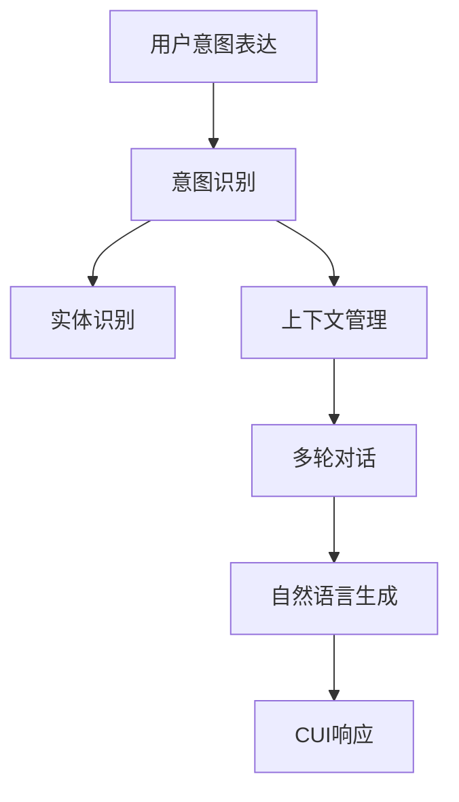

                 

# 用户需求表达与CUI的响应机制

## 1. 背景介绍

### 1.1 问题由来

随着人工智能技术的不断发展和普及，人机交互的自然语言处理（Natural Language Processing, NLP）逐渐成为智能系统的核心技术之一。自然语言处理不仅仅局限于语言理解，更关注用户如何高效、准确地表达其需求，以及智能系统如何理解并响应这些需求。这一过程可以视为用户需求表达（User Intent Expression）与计算用户接口（Computational User Interface, CUI）响应机制（Response Mechanism）的协同合作。

### 1.2 问题核心关键点

用户需求表达与CUI响应机制的有效性，直接决定了智能系统能否提供高效、个性化的服务。一个高效的CUI系统能够准确理解用户的意图，并通过自然语言形式提供恰当的响应，提升用户体验。而这一过程涉及的关键词包括：意图理解、实体识别、上下文管理、多轮对话、自然语言生成等，以及如何通过对话策略、语义增强、对话管理器等技术手段实现。

### 1.3 问题研究意义

深入理解用户需求表达与CUI响应机制，有助于提升人机交互的质量和效率，增强用户满意度，进而推动智能系统的广泛应用。同时，这一研究方向也涉及到认知科学、心理学、信息检索等多个学科的交叉，对于促进人工智能领域的前沿研究具有重要意义。

## 2. 核心概念与联系

### 2.1 核心概念概述

为更好地理解用户需求表达与CUI响应机制，本节将介绍几个关键概念：

- **用户意图表达（User Intent Expression）**：用户通过自然语言表达的具体需求，是智能系统进行后续处理的依据。
- **计算用户接口（Computational User Interface, CUI）**：利用计算机技术实现的自然语言交互界面，通常包括对话管理器、对话策略和自然语言生成器等。
- **意图识别（Intent Recognition）**：通过NLP技术分析用户的输入，识别出用户的具体意图，是CUI响应的核心。
- **实体识别（Entity Recognition）**：在用户意图识别的基础上，进一步识别出输入中提及的实体（如人名、地点、时间等），为后续的响应提供信息支持。
- **上下文管理（Context Management）**：在多轮对话中，管理并保持对话状态，确保系统能够正确理解用户的当前需求。
- **多轮对话（Multi-Turn Dialogue）**：通过多轮对话机制，系统可以获取更丰富的信息，提供更精确的回答。
- **自然语言生成（NLG）**：生成自然语言形式的响应，提升用户理解和满意度。

这些概念之间的逻辑关系可以通过以下Mermaid流程图来展示：



这个流程图展示了用户需求表达与CUI响应机制的核心流程：

1. 用户通过自然语言表达需求。
2. 系统使用NLP技术识别用户意图。
3. 识别实体并管理上下文。
4. 通过多轮对话获取更多信息。
5. 生成自然语言响应并输出。

### 2.2 概念间的关系

这些核心概念之间存在着紧密的联系，形成了CUI响应的完整生态系统。具体关系如下：

- **意图识别**：是CUI响应的第一步，也是后续处理的基础。
- **实体识别**：在意图识别的基础上，提供更具体的处理信息，如涉及哪些实体。
- **上下文管理**：在多轮对话中，保持并更新对话状态，确保理解上下文。
- **多轮对话**：通过多轮对话，获取更多信息，提高响应的准确性。
- **自然语言生成**：将处理结果转换为自然语言形式，提升用户体验。

## 3. 核心算法原理 & 具体操作步骤

### 3.1 算法原理概述

用户需求表达与CUI响应机制的算法原理可以概括为：

1. **意图识别**：通过自然语言处理技术，分析用户的输入，识别出用户的意图。
2. **实体识别**：在意图识别的基础上，进一步识别出输入中提及的实体，为后续处理提供信息支持。
3. **上下文管理**：在多轮对话中，维护并更新对话状态，确保系统能够理解用户的当前需求。
4. **多轮对话**：通过多轮对话机制，系统获取更丰富的信息，提供更精确的回答。
5. **自然语言生成**：生成自然语言形式的响应，提升用户理解和满意度。

### 3.2 算法步骤详解

#### 3.2.1 意图识别

**步骤1**：收集并标注大量标注数据，用于训练意图识别模型。

**步骤2**：使用BERT、GPT等预训练模型作为特征提取器，将用户输入映射为向量表示。

**步骤3**：通过分类器（如SVM、CRF等）对向量进行意图分类，输出用户意图。

**步骤4**：对分类结果进行后处理，如去噪、修正、合并，确保意图的准确性。

#### 3.2.2 实体识别

**步骤1**：在用户意图识别的基础上，使用CRF、LSTM等模型进行实体识别，标记出输入中的实体。

**步骤2**：利用预训练的BERT嵌入，将实体转换为向量表示。

**步骤3**：通过序列标注技术（如CRF、BiLSTM-CRF等）对实体进行标注，输出识别结果。

**步骤4**：对实体识别结果进行后处理，如去重、修正，确保实体的准确性。

#### 3.2.3 上下文管理

**步骤1**：在多轮对话中，维护对话状态，如上下文、对话历史等。

**步骤2**：根据用户当前输入和历史对话，更新对话状态。

**步骤3**：利用上下文管理器（如RNN、LSTM等）对对话状态进行维护，确保理解上下文。

**步骤4**：在多轮对话中，通过对话管理器（如Seq2Seq、Transformer等）更新和维护对话状态。

#### 3.2.4 多轮对话

**步骤1**：通过多轮对话机制，获取用户输入和反馈。

**步骤2**：利用上下文管理器更新对话状态。

**步骤3**：根据用户输入和对话历史，生成系统响应。

**步骤4**：将系统响应提供给用户，并接收用户反馈。

**步骤5**：通过迭代循环，不断优化对话策略，提升多轮对话的效率和效果。

#### 3.2.5 自然语言生成

**步骤1**：根据意图识别、实体识别和多轮对话的结果，生成初步的回答。

**步骤2**：使用NLG技术（如模板填充、Transformer等）生成自然语言形式的响应。

**步骤3**：通过后处理（如语法修正、语言流畅性优化等），确保响应的自然语言形式。

**步骤4**：将生成的响应输出给用户。

### 3.3 算法优缺点

#### 优点

- **效率高**：利用预训练模型和深度学习技术，可以快速处理大量自然语言输入，识别用户意图和实体。
- **准确性好**：通过多轮对话机制，获取更丰富的信息，提供更精确的回答。
- **适应性强**：能够处理各种自然语言形式的用户输入，提供多样化的响应。

#### 缺点

- **依赖大量数据**：训练意图识别、实体识别等模型需要大量的标注数据，获取成本较高。
- **计算资源消耗大**：处理大量自然语言输入，特别是多轮对话，需要较大的计算资源。
- **理解上下文难度高**：多轮对话中，管理上下文需要复杂的模型和算法。

### 3.4 算法应用领域

用户需求表达与CUI响应机制在多个领域都有广泛的应用：

- **智能客服**：通过自然语言理解，快速响应客户咨询，提供个性化服务。
- **智能家居**：通过语音指令和自然语言理解，控制家电设备，提升用户生活体验。
- **智能助手**：通过自然语言生成，提供智能推荐、日程安排等服务。
- **医疗健康**：通过语音交互和自然语言理解，提供健康咨询、疾病诊断等服务。

## 4. 数学模型和公式 & 详细讲解 & 举例说明

### 4.1 数学模型构建

用户需求表达与CUI响应机制的数学模型可以概括为：

1. **意图识别模型**：$M_{\text{intent}}(x)$，其中$x$为用户输入的自然语言文本，输出为意图标签。
2. **实体识别模型**：$M_{\text{entity}}(x)$，输出为输入中的实体列表。
3. **上下文管理模型**：$M_{\text{context}}(\{h_i\}, x)$，其中$h_i$为历史对话，$x$为用户当前输入，输出为对话状态。
4. **多轮对话模型**：$M_{\text{dialogue}}(\{h_i\}, x)$，输出为系统响应。
5. **自然语言生成模型**：$M_{\text{NLG}}(\text{response})$，将系统响应转换为自然语言形式。

### 4.2 公式推导过程

#### 意图识别模型

假设用户输入的自然语言文本为$x$，其意图标签为$y$，则意图识别模型的目标函数为：

$$
\min_{\theta} \mathcal{L}(M_{\text{intent}}, \mathcal{D})
$$

其中，$\theta$为模型的参数，$\mathcal{D}$为训练数据集。通过最小化损失函数$\mathcal{L}$，训练得到意图识别模型。

#### 实体识别模型

假设用户输入的自然语言文本为$x$，实体列表为$\{e_i\}$，则实体识别模型的目标函数为：

$$
\min_{\theta} \mathcal{L}(M_{\text{entity}}, \mathcal{D})
$$

其中，$\theta$为模型的参数，$\mathcal{D}$为训练数据集。通过最小化损失函数$\mathcal{L}$，训练得到实体识别模型。

#### 上下文管理模型

假设历史对话为$\{h_i\}$，用户当前输入为$x$，对话状态为$h$，则上下文管理模型的目标函数为：

$$
\min_{\theta} \mathcal{L}(M_{\text{context}}, \mathcal{D})
$$

其中，$\theta$为模型的参数，$\mathcal{D}$为训练数据集。通过最小化损失函数$\mathcal{L}$，训练得到上下文管理模型。

#### 多轮对话模型

假设历史对话为$\{h_i\}$，用户当前输入为$x$，系统响应为$y$，则多轮对话模型的目标函数为：

$$
\min_{\theta} \mathcal{L}(M_{\text{dialogue}}, \mathcal{D})
$$

其中，$\theta$为模型的参数，$\mathcal{D}$为训练数据集。通过最小化损失函数$\mathcal{L}$，训练得到多轮对话模型。

#### 自然语言生成模型

假设系统响应为$\text{response}$，自然语言生成模型将响应转换为自然语言形式，目标函数为：

$$
\min_{\theta} \mathcal{L}(M_{\text{NLG}}, \text{response})
$$

其中，$\theta$为模型的参数，$\text{response}$为系统响应。通过最小化损失函数$\mathcal{L}$，训练得到自然语言生成模型。

### 4.3 案例分析与讲解

#### 案例1：智能客服

**背景**：某智能客服系统需要处理大量用户的咨询请求，要求系统能够高效、准确地识别用户意图，并提供相应的回答。

**流程**：
1. 用户输入咨询请求，系统通过意图识别模型识别出用户意图。
2. 在用户意图识别的基础上，系统使用实体识别模型识别出咨询请求中的实体。
3. 系统通过上下文管理器维护对话状态，确保能够理解用户当前需求。
4. 系统使用多轮对话模型，获取更多信息，提供更精确的回答。
5. 最后，系统使用自然语言生成模型生成自然语言形式的响应，输出给用户。

#### 案例2：智能助手

**背景**：某智能助手系统需要为用户提供日程安排、新闻推荐等服务。

**流程**：
1. 用户通过语音或自然语言输入需求，系统通过意图识别模型识别出用户的意图。
2. 在用户意图识别的基础上，系统使用实体识别模型识别出涉及的时间、地点等信息。
3. 系统通过上下文管理器维护对话状态，确保能够理解用户的当前需求。
4. 系统使用多轮对话模型，获取更多信息，提供更个性化的服务。
5. 最后，系统使用自然语言生成模型生成自然语言形式的响应，输出给用户。

## 5. 项目实践：代码实例和详细解释说明

### 5.1 开发环境搭建

在进行用户需求表达与CUI响应机制的实践前，我们需要准备好开发环境。以下是使用Python进行PyTorch开发的环境配置流程：

1. 安装Anaconda：从官网下载并安装Anaconda，用于创建独立的Python环境。

2. 创建并激活虚拟环境：
```bash
conda create -n pytorch-env python=3.8 
conda activate pytorch-env
```

3. 安装PyTorch：根据CUDA版本，从官网获取对应的安装命令。例如：
```bash
conda install pytorch torchvision torchaudio cudatoolkit=11.1 -c pytorch -c conda-forge
```

4. 安装TensorFlow：如果需要使用TensorFlow，可以通过以下命令进行安装：
```bash
pip install tensorflow
```

5. 安装各类工具包：
```bash
pip install numpy pandas scikit-learn matplotlib tqdm jupyter notebook ipython
```

完成上述步骤后，即可在`pytorch-env`环境中开始开发实践。

### 5.2 源代码详细实现

#### 5.2.1 意图识别

```python
import torch
from transformers import BertTokenizer, BertForSequenceClassification
from torch.utils.data import DataLoader, Dataset

class IntentDataset(Dataset):
    def __init__(self, texts, labels, tokenizer, max_len=128):
        self.texts = texts
        self.labels = labels
        self.tokenizer = tokenizer
        self.max_len = max_len
        
    def __len__(self):
        return len(self.texts)
    
    def __getitem__(self, item):
        text = self.texts[item]
        label = self.labels[item]
        
        encoding = self.tokenizer(text, return_tensors='pt', max_length=self.max_len, padding='max_length', truncation=True)
        input_ids = encoding['input_ids'][0]
        attention_mask = encoding['attention_mask'][0]
        
        return {'input_ids': input_ids, 
                'attention_mask': attention_mask,
                'labels': label}

# 定义意图识别模型
model = BertForSequenceClassification.from_pretrained('bert-base-cased', num_labels=3)

# 准备数据
tokenizer = BertTokenizer.from_pretrained('bert-base-cased')
train_dataset = IntentDataset(train_texts, train_labels, tokenizer)
dev_dataset = IntentDataset(dev_texts, dev_labels, tokenizer)
test_dataset = IntentDataset(test_texts, test_labels, tokenizer)

# 定义优化器和学习率
optimizer = AdamW(model.parameters(), lr=2e-5)

# 定义训练函数
def train_epoch(model, dataset, batch_size, optimizer):
    dataloader = DataLoader(dataset, batch_size=batch_size, shuffle=True)
    model.train()
    epoch_loss = 0
    for batch in dataloader:
        input_ids = batch['input_ids'].to(device)
        attention_mask = batch['attention_mask'].to(device)
        labels = batch['labels'].to(device)
        model.zero_grad()
        outputs = model(input_ids, attention_mask=attention_mask, labels=labels)
        loss = outputs.loss
        epoch_loss += loss.item()
        loss.backward()
        optimizer.step()
    return epoch_loss / len(dataloader)

# 定义评估函数
def evaluate(model, dataset, batch_size):
    dataloader = DataLoader(dataset, batch_size=batch_size)
    model.eval()
    correct = 0
    total = 0
    with torch.no_grad():
        for batch in dataloader:
            input_ids = batch['input_ids'].to(device)
            attention_mask = batch['attention_mask'].to(device)
            batch_labels = batch['labels']
            outputs = model(input_ids, attention_mask=attention_mask)
            _, preds = outputs.max(1)
            total += batch_labels.size(0)
            correct += (preds == batch_labels).sum().item()
    
    print(f'Accuracy: {100 * correct / total:.2f}')

# 训练模型
epochs = 5
batch_size = 16

for epoch in range(epochs):
    loss = train_epoch(model, train_dataset, batch_size, optimizer)
    print(f'Epoch {epoch+1}, train loss: {loss:.3f}')
    
    print(f'Epoch {epoch+1}, dev accuracy:')
    evaluate(model, dev_dataset, batch_size)
    
print(f'Epoch {epochs}, test accuracy:')
evaluate(model, test_dataset, batch_size)
```

#### 5.2.2 实体识别

```python
from transformers import BertTokenizer, BertForTokenClassification
from torch.utils.data import DataLoader, Dataset

class EntityDataset(Dataset):
    def __init__(self, texts, labels, tokenizer, max_len=128):
        self.texts = texts
        self.labels = labels
        self.tokenizer = tokenizer
        self.max_len = max_len
        
    def __len__(self):
        return len(self.texts)
    
    def __getitem__(self, item):
        text = self.texts[item]
        labels = self.labels[item]
        
        encoding = self.tokenizer(text, return_tensors='pt', max_length=self.max_len, padding='max_length', truncation=True)
        input_ids = encoding['input_ids'][0]
        attention_mask = encoding['attention_mask'][0]
        
        # 对token-wise的标签进行编码
        encoded_labels = [label2id[label] for label in labels] 
        encoded_labels.extend([label2id['O']] * (self.max_len - len(encoded_labels)))
        labels = torch.tensor(encoded_labels, dtype=torch.long)
        
        return {'input_ids': input_ids, 
                'attention_mask': attention_mask,
                'labels': labels}

# 定义实体识别模型
model = BertForTokenClassification.from_pretrained('bert-base-cased', num_labels=len(label2id))

# 准备数据
tokenizer = BertTokenizer.from_pretrained('bert-base-cased')
train_dataset = EntityDataset(train_texts, train_labels, tokenizer)
dev_dataset = EntityDataset(dev_texts, dev_labels, tokenizer)
test_dataset = EntityDataset(test_texts, test_labels, tokenizer)

# 定义优化器和学习率
optimizer = AdamW(model.parameters(), lr=2e-5)

# 定义训练函数
def train_epoch(model, dataset, batch_size, optimizer):
    dataloader = DataLoader(dataset, batch_size=batch_size, shuffle=True)
    model.train()
    epoch_loss = 0
    for batch in dataloader:
        input_ids = batch['input_ids'].to(device)
        attention_mask = batch['attention_mask'].to(device)
        labels = batch['labels'].to(device)
        model.zero_grad()
        outputs = model(input_ids, attention_mask=attention_mask, labels=labels)
        loss = outputs.loss
        epoch_loss += loss.item()
        loss.backward()
        optimizer.step()
    return epoch_loss / len(dataloader)

# 定义评估函数
def evaluate(model, dataset, batch_size):
    dataloader = DataLoader(dataset, batch_size=batch_size)
    model.eval()
    correct = 0
    total = 0
    with torch.no_grad():
        for batch in dataloader:
            input_ids = batch['input_ids'].to(device)
            attention_mask = batch['attention_mask'].to(device)
            batch_labels = batch['labels']
            outputs = model(input_ids, attention_mask=attention_mask)
            _, preds = outputs.max(1)
            total += batch_labels.size(0)
            correct += (preds == batch_labels).sum().item()
    
    print(f'Accuracy: {100 * correct / total:.2f}')

# 训练模型
epochs = 5
batch_size = 16

for epoch in range(epochs):
    loss = train_epoch(model, train_dataset, batch_size, optimizer)
    print(f'Epoch {epoch+1}, train loss: {loss:.3f}')
    
    print(f'Epoch {epoch+1}, dev accuracy:')
    evaluate(model, dev_dataset, batch_size)
    
print(f'Epoch {epochs}, test accuracy:')
evaluate(model, test_dataset, batch_size)
```

#### 5.2.3 上下文管理

```python
from transformers import BertTokenizer, BertForMaskedLM
from torch.utils.data import DataLoader, Dataset

class ContextDataset(Dataset):
    def __init__(self, texts, labels, tokenizer, max_len=128):
        self.texts = texts
        self.labels = labels
        self.tokenizer = tokenizer
        self.max_len = max_len
        
    def __len__(self):
        return len(self.texts)
    
    def __getitem__(self, item):
        text = self.texts[item]
        labels = self.labels[item]
        
        encoding = self.tokenizer(text, return_tensors='pt', max_length=self.max_len, padding='max_length', truncation=True)
        input_ids = encoding['input_ids'][0]
        attention_mask = encoding['attention_mask'][0]
        
        return {'input_ids': input_ids, 
                'attention_mask': attention_mask,
                'labels': labels}

# 定义上下文管理模型
model = BertForMaskedLM.from_pretrained('bert-base-cased')

# 准备数据
tokenizer = BertTokenizer.from_pretrained('bert-base-cased')
train_dataset = ContextDataset(train_texts, train_labels, tokenizer)
dev_dataset = ContextDataset(dev_texts, dev_labels, tokenizer)
test_dataset = ContextDataset(test_texts, test_labels, tokenizer)

# 定义优化器和学习率
optimizer = AdamW(model.parameters(), lr=2e-5)

# 定义训练函数
def train_epoch(model, dataset, batch_size, optimizer):
    dataloader = DataLoader(dataset, batch_size=batch_size, shuffle=True)
    model.train()
    epoch_loss = 0
    for batch in dataloader:
        input_ids = batch['input_ids'].to(device)
        attention_mask = batch['attention_mask'].to(device)
        labels = batch['labels'].to(device)
        model.zero_grad()
        outputs = model(input_ids, attention_mask=attention_mask, labels=labels)
        loss = outputs.loss
        epoch_loss += loss.item()
        loss.backward()
        optimizer.step()
    return epoch_loss / len(dataloader)

# 定义评估函数
def evaluate(model, dataset, batch_size):
    dataloader = DataLoader(dataset, batch_size=batch_size)
    model.eval()
    correct = 0
    total = 0
    with torch.no_grad():
        for batch in dataloader:
            input_ids = batch['input_ids'].to(device)
            attention_mask = batch['attention_mask'].to(device)
            batch_labels = batch['labels']
            outputs = model(input_ids, attention_mask=attention_mask, labels=labels)
            _, preds = outputs.max(1)
            total += batch_labels.size(0)
            correct += (preds == batch_labels).sum().item()
    
    print(f'Accuracy: {100 * correct / total:.2f}')

# 训练模型
epochs = 5
batch_size = 16

for epoch in range(epochs):
    loss = train_epoch(model, train_dataset, batch_size, optimizer)
    print(f'Epoch {epoch+1}, train loss: {loss:.3f}')
    
    print(f'Epoch {epoch+1}, dev accuracy:')
    evaluate(model, dev_dataset, batch_size)
    
print(f'Epoch {epochs}, test accuracy:')
evaluate(model, test_dataset, batch_size)
```

#### 5.2.4 多轮对话

```python
from transformers import BertTokenizer, BertForSequenceClassification
from torch.utils.data import DataLoader, Dataset

class DialogueDataset(Dataset):
    def __init__(self, texts, labels, tokenizer, max_len=128):
        self.texts = texts
        self.labels = labels
        self.tokenizer = tokenizer
        self.max_len = max_len
        
    def __len__(self):
        return len(self.texts)
    
    def __getitem__(self, item):
        text = self.texts[item]
        label = self.labels[item]
        
        encoding = self.tokenizer(text, return_tensors='pt', max_length=self.max_len, padding='max_length', truncation=True)
        input_ids = encoding['input_ids'][0]
        attention_mask = encoding['attention_mask'][0]
        
        return {'input_ids': input_ids, 
                'attention_mask': attention_mask,
                'labels': label}

# 定义多轮对话模型
model = BertForSequenceClassification.from_pretrained('bert-base-cased', num_labels=3)

# 准备数据
tokenizer = BertTokenizer.from_pretrained('bert-base-cased')
train_dataset = DialogueDataset(train_texts, train_labels, tokenizer)
dev_dataset = DialogueDataset(dev_texts, dev_labels, tokenizer)
test_dataset = DialogueDataset(test_texts, test_labels, tokenizer)

# 定义优化器和学习率
optimizer = AdamW(model.parameters(), lr=2e-5)

# 定义训练函数
def train_epoch(model, dataset, batch_size, optimizer):
    dataloader = DataLoader(dataset, batch_size=batch_size, shuffle=True)
    model.train()
    epoch_loss = 0
    for batch in dataloader:
        input_ids = batch['input_ids'].to(device)
        attention_mask = batch['attention_mask'].to(device)
        labels = batch['labels'].to(device)
        model.zero_grad()
        outputs = model(input_ids, attention_mask=attention_mask, labels

