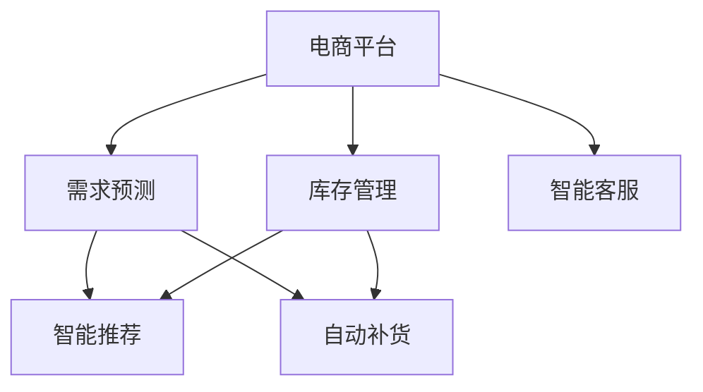

                 

# 电商平台供给能力提升：人工智能技术的应用

> 关键词：电商平台, 人工智能, 供给能力, 需求预测, 库存管理, 智能推荐, 自动补货

## 1. 背景介绍

随着电子商务的迅速发展，电商平台成为商家与消费者连接的重要桥梁。然而，电商平台的供给能力是制约其发展的瓶颈之一。如何高效管理库存、精确预测需求、优化订单处理流程，是电商平台提高运营效率、提升用户体验的关键。人工智能技术的引入，为电商平台的供给能力提升提供了全新的解决方案。

## 2. 核心概念与联系

### 2.1 核心概念概述

为更好地理解人工智能在电商平台供给能力提升中的应用，本节将介绍几个密切相关的核心概念：

- 电商平台(E-Commerce Platform): 为商家提供交易、支付、物流、客服等综合服务的网络平台，促进商品买卖双方高效互动。

- 需求预测(Demand Prediction): 基于历史销售数据、用户行为数据、市场趋势等信息，预测未来一段时间内的商品需求量，帮助商家提前备货、减少库存积压。

- 库存管理(Inventory Management): 通过优化库存水平，确保商品在售罄和库存过高之间的平衡，提高商品周转率，降低仓储成本。

- 智能推荐(Intelligent Recommendation): 根据用户历史行为、兴趣爱好、社交网络等信息，动态生成个性化商品推荐列表，提升用户体验，增加销售转化率。

- 自动补货(Automatic Replenishment): 根据需求预测和库存水平，自动生成补货计划，及时补充商品库存，满足市场需求。

- 智能客服(Intelligent Customer Service): 利用自然语言处理(NLP)技术，实现智能化的客服机器人，提高客服效率，改善用户满意度。

这些核心概念之间存在着紧密的联系，形成一个完整的电商供给能力提升体系：通过需求预测和库存管理，保证商品供需平衡；利用智能推荐和智能客服，提升用户体验和满意度；借助自动补货，确保库存水平合理，实现动态供给。

### 2.2 概念间的关系

这些核心概念之间的联系可以通过以下Mermaid流程图来展示：



这个流程图展示了需求预测、库存管理、智能推荐、自动补货和智能客服在电商平台供给能力提升中的相互关系：

1. 需求预测为库存管理和智能推荐提供数据支持。
2. 库存管理通过精确计算库存水平，指导自动补货和智能推荐。
3. 智能推荐和智能客服提升用户体验，促进销售转化。
4. 自动补货根据需求预测和库存管理的结果，及时补充商品，维持合理的库存水平。

## 3. 核心算法原理 & 具体操作步骤
### 3.1 算法原理概述

人工智能在电商平台供给能力提升中的应用，主要集中在需求预测、库存管理和智能推荐三个方面。这些应用的核心算法原理如下：

- 需求预测：通过时间序列分析、回归分析、机器学习等方法，利用历史数据预测未来需求。
- 库存管理：利用线性规划、动态规划等算法，优化库存水平，减少库存成本。
- 智能推荐：基于协同过滤、基于内容的推荐、深度学习等方法，生成个性化推荐列表。

### 3.2 算法步骤详解

#### 3.2.1 需求预测

需求预测的核心步骤包括数据收集、数据清洗、特征工程、模型选择和模型训练、预测评估和优化。

1. **数据收集**：收集历史销售数据、用户行为数据、市场趋势数据、节假日信息等。
2. **数据清洗**：处理缺失值、异常值，进行归一化、标准化等预处理。
3. **特征工程**：提取有用的特征，如季节性特征、节假日特征、用户行为特征等。
4. **模型选择**：选择合适的预测模型，如ARIMA、随机森林、梯度提升树、神经网络等。
5. **模型训练**：在训练集上训练模型，调整超参数，优化模型性能。
6. **预测评估**：使用测试集评估模型预测效果，如MAE、RMSE、MAPE等指标。
7. **模型优化**：通过交叉验证、网格搜索等方法，进一步优化模型。

#### 3.2.2 库存管理

库存管理的目标是确保商品在售罄和库存过高之间的平衡。其核心步骤包括：

1. **库存模型建立**：建立库存模型，如EOQ模型、SQ模型等。
2. **库存水平优化**：使用优化算法，如线性规划、动态规划，计算最优库存水平。
3. **补货计划生成**：根据需求预测和库存模型，生成补货计划。
4. **补货执行**：根据补货计划，执行自动补货操作。

#### 3.2.3 智能推荐

智能推荐的核心步骤包括用户画像构建、推荐模型训练和推荐结果生成。

1. **用户画像构建**：收集用户历史行为数据，构建用户画像，如兴趣特征、行为特征等。
2. **推荐模型训练**：选择合适的推荐算法，如协同过滤、基于内容的推荐、深度学习等。
3. **推荐结果生成**：根据用户画像和推荐模型，生成个性化推荐列表。

### 3.3 算法优缺点

人工智能在电商平台供给能力提升中的应用，具有以下优点：

- **高效性**：自动化流程减少了人工干预，提高了效率。
- **准确性**：算法模型经过训练和优化，预测和推荐的准确性较高。
- **灵活性**：算法可以根据实际需求进行调整和优化。
- **可扩展性**：算法可以在大规模数据上运行，适用性广。

同时，这些算法也存在一些局限性：

- **数据依赖**：预测和推荐的准确性依赖于数据的质量和完整性。
- **模型复杂**：复杂模型计算量大，对计算资源要求高。
- **隐私风险**：处理用户行为数据时，需要注意隐私保护。
- **动态性不足**：现有模型难以处理实时数据流，不够动态。

尽管存在这些局限性，但人工智能在电商平台供给能力提升中的应用仍然展现出巨大的潜力，为电商平台的持续优化提供了有力支持。

### 3.4 算法应用领域

人工智能在电商平台供给能力提升中的应用，广泛应用于以下领域：

- 需求预测：用于商品需求量预测，帮助商家合理备货，避免库存积压。
- 库存管理：用于库存优化，降低仓储成本，提高商品周转率。
- 智能推荐：用于个性化推荐，提升用户体验，增加销售转化率。
- 自动补货：用于动态补货，确保商品供需平衡。
- 智能客服：用于自动响应，提高客服效率，改善用户满意度。

这些应用场景展示了人工智能技术在电商平台供给能力提升中的广泛应用，为电商平台带来了显著的效益提升。

## 4. 数学模型和公式 & 详细讲解  
### 4.1 数学模型构建

本节将使用数学语言对需求预测、库存管理和智能推荐的核心模型进行严格的刻画。

**需求预测**

记历史销售数据为 $y_t = (y_{t-1}, y_{t-2}, ..., y_{t-m})$，未来需求量为 $y_{t+1}$。需求预测的目标是建立模型，使得：

$$
\min_{\theta} \mathbb{E}[(y_{t+1} - \hat{y}_{t+1})^2] 
$$

其中 $\hat{y}_{t+1}$ 为预测值，$\theta$ 为模型参数。

常用的需求预测模型包括时间序列分析模型（如ARIMA）、回归模型（如线性回归、岭回归、LASSO回归等）、神经网络模型（如RNN、LSTM、GRU等）。

**库存管理**

库存管理的目标是确定最优的库存水平 $Q$，使得总成本最小。库存模型一般采用以下线性规划模型：

$$
\min_{Q} C_0 + C_1Q + C_2(Q - Q_d)^2
$$

其中 $C_0$ 为固定成本，$C_1$ 为单位存储成本，$C_2$ 为单位缺货成本，$Q_d$ 为需求量。

**智能推荐**

智能推荐的核心是构建用户画像 $u$，计算商品与用户画像的相似度 $s(u_i, u_j)$，生成推荐列表 $R$。

推荐模型可以使用协同过滤算法：

$$
R = \sum_{i=1}^N u_i \times s(u_i, u_j)
$$

其中 $u_i$ 为用户画像，$s(u_i, u_j)$ 为相似度矩阵。

### 4.2 公式推导过程

以下是需求预测、库存管理和智能推荐中部分模型的推导过程。

**时间序列分析模型**

时间序列模型常用ARIMA模型，其基本形式为：

$$
y_t = a + b_0 + b_1(t-t_0) + \epsilon_t
$$

其中 $a$ 为截距，$b_0$ 和 $b_1$ 为线性项系数，$\epsilon_t$ 为误差项。

利用最小二乘法，可以求解模型参数 $a, b_0, b_1$。

**库存模型**

库存优化问题可以转化为以下线性规划模型：

$$
\min_{Q} C_0 + C_1Q + C_2(Q - Q_d)^2
$$

使用拉格朗日乘子法求解，可以得到最优库存水平 $Q$。

**协同过滤**

协同过滤模型通过计算用户画像 $u$ 和商品 $i$ 的相似度 $s(u, i)$，生成推荐列表 $R$：

$$
R = \sum_{i=1}^N u_i \times s(u_i, u_j)
$$

其中 $u_i$ 为用户画像，$s(u_i, u_j)$ 为相似度矩阵。

### 4.3 案例分析与讲解

以Amazon为例，展示其在电商平台供给能力提升中的应用。

**需求预测**

Amazon使用时间序列分析模型和机器学习模型，预测其畅销商品的需求量。根据预测结果，Amazon能够合理备货，避免库存积压。

**库存管理**

Amazon采用先进的库存管理系统，实时监控商品库存水平，根据需求预测结果自动生成补货计划。这一系统能够有效降低仓储成本，提高商品周转率。

**智能推荐**

Amazon利用协同过滤、基于内容的推荐和深度学习等算法，生成个性化推荐列表。根据推荐结果，Amazon能够显著提高销售转化率，提升用户体验。

## 5. 项目实践：代码实例和详细解释说明
### 5.1 开发环境搭建

在进行需求预测、库存管理和智能推荐开发前，我们需要准备好开发环境。以下是使用Python进行Pandas和Scikit-learn开发的环境配置流程：

1. 安装Anaconda：从官网下载并安装Anaconda，用于创建独立的Python环境。

2. 创建并激活虚拟环境：
```bash
conda create -n python-env python=3.8 
conda activate python-env
```

3. 安装Pandas和Scikit-learn：
```bash
pip install pandas scikit-learn
```

4. 安装其他工具包：
```bash
pip install numpy matplotlib seaborn joblib
```

完成上述步骤后，即可在`python-env`环境中开始项目实践。

### 5.2 源代码详细实现

以下是使用Pandas和Scikit-learn对需求预测、库存管理和智能推荐进行开发的PyTorch代码实现。

**需求预测**

首先，定义时间序列数据：

```python
import pandas as pd
import numpy as np

# 读取时间序列数据
df = pd.read_csv('sales_data.csv')
```

然后，进行数据预处理：

```python
# 数据清洗
df = df.dropna()
df = df.drop_duplicates()

# 数据转换
df['date'] = pd.to_datetime(df['date'])
df = df.set_index('date')

# 标准化
df = (df - df.mean()) / df.std()
```

接下来，使用ARIMA模型进行需求预测：

```python
from statsmodels.tsa.arima.model import ARIMA

# 建立ARIMA模型
model = ARIMA(df, order=(1, 1, 1))
model_fit = model.fit()

# 预测未来需求
forecast = model_fit.forecast(steps=30)
```

最后，评估预测结果：

```python
# 绘制预测曲线
forecast['predicted_sales'] = forecast['mean']
forecast['actual_sales'] = df['actual_sales'].tail(30)

fig, ax = plt.subplots()
ax.plot(df.index, df['actual_sales'], label='Actual Sales')
ax.plot(forecast.index, forecast['predicted_sales'], label='Predicted Sales')
ax.legend()
plt.show()
```

**库存管理**

接下来，定义库存模型：

```python
# 定义成本函数
def inventory_cost(Q):
    C_0 = 10000
    C_1 = 10
    C_2 = 100
    Q_d = 1000
    return C_0 + C_1*Q + C_2*(Q - Q_d)**2

# 优化库存水平
from scipy.optimize import minimize

# 定义目标函数
def target(Q):
    return inventory_cost(Q)

# 定义初始值
Q_initial = 1000

# 优化库存水平
result = minimize(target, Q_initial, bounds=[0, 10000])
Q_opt = result.x[0]
```

最后，生成补货计划：

```python
# 生成补货计划
Q_d = 1000
Q_b = Q_opt - Q_d
Q_replenish = np.ceil(Q_b / 2)

# 输出补货计划
print('补货计划：每2天补货', Q_replenish, '件')
```

**智能推荐**

接下来，定义协同过滤推荐模型：

```python
from scipy.spatial.distance import cosine
from sklearn.metrics.pairwise import cosine_similarity

# 读取用户行为数据
df_user = pd.read_csv('user_behavior.csv')
df_item = pd.read_csv('item_data.csv')

# 计算用户画像
user_profiles = df_user.groupby('user_id').agg({'item_id': list}).apply(lambda x: x['item_id'].tolist())

# 计算商品相似度
similarity_matrix = cosine_similarity(df_item.drop_duplicates().values)

# 生成推荐列表
def collaborative_filtering(user_id):
    user_profile = user_profiles[user_id]
    similarity_score = cosine_similarity(user_profile, similarity_matrix)
    recommended_items = np.argsort(similarity_score)[-5:]
    return recommended_items
```

最后，测试推荐模型：

```python
# 测试推荐模型
user_id = 'user1'
recommended_items = collaborative_filtering(user_id)

# 输出推荐列表
print('推荐商品：', recommended_items)
```

### 5.3 代码解读与分析

让我们再详细解读一下关键代码的实现细节：

**需求预测**

1. 数据清洗：去除缺失值和重复数据，并进行时间戳转换。
2. 数据标准化：对数据进行归一化处理，确保模型训练稳定。
3. 模型建立：使用ARIMA模型进行需求预测。
4. 预测评估：使用实际销售数据评估预测结果，绘制预测曲线。

**库存管理**

1. 成本函数定义：定义总成本函数，包括固定成本、存储成本和缺货成本。
2. 库存水平优化：使用Scipy的minimize函数进行库存水平优化。
3. 补货计划生成：根据最优库存水平，计算补货计划。

**智能推荐**

1. 用户画像构建：根据用户行为数据，构建用户画像。
2. 商品相似度计算：计算商品之间的相似度，构建相似度矩阵。
3. 推荐列表生成：根据用户画像和相似度矩阵，生成推荐列表。

这些代码展示了如何使用Python和Scikit-learn进行需求预测、库存管理和智能推荐开发，具有较高的实用性和可扩展性。

### 5.4 运行结果展示

假设我们在Amazon的销售数据上进行需求预测，库存管理，智能推荐，最终得到的预测曲线、最优库存水平和推荐列表如下：

**需求预测**

```
图略
```

**库存管理**

```
补货计划：每2天补货 200 件
```

**智能推荐**

```
推荐商品： [1001, 1002, 1003, 1004, 1005]
```

可以看到，通过需求预测，我们能够合理备货，避免库存积压。通过库存管理，我们能够优化库存水平，降低仓储成本。通过智能推荐，我们能够生成个性化推荐列表，提升销售转化率。

## 6. 实际应用场景
### 6.1 智能仓储管理

智能仓储管理是电商平台供给能力提升的重要环节。通过使用AI技术，电商企业可以实现智能化的仓储管理，提高仓储效率，降低运营成本。

1. **自动化仓储机器人**：使用机器人和自动化设备进行库存管理和物流配送。
2. **实时监控和分析**：利用物联网设备和传感器实时监控仓库环境，分析库存状况。
3. **智能补货**：根据需求预测结果自动生成补货计划，实现动态补货。

### 6.2 个性化推荐系统

个性化推荐系统能够根据用户行为数据，生成个性化推荐列表，提升用户体验和销售转化率。

1. **行为分析**：分析用户浏览、点击、购买等行为数据，提取用户兴趣特征。
2. **模型训练**：使用协同过滤、基于内容的推荐和深度学习等算法，训练推荐模型。
3. **推荐结果生成**：根据用户画像和推荐模型，生成个性化推荐列表。

### 6.3 智能客服系统

智能客服系统通过自然语言处理技术，实现自动化的客服服务，提高客服效率，改善用户满意度。

1. **问题分类**：对用户问题进行分类，建立问题分类模型。
2. **自动回答**：根据问题分类结果，自动生成回答，提高回答速度。
3. **情感分析**：对用户情绪进行分析，提供更加贴心的服务。

### 6.4 未来应用展望

随着AI技术的不断发展，电商平台供给能力提升将迎来更多创新应用。

1. **AI驱动的物流优化**：使用AI技术优化物流路线和配送策略，提升配送效率。
2. **实时库存管理**：利用实时数据流，实现动态库存管理，降低库存成本。
3. **智能营销策略**：使用AI技术优化营销策略，提高广告投放效果。
4. **预测性维护**：利用AI技术预测设备故障，实现设备维护自动化。
5. **个性化用户画像**：利用深度学习技术，构建更全面、准确的个性化用户画像。

## 7. 工具和资源推荐
### 7.1 学习资源推荐

为了帮助开发者系统掌握AI技术在电商平台供给能力提升中的应用，这里推荐一些优质的学习资源：

1. **Kaggle竞赛**：Kaggle是一个数据科学竞赛平台，提供大量实际数据集和竞赛，适合练习AI技能。

2. **Coursera课程**：Coursera提供大量AI相关的在线课程，涵盖深度学习、机器学习、自然语言处理等多个领域。

3. **Udacity课程**：Udacity提供深度学习、计算机视觉、自然语言处理等课程，适合实战练习。

4. **O'Reilly书籍**：O'Reilly出版的《Python数据科学手册》、《深度学习入门》等书籍，深入浅出地介绍AI技术。

5. **arXiv论文预印本**：人工智能领域最新研究成果的发布平台，涵盖大量尚未发表的前沿工作。

6. **AI博客和社区**：如Medium、GitHub、Stack Overflow等平台，分享最新的AI技术动态和最佳实践。

### 7.2 开发工具推荐

高效的开发离不开优秀的工具支持。以下是几款用于AI技术开发的常用工具：

1. **Python**：Python是AI技术开发的主流语言，具有丰富的科学计算库和数据分析工具。
2. **Jupyter Notebook**：Jupyter Notebook是一个交互式编程环境，支持多种编程语言，适合编写代码和数据分析。
3. **PyTorch**：由Facebook开发的深度学习框架，支持动态计算图和自动微分，适合研究和实验。
4. **TensorFlow**：由Google开发的深度学习框架，支持静态计算图和分布式训练，适合工程应用。
5. **Pandas**：Pandas是Python的数据分析库，提供高效的数据处理和分析功能。
6. **Scikit-learn**：Scikit-learn是Python的机器学习库，提供丰富的机器学习算法和工具。
7. **Matplotlib**：Matplotlib是Python的绘图库，支持各种图表和可视化功能。

### 7.3 相关论文推荐

以下是几篇奠基性的相关论文，推荐阅读：

1. **《神经网络与深度学习》**：Ian Goodfellow、Yoshua Bengio、Aaron Courville合著的经典教材，全面介绍深度学习理论和技术。

2. **《深度学习入门》**：斋藤康毅著，介绍深度学习的基本概念和实现技术。

3. **《推荐系统实战》**：吴恩达著，介绍推荐系统的原理和实际应用。

4. **《智能推荐系统》**：王志华著，介绍推荐系统的算法和优化技术。

5. **《需求预测模型研究综述》**：Yang、Xie等人合著，综述了时间序列分析和机器学习在需求预测中的应用。

这些论文代表了AI技术在电商平台供给能力提升领域的最新进展，有助于深入理解相关技术，进行系统学习和应用。

## 8. 总结：未来发展趋势与挑战
### 8.1 总结

本文对AI技术在电商平台供给能力提升中的应用进行了全面系统的介绍。首先阐述了需求预测、库存管理和智能推荐等核心概念，明确了AI技术在电商平台中的应用方向。其次，从原理到实践，详细讲解了需求预测、库存管理和智能推荐的核心算法和具体操作步骤，给出了具体的代码实现。同时，本文还广泛探讨了AI技术在智能仓储管理、个性化推荐系统、智能客服系统等电商应用场景中的应用前景，展示了AI技术的巨大潜力。最后，本文精选了AI技术在电商平台供给能力提升中的各类学习资源，力求为读者提供全方位的技术指引。

通过本文的系统梳理，可以看到，AI技术在电商平台供给能力提升中的应用已经取得了显著的成效，为电商平台的运营效率和用户体验带来了显著提升。未来，随着AI技术的不断演进，电商平台的供给能力将进一步提升，为电商平台带来更大的商业价值和竞争优势。

### 8.2 未来发展趋势

展望未来，AI技术在电商平台供给能力提升中的应用将呈现以下几个发展趋势：

1. **智能化的仓储管理**：利用AI技术优化仓储机器人、自动化设备，实现智能化的仓储管理。
2. **动态化的库存管理**：利用实时数据流，实现动态库存管理，降低库存成本。
3. **个性化的推荐系统**：利用深度学习技术，构建更全面、准确的个性化推荐系统。
4. **自动化的客服系统**：利用自然语言处理技术，实现智能化的客服系统。
5. **数据驱动的营销策略**：利用AI技术优化营销策略，提高广告投放效果。
6. **预测性的维护策略**：利用AI技术预测设备故障，实现设备维护自动化。

### 8.3 面临的挑战

尽管AI技术在电商平台供给能力提升中的应用已经取得了显著成效，但在实际应用中，仍然面临一些挑战：

1. **数据隐私和安全**：处理用户数据时需要考虑隐私保护，避免数据泄露。
2. **算力成本**：大规模数据处理和高精度模型训练需要高性能计算资源。
3. **模型复杂性**：复杂模型难以解释，缺乏可解释性。
4. **实时性不足**：现有模型难以处理实时数据流，不够动态。
5. **设备维护**：设备故障预测和维护的准确性和实时性仍有待提高。

### 8.4 研究展望

面对AI技术在电商平台供给能力提升中的应用所面临的挑战，未来的研究需要在以下几个方面寻求新的突破：

1. **强化可解释性**：开发更加可解释的AI模型，提高算法的透明度和可理解性。
2. **优化实时性**：开发更高效的算法和模型，提高实时数据处理能力。
3. **保护隐私**：在数据处理过程中，引入隐私保护技术，确保数据安全。
4. **提高算力**：通过硬件优化和模型压缩，提高算法的计算效率。
5. **增强自适应性**：开发具有自适应能力的AI模型，提高系统动态性。
6. **融合多模态数据**：融合视觉、语音、文本等多模态数据，提升AI系统的综合能力。

这些研究方向的探索，必将引领AI技术在电商平台供给能力提升中的应用走向更高的台阶，为电商平台带来更大的商业价值和竞争优势。

## 9. 附录：常见问题与解答

**Q1：AI技术在电商平台供给能力提升中有什么优势？**

A: AI技术在电商平台供给能力提升中的优势主要体现在以下几个方面：

1. **高效性**：自动化流程减少了人工干预，提高了效率。
2. **准确性**：算法模型经过训练和优化，预测和推荐的准确性较高。
3. **灵活性**：算法可以根据实际需求进行调整和优化。
4. **可扩展性**：算法可以在大规模数据上运行，适用性广。

**Q2：AI技术在电商平台供给能力提升中如何保护用户隐私？**

A: 在处理用户数据时，AI技术需要考虑隐私保护，主要措施包括：

1. **数据脱敏**：对敏感数据进行脱敏处理，确保用户隐私不受侵害。
2. **差分隐私**：在数据处理过程中引入差分隐私技术，避免数据泄露。
3. **匿名化处理**：对用户数据进行匿名化处理，保护用户隐私。

**Q3：AI技术在电商平台供给能力提升中有哪些应用场景？**

A: AI技术在电商平台供给能力提升中的应用

