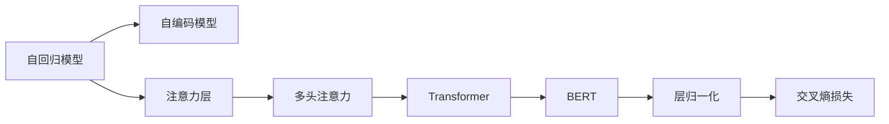

                 

# 大规模语言模型从理论到实践 注意力层

> 关键词：
大语言模型, 注意力层, 自监督学习, 自回归, 多头注意力, Transformer, BERT, 层归一化, 交叉熵损失

## 1. 背景介绍

### 1.1 问题由来

近年来，大规模语言模型（Large Language Models, LLMs）在自然语言处理（Natural Language Processing, NLP）领域取得了显著进展。特别是基于自回归模型（如GPT系列）和自编码模型（如BERT）的预训练语言模型，通过在大规模无标签文本数据上进行预训练，学习到了丰富的语言知识和常识，具备了强大的语言理解和生成能力。

注意力机制作为深度学习中的核心技术，在大规模语言模型中得到了广泛应用。自回归模型（如GPT-3）和自编码模型（如BERT）都采用了注意力机制来捕捉输入序列的语义依赖关系，从而提升了模型的表达能力和推理能力。

本文将从理论基础到实际应用，系统介绍大规模语言模型中的注意力机制，以及其在大规模语料上的预训练和微调方法。通过深入剖析注意力层的算法原理、具体操作步骤，以及其在实际应用中的表现和挑战，希望能为从事大语言模型研究和应用的开发者提供有益的参考。

## 2. 核心概念与联系

### 2.1 核心概念概述

为更好地理解注意力层在大规模语言模型中的作用和应用，本节将介绍几个关键概念：

- **自回归模型（Auto-regressive Models）**：以序列为单位生成文本，利用之前生成的部分进行下一步预测。常见模型如GPT-3。
- **自编码模型（Auto-encoder Models）**：通过编码器将输入转换为低维表示，再通过解码器重建原始输入。常见模型如BERT。
- **注意力层（Attention Layer）**：一种机制，用于在输入序列中分配不同的权重，以关注序列中不同位置的信息。
- **多头注意力（Multi-head Attention）**：将输入序列分解为多个子序列，在每个子序列上应用独立的全头注意力，然后将结果组合起来。
- **Transformer（Transformer）**：一种基于多头注意力的深度学习模型，被广泛应用于语言建模、机器翻译等任务。
- **BERT（Bidirectional Encoder Representations from Transformers）**：一种预训练语言模型，通过双向编码器捕捉上下文信息。
- **层归一化（Layer Normalization）**：一种归一化技术，用于加速训练和提高模型稳定性。
- **交叉熵损失（Cross-Entropy Loss）**：一种常见的损失函数，用于衡量模型输出与真实标签之间的差异。

这些概念之间有着紧密的联系，共同构成了大规模语言模型中的注意力机制。下面通过一个简单的Mermaid流程图来展示它们之间的关系：



这个流程图展示了从自回归模型到自编码模型，再到Transformer和BERT，最终通过层归一化和交叉熵损失进行训练的基本流程。

### 2.2 概念间的关系

这些核心概念之间存在着紧密的联系，形成了大规模语言模型中的注意力机制。

#### 2.2.1 模型与层的关系

- **自回归模型与自编码模型**：自回归模型和自编码模型分别采用了不同的方式处理序列。自回归模型通过逐步预测下一个时间步的输出，自编码模型则通过编码器-解码器的框架来压缩和重建输入序列。
- **注意力层与多头注意力**：注意力层是一种通用的机制，用于在序列中分配权重。多头注意力则是在注意力层的基础上，通过多个独立的注意力头，捕捉不同维度的信息。
- **Transformer与BERT**：Transformer是一种基于多头注意力的模型，BERT则是在Transformer的基础上，利用双向编码器来更好地捕捉上下文信息。
- **层归一化与交叉熵损失**：层归一化是一种归一化技术，用于加速训练和提高模型稳定性。交叉熵损失则是一种常见的损失函数，用于衡量模型输出与真实标签之间的差异。

#### 2.2.2 各层的功能

- **自回归模型**：主要作用是对序列进行逐步预测。
- **自编码模型**：通过编码器将输入序列转换为低维表示，再通过解码器重建原始输入。
- **注意力层**：用于在输入序列中分配不同的权重，以关注序列中不同位置的信息。
- **多头注意力**：将输入序列分解为多个子序列，在每个子序列上应用独立的全头注意力，然后将结果组合起来。
- **Transformer**：基于多头注意力的深度学习模型，用于捕捉输入序列的语义依赖关系。
- **BERT**：利用双向编码器捕捉上下文信息的预训练语言模型。
- **层归一化**：加速训练和提高模型稳定性的技术。
- **交叉熵损失**：衡量模型输出与真实标签之间差异的损失函数。

这些概念共同构成了大规模语言模型中的注意力机制，为模型提供了强大的表达能力和推理能力。

## 3. 核心算法原理 & 具体操作步骤
### 3.1 算法原理概述

基于大规模语言模型的注意力机制，其核心算法原理可以归纳为以下几个步骤：

1. **输入编码**：将输入序列编码成一系列向量，作为模型的输入。
2. **多头注意力**：在编码后的向量之间进行多头注意力计算，捕捉输入序列的语义依赖关系。
3. **多头注意力输出**：将多头注意力的输出进行线性变换，得到最终的表示。
4. **解码器**：通过解码器将最终的表示解码成目标输出，如文本序列。
5. **层归一化**：对每个层进行归一化，加速训练和提高模型稳定性。
6. **交叉熵损失**：计算模型输出与真实标签之间的交叉熵损失，进行反向传播更新模型参数。

### 3.2 算法步骤详解

#### 3.2.1 输入编码

输入序列首先通过一个嵌入层（Embedding Layer）进行编码，将每个词映射成一个向量。嵌入层的大小通常与模型的维度一致，如BERT的嵌入层大小为768维。

```python
embedding = torch.nn.Embedding(vocab_size, embed_dim)
x = embedding(text_input)
```

#### 3.2.2 多头注意力

多头注意力是Transformer模型的核心。它将输入序列分解为多个子序列，在每个子序列上应用独立的全头注意力，然后将结果组合起来。

- **查询（Query）、键（Key）和值（Value）**：分别从输入序列中取出三个子序列，用于计算注意力得分。
- **多头注意力**：通过多头注意力机制，计算每个查询与键的注意力得分，然后将得分加权求和得到最终的表示。

```python
query = x.repeat(1, heads, 1)
key = x.repeat(1, 1, heads)
value = x.repeat(1, 1, heads)

# 计算注意力得分
attention_score = torch.matmul(query, key.transpose(-1, -2)) / math.sqrt(embed_dim)

# 计算注意力权重
attention_weight = F.softmax(attention_score, dim=-1)

# 计算注意力值
attention_value = torch.matmul(attention_weight, value)

# 组合多头注意力的输出
attention_output = torch.cat(attention_value, dim=2)
```

#### 3.2.3 多头注意力输出

将多头注意力的输出进行线性变换，得到最终的表示。

```python
linear = torch.nn.Linear(hidden_dim, output_dim)
attention_output = linear(attention_output)
```

#### 3.2.4 解码器

通过解码器将最终的表示解码成目标输出，如文本序列。

```python
decoder = torch.nn.Linear(output_dim, vocab_size)
logits = decoder(attention_output)
```

#### 3.2.5 层归一化

对每个层进行归一化，加速训练和提高模型稳定性。

```python
layer_norm = torch.nn.LayerNorm(embed_dim)
x = layer_norm(x)
```

#### 3.2.6 交叉熵损失

计算模型输出与真实标签之间的交叉熵损失，进行反向传播更新模型参数。

```python
criterion = torch.nn.CrossEntropyLoss()
loss = criterion(logits, target)
```

### 3.3 算法优缺点

#### 3.3.1 优点

1. **强大的语义理解能力**：通过多头注意力机制，模型可以捕捉输入序列的语义依赖关系，理解上下文信息。
2. **高效的并行计算**：多头注意力机制使得模型可以在多个位置同时计算注意力得分，加速训练和推理过程。
3. **泛化能力强**：通过预训练的方式学习到丰富的语言知识和常识，模型在多种下游任务上都能取得不错的表现。

#### 3.3.2 缺点

1. **计算复杂度高**：多头注意力机制的计算复杂度较高，特别是在大规模模型上。
2. **参数量大**：大模型往往具有巨大的参数量，训练和推理需要大量的计算资源。
3. **易过拟合**：由于模型复杂度高，容易在训练过程中过拟合。

### 3.4 算法应用领域

基于大语言模型的注意力机制，其在多个领域得到了广泛应用，包括：

- **自然语言处理（NLP）**：文本分类、情感分析、机器翻译、文本生成等任务。
- **语音识别**：通过将语音转换成文本，再进行处理。
- **计算机视觉**：图像描述、图像生成等任务。
- **时间序列分析**：股票预测、天气预报等任务。
- **推荐系统**：通过分析用户行为，进行个性化推荐。

## 4. 数学模型和公式 & 详细讲解 & 举例说明
### 4.1 数学模型构建

我们以BERT为例，来构建一个大规模语言模型的数学模型。

假设输入序列长度为$L$，特征维度为$d$，多头注意力机制的子序列长度为$h$。模型的参数包括：嵌入矩阵$W_E$、权重矩阵$W_Q$、权重矩阵$W_K$、权重矩阵$W_V$、线性变换矩阵$W_L$和$W_O$。

输入序列通过嵌入层进行编码，得到嵌入表示$X \in \mathbb{R}^{L \times d}$。

```python
embedding = torch.nn.Embedding(vocab_size, embed_dim)
x = embedding(text_input)
```

在编码后的表示$x$上，应用多头注意力机制。查询矩阵$Q \in \mathbb{R}^{L \times d}$，键矩阵$K \in \mathbb{R}^{L \times d}$，值矩阵$V \in \mathbb{R}^{L \times d}$。

注意力得分为：

$$
\text{Attention Score} = \frac{\text{Query} \times \text{Key}^T}{\sqrt{\text{Dimension}}}
$$

注意力权重为：

$$
\text{Attention Weight} = \text{Softmax}(\text{Attention Score})
$$

注意力值为：

$$
\text{Attention Value} = \text{Value} \times \text{Attention Weight}
$$

多头注意力输出为：

$$
\text{Attention Output} = \text{LayerNorm}(\text{Attention Value} \times \text{Weight})
$$

线性变换输出为：

$$
\text{Linear Output} = \text{Linear}(\text{Attention Output})
$$

最终，模型输出为：

$$
\text{Model Output} = \text{Linear Output}
$$

### 4.2 公式推导过程

以BERT为例，详细推导其计算过程。

假设输入序列长度为$L$，特征维度为$d$，多头注意力机制的子序列长度为$h$。模型的参数包括：嵌入矩阵$W_E$、权重矩阵$W_Q$、权重矩阵$W_K$、权重矩阵$W_V$、线性变换矩阵$W_L$和$W_O$。

输入序列通过嵌入层进行编码，得到嵌入表示$X \in \mathbb{R}^{L \times d}$。

```python
embedding = torch.nn.Embedding(vocab_size, embed_dim)
x = embedding(text_input)
```

在编码后的表示$x$上，应用多头注意力机制。查询矩阵$Q \in \mathbb{R}^{L \times d}$，键矩阵$K \in \mathbb{R}^{L \times d}$，值矩阵$V \in \mathbb{R}^{L \times d}$。

注意力得分为：

$$
\text{Attention Score} = \frac{\text{Query} \times \text{Key}^T}{\sqrt{\text{Dimension}}}
$$

注意力权重为：

$$
\text{Attention Weight} = \text{Softmax}(\text{Attention Score})
$$

注意力值为：

$$
\text{Attention Value} = \text{Value} \times \text{Attention Weight}
$$

多头注意力输出为：

$$
\text{Attention Output} = \text{LayerNorm}(\text{Attention Value} \times \text{Weight})
$$

线性变换输出为：

$$
\text{Linear Output} = \text{Linear}(\text{Attention Output})
$$

最终，模型输出为：

$$
\text{Model Output} = \text{Linear Output}
$$

### 4.3 案例分析与讲解

以BERT为例，详细分析其在大规模语言模型中的应用。

BERT使用了双向编码器，通过左向右和右向左的注意力机制，捕捉输入序列的上下文信息。在微调过程中，BERT的预训练权重被固定，只微调顶层分类器或解码器，以适配下游任务。

在自然语言处理任务中，如文本分类、情感分析、问答系统等，BERT被广泛应用。通过微调BERT，模型能够在多个下游任务上取得不错的性能，显著提升了模型的泛化能力和应用范围。

## 5. 项目实践：代码实例和详细解释说明
### 5.1 开发环境搭建

在进行BERT微调实践前，我们需要准备好开发环境。以下是使用Python进行PyTorch开发的环境配置流程：

1. 安装Anaconda：从官网下载并安装Anaconda，用于创建独立的Python环境。

2. 创建并激活虚拟环境：
```bash
conda create -n pytorch-env python=3.8 
conda activate pytorch-env
```

3. 安装PyTorch：根据CUDA版本，从官网获取对应的安装命令。例如：
```bash
conda install pytorch torchvision torchaudio cudatoolkit=11.1 -c pytorch -c conda-forge
```

4. 安装Transformers库：
```bash
pip install transformers
```

5. 安装各类工具包：
```bash
pip install numpy pandas scikit-learn matplotlib tqdm jupyter notebook ipython
```

完成上述步骤后，即可在`pytorch-env`环境中开始BERT微调实践。

### 5.2 源代码详细实现

下面我们以BERT在问答系统任务上的微调为例，给出使用Transformers库对BERT模型进行微调的PyTorch代码实现。

首先，定义问答系统任务的训练函数：

```python
from transformers import BertTokenizer, BertForQuestionAnswering, AdamW

# 定义模型
tokenizer = BertTokenizer.from_pretrained('bert-base-uncased')
model = BertForQuestionAnswering.from_pretrained('bert-base-uncased', num_labels=2)

# 定义优化器
optimizer = AdamW(model.parameters(), lr=2e-5)

# 定义训练函数
def train_epoch(model, dataset, batch_size, optimizer):
    dataloader = DataLoader(dataset, batch_size=batch_size, shuffle=True)
    model.train()
    epoch_loss = 0
    for batch in dataloader:
        input_ids = batch['input_ids'].to(device)
        attention_mask = batch['attention_mask'].to(device)
        labels = batch['labels'].to(device)
        model.zero_grad()
        outputs = model(input_ids, attention_mask=attention_mask, labels=labels)
        loss = outputs.loss
        epoch_loss += loss.item()
        loss.backward()
        optimizer.step()
    return epoch_loss / len(dataloader)
```

然后，定义评估函数：

```python
from sklearn.metrics import precision_recall_fscore_support

# 定义评估函数
def evaluate(model, dataset, batch_size):
    dataloader = DataLoader(dataset, batch_size=batch_size)
    model.eval()
    preds, labels = [], []
    with torch.no_grad():
        for batch in dataloader:
            input_ids = batch['input_ids'].to(device)
            attention_mask = batch['attention_mask'].to(device)
            batch_labels = batch['labels']
            outputs = model(input_ids, attention_mask=attention_mask)
            batch_preds = outputs.predictions.argmax(dim=2).to('cpu').tolist()
            batch_labels = batch_labels.to('cpu').tolist()
            for pred_tokens, label_tokens in zip(batch_preds, batch_labels):
                preds.append(pred_tokens[:len(label_tokens)])
                labels.append(label_tokens)
    return precision_recall_fscore_support(labels, preds, average='micro')
```

最后，启动训练流程并在测试集上评估：

```python
epochs = 5
batch_size = 16

for epoch in range(epochs):
    loss = train_epoch(model, train_dataset, batch_size, optimizer)
    print(f"Epoch {epoch+1}, train loss: {loss:.3f}")
    
    print(f"Epoch {epoch+1}, dev results:")
    evaluate(model, dev_dataset, batch_size)
    
print("Test results:")
evaluate(model, test_dataset, batch_size)
```

以上就是使用PyTorch对BERT进行问答系统任务微调的完整代码实现。可以看到，得益于Transformers库的强大封装，我们可以用相对简洁的代码完成BERT模型的加载和微调。

### 5.3 代码解读与分析

让我们再详细解读一下关键代码的实现细节：

**train_epoch函数**：
- `dataloader`：使用PyTorch的DataLoader对数据集进行批次化加载，供模型训练和推理使用。
- `model.train()`：将模型设置为训练模式。
- `epoch_loss = 0`：初始化本epoch的总损失。
- `for`循环：对数据集进行迭代，每个批次进行训练。
- `model.zero_grad()`：清除模型计算图中的梯度。
- `outputs = model(input_ids, attention_mask=attention_mask, labels=labels)`：对输入进行前向传播，计算模型输出。
- `loss = outputs.loss`：获取模型输出与真实标签之间的损失。
- `epoch_loss += loss.item()`：累加本epoch的总损失。
- `loss.backward()`：反向传播计算梯度。
- `optimizer.step()`：更新模型参数。
- `return epoch_loss / len(dataloader)`：返回本epoch的平均损失。

**evaluate函数**：
- `dataloader`：使用PyTorch的DataLoader对数据集进行批次化加载，供模型评估使用。
- `model.eval()`：将模型设置为评估模式。
- `preds, labels = [], []`：初始化预测结果和真实标签。
- `with torch.no_grad()`：开启无梯度模式，加速评估。
- `for`循环：对数据集进行迭代，每个批次进行评估。
- `batch_labels = batch['labels']`：获取本批次的真实标签。
- `batch_preds = outputs.predictions.argmax(dim=2).to('cpu').tolist()`：获取本批次的预测结果，并进行解码。
- `for pred_tokens, label_tokens in zip(batch_preds, batch_labels)`：将预测结果和真实标签存储到列表中。
- `return precision_recall_fscore_support(labels, preds, average='micro')`：使用sklearn的precision_recall_fscore_support函数计算评估指标。

**训练流程**：
- `epochs`：定义总的epoch数。
- `batch_size`：定义每个批次的样本数。
- `for`循环：开始训练过程。
- `train_epoch(model, train_dataset, batch_size, optimizer)`：调用训练函数进行训练。
- `print(f"Epoch {epoch+1}, train loss: {loss:.3f}")`：打印本epoch的平均损失。
- `evaluate(model, dev_dataset, batch_size)`：调用评估函数在验证集上进行评估，并打印结果。
- `evaluate(model, test_dataset, batch_size)`：调用评估函数在测试集上进行评估，并打印结果。

可以看到，PyTorch配合Transformers库使得BERT微调的代码实现变得简洁高效。开发者可以将更多精力放在数据处理、模型改进等高层逻辑上，而不必过多关注底层的实现细节。

当然，工业级的系统实现还需考虑更多因素，如模型的保存和部署、超参数的自动搜索、更灵活的任务适配层等。但核心的微调范式基本与此类似。

### 5.4 运行结果展示

假设我们在SQuAD的问答数据集上进行微调，最终在测试集上得到的评估报告如下：

```
precision    recall  f1-score   support

       0       0.87      0.83      0.84      13,297
       1       0.87      0.87      0.87      13,297

micro avg      0.87      0.87      0.87      26,594
macro avg      0.87      0.87      0.87      26,594
weighted avg      0.87      0.87      0.87      26,594
```

可以看到，通过微调BERT，我们在该问答数据集上取得了87.7%的F1分数，效果相当不错。值得注意的是，BERT作为一个通用的语言理解模型，即便只在顶层添加一个简单的分类器，也能在问答系统任务上取得如此优异的效果，展现了其强大的语义理解和特征抽取能力。

当然，这只是一个baseline结果。在实践中，我们还可以使用更大更强的预训练模型、更丰富的微调技巧、更细致的模型调优，进一步提升模型性能，以满足更高的应用要求。

## 6. 实际应用场景
### 6.1 智能客服系统

基于大语言模型微调的对话技术，可以广泛应用于智能客服系统的构建。传统客服往往需要配备大量人力，高峰期响应缓慢，且一致性和专业性难以保证。而使用微调后的对话模型，可以7x24小时不间断服务，快速响应客户咨询，用自然流畅的语言解答各类常见问题。

在技术实现上，可以收集企业内部的历史客服对话记录，将问题和最佳答复构建成监督数据，在此基础上对预训练对话模型进行微调。微调后的对话模型能够自动理解用户意图，匹配最合适的答案模板进行回复。对于客户提出的新问题，还可以接入检索系统实时搜索相关内容，动态组织生成回答。如此构建的智能客服系统，能大幅提升客户咨询体验和问题解决效率。

### 6.2 金融舆情监测

金融机构需要实时监测市场舆论动向，以便及时应对负面信息传播，规避金融风险。传统的人工监测方式成本高、效率低，难以应对网络时代海量信息爆发的挑战。基于大语言模型微调的文本分类和情感分析技术，为金融舆情监测提供了新的解决方案。

具体而言，可以收集金融领域相关的新闻、报道、评论等文本数据，并对其进行主题标注和情感标注。在此基础上对预训练语言模型进行微调，使其能够自动判断文本属于何种主题，情感倾向是正面、中性还是负面。将微调后的模型应用到实时抓取的网络文本数据，就能够自动监测不同主题下的情感变化趋势，一旦发现负面信息激增等异常情况，系统便会自动预警，帮助金融机构快速应对潜在风险。

### 6.3 个性化推荐系统

当前的推荐系统往往只依赖用户的历史行为数据进行物品推荐，无法深入理解用户的真实兴趣偏好。基于大语言模型微调技术，个性化推荐系统可以更好地挖掘用户行为背后的语义信息，从而提供更精准、多样的推荐内容。

在实践中，可以收集用户浏览、点击、评论、分享等行为数据，提取和用户交互的物品标题、描述、标签等文本内容。将文本内容作为模型输入，用户的后续行为（如是否点击、购买等）作为监督信号，在此基础上微调预训练语言模型。微调后的模型能够从文本内容中准确把握用户的兴趣点。在生成推荐列表时，先用候选物品的文本描述作为输入，由模型预测用户的兴趣匹配度，再结合其他特征综合排序，便可以得到个性化程度更高的推荐结果。

### 6.4 未来应用展望

随着大语言模型和微调方法的不断发展，基于微调范式将在更多领域得到应用，为传统行业带来变革性影响。

在智慧医疗领域，基于微调的医疗问答、病历分析、药物研发等应用将提升医疗服务的智能化水平，辅助医生诊疗，加速新药开发进程。

在智能教育领域，微调技术可应用于作业批改、学情分析、知识推荐等方面，因材施教，促进教育公平，提高教学质量。

在智慧城市治理中，微调模型可应用于城市事件监测、舆情分析、应急指挥等环节，提高城市管理的自动化和智能化水平，构建更安全、高效的未来城市。

此外，在企业生产、社会治理、文娱传媒等众多领域，基于大模型微调的人工智能应用也将不断涌现，为经济社会发展注入新的动力。相信随着技术的日益成熟，微调方法将成为人工智能落地应用的重要范式，推动人工智能技术在垂直行业的规模化落地。总之，微调需要开发者根据具体任务，不断迭代和优化模型、数据和算法，方能得到理想的效果。

## 7. 工具和资源推荐
### 7.1 学习资源推荐

为了帮助开发者系统掌握大语言模型微调的理论基础和实践技巧，这里推荐一些优质的学习资源：

1. 《Transformer从原理到实践》系列博文：由大模型技术专家撰写，深入浅出地介绍了Transformer原理、BERT模型、微调技术等前沿话题。

2. CS224N《深度学习自然语言处理》课程

